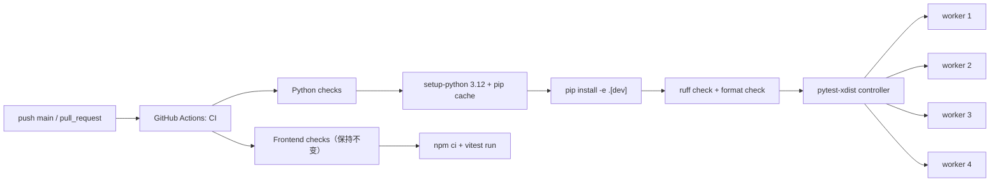
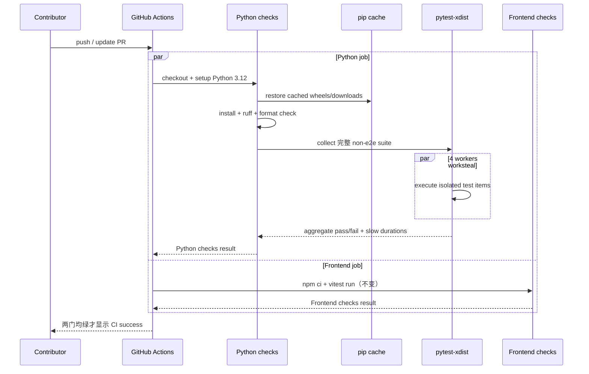

# perf-458: CI 提速 — 技术方案

> 对齐: motivation.md v1
>
> Unit branch: `unit/perf-458` (will be created by orchestrator)

## Changelog

- 2026-07-11 (R4): code review 通过 base/head mutation 证实 timeout fallback 与 ShellRunner callback 两处测试假绿；增加零等待 timeout unit 回归，并以 stopper monitor `wait()` 建立严格完成信号，不改变生产 timeout/stop 语义
- 2026-07-10 (M1): 最终采用最简单且远端三轮全绿的 4 worker；完整 required checks 为 91–96 秒，相比约 3分34秒基线大幅提速，用户明确接受未达到 90 秒的结果并停止继续调参 — 详见 `M1-ci-fast-path/progress.md`

## 现状分析

### 涉及范围

- `.github/workflows/ci.yml`：当前 CI 唯一入口。`python` 与 `frontend` 两个 job 并行；Python 串行执行全部非 e2e pytest，Frontend 执行全部 vitest。
- `pyproject.toml`：Python 运行时与 dev 依赖、pytest 全局配置的单一入口；当前没有 pytest 并行执行依赖。
- `tests/im_service/integration/test_agent_create_flow.py`、`test_gateway_im_direct_chat.py`、`test_gateway_im_group_chat.py`、`test_heartbeat_config_sync_pipeline.py`、`test_gateway_im_roundtrip.py`：各自目标是 Agent 创建、配置同步、会话配置版本或 heartbeat 同步，但都在在线 Gateway 场景同步读取默认 `source=live` 配置，主测试线程无法同时回复 WS RPC，因而每次吃满 5 秒 fallback timeout 后才继续。
- `tests/unit/agent/background_tasks/test_platform_adapters.py`：两条 ShellRunner 负断言用 `Event.wait(5.0)` 证明“回调没有发生”，另一条输出上限测试以 1 KiB 小块累计写满 256 MiB；三条合计约 17.8 秒。
- `src/IM/api/routes/agents.py`、`src/IM/ws/gateway_handler.py`、`src/agent/platform/background_tasks/file_output.py`：只读 grounding，生产 live RPC timeout 与输出上限不变。`src/agent/platform/background_tasks/shell_runner.py` 仅为返回的内部 stopper 增加 monitor `wait()`，供测试等待真实终态，不改变 `stop()` 或 callback 语义。
- `src/IM/frontend/`：CI job 当前 62–71 秒，已经满足 90 秒目标；本 unit 只做回归验证，不改前端源码、配置或测试命令。

### 既有约束

- `feat-388` 建立的远端兜底契约必须保留：Python 与 Frontend 两个 job 任一失败都阻止合并；Python 仍覆盖 ruff、format 与完整非 e2e pytest，Frontend 仍覆盖完整 vitest。
- `docs/TESTING_GUIDE.md` 要求测试证明行为、按最低有效层覆盖且不重复；提速不能靠删掉仍有价值的行为断言、skip/xfail 或降低门禁范围。
- `pytest -m "not e2e"` 必须继续排除需要真实服务、浏览器或 LLM 的 e2e；本 unit 不把 e2e 引入常规 CI。
- 产品包依赖边界由 `tests/contract/` 把守；本 unit 不改变 `agent.sdk`、IM、Gateway 或 CLI 对外契约。唯一 `src/` delta 是 ShellRunner 内部 stopper 的 testability seam。
- 用户已明确优先简单、合理、显著提速；不引入 self-hosted runner、付费大 runner、动态测试选择平台或跨机器复杂调度。

### 可复用能力

- `actions/setup-python@v5` 已在现有 workflow 中使用，可直接启用其 pip cache，无需更换 Python 环境管理器。
- pytest 已是唯一 Python 测试入口；增加 `pytest-xdist` 后仍由同一命令收集完整套件。`--dist worksteal` 可把长尾用例动态分配给空闲 worker，无需维护静态 shard 清单。
- 现有测试隔离基础足够：本地对完整非 e2e 套件分别以 4、8 个 xdist worker 运行，均全绿；4 worker 从串行 141.61 秒降到 52.73 秒，8 worker 为 42.35 秒。
- `tests/im_service/integration/test_agent_config_api.py` 已有专门的并发 live-config 测试，真实覆盖 `agent.config.get → agent.config → GET 返回 live 数据`；本 unit 的五条慢测试无需重复覆盖这条协议。
- IM 配置接口已有 `source=mirror`，配置同步相关测试和 Gateway 自身同步路径也已使用它；需要持久化版本而非 live 快照的测试可直接沿用。
- 测试树已有基于条件轮询等待线程/进程终态的模式，可替代固定睡满 5 秒的负断言。

### 相关历史

- `feat-388-convention-guardrails` 创建当前双 job CI，并明确前后端任一红即阻止合并；本 unit 只缩短其反馈时间，不改变门禁语义。
- `refactor-372-test-suite-health` 确立测试分层与“非 e2e 快层全绿”的基线；本 unit 继续以同一 marker 口径运行。
- `bugfix-417-timeout-tool-wedges-session` 引入两条 ShellRunner 竞态回归测试，其“stop 不得上报失败、stop+timeout 后不得泄漏 `_stopped`”意图必须保留；只改等待终态的方式。
- `feat-447-feishu-channel` 等后续 unit 使非 e2e 用例增长到约 3,445 条，串行全量测试成为当前瓶颈。
- 契约层 grounding：`docs/specs/im/spec.md` 的 live/mirror Agent 配置行为与当前路由一致；`docs/specs/kernel/spec.md` 的 bash 输出上限、超时/停止语义与当前实现一致。设计不改变这些行为，因此不存在契约 drift，也不产生 delta-spec。

## 架构总览

本 unit 不重构 CI 拓扑，仍保留两个并行 job。变化只发生在 Python job 内部：复用现有安装和检查顺序，增加依赖缓存，把 pytest 的单进程执行改成固定 4 worker，并先移除测试套件中最明显的固定等待。



**Before**：Python job 每次重新安装依赖后，由一个 pytest 进程串行执行约 3,445 条用例，少数固定等待占据显著墙钟时间。

**After**：Python job 缓存下载产物、以 4 worker 动态均衡完整测试集；测试断言等待真实完成条件，不再把无关的生产 timeout 当作测试步骤。Frontend job 和所有门禁结果保持原样。

## 关键决策

### 决策 1: 先消除测试中的确定性等待，不修改生产 timeout/stop 语义

**生产超时与 stop/callback 行为保持不变；允许最小内部完成信号支撑严格负断言。**

- **理由**：五条 IM 测试并不以 live-config fallback 为被测行为，ShellRunner 测试也只需等待实际终态；直接缩短生产 timeout 会改变用户行为且掩盖测试结构问题。
- **拒绝**：全局降低 `request_agent_config` 的 5 秒 timeout——会改变在线 Gateway 慢响应时的产品容错；给慢测简单加 skip——会丢失回归信号。
- **风险**：删掉重复的 WS 帧断言时可能误删 live-config 唯一覆盖；由专门的 `test_agent_config_api.py` live-config 用例继续把守该协议。

### 决策 2: Python job 内使用 4 个 xdist worker，不拆 GitHub Actions matrix

**保留单个 `Python checks` job，以 `pytest -n 4 --dist worksteal` 并行完整非 e2e 套件。**

- **理由**：4-worker 是最初、最简单且普通 GitHub runner 三轮均 success 的配置，完整 required checks 为 94/91/96 秒，相比约 3分34秒基线已大幅缩短；8-worker 真实触发并发敏感测试，6-worker 虽三轮 success 仍有一轮 95 秒。遵循“达不到 90 秒不追加复杂方案”的既定边界和用户停止调参的明确决策，最终接受 4-worker 的 90 秒验收例外。单 job 不改变 branch protection check 名称，不复制 checkout/install，也不引入 shard 清单和聚合 job。
- **拒绝**：多 runner matrix 分片——会增加 workflow、聚合、排队和资源成本；动态选测——会改变覆盖语义；self-hosted/大 runner——超出首文档非目标。
- **风险**：隐藏的跨测试共享状态可能在 CI 并行时暴露；完整本地并行基线已通过，实施仍需在真实 GitHub runner 上验证，出现 flaky 时可一行退回串行命令。

### 决策 3: 沿用 pip，只启用 setup-python 原生缓存

**在现有 `actions/setup-python@v5` 上增加 pip cache，安装命令保持不变。**

- **理由**：这是对现有 workflow 的最小增量，可减少重复下载且不改变开发者安装方式。
- **拒绝**：迁移 uv/Poetry、提交新的 lock/环境体系或缓存整个虚拟环境——收益尚不需要这些额外约定和维护成本。
- **风险**：首次 cache miss 仍需完整安装；90 秒目标以常规 run 为主，冷缓存 run 记录但不为它扩建复杂方案。

### 决策 4: Frontend job 保持不变

**Frontend 继续执行 `npm ci && npm run test`，不分片、不改 jsdom 配置。**

- **理由**：远端基线 62–71 秒已经满足 90 秒目标，继续优化不会缩短由 Python 决定的关键路径。
- **拒绝**：Vitest 分片、按路径跳过或改变测试环境——会增加复杂度，且不是当前瓶颈。
- **风险**：前端测试继续增长后可能再次接近目标上限；届时应基于新 benchmark 另立小优化，不在本 unit 预先设计。

### 决策 5: 用现有 CI 时间戳与 pytest durations 验收，不建设性能平台

**在 pytest 命令输出慢用例摘要，并以 GitHub Actions job/step 时间戳记录优化前后结果。**

- **理由**：GitHub 已提供每个 job/step 的开始与完成时间；pytest durations 足以定位回归，不需要持久化性能数据库。
- **拒绝**：新增 benchmark 服务、历史趋势数据库或复杂告警——超出“简单合理”的范围。
- **风险**：共享 runner 有自然抖动；验收记录多次常规成功 run，并明确排除外部排队时间。

## 接口与数据流

本 unit 没有新增产品 API、协议字段或持久化数据。唯一接口变化是开发工具链命令和测试内部同步方式。

### CI 执行契约

| 位置 | 设计后行为 |
|---|---|
| `pyproject.toml` dev dependencies | 增加 `pytest-xdist>=3,<4`，其余 pytest/ruff 约束不变 |
| `actions/setup-python@v5` | 保持 Python 3.12；增加 `cache: pip` 与以 `pyproject.toml` 为依赖缓存键来源 |
| Python lint | `ruff check .`、`ruff format --check .` 原样保留 |
| Python tests | `pytest -m "not e2e" -n 4 --dist worksteal --durations=20 --durations-min=0.5` |
| Frontend tests | `npm ci`、`npm run test` 原样保留 |
| 成败语义 | 两个 job 任一失败则 workflow 失败；check 名称不变 |

### 慢测试改写边界

| 测试组 | 现状 | 设计后 |
|---|---|---|
| 五条 IM 创建/配置同步旅程 | 同步 `GET source=live` 后才处理 WS 回包，稳定等待 5 秒；随后消费的 WS 帧不属于该测试主目标 | 读取持久化版本时显式用 `source=mirror`，删除与主目标无关的 stale `agent.config.get/agent.config` 往返；创建、PATCH、config.sync、relay 等原断言保留 |
| ShellRunner stop 负断言 | `done.wait(5.0)` 以睡满超时证明没有失败回调 | stopper `wait()` join monitor 线程；monitor 完成后再执行“不出现 fail”与清理断言，timeout 仅作失败兜底 |
| 256 MiB 输出上限 | 1 KiB 小块执行约 26 万次文件打开/追加 | 先断言生产常量仍为 256 MiB，再在测试进程内 monkeypatch 为小上限，以少量写入覆盖“上限内保留、越界只写一次截断提示”的同一行为 |

### 主流程时序



## 契约层增量 (delta-spec)

- kernel: no spec delta
- im: no spec delta
- gateway: no spec delta
- cli: no spec delta

本 unit 只改变仓库开发门禁的执行效率，不改变四个产品包的消费者可观察行为，因此不创建 delta-spec 文件。

## 风险与回退

- **并行测试暴露共享状态**：最终采用已完成本地全量和远端三轮 success 验证的 `-n 4 --dist worksteal`；8-worker 探索已证明会触发两条并发敏感测试，故不采用，问题单独登记 #185。本 unit 不扩 scope 修历史测试，也不引入测试分组或额外调度机制。
- **慢测试改写造成覆盖缩水**：每条改写用 mutation 证明对应生产回归会使测试转红；live 成功与 connected-silent timeout 分开守护；ShellRunner 以 monitor join 建立严格完成信号。
- **pip cache 首次未命中**：允许冷启动较慢，不额外引入环境管理器；缓存恢复失败时 setup-python 自动退化为正常安装，不影响正确性。
- **GitHub runner 性能抖动**：90 秒只衡量 runner 开始后的常规成功 run，不含排队；验收保留至少三次 run 的 job/step 时间戳，避免用单次最好结果下结论。
- **达不到 90 秒**：若完成本设计全部简单优化后仍未达标，不在本 unit 追加 matrix、自建 runner 或动态选测；如实记录结果并由后续新 unit 决定是否值得增加复杂度。
- **整体回滚**：workflow 命令可退回原串行 pytest，pyproject 删除 xdist 依赖，测试改写可逐文件 revert；任何回滚都不触碰产品运行时或数据。

## Runbook for Reviewer

**无常驻服务。** 本 unit 只改 CI、dev 依赖、测试代码与 ShellRunner 内部完成信号，不需要启动 IM、Gateway、CLI 或浏览器。

**Review 驱动方式**：以真实 GitHub Actions PR workflow 作为端到端真栈；本 unit 不改产品客户端面。本地命令用于预检，最终性能证据必须来自普通 GitHub 托管 runner：

1. 在 unit PR 上运行完整 CI，记录 run 创建时间、两个 job 的 started/completed 时间及 Python 各 step 时间。
2. 确认 Python 与 Frontend 两门均绿，记录 runner 开始后到全部 required checks 完成的时间；排队时间单列、不混入执行耗时。最终 4-worker 三次为 94/91/96 秒，按用户决策接受。
3. 对至少三次常规成功 run 重复记录，不得只用 rerun 的最佳一次；本次三次均 success。
4. 检查一次真实失败 run 或在临时提交中引入可恢复的测试失败，确认对应 job 仍红且修复后恢复绿色。

本地预检命令：

```bash
.venv/bin/ruff check .
.venv/bin/ruff format --check .
.venv/bin/pytest -m "not e2e" -n 4 --dist worksteal --durations=20 --durations-min=0.5
cd src/IM/frontend && npm run test
```

## Milestones

采用单 M1。全部改动围绕同一个可独立验收的结果“现有完整 CI 以同等质量信号大幅缩短反馈时间”，范围约 8 个文件且无必须跨环境分阶段的依赖；拆成“测试清理 / CI 并行 / 缓存”会形成横切 milestone，增加协调而不能独立交付用户价值。

| ID | 标题 | 依赖 | 并行组 | 范围 | 退出标准 |
|---|---|---|---|---|---|
| perf-458-M1 | ci-fast-path | — | A | `.github/workflows/ci.yml`；`pyproject.toml`；`src/agent/platform/background_tasks/shell_runner.py`；`tests/im_service/unit/test_gateway_handler.py`；`tests/im_service/integration/test_agent_create_flow.py`；`tests/im_service/integration/test_gateway_im_direct_chat.py`；`tests/im_service/integration/test_gateway_im_group_chat.py`；`tests/im_service/integration/test_heartbeat_config_sync_pipeline.py`；`tests/im_service/integration/test_gateway_im_roundtrip.py`；`tests/unit/agent/background_tasks/test_platform_adapters.py` | `[reviewer]` 覆盖 motivation 全部 Scenario：现有 Python/Frontend 失败仍使 CI 红，普通托管 runner 重跑无需人工环境；90 秒目标按用户最终决策接受 4-worker 三次 success 94/91/96 秒的验收例外，相比约 3分34秒基线仍大幅缩短。<br>`[reviewer]` IM、Gateway、Coding CLI 与 agent 内核的既有用户行为不变。<br>`[worker]` 五条 IM 慢测不再等待 live-config 5 秒 fallback；connected-silent timeout 由零等待 unit test 守护；两条 ShellRunner 负断言等待 monitor 真正完成；输出上限测试不再写满 256 MiB。<br>`[worker]` 两处回归均有 mutation red 证据；完整 n4、串行 non-e2e、ruff 两门与 frontend vitest 全绿。<br>`[worker]` 真实 GitHub Actions 三次 success 留下 job/step 时间戳；Python/Frontend check 名称与失败阻断语义不变。<br>`[worker]` 仅新增 ShellRunner 内部完成信号，生产 timeout/stop 行为不变，四包 no spec delta；性能与 closure 证据写入 `M1-ci-fast-path/progress.md`。 |
