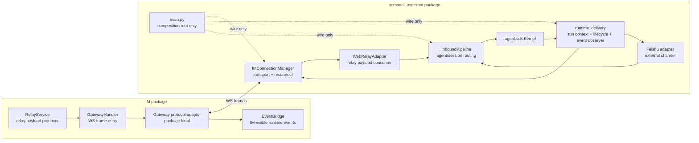
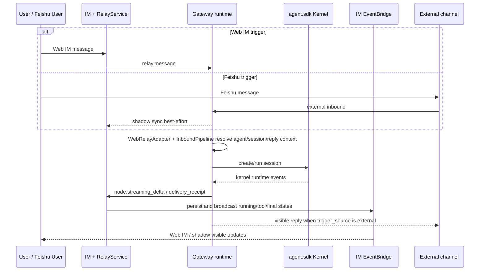
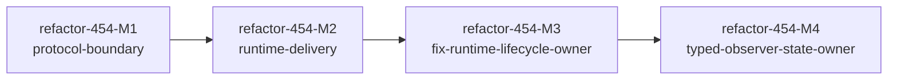

# refactor-454: gateway runtime protocol — 技术方案

> 对齐: motivation.md v1
> Unit branch: `unit/refactor-454` (will be created by orchestrator)

## Changelog

- 2026-07-07 (post-acceptance round 1): add `refactor-454-M3` to close verifier/code-review findings on runtime delivery ownership and typed-store relay accepted receipts.
- 2026-07-07 (post-verification round 2): add `refactor-454-M4` to make the kernel-event observer use `RunDeliveryContextStore` typed state as the runtime owner instead of mutating `legacy_contexts` as the primary state surface.

## 现状分析

### 涉及范围

- `src/personal_assistant/main.py` 是当前 Gateway composition root，也是本 unit 的核心重构点。`build_runtime()` 负责装配 kernel、channel registry、IM connection、heartbeat、cron、outbound router、config sync、background sender 等对象；同时 `_build_relay_lifecycle_callback()` 和 `_build_kernel_event_observer()` 直接承担 relay lifecycle、run context、Feishu ack、running/tool/permission 状态上报、外部 channel 可见回复镜像、失败清理等运行期语义。它还承载 heartbeat/cron 主动投递的 owner lazy-direct 路径：这类 run 没有 shadow conversation id，先保存 `to_user_id=owner_user_id`，等第一段真实 assistant 内容出现后才发 `turn_start{to_user_id}` 创建 canonical owner 直聊气泡。
- `src/personal_assistant/ws/im_connection.py` 负责 Gateway 到 IM 的 WebSocket 连接、注册、心跳、ack、重连、下行 frame dispatch 和上行 reporter 绑定。本 unit 不改变它的传输职责，但需要保证抽出的 protocol/runtime 模块仍由它驱动，不把业务语义塞回 transport 层。
- `src/personal_assistant/channels/web_relay_adapter.py` 负责把 IM `relay.message` payload 解析成 `InboundMessage`，并维护 relay dedup、shadow identity 和 metadata 展开。本 unit 会沿用它作为 Gateway inbound 边界，避免让上游 `main.py` 继续散读 relay metadata。
- `src/personal_assistant/gateway/session_keys.py` 和 `src/personal_assistant/gateway/inbound_pipeline.py` 负责 session key、reply context、agent 选择、群聊 mention gate、session metadata 组装。本 unit 不改变这些用户语义，只把调用点收口到更明确的 runtime context。
- `src/IM/ws/gateway_handler.py` 负责 IM 侧 Gateway WS frame 入口，当前同时处理 `node.register`、`node.streaming_delta`、`node.delivery_receipt`、`agent.message`、relay 状态落库和 EventBridge 投递。本 unit 需要给这些 frame 增加更清晰的 IM 侧 protocol adapter / handler 边界，但不改变 frame 的用户可观察语义。
- `src/IM/application/relay_service.py` 负责构造 relay payload 和 metadata，包括 `external_source`、`external_chat_id`、`agent_id`、`conversation_type`、`trigger_source` 等字段。它是 IM -> Gateway runtime protocol 的事实生产者，应继续作为 IM 侧 relay 入口。
- `src/IM/application/event_bridge.py` 负责 IM 内部消息、running placeholder、tool/permission/thinking/complete 等用户可见事件的持久化和实时广播。本 unit 不把这些职责迁到 Gateway，只让 Gateway 侧上报变得更清晰。
- `src/personal_assistant/channels/feishu/adapter.py` 负责 Feishu 私聊/群聊 inbound/outbound 和 external metadata。Feishu/shadow 是本 unit 必须纳入的回归基线，设计不能把 IM shadow path 和 Feishu 主路径耦死。

### 既有约束

- `personal_assistant` 只能通过 `agent.sdk` 使用内核，不得 import `agent.core` / `agent.platform` 内部；`IM` 不 import `agent`；`coding_cli` / `personal_assistant` / `IM` 之间禁止相互 import。
- Gateway/IM runtime protocol 不能通过一个让 IM 和 Gateway 双方直接 import 的业务 Python 包来共享实现，否则会和现有包边界冲突。更合适的方式是两侧各有 package-local adapter/parser，并通过契约测试、fixture、长青 spec 对齐字段语义。
- 本 unit 是纯 refactor：用户入口、Web IM/Feishu 行为、shadow 会话、running/failure/recovery 状态、workspace 行为必须保持一致；内部字段位置、内部 protocol 表示、内部持久化形态可以变。
- IM 是 Gateway 的中心协作服务，但 Feishu 等外部 channel 的主路径不能因为 IM 暂时离线而失效；shadow 同步失败只能影响内部镜像，不应破坏外部回复。
- `workspace_root` 的运行时权威在 Gateway 本地配置。IM profile 里的 workspace 值只能用于展示或 first-seen seed，不能覆盖 Gateway runtime 实际工作区。

### 契约层 grounding 结论

- Gateway/IM 现有契约与代码大体一致：`node.register` 上报 agent workspace、IM first-seen agent profile seed、relay/shadow external metadata、external session key、delivery receipt、running placeholder、heartbeat ack timeout 与 reconnect 都有现有实现和相关测试。heartbeat/cron 有内容时投递到 owner canonical 直聊、无内容时静默跳过，是既有 Gateway 契约，不属于 shadow delivery。
- 明确发现一处 drift：Gateway 契约要求 runtime `workspace_root` 以 Gateway 本地配置为准。`_IMConfigSyncClient.sync_agent()` 已基本遵守 local-wins，但 `_IMConfigSyncClient.reconcile_all_agents()` 在 profile version 路径上仍可能从 IM payload 读取 `workspace_root` 写回 runtime memory。这会把 IM mirror 字段误当成运行时权威，应纳入本 unit 的协议权威收束。
- 本 unit 不产生新的用户可观察 Requirement，因此不应创建 delta-spec 文件；但需要在 design 中明确 `no spec delta`，并在实现中用回归测试证明既有 Gateway/IM/Feishu 契约未漂移。

### 可复用能力

- `RelayService.enqueue_message_relay()` 已经集中生产 IM -> Gateway relay payload，可作为 IM 侧协议生产边界扩展，而不是另建一套 relay builder。
- `WebRelayAdapter.accept_relay()` / `RelayEnvelope` 已经集中解析 Gateway inbound relay，可作为 Gateway 侧协议消费边界扩展。
- `session_keys.build_session_key()` / `build_reply_context()` 已经表达了 external session identity 与 per-run reply target 的拆分，应继续复用为运行期身份的底层规则。
- `InboundPipeline` 已有 agent 选择、群聊 mention gate、session metadata 组装和 `/stop` 语义，应继续作为 inbound routing owner，不把这些规则搬进新 runtime delivery 模块。
- `EventBridge` 是 IM 侧 runtime event 持久化和实时广播 owner，应继续接收 Gateway 上报并产生 UI 可见事件。
- 现有测试可作为回归骨架：`test_gateway_relay_lifecycle.py`、`test_gateway_im_resilience.py`、`test_gateway_web_relay_adapter.py`、`test_external_visible_delivery.py`、`test_gateway_websocket_api.py`、`test_gateway_im_config_sync.py`、`test_gateway_reconcile_on_connect.py`、`test_gateway_upstream_reporter.py`。

### 相关历史

- `bugfix-404` 固化了 `workspace_root` local-wins、`node.register.agent_workspaces` first-seen seed 和 background notification realtime path，本 unit 不能回退这些约束。
- `feat-447` 固化了 external channel 的四类身份拆分：kernel session identity、IM shadow conversation identity、per-run `ReplyContext`、agent profile identity。Feishu 私聊/群聊、shadow conversation、未 @ 群消息上下文和外部可见回复镜像都要沿用这组不变量。
- Gateway/IM liveness 相关历史修复已经证明 heartbeat ack timeout、half-open reconnect 和 running 状态收口是用户可见稳定性的关键边界，本 unit 的模块抽取必须把这些场景作为回归基线。
- `refactor-387` 后内核是进程内库，没有独立 Kernel HTTP API；本 unit 不能重新引入旧式 kernel service / managed HTTP 边界。

## 架构总览

核心方向：保留现有产品边界，把“协议解释”和“运行期投递语义”从 Gateway composition root 中拆成两个深模块；IM 侧也只在本包内收口 Gateway frame 解释，不跨包共享业务实现。



Before: `main.py` 装配对象的同时解释 relay lifecycle、run context、kernel event、external mirror 和 IM 状态上报。

After: `main.py` 只组装对象；Gateway 运行期语义进入 `runtime_delivery`；IM 侧 frame 解释进入 package-local protocol adapter；relay/shadow/session 既有 owner 不变。

这张图故意不改变产品链路，只改变每段语义的 owner：IM 负责 IM 可见事件，Gateway 负责运行期上下文和外部可见投递，内核仍只通过 `agent.sdk` 被调用。

## 关键决策

### 决策 1: Gateway/IM 协议边界

**选了两侧 package-local adapter/parser + fixture/contract tests，不做跨包共享业务协议实现。**

- **理由**: 现有包边界禁止 `IM` 与 `personal_assistant` 互相 import；两侧对同一 frame 的关注点也不同，IM 关心落库/广播/relay 状态，Gateway 关心 run context/reply target/external delivery。
- **拒绝**: 共享 Python 包。它会让 IM/Gateway 形成运行时知识泄漏，后续更容易出现双向耦合。
- **拒绝**: 继续散落 dict metadata。它无法解决 A 的根因，`main.py` 仍要懂太多协议暗号。
- **风险**: 两侧 adapter 会有少量 schema 表达重复；必须用固定 fixture 和 contract tests 对齐 `relay.message`、`node.streaming_delta`、`delivery_receipt`、external identity、workspace local-wins 等字段语义。

### 决策 2: Gateway runtime delivery owner

**选了新增 Gateway 本地 `runtime_delivery` 模块承接 run context、relay lifecycle 和 kernel event translation，`main.py` 只负责组装。**

- **理由**: F 的核心不是 `main.py` 行数多，而是 composition root 直接承担运行期业务语义。把 delivery 语义收口后，Gateway 对 IM/Feishu/shadow/running 状态的解释能被单独测试。
- **拒绝**: 只把 `_build_kernel_event_observer()` 挪到另一个文件。纯搬家不能解决 run context、lifecycle、external mirror 多处共同解释同一事实的问题。
- **拒绝**: 把 delivery 语义塞进 `IMConnectionManager`。transport 层应只负责连接、重连、ack、dispatch，不应理解 agent run 状态。
- **风险**: 抽取时最容易漏掉 cleanup 分支，造成永久 running、重复 delivery receipt 或外部 channel 重复回复；M2 必须保留现有 lifecycle 单测并补齐失败/取消/后台任务场景。

### 决策 3: 运行期身份、投递目标和 workspace 权威

**选了显式类型化 external identity、delivery target、per-run reply target 和 workspace authority；raw metadata 只留在边界。**

- **理由**: A 的主要危险来自同一批字段在不同位置有不同隐含含义。`external_chat_id`、IM conversation id、shadow conversation id、owner `to_user_id` lazy-direct、kernel session key、reply target、workspace mirror 必须在进入核心逻辑前变成有名字的概念。
- **拒绝**: 继续在 run context 里传裸 dict。短期 diff 小，但字段权威和生命周期仍不清楚。
- **拒绝**: 把 owner lazy-direct 塞进 `ShadowConversationRef`。heartbeat/cron 主动冒泡是 agent-owner canonical 直聊，不是外部 channel shadow 会话。
- **拒绝**: 让 IM profile 的 `workspace_root` 参与 Gateway runtime 决策。canonical 约束是 Gateway local config wins，IM 值只能展示或 first-seen seed。
- **风险**: 类型化会带来一次调用点集中修改；需要用 `test_gateway_reconcile_on_connect.py` 补上 reconcile 路径的 local-wins 回归，并用 heartbeat/cron 测试证明 owner lazy-direct 仍然按现有语义投递或静默。

### 决策 4: IM 侧 runtime event owner

**选了继续让 `EventBridge` 拥有 IM 可见 runtime 事件，Gateway 只上报规范化 frame。**

- **理由**: IM 的职责是持久化、广播和 UI 可见状态；Gateway 不应该直接决定 IM 内部 message/event 投影形态。本 unit 只让 Gateway frame 更清晰，不移动 IM runtime persistence owner。
- **拒绝**: 在 Gateway 侧组装 IM 内部 message/event 对象。这样会把 IM schema 泄漏进 Gateway，破坏包边界。
- **拒绝**: 在 IM handler 里继续直接写所有分支。它会让 IM 侧 adapter 缺位，仍然依赖散落 frame dict。
- **风险**: IM adapter 拆分如果过度，会把 `GatewayHandler` 的业务上下文切碎；M1 应只抽 frame parsing/validation 和小型 typed event，不拆 EventBridge 自身。

### 决策 5: 兼容性边界

**选了保留现有用户可观察 frame 语义和持久化语义，内部表示可重命名/迁移但不得要求用户清状态。**

- **理由**: 本 unit 是纯 refactor，验收口径是用户用起来完全一致。协议字段可以在内部换位置，但 Web IM、Feishu、shadow、running/failure/recovery、workspace 行为不能变。
- **拒绝**: 借 refactor 改用户入口、文案或配置流程。首文档明确不新增能力。
- **拒绝**: 把清空 IM DB、session binding、relay dedup 或 workspace 作为正常升级路径。用户侧应无感。
- **风险**: 如果 worker 发现必须迁移内部持久化字段，应优先兼容读旧/新两种形态，并在 design Changelog 记录偏差；不能把一次性清库写成验收前置。

### 决策 6: 验证策略

**选了“协议 contract + 既有单测回归 + 真栈 reviewer 旅程”三层验证，不单靠文件移动后的单测。**

- **理由**: 这个 refactor 的风险集中在边界态：重连、重复 relay、Feishu/shadow、running 收口、权限等待、后台任务完成。只跑窄单测无法证明用户侧不变。
- **拒绝**: 只验证 `pytest -m "not e2e"`。它能兜底，但不能替代 Feishu/shadow 和真 Gateway/IM 连接旅程。
- **风险**: Feishu 真栈依赖外部凭证。若 reviewer 环境缺 Feishu 凭证，Feishu-specific 旅程必须标为未验，不可用伪造 `InboundMessage` 冒充通过。

## 接口与数据流

主流程仍是同一条用户旅程：



这条路径保持现有 Web IM / Feishu / shadow 行为不变；本 unit 只把每一步的字段解释和运行期上下文从散落逻辑收口到明确 owner。

### Gateway 侧新增/收口模块

| 模块 | 职责 | 约束 |
|---|---|---|
| `src/personal_assistant/gateway/runtime_protocol.py` | Gateway 本地 runtime protocol 类型：external identity、shadow conversation ref、owner direct target、relay task ref、workspace authority 输入/输出 | 不 import `IM`；只表达 Gateway 消费到的协议事实 |
| `src/personal_assistant/gateway/runtime_delivery/context.py` | `RunDeliveryTarget`、`RunDeliveryContext` 与 `RunDeliveryContextStore`，替代 `build_runtime()` 里的裸 `_run_context_store` dict | context 以 `run_id` 为主键；完成/失败/取消必须 cleanup；delivery target 不能用裸 `conversation_id/to_user_id` 字符串对表达 |
| `src/personal_assistant/gateway/runtime_delivery/lifecycle.py` | relay accepted/completed/failed callback，负责 seed/pop run context、delivery receipt、Feishu ack、IM report；heartbeat/cron 等 proactive owner run 由调用点 seed owner-direct target | relay path 不直接解析 relay payload；只消费 `InboundEnvelope.protocol` 产出的 typed context |
| `src/personal_assistant/gateway/runtime_delivery/observer.py` | kernel event observer，负责把 kernel runtime events 转成 IM `node.streaming_delta` 和 external visible delivery | 不负责 transport reconnect；只调用 reporter/outbound ports |
| `src/personal_assistant/gateway/runtime_delivery/background.py` | background/control 可见回复与 session event IM system notification，承接现有 `_build_bg_reply_sender()`、`_build_session_event_callback()` 里的投递语义 | `main.py` 最多保留依赖注入 wiring；IM/system/external 投递判断不继续留在 composition root |
| `src/personal_assistant/gateway/workspace_authority.py` | Gateway local-wins workspace resolver，供 `sync_agent()` 和 `reconcile_all_agents()` 共同使用 | IM payload 的 `workspace_root` 不可覆盖 runtime local config |

这些文件名是推荐落点。worker 若发现更贴近现有 package 命名的文件名，可以调整，但必须保持职责等价，并在 `progress.md` 说明偏差。

### IM 侧新增/收口模块

| 模块 | 职责 | 约束 |
|---|---|---|
| `src/IM/ws/gateway_protocol.py` | IM 本地 Gateway frame parser/validator，把裸 dict 转成小型 typed event 或错误 envelope | 不 import `personal_assistant` / `agent` |
| `src/IM/ws/gateway_handler.py` | 保留 WS entry、auth、node connection、调用 protocol adapter 与 EventBridge/RelayService | 不继续扩散新的 frame dict 分支 |
| `src/IM/application/relay_service.py` | 继续生产 `relay.message` payload 和 metadata，必要时调用 IM 侧 helper 统一 external identity 字段 | 不改变用户可观察 relay 投递语义 |

M1 的 IM 侧 typed frame 范围必须收口到下面这些帧；不要求一次性把所有 config/RPC 管理帧都类型化，避免把 M1 扩成全量 WS 协议重写。

| Frame | Typed event / helper | 必备字段 | 处理边界 |
|---|---|---|---|
| `relay.message` | `RelayMessageFrame` | `relay_task_id`, `conversation_id`, `message_id`, `agent_id`, `text`, `metadata.external_source?`, `metadata.external_chat_id?`, `metadata.conversation_type?`, `metadata.trigger_source?`, `idempotency_key?` | IM 侧由 `RelayService` 生产/校验；Gateway 侧由 `WebRelayAdapter` 消费成 `InboundEnvelope` |
| `node.streaming_delta` | `StreamingDeltaEvent` | `kind`, `run_id?`, `agent_id?`, `conversation_id?`, `message_id?`, `to_user_id?`, `agent_user_id?`, `delta_text?`, `final_content?`, `delivery_status?`, `token_usage?`, `kernel_message_id?`, `source?`, `text?`, `tool_call?`, `permission_request?`, `request_id?`, `decision?` | `GatewayHandler` 只做 entry/ack；typed event 交给 `EventBridge` 持久化与广播 |
| `node.delivery_receipt` | `DeliveryReceiptEvent` | `node_id`, `relay_task_id`, `delivery_status`, `detail?`, `target?` | parser 负责字段校验；handler 负责 relay 状态落库 |
| `node.report` | `NodeReportEvent` | `node_id`, `run_id`, `status`, `agent_id?`, `session_key?`, `conversation_id?`, `message_id?`, `summary?`, `guidance?`, `detail?`, `usage?` | parser 负责规范化；handler 保持现有 report 语义 |

`node.register`、`node.heartbeat`、`agent.config*`、capabilities/prompt preview、cron RPC、session fork 等管理帧在 M1 可继续走现有 handler 分支；若 worker 触碰它们，只能做等价校验/命名收口，不把业务状态迁进 protocol adapter。

### 关键数据结构

| 名称 | 关键字段 | 语义 |
|---|---|---|
| `ExternalConversationIdentity` | `external_source`, `external_chat_id`, `agent_id`, `conversation_type`, `trigger_source` | 外部会话身份；`external_chat_id` 是外部 channel chat id，不是 IM conversation id |
| `ShadowConversationRef` | `conversation_id`, `relay_task_id?`, `im_message_id?` | IM shadow / Web IM 投递目标；只用于 IM 可见事件和 receipt，不承载 owner lazy-direct |
| `OwnerDirectTarget` | `to_user_id`, `agent_id` | heartbeat/cron/proactive owner run 的 lazy direct 目标；没有现成 `conversation_id`，首个真实 assistant 内容出现时才通过 `turn_start{to_user_id}` 让 IM 创建 canonical owner 直聊 |
| `RunDeliveryTarget` | `shadow: ShadowConversationRef` 或 `owner_direct: OwnerDirectTarget` 或 `none` | 当前 run 的 IM 可见投递目标；`none` 用于 IM 离线且没有 shadow 的外部主路径，或无法投递到 IM 的 fire-and-forget 场景 |
| `RunReplyTarget` | `channel_name`, `target_chat_id`, `thread_id?`, `trigger_source` | 当前 run 的外部/IM 回复出口；不参与 kernel session key |
| `RunDeliveryContext` | `run_id`, `agent_id`, `kernel_session_key`, `external_identity?`, `delivery_target`, `reply_target`, `feishu_message_id?`, `message_id?`, `kernel_message_id?` | 一轮 run 的 delivery 上下文；kernel events、receipt、external mirror 都只能读它；observer 收到 IM ack 后回填 `message_id` / resolved `conversation_id` |
| `InboundEnvelope` | `message: InboundMessage`, `protocol: RuntimeProtocolFacts` | Web relay adapter 的具体 handoff；raw relay metadata 在 adapter/protocol 边界转换，后续模块读取 `protocol`，不再散读原始 relay dict |
| `RuntimeProtocolFacts` | `external_identity?`, `shadow_ref?`, `reply_target`, `relay_task_id?`, `idempotency_key?`, `im_message_id?` | relay payload 中参与 runtime delivery 的 typed facts；保留原 `InboundMessage.metadata` 只用于 session metadata/兼容字段，不作为新 runtime delivery 事实来源 |
| `WorkspaceAuthority` | `agent_id`, `local_workspace_root?`, `im_profile_workspace_root?`, `factory_default` | 统一产出 Gateway runtime workspace；local config 优先，IM 值只作为 first-seen seed/display |

### 数据流 1: Web IM relay 入站

1. IM `RelayService` 根据 conversation/message/agent 生产 `relay.message`，metadata 中继续携带 external identity、conversation type、trigger source、relay task id。
2. Gateway `IMConnectionManager` 只负责收到 frame 后派发给 `WebRelayAdapter`。
3. `WebRelayAdapter` 解析成 `InboundEnvelope(message, protocol)`；raw relay metadata 只在 adapter/protocol 边界被读取，重复 relay 继续由 idempotency key 去重。
4. `InboundPipeline` 继续负责 agent 选择、群聊 mention gate、session metadata、`/stop`；它可以把 `InboundEnvelope.protocol` 随 run request 传给 lifecycle，但不得重新从 raw relay dict 推断 delivery facts。
5. `runtime_delivery.lifecycle` 在 run accepted 时根据 `InboundEnvelope.protocol` seed `RunDeliveryContext(delivery_target=shadow/none, reply_target=...)`；completed/failed/cancelled 时统一 cleanup 并发 receipt/report。

### 数据流 2: kernel runtime events 出站

1. `agent.sdk` 产出 kernel event。
2. `runtime_delivery.observer` 根据 `run_id` 读取 `RunDeliveryContext`。
3. IM 可见事件走 reporter 发送 `node.streaming_delta`，由 IM `gateway_protocol` 解析后交给 `EventBridge`。
4. 外部可见回复只在 `reply_target.trigger_source` 是外部 channel 时发送；IM shadow 入口触发的 run 不回写 Feishu。
5. 当 `delivery_target=owner_direct` 且尚无 `message_id` 时，observer 跳过 eager `turn_start`；只有第一段非空、非 `NO_REPLY` / `HEARTBEAT_OK` 的 assistant 内容出现，才发送 `node.streaming_delta(kind=turn_start, to_user_id=...)`，并把 ack 返回的 `conversation_id/message_id` 回填到 context 后继续发送 delta。无可投递内容时不创建任何 IM trace。
6. background/control 可见回复与 session event notification 也属于 `runtime_delivery` 语义：background/control text 复用同一 external/IM delivery 判断，session event 只在通过 session binding 解析出 IM conversation 后发送 `node.system_message`。
7. run 终态、工具终态、权限 resolved、失败/取消必须调用同一 cleanup/receipt 逻辑，避免永久 running。

### 数据流 3: heartbeat/cron owner lazy-direct

1. heartbeat/cron/proactive owner run 创建时，没有 relay payload，也没有 shadow conversation id。
2. 调用点用 owner IM 用户 seed `RunDeliveryContext(delivery_target=owner_direct(to_user_id, agent_id), reply_target=none)`；如果没有 owner 用户，`delivery_target=none`，observer 静默跳过 IM 可见投递。这里的 IM 投递目标来自 `delivery_target.owner_direct`，不是 `RunReplyTarget`；cron/heartbeat 所需的长期会话上下文继续由 canonical session store / owner 配置承担。
3. observer 收到空内容、纯思考、`NO_REPLY` 或 `HEARTBEAT_OK` 时，不发 `turn_start`，不创建气泡。
4. observer 收到第一段真实 assistant 内容时，先发 `turn_start{to_user_id, agent_id, run_id}`，由 IM 创建/解析 agent-owner canonical direct chat，ack 后回填 `conversation_id/message_id`。
5. 后续 `message_delta`、thinking、tool、permission、completed/failed 状态都绑定到 ack 返回的 `message_id`，保持与现有 heartbeat/cron 主动冒泡语义一致。

### 数据流 4: workspace 同步

1. Gateway 启动和 IM reconnect 时仍执行 config sync / reconcile。
2. `WorkspaceAuthority` 统一处理 `sync_agent()`、`reconcile_all_agents()` 和新建 agent 后的 runtime workspace 选择。
3. 对已有本地 agent，runtime workspace 始终来自 Gateway local config；IM profile workspace 只可用于展示对账。
4. 对 IM first-seen 新 agent，仍可使用 `node.register.agent_workspaces` 或 factory default seed，但 seed 后 runtime owner 仍回到 Gateway local config。

## 契约层增量 (delta-spec)

- kernel: no spec delta。本 unit 不改变 `agent.sdk` 对消费者可见行为。
- im: no spec delta。本 unit 保持 IM HTTP/WS/UI 可观察契约不变，只收口内部 frame parsing/handler 边界。
- gateway: no spec delta。本 unit 保持 Gateway 启动、IM 连接、Feishu/shadow、workspace、running/failure/recovery 用户语义不变；实现需修正 `reconcile_all_agents()` 的 workspace drift 以符合现有 canonical spec。
- cli: no spec delta。本 unit 不触及 Coding CLI 行为。

## 风险与回退

- **风险: 行为漂移被“重构”掩盖。** 这个 unit 会触及 Gateway/IM runtime 的高风险路径，最容易出现重复回复、永久 running、错误 shadow conversation、IM 离线拖垮 Feishu 主路径。应对：每个 milestone 都必须先保留/补齐现有窄单测，再跑真栈 reviewer 旅程；不能只用代码结构 review 代替行为验收。
- **风险: workspace drift 修复被误判成行为变化。** `reconcile_all_agents()` 当前可能采用 IM payload workspace，这是代码/spec drift。应对：design 明确 canonical 行为是 local-wins，worker 需要新增红测证明修复前 reconcile 路径会错、修复后与 `sync_agent()` 一致。
- **风险: 两侧 adapter schema 再次分叉。** IM 和 Gateway 不共享实现后，字段语义可能再漂。应对：M1 增加固定 relay/streaming/receipt fixture，分别由 IM/Gateway adapter 测试消费；fixture 变更必须显式 review。
- **风险: 抽取 `main.py` 时漏掉异常清理。** 当前 cleanup 分布在 lifecycle callback 和 observer 多个分支。应对：M2 退出标准必须覆盖 accepted/completed/failed/cancelled、tool start/end/fail、permission request/resolved、background final reply。
- **风险: owner lazy-direct 被误归到 shadow。** heartbeat/cron 主动投递是 agent-owner canonical direct chat，不是外部 shadow 会话。应对：`RunDeliveryTarget` 必须显式区分 `owner_direct` 与 `shadow`，M2 必须测有内容主动冒泡、`NO_REPLY` / `HEARTBEAT_OK` 静默、ack 回填后继续 delta 的路径。
- **风险: typed handoff 只换名不换边界。** 如果 `WebRelayAdapter` 仍只返回 `InboundMessage`，worker 可能继续在下游散读 `metadata`。应对：M1 必须落 `InboundEnvelope(message, protocol)` 或等价 wrapper，并在 tests 中断言 runtime delivery facts 来自 `protocol`，不是后续模块重新 parse raw dict。
- **回退方案:** 本 unit 不应引入对外 frame 或 DB schema 的强制迁移；若实现只新增内部模块和兼容 helper，回退为 revert unit 分支即可。若 worker 发现必须迁移内部状态，必须在 design Changelog 写明兼容读策略和回退读策略，不能把清空用户状态作为正常回退。

## Runbook for Reviewer

本 unit 改 Gateway 与 IM 后端运行时边界，不改前端客户端面。reviewer 走 Web IM 旅程前需重启 worktree 隔离栈，避免 stale Gateway/IM 进程污染结论；Feishu-specific 旅程必须从真实 Feishu/Lark 平台制造入站消息。

| 服务 | 停止命令 | 启动命令 | 健康检查 |
|---|---|---|---|
| IM + Gateway worktree 栈 | `./scripts/e2e-down.sh` | `./scripts/e2e-up.sh && source .e2e-ports.env` | `curl -fsS "$IM_URL/" >/dev/null`；再登录测试账号获取 token 后 `curl -fsS -H "Authorization: Bearer $TOKEN" "$IM_URL/im/v1/nodes"` 看到 Gateway node online |
| Feishu/Lark 外部 channel | 随 Gateway 停止 | 随 Gateway 启动；需本地 Gateway config 已配置 Feishu channel 凭证 | 从真实 Feishu 私聊/群聊发送消息，确认 Gateway 收到并回复；缺凭证时 Feishu 旅程标记为未验 |

获取测试账号 token 的参考命令：

```bash
TOKEN=$(curl -fsS -X POST "$IM_URL/im/v1/auth/login" \
  -H "Content-Type: application/json" \
  -d '{"username":"nano","password":"nano1234"}' \
  | python3 -c 'import json,sys; print(json.load(sys.stdin)["access_token"])')
```

**Review 驱动方式**: 端到端真栈。本 unit 不改客户端面，Web IM 路径可用客户端实际调用的同一 HTTP/WS 接口代驱动；Feishu/shadow 路径必须真驱动 Feishu/Lark 入站，不能用伪造 `InboundMessage` 代替。

## Milestones

拆分依据：本 unit 预计触及 `personal_assistant/main.py`、Gateway WS/relay/session/config sync、IM WS handler/relay service、Feishu/shadow 回归测试等超过 10 个文件，并且 `main.py` runtime delivery 抽取单独就可能超过 800 LOC 等价改动。拆成两个串行 milestone：先固定协议/权威边界，再抽 Gateway runtime delivery，避免在同一个 worker 窗口里同时改协议解释和 run lifecycle。



| ID | 标题 | 依赖 | 并行组 | 范围 | 退出标准 |
|---|---|---|---|---|---|
| refactor-454-M1 | protocol-boundary | — | A | `src/IM/application/relay_service.py`；`src/IM/ws/gateway_handler.py`；新增/调整 `src/IM/ws/gateway_protocol.py`；`src/personal_assistant/channels/web_relay_adapter.py`；`src/personal_assistant/gateway/session_keys.py`；`src/personal_assistant/gateway/inbound_pipeline.py` 的协议调用点；`src/personal_assistant/main.py` 中 `_IMConfigSyncClient` / workspace resolver 相关段；新增/调整 `src/personal_assistant/gateway/runtime_protocol.py`、`src/personal_assistant/gateway/workspace_authority.py`；对应 unit/integration tests | `[reviewer]` Web IM direct/group relay、重复 relay、shadow metadata、delivery receipt 的用户可见行为与 motivation.md 对应场景一致；`[reviewer]` IM profile workspace 与 Gateway local config 不一致时，runtime 文件读写/heartbeat/cron 仍使用 local workspace；`[worker]` 新增 contract fixture 覆盖 relay/streaming/receipt/external identity 字段；`[worker]` `WebRelayAdapter` 落 `InboundEnvelope(message, protocol)` 或等价 wrapper，runtime delivery facts 从 `protocol` 读取，raw relay metadata 不再被 lifecycle/observer 重新 parse；`[worker]` `reconcile_all_agents()` local-wins 红测补齐；`[worker]` `pytest tests/unit/personal_assistant/test_gateway_web_relay_adapter.py tests/unit/personal_assistant/test_gateway_im_config_sync.py tests/unit/personal_assistant/test_gateway_reconcile_on_connect.py tests/unit/personal_assistant/test_gateway_upstream_reporter.py tests/im_service/integration/test_gateway_websocket_api.py` 全绿 |
| refactor-454-M2 | runtime-delivery | refactor-454-M1 | B | `src/personal_assistant/main.py` 中 `_build_relay_lifecycle_callback()`、`_build_kernel_event_observer()`、`_build_bg_reply_sender()`、`_build_session_event_callback()`、reply-context delivery helpers、`build_runtime()` wiring；新增/调整 `src/personal_assistant/gateway/runtime_delivery/`；`src/personal_assistant/ws/im_connection.py` handler wiring 如需；`src/personal_assistant/gateway/outbound_router.py` external delivery 调用点如需；Feishu/shadow/running/failure/background/permission/heartbeat/cron 相关 tests | `[reviewer]` Feishu 私聊/群聊、未 @ 群消息 shadow、IM 离线时 Feishu 主路径、running 气泡、工具/权限状态、后台任务完成回复均与 motivation.md 对应场景一致；`[reviewer]` Gateway/IM 瞬断和 Gateway 重启后节点/会话恢复语义不变；`[reviewer]` heartbeat/cron 有内容时继续主动冒泡到 agent-owner canonical 直聊，无内容或 `NO_REPLY` / `HEARTBEAT_OK` 时不产生用户可见消息；`[worker]` `main.py` 不再直接持有裸 `_run_context_store`、kernel event delivery 大分支、background/control 可见回复和 session-event IM notification 语义，composition root 只 wiring；`[worker]` `RunDeliveryTarget` 显式覆盖 `shadow`、`owner_direct`、`none`，且 owner direct 不复用 `ShadowConversationRef`；`[worker]` lifecycle cleanup 覆盖 accepted/completed/failed/cancelled/tool/permission/background/heartbeat/cron；`[worker]` 补 owner lazy-direct 单测：首个真实 content 前不发 `turn_start`，`NO_REPLY` / `HEARTBEAT_OK` 静默，ack 后回填 `conversation_id/message_id` 并继续 delta；`[worker]` `pytest tests/unit/personal_assistant/test_gateway_relay_lifecycle.py tests/unit/personal_assistant/test_external_visible_delivery.py tests/unit/personal_assistant/test_gateway_im_resilience.py tests/unit/personal_assistant/test_heartbeat_im_delivery.py tests/unit/personal_assistant/test_cron_delivery_chain.py tests/im_service/unit/test_gateway_handler.py tests/im_service/integration/test_gateway_websocket_api.py` 全绿；`[worker]` unit 集成分支最终跑 `pytest -m "not e2e"` |
| refactor-454-M3 | fix-runtime-lifecycle-owner | refactor-454-M2 | C | `src/personal_assistant/main.py` 中 `_build_relay_lifecycle_callback()` 及相关 helper；新增/调整 `src/personal_assistant/gateway/runtime_delivery/lifecycle.py`；必要时调整 `src/personal_assistant/gateway/runtime_delivery/context.py`、`src/personal_assistant/gateway/runtime_delivery/observer.py`；对应 relay lifecycle / runtime delivery tests | `(post-acceptance fix, round 1)` `[worker]` relay accepted/running/completed/failed/cancelled delivery semantics 由 `runtime_delivery` owning module 承接，`main.py` 只 import/wire callback；`[worker]` production wiring 使用 `RunDeliveryContextStore` 时，fresh accepted relay 仍发送 `node.delivery_receipt(delivery_status="sent")` 并保留 accepted progress；`[worker]` observer/lifecycle 不在入口无条件把 typed store 降级为裸 dict，除 heartbeat/cron 等显式 legacy 边界外以 typed store 为 owner；`[worker]` regression 覆盖 typed-store accepted receipt、context cleanup、external-start ack、已有 running/completed/failed receipt/report 路径；`[worker]` `pytest tests/unit/personal_assistant/test_gateway_relay_lifecycle.py tests/unit/personal_assistant/test_external_visible_delivery.py tests/unit/personal_assistant/test_gateway_im_resilience.py tests/unit/personal_assistant/test_heartbeat_im_delivery.py tests/unit/personal_assistant/test_cron_delivery_chain.py tests/im_service/unit/test_gateway_handler.py tests/im_service/integration/test_gateway_websocket_api.py tests/contract/test_personal_assistant_main_contract.py` 全绿；`[worker]` fix 后在隔离栈按 runbook 至少验证 Web IM direct relay 可见回复和 relay accepted/completed 状态收口 |
| refactor-454-M4 | typed-observer-state-owner | refactor-454-M3 | D | `src/personal_assistant/gateway/runtime_delivery/context.py`；`src/personal_assistant/gateway/runtime_delivery/observer.py`；必要时调整 `src/personal_assistant/gateway/runtime_delivery/lifecycle.py` 和 heartbeat/cron explicit legacy adapter；observer typed-state ownership tests | `(post-verification fix, round 2)` `[worker]` `RunDeliveryContextStore` 暴露 typed read/update/backfill API，并成为 `build_kernel_event_observer()` / `roll_bubble()` 的 primary runtime state surface；`[worker]` observer 不在 builder entry 把 typed store 映射成 `legacy_contexts` 后全程读写，`message_id`、resolved `conversation_id`、`kernel_message_id`、rolling state、external mirror markers 等运行态变化回写 typed store；`[worker]` `legacy_contexts` 只保留为明确兼容投影或 heartbeat/cron 仍 dict-shaped 边界，不作为 observer 主状态；`[worker]` behavioral regression 覆盖 typed store 经过 `turn_start` ack 后 typed context 被 backfill，typed store 经过 owner lazy-direct assistant content 后回填 `conversation_id/message_id` 并继续 delta，`roll_bubble()` 通过 typed store 更新 message/kernel ids；`[worker]` 既有 M3 gate 继续全绿：`pytest tests/unit/personal_assistant/test_gateway_relay_lifecycle.py tests/unit/personal_assistant/test_external_visible_delivery.py tests/unit/personal_assistant/test_gateway_im_resilience.py tests/unit/personal_assistant/test_heartbeat_im_delivery.py tests/unit/personal_assistant/test_cron_delivery_chain.py tests/im_service/unit/test_gateway_handler.py tests/im_service/integration/test_gateway_websocket_api.py tests/contract/test_personal_assistant_main_contract.py`；`[worker]` touched-file `ruff check` 全绿；`[worker]` 若改动超出 context/observer/lifecycle，复跑 `pytest -m "not e2e"`；`[worker]` Feishu/Lark 真平台仍缺凭据时只记录 caveat，不用 fake inbound 顶替 |
