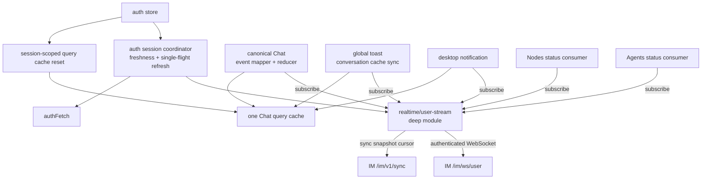
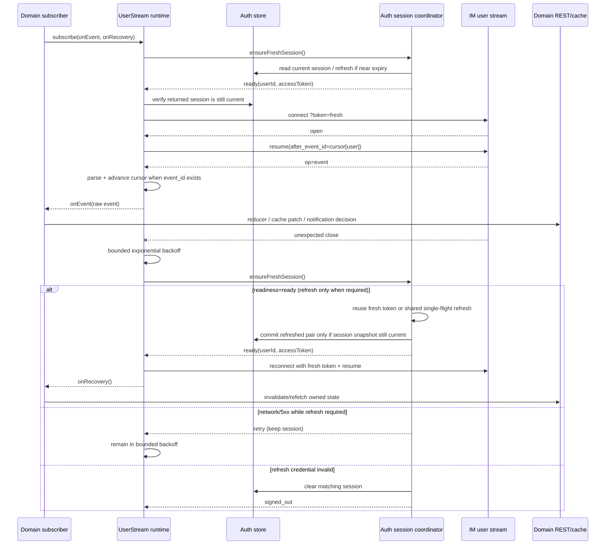
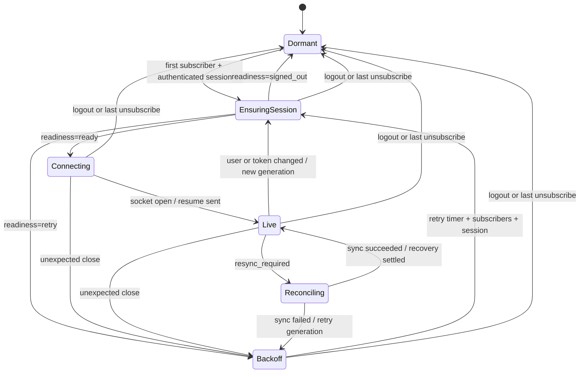
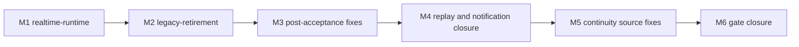

# refactor-460: Web IM client runtime 收口 — 技术方案

> 对齐: motivation.md v1
>
> Unit branch: `unit/refactor-460` (will be created by orchestrator)

## Changelog

## 现状分析

### 涉及范围

- `src/IM/frontend/src/features/chat/im-chat-api.ts`（2107 行）同时承担旧 Chat 映射、REST helper、
  bootstrap/cache 以及当前较完整的 user-stream lifecycle；`chat-api.ts` / `mock-chat-api.ts` 再包一层运行时切换。
- `src/IM/frontend/src/features/chat/v2/` 是生产路由真正挂载的 Chat：REST、wire type、timeline reducer 和页面均在此；
  但 `chat-workspace-page.tsx` 为实时消息和状态反向 import legacy user stream。
- `src/IM/frontend/src/features/chat/v2/chat-stream.ts` 是第二套 user-stream，仅被桌面通知使用；它不发送
  `resume`、不 ping、不重连、不处理 `resync_required`。
- `use-global-message-toast.ts`、`agent-completion-notifier.tsx`、Nodes 页面和 Agent status consumer 分别解释
  同一用户流的消息、通知和状态事件，却使用两套连接与两套 Chat query cache。
- 绑定确认、Agent 详情打开单聊、Agent 配置列表 envelope normalization 是 legacy client 最后的非实时生产调用方。
- 生产路由不再挂载旧 `ConversationList` / `MessagePane`，后者已在源码标明仅为旧测试保留。当前 legacy cluster
  的实现代码超过 4200 行，另有相应旧测试。

### 既有约束

- M1/M2 原计划只改 `src/IM/frontend` 与其测试/文档；验收后 M3-M5 允许在不扩展 wire/REST schema 的前提下，
  修正 Gateway runtime delivery 与 IM user-stream/repository 的既有连续性语义。持久化 schema 与跨包职责仍不改变。
- 后端 user stream 的 current 契约是：JWT 握手、客户端立即 `resume(after_event_id)`、持久事件按 cursor 回放、
  gap/window miss 返回 `resync_required`、客户端以 `/im/v1/sync.max_event_id` 对齐。
- `node.status_changed` / `agent.status_changed` 是同一 envelope 的非持久状态帧，payload 有 owner-scoped `seq`，
  但没有持久事件 `event_id`；断线后不能只依赖 replay，消费方必须刷新权威 REST 快照。
- `authFetch` 已是共享的 authenticated HTTP transport，但 refresh single-flight 目前是其私有实现，只有 HTTP
  401 会触发；WebSocket 重连时没有主动取得 fresh access token 的路径。本 unit 会把这个能力收口到
  auth module，但不新造通用 REST client。
- auth store 同时持有 token 和 user snapshot；绑定会改变 `owned_node_ids` / `default_entry_node_id`，仅刷新
  React Query cache 不会更新这份 session user snapshot。
- current Chat 使用 React Query；user-stream transport 不得反向持有 QueryClient，否则 transport 会知道 Chat、
  Settings 和通知的领域语义。
- 测试遵循 `docs/TESTING_GUIDE.md`：新接口通过其 observable interface 测，废弃路径的旧测试随路径删除；
  浏览器真栈证据走 e2e/reviewer，不把一次性验收脚本塞进常规 Vitest。

### 契约层 grounding 结论

- `docs/specs/im/agents-nodes.md` 的 JWT、resume、replay 与 sync 契约和 Python 后端一致。
- 生产 Chat 使用 legacy shared stream 时能满足 resume/reconnect 主路径；独立 `chat-stream.ts` 不满足该契约，
  桌面通知因此存在断线失活和历史回放风险。这是代码相对 current 契约的 drift，本 unit 负责修复。
- `docs/specs/im/conversations-messages.md` 中实时消息、顺序、NO_REPLY tombstone 与外部 channel live insert 行为
  已由 v2 reducer/页面消费，本 unit保持这些行为，不改变 wire schema。
- canonical 尚未写明浏览器长时间登录、账号切换和提醒去重的恢复行为；本 unit 以两个 IM delta-spec 补齐。

### 可复用能力

- **改造使用** legacy shared stream 的 cursor、resume、ping、backoff 和 sync 语义；这些行为正确但归属错误，且
  token rotation、stale callback、subscriber isolation 未收口，不能原样复制后继续保留旧实现。
- **改造使用** `useAuthStore` 的当前 session 与 subscribe 能力；在 auth module 内从 `authFetch` 抽出共享
  refresh coordinator，让 HTTP 401 和 user-stream connect 复用同一个 single-flight，调用方不再传易过期凭证。
- **直接使用** `authFetchJson` 访问 `/im/v1/sync`，让 sync 与普通 HTTP 共享 refresh 语义。
- **保留使用** v2 `chat-types.ts`、`chat-stream-reducer.ts` 与各领域现有纯事件处理函数；transport 只提供 raw event，
  不吞并 Chat/Settings/Notification 的展示规则。
- **不用** `v2/chat-stream.ts`：补齐它会形成第二个 lifecycle owner；迁移桌面通知后删除。
- **不用** runtime mock facade：current v2 Chat 从未走 `VITE_CHAT_API_MODE`，测试已使用 fetch/WebSocket adapter。

### 本变更沿用的既有模式

- 沿用 `authFetch` 的“共享 transport 隐藏鉴权、领域 client 解释响应”模式：auth module 统一隐藏 token
  freshness/refresh，user-stream runtime 隐藏连接生命周期，各领域 subscriber 解释事件并更新自己的 state/cache。
- 沿用 React `useEffect -> subscribe -> dispose` 的消费方式，但所有 effect 跨同一个 seam；不新增全局 React context。
- 沿用 v2 reducer 作为 active conversation 的 timeline 权威，不把 timeline 状态搬入 React Query。

### 相关历史

- `feat-340-agent-native-im/M4` 建立 v2 Chat 和 legacy isolation 门禁，原意是 v2 不再反向依赖 legacy；M9 桌面通知
  又独立打开了 `chat-stream.ts`。
- `feat-451-chat-history-pagination/M2` 已因真实浏览器恢复问题把 Chat 从独立 `openChatStream` 切回 shared stream，
  证明单一可靠用户流是已验证方向，而非新假设。
- `bugfix-405-chat-status-realtime` 与 `bugfix-442-sidebar-realtime-sync` 继续把状态和列表刷新接到 legacy shared
  stream，扩大了其实际职责，也让抽取共享 seam 成为删除 legacy 的前置条件。

## 架构总览

本 unit 的核心是把“浏览器如何可靠收到 owner-scoped 事件”做成 deep module；调用方只学会订阅，不再学习
token、cursor、socket、timer、resume、sync 和重连顺序。

Before 是“两条 socket + legacy/v2 两套 Chat 数据面”；After 是“一个 transport lifecycle + 多个领域 subscriber +
一个 canonical Chat”。runtime 不认识 QueryClient、消息气泡或状态卡片，避免把共享 module 做成万能事件中心。

## 关键决策

### 决策 1: user-stream seam 放在 Chat/Settings 之外

**新增 `src/IM/frontend/src/realtime/user-stream` deep module，外部 interface 只有订阅与取消订阅。**

- **理由**: Chat、通知和设置都是真实消费者；放在任一 feature 内都会制造反向依赖。小 interface 隐藏全部生命周期，
  同时为五类调用方产生 leverage 和 locality。
- **拒绝**: 继续放在 `im-chat-api.ts`；补强 `v2/chat-stream.ts`；让 App 组件直接持有 socket。
- **风险**: 新顶层目录必须靠 architecture contract 守住，防止未来第二处直接 `new WebSocket('/im/ws/user')`。

### 决策 2: auth module 拥有 token freshness，runtime 跟随它连接

**subscriber 不传 `selfUserId` 或 token；auth module 提供 single-flight `ensureFreshSession`，runtime 每次 connect 前先取得可用 session。**

- **理由**: auth 而非 WebSocket transport 拥有 refresh token 及失效语义。`ensureFreshSession` 与 `authFetch` 共用一个
  refresh coordinator，使“HTTP 401”和“过期 token 下的 WS 重连”不再是两套鉴权恢复。
- **拒绝**: 保留每个 effect 传 token；只观察 store 变化却不主动 refresh；让 runtime 直接读 refresh token；依赖
  其他页面碰巧发出 HTTP 请求。
- **风险**: refresh 期间可能发生 logout/account switch 或暂时网络失败；coordinator 必须对发起 refresh 时的
  user/refresh-token snapshot 做 stale-result guard，且只在 refresh 凭证确认失效时 clear session，网络/5xx 保留 session 并交给
  runtime backoff。

### 决策 3: 每标签页单连接、多 subscriber，领域语义留在调用方

**runtime 分发开放的 `UserStreamEvent`，不维护全局事件白名单，也不直接更新任何 React Query cache。**

- **理由**: IM 会持续增加消息、状态、relay 等事件；transport 若维护 Chat union 或 cache switch，每次领域变化都要
  修改共享 module。raw envelope 让 transport interface 稳定，领域 mapper 继续拥有 validation 和展示语义。
- **拒绝**: 一个全局 reducer 处理全部事件；每个 feature 独立 socket；runtime 只允许 Chat `WsEvent`。
- **风险**: caller 可能各写一份映射；Chat wire -> `WsEvent` 的公共转换应集中在 canonical Chat 内复用。

### 决策 4: cursor 表示 transport 已接收，subscriber 故障彼此隔离

**已知 canonical 持久事件先在共享边界校验，合法后才单调推进 per-user cursor；每个 subscriber 独立调用，单个异常不阻塞其他人。**

- **理由**: cursor 是连接恢复位置，不是所有 UI 副作用完成的事务。把它绑到最慢/失败 subscriber 会导致无限 replay
  和重复通知；领域恢复应依赖 REST snapshot。
- **拒绝**: 所有 subscriber 成功后才写 cursor；任一 subscriber 失败就关闭 socket；为每个 subscriber 建独立 cursor。
- **风险**: 崩溃 subscriber 会错过该帧；runtime 在 recovery 时通知所有 subscriber 刷新各自权威查询，且错误必须
  可被测试观察而不破坏分发。已知 canonical payload 的 schema 错误在 cursor/fan-out 前触发 recovery，不能让任一
  subscriber 先消费、也不能推进 cursor；未知事件仍按开放 envelope 分发。

### 决策 5: reconnect 与 resync 统一为 recovery signal

**`onRecovery` 在非首次重连或 `resync_required` 对齐后触发，各领域据此刷新自己的 REST 权威状态。**

- **理由**: 持久消息可以 replay，node/agent status 没有持久 `event_id`，普通 reconnect 也可能漏状态；调用方只需理解
  “连续性曾中断，需要重读”，不必区分 transport 原因。
- **拒绝**: 只在 `resync_required` 刷新；runtime 直接知道并刷新所有 query key；为 status 另建 socket。
- **风险**: reconnect + resync 可能重复触发刷新；同一 generation 内 recovery callback 要合并，subscriber callback
  用 settled isolation 执行。

### 决策 6: server-state cache 生命周期跟随登录用户

**AppProviders 在 user id 变化或 logout 时清空 QueryClient；同一用户 token rotation 不清 cache。**

- **理由**: query key 当前不含 owner，快速切换账号可能短暂复用前一用户的 Chat/Settings cache；只修 socket 不能满足
  账号隔离。cache reset 属于登录 session 生命周期，不属于 user-stream transport 或任一领域 subscriber。
- **拒绝**: 给所有 query key 追加 user id；让每个页面分别监听 logout；依赖 stale/refetch 最终覆盖旧数据。
- **风险**: logout 时所有 server cache 清空是预期副作用；UI-only preference/Zustand state 不在 QueryClient 内，不受影响。

### 决策 7: 绑定成功是一次 session 与 server-state 收敛

**绑定页在 confirm 成功后刷新 `/im/v1/me`、替换同一用户的 auth snapshot、refetch owner-derived cache，最后导航 Chat。**

- **理由**: bind 同时改变 node/agent owner 与用户的 `owned_node_ids` / `default_entry_node_id`；既有 hot cache 和
  auth store 都不会因 POST 自动变更。页面已拥有 QueryClient 和导航语义，应当编排这次收敛，settings client 只保留
  typed REST 请求。
- **拒绝**: 只机械迁移 `confirmBindToken`；只失效 legacy/Chat cache；让 settings client 持有 QueryClient 或负责导航。
- **风险**: confirm POST 已成功而后续 `/me`/refetch 失败时，不得重复提交一次性 bind token；页面保留已成功的
  bind result，重试时只重跑 reconciliation。

### 决策 8: 完成迁移后只保留 canonical Chat

**删除 legacy client/mock/types/旧组件，把当前 `v2/` 提升为无版本后缀的 `features/chat/` current surface。**

- **理由**: 生产路由早已只使用 v2；保留 `v2` 与根目录 legacy 会继续迫使维护者判断版本，mock env 也与真实入口不符。
  删除和提升命名共同完成迁移闭环。
- **拒绝**: 永久保留 compatibility shim；只删 `im-chat-api.ts` 但留下 v2 目录；重写 current Chat workspace。
- **风险**: 42 个 current v2 文件的机械移动会产生大 diff；必须使用 `git mv`、先删同名 legacy 文件、再靠 build 和
  route/integration tests 证明只改路径，不趁机拆 workspace。

### 决策 9: replace, don't layer

**先把全部实时消费者切到新 interface 并删除旧 stream，再迁移最后的非实时调用方并删除整个 legacy cluster。**

- **理由**: 兼容 wrapper 会让两套 interface 长期共存，失去 deletion test；分两步则每一步都有独立用户价值和回退点。
- **拒绝**: 新 runtime 包一层旧 `attachUserConversationStream`；一次提交同时抽取、搬 42 个文件和删全部测试。
- **风险**: 中间态仍有 legacy REST 代码，但 M1 完成后它不再拥有 socket；M2 必须以“零生产 import”作为删除门禁。

## 接口与数据流

### External interface

调用方唯一需要学习的 interface：

| 名称 | 形状 | 契约 |
|---|---|---|
| `subscribeUserStream` | `(subscriber: UserStreamSubscriber) => () => void` | 首个 subscriber + 有效 session 时连接；最后一个取消或 logout 时关闭；取消幂等 |
| `UserStreamSubscriber.onEvent` | `(event: UserStreamEvent) => void` | 每个合法 event frame 调一次；subscriber 间故障隔离；同一 socket 内保持收到顺序 |
| `UserStreamSubscriber.onRecovery` | `() => void \| Promise<void>`（可选） | 非首次重连或 resync 对齐后通知重读权威状态；同 generation 合并；callbacks settled 隔离 |
| `UserStreamEvent` | `{eventType, payload, eventId?}` | `payload` 为开放 record；持久帧有单调 `eventId`，status 等即时帧允许缺失 |

`subscribeUserStream` 不接受 URL、token、user id、cursor、WebSocket factory、timer 或 QueryClient；这些都不是 caller
正确使用该 module 所需的知识。

### Internal seams

IM 是 remote-but-owned 依赖。runtime 内部定义 socket/environment port，production 使用 Browser WebSocket +
sessionStorage + auth session coordinator + `authFetchJson` adapter，Vitest 使用 fake socket/storage/scheduler/session adapter。内部 seam 不从
external interface 暴露。

| 内部依赖 | Production adapter | 测试用途 |
|---|---|---|
| session source | `useAuthStore.getState/subscribe` | 驱动 login、token rotate、account switch、logout |
| session readiness | auth module `ensureFreshSession()` | 驱动 fresh/refresh/retry/signed-out 及 concurrent single-flight |
| socket factory | browser `WebSocket` | 精确驱动 open/message/close/stale callback |
| cursor store | `sessionStorage`, key 按 user id | 验证 resume、单调推进、账号隔离 |
| scheduler | `window.setTimeout/setInterval` | fake timers 验证 backoff/ping/取消 |
| sync client | `authFetchJson('/im/v1/sync')` | 验证 max cursor 对齐和失败降级 |

### 主路径

auth module 对 user-stream 暴露的内部 interface 是：

| 名称 | 形状 | 契约 |
|---|---|---|
| `ensureFreshSession` | `() => Promise<SessionReadiness>` | access JWT 剩余有效期 >30s 时直接 ready；无法解析/已过期/剩余 <=30s 时进入共享 refresh single-flight |
| `SessionReadiness` | `{status:'ready', userId, accessToken} \| {status:'retry'} \| {status:'signed_out'}` | `retry` 只表示网络/5xx 等暂时失败且不 clear store；`refresh` 401/无 refresh token 才 clear 当时仍匹配的 session |

`authFetch` 的 401 retry 与 `ensureFreshSession` 复用同一个 module-level refresh promise。refresh 完成时若
`{userId, refreshToken}` 已与发起时 snapshot 不同，结果必须丢弃，不得覆盖新登录用户。runtime 只使用
`ready` 返回值，且建 socket 前再确认 store 仍是同一 user/token；否则废弃本次 connect。

### Connection state machine

- 每次 connect 递增 generation；旧 generation 的 `open/message/close/timer` callback 以及 sync async completion 不得
  改变当前状态、cursor 或安排重连。
- backoff 从 1 秒指数增长并封顶 30 秒，成功 open 后归零；Live 每 25 秒 ping，离开 generation 时清 timer。
- 每次初始 connect 和 backoff retry 都经 `EnsuringSession`；`retry` 沿用同一 bounded backoff，`signed_out` 停止重连并由
  现有 auth route guard 转登录页。已建立的 socket 不因 JWT 自然到期强制换代；只在下次 connect 或 store token 已
  rotation 时进入新 generation。
- `resync_required` 调 `/im/v1/sync`；普通 gap/window miss 以 `max(current, max_event_id)` 前进，
  `cursor_ahead_of_event_store` 则以当前 event store 的 `max_event_id` 替换旧 epoch cursor。sync 失败不得把该
  generation 永久标成已处理，必须进入可重试的新 generation；只有 sync 成功后才发 `onRecovery` 让领域重读。
- 新标签页 cursor 为 0 时，先以 `/im/v1/sync.max_event_id` 建立“历史不提醒”的 baseline，再触发一次领域 recovery，
  消除初始 REST snapshot 与 baseline 之间的竞态。recovery 只合并同时在途的请求，不得限制为每 generation 一次。

### Domain ownership

| Subscriber | 保留的领域职责 | recovery 行为 |
|---|---|---|
| Chat workspace | raw message/tool/thinking/permission -> canonical `WsEvent`；active timeline reducer；node/agent chip patch | 刷 current messages、conversations、agents、nodes |
| Global toast | 唯一 completion accumulator owner；self/current-conversation 过滤、toast dedupe/文案；external 会话权威分类；预热并刷新 canonical conversations query | 刷 conversations、重试未决 external 分类，保留已通知 key 防重复 |
| Desktop notifier | 消费 toast owner 产出的 completion candidate；visibility/preference/permission gate、点击导航 | 不另行归约或持久化 lifecycle；靠 cursor 与共享 candidate 避免旧 completion 再入 |
| Nodes page | node status payload validation + settings nodes cache patch | 刷 settings nodes |
| Agent status consumer | agent status validation + agents list/detail cache patch | 刷 settings agents |

### Legacy retirement mappings

| 现有 legacy 调用 | canonical 归属 |
|---|---|
| `confirmBindToken` | `features/settings/im-settings-api.ts` 的窄 bind 请求；身份直接来自 Bearer session；成功后由绑定页执行下述 reconciliation |
| Agent detail `createDirectChatByAgentUserId` | canonical Chat `createConversation({title, agentIds})`，只失效 canonical conversation key |
| `normalizeItemsEnvelope` | Agent config client 内部 normalization，不为一个调用方暴露跨 feature helper |
| legacy preview snapshot/cache | 删除；canonical React Query conversations 是唯一列表状态 |
| `VITE_CHAT_API_MODE` / `mock-chat-api` | 删除；component/integration tests 继续注入 fetch/socket adapter |

### Auth session 与 server cache

`AppProviders` 持有 QueryClient，因此由它订阅 auth store 的 user id：从 A 变为 `null`、从 A 变为 B 时执行
`queryClient.clear()`；`null -> B` 时保持空 cache 让各页面按 B 重新取数；A 的 token refresh（user id 不变）不清理。
user-stream runtime 独立监听完整 `{userId, accessToken}`，并在 connect 前通过 auth session coordinator 取得
fresh session，负责 socket generation，不接触 QueryClient。

`BindConfirmPage` 的成功路径按以下顺序收敛：

1. 只提交一次 `POST /im/v1/bind {action:'confirm', bind_token}`，记住返回的 bind result。
2. 调用 `GET /im/v1/me`，通过 auth store 的 `replaceUser(nextUser)` 替换并持久化同一 user id 的 snapshot，
   保留现有 access/refresh token。`replaceUser` 只接受与当前 session 相同的 user id，若期间已 logout/switch
   则丢弃延迟响应；同 user 替换不触发 QueryClient account-switch clear。
3. 对 final canonical keys `['chat','conversations']`、`['chat','agents']`、`['chat','nodes']`、
   `['settings','account']`、`['settings','nodes']`、`['settings','agents']` 执行 prefix invalidation，对已有 active/inactive
   hot cache 使用 `refetchType:'all'` 并等待 reconciliation settled。
4. 完成上述收敛后再 `navigate('/chat', {replace:true})`。若第 2/3 步暂时失败，保留第 1 步已成功状态；
   后续重试只执行 reconciliation，不再消费 bind token。

## 契约层增量 (delta-spec)

- kernel: no spec delta
- im: `specs/im/agents-nodes.md`, `specs/im/web-chat-ux.md`
- gateway: no spec delta
- cli: no spec delta

## 风险与回退

- **token rotate 与 close 竞态**：旧 socket 的延迟 close 可能误关/重连新 session。以 generation guard + fake socket
  顺序测试兜底；失败时回退 M1，不保留双 runtime 降级。
- **refresh 与断网/account switch 竞态**：过期 access token 重连时必须主动 refresh，但断网不应被误判为退出，
  A 的延迟 refresh 也不得覆盖 B。以共享 single-flight、snapshot guard 和 `ready/retry/signed_out` 分类测试兜底。
- **cursor 与通知重复/丢失**：cursor 提前或回退都影响 replay。测试覆盖 canonical 非法帧在共享 fan-out 前拒绝且
  不推进、合法持久帧单调推进、status 无 event id 不推进、subscriber 抛错仍推进且其他人继续；普通 resync 使用
  monotonic max，仅 `cursor_ahead_of_event_store` 以 global event-store max 替换旧 epoch cursor。
- **非持久状态断线漏帧**：每次 continuity recovery 通知 Nodes/Agents/Chat 刷 REST；不能只依赖 replay。
- **React StrictMode mount/unmount**：多 subscriber 和重复 dispose 必须只产生一条活动 socket；最后 subscriber 离开
  后不再重连。
- **大规模路径移动**：M2 仅做 canonicalization、调用方迁移和删除，不重写 workspace；`git mv` 后以 route test、
  Chat integration、完整 Vitest 和 production build 对账。若 M2 失败，可整体回退 M2，M1 runtime 仍可独立工作。
- **快速账号切换复用旧 server cache**：M1 在 AppProviders 统一按 user id 清 QueryClient，并用 provider/auth 集成测试
  证明 token refresh 不误清、logout/account switch 必清；不把安全性寄托在 query stale time。
- **绑定后 hot cache 与 auth snapshot 不一致**：M2 把 confirm 与 reconciliation 分成不可重复/可重试两段，真栈
  验证预先加载 Chat/Settings cache 后绑定，Node/Agent 与默认入口仍立即可见，且重试不二次提交 token。
- **旧测试虚假安全感**：新 interface 测试覆盖 lifecycle 后删除 `im-chat-api`/`chat-stream` 的重叠测试；保留或迁移
  current UI/reducer tests，不以测试数下降作为完成证据。

本 unit 不改变 UI 结构、交互或视觉状态，因此按 design-author 规则不产 `prototype.html`；reviewer 直接以当前真实
Web IM 为视觉与交互基线。

## Runbook for Reviewer

| 服务 | 停止命令 | 启动命令 | 健康检查 |
|---|---|---|---|
| Worktree Web IM + Gateway 真栈 | `./scripts/e2e-down.sh` | `cd src/IM/frontend && npm run build && cd ../../.. && ./scripts/e2e-up.sh` | `source .e2e-ports.env && curl -fsS "$IM_URL/openapi.json" >/dev/null && curl -fsS "$IM_URL/" >/dev/null && grep -Eq "auto-bound to IM\|Gateway started\|INFO im_connection" .gateway.log` |

**Review 驱动方式**: 端到端真栈并真驱动浏览器客户端。登录 `$IM_URL` 后依次走 Chat 实时回复/NO_REPLY、切到
Me 页验证应用内与系统通知、Gateway 断连/重连时观察 Chat/Nodes/Agents 状态、浏览器短暂离线后恢复、绑定确认、
Agent 详情打开单聊；桌面与移动 viewport 各抽检一次。长登录恢复必须使用已过期 access token +
仍有效 refresh token 的真实浏览器 session（可用 `.e2e-jwt-secret` 签发 expired access JWT 写入 `im_auth_v1` 后 reload），
不能只模拟 store 被外部换成 fresh token。绑定前先访问 Chat/Settings 预热 cache。不得用直接调用内部 reducer 或伪造
subscriber 代替客户端旅程。

## Milestones

原计划拆成两个串行 Milestone，命中“>10 文件 / >4 小时”与“必须分阶段验证”两条硬触发：M1 约涉及 14-18 个
实现/测试文件并新增完整连接生命周期；M2 要迁移/移动 40+ current v2 文件并删除 4200+ 行 legacy。先证明 M1
恢复语义，再删除旧表面，能把 correctness 风险与机械迁移风险分开。Round 1 验收后追加 M3，集中修复验收与代码审查
发现的恢复、提醒、绑定和残余重复表面；Round 2 又以真实旅程和 full diff review 暴露 replay/live 交接与通知生命周期
仍未闭合，因此追加 M4 做协议连续性收口。Round 3/4 的独立 verifier 与 code review 继续暴露 handoff、external 首帧、
跨账号刷新及 UI/REST 竞态，依次追加 M5/M6；这些 fix milestone 不改变前两阶段的架构决策，只把连续性语义落实到
正确 owner。

### Scenario coverage

| motivation Scenario | 实现路径 | Milestone |
|---|---|---|
| Agent 回复实时更新 | runtime -> Chat event mapper -> timeline reducer | M1 |
| 静默回复撤销临时气泡 | `message.discarded` 经同一 mapper/reducer | M1 |
| 外部 channel 消息实时进入已打开会话 | raw `message.created` -> canonical Chat | M1 |
| 未打开会话收到新消息 | global toast + canonical conversations query | M1 |
| 当前会话和自己的消息不产生多余提醒 | toast 领域过滤/去重 | M1 |
| 后台标签页收到 Agent 完成通知 | desktop notifier subscriber | M1 |
| 不满足通知条件时不弹通知 | notifier visibility/preference/permission gate | M1 |
| 恢复连接不重放历史通知 | per-user cursor + notifier state + recovery | M1 |
| Gateway 断连与重连 | status subscriber + recovery refetch | M1 |
| 长时间保持登录后发生网络重连 | auth `ensureFreshSession` -> fresh-token connection generation | M1 |
| 退出后切换为另一用户 | socket generation + session-scoped QueryClient reset | M1 |
| 确认 Gateway 绑定 | narrow settings bind client -> `/me`/auth snapshot -> owner-derived cache refetch -> navigate | M2 |
| 从 Agent 详情打开单聊 | canonical Chat create-conversation client | M2 |

| ID | 标题 | 依赖 | 并行组 | 范围 | 退出标准 |
|---|---|---|---|---|---|
| refactor-460-M1 | realtime-runtime | — | A | `src/IM/frontend/src/realtime/`; `src/IM/frontend/src/features/auth/{auth-fetch*,auth-session*}`; `src/IM/frontend/src/app/{providers*,App.test.tsx}`; `features/chat/{im-chat-api.ts,im-chat-api.test.ts,chat-api.ts,mock-chat-api.ts,hooks/use-global-message-toast*}`; `features/chat/v2/{chat-api.ts,chat-stream*,chat-types.ts,chat-workspace-page*,chat-workspace.integration.test.tsx}`; `features/notifications/agent-completion-notifier*`; `features/settings/nodes/nodes-page*`; `features/settings/agents/agent-status-ws-consumer*`; `tests/contract/test_im_frontend_user_stream_ownership.py` | **[reviewer]** 覆盖 motivation 中“当前会话实时过程”“会话列表/未读/toast”“桌面通知”“Node/Agent 状态”“长时间登录与账号切换”的全部 Scenario，特别验证 access token 已过期后断网恢复仍能自动 refresh/重连，且不重放已处理通知。 **[worker]** auth session interface 测试覆盖 fresh token 不 refresh、剩余 <=30s/过期 token 单飞 refresh、HTTP 与 WS 共用 in-tab promise、网络/5xx 返回 retry 且不 clear、refresh 401 才 clear、A->B 期间 A 的延迟结果不覆盖 B；runtime interface 测试覆盖单 socket/多 subscriber、resume/ping/backoff、readiness 三分支、token/user generation、cursor 单调性、resync/recovery、subscriber isolation、last-unsubscribe；provider/auth 集成测试覆盖 token refresh 不清 cache、logout/account switch 清 cache；architecture contract 证明 `/im/ws/user` 只有 runtime 一个 lifecycle owner。 **[worker]** 相关 Vitest + `npm run build` 通过；M1 后生产实时调用方对 legacy stream 和 `v2/chat-stream.ts` 为零，旧 stream 实现/测试删除而非 wrapper 保留。 |
| refactor-460-M2 | legacy-retirement | refactor-460-M1 | B | `src/IM/frontend/src/features/chat/` 全目录 canonicalization/deletion；`app/{router*,shell/app-shell*}`；`features/auth/{auth-store*,auth-store.test*}`; `features/chat/bind-confirm-page*`; `features/settings/im-settings-api*`; `features/settings/agents/{agent-detail-page*,im-agent-config-api*}`；所有受路径移动影响的 frontend imports/tests；`src/IM/frontend/README.md`; 本 unit delta-spec | **[reviewer]** 覆盖 motivation 中“确认 Gateway 绑定”“从 Agent 详情打开单聊”，其中绑定必须在 Chat/Settings 已有 hot cache 时操作，返回 Chat 后刚绑定的 Node/Agent/默认入口立即可见；并回归 M1 全部实时旅程、Chat 桌面/移动核心交互。 **[worker]** bind 集成测试预填充 final canonical Chat/Settings caches，证明 confirm 成功后 `/me` 覆盖 auth user snapshot、六组 owner-derived prefix 以 `refetchType:'all'` 收敛后才导航，且 reconciliation 失败重试不再提交 bind token。 **[worker]** `im-chat-api.ts`、legacy `chat-api.ts`/`mock-chat-api.ts`/`types.ts`、旧 ConversationList/MessagePane 及只服务旧路径的测试删除；原 `v2/` current 文件通过 `git mv` 成为无版本后缀 canonical Chat；生产源码无 `VITE_CHAT_API_MODE`、`chat-v2` query key、legacy import 或第二处 user-stream socket。 **[worker]** `npm run test`、`npm run build`、相关 Python contract、`pytest -m "not e2e"` 与 `scripts/e2e-critical.sh` 通过；README 与真实入口一致。 |
| refactor-460-M3 | post-acceptance-fixes | refactor-460-M2 | C | `features/auth/{auth-fetch*,auth-session*}`；`realtime/user-stream/*`；`features/chat/{chat-workspace-page*,chat-workspace.integration.test*,bind-confirm-page*,chat-api*,hooks/use-global-message-toast*}`；`features/settings/agents/agent-detail-page*`；frontend architecture contract；`personal_assistant/gateway/runtime_delivery/context.py` 与 Gateway delivery tests；`IM/infra/repositories.py`、`IM/ws/user_stream.py` 与 IM repository/wire tests | **[reviewer]** 关闭 Round 1 的静默回复残留与在线非当前会话 toast/未读问题，并补齐恢复、绑定和凭证失效的可观察回归；不改变既有桌面/移动 Chat 交互。 **[worker]** Chat recovery 对当前消息、会话、Agent、Node 四类权威状态完成收敛；服务端拒绝但本地仍 fresh 的 token 通过同一 single-flight coordinator 强制 refresh；storage 不可用不击穿共享实时流；绑定 refetch 真实失败不导航且一次性 confirm 结果按 token 隔离。 **[worker]** direct Web IM 在 Gateway 源头采用既有协议静默语义；IM tombstone 在事务提交后 exactly-once 发布，nullable event FK 不覆盖 payload 中的 provisional message id，在线撤泡与 reload 历史一致且外部 channel/普通事件不变。 **[worker]** 删除无调用 mention API、详情页重复 Agent summary 请求与过宽 WebSocket ownership guard；复用统一 JSON transport/error seam且保持用户错误展示；相关定向测试、全量 Vitest/build、contract、non-e2e 与受影响真栈旅程通过。 |
| refactor-460-M4 | replay-and-notification-closure | refactor-460-M3 | D | `IM/infra/repositories.py`、`IM/ws/user_stream.py`、`IM/application/event_bridge.py` 及 replay/stream tests；`personal_assistant/gateway/runtime_delivery/{observer.py,context.py}` 与 direct Web lifecycle/repository tests；`frontend/src/realtime/user-stream/*`；`features/chat/chat-stream-reducer*`、`features/chat/hooks/use-global-message-toast*`、`features/notifications/agent-completion-notifier*` 与相关 integration tests | **[reviewer]** 关闭 Round 2 的“带 tool/thinking 的静默回复 reload 后残留空 Agent 行”和“在线非当前会话无 toast/可见未读”，并验证同一回复只提醒一次、冷启动/恢复不重放历史提醒、刷新跨越 created/completed 不漏提醒；回归桌面/移动 Chat、绑定、状态、账号隔离。 **[worker]** replay 与 live 交接不双投、不乱序；短期 backlog 超过单批上限不会截断丢失；客户端 cursor 高于当前事件库 max 时触发权威 resync；新标签页 cursor=0 的历史 replay 不表现为新通知。 **[worker]** direct Web lifecycle 以可见正文是否提交决定 completed/discarded，tool/thinking 过程不阻止自然静默整泡回滚；普通可见回复与非 Web delivery 不变。 **[worker]** canonical completion 与 relay receipt 对同一回复只产生一次提醒；通知生命周期在页面 reload 前后保持正确，应用内与桌面通知复用一个纯生命周期 accumulator；退役非 canonical `message_created` alias。 **[worker]** repository/bridge 只保留一个 post-commit event notify owner；domain mapper 对异常持久 payload 安全降级；内存 cursor hydrate 后不在事件热路径重复读 storage，storage 不可用不洪泛日志。 **[worker]** 定向并发/分页/epoch/通知测试、全量 frontend/backend/contract/critical-path 与真实双浏览器旅程通过，证据持久化。 |
| refactor-460-M5 | continuity-source-fixes | refactor-460-M4 | E | `IM/ws/user_stream.py`、`IM/infra/repositories.py` 与 handoff/replay tests；`frontend/src/realtime/user-stream/*`、canonical event validator、Chat recovery tests；`personal_assistant/gateway/runtime_delivery/observer.py` 与 steer lifecycle tests；notification coordinator/toast/notifier/local unread；external shadow message mapping 与相关 Gateway/IM tests | **[reviewer]** 真实隔离浏览器验证冷启动 baseline 不漏消息、epoch sync 失败可恢复、同一连接多次独立 recovery 均收敛、steer 后自然静默不留空泡、外部 channel 消息实时进入已打开会话并在非当前会话产生正确提醒；不得使用用户 Chrome、Computer Use 或 macOS 系统设置。 **[implementation]** replay handoff 给每条连接建立明确 high-water/cutoff，同一持久事件不因 replay 与 queued live 双投；分页期间新事件只从一个路径进入。 **[implementation]** cold baseline 后必做领域 recovery；epoch sync 失败重连重试；recovery 仅合并同时在途调用；canonical payload 在 fan-out 前统一验证，异常帧不污染任一 subscriber。 **[implementation]** `visible_reply_committed` 按 bubble 生命周期重置；外部参与者消息沿用既有 canonical created payload/metadata，不能被误判为 owner 自己消息；通知生命周期由单一 coordinator 归约一次后 fan-out，持久化仅在状态变化时发生。 **[implementation]** 定向并发/竞态/steer/external-message 回归、全量 frontend/backend/contract/e2e-critical 与隔离真栈通过，证据持久化。 |
| refactor-460-M6 | gate-closure | refactor-460-M5 | F | external classification authority/retry；`features/auth/auth-session*`；Chat reducer/history/composer/toast；Gateway multi-bubble observer；相关 tests | **[reviewer/verifier]** 复核 fresh conversations cache 下的新 external 首帧、authority failure recovery、跨账号 refresh flight、live-over-history、失败终态、发送失败保稿、多气泡终态与 accumulator 写放大。 **[implementation]** authoritative external fetch 绕过 stale cache，失败分类保留到 recovery 重试；refresh singleflight 以 user/refresh-token snapshot 隔离；history request 飞行期间所有同消息 live event 保护一次 reset；failed completion 保留 wire 终态；composer 成功后清稿且 pending 同步防双击；新气泡正文重建可见 marker；accumulator 只在状态 identity 变化时持久化。 **[implementation]** 聚焦与全量 frontend/backend/build/ruff 通过，最终只读 verifier/code review 无确认阻断项。 |
