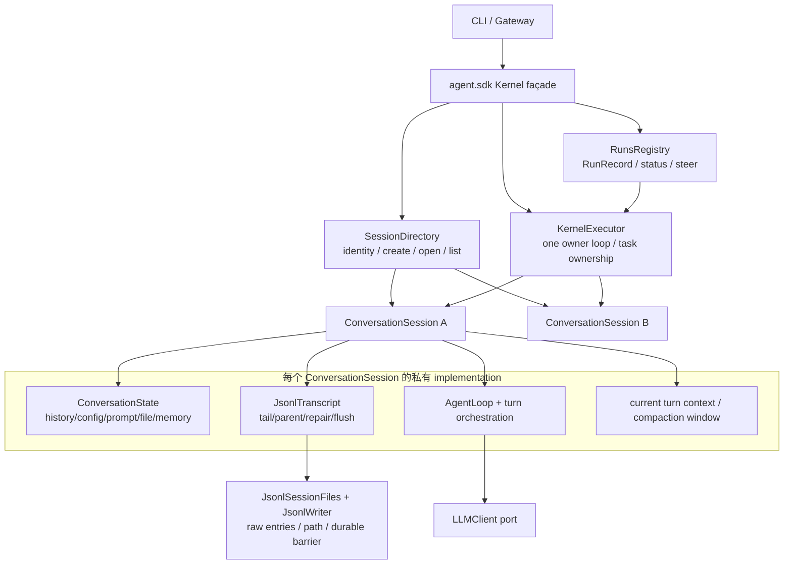
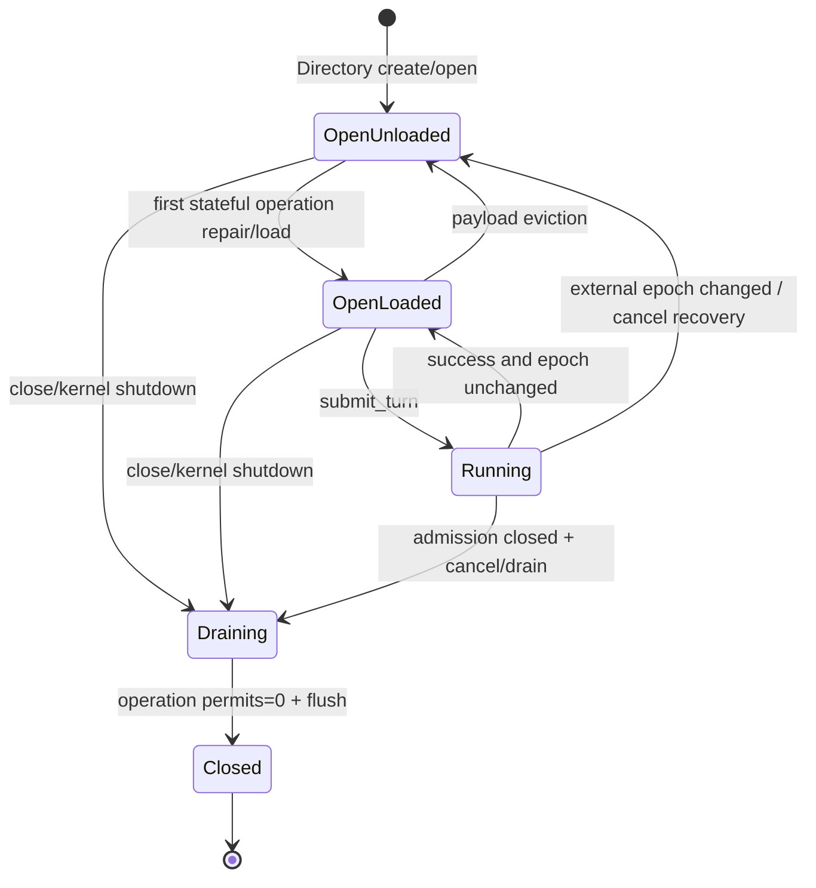

# refactor-462: Per-conversation session architecture — 技术方案

> 对齐: motivation.md v2
> Unit branch: `unit/refactor-462` (will be created by orchestrator)

## Changelog

- v2: 按 CC 对照改为最终 `ConversationSession × N` 架构，退役全局 SessionManager/多 session AgentRuntime。
- v3: 按独立设计审查补齐 PromptSlotSeed 重建、统一 lifecycle permit、Executor/Registry 控制面，并收紧 raw JSONL 与 parent-scoped find 边界。

## 现状分析

### 涉及范围

- `src/agent/core/agent/runtime.py` —— 当前同时承担共享 agent 算法与多 session live state；`history/config/path/lock/memory/file/prompt` 由多张 `dict[session_id, ...]` 保存，正常 turn、compaction、recovery、fork 都在这里手排。
- `src/agent/core/session/manager.py` —— 名为 aggregate，实际主要转发 `JsonlSessionStore`，并公开 `store/writer`；parent chain、flush 与 runtime cache 的组合知识仍在调用方。
- `src/agent/platform/persistence/session/service.py` —— 负责少量校验/default metadata merge，却继续暴露 `.manager` escape hatch；与 Kernel 形成重复 façade。
- `src/agent/core/runs/registry.py` —— 同时拥有 run ledger、专用 event loop、controller、pending steer 与 top-level task；当前直接调用共享 `AgentRuntime.run(session_id, ...)`。
- `src/agent/platform/background_tasks/runtime_runner.py` —— 绕过 RunsRegistry，向其 event loop 裸提交 `AgentRuntime.run(...)`；auxiliary run 的完成所有权没有统一进入 Kernel shutdown。
- `src/agent/sdk/kernel.py` —— 唯一公开 façade，但 create/submit/append/compact/fork 分别穿过 SessionService、RunsRegistry 与 AgentRuntime；`append_message` 还需手动 invalidate runtime cache。
- `src/agent/core/session/jsonl_store.py` / `jsonl_writer.py` —— 当前唯一生产存储，负责 append-only JSONL、materialize、repair 与 writer queue；schema/path 保持不变。
- `src/agent/platform/tools/builtins/agent.py` —— 通过 `AgentRuntime` 查询 workspace/model、创建/恢复 subagent 并提交裸 run；需要改为 session-scoped turn context + Directory/Executor。
- `tests/unit/agent/`、`tests/unit/test_session_*`、`tests/integration/`、`tests/contract/` —— 现有测试大量依赖 runtime 私有 map、manager/store 穿透与 loop 细节；本 unit 要把主测试面换到最终 interface。

### 既有约束

- `coding_cli` / `personal_assistant` 只依赖 `agent.sdk`；公开 `Kernel` 方法、DTO、事件与错误行为不变。
- Kernel 是进程内库；Gateway 是常驻多 session 进程，CLI 通常只有少量 session。最终架构不能照搬 CC 的“进程只有一个 current session”单例。
- `Kernel.submit()` 与 `Kernel.append_message()` 保持同步：前者 non-blocking 返回 RunInfo，后者返回前必须 durable。compact/fork/create 保持现有 async 签名。
- JSONL 仍是每 session 一份 append-only 档案；entry type、路径规则和既有数据不迁移。PromptSlots 的纯文本 seed 写入现有开放 metadata map 的内核保留键，不新增 entry type；持久化层仍不保存中心 session→path registry。
- 同一 session 最多一轮主 transaction；不同 session 可并行。`fork(up_to=M)` 保持 point-in-time 短读，不等待完整 active run。
- 用户中断后，stop append、残余 run write 与 recovery 都必须落在同一可达 parent chain；shutdown 必须等待已开始的 durable mutation 真正结束。
- `core` 不依赖 `platform`；LLM 继续经既有 `LLMClient` port。JSONL/filesystem 是 local-substitutable dependency，主测试使用真实 temp directory，不为唯一 JSONL 实现增加公开 repository seam。

### 契约层 grounding 结论

- `docs/specs/kernel/runs.md` 与 live `Kernel` 对 create/submit/interrupt/close 的消费者行为一致，本 unit只改内部 owner。
- `docs/specs/kernel/context-persistence.md` 与 live code 的 JSONL、append、compaction、recovery、fork 行为总体一致。
- 发现一处 canonical drift：文档声称消费者可调用 `invalidate_session_cache`，但 `agent.sdk.Kernel` 没有该接口；当前只有 Kernel 内部在 append 后调用 runtime 私有方法。本 unit删除这句错误承诺并把 append 的自动一致性写回现状，不构成行为增量。
- 发现另一处 live-to-canonical drift：`docs/specs/kernel/prompts.md` 已承诺 PromptSlots 在整 session 稳定，但 live Gateway重启直接复用persistent binding，既不再create_session，也没有open/rehydrate入口；Runtime内存map因此丢失slots。本unit用既有metadata envelope持久化seed来兑现现有契约，不新增SDK或delta spec；旧档案保持empty fallback。
- `SPEC.md` 的内核模块清单仍写 `SessionManager`。本 unit完成后同步改成 `ConversationSession × N + SessionDirectory`，这是跨包顶点的内部架构 grounding，不是 canonical 行为 delta。

### 可复用能力

- 保留现有 JSONL 文件路径规则与 writer durability mechanism，但收窄下层为 raw file I/O；materialize、repair、entry taxonomy、parent rewrite、compaction/fork projection 等高层语义全部迁入每个 conversation 私有 Transcript，不再被生产调用方直接穿透。
- 保留 `AgentLoop`、hook/tool/prompt/compaction 算法与 `LLMClient` adapter；它们成为 `ConversationSession` implementation 内的共享依赖或私有 helper，不再按 session id 回查全局 runtime state。
- 保留 RunsRegistry 的 RunRecord/status/event/steer 行为，但把 owner-loop 与三类 target completion 抽到唯一 `KernelExecutor`；RunsRegistry 不再拥有 session transaction。
- 保留现有 SDK façade 与产品调用路径；产品不会拿到 `ConversationSession` 对象。

### 相关历史

- `feat-330` 引入 JSONL 与 `AgentRuntime` 的四张 session map，并以“保留 SessionManager interface”降低当时迁移成本；这是当前双 owner 的起点。
- `refactor-360` 删除死 persistence 实现，但保留浅 SessionManager/SessionService 链；生产 JSONL 已证明是唯一存储。
- `feat-394` 暴露 out-of-band append 的三重分裂：parent orphan、writer 未 flush、runtime cache stale。
- `bugfix-410/417/418/426` 分别补过 cancel recovery、foreground task、cross-loop 与 steer/stop 语义，说明 session ownership 与 task ownership必须一起治理。
- `bugfix-437` 与 `feat-445` 证明 workspace binding、compaction 与两类 fork 都依赖同一份 session live state。
- 本 unit 命中 `codebase-design`：要重选 module 粒度、interface、seam 与测试面。三种候选中选择显式 per-conversation handle；拒绝通用 command bus与 actor mailbox，见决策 1/2/6。

## 架构总览

**最终形态：Kernel 持有轻量 Directory 与执行器；每个 session 是一个独立、长期存活的 `ConversationSession`。** Directory 只回答“哪个对象”，ConversationSession 回答“这个会话如何运行与持久化”。



Before，`SessionManager`、`SessionService`、`AgentRuntime`、RunsRegistry 与 Kernel 共同知道一轮 session transaction。After，普通路径只有 `Directory.open(ref) → ConversationSession.submit_turn(request)`；调度、存储格式和窗口细节不进入调用方 interface。

### Composition root 顺序

`build_kernel()` 按以下顺序装配，禁止事后向 runtime 私有字段塞依赖：

1. 构造 raw `JsonlSessionFiles` / `JsonlWriter`、LLM clients、hook/tool definitions与纯compaction/prompt算法。
2. 构造session-stateless `AgentEngine`；内置AgentTool此时只是tool definition，不持Directory、Executor或Runtime。
3. 构造独立的`KernelExecutor`，再构造`SessionDirectory(engine, transcript_factory, executor)`；Directory之后创建每个ConversationSession时，可把自身的窄`SubagentControl`与Executor能力放入该session的私有turn-context factory。
4. 构造`RunsRegistry(directory, executor)`与Kernel façade。AgentTool每次执行只从当前`TurnContext`取得`SubagentControl`，不经constructor/global lookup回穿composition root。

这样没有`Engine → AgentTool → Runtime/Directory → Engine`构造环，也不需要`kernel._c.runtime._x = ...`式post-hoc escape hatch。

## 关键决策

### 决策 1: 每个 session 一个长期存活的 ConversationSession

**选择 `SessionDirectory + ConversationSession × N`，不再深化全局多 session SessionManager。**

- **理由**: 对齐 CC 的“one QueryEngine per conversation”粒度，同时适配 Nano 常驻进程中的多 session 并行。identity、mutable history、prompt/file window、current turn context 与 transcript 生命周期天然同构。RunRecord/controller/steer queue 仍是 run scheduling 状态，由 RunsRegistry 管理；它们不拥有 conversation history 或 persistence transaction。
- **Directory 限界**: 只做 create/open/list/find、canonical identity binding、close_all；禁止 history/config/tail getter，禁止 writer/store escape hatch，禁止成为第二 aggregate。
- **稳定 identity**: 一个 Kernel 生命周期内，同一 `session_id` 只对应一个稳定对象；首次 open 一次绑定 canonical `workspace_root`、parent 与 transcript path。再次以不同位置打开立即报 binding mismatch。
- **并发 intern**: Directory 用一个短 `threading` registry guard 原子完成 create/open 的查找或登记，保证两个产品线程不会为同一 id 创建两个对象；guard 内不做JSONL I/O、不等待session lock，session transaction也不反向取得它。
- **惰性 materialize**: open 只绑定 identity；首次 submit/compact/需要 history 的 fork 才读取 config、rehydrate PromptSlots seed并 repair/load。较重 history 可在对象静默且无 mutation 时卸载，但对象 identity、锁与 prompt seed 不通过“删除后重建”换新。
- **拒绝**: `_slots: dict[session_id, _SessionSlot]` 的全局 aggregate；每次调用重复传 workspace/path；长期保留旧 manager 作为兼容层。
- **风险**: Gateway 中对象数量随 session 增长。最终实现必须有 deterministic close，并允许对象内部卸载 loaded payload；不得靠重建 handle 制造第二套 owner/lock。

### 决策 2: ConversationSession 使用显式高层 interface，不用 public lease 或 command bus

**选择 `submit_turn / append_external / compact / fork / close` 五个一等事务。**

- **理由**: 调用方按用户意图使用；每个方法隐藏完整 ordering。方法数少不是目标，调用者需要学习的 invariant 少才是 depth。
- `submit_turn(request)` 隐藏 cold-load、repair、input-before-model durability、prompt/window、loop、output persistence、threshold/overflow compact 与 cancel recovery。
- `append_external(request)` 是唯一同步事务；返回成功即 durable，并自动使后续 turn 看到新消息。
- `compact()`、`fork(up_to)`、`close()` 隐藏 generation、tail、flush、target cleanup 与 state reset。
- `SessionDirectory` 另提供跨 session 的 `create/open/list/find`，因为这些不是单 conversation 行为。
- **拒绝**: `execute(OperationUnion)` —— 看似一个方法，实际把整个 command union 变成调用方 interface；公开 `SessionLease` —— 让 Runtime/Loop 学会 record/capture/commit ordering；通用 get/set。
- **风险**: 类实现会较大。用私有 Transcript/context helpers保持实现可导航，但不把 helper 变成调用方 seam。

### 决策 3: ConversationSession 接管 turn orchestration，AgentRuntime 的多 session 形态退役

**选择让 ConversationSession 成为 CC QueryEngine 对应物；现有 AgentRuntime 不再以 session_id 管理多会话。**

- 当前 `_session_histories/_configs/_paths/_locks/_memory_snapshots/_file_states/_prompt_slots/_active_run_models` 全部消失：session 状态变成对象字段，run model/workspace/transcript path进入当前 `TurnContext`。
- `create_session(prompt=...)` 在 SDK→core 边界按结构读取四组 `(name, text)`，生成 core-owned `PromptSlotSeed`。Directory create把它编码到现有 metadata map 的保留键 `__nano_internal_prompt_slots_v1__`；cold open从该键解码，不允许 `core` import `agent.sdk`。Kernel先移除caller metadata中的`__nano_internal_*`再写入自己的seed，且SessionInfo/get/list/find DTO统一剥离该namespace，不新增public validation/error。fork复制同一seed；旧档案无key时显式得到empty seed，保持当前restart fallback，不从最新agent配置猜测历史prompt。
- ConversationSession 持有或调用 `AgentLoop`、hook、tool、prompt 和 compaction helper，负责它们与本 session persistence 的先后顺序。共享 LLM clients、tool registry、hook registry与纯算法依赖经构造注入，不形成另一个按 session id 查询的 runtime。
- 当前 Runtime 中真正 kernel-wide 的职责不塞进 ConversationSession：LLM catalog/config回到Kernel composition；available-skill解析沿用skill resolver；skill batch review的queued/running/triggers迁为独立、窄的kernel-level queue module。该module不接受session history，也不提供`run(session_id)`。
- `MemorySnapshot`、`SessionFileState`与其read slice helper迁到`core/session/context_state.py`，由ConversationSession持有；tools只拿当前turn的同一state module，不再让session层反向依赖`core.tools.session_file_state`或直接读`_states/loaded_agents_md`。
- AgentLoop 只看到当前 turn 的私有 `TurnContext`；如 threshold compact 需要 session 操作，使用 ConversationSession implementation 内的私有 collaborator。它不导出、不注入给外部调用方，也不是主测试面。
- AgentTool 从当前 ToolContext 获取 model/workspace/transcript 信息；创建/恢复 subagent 经 Directory，运行经 Executor，不反查全局 runtime map。
- **拒绝**: 新 ConversationSession 只做 `return await runtime.run(self.id, ...)` 的 pass-through；保留 multi-session AgentRuntime 再套一层 handle。
- **风险**: 这是最大迁移面。worker 可在单 milestone 内分 roadpoint 搬代码，但交付态不得同时存在旧 map owner 与新对象 owner。

### 决策 4: 每个 ConversationSession 内部有一个私有 JsonlTranscript 与统一 lifecycle permit

**选择把 JSONL schema、parent chain 与 durability 全部收进 per-session 私有 Transcript；store/writer 不出该实现。**

- Transcript 构造时绑定 `SessionRef` 与 resolved path。下层 `JsonlSessionFiles` 最终只提供 `resolve_path / read_raw_entries / enumerate_addresses`，共享 `JsonlWriter` 只提供 `enqueue_raw(path, entry) / durable_barrier(path)`；两者都不知道 Message、parent chain、recovery、compaction或fork。实际append只由writer完成，files不提供第二条write path。现有 store 的 materialize/repair/schema/append-message 高层方法迁入 Transcript 后删除，生产代码不得从下层拿 projected history。
- entry taxonomy 必须有单一判定源：persisted turn、chain participant、control、synthetic replay 分开定义，并被 load/write/recovery/compaction/fork共同使用。
- tail 是 `UNKNOWN | KNOWN_EMPTY | KNOWN_TURN_UUID`。除新建空 session 外，任意第一条 mutation 发现 UNKNOWN 都先 flush并从 raw JSONL 的最后一个持久化可达 turn 初始化；synthetic recovery UUID 永不 seed tail。
- 每个 turn batch 在同一短 mutation 中完成 parent rewrite→enqueue→tail advance；control entry参与排序但不推进 tail。input 在模型前 durable，tool result即时 durable，普通 assistant output 可 turn-end flush。
- `append_external` 在同一 mutation 内完成 tail ensure、idempotency check、parent allocation、append、flush与 external epoch advance；不再需要 Kernel 另调 cache invalidation。
- ConversationSession 私有 `_LifecyclePermitGate` 是 sync/async 操作唯一 admission owner：一个 `threading.Condition` 同时保护 `OPEN | DRAINING | CLOSED` 与active operation permits。`begin_operation()` 必须在同一guard内完成 `OPEN check → permit++`；close必须在同一guard内原子完成 `OPEN → DRAINING`，此后不再发permit。
- 每个 async turn/compact/fork先拿 operation permit，再在owner loop取得async gate；sync append也先拿同一operation permit。拿permit时只短持Condition，随后释放Condition才可取得Transcript mutex，禁止持Condition等待I/O或async lock；Transcript mutex永不反向取得Condition。
- async 路径用 `to_thread` 执行 blocking mutation，并 shield/drain同一worker；operation permit的`finally`只能在worker已完成/已drain后执行，因此不再维护第二套mutation-borrow计数。sync append也在permit内进入同一per-session Transcript mutex。Executor在Kernel shutdown中先停止所有target，随后`ConversationSession.close()`才关闭本session admission、等待permits归零、flush并转CLOSED；Session不反向查找或取消Executor target。append若先拿到permit，close等待它durable；若close先进入DRAINING，append按既有Kernel closing错误返回，消除check→close→write窗口。
- **拒绝**: external append 旁路锁；caller 提供 parent/flush flag；从 projected/synthetic Message 推断持久化 tail；公开 Transcript port/store getter。
- **风险**: 同步 append 是现有 SDK 迫出的跨线程特殊性。operation permit可覆盖整轮以证明close drain，但Transcript mutex只能覆盖短 JSONL mutation，严禁包住 LLM/tool/hook await。

### 决策 5: compaction、fork 与窗口状态属于 ConversationSession transaction

**选择三类 compaction 共用一个私有 commit；两类 fork 保留不同并发语义。**

- threshold、manual、overflow 的 trigger/planner/summarizer 可复用现有算法，但 capture、boundary→summary/reinjection写入、flush、history replacement、memory/file/prompt window reset只有 ConversationSession 一条 commit路径。
- summary 计算在短 mutation 外；commit 校验 captured external epoch。期间若 external append发生，stale commit不写 boundary、不覆盖 state，下轮 reload/retry。
- whole-session fork在 source session transaction内 flush并捕获 live view；`up_to=M` 只短暂取得 Transcript mutex，从 append-only JSONL materialize as-of-M，不等待 active turn。
- target session由 Directory创建并一次写入/re-stamp/seed；caller不接触 snapshot、UUID map以外的 persistence细节。
- **拒绝**: Loop 持 public lease 调 capture/commit；Runtime、Loop各写一套 compact；fork caller自己组合 source store + target cache。
- **风险**: compaction涉及算法与持久化两个高度。实现必须让算法 helper可单测，但 transaction测试只跨 ConversationSession interface。

### 决策 6: 保留一个 KernelExecutor owner loop，但它只拥有执行资源

**选择唯一 `KernelExecutor` 统一 owner loop与 task completion；session identity/state不属于 Executor。**

- ConversationSession 的 async事务只在 Executor loop执行；对象在首次 async使用时绑定该 loop。不同 session transaction并行，同一 session由对象自己的async gate串行。
- RunsRegistry是top-level run语义的唯一状态机 owner：独占RunRecord/status/event/controller/steer/held-pending与`run_id → TargetToken`映射。Executor只拥有carrier Task、owner-loop资源和cleanup ack，不维护第二份RunStatus，也不决定held-message语义。
- Executor concrete interface固定为 `start_top_level(run_id, session, request, completion_sink) -> TargetToken`、`start_auxiliary(aux_id, session, request) -> AuxiliaryHandle`、`compact(session)`、`fork(session, up_to)`、`request_cancel(TargetToken)`、`begin_shutdown()`、`await_drained()`；禁止public/generic `submit(coro)`或event-loop getter。`RuntimeRunner`只能使用auxiliary handle，不再接bare coroutine。
- top-level submit先由RunsRegistry建立尚未公开的prepared record/controller，再由Executor在admission guard内生成TargetToken并同步调用`completion_sink.bind_target(token)`；bind原子提交`run_id → token`并使record可见，之后Executor才把Task放入owner loop。target未admit则prepared record丢弃并映射现有Kernel-closing错误；shutdown与bind使用同一admission guard，所以run要么完整登记、要么整体拒绝。Task结束必须先退出ConversationSession operation permit、drain begun mutation与session child scope，再由Executor发出唯一一次内部`TargetCompletion(cleanup_ack)`。
- RunsRegistry仍是RunInfo唯一writer，但public语义状态与resource cleanup状态明确分离：正常success/failure由TargetCompletion写terminal；`Kernel.cancel()`则按既有同步契约在返回前把RunRecord置为CANCELLED并发布现有status event，再非阻塞请求Executor取消。之后TargetCompletion只清`run_id → token`并记录cleanup完成，不重复改已terminal RunRecord。因而“RunInfo已cancelled但target仍在CANCELLING/CLEANING”是允许且仅内部可见；后续同session run可被admit，但由ConversationSession gate等待旧operation permit释放，不能与旧turn并发写state。
- steer完全由RunsRegistry向active RunController注入，不创建Executor target。`interrupt(session_id)`必须在同步返回前完成既有bugfix-426顺序：controller abort → `drain_pending()` → 原子搬入session held buffer → permission/foreground stopper；Gateway随后append stop message时held已就位。TargetCompletion仅兜底settle终止竞态中新出现的pending，不是主要park时点。若foreground stopper要求force cancel，RunsRegistry同步写现有CANCELLED状态后再请求Executor。
- `cancel(run_id)`同步执行controller cancel、permission/foreground stopper与RunRecord CANCELLED，再调用`Executor.request_cancel(token)`；Executor先给cooperative grace，再force-cancel carrier Task，session recovery/mutation仍在operation permit内完成，cleanup ack供shutdown与资源回收使用。
- auxiliary没有RunRecord，其状态与等待结果只属于AuxiliaryHandle；foreground timeout/caller取消同样经Executor request-cancel并等cleanup ack，fire-and-forget auxiliary仍被Executor追踪到shutdown。manual lifecycle target不进入RunsRegistry。
- shutdown唯一顺序：Executor原子关闭三类target admission并返回已接纳snapshot → RunsRegistry对top-level逐一发cancel → Executor对auxiliary/lifecycle发cancel →有限grace后force cancel →等待全部TargetCompletion/AuxiliaryHandle与session permit/mutation cleanup → Directory.close_all → stop loop。新submit要么在admission关闭前完整登记，要么整体拒绝，不出现孤儿RunRecord。
- **拒绝**: 每个 session 一个 actor/mailbox；Actor需要额外公平性、passivation、crash recovery与TurnSink协议，当前没有需求证明其复杂度；也拒绝让RunsRegistry继续兼任session owner。
- **风险**: lifecycle跨产品loop仍需要dispatch，但复杂性只存在于Executor implementation，不进入ConversationSession interface或Kernel调用点。测试分别断言cancel的public terminal同步可见、TargetToken最终cleanup；禁止把两种状态重新合并。

### 决策 7: SessionService 与 SessionManager 都退役，不留浅兼容层

**选择 Kernel façade → Directory/ConversationSession 直接委托；删除两个旧 owner/seam。**

- SessionService的role/content校验与default metadata merge收进Kernel create/append参数归一化和Directory create；其 `.manager` escape hatch删除。
- list/get/find由Directory基于active handles + raw file enumeration返回immutable snapshots，不为只读查询创建第二份live state。`find_by_metadata`显式接收`parent_session_id` scope；root lookup传None，subagent lookup必须传其parent，不能把路径scope偷塞进metadata query。
- SessionManager的schema/materialize/repair helper全部迁入private Transcript；下层 files/writer只保留决策4列出的raw I/O。类本身、`store/writer` property、旧高层store API与生产import全部删除。
- **删除测试**: 删除ConversationSession会让load→repair→state、submit→persist→loop、append/compact/fork/close规则重新散到Kernel、RunsRegistry、Loop、AgentTool，证明module有depth；删除Directory只需重写identity定位，不会丢session事务，证明它保持轻量。
- **拒绝**: `LegacySessionManager`、Runtime代理property、测试专用 raw manager façade。
- **风险**: fixtures受影响广；先改真实 build_kernel wiring，再迁测试，禁止只让fake路径通过。

### 决策 8: 纯内部架构重构，无消费者行为、SDK或JSONL schema增量

**`agent.sdk`、JSONL entry schema/path、CLI/Gateway/IM的预期行为契约均不变。** Prompt seed persistence是对既有canonical稳定性承诺的grounding correction，不是新能力。

- PromptSlots seed使用既有`session_created.metadata`开放map中的`__nano_internal_prompt_slots_v1__`，payload固定为`{head|body|custom|tail: [{name, text}]}`；这不是新entry type或新顶层field。reserved namespace由Kernel/core独占并从所有SDK metadata projection剥离，fork原样复制。旧档案缺key时恢复empty seed，等同当前restart行为；本unit不承诺凭空修复升级前未持久化的product prompt。

- kernel/im/gateway/cli均 `no spec delta`。
- 修正 `docs/specs/kernel/context-persistence.md` 的不存在public invalidation承诺；更新对齐unit。
- 更新 `SPEC.md` 内核模块清单与一句内部说明，从SessionManager改为Directory + ConversationSession × N。
- 若实施被迫改变SDK签名、事件、错误、JSONL或用户旅程，必须停下回首文档，不得把行为变化静默塞进refactor。

## 接口与数据流

### 核心 interface

```python
@dataclass(frozen=True, slots=True)
class SessionRef:
    session_id: str
    workspace_root: Path
    parent_session_id: str | None = None

class SessionDirectory:
    def create(self, spec: NewSession) -> ConversationSession: ...
    def open(self, ref: SessionRef) -> ConversationSession: ...
    def get(self, ref: SessionRef) -> SessionSnapshot | None: ...
    def list(self, *, workspace_root: Path, limit: int, offset: int) -> SessionPage: ...
    def find_by_metadata(self, *, workspace_root: Path, parent_session_id: str | None, query: Mapping[str, object]) -> SessionRef | None: ...
    async def close_all(self) -> None: ...

class ConversationSession:
    @property
    def info(self) -> SessionSnapshot: ...

    async def submit_turn(self, request: TurnRequest) -> TurnResult: ...
    def append_external(self, request: ExternalMessage) -> AppendMessageResult: ...
    async def compact(self) -> CompactResult | None: ...
    async def fork(self, *, up_to: str | None = None) -> ForkResult: ...
    async def close(self) -> None: ...
```

这些是 core 内部 interface；`ConversationSession` concrete type不从 `agent.sdk` 导出。`NewSession` 一次携带config、external metadata与core-owned `PromptSlotSeed`；`TurnRequest` 携带parts、run id、controller、origin、model与可选parent/LLM session上下文。后续方法不再重复接受workspace/path。nested session 的 `SessionRef.parent_session_id` 与 find scope必须显式提供，作为path identity而非metadata。

公开错误语义保持现状：不存在的session、非法role/parts、compact/fork失败与Kernel draining仍经既有SDK错误路径呈现。`SessionAddressMismatch`、`ConversationClosed`、owner-loop violation是内部lifecycle错误；它们必须大声失败并由Kernel映射到既有错误类别，禁止回退到另一workspace、caller loop或新建第二个handle。cancel返回的RunInfo按现有契约立即是CANCELLED；内部TargetToken继续到cleanup ack，已开始的durable mutation不会因public terminal而被丢弃。

| 调用方意图 | 最终调用 | 调用方不再知道 |
|---|---|---|
| 创建 | `Directory.create(NewSession)` | store构造、PromptSlots二次注册、path/cache seed |
| 正常run | `session.submit_turn(TurnRequest)` | load/repair、input/output durability、prompt/window、compact、recovery |
| 带外append | `session.append_external(ExternalMessage)` | tail、parent、dedupe、flush、cache invalidation |
| 手动compact | `Executor.compact(session)` | owner loop、capture/commit、window reset |
| fork | `Executor.fork(session, up_to)` | source capture、target restamp/seed、两类锁语义 |
| subagent | `Directory.create/open` + `Executor.start_auxiliary` | runtime map、event loop、裸coroutine |
| shutdown | `Executor.shutdown` → `Directory.close_all` | TargetToken cleanup ack、stop order |

### Executor 与 run 控制面

```python
class KernelExecutor:
    def start_top_level(
        self, run_id: str, session: ConversationSession,
        request: TurnRequest, completion: RunCompletionSink,
    ) -> TargetToken: ...
    def start_auxiliary(
        self, aux_id: str, session: ConversationSession, request: TurnRequest,
    ) -> AuxiliaryHandle: ...
    async def compact(self, session: ConversationSession) -> CompactResult | None: ...
    async def fork(self, session: ConversationSession, *, up_to: str | None) -> ForkResult: ...
    def request_cancel(self, target: TargetToken) -> bool: ...
    def begin_shutdown(self) -> AcceptedTargetSnapshot: ...
    async def await_drained(self) -> None: ...
```

`RunCompletionSink`只接收在session operation permit释放、其中所有worker已drain后的`TargetCompletion`。RunsRegistry是RunInfo状态的唯一writer；Executor不能直接发布run status event，ConversationSession也不能修改RunRecord。cancel的同步public terminal与TargetCompletion cleanup ack是两个明确状态域。

| 状态域 | 唯一 owner | 线性化点 | 完成/清理证据 |
|---|---|---|---|
| `RunInfo` semantic status/event | RunsRegistry | normal run在TargetCompletion；cancel在同步`cancel()`内 | public `RunInfo`，不证明Task已清理 |
| `TargetToken` carrier/cleanup | KernelExecutor | bind-before-schedule；cancel request进入owner loop | `TargetCompletion(cleanup_ack)`，供token回收与shutdown |
| controller pending / session held | RunsRegistry + 当前RunController | steer在controller enqueue；user interrupt在返回前同步drain→held | TargetCompletion只兜底settle竞态残留 |

```mermaid
sequenceDiagram
    participant Product
    participant Runs as RunsRegistry (semantic owner)
    participant Exec as KernelExecutor (Task owner)
    participant Session as ConversationSession

    Product->>Runs: cancel(run_id)
    Runs->>Runs: controller/permission/foreground stop; status=CANCELLED
    Runs->>Exec: request_cancel(TargetToken)
    Runs-->>Product: RunInfo(status=CANCELLED), sync non-blocking
    Exec->>Session: cooperative grace, then carrier Task.cancel
    Session->>Session: recovery + drain mutation + release operation permit
    Session-->>Exec: task outcome after cleanup
    Exec-->>Runs: TargetCompletion(cleanup_ack)
    Runs->>Runs: clear TargetToken; keep existing CANCELLED
```

### 正常 turn

```mermaid
sequenceDiagram
    participant Product as CLI / Gateway
    participant Kernel as agent.sdk Kernel
    participant Directory as SessionDirectory
    participant Runs as RunsRegistry
    participant Executor as KernelExecutor owner loop
    participant Session as ConversationSession
    participant Transcript as private JsonlTranscript
    participant Loop as AgentLoop / tools / hooks

    Product->>Kernel: submit(session_id, parts, workspace_root)
    Kernel->>Directory: open(SessionRef)
    Directory-->>Kernel: stable ConversationSession
    Kernel->>Runs: register run(session, TurnRequest)
    Runs->>Executor: start top_level_run
    Kernel-->>Product: existing RunInfo (non-blocking)
    Executor->>Session: await submit_turn(request)
    Session->>Transcript: repair/load if unloaded or stale
    Session->>Transcript: persist input + flush before model
    Session->>Loop: run current TurnContext
    Loop-->>Session: assistant/tool/compaction events
    Session->>Transcript: ordered persistence + turn-end flush
    Session-->>Executor: TurnResult
    Executor-->>Runs: result/error + cleanup ack
    Runs-->>Product: existing events/status
```

### 同步 append 与 active run

```mermaid
sequenceDiagram
    participant Run as owner-loop active turn
    participant Session as ConversationSession
    participant Transcript as private JsonlTranscript
    participant Gateway as product thread

    Run->>Transcript: short mutation, append residual turn T1
    Gateway->>Session: append_external(stop message)
    Session->>Transcript: same mutex: ensure tail→append T2→flush
    Transcript-->>Session: epoch N+1, durable result
    Session-->>Gateway: return without waiting full turn
    Run->>Transcript: recovery control entry
    Note over Transcript: control ordered but tail remains T2
    Run->>Session: finish; observed epoch mismatch keeps loaded state stale
    Note over Session: next turn reloads T1 + T2 + recovery projection
```

### 生命周期状态



`append_external` 可在 OpenUnloaded/OpenLoaded/Running 中取得operation permit并执行短 Transcript mutation；Draining/Closed不再发permit。append与close的先后由同一Condition线性化：先拿permit则close等待，先Draining则append拒绝。关闭后的对象不会复活；Kernel重建后可从同一JSONL创建新的进程代际对象并从config metadata恢复prompt seed。

## 契约层增量 (delta-spec)

- kernel: no spec delta（只修正不存在的 public invalidation drift）
- im: no spec delta
- gateway: no spec delta
- cli: no spec delta

## 风险与回退

1. **迁移面大、容易出现“新壳包旧runtime”**：仅搬字段不算完成。退出门槛明确禁止 production 存在multi-session AgentRuntime map、SessionManager/SessionService或ConversationSession→runtime.run pass-through。
2. **同步append与owner-loop run并发**：统一Condition只负责operation admission/permit，Transcript mutex只覆盖短mutation；async mutation必须offload并在取消后drain同一worker，permit在此后才释放。测试覆盖fresh process首次append、active residual write与stop/recovery交错、append/close两种线性化顺序。
3. **对象长期存活导致内存增长**：Directory保持identity；ConversationSession可在quiescent时卸载history/window payload，但不能删除对象后按同id重建第二套lock。增加内部active/loaded session计数日志或诊断，不新增SDK。
4. **KernelExecutor成为新万能scheduler或第二语义状态机**：只接受列明的typed方法，不接任意coroutine；RunInfo只由RunsRegistry写。cancel public terminal按现有契约同步可见，TargetToken cleanup独立且最终必须完成；RunsRegistry/RuntimeRunner/Kernel之外无调用点。
5. **一次性cutover难以中间保持green**：单milestone内按roadpoint推进，合入态只有新owner；必要时整unit回滚。JSONL无迁移，回滚代码即可继续读写原文件。
6. **CC参考不是逐行真值**：本地参考是reverse-engineered版本，且其current-session singleton不适合Gateway。保留“per conversation object + deep submit interface”的形态，不复制单例或全局sessionStorage状态。

## Runbook for Reviewer

无本 unit 自己新增的常驻服务。内部库改动需要在隔离环境重启实际消费者，避免旧进程继续加载旧代码：

| 服务 | 停止命令 | 启动命令 | 健康检查 |
|---|---|---|---|
| 隔离 Gateway + IM 真栈 | `./scripts/e2e-down.sh` | `./scripts/e2e-up.sh` | `source .e2e-ports.env && curl -fsS "$IM_URL/openapi.json" >/dev/null && grep -Eq 'auto-bound to IM|Gateway started|node_id=|INFO im_connection' .gateway.log` |

**Review 驱动方式**: 端到端真栈；客户端面未改。用 Coding CLI 真实入口与 Gateway实际调用的同一 `agent.sdk` surface驱动多轮/resume、重启后首次sync append、cancel、compact、fork、foreground/auto-background subagent后立即`aclose`；不调用ConversationSession、Transcript或Executor私有方法替代旅程。

## Milestones

默认单 M1。虽然改动预计超过10个文件，但session owner、normal turn、sync append、compaction、fork与shutdown是同一个不可拆一致性边界；横切成“先类型/再runtime/再persistence”会留下双owner或不可运行中间态。worker在M1内用roadpoint增量推进。

| ID | 标题 | 依赖 | 并行组 | 范围 | 退出标准 |
|---|---|---|---|---|---|
| refactor-462-M1 | conversation-session | — | A | `src/agent/core/session/`、`src/agent/core/agent/runtime.py`与loop/context相关代码、`src/agent/core/runs/registry.py`、`src/agent/platform/persistence/session/`、`src/agent/platform/background_tasks/runtime_runner.py`、`src/agent/platform/tools/builtins/agent.py`、`src/agent/sdk/kernel.py`、相关tests、`SPEC.md`、`docs/specs/kernel/context-persistence.md` | `[reviewer]` motivation全部Scenario经CLI/Gateway真栈保持不变：多轮/重启恢复、两类sync append、cancel继续、三类compact、两类fork、prompt/file窗口；新建session在Kernel/Gateway重启后从reserved metadata seed恢复完全相同PromptSlots，旧档案无seed使用empty fallback且SDK metadata不可见内部key；`[reviewer]` `/stop`返回前同步park pending后再append stop，cancel立即返回CANCELLED且同session后续run不永久阻塞；foreground超时转background与fire-and-forget subagent后立即关闭，Kernel在有限时间完成且无残留target；`[worker]` 每个live session由唯一ConversationSession长期拥有，normal path为Directory open→submit_turn，公开SDK/DTO/JSONL entry/path无变化；`[worker]` production无SessionManager/SessionService、无multi-session runtime maps、无`.store/.writer`穿透、下层files无materialize/repair/parent/write语义、无RuntimeRunner裸loop/coroutine提交、无public lease或generic executor；`[worker]` Transcript taxonomy单一判定源，覆盖fresh-first-append、active append交错、recovery control不推进tail、append-vs-close双顺序、cancel worker drain、binding mismatch、parent-scoped subagent find、close/shutdown；`[worker]` RunsRegistry是RunInfo唯一状态writer，Executor只持Task/cleanup ack；cancel public terminal与TargetToken cleanup分别测试；`[worker]` ConversationSession interface行为测试、真实Kernel集成测试、contract测试、`pytest -m "not e2e"`与`ruff check`全绿；旧private-map/manager测试删除而非机械迁移。 |
