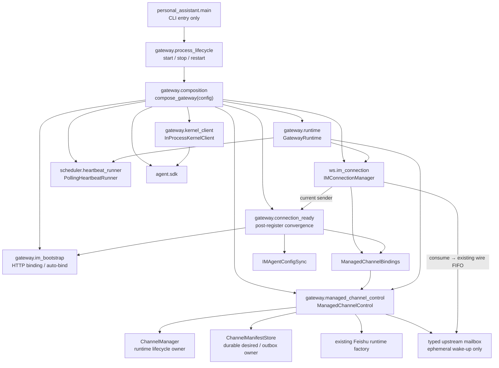

# refactor-470: 收回 managed channel composition ownership — 技术方案

> 对齐: motivation.md v1
>
> Unit branch: `unit/refactor-470` (will be created by orchestrator)

## Changelog

- v2 (2026-07-20): 关闭首轮 design review 的 2 CRITICAL + 2 WARNING：fatal owner
  mismatch 改为 receive stack 内同步 close directive；legacy cutoff 回写 motivation；测试
  import 基线修正为 38；register-ready orchestration 独立为 `connection_ready` owner。
- v1 (2026-07-20): 完成现状 grounding、Design It Twice 接口比较、managed-channel
  control boundary、legacy migration 截止、模块归属、验证策略与四个串行 milestone 设计。

## 现状分析

### 涉及范围

- `src/personal_assistant/main.py` 当前共 3,987 行；其中 `build_runtime()` 为
  927 行，并以 25 个嵌套函数或 lambda 同时承担对象装配和运行策略。
- 已经成形、应整体迁出的深模块包括 `GatewayRuntime`、后台进程生命周期、
  `PollingHeartbeatRunner`、IM bootstrap client 和进程内 Kernel adapter。它们的
  既有内部算法与生命周期语义不属于本次重新设计范围。
- 需要重新收回 ownership 的核心是 managed channel 控制面：credential 解封、
  manifest apply/cache、provider runtime 构建、Agent skill 激活、status/metadata
  上报、ACK/retry、reconnect 与 bootstrap 策略目前仍散落在 `build_runtime()`。
- `build_runtime()` 通过捕获稍后才赋值的 `im_connection_manager` 让 channel 状态
  回调反向发送 IM 帧，形成隐式构造环；Feishu skill 激活还直接调用
  `IMAgentConfigSync` 的 private 方法。
- 当前有 38 个测试文件 import 或引用 `personal_assistant.main`；其中既有直接
  from-import，也有模块级 monkeypatch。另有 2 个 contract 把 `GatewayRuntime` /
  kernel adapter 的物理位置写死。入口命令测试仍应守 `main` 边界，其余测试随真实
  owner 迁移。

### 既有约束

- `personal_assistant` 只能经 `agent.sdk` 使用内核，不能因迁移引入对
  `agent.core` / `agent.platform` 的新依赖。
- `ChannelManager` 继续作为动态 channel runtime、desired generation、替换和关闭
  顺序的唯一 owner；新模块不得复制其 `_active` / desired 状态或建立第二套状态机。
- `IMConnectionManager` 继续拥有 WebSocket、register gate、wire FIFO、ACK
  correlation 与 reconnect backoff；`ChannelManifestStore` 继续拥有 durable desired
  manifest、reconcile 结果和 status outbox。重构不得复制 retry/outbox ownership。
- current `credentialRef` / encrypted manifest 配置格式、持久化数据、IM/Gateway 协议、
  channel identity、会话历史及用户可见行为保持不变。唯一例外是决策 2 明确退休的
  standalone YAML → managed manifest 非契约 bridge；standalone static channel 本身仍
  保留。当前长青契约明确承诺的旧 lifecycle state 安全采纳逻辑继续保留。
- 不保留旧 private import、test-only re-export、重命名 alias、双 owner、feature flag
  或临时 compatibility shim；同一策略完成迁移后只剩一个真实位置。
- `channels.bootstrap` 初始化握手是现行协议，不能与旧 standalone YAML 明文导入混同。
  后者不属于长青行为契约，按决策 2 删除。
- 无前端交互或展示变更，本 unit 不制作 prototype。

### 可复用能力

- `ChannelManager.start_cached()` / `reconcile()` / `reconnect()` / `close()` 已封装
  managed runtime 的启停、代际切换和 fail-closed 应用，可直接作为唯一生命周期 owner。
- `ChannelManifestStore` 已提供加密 manifest cache、reconcile result 与 status outbox；
  `apply_channel_manifest_payload()` 已提供 manifest 解析、credential opener 和 manager
  apply 流程，无需另造持久层或解析器。
- `IMConnectionManager` 已实现 channel manifest/result/status/bootstrap 的 wire 处理、
  pending request ownership 与断线重试；新边界只需消除 callback zoo 与构造环，不能
  绕过其 single-writer FIFO。
- `IMAgentConfigSync`、`RuntimeConfigOwner`、`LiveAgentCatalog`、`GatewaySessionBinder`、
  `SessionRunCoordinator` 和 runtime delivery owners 均为现成 concrete owner。只有
  skill 激活需要补一个正式 public operation，不需要为单一实现制造抽象协议。
- `scripts/e2e-up.sh`、Gateway lifecycle 单测、managed-channel manager/store/apply
  测试和现有 contract 可组成迁移验证基座；真实 Feishu 冒烟需按 reviewer runbook
  使用现有 credentialRef/cache，并避免与主 Gateway 同时监听同一 Bot。

### 相关历史

- `refactor-461` 已确定 Gateway runtime 的资源图、有序关闭和后台进程安全生命周期；
  本 unit 保持这些不变量，只迁移物理归属。
- `refactor-463` 已采用 concrete owner、真实 owner 测试和删除 `main` 私有 re-export
  的收口模式；本 unit 延续同一模式。
- `feat-464` 已明确 `ChannelManager` 是动态 channel lifecycle 的唯一 owner，并约定
  cached startup、online reconcile、reconnect 与 close 行为；当前缺口是 transport、
  status、provider 和 activation 集成策略仍遗留在 composition root。

## 架构总览

改造前，`main.py` 同时是 CLI、进程生命周期 owner、runtime owner、composition root 和
managed-channel integration policy。改造后，入口只做命令分派；composition 只构造对象
图；每个有生命周期或状态的不变量归还给一个具名 owner。



图中 `ManagedChannelBindings` 是 IM 下行到 control 的 typed 调用面；mailbox 是 control
上行到 IM event loop 的跨线程通知面。两者都不拥有持久状态，因而不会与
`ChannelManager`、`ChannelManifestStore` 或 `IMConnectionManager` 形成重复 owner。

## 关键决策

### 决策 1：caller-first 装配 + 深的 managed-channel 控制边界

**选择**：Gateway 对外只提供 `compose_gateway(config) -> GatewayRuntime` 装配入口；
managed channel 由 `ManagedChannelControl` 收回完整集成策略，并以
`start_cached()`、`connection_bindings()`、`close()` 三个入口参与 runtime 与 IM
装配。`connection_bindings()` 返回一份强类型、不可变的
`ManagedChannelBindings`，`IMConnectionManager` 只接收这一组 channel control
bindings，不再由 composition root 逐个拼接 callback。

provider worker 产生的 status/metadata 通过一个 thread-safe upstream mailbox 交给
IM event loop，随后仍进入 `IMConnectionManager` 现有的 single-writer wire FIFO。
mailbox 只负责跨线程唤醒和传递 status/metadata typed emission，不解释 ACK、retry、
dedup 或 durable outbox 语义；这些 ownership 分别继续属于 `IMConnectionManager` 与
`ChannelManifestStore`。由此消除对尚未构造的 `im_connection_manager` 的 nullable
closure 捕获，也不建立第二条传输状态机。

`ManagedChannelControl` 内部组合既有 `ChannelManager`、`ChannelManifestStore`、
credential key/opener、manifest apply、Feishu runtime factory 与 Agent skill activation。
`ChannelManager` 仍是 adapter runtime 和 generation 切换的唯一 owner；control 不复制
其 active/desired 状态。

**不选择**：

- 不采用仅把旧 closure 改成方法的浅层 `ManagedChannelBinding`，因为它可能把构造环
  和 callback zoo 隐藏在新类内部，而没有形成可守的边界。
- 不采用通用 `handle(event)` 事件总线；当前 channel control use cases 已知且稳定，
  callback bundle 更直接，也避免产生新的巨型 dispatcher。
- 不引入 `ManagedChannelProvider` 插件协议或 provider 目录体系。当前只有 Feishu，
  继续使用已有 provider factory seam 即可；未来出现第二个 provider 时再以真实变化
  提炼协议。

**实现约束 `[worker]`**：

- `ManagedChannelBindings` 和 upstream emission 必须使用显式类型，不接受任意
  `message_type + dict` 作为内部通用消息总线。
- mailbox 不得成为第二个 durable queue 或 ACK owner；断线期间的权威数据仍只来自
  `ChannelManifestStore`，重连重放不得同时消费两份权威状态。
- `handle_status_result` 必须在 IM receive owner 的同一 await stack 返回 typed
  `ChannelStatusDirective`；`fatal_owner_mismatch` 返回 `CLOSE_CONNECTION`，由
  `IMConnectionManager` 先 `await close()` 再结束当前 frame，禁止经 mailbox 异步关闭。
- `IMAgentConfigSync` 增加正式的 `ensure_agent_skill_enabled(agent_id, skill_id)`；迁移
  后删除对 `_local_agent()` / `_enable_created_skill_for_agent()` 的 private 穿透。
- wiring aggregate、mailbox 和 bindings 均为 Gateway 内部实现；不得从 `main.py`
  re-export，也不得为旧测试路径保留 alias。
- 构造失败不得向调用方返回半装配对象；`compose_gateway()` 要么返回完整
  `GatewayRuntime`，要么以现有 startup error 语义失败。

**Design It Twice 对比**：最小 caller-first binding 改造成本最低但容易成为浅层
callback bag；typed event control 边界最深但会引入事件 union 与额外调度复杂度；
provider plug-in + typed transport 最利于多 provider 扩展，但当前收益不足以覆盖成本。
本决策保留 caller-first 调用面，并只吸收 typed control 方案中用于切断构造环的单一
mailbox，不引入其通用事件框架。

### 决策 2：删除非契约 legacy channel migration，保留 bootstrap 协议

**选择**：删除从本地 standalone YAML 读取 Feishu 明文凭据、生成初始 managed
manifest、cache 成功后回写 `credentialRef` 的自动迁移路径；同时删除 legacy export
脚本及其专属测试。`channels.bootstrap` 仍是 IM/Gateway 的现行初始化握手；当远端 head
未初始化时，Gateway 明确返回空 `items`，结果由 transport 正常结算，但不再触发本地
YAML cleanup callback。

**删除清单 `[worker]`**：

- `main.py` 中 `_legacy_bootstrap_items`、`_mark_legacy_bootstrap_cached` 及
  `bootstrap_credential_refs` 状态。
- `IMConnectionManager` 构造参数和字段中的 `channel_bootstrap_provider` /
  `channel_bootstrap_applied_handler` 及其专用 callback type。
- `config/local_store.py` 中仅服务该路径的
  `migrate_managed_channels_to_credential_refs()`。
- `scripts/channel-control-export-legacy.py`。
- `tests/unit/personal_assistant/test_channel_legacy_migration.py` 中仅覆盖上述历史迁移与
  export 的测试，以及其他测试对 cleanup callback/private provider 的过时断言。

**保留清单 `[worker]`**：

- `IMConnectionManager` 对 `channels.bootstrap.request` / result correlation 的 wire
  protocol 处理；收到 request 时由 transport 直接回空 `items`，不再委托 provider。
- 已加密 manifest cache、credential key 和 `credentialRef` 的现行加载行为。

该选择不改变长青契约。仍停留在旧 YAML 明文 channel 配置的部署可继续由 standalone
static channel 路径启动，但不再由新版 Gateway 自动导入 IM managed control；发布说明
应要求希望进入 managed control 的部署在升级前用当前版本完成迁移。代码回滚不会改写
现有 cache 或用户数据。

### 决策 3：按真实 owner 迁移，`main.py` 只保留命令入口

**选择**：形成如下物理边界：

| 目标模块 | 完整职责 |
|---|---|
| `personal_assistant.main` | 参数解析、命令分派和 `main()`；只通过模块限定名调用 owner，声明 `__all__ = ["main"]` |
| `gateway.composition` | 唯一 `compose_gateway(config) -> GatewayRuntime`；只构造完整对象图 |
| `gateway.runtime` | `GatewayRuntime`、运行时 lifecycle protocols 和有序 shutdown 资源图 |
| `gateway.process_lifecycle` | start/stop/restart、后台进程、state/PID lock、signal 和进程身份校验 |
| `gateway.managed_channel_control` | managed-channel 集成策略、bindings 和 upstream mailbox |
| `gateway.im_bootstrap` | IM HTTP bootstrap client、node binding 与 auto-bind |
| `gateway.connection_ready` | register ACK 后的跨 owner 收敛顺序、错误隔离与 degraded heartbeat |
| `gateway.kernel_client` | 进程内 Kernel adapter，正式命名为 `InProcessKernelClient` |
| `scheduler.heartbeat_runner` | polling runner；既有 heartbeat scheduler 算法保持原位 |

`GatewayRuntime`、process lifecycle、IM bootstrap 和 polling heartbeat runner 按当前
职责整体迁移，不借机重写算法。`_KernelClientShim` 的 “shim” 名称和旧 import 一并
删除；所有消费者改用 `InProcessKernelClient` 或其所在 consumer 已有的窄 protocol。

已有明确 owner 的 helper 移到最近的现有模块，例如 attachment、session binding、
runtime delivery；不为每个小函数建立新文件。纯构造和无状态参数投影可留在
`gateway.composition`，但该模块不得拥有 retry、credential、status、reconcile、
lifecycle policy 或跨调用可变状态，也不得新增 `composition_helpers.py` 等无领域含义
的承接文件。

**入口收口 `[worker]`**：

- `main.py` 不再直接 import 内部类/函数到自身 namespace；使用
  `gateway.process_lifecycle` / `gateway.composition` 等模块限定调用，避免形成事实
  re-export。
- `main` 的单测只验证参数解析、用户反馈和命令分派；runtime、process lifecycle、
  bootstrap、kernel adapter、heartbeat 与 managed channel 测试从真实 owner import。
- 更新 contract：不再要求 `GatewayRuntime` 位于 `main`，反而要求入口只暴露
  `main`，并阻止 runtime/composition policy 回流。
- 不以目标行数作为成功标准；验收以 ownership、依赖方向和没有 test service
  locator 为准。

## 接口与数据流

```python
def compose_gateway(config: LocalConfig) -> GatewayRuntime: ...


class ManagedChannelControl:
    async def start_cached(self) -> None: ...

    def connection_bindings(self) -> ManagedChannelBindings: ...

    async def close(self) -> None: ...
```

`ManagedChannelBindings` 覆盖现有 manifest apply、targeted reconnect、reconcile ACK、
status result、bootstrap 和 register-ready/reconnect 收敛 use cases。其字段可以直接作为
`IMConnectionManager` 的 typed handlers 使用，但 composition root 不再知道各 handler
的实现细节。

建议的具体 shape 如下；字段名允许 worker 按现有 vocabulary 微调，但职责和 ownership
不得改变：

```python
@dataclass(frozen=True, slots=True)
class ManagedChannelBindings:
    apply_manifest: ChannelManifestHandler
    reconnect: ChannelReconnectHandler
    acknowledge_reconcile: ChannelReconcileAckHandler
    handle_status_result: ChannelStatusResultHandler
    reconcile_after_register: ChannelRegisterReadyHandler
    emissions: "ManagedChannelEmissionSource"


ManagedChannelEmission = (
    ChannelStatusEmission
    | ChannelRuntimeMetadataEmission
)


class ChannelStatusDirective(Enum):
    CONTINUE = "continue"
    CLOSE_CONNECTION = "close_connection"
```

- emission 必须是穷举的 typed union；不得退化为任意 `message_type: str` + `dict`。
- mailbox 可以在 provider worker thread 调用 `publish()`，由绑定到 Gateway loop 的
  consumer 唤醒；它不在内存中承诺断线持久化。若 loop 尚未绑定或 IM 已断开，只保留
  durable store 中的权威状态，register-ready 阶段重新投影并发送。
- `IMConnectionManager` 仍负责把 emission 转成 wire payload、进入既有 FIFO、关联
  request/result 与 reset reconnect backoff；control 不直接持有 connection 引用。
- live manifest result 由 `apply_manifest` 直接返回；register-ready reconcile result 由
  当前 connection sender 直接发送。要求 transport ordering 的 close 不属于 emission：
  `handle_status_result` 返回 `ChannelStatusDirective`，IM receive owner 同步执行。
- bootstrap 不属于 managed control binding。删除 legacy importer 后，
  `IMConnectionManager` 收到 `channels.bootstrap.request` 时直接返回空 items；bootstrap
  result 仍由 transport 正常结算，但不存在 provider 或 cleanup callback。

在线 manifest 的主路径如下：

```mermaid
sequenceDiagram
    participant IM as IM service
    participant WS as IMConnectionManager
    participant Bind as ManagedChannelBindings
    participant Ctrl as ManagedChannelControl
    participant Store as ChannelManifestStore
    participant Manager as ChannelManager
    participant Provider as Feishu runtime
    participant Box as Upstream mailbox

    IM->>WS: channel.reconcile(manifest)
    WS->>Bind: apply_manifest(payload)
    Bind->>Ctrl: validate + decrypt + apply
    Ctrl->>Store: persist desired / pending result
    Ctrl->>Manager: reconcile(specs)
    Manager->>Provider: preflight + start/replace target
    Provider-->>Manager: runtime status / metadata
    Manager-->>Ctrl: typed status / metadata
    Ctrl->>Store: record durable status / generation
    Ctrl->>Box: publish typed emission
    Box-->>WS: event-loop wake-up
    WS-->>IM: existing FIFO / ACK correlation
```

关键失败路径保持现状：manifest 解密或 apply 失败返回 wire-ready failure，不污染已运行
generation；stale targeted reconnect 抛 `LookupError`；`fatal_owner_mismatch` 由 status
handler 返回 `CLOSE_CONNECTION`，`IMConnectionManager` 在同一 receive stack 先关闭再
return，不允许 flush 后继业务帧；`retryable_store_busy` 的定时重试由 control 调度，但
是否仍需发送以 store 中 request id 为准。

### IM register-ready 收敛

`IMConnectionManager` 的 `on_connected` callback 改为接收一个最小的当前连接 sender，
而不是让 callback 捕获稍后赋值的 manager。独立的
`gateway.connection_ready.ConnectionReadyCoordinator` 按现有顺序编排三个 concrete
owner：

1. 在 worker thread 做幂等 node binding；失败反馈并发送 degraded heartbeat，但不阻断
   后续 agent reconcile。
2. 调 `ManagedChannelBindings.reconcile_after_register()`，从 durable store 重放 pending
   status、provider metadata 和 reconcile result，并重试 pending activation。
3. 调 `IMAgentConfigSync.reconcile_all_agents()` 收敛 live Agent profile。

sender 只暴露当前回调真正需要的 `send_json()` / pending-request query，不形成另一套
transport abstraction；其 owner 仍是 `IMConnectionManager`。

`gateway.im_bootstrap` 只保留 HTTP client、node binding 和 auto-bind，不 import managed
channel 或 Agent reconcile owner；`ConnectionReadyCoordinator` 只拥有 register-ready
顺序与错误隔离，不复制三个被编排 owner 的状态或业务策略。删除 coordinator 会让同一
跨 owner 顺序重新落回 composition，因此它是具名 lifecycle coordinator，不是通用
helper。

### 启动与关闭顺序

启动保持现有顺序：static channels → `ManagedChannelControl.start_cached()` → skill
maintenance → IM watchdog → 首次连接尝试有界完成 → heartbeat runner。IM 不可达时，
cached managed channel 已先启动，外部 channel 保持自治。

关闭继续由 `GatewayRuntime` 的单一 shared deadline 控制：先 seal inbound/internal
dispatch、heartbeat、cron 等生产者，再 `ManagedChannelControl.close()` 停止 managed
runtimes，随后停止 static channels、收拢 Kernel/active runs、drain delivery 与 IM FIFO，
最后关闭 IM、mailbox consumer 和轻量 HTTP clients。mailbox close 不能早于 managed
runtime close 产生的最后状态，也不能延长既有 shared deadline。

## 契约层增量 (delta-spec)

无。该 unit 不改变 `docs/specs/kernel/`、`docs/specs/im/`、`docs/specs/gateway/` 或
`docs/specs/cli/` 的 current observable behavior：

- managed channel 的在线 apply、离线 cache、status/reconcile、identity 与消息行为不变；
- Gateway start/stop/restart、node binding、IM reconnect、heartbeat 与 cron 行为不变；
- 删除的 standalone YAML 自动导入和 legacy export 已被
  `docs/specs/gateway/external-channels.md` 明确排除在当前契约之外；
- 没有 API、wire schema、配置 schema、数据库或前端 delta。

因此本 unit 不创建 `specs/` delta 文件。实现收尾只需确认 canonical spec 未因代码迁移
产生漂移，并在发布说明注明旧 YAML 部署的升级前置动作。

## 风险与回退

| 风险 | 防护与验证 | 回退边界 |
|---|---|---|
| mailbox 形成第二个 queue，导致重复或丢 status | mailbox 仅传 ephemeral typed notification；durable store + request id 是唯一重放依据；覆盖断线、register replay、busy retry、close race | 整体回退 M1，恢复原 callback wiring；不改 cache 格式 |
| typed bindings 变成 callback bag，新策略仍回流 composition | control 的 public interface 行为测试 + contract 禁止 credential/status/reconcile policy 位于 composition/main | 回退对应 owner 迁移，不保留 forwarding shim |
| provider status 来自 worker thread，loop 绑定或关闭竞态泄漏 task | 覆盖 pre-bind publish、disconnect、rebind、shutdown deadline 和 consumer task 清零 | 回退 mailbox 接线与 control，store 数据仍可被旧代码读取 |
| module move 改变 runtime shutdown/startup 顺序 | 成熟类整体迁移；原 lifecycle/shutdown/watchdog 测试只改 import，并增加模块边界 contract | 每个 milestone 可独立 revert；无数据 migration |
| 删除 legacy YAML migration 影响尚未完成迁移的部署 | 发布说明要求希望进入 managed control 的部署升级前用当前版本完成迁移；新版 managed control 只接受 current credentialRef/cache，旧 YAML 仍走 standalone static channel | 回滚代码即可恢复 importer；不得让新版主动删除用户明文字段 |
| 大量 import churn 让低价值测试继续守旧路径 | 38 个 import/reference 文件按 owner 逐一分类：入口测试留 main，其余转真实 owner；删除重叠/私有断言，不加 alias | 单 milestone 回退测试与 owner move，保持主干可运行 |
| `composition.py` 取代 `main.py` 成为新巨石 | contract 检查 forbidden policy/import；review 以 state/ownership 而非行数判断；无领域归属的 helper 不准进入 | 阻止 M4 合入，继续从最后一个已通过 milestone 实施 |

所有 milestone 都是代码与测试布局变更，不改 manifest/cache/key、session、message、PID
state 或 config schema。回退使用相应 milestone commit revert；禁止通过清空 cache、重写
config 或并行保留旧/新 owner 来回退。

## Runbook for Reviewer

### 1. 自动化验收（必做）

先跑各 milestone 在 tasks.md 指定的最窄测试，最终至少执行：

```bash
.venv/bin/ruff check src/personal_assistant tests/unit/personal_assistant \
  tests/integration tests/contract

.venv/bin/pytest -q \
  tests/unit/personal_assistant/test_channel_manager.py \
  tests/unit/personal_assistant/test_channel_manifest_store.py \
  tests/unit/personal_assistant/test_channel_status_ack_handling.py \
  tests/unit/personal_assistant/test_channel_status_outbox.py \
  tests/integration/test_channel_bootstrap.py \
  tests/integration/test_channel_reconcile.py \
  tests/integration/test_channel_removal_reconcile.py

.venv/bin/pytest -q \
  tests/unit/personal_assistant/test_gateway_runtime_lifecycle.py \
  tests/unit/personal_assistant/test_gateway_runtime_watchdog.py \
  tests/unit/personal_assistant/test_gateway_shutdown_order.py \
  tests/unit/personal_assistant/test_gateway_shutdown_resource_graph.py \
  tests/unit/personal_assistant/test_gateway_shutdown_timeout_isolation.py \
  tests/unit/personal_assistant/test_gateway_launch.py \
  tests/unit/personal_assistant/test_gateway_pid_lifecycle.py \
  tests/unit/personal_assistant/test_auto_bind.py \
  tests/unit/personal_assistant/test_unattended_session_skills.py

.venv/bin/pytest -q \
  tests/contract/test_personal_assistant_main_contract.py \
  tests/contract/test_gateway_inbound_ownership_contract.py \
  tests/contract/test_test_naming_and_size_contract.py

.venv/bin/pytest -q -m "not e2e"
```

只跑直接受迁移边界影响的真进程旅程，避免把整个产品验收成本压进本 unit：

```bash
scripts/e2e-critical.sh \
  -k "gateway_im_resilience or restart_session_continuity or cron_job_auto_pushes_message"
```

heartbeat 真链路当前受已登记的产品 bug #126 影响，保持既有 strict xfail，不把它伪报为
本 unit pass；本次迁移用 heartbeat scheduler/runner 与 shutdown 单测证明不变。

### 2. 架构检查（必做）

- `personal_assistant.main` 只有 `main` 是正式导出；从测试或生产代码 import
  `GatewayRuntime`、`InProcessKernelClient`、heartbeat runner、bootstrap client 或
  lifecycle functions 应失败 architecture contract。
- `gateway.composition` 不包含 credential sealing/opening、manifest retry/status payload、
  process signal/PID、heartbeat loop 或 provider worker policy。
- `ManagedChannelControl` 不持有 `IMConnectionManager`，mailbox 不持有 durable retry
  状态；`ChannelManager` 仍是唯一 runtime map owner。
- `rg "_KernelClientShim|_legacy_bootstrap_items|migrate_managed_channels_to_credential_refs|channel-control-export-legacy"`
  在产品、脚本和测试中无结果；历史 archive 文档不计。

### 3. 真实 Feishu 冒烟（具备现有凭据时必做）

前置条件：`~/.nano-assistant/config.yaml` 使用 `credentialRef`，同目录存在
`channel-manifest-v1.json` 与 `channel-credentials-v1.pem`；测试期间必须先停止主 Gateway，
确保同一 Bot 只有一个长连接 consumer。不要打印或提交任何 credential/cache 内容。

1. 用 `mktemp -d` 创建 review 目录，复制上述 config、manifest cache 和 key；保持
   `node_id` 不变，使现有 IM desired state 与 cache identity 仍匹配。
2. 在 unit worktree 用复制后的 config 前台启动：

   ```bash
   PYTHONPATH=src .venv/bin/python -m personal_assistant.main \
     --config <review-dir>/config.yaml --foreground --auto-bind
   ```

3. 等节点 online；在 IM 通道页对目标 channel 执行 reconnect，确认状态回到 connected，
   再从真实 Feishu 1:1 对话发送唯一哨兵文本，确认同一 Agent 在原会话回复。
4. 停止 review Gateway，取一个空闲高位端口并将它作为不可达 IM URL，再次用同一 review
   config 前台启动；确认日志显示 IM 重试但 cached Feishu bot 已启动，并再次发送唯一
   哨兵文本验证离线自治。
5. Ctrl-C 后确认 review Gateway 完全退出、无残留 PID/consumer，再恢复主 Gateway；删除
   review 临时目录。若无法独占真实 Bot，本项记为 `inconclusive`，不得以启动日志替代消息
   往返证据。

无效凭据、多 Bot 隔离、disable/delete/replace 与断线 replay 使用可控的 unit/integration
fixture 验证，不在共享真实 channel 上制造破坏性配置。

## Milestones

本 unit 预计迁移/删除超过 2,000 行并触及数十个生产与测试文件，满足强制拆分条件。
四个 milestone 串行：它们都会从 `main.py` 删除职责或修改同一 composition seam，并行会
造成 import 路径冲突、短暂双 owner 和重复测试迁移。每步完成时系统只能有一套 owner，
且本 milestone 自带测试，不设置最后补测试的阶段。

| ID | 标题 | 依赖 | 并行组 | 范围 | 退出标准 |
|---|---|---|---|---|---|
| M1 | managed-channel control ownership | 无 | A | 新增 `gateway/managed_channel_control.py`；调整 `ws/im_connection.py`、`gateway/channel_manager.py`、`gateway/agent_config_sync.py` 与 `main.py` wiring；删除 legacy YAML migration/export 与 bootstrap provider/applied callbacks；迁移 channel/bootstrap/status 测试 | [reviewer] 在线 apply/reconnect、失败隔离、离线 cached startup 和 register replay 与 motivation 一致；[worker] control 三入口与 typed bindings 覆盖，mailbox 不复制 durable/FIFO owner，private skill 穿透和 nullable IM closure 消失，bootstrap wire 直接回空 items，legacy symbols/script/test/callback 删除；相关 unit/integration、ruff 通过。 |
| M2 | runtime-side deep modules | M1 | B | 新增 `gateway/runtime.py`、`gateway/kernel_client.py`、`scheduler/heartbeat_runner.py`；整体迁移 `GatewayRuntime`、kernel adapter、polling runner 与就近 helper；迁移 runtime/shutdown/heartbeat/cron/unattended tests | [reviewer] runtime startup、heartbeat/cron 主动行为和有序关闭保持；[worker] `InProcessKernelClient` 是唯一实现名，无 main re-export/alias，原 lifecycle resource graph 与 shared deadline 测试只改真实 owner import，消费端注释不再引用 shim/main 路径；聚焦测试、ruff 通过。 |
| M3 | entry-side lifecycle modules | M2 | C | 新增 `gateway/process_lifecycle.py`、`gateway/im_bootstrap.py`、`gateway/connection_ready.py`；整体迁移 start/stop/restart、state/PID/process identity、signal、node binding/auto-bind，并把 register-ready 跨 owner 顺序收进具名 coordinator；收窄 `main.py` | [reviewer] 默认后台启动、重复启动、stop/restart、auto-bind 与 IM reconnect 收敛不变；[worker] lifecycle state 安全采纳契约保留，`im_bootstrap` 不承担 channel/Agent 编排，on-connected 不捕获 nullable manager，launch/PID/command/auto-bind/reconnect tests 从真实 owner import；聚焦测试、ruff 通过。 |
| M4 | composition root 与测试表面收口 | M3 | D | 新增最终 `gateway/composition.py`；剩余 helper 归还现有 owner；`main.py` 收成 CLI entry；对 38 个 baseline import/reference 文件完成对账，迁移此前 milestones 尚未归位的全部剩余文件，更新 2 个 architecture contract；最终文档与验证 | [reviewer] motivation 中 channel、lifecycle、auto-bind、heartbeat/cron 受影响旅程通过，真实 Feishu smoke 有结论；[worker] `main.__all__ == ["main"]`，38 个 baseline 文件都有 owner/删除/保留结论，composition 无策略/可变状态，无 test-only re-export/compat alias/旧 symbol，test-size contract、ruff、`pytest -m "not e2e"` 与目标 e2e 通过。 |
