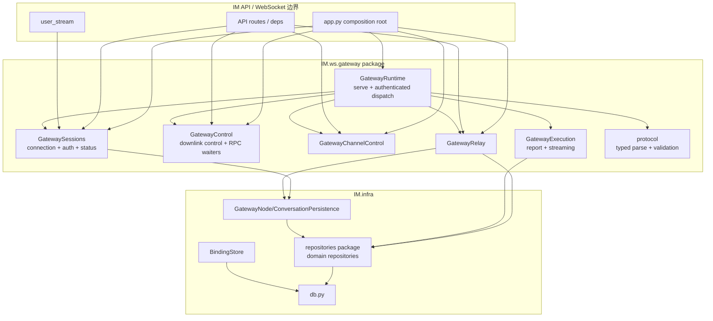
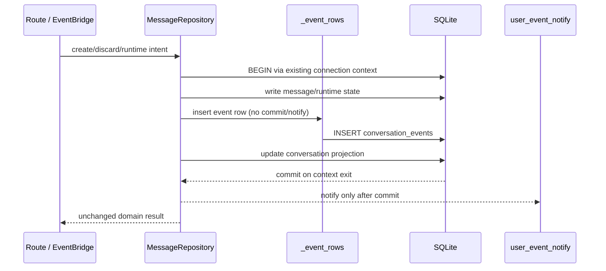
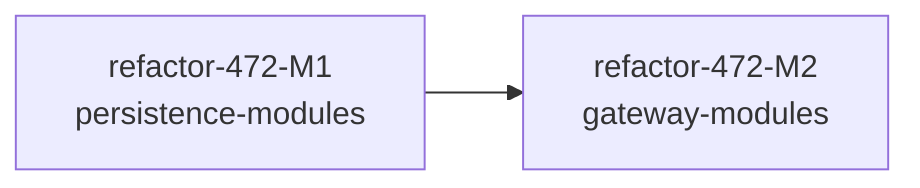

# refactor-472: 拆分 IM 持久化与 Gateway 巨石模块 — 技术方案

> 对齐: motivation.md v1
> Unit branch: `unit/refactor-472` (will be created by orchestrator)

## Changelog

## 现状分析

### 涉及范围

本 unit 有两个直接目标：

- `src/IM/infra/repositories.py` 现有 4,282 行，把 10 类 repository、跨表读模型、三类 post-commit notify、消息 timeline 编解码与共享时间格式压在一个文件中。直接生产 importer 有 19 个，测试 importer 有 66 个。
- `src/IM/ws/gateway_handler.py` 现有 2,837 行，把 WebSocket endpoint、连接替换与授权、状态广播、下行控制与 11 类 RPC、Channel 控制、relay/群扇出、streaming/EventBridge 翻译、report/usage 与协议校验压在一个类中。直接生产 importer 有 6 个，测试 importer 有 14 个；测试还存在类级 monkeypatch、subclass override 和私有 waiter/state 直写。

与两者直接相邻、但已经有清晰 ownership 的实现包括：

- `src/IM/infra/db.py`：集中持有 schema、migration、连接初始化；本 unit 不拆散 DDL。
- `src/IM/infra/binding_store.py`：以独立连接和 `BEGIN IMMEDIATE` 持有跨进程绑定事务。
- `src/IM/infra/gateway_persistence.py`：`GatewayNodePersistence` 与 `GatewayConversationPersistence` 已持有 node lifecycle 和 conversation delivery 的跨 repository 编排。
- `src/IM/infra/channel_control_store.py`：Channel desired/runtime/control-data 的唯一事务 owner。
- `src/IM/application/event_bridge.py`：streaming frame 对应的 message/event 持久化与浏览器通知 owner。
- `src/IM/application/relay_service.py`：relay task 幂等创建、状态推进与 payload owner。
- `src/IM/ws/gateway_protocol.py`：已有 package-local typed parser，但协议校验仍有一部分留在巨石文件底部。

数据流仍是同一条链：浏览器 HTTP/用户流进入 IM；IM 将消息经 `/im/ws/gateway` 下发给 Gateway；Gateway 回传 register/heartbeat/report/receipt/streaming/RPC result；IM 的 repository、EventBridge 与 RelayService 负责持久化和浏览器可见状态。本 unit 只重选内部 module/seam，不改变这条链。

### 既有约束

1. `IM` 不 import `agent` 或 `personal_assistant`；IM 与 Gateway 的协议两侧各自拥有 package-local parser/adapter，以 fixture/contract 对齐，不建立跨包 Python 共享实现。
2. SQLite 是唯一 concrete persistence implementation，测试已有真实临时 SQLite stand-in；不得为本次拆分引入每个 repository 的 Protocol/fake adapter。
3. `app.py` 继续是 composition root，并继续持有 app-scoped SQLite connection。普通 repository method 的既有 `with connection` commit 边界不变。
4. `BindingStore.confirm()` 的独立连接、`BEGIN IMMEDIATE`、CAS 和 rollback 语义不变；`GatewayNodePersistence.register()` 的历史多段 commit/失败残留语义也不变，不能为“整洁”包成一个原子 transaction。
5. `MessageRepository.create_message()` 与 provisional discard 中不可分割的 message、conversation event、conversation preview/unread projection 必须继续在同一 transaction 内完成；notify 必须在 commit 后执行。
6. `ConversationRepository` 是完整 read model，不是单表 DAO：participants、profile stale/run state、source agent 和 `source_jsonl_path` hydration 仍由它统一拥有。
7. 连接 map、live socket 身份、replacement、expected-socket disconnect 与 send-failure cleanup 必须由同一状态 owner 协调；旧 socket 的迟到清理不能删除新连接。
8. RPC waiter 的创建、等待、结果解除和 finally cleanup 必须共置，并保持当前仅按随机 `request_id` 关联的语义。不得顺手增加 target-node 校验或改变 timeout/空值降级。
9. `EventBridge` 继续拥有 IM 可见 runtime timeline；`ChannelControlStore` 继续拥有 Channel control persistence；拆文件不得把 SQL、commit 或 IM timeline shape 回流到 WebSocket transport。
10. 本 unit 是严格 behavior-preserving refactor；发现的产品或协议 drift 只能记录为风险/后续项，不能混入实现。

### 可复用能力

- **继续使用** `GatewayNodePersistence` / `GatewayConversationPersistence`：它们是 refactor-459 已建立的 caller-oriented deep module，Gateway WebSocket 侧只消费 typed outcome，不重新访问实体 repository 的 connection。
- **继续使用** `EventBridge` / `RelayService` / `ChannelControlStore`：三者已有明确 interface 和 state/transaction owner；新 Gateway module 只做协议翻译与编排，不再包一层 pass-through facade。
- **继续使用并迁移** `gateway_protocol.py` 的 typed facts/parser：并入最终 `IM.ws.gateway.protocol`，同时吸收当前巨石底部的 envelope/strict-field validation；不与 PA 共享 Python 类型。
- **新增一个内部 transaction-neutral primitive**：event row insert/row mapping 供 Message、Event、AgentConfigBoundary 三个 repository 在各自 transaction 中复用。它不 commit、不 notify，不成为 application 调用面。
- **新增共享时间格式 module**：repository package 与 `relay_watchdog` 复用同一个 UTC 文本 formatter，保持现有 `...Z` 字节格式；不借机清扫全仓其他本地 `_utc_now()`。
- **不新增抽象 adapter**：production 只有 SQLite repository 与 FastAPI WebSocket 实现。测试穿过 concrete module interface，使用真实 SQLite、fake WebSocket 或现有 app fixtures。

### 相关历史

- `refactor-459-im-persistence-depth` 已确定 persistence seam 按 caller 意图切、SQLite 直接作为 concrete implementation、`GatewayHandler` 不拥有 SQL/commit，以及 replace-don't-layer 的测试策略。本 unit继承这些决策。
- `refactor-454-gateway-runtime-protocol` 已确定 IM/PA 不能共享协议实现，`EventBridge` 继续拥有 IM timeline，Gateway handler 只解释 IM 侧 frame。
- `feat-464-im-channel-settings` 已确定 `ChannelControlStore` 的 transaction ownership；Channel control 不能并入通用 repository 或 generic RPC。
- `bugfix-471-agent-config-context-continuity` 新增了 typed timeline/config boundary：boundary event 与 boundary row 的同事务写入、durable ACK、resume/fork 顺序均为高风险回归面。
- 已确认但本 unit 不修的 drift：`ConversationRepository` 仍直接扫描 profile `workspace_root` 下的 JSONL，和 IM 不读取 Gateway workspace 的 canonical 描述冲突；RPC result waiter 未绑定原目标 node；Gateway skills RPC 文档名与真实 wire type 不一致；旧 permission marker/单表 bind confirm 存在遗留实现。以上均保持当前代码行为，另行立项。

## 架构总览

本 unit 命中 `codebase-design`：它重新选择两个重要 seam、重新归属 transaction/connection/waiter state，并要把白盒测试替换为 interface 测试。设计采用 deep module：每个 caller 学习少量 intent-level interface，复杂 SQL、状态机、ordering 和错误模式留在实现内部。



Before：所有 entity repository 共处一个文件；Gateway 所有 transport、state 与业务 ingress 共处一个类，调用方统一依赖巨石路径。

After：repository 按 durable aggregate/transaction ownership 归位；Gateway 由一个薄 endpoint runtime 加五个有状态 deep module 组成。`app.py` 显式装配，routes/deps 依赖所需的 concrete module，不通过 service locator，也不保留旧路径 shim。

### 目标文件结构

```text
src/IM/infra/
├── db.py                              # 保持 schema/migration owner
├── _timestamps.py                     # format_utc/utc_now；repository + watchdog 使用
├── binding_store.py                   # 保持独立 transaction owner
├── gateway_persistence.py             # 保持 workflow persistence owner
└── repositories/
    ├── __init__.py                     # 空；禁止聚合 re-export
    ├── users.py                        # UserRepository + user constraint errors
    ├── settings.py                     # SettingsPolicyRepository
    ├── conversations.py                # ConversationRepository + external result/read model
    ├── messages.py                     # MessageRepository + atomic write/runtime operations
    ├── _message_projection.py          # message/timeline codecs 与 synthetic merge
    ├── agents.py                       # AgentProfileRepository + version conflict
    ├── nodes.py                        # NodeRepository
    ├── bindings.py                     # BindRepository
    ├── metrics.py                      # UsageMetricsRepository
    ├── events.py                       # EventRepository + replay/relay identity types
    ├── config_boundaries.py            # AgentConfigBoundaryRepository
    └── _event_rows.py                  # insert/map primitive；不 commit、不 notify

src/IM/ws/gateway/
├── __init__.py                         # 空；禁止重建总出口
├── runtime.py                          # GatewayRuntime：serve + dispatch only
├── sessions.py                         # GatewayConnection、auth/register/heartbeat/disconnect/status/send
├── control.py                          # config/heartbeat/permission 下发 + request/result waiter
├── channel_control.py                  # init/bootstrap/reconcile/status/runtime metadata
├── relay.py                            # relay push/receipt/group fanout/agent/system/failure
├── execution.py                        # report/usage + streaming -> EventBridge
└── protocol.py                         # typed facts/parser/envelope/strict validation
```

最终删除：

- `src/IM/infra/repositories.py`
- `src/IM/ws/gateway_handler.py`
- `src/IM/ws/gateway_protocol.py`

所有 production/test/contract import 改到 canonical owner；最终不允许 compatibility re-export。

## 关键决策

### 决策 1: repository 按 durable aggregate 和 transaction ownership 拆

**选择 concrete domain repository package；一个 intent-level operation 隐藏完整 SQL、projection 和既有 commit/notify 顺序。**

- **理由**：User、Conversation、Message、Agent、Node、Event 等各有独立变化原因；Message/Event/Boundary 又各自拥有不可拆的 transaction 与 notify 语义。按这些 owner 拆能提高 locality，而不是按每张表/每条 SQL 切碎。
- **拒绝**：单个 `IMPersistence` 万能 facade。它的 interface 会重新等于整份 implementation。
- **拒绝**：repository 之间互相调用。跨 aggregate workflow 继续由 `Gateway*Persistence`、`BindingStore`、application module 编排；read model 内部可直接做 join/query。
- **风险**：`messages.py` 仍是较深的单领域 module；只把纯 projection/codec 下沉到 private module，不把 atomic write 分给 EventRepository。

### 决策 2: 不为 SQLite 增加 Port/Protocol/fake

**SQLite 属于 local-substitutable dependency，repository interface 直接由 concrete class 提供，测试使用真实临时 SQLite。**

- **理由**：只有一个 production adapter；临时 SQLite 已能覆盖 foreign key、unique constraint、transaction 和 ordering。
- **拒绝**：为每个 repository 建 Protocol + fake。单 adapter seam 只增加浅层和漂移风险。
- **风险**：测试比纯内存 fake 稍慢；通过聚焦 interface 行为和共享 DB fixture 控制。

### 决策 3: transaction-neutral event primitive 只在 repository package 内部复用

**`_event_rows.py` 只执行 event row 插入/映射，调用方 transaction owner 决定 commit 和 post-commit notify。**

- **理由**：Message create/discard、Event append、Config Boundary record 都写 conversation event，但 transaction 上下文不同。共享 row primitive 能统一字段格式，又不把 atomicity 交给另一个 repository。
- **拒绝**：`MessageRepository -> EventRepository.append_event()`。后者会自行 commit/notify，破坏 message + event + conversation projection 原子性。
- **风险**：private primitive 被误当 public seam；`__init__.py` 不导出，application/WS contract 禁止 import `_event_rows`。

### 决策 4: 旧 repository 文件和聚合出口最终删除

**所有调用方直接 import canonical domain module；`repositories/__init__.py` 为空。**

- **理由**：全部 importer 都在本仓，可一次迁移；旧 shim 或 package 总出口会继续吸收依赖，让“一个 import 面知道全部 repository”重生。
- **拒绝**：永久 compatibility façade。它只为减少本次 diff 服务，不提供长期 leverage。
- **风险**：87 个合并 direct importer 中大量测试需要同步迁移；用机械零命中检查和 collect-only 防漏。

### 决策 5: Gateway 拆成薄 endpoint runtime + 五个状态/流程 owner

**`GatewayRuntime` 只做 `serve` 和认证后的 frame dispatch；连接、control RPC、Channel、relay、execution 各由一个 deep module 持有。**

- **理由**：这些 module 分别拥有不同 state 与错误模式：connection replacement、Future lifecycle、Channel initialization lock、dispatch idempotency、timeline persistence。分开后每个变化集中在一个位置，主 dispatch 仍可一眼阅读。
- **拒绝**：每个 `message_type` 一个 handler class。它会复制 auth/ACK/error/correlation，并让协议全景消失。
- **拒绝**：保留一个拥有全部 route 方法的转发 façade。删除该 façade 后 complexity 不会消失，只是重新散回 collaborators；routes 应直接依赖所需 module。
- **风险**：显式 wiring 增加 `app.py` 行数；这是 composition root 应承担的可见依赖，不用 container/service locator 隐藏。

### 决策 6: 连接与 RPC 保留共享锁和现有 correlation 语义

**`GatewaySessions` 独占 connection/status state，`GatewayControl` 独占 waiter state；两者由 composition root 注入同一个既有 state lock。**

- **理由**：connection replacement/authorization/disconnect 必须有单一 owner；waiter create/resolve/cleanup 也必须共置。共享同一锁保留当前关键区排序，不在纯重构中改变并发语义。
- **拒绝**：每类 RPC 一个 waiter module/dict owner。它会重复 lifecycle，并扩大 race surface。
- **拒绝**：给 waiter 新增 `target_node_id` 校验。虽然更稳健，但会把当前“同 owner 其他 node 知道 request_id 时可 resolve”改成 timeout/拒绝，属于独立行为修复。
- **风险**：两个 module 共享 lock 是有意保留的内部 implementation coupling；lock 不暴露给 routes/tests，测试通过 request/resolve interface。

### 决策 7: Gateway 调用方依赖具体 deep module，不新增统一 Protocol

**app state/deps 分别暴露 `GatewaySessions`、`GatewayControl`、`GatewayChannelControl`、`GatewayRelay`；`GatewayRuntime` 只供 WebSocket endpoint。**

- **理由**：routes 的需要不同；具体 module 已是 interface。production 只有一个实现，测试可在现有依赖注入点 patch concrete method，没有引入 Port 的理由。
- **拒绝**：`GatewayTransport` 大 Protocol。它会把所有 public 方法重新聚成一个浅 interface。
- **拒绝**：runtime properties 作为 service locator。依赖应在 app/deps wiring 中显式。
- **风险**：现有测试对 `GatewayHandler` 的 16 处类级 patch、1 个 subclass 和私有 state 直写必须迁到对应 module/public path；先做 old→new coverage 对账，再删除白盒测试。

### 决策 8: replace-don't-layer，interface 是最终测试面

**行为覆盖迁到新 module interface/真实 HTTP+WS 入口后，删除锁定旧路径和 private state 的测试，不叠加第二套。**

- **理由**：测试应允许内部继续演进；`_connection`、`_waiters`、`_event_bridge`、旧 class 定义位置不是产品行为。
- **拒绝**：保留全部旧白盒测试再新增新测试。它会让 implementation 移动即红，抵消重构价值。
- **风险**：机械删除会漏边界；worker 在 `tasks.md` 建 old→new coverage matrix，逐项“新 interface/入口已有证据”后才删旧断言。

### 决策 9: 严格 no spec delta，不顺手修 drift

**HTTP、WS、事件、错误、数据库 schema、commit/notify 时点和用户可见结果全部保持；四个包均 `no spec delta`。**

- **理由**：motivation 已将行为不变定为硬边界。
- **拒绝**：借拆分修 workspace scan、RPC sender binding、skills RPC 文档、permission marker 或旧 bind confirm。每项都需要独立需求/兼容性判断。
- **风险**：代码审查可能把“明显可修”误当本 unit 清理项；Milestone 退出标准显式列出禁止项。

## 接口与数据流

### Repository interface 与依赖

| Module | application-facing interface | 隐藏的 implementation / 不变量 |
|---|---|---|
| `repositories.users` | `UserRepository`；`UserAlreadyExistsError` | user CRUD、owned-node/default-entry 读取投影、constraint 翻译 |
| `repositories.settings` | `SettingsPolicyRepository` | singleton seed/read/update；继续使用 `db.DEFAULT_SETTINGS_POLICIES` |
| `repositories.conversations` | `ConversationRepository`；`ExternalConversationWriteResult` | external identity race recovery、participants、stale/run state、source JSONL hydration |
| `repositories.messages` | `MessageRepository` | message/event/projection 原子写、discard tombstone、runtime/permission/thinking、history timeline |
| `repositories.agents` | `AgentProfileRepository`；`AgentProfileVersionConflictError` | owner-scoped selection、preserve/upsert、stale、乐观锁 |
| `repositories.nodes` | `NodeRepository` | registration/heartbeat/status/config/owner 与状态归一化 |
| `repositories.bindings` | `BindRepository` | bind request CRUD；生产 confirm 仍由 `BindingStore` 持有 |
| `repositories.metrics` | `UsageMetricsRepository` | owner/conversation/agent scope record 与 aggregation |
| `repositories.events` | `EventRepository`；`EventReplayResult`；`RelayRunIdentity` | event append、preview、recipient、resume/gap/window、relay identity |
| `repositories.config_boundaries` | `AgentConfigBoundaryRepository` | boundary event + row 同事务、幂等 retry、post-commit notify |

依赖只允许：

- repository module → `IM.domain.models`、`IM.infra.db`、`IM.infra._helpers`、`IM.infra._timestamps`；
- messages/events/config-boundaries → package-private `_event_rows`；messages → `_message_projection`；
- `gateway_persistence.py` → users/agents/nodes/conversations 的 public interface；
- application/api/ws → 自己实际使用的具体 repository module；
- repository module 之间不得通过 repository object 横向编排。

### Message 原子写主流程



`EventRepository.append_event()` 与 `AgentConfigBoundaryRepository.record_from_gateway()` 使用同一 row primitive，但各自保留自己的 transaction 与 notify 时点。任何 exception 仍按当前 method 边界 rollback/传播。

### Gateway concrete module interface

| Module | caller-visible operations | 独占 state / ordering |
|---|---|---|
| `GatewayRuntime` | `serve(websocket, authenticated_owner_id)`；内部测试可通过 `handle_message` 驱动已认证 dispatch | accept/decode/ACK/error/finally disconnect；先 authorize 再 dispatch；register ACK 后才 Channel init |
| `GatewaySessions` | routes: `is_connected`, `snapshot_connection`, `list_connected_node_ids`, `force_mark_offline`；package 内: `register`, `authorize`, `heartbeat`, `send`, `disconnect` | `_connections`、socket replacement、durable owner check、expected-socket cleanup、owner status seq |
| `GatewayControl` | `push_config_sync`, `push_heartbeat_trigger`, `push_permission_response`；现有全部 `request_*`；package 内 result handlers | 所有 request-id/Future maps、shared state lock、push-before-wait、timeout/None、finally cleanup |
| `GatewayChannelControl` | `initialize`, `push_reconcile`, `push_reconnect`；package 内 bootstrap/reconcile/status/metadata handlers | per-node initialization lock、credential key/owner check、manifest/revision/status ordering |
| `GatewayRelay` | `push_relay_message`, `record_relay_failure`；package 内 receipt/group/agent/system handlers；user/conversation target 的即时消息委托 `GatewayExecution.emit_instant_message` | send-success 后 mark-dispatched、agent-message lock、durable first-write-wins、peer route freshness；不得直接拼装 message/event timeline 或绕过 EventBridge |
| `GatewayExecution` | package 内 report/streaming handlers；`emit_instant_message(...)` 供 Relay 的 user/conversation target 使用 | 所有 Gateway→EventBridge timeline 入口的唯一 owner：report caches、best-effort report persistence、turn-start ACK、streaming/instant message 的持久化、实时通知与 usage mapping |
| `gateway.protocol` | parse/decode/require helpers与 typed facts | wire schema、稳定 validation/error；不持状态、不 import PA |

`app.py` 创建一个 shared `asyncio.Lock`，显式构造 Sessions/Control/Channel/Relay/Execution/Runtime；将 route-facing module 分别放入 app state。`api/deps.py` 提供窄 concrete dependency getter。旧 `get_gateway_handler()` 和 routes 上的 `GatewayHandler` 类型依赖删除。

### Web IM → Gateway → timeline 主流程

```mermaid
sequenceDiagram
    participant Browser
    participant Route as IM route
    participant Relay as GatewayRelay
    participant Sessions as GatewaySessions
    participant PA as Node Gateway
    participant Runtime as GatewayRuntime
    participant Exec as GatewayExecution
    participant Bridge as EventBridge
    participant DB as repositories

    Browser->>Route: send message
    Route->>Relay: push_relay_message
    Relay->>Sessions: send relay.message
    Sessions->>PA: websocket send
    Relay->>DB: mark relay dispatched after send succeeds
    PA-->>Runtime: node.streaming_delta turn_start
    Runtime->>Sessions: authorize live socket/node/owner
    Runtime->>Exec: handle streaming event
    Exec->>Bridge: create running placeholder
    Bridge->>DB: durable message + replayable event
    DB-->>Browser: user-stream notify
    Exec-->>PA: ACK with existing message_id/resolved conversation
    PA-->>Runtime: delta/tool/thinking/completed or discarded
    Runtime->>Exec: authorized dispatch
    Exec->>Bridge: update same message and append event
    Bridge->>DB: unchanged commit + notify semantics
    DB-->>Browser: live result; refresh reads same durable state
```

Gateway 上行 `agent.message` 的 user/conversation target 走同一 timeline owner：`GatewayRelay` 负责 source/target 解析、dispatch first-write-wins 与 relay 选择；需要生成浏览器即时消息时，只把 intent 交给 `GatewayExecution.emit_instant_message(...)`，后者调用现有 `EventBridge.emit_instant_message()` 完成 durable message、`message.created`/`message.completed` 与 post-commit notify。system message、relay failure 和 agent-target relay 继续由 Relay 负责既有持久化/中继，不得把 user-target 即时消息降级为仅写历史的 `MessageRepository.create_message()`。

### Gateway 连接状态

```mermaid
stateDiagram-v2
    [*] --> Unregistered: WebSocket accepted after Bearer/JWT/user check
    Unregistered --> Registered: node.register owner check + durable register + ACK
    Registered --> Registered: heartbeat / report / receipt / streaming / RPC result
    Registered --> Replaced: newer socket registers same node_id
    Replaced --> [*]: old socket finally; expected-socket mismatch preserves new mapping
    Registered --> Offline: current socket disconnect/send failure/force offline
    Offline --> [*]
```

安全 authority 始终是“已认证 owner + 当前 live socket 注册的 canonical node”，不是 payload 自报的 node id。`GatewaySessions.authorize()` 继续覆盖 payload node id，并在 durable owner drift 时拒绝。

### RPC 等价约束

所有现有 `request_*` operation 保持：

1. 原 request-id prefix、frame type/payload、默认 timeout 不变；
2. 下行发送前把 Future 登记到对应 waiter registry；
3. offline/send failure/timeout 返回当前相同的 `None`/空值/False；
4. 所有退出路径在 finally 删除 waiter；
5. result handler 继续做当前字段校验/归一化，再仅按 `request_id` resolve；
6. 不新增 sender node binding，不改变 late result 与未知 request id 行为。

## 契约层增量 (delta-spec)

- kernel: no spec delta
- im: no spec delta
- gateway: no spec delta
- cli: no spec delta

这是纯内部重构。若 worker 发现任何步骤必须改变 HTTP/WS/UI/schema/错误或持久化可观察语义，必须停止并更新 change 文档/另立 unit，不能在 implementation 中静默产生 delta。

## 风险与回退

| 风险 | 具体后果 | 缓解 / 回退 |
|---|---|---|
| transaction/notify ownership被文件移动切断 | message 已提交但 event/projection 缺失，或浏览器先收到未 commit 事件 | Message/Event/Boundary 真实 SQLite interface 测试；`_event_rows` 禁 commit/notify；每个迁移 roadpoint 单独可 revert |
| Gateway register 被“优化”为单 transaction | 第 N 个 agent 失败后的 durable rows 与历史行为不同 | 保留 `GatewayNodePersistence` 及 failure-injection 基线；禁止新增 outer transaction/lock |
| 旧 socket cleanup 删除新 connection | 节点重连后被错误标 offline，消息无法投递 | Sessions interface 覆盖 replacement + expected-websocket disconnect；真 WS integration 重连验证 |
| RPC 抽取改变 timeout/空值/关联 | Agent 配置、cron、skill、fork 等在线操作误超时或接受规则变化 | 每个 request/result 现有 contract 对账；保持 request-id-only；control module interface 测试 |
| Channel 初始化与 register ACK 顺序漂移 | 未注册节点收到 manifest，或错误 owner key 被信任 | runtime 时序测试固定 ACK 后 init；channel owner/key/revision tests 保持 |
| 测试只改 import、真实路径失去覆盖 | suite 绿色但连接/relay/timeline 已回归 | old→new coverage matrix；replace-don't-layer；HTTP/WS integration + e2e-critical，不以 private white-box 代替 |
| 87 个 importer 迁漏 | runtime import error 或旧路径继续成为事实入口 | `pytest --collect-only` + 全仓旧 import 零命中；最终物理删除旧文件 |
| 已知 drift 被顺手修复 | 纯 refactor 混入产品变化，无法判断回归来源 | 明确禁止 workspace scan/RPC target binding/skills wire 文档/permission marker/bind confirm 清理；另行立项 |

**降级路径**：无 feature flag、无双实现。M1 完成后 repository package 是唯一实现；M2 完成后 gateway package 是唯一实现。某 roadpoint 失败时回退该 roadpoint 到上一份通过测试的结构。

**数据回滚**：不改 schema 或用户数据，无数据迁移/回滚。代码回滚恢复原 module 即可读取同一数据库。

## Runbook for Reviewer

| 服务 | 停止命令 | 启动命令 | 健康检查 |
|---|---|---|---|
| worktree IM + Gateway 真栈 | `./scripts/e2e-down.sh` | `./scripts/e2e-up.sh` | `source .e2e-ports.env && curl -fsS "$IM_URL/openapi.json" >/dev/null`，并确认 `.gateway.log` 已出现 Gateway ready/register 信号 |

**Review 驱动方式**：端到端真栈。本 unit 不改客户端面，允许使用 Web IM 实际调用的 HTTP API、浏览器实际使用的 `/im/ws/user`，以及 Gateway 实际使用的 `/im/ws/gateway` 代替人工点击；不得直接调用 repository/Gateway private handler 作为 reviewer 证据。至少走：双租户隔离、消息刷新一致性、Gateway register/heartbeat、Web IM 一轮真实 Agent 回复、旧连接迟到断开、非法 frame、在线 control RPC、Gateway offline 降级。

**验收前置**：

- `~/.nano-assistant/config.yaml` 存在且含 `llm:`；本设计阶段已确认可用。
- 本地 LLM proxy `http://127.0.0.1:4000/health` 可达；本设计阶段已确认健康。
- 测试账号由 `scripts/e2e-up.sh` 在隔离 IM 中创建；无需外部 Channel 凭据。外部 Channel/群扇出行为使用已有 integration fixture 验证，不把 Feishu 真凭据作为本 unit 前置。
- reviewer 必须用 worktree ephemeral 端口和隔离 config；结束后执行 `./scripts/e2e-down.sh`。

## Milestones

拆分为两个串行 milestone，命中“超过 800 行、10 个文件、4 小时单 worker窗口”的硬触发条件。两段分别交付完整的 persistence module 与完整的 Gateway WebSocket module，不是“先类型/后实现/后测试”的横切。M2 依赖 M1 的最终 repository import 路径，因此不伪装并行。



| ID | 标题 | 依赖 | 并行组 | 范围 | 退出标准 |
|---|---|---|---|---|---|
| refactor-472-M1 | persistence-modules | — | A | `src/IM/infra/repositories.py`（删除）；新增 `src/IM/infra/repositories/`、`src/IM/infra/_timestamps.py`；修改所有 repository 生产/测试 importer、`gateway_persistence.py`、`relay_watchdog.py`、`app.py`、`api/deps.py`、persistence seam contract 与相应 unit/integration tests；不重构 `db.py`/`binding_store.py`/application 业务逻辑 | `[reviewer]` motivation 的“账号、租户与持久化数据行为保持稳定”三个 Scenario 全部通过：两个 owner 分别登录后，账号/会话/消息/Agent/节点/策略/用量页面只见授权数据；刷新后消息/timeline/摘要完整且无重复；会话创建/改名/成员增减、Agent 配置与创建、节点绑定/状态、policy 读写、metrics owner 过滤的成功、冲突、跨 owner 拒绝和离线结果保持。`[worker]` 旧 `IM.infra.repositories` import 零命中且文件删除；repository package 无聚合 re-export；Message create/discard、Event append、Boundary record 的 transaction + post-commit notify、Conversation hydration/external race、Profile optimistic lock、BindingStore/Gateway register 既有 commit 语义均由真实 SQLite 测试覆盖；扩展/迁移 `tests/im_service/integration/test_auth_multiuser_isolation.py`、`test_nodes_metrics_api.py`、`test_bind_atomicity.py`、`test_account_binding_api.py`、`test_messages_api.py` 与现有 conversation/agent config tests，覆盖上述 reviewer 路径；private-state 旧测试完成 old→new 对账后删除/改写；persistence seam contract、`pytest tests/ --collect-only`、`ruff check .`、`ruff format --check .` 全绿；不修已列 drift。 |
| refactor-472-M2 | gateway-modules | refactor-472-M1 | B | `src/IM/ws/gateway_handler.py`、`gateway_protocol.py`（删除）；新增 `src/IM/ws/gateway/`；修改 `app.py`、`api/deps.py`、`api/routes/{messages,agents,nodes,web_im,account}.py`、`user_stream.py`、persistence/protocol architecture contracts、所有 Gateway handler/protocol 生产与测试 importer；不改 PA 对端协议实现 | `[reviewer]` motivation 的 Gateway 七个 Scenario 全部通过，并重跑 M1 三个 Scenario：注册/心跳与状态、Web IM 实时回复和刷新一致、replacement 后旧连接断开不误伤、非法 frame 明确反馈、在线配置/control RPC、后台/群/外部事件不重复且 owner 隔离、Gateway offline 降级。`[worker]` 旧 `IM.ws.gateway_handler` / `gateway_protocol` import 零命中且文件删除；Runtime/Sessions/Control/Channel/Relay/Execution/Protocol ownership 符合 interface 表，handler 不直接 SQL；RPC request-id/timeout/空值语义、shared lock、register ACK→Channel init、relay send-success→mark-dispatched、所有 Gateway→EventBridge timeline（含 user/conversation target `agent.message` 即时事件）ownership 保持；类 patch/subclass/private waiter tests 完成 old→new coverage 对账后迁到新 interface/真实入口；聚焦 Gateway unit/contract/integration必须覆盖 user-target `agent.message` 的真 WS 实时事件、刷新一致、幂等与跨 owner 隔离；`PYTHONPATH=src pytest -m "not e2e"`、`scripts/e2e-critical.sh -m "not slow"`、`ruff check .`、`ruff format --check .` 全绿；不修已列 drift。 |
