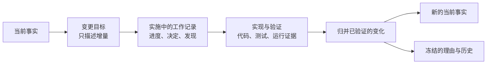

# Agent-Native 代码仓文档体系

> Agent 时代需要的不是更多文档，而是把代码仓建设成一个可探索、可判权、可恢复、可验证、可持续演进的工作环境。

## 引言

Coding Agent 正在改变软件开发的基本工作单元。

过去，我们通常把软件生产理解为一条由不同岗位协作完成的流水线：产品经理定义需求，设计师维护设计稿，开发者在代码仓中实现，测试工程师在测试平台管理用例，发布工程师操作 CI/CD，运维人员在监控、日志和工单系统中处理线上问题。每个岗位有自己的专业工具、文档和工作上下文，这种分布是组织分工的自然结果。

Coding Agent 带来的变化，不只是“开发者多了一个代码补全工具”。一个 Agent 可以在同一个任务中完成需求理解、代码探索、方案设计、实现、测试、浏览器验收、部署和运行诊断。原本横向分布在多个岗位之间的执行链，开始被垂直整合进同一个 Agent loop。

产品、设计、测试、安全和运维的专业责任仍然存在，但**同一个执行主体需要连续穿越这些环节，并在有限上下文中判断什么是当前事实、什么是未来计划、什么是历史经验、什么能够证明结果。**

因此，文档不再只是人类需要时查阅的说明材料。它开始成为 Agent 工作环境的一部分：帮助 Agent 理解意图、识别边界、恢复任务、调用正确流程，并把新的发现沉淀回仓库。

一套 Agent-Native 的代码仓文档体系，最终要回答四个问题：

1. 为什么 Agent 时代需要一套不同的文档体系？
2. 代码仓中究竟需要管理哪些知识？
3. Agent 如何在不过载的情况下找到、判断和使用这些知识？
4. 怎样让这套体系长期保持可信，而不是演化成另一座文档垃圾场？

## WHY - 为什么 Agent 时代需要不同的文档体系

### 从岗位横向分工到 Agent 垂直整合

传统软件生产中，知识跟随岗位和作业平台分布：

每个环节只需要掌握局部上下文。跨环节的信息不完整时，人可以通过会议、即时沟通、组织经验和责任人网络补齐。文档是否与代码在同一处固然影响效率，却不一定立即阻断工作。

Agentic Coding 的工作形态不同：


*图 1：左侧说明传统流程为什么能够容忍文档分散——知识断点由会议、责任人网络和组织经验补偿；右侧说明同一 Agent 连续执行后，断点会沿计划、实现、验证和交付传播。底部由此推出仓库必须显式提供的五类知识与控制条件。*

同一个 Agent 需要在一次任务或连续多个 session 中保持从意图到运行结果的因果链。如果产品契约在一个系统、架构决策在聊天记录、运行手册在个人笔记、真实配置只存在某台机器上，Agent 就必须反复猜测和拼接。这种信息断裂不再只是沟通成本，而会直接变成错误实现、错误验证和错误操作。

Anthropic 对约 40 万个 Claude Code session 的分析观察到：典型 session 中，人类承担约 70% 的规划决策，而 Claude 承担约 80% 的执行决策；一次用户指令平均触发约 10 个 Agent 动作，有时超过 100 个。这不意味着人应该退出软件生产，而是说明新的分工正在形成：**人更集中地决定做什么、为什么做和什么算完成，Agent 更集中地决定读什么、改哪里、运行哪些工具以及如何迭代。**

当执行决策被集中到 Agent，仓库就需要提供一个连续、可信、可操作的上下文环境。

### 代码仓正在从“源码容器”变成 Repository Harness

一个适合 Coding Agent 工作的代码仓，不只是源代码集合。它逐渐成为一个 Repository Harness：

| 能力 | 作用 |
|---|---|
| 可探索的工程基底 | 代码、配置、schema、依赖关系和版本历史可以被 Agent 搜索与理解 |
| 知识体系 | 当前事实、工作状态、证据、历史和入口有明确边界 |
| 操作接口 | 安装、生成、测试、启动、发布和诊断有稳定脚本或工具 |
| 反馈系统 | Agent 能通过测试、构建、浏览器、日志和运行状态判断结果 |
| 隔离与授权 | worktree、sandbox、凭证、权限和审批限制行动后果 |

文档体系是这个 Harness 的知识与上下文层。它无法替代可运行的代码、可靠的测试和真正的权限控制，但会决定 Agent 能否理解这些能力应该在何时、以何种方式使用。

OpenAI 在一个近百万行、约 1500 个 PR、主要由 Codex 生成代码的内部项目中，也经历过这一转变。团队最初试图把大量说明都塞进 `AGENTS.md`，很快遇到上下文挤占、信号稀释、内容腐化和无法机械验证等问题。后来，他们把 `AGENTS.md` 收缩成地图，把结构化仓库文档、执行计划、测试、lint 和 CI 共同建设成 Agent 的工作环境。

这里最重要的不是“`AGENTS.md` 应该有多少行”，而是：

> 给 Agent 一张足够清楚的地图、不可误解的边界和可以运行的反馈系统，而不是一本每次任务都要背诵的百科全书。

### 为什么与代码共同治理变得重要

Agent 时代把长期知识放到代码仓附近，至少有四个直接价值。

**第一，版本对齐。**

需求、架构、行为契约、运行方式和代码一起变化。只有它们进入同一个版本和评审边界，Agent 才能知道某条规则适用于哪个 commit，而不是拿今天的文档解释半年前的代码。

**第二，可自主消费。**

Agent 可以直接搜索仓库、跟踪链接、读取历史、运行脚本，不必等待某个岗位的人把正确文档复制进聊天框。仓库中的结构、命名、状态和入口，本身就是机器可消费的上下文接口。

但“文件可以被搜索”不等于“Agent 会发现并读取它”。搜索动作也要由当前上下文触发：Agent 首先要知道某类知识可能存在，才能形成查询、判断结果是否值得打开。根级指令指向文档地图，地图列出文档并说明用途，页面再链接相关概念、来源和替代版本，这条引用链才把磁盘上的文件变成 Agent 实际可消费的知识。

**第三，可执行反馈。**

自然语言只能告诉 Agent“应该怎样”，测试、schema、lint、构建和运行状态才能告诉它“实际上是否做到”。当说明和验证工具共同演进，Agent 才可能形成 Explore → Act → Verify → Repair 的闭环。

**第四，跨 session 恢复。**

聊天上下文会压缩、结束或切换，Agent 也可能由另一个实例接手。保存在仓库中的计划、进度、决策、提交和验证证据，可以让后续 session 从真实状态继续，而不是依靠模型对旧对话的模糊记忆。

### 传统文档问题为什么会在 Agent 时代被放大

传统软件生产中的文档本来就分布在不同岗位和作业平台中。产品经理知道哪个需求版本有效，开发者知道某份设计已经被实现取代，测试工程师知道哪些验收条件没有写进用例，运维人员知道启动命令之后还要观察哪些信号。文档没有独立表达完整事实时，责任人、会议、交接和团队经验构成了一层隐形的解释与纠错机制。

Coding Agent 垂直整合这些环节之后，这层机制不再天然存在。同一个 Agent 要连续完成需求理解、方案设计、代码修改、测试、交付和运行诊断，并自行决定读取什么、相信什么以及下一步做什么。仓库中的一个知识断点会沿整条执行链传播，而不再只停留在某次岗位交接中：

| 隐性问题                        | 过去如何被组织补偿                    | Agent 执行时的后果                            |
| --------------------------- | ---------------------------- | --------------------------------------- |
| README、Wiki 和聊天记录对同一规则有不同说法 | 找责任人确认当前口径                   | Agent 可能选择错误来源，并据此完成整套实现与验证             |
| 未来设计、历史方案和当前行为混在一起          | 团队成员知道哪个版本已经上线               | Agent 可能把目标状态当成当前事实，或者按废弃方案修改代码         |
| 运行手册只写启动命令，没有 ready 信号      | 操作者凭经验观察日志、端口和依赖服务           | Agent 无法判断系统是已经可用、仍在启动，还是已经失败           |
| 重要目录和架构边界只存在于团队共识中          | 熟悉代码的人会主动避开，reviewer 会在评审中纠正 | Agent 可能在错误的责任主体上完成大量工作，直到后期才暴露问题       |
| 长任务的真实状态只存在于执行者脑中           | 同一个人继续推进，或通过口头交接恢复           | session 切换后，Agent 可能重复工作、遗漏决策或覆盖已经完成的修改 |
| 过时文档没有明确状态，也没有人与代码共同维护      | 团队成员能凭背景识别“这份文档已经不能信”        | Agent 可能把形式完整但已经过时的文字当成权威事实             |

因此，Agent 时代会直接暴露软件生产中原本由人和组织承担的判权、补全、纠错与交接。只要这些机制没有被显式建模进仓库，文档缺陷就会从沟通成本演变成错误计划、错误实现、无效验证和危险操作。

Agent-Native 文档体系要做的，是把这套隐形机制转化为仓库中可以自主消费的显式结构：明确哪个来源是当前权威，区分当前事实、未来计划和历史记录，通过引用与任务路由让 Agent 找到相关知识，用状态和版本支持跨 session 交接，并用测试、检查和运行信号纠正文档与现实之间的偏差。

## WHAT - Agent-Native 代码仓需要哪些文档

### 管理对象不是 Markdown，而是仓库知识

Agent 需要的知识不只存在于 Markdown，还分布在产品与架构契约、代码和 schema、测试与 CI、活动任务、运行证据、历史记录，以及 `AGENTS.md`、skills、hooks、权限和文档索引中。索引与页面引用也属于体系的一部分，因为它们决定这些知识能否从已知入口被发现。

不同载体回答的问题不同：契约说明系统应该怎样，代码和配置说明现在如何实现，测试与日志提供观察证据，历史记录解释过去的选择。因此，Agent-Native 文档体系首先要区分知识角色，而不是把所有内容当成同一种“文档”，或给它们排一条不分问题的总优先级。

### 仓库知识的五种角色

综合 Agent-first 仓库、长任务工作记忆、Docs-as-Code、ADR、知识索引和确定性控制等实践，本文按照知识在 Repository Harness 中的主要作用，将仓库知识归纳为五种可以重叠的角色。

| 角色 | 在仓库中实际承担什么 | 常见内容 |
|---|---|---|
| **Truth** | 保存已经生效、后续任务应以之为基线的产品、架构、实现和操作事实 | 产品原则、架构、current contract、代码、配置、schema、runbook |
| **Work** | 保存正在改变什么、已经做到哪里、做过哪些决定以及还有什么尚未验证，使任务能够跨 session 继续 | issue、spec、design、plan、progress、decision log、delta |
| **Evidence** | 保存测试、构建和运行中实际观察到的结果，用来判断实现或声明是否成立 | tests、CI、runtime state、日志、trace、截图、benchmark |
| **Memory** | 保存已经完成或被替代工作的背景、原因、取舍和后果，让后续任务理解历史而不把历史当成当前事实 | ADR、completed change、incident、retro、research、Git/PR history |
| **Control** | 让 Agent 找到正确知识、进入正确流程和检查、定位责任人，并把必须遵守的规则交给真实门禁和权限机制 | 文档地图、index、交叉引用、metadata、workflow、skill、CODEOWNERS、CI、permissions |

五种角色之间最重要的边界是：

- Work 描述未来目标和当前过程，在完成实现、验证和归并前不能覆盖 Truth；
- Evidence 可以支持或反驳 Truth，但一次日志或截图本身不是长期规范；
- Memory 负责解释与取证，不因为被保留就重新变成 current；
- Control 负责路由和约束，不能偷偷成为产品行为或架构事实的唯一存储位置。

### 从知识角色到 Harness 能力

五种知识角色说明代码仓需要管理什么。但把这些知识分类、存放并相互链接，并不自动意味着仓库已经能够支持 Agent 完成真实工作。

[Better Harness 的 Software Fluency 模型](https://github.com/QoderAI/better-harness/blob/main/models/software-fluency.zh-CN.md)从供给侧提出五项项目能力：上下文地图、环境就绪、快速反馈、质量门禁和变更安全。它们描述 Repository Harness 为 Agent 提供了什么。[Agent Work Loop 模型](https://github.com/QoderAI/better-harness/blob/main/models/agent-work-loop.zh-CN.md)则从一项真实任务出发，检查这些机制能否协同形成任务理解、受控执行、变更验证、可靠交付和经验沉淀的完整闭环。


*图 2：左矩阵把五种知识角色映射到五项 Harness 能力，右矩阵再把这些能力映射到 Agent Work Loop。圆点只标出正文直接论述的关键支撑关系，用来呈现多对多结构；尤其可以看出 Control 贯穿所有 Harness 能力，而经验沉淀横跨整个工作闭环。*

这三层回答的问题不同：

- **仓库知识体系**负责保存和组织当前事实、活动工作、证据、历史经验与控制信息；
- **Repository Harness 能力**负责让 Agent 找到这些知识，并把它们连接到环境、命令、反馈、门禁、权限和恢复路径；
- **Agent Work Loop**负责检验这些机制能否在一项真实任务中协同工作，并把得到验证的经验反馈给以后的任务。

Repository Harness 的五项项目能力从仓库供给侧展开：

| 能力 | 要回答的问题 | 具体包括什么 |
|---|---|---|
| **Context Map（上下文地图）** | Agent 能否从当前任务到达正确的上下文、责任边界、风险区域和下一步，而不依赖人的口头经验？ | 根级 instruction、文档地图、领域入口、架构与依赖关系、current contract、任务路由、高风险区域，以及从这些入口到更深内容和对应检查的链接 |
| **Environment Readiness（环境就绪）** | Agent 能否不靠猜测和人工拼装，自动完成环境搭建、启动、诊断、重置和隔离？ | 明确的运行时与依赖版本、lockfile、环境模板、setup/run/doctor/reset 命令、fixture、health check，以及端口、数据库、缓存、凭证和 worktree 状态的隔离与清理 |
| **Fast Feedback（快速反馈）** | Agent 做出变更后，能否快速得到与该变更直接相关、足以指导下一步行动的反馈？ | lint、typecheck、聚焦测试、单元测试、冒烟测试、受影响范围检查，按改动选择最小验证路径的说明或工具，以及能定位文件、规则、行为和失败原因的输出 |
| **Quality Gates（质量门禁）** | 架构、安全、schema、migration、生成内容漂移等重要规则，是否由机制强制检查，而不是只写在文档里？ | 架构测试、schema/API diff、migration 检查、生成内容一致性、安全与密钥扫描、设计契约，以及这些门禁的执行位置、失败信息、修复方法和重新验证路径 |
| **Change Safety（变更安全）** | Agent 产出的变更能否在执行时被约束、在真实验收前被检查，并避免未经授权的副作用和失控交付？ | Agent lifecycle hook、tool permission、sandbox、凭证隔离、危险操作确认、review 与合并验收、必过 CI、审批、发布门禁、rollback、恢复和审计记录 |

这五项能力描述的是仓库当前能够为 Agent 提供的工作条件。上下文地图解决“去哪里、相信什么”；环境就绪解决“怎样开始并保持可复现”；快速反馈解决“怎样尽快知道改得对不对”；质量门禁解决“哪些规则不能靠自觉”；变更安全解决“行动和交付的后果怎样被控制”。只有它们连接起来，仓库才不只是对 Agent 友好的资料集合，而是可以支持真实工程工作的 Harness。

Agent Work Loop 的五个维度沿一项任务的因果链展开：

| 维度 | 要回答的问题 | 文档体系提供的支撑 |
|---|---|---|
| **Task Understanding（任务理解）** | Agent 是否理解预期结果，应用了相关权威上下文，并把工作保持在明确的范围与影响边界内？ | 产品原则、current contract、架构地图、任务目标、验收标准、非目标、作用域和风险路由 |
| **Controlled Execution（受控执行）** | Agent 能否通过受支持路径启动并操作项目，同时保持在强制权限与运行边界内？ | 开发指南和 runbook 指向可复现的 setup、run、doctor、reset、fixture 与清理入口，并说明权限和外部影响；真正的限制由 sandbox、凭证和审批机制执行 |
| **Change Validation（变更验证）** | Agent 是否对最终变更运行相关验证，能否利用可观测性诊断并修复失败，并对修复后的结果再次验证？ | 测试指南建立“改动 → 最小相关检查”的路由，操作文档暴露日志、trace、截图和运行状态，约束文档链接对应的 test、lint、schema 或 CI 门禁 |
| **Reliable Delivery（可靠交付）** | 当前结果是否在真实交付边界被验收，是否有与风险相称的审批，以及可用的回滚或恢复路径？ | 交付流程说明 review、必过 CI、merge、release 或 deployment 边界，runbook 说明 rollback、restore、retry、补偿和安全中止路径，Control 明确审批和权限归属 |
| **Learning Capture（经验沉淀）** | Harness 是否发现生命周期、重复问题和维护机会，将有依据的机会转化为可复用改进，并长期保持这些改进准确有效？ | 活动任务、incident、review、运行证据和历史记录保留问题及原因；经重复任务或高后果事件验证后，将知识归并到正确的 current 文档、skill、workflow、test、hook 或 gate，并用后续任务和新鲜度检查继续验证 |

五项项目能力和五个工作闭环维度不是一一对应关系。上下文地图主要支撑任务理解；环境就绪和变更安全共同支撑受控执行；快速反馈与质量门禁共同支撑变更验证；变更安全、质量门禁和运行证据共同支撑可靠交付。经验沉淀则横跨全部能力：它观察前四个环节中的重复摩擦、成功做法和维护问题，把有依据的发现放入最合适的长期位置，再通过后续可比较任务判断这项改进是否真的有效。

同样，一项 Harness 能力也需要多种知识角色共同支撑。上下文地图可能同时依赖 Truth、Memory 和 Control；快速反馈既需要 Evidence，也需要 Control 提供从改动到检查的路由；可靠交付会同时使用 Work 中的目标和风险、Evidence 中的验证结果以及 Control 中的权限和门禁。文档体系是 Repository Harness 的知识与路由层，它的价值最终要通过所支持的工程工作体现，而不能只用文件是否齐全、目录是否整齐来判断。

### 什么不应该成为长期文档

讨论长期文档时有一个无法绕开的分歧：既然 Coding Agent 可以搜索、阅读并追踪整个代码仓，是否还需要用自然语言描述系统设计？`code as documentation` 的优势很明确。代码是实现事实最详细、最精确的表达，也是最终会被编译、执行和测试的那一份来源。**把同样的类、字段、调用链和分支逻辑再写成文档，相当于为一个事实维护两份表示；代码变化而文档没有同步时，后者很快会变成更容易阅读、也更容易误导 Agent 的旧答案**。Martin Fowler 对 `code as documentation` 的解释也是：代码应当成为软件系统主要的详细说明，但仍需要其他文档补充代码无法承担的信息。[Code As Documentation](https://martinfowler.com/bliki/CodeAsDocumentation.html)

另一方面，完全依靠 Agent 自主探索代码也有明显局限。代码天然按文件、符号和调用关系分布，却不会自动提供一张以“功能”为中心的全局地图。一个能力可能横跨入口、领域逻辑、存储、协议、后台任务和测试；Agent 需要自己选择搜索词、判断多个同名实现、追踪不同调用分支，并决定何时已经找全。**仓库越大，这个过程越容易只找到主路径、命中过时实现，或者遗漏异步消费者和跨模块约束。**

现有研究给出的结论并不是在文档和代码之间二选一，而是要求文档证明自己相对代码创造了额外价值。Code-QA-Bench 在 10 个 Python 仓库上构造了 528 个答案完全可以从代码推出的问题。四个前沿模型在 `code-only` 与 `code + docs` 条件下的总体差异小于 0.01，说明对于可由代码可靠得到的实现事实，额外文档通常没有普遍收益。**文档真正带来提升的是两类问题：一类需要设计理由、弃用提示和边界条件等代码中缺失的信息；另一类是 `Where`，即帮助 Agent 在仓库中定位功能和依赖关系。**[Code-QA-Bench](https://arxiv.org/abs/2605.29277)

SWE-Explore 对 203 个开源仓库、848 个 issue 的评测也显示，现代 Coding Agent 的文件级定位已经较强，但行级覆盖、证据排序和上下文效率仍然会影响后续修复结果。Agentic search 降低了读代码的成本，却没有消除找错、找漏和探索预算的问题。[SWE-Explore](https://arxiv.org/abs/2606.07297) 两项研究尚不足以给所有仓库规定统一答案，但它们与前述工程实践共同支持一个较窄的结论：**实现事实默认交给代码，文档需要用额外信息或导航收益证明自己的长期价值。**

因此，一份长期文档至少应创造下面两种价值中的一种：

1. **保存代码中没有的信息。** 例如产品目标与非目标、系统应该保持的行为、设计思想、方案取舍、被放弃的替代方案、外部约束、架构不变量、已接受风险，以及来自真实运行环境的恢复和排障经验。
2. **压缩探索代码的路径。** 例如系统由哪些领域和组件构成、各自负责什么、边界在哪里、修改某类功能应从哪个模块或稳定符号开始、一个跨模块能力经过哪些关键环节，以及哪些相似实现已经废弃。

这两种价值说明的是收益侧，还不能单独决定一段知识是否值得外部化。长期文档的净价值还要扣除持续同步成本和漂移风险。一段内容即使在创建时提供了新信息，只要它依赖频繁变化的上游事实、主要靠人工记得更新，又缺少漂移检测，就可能很快变成与代码或其他权威源冲突的旧答案；它越容易被 Agent 读到，矛盾造成的误导反而越直接。

第二类文档仍然会提到代码，但它提供的是地图，而不是第二份实现。matklad 对 `ARCHITECTURE.md` 的建议正是如此：回答“实现 X 的代码在哪里”“眼前这个模块负责什么”，明确组件边界和难以从代码观察的负向不变量，把模块内部细节继续交给代码。[ARCHITECTURE.md](https://matklad.github.io/2021/02/06/ARCHITECTURE.md.html) OpenAI 的 Agent-first 仓库实践也把这个原则概括为“给 Agent 一张地图，而不是一本上千页的说明书”：架构文档负责领域和包层次的导航，Agent 沿地图进入代码，再以代码和测试核实实现。[Harness Engineering](https://openai.com/index/harness-engineering/)

由此可以得到一条具体边界：

| 信息 | 更适合的长期来源 |
|---|---|
| 函数、类、字段、分支、完整调用链和具体数据流 | code、type、test |
| API 字段、schema、配置默认值、依赖和其他可机械提取的清单 | 唯一机器源及其生成视图 |
| 组件职责、功能入口、系统边界和跨模块关系 | architecture / feature map |
| 产品行为、目标、非目标和验收边界 | current spec |
| 设计理由、trade-off 和被放弃的方案 | ADR 或具有明确历史状态的 design |
| 启动、恢复、排障和真实运行约束 | runbook |
| 某次测试或运行实际发生了什么 | test result、runtime state、logs、trace |

这些来源回答不同的问题。Spec 说明系统应该怎样，代码说明系统现在怎样实现，运行证据说明某次实际发生了什么，ADR 和历史变更说明为什么当时这样决定。它们出现矛盾时，意味着实现或文档需要校正：应先确认当前要回答的问题，再修复错误的一方，而不是用一条全局优先级直接覆盖。

如果一份手写文档需要随着每次局部重构同步修改，它通常已经进入代码应该负责的层级。能够从 code、schema、config 或 test 机械得到的内容，应保留唯一机器源并按需生成阅读视图。Design 在实施期间可以用来对齐方案；实施完成后，目标、理由、边界、不变量和确有价值的功能地图可以进入长期知识，类图、文件清单、逐步调用过程等已经由代码精确表达的部分不应继续作为 current 文档维护。

判断一段内容是否值得成为长期文档，最终可以问三个问题：

1. 删除它以后，未来的 Agent 会失去代码中不存在的关键知识吗？
2. 即使答案存在于代码中，Agent 是否仍会付出高昂探索成本，并且有现实的找错、找漏风险？
3. 它带来的增量价值，是否足以覆盖持续同步的成本，以及更新不及时造成的矛盾风险？

前两个问题判断它是否带来增量信息，第三个问题判断这份增量是否具有长期净价值。可以据此选择载体：

| 增量信息 | 同步与漂移风险 | 处理方式 |
|---|---|---|
| 低 | 任意 | 不新增独立副本，优先链接、查询或直接读取权威源 |
| 高 | 低 | 适合人工维护为长期文档 |
| 高 | 高 | 保留稳定的解释、关系和决策信息；高频事实回到唯一权威源，通过生成、校验或按需查询提供 |

增量信息和漂移风险都不是固定属性。文档粒度、位置、owner、更新触发和机械检查发生变化后，同一项知识可能适合不同载体。

### 仓库中常见的长期文档

综合前面对仓库知识、Harness 能力以及文档与代码边界的讨论，再对照 Agent-first 仓库、Docs-as-Code、架构文档、长任务计划、ADR、runbook 和知识索引等公开实践，可以归纳出下面这些常见的长期文档。不同项目会采用不同文件名，也可能让一份文档承担多项职责，具体选择取决于项目类型、任务跨度和风险。

| 文档角色 | 长期承担的职责 | 常见载体 |
|---|---|---|
| 产品入口 | 说明项目为什么存在、服务谁，以及第一次接触项目时如何开始使用 | `README.md`、产品原则 |
| 知识地图 | 列出仓库维护了哪些长期文档、各自放什么、何时读取，以及可以从哪里继续探索 | `docs/README.md`、`docs/index.md`、领域 index |
| 架构地图 | 说明系统组成、组件职责、依赖关系和不能轻易破坏的不变量 | `ARCHITECTURE.md`、架构目录 |
| 当前行为契约 | 定义已经生效的用户行为、API 或组件间契约，作为实现和变更判断的当前基线 | current specs、API contract |
| 开发方法 | 保存受支持的安装、修改、测试、review 和交付路径 | development guides |
| 操作手册 | 保存启动、观察、恢复和排障系统的可执行方法 | operations、runbooks |
| 活动变更 | 保存本次准备改变什么、采用什么方案、当前进度、重要决定和验证状态 | spec、design、execution plan、progress |
| 决策与历史 | 保存重要选择的背景、原因、后果，以及后来如何被替代 | ADR、completed change、incident、retro |
| 研究材料 | 保存特定日期和基线下的外部调研、比较和阶段性观察，并保留来源边界 | research snapshot、comparison |
| 证据入口 | 指向日志、验收结果、trace、截图和 benchmark 等运行证据及其检索方法 | evidence index、稳定对象 ID |
| 生成视图 | 从代码或 schema 生成便于人和 Agent 查询的参考信息，并保留可重建的上游来源 | OpenAPI、CLI reference、依赖图、`llms.txt` |

小型仓库可以让 `README.md` 同时承担产品入口和知识地图；research、evidence index 和 generated 等独立入口，则在出现相应知识规模和使用需求时再建立。

## HOW - 如何组织、消费和维护这些文档

前一节回答了仓库中需要管理哪些知识。但把这些内容放进同一个仓库，并不会自动形成一套可用的体系。接下来还有两个连续的问题：

1. Agent 怎样从大量代码和文档中找到当前任务需要的内容，并判断哪些可以相信和使用？
2. 当代码、设计和运行方式不断变化时，这些内容怎样同步更新，不逐渐变成过期信息？

所以，组织方式要从 Agent 如何探索仓库推导出来；维护方式则要嵌入软件变更本身。

### 根据 Agent 的探索方式组织知识

Coding Agent 不会像新人入职那样，从第一章开始通读一本仓库手册。它通常从一个具体任务出发，搜索文件、符号和关键词，沿着调用关系、链接、测试和 Git 历史逐步补齐上下文。这个过程有几个直接影响文档设计的特点：

| Agent 的工作特点                | 如果仓库没有相应设计               | 推导出的组织方式                                         |
| -------------------------- | ------------------------ | ------------------------------------------------ |
| 从具体任务出发，自主决定下一步搜索什么        | 无法预先规定一条适用于所有任务的阅读顺序     | 提供起点和路由，不规定僵硬的检索路线                               |
| 搜索由当前上下文中的线索触发             | 一份文档虽然存在，Agent 却不知道它值得搜索 | 从固定入口建立“根指令 → 文档地图 → 具体文档”的引用链                   |
| 沿路径、符号、链接和局部线索逐步探索         | 文档只有目录归属，没有相关概念、来源和替代关系  | 用页面间引用形成可以继续探索的关系图                               |
| 上下文有限，无关内容会稀释注意力           | 根级指令被自动加载，不相关内容也会占用上下文   | 只让开始探索前必须知道的内容进入根级指令                             |
| 搜索结果可能来自当前事实、正在进行的变更或历史记录  | Agent 找到了内容，却可能用错时间和语义   | 用清晰的目录、状态或索引标识区分 current、active change 和 history |
| session 会压缩、中断或更换执行者       | 计划、进度和决定只在聊天里时，任务无法可靠恢复  | 为长任务保存可恢复的工作记录                                   |
| 可以读到 issue、网页、日志和第三方 skill | “搜得到”容易被误当成“可信”或“有权执行”   | 区分信息来源、行为指导和实际权限                                 |

其中最容易误用的是同一主题下不同时间的文档。Agent 检索到一份内容时，必须能够判断它描述的是当前事实、正在实施的变化，还是只用于解释过去的历史背景。未来方案和历史记录可以被搜索和引用，但不能进入 current 文档的默认路由。

这些特点决定了，Agent-Native 文档不能是一棵要求从头阅读的目录树，而应该是一张可以逐步探索的地图。


*图 3：三个主面板分别对应自动加载、路由加载和深度加载。实线是仓库主动建立的引用路径，蓝色虚线是 Agent 的自主搜索，金色标记与路径表示本次任务实际选入上下文的来源，绿色路径表示活动工作通过实现和证据验证后归并为新的 current。*

这不是强制阅读顺序。Agent 可以在目标路径明显时直接进入代码，也可以沿文档地图逐步缩小范围；仓库负责保证重要知识从已知入口可达、状态和权威可判断，而不是把所有内容预先塞进上下文。

**第一层是自动加载的仓库级指令。**

根级 `AGENTS.md` 或 `CLAUDE.md` 固定进入每个 session 的初始上下文，因此每一行都必须证明自己值得常驻。判断标准不应从“通常往里面写什么”出发，而应从准入条件出发。

2026 年的两项早期实证研究说明，根级指令是一项会改变 Agent 行为的干预，但“存在 Context File”本身不能预测这种改变是否有价值：

| 研究                                                                                                                      | 实际测量了什么                                                             | 结果与边界                                                                                        |
| ----------------------------------------------------------------------------------------------------------------------- | ------------------------------------------------------------------- | -------------------------------------------------------------------------------------------- |
| [On the Impact of AGENTS.md Files on the Efficiency of AI Coding Agents](https://arxiv.org/abs/2601.20404)              | 在 10 个仓库的 124 个小型 PR 上，用同一个 Codex 比较保留和删除开发者编写的 `AGENTS.md`         | 中位运行时间下降 28.64%，输出 token 下降 16.58%；但研究没有系统验证补丁正确性，只能说明某些现有根指令可能减少完成任务所需的探索和生成                |
| [Evaluating AGENTS.md: Are Repository-Level Context Files Helpful for Coding Agents?](https://arxiv.org/abs/2602.11988) | 在 SWE-bench 和 CTXbench 上，用多个 Agent 和模型比较无 Context File、自动生成文件和开发者文件 | Agent 会遵循指令，运行更多测试、使用更多仓库工具并扩大探索，但成功率没有显著提高，成本增加约 20%；开发者文件整体好于自动生成文件，其他文档被移除后，自动生成文件才出现小幅收益 |

两项研究并不矛盾：针对性强的仓库指令可能缩短摸索过程，冗余或附加了过多要求的指令也可能增加动作而不改善结果。它们共同要求我们把根文件视为需要接受任务级评估的行为接口，而不是因为文件存在、内容完整或 Agent 确实遵守，就假定它有价值。

[Anthropic 在 Claude 5 系列上删除了 Claude Code 超过 80% 的 system prompt](https://claude.com/blog/the-new-rules-of-context-engineering-for-claude-5-generation-models)，在其内部 coding evaluation 上没有观察到可测量损失，也体现了同一个变化：随着模型、工具和 Harness 演进，原来依靠提示词补偿的行为可能已经能够由 Agent 自主判断，或者已经被更可靠的工具接口承接；这些内容不应因为历史惯性永久留在自动加载层。

一条信息首先要通过三个硬门槛：

| 硬门槛 | 要问的问题 |
|---|---|
| 仓库级作用域 | 它是否适用于从仓库根启动的绝大多数任务，而不是某个组件或某类偶发任务？ |
| 开始前必须知道 | Agent 是否必须在探索和行动之前就得到它，稍后按需找到已经太迟？ |
| 根文件是最佳载体 | 它是否不适合由局部规则、skill、正式文档、测试、hook 或任务记录承载？ |

通过硬门槛后，再判断它是否值得占用固定上下文：

| 价值判断 | 要问的问题                                       |
| ---- | ------------------------------------------- |
| 按需可发现性 | 除顶层文档地图这个固定第一跳外，Agent 能否通过代码、目录、测试或已有引用可靠找到它？越难发现，常驻价值越高 |
| 遗漏代价 | 缺少它是否会反复造成实质性错误、越界修改或大量无效探索？                |
| 稳定性  | 它是否足够稳定，能够长期留在常驻层而不频繁过期？                    |

经过这组筛选，通常只有下面几类内容能够留下。

**仓库级定位和必要的粗粒度地图。**  
如果仓库名称和目录结构不足以说明项目做什么、主要组件如何分工，可以用几句话建立最小心智模型。完整架构仍然属于 `ARCHITECTURE.md`；根文件只提供足够开始探索的信息和链接。

**适用于整个仓库、且不能靠工具完全执行的约定与边界。**  
例如跨模块依赖方向、生成目录不得手改、修改公共行为必须同步契约。规则要具体，最好说明违反后的后果或正确路径。能够由 lint、测试、权限或 hook 确定执行的部分应交给工具，根文件不再复制一套散文版规则。

**顶层文档地图和无法自然发现的关键入口。**  
根指令必须明确链接仓库的顶层文档地图。原因不是 Agent 完全没有目录搜索能力，而是这条链接建立了整张知识图的第一跳：没有它，Agent 不知道仓库是否维护了正式文档、入口叫什么，也没有理由在当前任务中优先读取。OpenAI 将短 `AGENTS.md` 定义为指向深层权威内容的 [table of contents](https://openai.com/index/harness-engineering/)，Anthropic 的 just-in-time context 也依赖文件路径和链接等轻量标识，把正文留到运行时再加载。

除此之外，外部参考项目和 LLM 交互日志如果是仓库的重要调研、诊断入口，却无法通过代码树和文档引用自然发现，也值得从根文件直接路由。根文件提供“知道去哪里找”，而不是复制下层正文。

**仓库通用、而且容易误用的操作和验证入口。**  
[Anthropic 的官方建议](https://support.claude.com/en/articles/14553240-give-claude-context-claude-md-and-better-prompts)包含 build、test、lint 和 run commands；[Codex 的示例](https://learn.chatgpt.com/docs/agent-configuration/agents-md)也把仓库级检查放在根 `AGENTS.md`。但这只是候选内容，不是所有命令都应常驻。只有大多数任务都会使用，且 Agent 无法可靠推断或很容易套用错误默认值的入口，才能通过前面的准入审查。如果不同组件有不同测试方法，根文件应指向测试指南或统一脚本，而不是塞入所有命令。

**必须在任务开始时作出的仓库级流程选择。**  
例如仓库规定哪些改动必须建立正式 change、哪些小修改可以直接实施，这个选择会影响后续整项工作，可以在根文件中保留一句政策和 skill 入口。具体步骤、检查表和角色分工仍应放在 skill 或 workflow 中。对于已经通过 skill description 可靠暴露的触发条件，也不应在根文件重复维护。Claude Code 的官方边界同样是：[始终需要的约定放在 `CLAUDE.md`，可复用流程放在 skill](https://code.claude.com/docs/en/features-overview)。

不通过准入条件的内容，应按它真正的作用域和加载时机分流：

| 内容 | 更合适的位置 |
|---|---|
| 只约束某个目录、语言或组件 | 嵌套 `AGENTS.md` / `CLAUDE.md`，或 path-scoped rule |
| 偶发但可复用的多步骤流程和参考资料 | skill / workflow |
| 完整架构、行为契约、开发或操作说明 | 对应的 canonical 文档 |
| 每次必须执行的确定性动作 | test、lint、script、hook、CI 或权限机制 |
| 当前任务的计划、进度、决定和阻塞 | 活动任务记录 |
| 可以从代码和目录可靠得到的局部事实 | 不额外记录 |

`AGENTS.md` 和 `CLAUDE.md` 只是不同 Harness 的入口文件名，不应该演化成两套互相漂移的仓库规则。多 Agent 仓库可以选择一份共享内容作为权威，再用另一个文件做薄适配；需要注意，Claude Code 的 `@` 导入会把被导入内容一并装入启动上下文，只消除双写，不减少上下文成本。

**把这套筛选应用到 nano-multiagent。**

nano-multiagent 同时包含进程内 Agent 内核、两个上层产品和独立 IM 服务，开发任务还会涉及 change 流程、真实服务联调、外部项目调研和 LLM 调用诊断。Agent 开始探索前需要先知道四件事：这是一个怎样的仓库，哪些跨包边界不能破坏，应该从哪里进入仓库知识体系，以及修改前需要作出什么流程选择。参考项目和 LLM 交互日志也是这个仓库的重要知识来源，但无法从本仓代码自然推断，因此需要直接暴露入口。

从这个仓库的组成、开发方式和常见任务出发，可以列出 Agent 可能需要的候选信息，再用前面的准入条件判断哪些内容应该自动加载：

| 候选信息                                        | 是否常驻      | 原因与处理方式                                                             |
| ------------------------------------------- | --------- | ------------------------------------------------------------------- |
| 四个顶层包的角色                                    | 保留        | 用一段话建立最小心智模型，完整职责和部署拓扑链接到 `SPEC.md`                                 |
| 跨包 import 方向、内核依赖方向、内核不恢复独立服务               | 保留        | 这些边界影响任务方案，遗漏会造成架构性错误；根文件写结论，`SPEC.md` 写完整解释，`tests/contract/` 机械验收 |
| `docs/README.md`、当前 specs 和 change workflow | 保留入口      | 它们分别建立知识图第一跳、当前行为入口和开工前的流程选择，不在根文件复制正文                              |
| LLM 交互日志和五个参考仓库                             | 保留入口      | 路径位于本仓之外，Agent 很难从代码搜索发现；同时声明它们是调研和诊断材料，不能覆盖本仓 current 契约           |
| 保护已有工作区修改、禁止提交 secrets 和本机运行文件              | 保留        | 适用于所有修改任务，遗漏后果高，而且不能完全交给代码内工具防止                                     |
| worktree 服务隔离                               | 保留一条结果性规则 | 错误操作会污染正在运行的环境；端口、配置、启动和清理步骤链接到 runtime 文档                          |
| docstring、注释风格、前端构建目录等局部规则                  | 移出正文      | 放到写作指南、开发文档或对应目录的局部规则中；根文件最多提供入口                                    |
| 环境安装、测试账号、完整命令、配置样例和 change 各阶段步骤           | 移出        | 分别由开发文档、操作手册、workflow 和 skills 按需提供                                 |
| 全仓所有文档的完整清单                                 | 移出        | 根文件只链接顶层地图和少数高频入口，完整清单及权威边界由 `docs/README.md` 维护                    |

按照这个判断，nano-multiagent 的根级指令可以写成下面这样：

```markdown
# AGENTS.md

## 项目地图

nano-multiagent 由四个顶层包组成：`agent` 是进程内内核库，`coding_cli` 和 `personal_assistant` 是两个产品，`IM` 是独立中心服务。跨包架构、职责和部署拓扑见 [`SPEC.md`](SPEC.md)，各包当前对外行为见 [`docs/specs/`](docs/specs/README.md)。

## 全仓边界

- `coding_cli` 和 `personal_assistant` 只能 import `agent.sdk`，不得 import `agent.core` 或 `agent.platform` 内部。
- `IM` 不调用 `agent`；`coding_cli`、`personal_assistant`、`IM` 三者之间不得相互 import。
- 内核依赖方向是 `platform → core`、`sdk → core + platform`；`core` 不依赖 `platform`。
- 内核是库，不恢复独立 HTTP server、旧 `--mode managed/remote` 或相关 HTTP CLI 子命令。
- 不覆盖、删除或提交工作区中与当前任务无关的已有修改。
- 不提交 secret、本机 config、日志、PID、数据库、截图缓存或其他 runtime 文件。
- worktree 中启动服务时使用隔离端口和隔离 Gateway config，并清理自己启动的进程；操作方法见 [`docs/development/worktree-runtime.md`](docs/development/worktree-runtime.md)。

跨包边界由 `tests/contract/` 验收；详细解释和例外裁决只在 `SPEC.md` 维护。

## 开始任务

- 先从 [`docs/README.md`](docs/README.md) 了解有哪些文档，并根据任务找到对应的权威入口。
- 准备修改时，按 [`docs/development/change-workflow.md`](docs/development/change-workflow.md) 判断直接修改、Bugfix lite 或 Full，并使用其中路由的 `change-*` skills。
- 代码修改先运行最窄的相关验证，再按风险扩大；环境安装、命令和测试说明见 [`docs/development/local-development.md`](docs/development/local-development.md) 与 [`docs/TESTING_GUIDE.md`](docs/TESTING_GUIDE.md)。

## 高频知识入口

| 要解决的问题 | 从哪里开始 |
|---|---|
| 浏览全仓文档及判断权威 | [`docs/README.md`](docs/README.md) |
| 理解跨包架构与依赖边界 | [`SPEC.md`](SPEC.md) |
| 确认当前产品和系统行为 | [`docs/specs/`](docs/specs/README.md) |
| 判断是否建立 change unit 及采用哪条流程 | [`docs/development/change-workflow.md`](docs/development/change-workflow.md) |
| 启动、观察、恢复或排查服务 | [`docs/operations/`](docs/operations/README.md) |
| 联调 LLM provider 和代理 | [`docs/可用LLM_API与联调说明.md`](docs/可用LLM_API与联调说明.md) |

## 调研与诊断入口

LLM 交互日志：`/Users/czj/Repos/LLM_PROXY/logs/<session_id>/`

| 参考项目 | 本地路径 | 主要参考面 |
|---|---|---|
| Claude Code | `~/Repos/opensource-hub/claude-code` | agent core、coding agent harness |
| openclaw | `~/Repos/opensource-hub/openclaw` | 多 channel 个人助手、heartbeat、cron、identity/soul |
| hermes-agent | `~/Repos/opensource-hub/self-evolution/hermes-agent` | 自进化、skills、子 Agent、多终端 |
| opencode | `~/Repos/opensource-hub/opencode` | 多 provider、客户端、hook、共享 Agent 内核 |
| codex-cli | `~/Repos/opensource-hub/codex` | coding agent core，与 Claude Code 对照 |

参考项目和日志是调研、联调与诊断材料；结论必须回到本仓代码、`SPEC.md` 和 `docs/specs/` 核实。
```

这个例子保留的是“开始任务前必须知道的结论和入口”。服务启动细节、测试身份、配置样例、完整 change 状态机、注释规范和前端构建规则仍然重要，但由链接后的文档、skill 或局部规则在相关任务中加载。这样既不会让根文件退化成命令手册，也不会为了缩短文件而删掉 Agent 无法自行发现的关键知识入口。

**第二层是仓库地图。**

这层可以使用 `docs/README.md`，也可以使用 `docs/index.md`。名称不是关键：`README.md` 打开目录时更容易自然出现，`index.md` 更直接地表达索引用途。真正重要的是仓库只有一个明确的顶层文档入口，并由根级指令链接到它。

仓库地图的第一项职责，就是让 Agent 知道有哪些长期文档、每份文档写什么。文件树只能证明某个路径存在，不能告诉 Agent 它是否与当前任务有关、是否值得打开；全文搜索也只有在 Agent 已经形成查询之后才会发生。带链接和摘要的文档清单建立了从已知入口到具体内容的发现路径，提供了文件树和全文搜索都没有的任务相关性提示。

这份增量来自用途、读取时机、状态、权威和跨目录关系，不来自重复列出文件名。逐文件清单如果随目录频繁变化、又只能手工同步，很快会与真实目录矛盾；顶层地图应保存相对稳定的语义路由，动态成员则由目录查询或生成视图回答。只有更细的人工索引确实降低了任务定位成本，并且有可靠的更新触发或漂移检查时，它才值得维护。

但仓库地图也不能止于文件清单。除了“有什么”，它还应根据仓库复杂度回答：

- 什么情况下应该读取这份文档；
- 当前问题通常从哪个领域入口开始；
- 哪个位置负责完整定义这类事实；
- 内容描述的是 current、proposed、historical 还是 research；
- 多份材料看似冲突时，应按什么边界判断。

一个中等复杂度仓库可以从下面的形态开始：

```markdown
# 文档地图

## 文档目录

| 文档或入口 | 放什么 | 什么时候读 | 状态 |
|---|---|---|---|
| [`../ARCHITECTURE.md`](../ARCHITECTURE.md) | 跨模块结构、边界和依赖不变量 | 理解系统或修改跨模块关系时 | current |
| [`specs/README.md`](specs/README.md) | 各领域当前行为契约的目录 | 查询或修改用户可观察行为时 | current |
| [`changes/README.md`](changes/README.md) | 活动变更与完成历史的目录 | 了解未来目标、进度或历史原因时 | mixed |
| [`development/README.md`](development/README.md) | 开发、测试和交付方法 | 修改和验证代码时 | current |
| [`operations/README.md`](operations/README.md) | 启动、观察、恢复和排障 | 操作或诊断系统时 | current |

## 高频问题从哪里开始

| 要解决的问题 | 权威入口 | 说明 |
|---|---|---|
| 理解跨模块边界 | `ARCHITECTURE.md` | 当前架构和依赖约束 |
| 确认当前产品行为 | `docs/specs/` | 已经生效的行为契约 |
| 了解正在实施的变更 | `docs/changes/<unit>/` | 未来目标，尚不覆盖 current |
| 启动、恢复或排查服务 | `docs/operations/` | 操作方法和故障处理 |

## 权威边界

| 事实类型 | 完整定义位置 |
|---|---|
| 跨模块架构 | `ARCHITECTURE.md` |
| 当前对外行为 | `docs/specs/` |
| 变更目标与决定 | `docs/changes/` |
| 开发和交付方法 | `docs/development/` |

## 生命周期

- `current`：现在仍然成立。
- `proposed`：正在设计或实施，尚未生效。
- `historical`：只用于解释过去。
- `research`：研究输入，不是当前契约。
```

这只是帮助理解的骨架，不要求所有仓库照抄。小仓库可以在一页中直接列出全部文档和用途；大型仓库可以让顶层地图只列领域入口，再由领域 index 覆盖具体页面。无论采用哪种层级，每份进入文档体系的长期文档都应该从根级指令已知的入口出发，经有限层引用可达，不能把“Agent 也许会无意中搜到”当作发现机制。

[Karpathy 的 LLM Wiki](https://gist.github.com/karpathy/442a6bf555914893e9891c11519de94f) 把这套机制表达得很直接：`index.md` 为每个页面保存链接和一句话摘要，查询时据此定位候选页面，维护时检查 orphan page 和缺失的 cross-reference。Google Cloud 随后用 [Open Knowledge Format](https://cloud.google.com/blog/products/data-analytics/how-the-open-knowledge-format-can-improve-data-sharing/) 将类似模式形式化：每层目录都可以有用于渐进展开的 `index.md`，[普通 Markdown 链接](https://github.com/GoogleCloudPlatform/knowledge-catalog/blob/3fcbb9f828c2f23d109c855ee403c3a4c81f3a96/okf/SPEC.md)则把页面组织成超越目录父子关系的知识图。

这里的“知识图”不意味着每个仓库都要引入图数据库。对多数代码仓，一组能够被检查的普通 Markdown 链接已经足以表达入口、包含、相关、来源和替代关系；规模继续增长后，再考虑由这些源生成 Catalog、搜索索引或图视图。

仓库地图提供的是已知知识范围和候选起点，不是固定阅读程序。表格不应规定“先读 A，再查 B，最后才能看 C”。Agent 可以在路径明显时直接打开目标，也可以使用文件搜索、语义搜索和 Git 历史跳转或补漏；自主搜索与显式引用图是互补关系。

**第三层是靠近问题本身的完整内容。**

架构边界放在架构文档或对应组件附近，行为契约靠近相关模块，操作方法靠近脚本和服务，测试说明靠近验证入口。地图负责向下链接，不复制正文；正文则通过上下文中的链接连接相关契约、来源、架构决定、操作方法和替代版本。前者保证文档从入口可达，后者让 Agent 能从当前问题继续探索相关知识。

交叉引用应表达真实关系，而不是为了增加链接数量。例如 current 文档可以链接解释原因的历史决定，旧文档应链接取代它的新文档，操作手册可以链接它依赖的配置契约。错误链接和失效链接同样会误导 Agent，因此“相互链接”必须与断链检查、orphan 检查和生命周期维护一起设计。

[Living Wiki](https://openreview.net/forum?id=e64EcfHp8L) 的实验也暴露了这项维护成本：Wiki 从 21 页增长到 102 页时，内部链接从 59 个增至 656 个，未解析链接同时从 0 增至 199 个。这不能单独证明链接如何影响任务质量，却足以说明链接数量不是健康指标；真正需要治理的是重要知识能否被正确到达、关系是否仍然有效，以及 Agent 最终是否完成了任务。

这三层形成了一个有纵向入口和横向关系的结构：

```text
自动加载的仓库级指令
→ 顶层文档地图
→ 领域 index / 具体文档
↔ 相关文档、来源与替代关系
```

引用链也不是越深越好。一项针对 709 页 LLM 维护 Wiki 的[预注册消融实验](https://arxiv.org/abs/2607.04576)发现，强工具型 Agent 在路径容易推断时经常跳过总 index，直接读取目标页；但页面摘要和定向检索仍让自主路由条件的成本下降约 30%–34%。另一项[长上下文 Agent 研究](https://arxiv.org/abs/2607.17598)发现，多文档语料中的一层渐进展开有帮助，第二层更深路由却没有收益，部分设置中还降低准确率。

两项结果共同指向一个边界：索引和引用必须存在，Agent 不必每次被强制依次读取；顶层地图和领域入口解决可发现性，更深的 Catalog 或专用检索只有在仓库规模和真实任务证明有必要时才增加。**每增加一层索引，都应该证明它降低了定位成本，而不是只让目录显得更完整。**

找到文档之后，Agent 还需要判断它能回答什么问题。前一节定义的角色、状态和权威在这里开始发挥作用： current contract 回答“应该怎样”，代码和配置回答“现在如何实现”，日志和测试回答“某次执行发生了什么”，历史记录回答“为什么曾经这样决定”。如果不显式区分，搜索能力越强，找到并误用旧内容的概率反而越高。

同样，搜索结果也不自动成为指令。issue、PR comment、外部网页、研究报告和 LLM 日志首先是输入或证据；根指令、workflow 和 skill 会直接影响 Agent 行为，需要明确来源、适用范围和维护者；真正的写入、推送和部署权限仍由 sandbox、凭证、分支保护和审批控制。文档负责说明边界，不能自行创造权限。

长任务还需要补上时间维度。聊天上下文会压缩，执行者也会变化，因此任务不能只保留一张待办清单，而要记录下一位 Agent 恢复工作所需的最小状态：

| 内容 | 要回答的问题 |
|---|---|
| 目标与边界 | 要解决什么，什么不在范围内，怎样算完成 |
| 基线 | 当前代码、文档和外部依赖基于哪个版本 |
| 进度 | 已完成什么、正在做什么、下一步是什么 |
| 决定与发现 | 方案为什么变化，实施中发现了哪些事实 |
| 验证结果 | 哪些检查已通过，哪些仍失败 |
| 未决问题 | 哪些事情还需要探索或由人决策 |

这张表定义的是恢复任务所需的信息，不要求每个任务固定增加一份 `status.md`。如果阶段文档与 Git、PR、CI 和 runtime 状态已经能够组合回答这些问题，再抄一份状态只会增加同步义务；只有决定、非显然的暂停原因、下一步或验证边界无法从现有来源恢复时，才应把它们写入已有阶段产物或专门的状态记录，并明确更新触发。

Git commit 和 diff 记录实现状态，任务记录补充意图、决定和未完成事项。两者合起来，后续 session 才能从真实状态继续，而不是重新猜测整段对话。

至此，文档组织解决的不是“所有内容摆得整齐”，而是让 Agent 能以较小上下文完成一条完整链路：

```text
找到入口 → 定位相关内容 → 判断状态和权威 → 执行 → 用代码、测试和运行证据验证
```

### 把文档更新嵌入开发过程

一套组织良好的文档仍然只是某个时刻的快照。只要代码继续变化，快照就会过期。文档腐败的根因通常不是缺少一次大扫除，而是开发流程没有规定：变化从哪里产生，何时进入当前文档，旧内容何时退出。

因此，文档更新不应该是开发结束后的附加任务，而应该成为变更生命周期的一部分。



这条链中有四个关键时刻。

**变更开始时，从当前事实写增量。**  
需求和设计描述准备改变什么，不复制一整份当前系统。即使方案已经批准，它仍然只是未来目标，不能提前覆盖当前行为。

**实施过程中，持续更新工作状态和证据。**  
计划可以变化，但变化后的决定、原因、发现和验证结果要留在任务记录中。这样下一位 Agent 才能区分“还没做”“做了但失败”“已经通过验证”。

**实现完成时，把已经生效的变化归并到当前文档。**  
行为变化进入 current contract，架构变化进入架构说明，新的操作方法进入 runbook；从 schema 或代码生成的参考页面重新构建，相关 index 和页面引用也同步更新，使新的当前事实能够从既有入口被发现。只有实现和验证完成后，未来目标才能变成当前事实。

**归并完成后，再把任务材料冻结为历史。**  
任务文档保留需求、选择、过程和证据，但不再出现在 active 入口中。仅仅把目录移进 `archive`，却没有更新 current 文档，只是把未完成的知识维护藏了起来。

这一步可以称为 promotion，但它的本质很简单：**把任务中已经得到验证的变化，写回以后所有任务都会读取的位置。** 因此：

```text
accepted ≠ implemented
implemented ≠ 当前知识已经更新
```

除了计划中的功能和重构，文档更新还会由失败、人工纠正和运行发现触发。这里同样不能把每句“下次注意”直接追加进 `AGENTS.md`。一次发现首先只是候选信息，需要判断它为什么值得长期保留：


选择位置时，可以使用下面的判断：

| 发现了什么 | 应该怎样更新 |
|---|---|
| 可稳定、机械判断的不变量 | 写成 schema、test、lint、script 或 CI 检查 |
| 难从代码推断的当前意图和边界 | 更新 contract、architecture 或 runbook |
| 重复出现、非显然的多步骤做法 | 先形成 workflow，证明有效后再提炼为 skill |
| 只属于当前任务的进度和阻塞 | 留在任务记录中 |
| 一次运行发生的事实 | 作为 evidence 保留，不升级成长期规则 |
| 已被代码或现有文档清楚表达的事实 | 修正原位置或不新增内容 |

一次错误只证明“这次发生过”。把它提升为长期规则前，还要确认根因是否相同、现有权威是否已经覆盖、适用范围有多大，以及新规则能否在后续任务中被验证。否则，Agent 只会更快地把偶然经验堆成新的噪声。

为了减少后续漂移，更新过程还需要遵守四条规则。

**同一项事实只完整维护一次。**  
入口、skill 和其他文档可以链接它，但不要复制完整正文。修改发生在一个明确位置，其他入口只负责让 Agent 找到它。

**更新正文时同步维护引用图。**  
新增长期文档时，把它加入顶层地图或最近的领域 index，并从真正相关的页面建立引用；移动文档时更新入口和入链；退役文档时标明状态并链接替代内容。断链、错误链接和 orphan page 不只是排版问题，它们会直接切断 Agent 的发现路径。

**可以生成的内容不要人工双写。**  
OpenAPI、CLI reference、依赖图、文档网站、`llms.txt` 和搜索索引都可以改善阅读和检索，但应该从代码、schema 或明确的文档源重新生成，并由 CI 检查是否漂移。

动态信息是否保留，先判断它有没有使用价值，再选择同步方式。例如，spec index 中的 Requirement 数量可以帮助读者判断文档规模和导航范围，问题在于人工计数容易漏更新。处理顺序是：

- 没有实际用途的动态摘要直接删除；
- 有导航或决策价值的计数从唯一来源生成；
- 暂时不能生成时，用窄而客观的结构检查验证它与来源一致。

文件清单、active unit 列表和其他动态投影也遵循同一原则。如果价值来自语义分组，就人工维护稳定的分组和用途；高频变化的成员和数量则由唯一来源生成、校验或在使用时查询。

**约束放进与其强度匹配的位置。**  
自然语言适合解释意图和后果，却不适合冒充确定性门禁：

| 要解决的问题 | 合适的实现方式 |
|---|---|
| 提供背景和判断依据 | architecture、contract、guide |
| 规定一类任务的操作步骤 | workflow、skill、runbook |
| 保证每次都满足某个条件 | schema、test、lint、script、hook、CI |
| 限制 Agent 实际可以做什么 | sandbox、credentials、branch protection、approval |

例如，“模块 A 不得依赖模块 B”如果可以机械判断，就应该由架构测试或 lint 检查，文档负责解释原因。“部署需要审批”也不能只写在 Markdown 里，而要由真实的权限和审批机制执行。

至此，维护闭环才完整：

```text
代码和行为发生变化
→ 同一个变更同步更新受影响的工作记录、当前文档、引用关系和验证方法
→ CI 检查入口覆盖、断链和其他能够机械判断的漂移
→ 周期性整理发现无人维护、无法定位和已经失效的内容
→ 用真实任务验证这些调整是否真的帮助 Agent
```

文档维护因此不再是偶尔进行的知识库清扫，而是每次软件变更的完成条件之一。

## 最佳实践

前面的推导不会唯一决定一棵目录树，但可以给出一套适用于多数仓库的落地方式。实践时依次回答三个问题：新仓库怎样安排入口和内容，旧仓库怎样迁移，以及怎样证明改造确实有效。

### 一套可以直接采用的仓库结构

下面是一种适合中等复杂度仓库的参考结构：

```text
repo/
├── AGENTS.md                    # 自动加载：仓库级约定、地图和必要流程政策
├── CLAUDE.md                    # 需要兼容 Claude Code 时作为薄适配
├── README.md                    # 产品入口与最短可用路径
├── ARCHITECTURE.md              # 跨组件地图、边界和不变量
├── CONTRIBUTING.md              # 人类贡献者入口（需要时）
│
├── docs/
│   ├── README.md                # 文档清单、领域入口、读取时机、状态与权威
│   ├── product/                 # 愿景、用户和长期产品原则
│   ├── specs/                   # 当前行为契约
│   ├── development/             # 开发、测试、交付方法
│   ├── operations/              # 启动、观察、恢复、排障
│   ├── changes/
│   │   ├── active/              # 当前变更和恢复胶囊
│   │   └── archive/             # 已完成变化的冻结历史
│   ├── decisions/               # ADR；如 change history 已覆盖可不独立设置
│   ├── research/                # 带日期和基线的研究快照
│   └── generated/               # 可从 source 重建的投影视图
│
├── scripts/                     # Agent 可直接调用的稳定操作接口
├── tests/                       # 行为与架构反馈
└── .github/                     # CI、CODEOWNERS、平台适配
```

示例同时列出两个根文件，是为了表达多 Agent 仓库的兼容方式；只使用一种 Harness 的仓库只需要对应文件，也可以反过来让 `CLAUDE.md` 成为权威、用 `AGENTS.md` 做适配。

这棵目录树的价值不在名字，而在入口之间有清楚分工：

| 入口 | 解决的问题 | 不应承担的内容 |
|---|---|---|
| `README.md` | 让第一次接触项目的人理解它是什么并完成最短启动 | 全仓索引、完整架构、部署细节和历史流水 |
| 根级 `AGENTS.md` / `CLAUDE.md` | 在 Agent 探索前提供仓库级约定、顶层文档地图、通用操作入口和流程选择政策 | 局部规则、完整正文、流程步骤、当前任务状态和可由代码可靠推断的事实 |
| `ARCHITECTURE.md` | 提供跨组件鸟瞰图、依赖边界和继续探索的位置 | 组件实现百科、当前任务方案和历史讨论 |
| `docs/README.md` | 列出或分层覆盖长期文档及其用途，并提供任务入口、状态、权威和领域 index | 下层文档正文的副本 |
| 组件与领域文档 | 在最接近代码的位置完整解释局部行为和边界，并链接相关契约、来源和替代内容 | 其他组件的总览和跨仓百科 |
| `docs/changes/` | 保存活动变更的目标、进度、决定和证据，完成后冻结历史 | 冒充已经生效的 current 文档 |

目录层级较多时，各领域可以建立自己的 `README.md` 或 `index.md`，但要保持一条清楚的可达路径：根级 instruction → 顶层文档地图 → 领域入口 → 具体页面。页面之间再通过有意义的交叉引用形成横向关系，不要求顶层地图平铺仓库里的每一个文件。

`scripts/`、`tests/` 和 CI 也属于这套体系。文档告诉 Agent 为什么以及从哪里开始，稳定脚本提供操作接口，测试和运行状态提供反馈。缺少后两者，再完整的说明也无法形成可靠闭环。

这套结构需要按真实复杂度裁剪：

| 形态 | 适用信号 | 最小能力 |
|---|---|---|
| **Compact** | 单组件、低风险、维护者少、定位成本低 | 短入口、带文档链接的 README、开发/验证方法、必要架构或 runbook、轻量历史 |
| **Structured** | 多组件、长任务、Agent 经常参与修改 | docs map、领域 index、引用覆盖、current/work 分离、任务恢复、owner、docs checks、task eval |
| **Federated** | monorepo、多团队、多仓、高风险生产自治 | 全局 catalog、组件局部知识、正式 proposal、generated projections、权限审计、持续评测 |

不要按 LOC、文档数量或团队人数机械升级。更值得关注的信号是：

- Agent 经常定位到错误组件；
- 同一规则有多个漂移副本；
- proposed 和 history 经常被误读为 current；
- 长任务切换 session 后无法恢复；
- 没有人负责回答文档反馈；
- 多个 active change 正在修改同一事实却彼此不可见；
- Agent 已经承担主要执行工作，却没有可重复的任务评测和审计。

### 从已有仓库迁移

改造旧仓库时，已经被隔离的历史通常不是最先造成错误的地方。真正持续制造混乱的是仍在被自动加载、频繁读取和继续写入的入口。因此，迁移顺序应该先阻止新的漂移，再处理历史存量。

迁移开始前，先声明不变量和授权范围：哪些行为、流程和产品语义必须保持不变，哪些路径、结构和引用允许调整，哪些漂移可以依据现有权威直接修正，哪些必须由 owner 裁决。文件移动、结构调整和语义修改应分开审阅，避免实施者为了让新体系自洽而无意间重设计原有政策。

无法直接裁决的冲突进入临时的漂移裁决队列（drift queue）。每项只记录冲突现状、证据、影响、候选处理和 owner 决定；裁决结果可以是修文档、改代码、另建 issue 或确认维持现状。队列只服务本次迁移，全部裁决后删除或冻结，不能悄悄变成另一个永久 backlog。

> 声明不变量和授权范围 → 分开机械迁移与语义修改 → 按现有权威修正可裁决的漂移 → 留证并把其余漂移交给 owner → 继续迁移与验证

| 顺序 | 当前要解决的问题 | 动作 |
|---:|---|---|
| 1 | 不知道改造是否真的有帮助 | 选取几类真实维护任务，记录定位、结果、成本和返工基线 |
| 2 | 不知道哪些旧内容仍在影响 Agent | 找出自动加载、频繁读取和继续写入的 live 入口 |
| 3 | 文档存在，但 Agent 没有稳定入口 | 从根 instruction 建立顶层地图和领域 index，补充链接、用途摘要，并识别 orphan page |
| 4 | 多份文档互相冲突 | 按“应该、实现、观察、历史”标出各类事实的权威位置 |
| 5 | 常驻上下文被低频内容占满 | 按作用域、加载时机、可发现性、遗漏代价和稳定性重新执行准入审查 |
| 6 | 未来计划和当前事实混在一起 | 分开 current、active work、evidence 和 history |
| 7 | 变更完成后文档无人更新 | 把 current 归并、引用更新和历史冻结写进完成条件 |
| 8 | 文字规则反复失效 | 将可机械判断的约束下沉到 test、script、CI 或权限机制 |
| 9 | 历史材料体量巨大 | 先提取仍有效的知识，再归档、重定向或删除旧入口 |
| 10 | 无法知道新体系是否更好 | 在同一基线重跑任务评测，修订或删除没有净收益的设计 |

这套顺序的核心是：

> 先关掉继续制造混乱的写入路径，再处理已经隔离的历史存量。

### 验证这套体系是否真的有效

“目录已经整理好”不能证明体系有效。验证需要同时看静态结构是否持续正确，以及 Agent 在真实任务中是否更容易做对。

能够确定判断的内容，优先交给自动检查：

| 层次 | 可检查内容 |
|---|---|
| Structure | 从已知根入口的可达性、index 覆盖、links、orphan、broken/unresolved link、metadata、owner、redirect |
| Grounding | 路径、符号、命令、配置字段存在，示例可运行 |
| Lifecycle | active/archive 冲突、superseded chain、完成变更是否 promotion |
| Generated | source 与输出是否漂移，投影能否重建 |
| Consistency | workflow、skill、脚本提示、测试错误信息与 current 文档是否矛盾 |
| Trust | 外部输入没有被标成指令，高信任入口有明确来源、适用范围和维护者 |

自动化 Docs Agent 可以修复断链、无效路径和能够从代码 diff 直接判断的陈旧内容，但不应自行发明新的权威或改变产品语义。它需要明确目标分支、允许修改的路径、输入 commit 范围、陈旧写入保护和可回滚记录。自动整理是垃圾回收机制，不能替代变更发生时的同步更新。

无法机械判断的部分，要回到真实仓库任务。可以建立一组小而稳定的评测任务：

- 在任务没有提供文件名时，从根入口发现正确文档，并说明为什么应当读取；
- 判断某项能力现在是否存在；
- 为一个 feature 或 bug 定位正确组件、文件和 current contract；
- 避免用 proposed、superseded 或 research 解释当前行为；
- 按 runbook 启动、观察或诊断系统；
- 在新 session 中恢复一个长任务；
- 完成变化后正确归并 current、留证和归档；
- 面对冲突文档、过期 skill 或不可信日志时作出正确判断。

在同一 commit、环境、Agent/模型和资源预算下，对原体系与候选体系做多次配对试验，组合观察：

| 维度           | 指标示例                                                 |
| ------------ | ---------------------------------------------------- |
| Task Outcome | 需求是否完成、测试与运行状态是否正确、diff 是否越界                         |
| Retrieval    | 从哪个入口和引用路径命中正确来源、首次命中时间、读取了哪些 source、错误 authority 次数 |
| Cost         | tokens、tool calls、wall time、重复探索                     |
| Human Review | 需求遗漏、过度工程、错误假设、返工量                                   |
| Maintenance  | orphan、陈旧引用、owner 覆盖、重复事实、变更收尾延迟                     |

只让 Agent 读更多文档，不等于更好；只减少 token，也不等于更好。一个 workflow 或 skill 如果增加大量步骤，却没有改善任务成功率和风险控制，就应该缩小适用域或退役。

如果改造后仍然出现下面这些情况，说明设计没有解决它声称要解决的问题：

| 现象 | 暴露的问题 |
|---|---|
| Agent 每次都先读大量无关内容 | 常驻入口和渐进展开没有按任务价值设计 |
| 一份重要文档内容正确，却很少被 Agent 读取 | 没有从已知入口到它的引用路径，或链接缺少足够的用途说明 |
| 经常找到旧设计并当成当前行为 | 状态、权威或 active/history 路由不清楚 |
| session 切换后重新探索和重复实现 | 任务状态没有可靠外部化 |
| 同一个命令或规则出现多个版本 | 没有唯一维护位置，入口复制了正文 |
| 文档写着“必须”，实际仍可绕过 | 本应机械执行的约束仍停留在自然语言 |
| 每次纠正都让 `AGENTS.md` 更长 | 没有判断作用域、重复性和验证价值 |
| 页面整齐、链接正常，任务仍频繁失败 | 只验证了文档形式，没有验证使用效果 |

最终可以用八个问题检查一套方案：

1. 在不知道具体文件名时，Agent 能否从短入口沿地图、领域 index 或页面引用找到任务所需的 current 文档和操作入口？
2. 每类事实是否有明确且唯一的完整维护位置？
3. proposed、active、evidence 和 history 是否不会冒充 current？
4. 长任务在切换 session 后能否恢复目标、进度、决定和验证状态？
5. 变更完成条件是否包含更新 current、重建生成内容和冻结历史？
6. 可机械判断的规则是否已经由测试、脚本、CI 或权限执行？
7. 自动检查能否发现结构、生命周期和文档—代码漂移？
8. 真实任务评测是否证明成功率、定位成本或风险控制得到改善？

## 结语

Agent-Native 代码仓文档体系并不是把传统 Wiki 换成 `AGENTS.md`，也不是为 Claude Code、Codex 或 Cursor 各维护一套更复杂的指令文件。

它对应的是一次更深的软件生产变迁：

- 软件生产从多个岗位和作业平台的横向接力，转向 Agent 对多个环节的垂直整合；
- 代码仓从源码容器，转向 Agent 的长期工作环境；
- 文档从静态说明，转向可判权、可恢复、可验证的上下文基础设施；
- 人类纠正从一次会话里的反馈，转向可以被测试、执行、评估和退役的仓库能力。

把文档和代码放在一起，是为了让与系统共同演进的知识能够关联版本、一起评审、被 Agent 自主发现，并在当前事实、活动变更、验证证据和历史之间保持清晰边界。代码仓因此成为贯穿产品意图、工程实现和运行结果的稳定工作环境。

但共同存放只是前提。根指令、文档地图、领域 index 和页面间引用还要把这些内容连接成一张可导航的知识图；否则仓库里只是多了一批理论上能搜索、实际任务中却未必会进入 Agent 视野的文件。

一套优秀的体系，不以文档数量取胜，也不以 `AGENTS.md` 足够短为终点。它应该让人和 Agent 都能够：

1. 从已知入口快速发现当前任务所需的最小可信上下文；
2. 知道每项信息回答什么问题、是否仍然适用；
3. 用可执行反馈而不是自我感觉判断完成；
4. 在 session 和执行主体变化后恢复真实状态；
5. 把验证后的新知识写回正确位置；
6. 删除已经失效、重复或没有净收益的上下文。

最终，Agent 时代高质量代码仓的差异，不只在代码是否整洁，而在于它能否让连续到来的不同 Agent，在有限上下文中理解同一个系统、做出正确修改，并让每一轮工作真正降低下一轮工作的成本。

### 参考资料

- OpenAI：[Custom instructions with AGENTS.md](https://learn.chatgpt.com/docs/agent-configuration/agents-md)
- OpenAI：[Harness engineering: leveraging Codex in an agent-first world](https://openai.com/index/harness-engineering/)
- OpenAI：[Codex Exec Plans](https://developers.openai.com/cookbook/articles/codex_exec_plans)
- Anthropic：[How Claude remembers your project](https://code.claude.com/docs/en/memory)
- Anthropic：[Extend Claude Code](https://code.claude.com/docs/en/features-overview)
- Anthropic：[Effective context engineering for AI agents](https://www.anthropic.com/engineering/effective-context-engineering-for-ai-agents)
- Anthropic：[Effective harnesses for long-running agents](https://www.anthropic.com/engineering/effective-harnesses-for-long-running-agents)
- Anthropic：[How Claude Code is used in practice](https://www.anthropic.com/research/claude-code-expertise)
- Anthropic：[The new rules of context engineering for Claude 5 generation models](https://claude.com/blog/the-new-rules-of-context-engineering-for-claude-5-generation-models)
- Anthropic：[Steering Claude Code](https://claude.com/blog/steering-claude-code-skills-hooks-rules-subagents-and-more)
- Anthropic：[Building verification loops in Claude Code with skills](https://claude.com/blog/building-verification-loops-in-claude-code-with-skills)
- Cursor：[Best practices for coding with agents](https://cursor.com/blog/agent-best-practices)
- Block：[3 Principles for Designing Agent Skills](https://engineering.block.xyz/blog/3-principles-for-designing-agent-skills)
- Google：[Software Engineering at Google - Documentation](https://abseil.io/resources/swe-book/html/ch10.html)
- Google Cloud：[How the Open Knowledge Format can improve data sharing](https://cloud.google.com/blog/products/data-analytics/how-the-open-knowledge-format-can-improve-data-sharing/)
- GoogleCloudPlatform：[Open Knowledge Format specification（研究快照）](https://github.com/GoogleCloudPlatform/knowledge-catalog/blob/3fcbb9f828c2f23d109c855ee403c3a4c81f3a96/okf/SPEC.md)
- Andrej Karpathy：[LLM Wiki](https://gist.github.com/karpathy/442a6bf555914893e9891c11519de94f)
- Diátaxis：[The Diátaxis framework](https://diataxis.fr/)
- matklad：[ARCHITECTURE.md](https://matklad.github.io/2021/02/06/ARCHITECTURE.md.html)
- Sentry：[`getsentry/skills`](https://github.com/getsentry/skills)
- Every：[`compound-engineering-plugin`](https://github.com/EveryInc/compound-engineering-plugin)
- 论文：[Evaluating AGENTS.md: Are Repository-Level Context Files Helpful for Coding Agents?](https://arxiv.org/abs/2602.11988)
- 论文：[On the Impact of AGENTS.md Files on the Efficiency of AI Coding Agents](https://arxiv.org/abs/2601.20404)
- 论文：[SWD-Bench: Can Agents Write Documentation for Software Repositories?](https://arxiv.org/abs/2604.06793)
- 论文：[Progressive Disclosure for LLM-Maintained Wiki Knowledge Bases](https://arxiv.org/abs/2607.04576)
- 论文：[The Living Wiki: Schema-Driven LLM Knowledge Bases as Persistent Agent Memory](https://openreview.net/forum?id=e64EcfHp8L)
- 论文：[Is Progressive Disclosure All You Need for Long-Context Agents?](https://arxiv.org/abs/2607.17598)
- 论文：[SWE-Skills-Bench](https://arxiv.org/abs/2603.15401)
