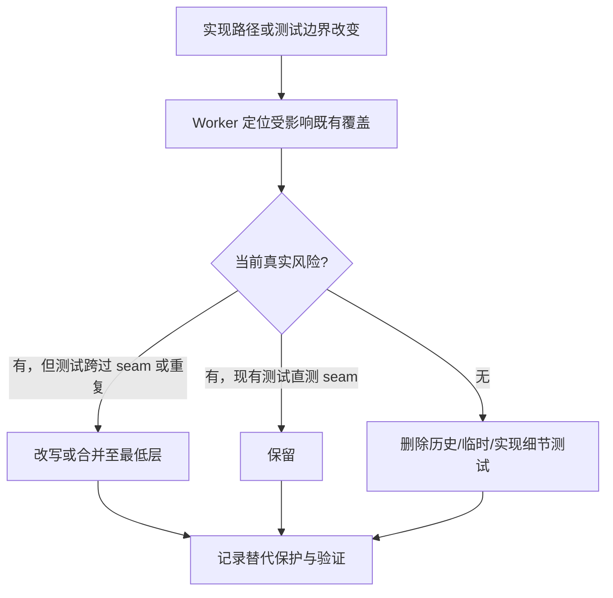
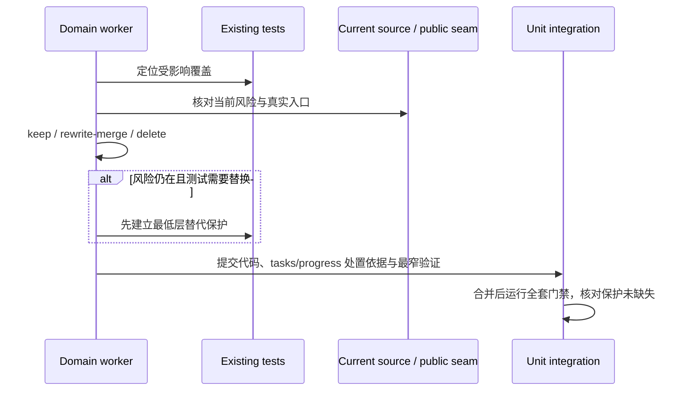

# refactor-489: 测试信号与回归规范 — 技术方案

> Unit branch: `unit/refactor-489` (will be created by orchestrator)
>
> 对齐: motivation.md v1

## Changelog

## 现状分析

### 涉及范围

- Python 的 `tests/unit/`、`tests/integration/`、`tests/contract/`、`tests/im_service/`、`tests/e2e/`：同时存在产品/架构边界保护，以及把迁移终态、内部组织或文本原样当作永久契约的测试。
- 前端 Vitest：同时承担真实交互回归和源码扫描、文件布局等历史终态检查。
- `scripts/e2e-*.sh` 及其测试：有真实 worktree、进程和配置隔离风险，也有对轮询次数、shell 文本等实现细节的检查。
- `docs/development/testing.md`、`.claude/skills/change-impl-worker/SKILL.md` 与其 `assets/tasks.md`：已有“测行为、不测实现细节”的原则，但没有要求 worker 对受影响的存量测试给出处置结论，也没有把结论表放进实际创建计划的模板。
- `.github/workflows/ci.yml`、`pyproject.toml`、`.claude/hooks/ruff-guardrail.py`、`scripts/docs_check.py` 与其测试：定义或验证测试质量门禁，也必须按同一信号标准审视。

### 既有约束

- 测试保护用户可观察行为、公开接口、运维结果或架构依赖方向；在能覆盖该风险的最低层断言一次。
- 真实进程、浏览器、LLM 或重外部依赖的测试属于 `tests/e2e/`；不能以删除来掩盖真实的 flaky 风险。
- 本 unit 不改产品实现或对外行为；各产品 current spec 无需修改。

### 可复用能力

- `docs/development/testing.md` 已定义分层、停止条件、临时证据与永久回归的界线；本次在其上补足存量测试处置协议，而不另建一套测试制度。
- 现有 AST import-boundary 测试、产品入口测试和真实脚本运行测试是保留的基线：重构应把保护收敛到它们的 seam，而非新增同类静态扫描。

### 相关历史

- 旧 change 单元曾以 migration/golden/target-state 方式留下测试；它们是候选，不是本 unit 的预先删除清单。实施 worker 必须按当前风险重新判断。

## 架构总览

测试的 Interface 是调用者/运维者真实经过的 seam，而不是实现文件、提示词措辞或一次迁移的目录终态。此次不增加测试框架或抽象层；只让每个测试域的 worker 将已有保护收敛到该 seam。

图回答的是测试资产的收敛路径：风险决定测试是否留下；实现组织本身不构成永久契约。

## 关键决策

### 决策 1：受影响存量测试必须有处置结论

**每个 worker 审视本 milestone 实际影响的既有测试，并在 `tasks.md` 记录保留、改写/合并或删除；不对未受影响的全仓测试造台账。**

- **触发**：改变实现路径、公开/架构 seam、测试层级、fixture/harness，或发现既有测试前提已随本次改动失效时。
- **范围**：围绕本 milestone 的行为、接口、运维结果或架构规则定位已有覆盖；不要求在 design 阶段、也不要求 worker 对仓库全部测试逐项判定。
- **记录格式**：`tasks.md` 的测试策略必须加入下表；没有受影响覆盖时也要明确写“无”及搜索范围和理由。

  | 风险 / 行为 | 既有测试 | 处置 | 理由与保留/替代保护 | 验证 |
  |---|---|---|---|---|
  | <当前应防的回归> | `<path::test>` | keep / rewrite-merge / delete | <为什么；若替换，新的最低层测试在哪里> | <命令或证据> |

- **保留 (`keep`)**：测试直接经过当前的用户、公开接口、运维或架构 seam，保护仍存在的风险，且是最低合适层的唯一断言。
- **改写/合并 (`rewrite-merge`)**：风险仍在，但测试断言旧内部步骤、在更高层重复了已有保护，或将多个独立行为耦在一起。替代测试必须从当前 seam 观察结果，并在删除旧测试前可运行。
- **删除 (`delete`)**：测试只守旧提示词/文档措辞、文件布局、私有符号、已退役路径、一次性迁移基线或交付期临时证据，且不存在需要长期自动化防护的当前风险。此类删除不强行补测。
- **删除前提**：若被删测试曾对应真实风险，必须先证明该风险已由保留或新建的最低层测试覆盖；只有“当前没有待保护风险”时才可无替代删除。
- **精确文本例外**：协议、事件 schema、序列化格式或明确写入 current 契约的用户可见文本可以精确断言；“因为实现文件/技能/文档里曾出现该句”不是理由。

### 决策 2：一次风险只由最低测试层拥有

**unit、integration、contract、e2e 分别守自己的 seam；高层只验证跨 seam 的连接，不复述下层逻辑。**

- **理由**：这让真实回归仍有保护，同时消除同一行为在多层重复、任一重构就大量变红的低信号测试。
- **拒绝**：以“多层都测更安全”为默认；它放大维护成本，却不增加独立风险覆盖。
- **风险**：错误删除可能留下保护缺口；因此 worker 的处置表必须写出保留/替代测试和最窄验证。

### 决策 3：先固化处置协议，再按显式测试切片并行实施，不预置逐项候选

**M1 先将处置协议写入规范和实际任务模板；随后 orchestrator 直接按本表对 M2--M16 各派一个 worker，在其互不重叠的路径范围内自主发现并处置候选。**

- **理由**：本 unit 明显超过单一 worker 的文件/测试规模，且测试切片可按独立 seam 并行；把候选列表写死会把设计阶段变成重复实现。milestone 表是唯一调度输入；worker 只为自己已获派的切片建立 `tasks.md`，不创建二级派发产物。
- **拒绝**：先完成一份全仓删除清单再派发；它慢、易过时，也剥夺 worker 对真实代码/测试关系的判断。
- **风险**：并行合并可能遗漏交叉风险；路径归属表必须覆盖所有已跟踪的 Python 测试、Vitest、测试脚本、CI gate 及其直接解析的 catalog。若 `git ls-files` 或 gate 输入审计发现未归属的测试/fixture/runner/catalog，owner 必须暂停并交给 orchestrator 重分配，不能默认为无价值；集成后再以全套门禁和 verifier 统一核对。

## 接口与数据流

没有新的运行时接口或数据结构。唯一新增的交付接口是 worker 对受影响测试的处置表；它服务 orchestrator、verifier 和未来维护者。

## 契约层增量 (delta-spec)

- kernel: no spec delta
- im: no spec delta
- gateway: no spec delta
- cli: no spec delta

## 风险与回退

- **错误删去真实保护**：任何真实风险的删除都需保留或建立更直接的保护；发现缺口时可单独回退该测试域 commit。
- **不稳定测试被伪装成无用测试**：进程、时序和外部依赖类测试必须先定位不稳定条件，稳定、降层或调整 lane；不能以删除掩盖风险。
- **并行 scope 冲突**：milestone 以文件域划分，worker 不越界；遇到共同 helper 或 source 改动时暂停，由 orchestrator 重分配。

## Runbook for Reviewer

无常驻服务。本 unit 不改客户端或产品运行时，Full 零用户面路径不派产品 reviewer。

**Review 驱动方式**: 不适用；由 verifier 核对 spec/design/处置表与最终测试树，code review 审查清理是否保留真实保护。

**验收前置**: 无。

## Milestones

> 拆分依据：每个实现型 milestone 只由一个 worker 负责。为避免把超出单 worker 窗口的测试域伪装成“批量 milestone”，以下按当前 test-file/SUT 归属划为互不重叠的切片；不列待删除候选，worker 在其切片内自行判断。M2--M16 均在 M1 合入后、按无写冲突关系并行派发。

| ID | 标题 | 依赖 | 并行组 | 范围 | 退出标准 |
|---|---|---|---|---|---|
| refactor-489-M1 | test-discipline | — | A | `docs/development/testing.md`、`.claude/skills/change-impl-worker/SKILL.md`、`.claude/skills/change-impl-worker/assets/tasks.md` | [reviewer] N/A（零用户面）；[worker] 把决策 1 写成简洁、可执行且不重复的长期规范，任务模板含处置表，并用文档/skill 校验确认格式与路由有效。 |
| refactor-489-M2 | contract-ci-quality | refactor-489-M1 | B | `tests/contract/**`、`tests/unit/test_docs_check.py`、`tests/unit/test_agents_md_loader.py`、`tests/unit/test_change_spec_author_next_unit_id.py`、`tests/conftest.py`、`tests/helpers/**`、`.github/workflows/ci.yml`、`pyproject.toml`、`.claude/hooks/ruff-guardrail.py`、`scripts/docs_check.py`、`scripts/docs-check` | [reviewer] N/A；[worker] 每项受影响 contract/quality gate 均有处置表；保留的架构检查验证真实依赖或结构规则，不绑定历史措辞、目录或迁移终态。 |
| refactor-489-M3 | core-prompt-runtime | refactor-489-M1 | B | `tests/unit/agent/**`；root `tests/unit/test_{agent,core,loop,compaction,memory,session,jsonl_store,merge_adjacent,nested_memory,build_chat,curator,prompting}_*.py` | [reviewer] N/A；[worker] 保留当前 core seam 的状态、提示词条件和消费者输入输出保护，合并/删除迁移快照及片段措辞断言。 |
| refactor-489-M4 | core-tools-platform | refactor-489-M1 | B | `tests/unit/platform/**`；root `tests/unit/test_{tool,tools,hook,hooks,permission,llm,openai,observability,auto_mode,usage,runtime,streaming,retry,skill,path_sandbox}_*.py`，以及不属于 M2、M3、M5--M8、M13 的其余 root `tests/unit/test_*.py` | [reviewer] N/A；[worker] 保留工具、权限、hook、LLM 和 platform 的最低 seam 保护，去除对内部调用/布局的重复断言。 |
| refactor-489-M5 | coding-cli-tests | refactor-489-M1 | B | root `tests/unit/test_{cli,coding_cli,repl,apps_coding_cli}_*.py`、`tests/unit/_cli_*.py` | [reviewer] N/A；[worker] 保留 CLI 用户入口、公开命令和 SDK 边界保护，去除退役 HTTP/文件布局残留。 |
| refactor-489-M6 | assistant-config-feishu | refactor-489-M1 | B | root `tests/unit/test_feishu_*.py`；`tests/unit/personal_assistant/test_{agent,auto_bind,builtin,capabilities,communication,config,feishu,group_context,local_store,parse_llm,permission,prompt_section,sensitive_local,unattended,web_search}_*.py` | [reviewer] N/A；[worker] 保留个人助手配置、agent capability 与渠道适配的现行 seam，删除历史实现/措辞契约。 |
| refactor-489-M7 | assistant-scheduling | refactor-489-M1 | B | root `tests/unit/test_{generic,idle,liveness,ticker}_*.py`；`tests/unit/personal_assistant/test_{background,cron,heartbeat,schedule}_*.py` | [reviewer] N/A；[worker] 保留 schedule/heartbeat 的用户或运维风险保护，消除跨层重复和临时基线。 |
| refactor-489-M8 | assistant-runtime-delivery | refactor-489-M1 | B | root `tests/unit/test_{inbound,reject,text_runner,terminal}_*.py`；`tests/unit/personal_assistant/**` 中不属于 M6、M7、M13 的测试 | [reviewer] N/A；[worker] 保留 Gateway、channel、relay、inbound、session 与投递结果的真实 seam，合并过高层或内部步骤断言。 |
| refactor-489-M9 | kernel-integration-tests | refactor-489-M1 | B | `tests/integration/test_{bash,tools,hooks,kernel,conversation,empty_tool,idle}_*.py`，但排除 M13 明列运行时测试 | [reviewer] N/A；[worker] integration 只证明 kernel/tool 的跨 seam 连接，不重复 unit 行为。 |
| refactor-489-M10 | assistant-integration-tests | refactor-489-M1 | B | `tests/integration/**` 中不属于 M9 或 M13 的测试 | [reviewer] N/A；[worker] 保留 channel、routing、session 等跨进程/跨模块结果，去除无当前风险的旧路径断言。 |
| refactor-489-M11 | im-persistence-contract | refactor-489-M1 | B | `tests/unit/IM/**`、`tests/im_service/unit/**`、`tests/im_service/contract/**`、`tests/im_service/_auth_helpers.py` 与这些树的 fixture/helper | [reviewer] N/A；[worker] 保留 IM 持久化、schema 与公开 contract 的最小必要保护，删改实现细节和重叠断言；M12 只使用、不修改 `_auth_helpers.py`。 |
| refactor-489-M12 | im-api-realtime | refactor-489-M1 | B | `tests/im_service/integration/**`、`tests/im_service/e2e/**` 与同域 fixture/helper，但不含 M11 所有的 `_auth_helpers.py` | [reviewer] N/A；[worker] 保留 IM HTTP/WebSocket 与真实服务协作的可观察结果，避免重述 unit/contract 行为。 |
| refactor-489-M13 | operational-e2e | refactor-489-M1 | B | `tests/e2e/**`、`tests/fixtures/**`、`scripts/e2e-*.sh`、`scripts/e2e_catalog.py`、`scripts/free-ports.sh`、`scripts/fixtures/**`、`docs/development/e2e-critical-paths.md`、`tests/unit/test_e2e_catalog.py`、`tests/unit/test_e2e_conftest_finalizer.py`、`tests/unit/test_worktree_runtime.py`、`tests/unit/personal_assistant/test_gateway_im_resilience_e2e_wrapper.py`、`tests/integration/test_e2e_down_script.py`、`tests/integration/test_foreground_interrupt_reap.py` | [reviewer] N/A；[worker] 保留真实进程、端口/配置隔离、恢复和关键旅程风险的自动化保护；维护 critical-path catalog 与其守护 pytest node 的可收集性；测试层级/marker 与依赖相称，不检查轮询/脚本文本等内部实现。 |
| refactor-489-M14 | frontend-chat | refactor-489-M1 | B | `src/IM/frontend/src/features/chat/**/*.test.{ts,tsx}` | [reviewer] N/A；[worker] 保留聊天交互、状态和接口风险的最低层 Vitest 覆盖，删除/合并静态源码、文件布局和重复断言。 |
| refactor-489-M15 | frontend-settings | refactor-489-M1 | B | `src/IM/frontend/src/features/settings/**/*.test.{ts,tsx}` | [reviewer] N/A；[worker] 保留设置页的用户交互与 API 状态保护，删除/合并静态检查和重复断言。 |
| refactor-489-M16 | frontend-foundation | refactor-489-M1 | B | 前端其余已跟踪 Vitest：`src/IM/frontend/src/` 中不属于 M14/M15 的 `*.test.{ts,tsx}`、`src/IM/frontend/src/test/**`、`src/IM/frontend/tests/**`、`src/IM/frontend/package.json`、`src/IM/frontend/vite.config.ts`、`src/IM/frontend/tsconfig*.json` | [reviewer] N/A；[worker] 保留 app/auth/realtime/notification 等真实状态和测试运行配置保护，删除源码文本、HTML/.gitignore 布局等低信号断言。 |
