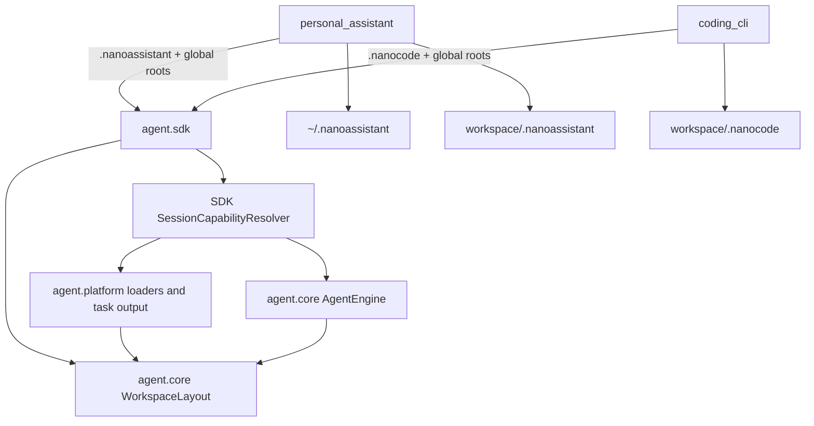
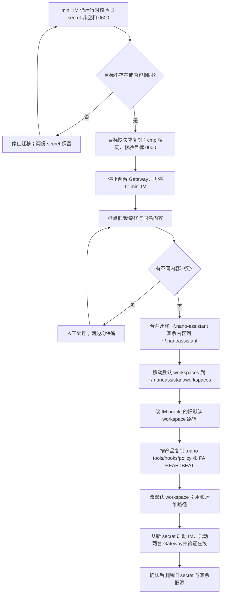

# refactor-513: 产品化 workspace 与全局持久化目录 — 技术方案

> 对齐: motivation.md v1
>
> Unit branch: `unit/refactor-513` (will be created by orchestrator)

## Changelog

## 现状分析

### 涉及范围

- `agent.sdk.build_kernel()` 已公开 `workspace_config_dirname`；session JSONL、memory 与 workspace skills 已经按它派生。但 hooks、workspace tools、bash policy、background bash output 和 oversized tool result 仍有字面 `.nano`。
- Kernel 在构建时建立一个共享 `ToolRegistry` 与 `HookRunner`。PA Gateway 的一个 Kernel 可服务多个 Agent workspace，因此用 build-time `repo_root` 发现 workspace extension 会把第一个 workspace 的扩展带给全部 Agent。
- `personal_assistant` 已传 `.nanoassistant`，并已有 `~/.nanoassistant/{skills,tools,hooks}`；但本机 config/state 是 `~/.nano-assistant/`，默认 workspace 是 `~/nano-assistant/workspace/<agent-id>/`，聊天副本与 `HEARTBEAT.md` 仍在 workspace 根。
- `coding_cli` 已传 `.nanocode`，但 workspace tools/hooks 仍发现 `<workspace>/.nano/{tools,hooks}`。
- mini 的 IM 进程从 `~/.nano-assistant/im-jwt-secret` 读取 JWT signing key；该路径只出现在生产运维流程，不是 IM 应用配置。

### 既有约束

- 产品只能 import `agent.sdk`；`agent.core` 不依赖 `agent.platform`，`agent.sdk` 是唯一装配面。
- `build_kernel(..., workspace_config_dirname=...)` 是 refactor-406 保留的两层 API；不能以 ProductProfile 或产品名称重新耦合内核。
- `AgentEngine`、provider clients 与 KernelExecutor 可被多个稳定 conversation 共享，不能为每个 PA Agent 重建一个 Kernel，也不能以可变全局 registry 切换当前 workspace。
- 本 unit 不在运行时代码中保留旧目录探测、首次导入、同步或删除逻辑。历史整理只由两台已部署机器在上线前手工完成。

### 可复用能力

- **使用并扩展** `agent.core.memory.path.derive_memory_root` 的模式：新 `WorkspaceLayout` 只负责由 workspace root 与 directory name 推导路径，不读产品配置、不做 I/O。
- **使用并改造** `JsonlSessionFiles`、MemoryTool、SkillManageTool 已有的 per-session metadata 路径推导；它们证明 session 而非 Kernel build 是正确的 workspace 粒度。
- **使用并改造** platform 的 tool/hook loader：保留 `.py` discovery、同名 `replace=True` 与 hook 的 fail-open 语义，改为把 workspace layer 加到 session-local capability scope。
- **不用** 旧 `ConfigResolver`/ProductProfile：这会重新引入 refactor-406 已删除的产品抽象，且解决不了 PA 的多 workspace 隔离。
- **使用并修正** Gateway 的 `ensure_workspace_defaults`、scheduler、WebSocket RPC 和 chat-history hook；它们是 PA workspace 文件的真实写/读点。

### 相关历史

- refactor-406 的终态允许产品传 `workspace_config_dirname`，同时当时保留了字面 `.nano/tools` 发现。后者在单 workspace build 的假设下合理，在多 Agent PA Kernel 下成为本次需要替换的浅 seam。
- refactor-431 已将 skills 改为按 session workspace 解析；本次以同一模式收敛 tools/hooks 与其它运行产物，而不改 skills 的已验证语义。
- feat-394/447 把 heartbeat、cron 和 IM RPC 接到 Gateway；其当前根目录 `HEARTBEAT.md` / `.nanoassistant/cron` 读写点必须一起移动，不能只移动 seed 文件。

## 架构总览

现状把“配置目录选择”散在 session、tool、hook、后台输出和 PA scheduler 中；而 tools/hooks 还在 Kernel build 时绑定一个 repo。终态以一个深的、无产品语义的 `WorkspaceLayout` 统一路径，并让 SDK 为每个 workspace 建立不可互串的 session capability scope。



`WorkspaceLayout` 是内核的 **Module**：它收敛一个 workspace 的全部产品管理路径。`SessionCapabilityResolver` 是 SDK 的 **Adapter**：它把 platform loader 产出的 per-workspace tools/hooks 接到 core 的执行端口。产品只在 SDK 接口处传目录名与全局 roots，不向 core 泄漏 PA/CLI 身份。

## 关键决策

### 1. **以 `WorkspaceLayout(workspace_root, config_dirname)` 作为唯一路径推导接口。**

该接口至少派生 `config_root`、`sessions`、`memory`、`skills`、`tools`、`hooks`、`policy.toml`、`background-tasks` 与 `tool-results`。缺省 directory name 固定为 `.nano`；`build_kernel` 的现有可选参数仍是产品覆盖的唯一入口。PA/CLI 不传一串分散 path，也不引入 `ProductWorkspaceLayout`。

这把路径规则的 **Depth** 放在一个可复用 Module 内：添加新的 workspace-managed 文件只需在 layout 增加命名路径，而非在每个 consumer 手写 `root / ".nano"`。`WorkspaceLayout` 是纯 `Path` 推导，允许 platform 依赖 core，保持现有依赖方向。

### 2. **workspace extensions 在首次使用该 workspace 的 session capability scope 中装配，不在 Kernel build 时装配。**

SDK 在 Kernel 中保留共享的 built-in、consumer native 与全局 extension base；首次使用一个 canonical workspace root 时，复制其 registrations 快照和既有共享 extension-state binding、用该 workspace 的 `WorkspaceLayout` 建立 execution context，再加载其 `tools/` 与 `hooks/`。因此实时事件发布等 Kernel-wide hook state 不被复制丢失，workspace hook 的新增 registrations 和状态则只归该 scope。scope 由该 Kernel 按 workspace root 缓存，进程内不会重新扫描；修改 extension 后按当前产品惯例重启对应 CLI/Gateway 才生效。

这样同一 PA Kernel 下 Agent A、Agent B 各看到自己的 workspace extension；同一 workspace 内各 session 仍共享 extension hook 的既有进程内状态。不得通过修改共享 registry、在 turn 开始时 `bind_tool_registry()`，或为每个 Agent 建新 Kernel 来实现，因为这三种做法分别会产生并发串扰、破坏共享 Engine 假设或重复昂贵资源。

有效优先级统一为：built-in → consumer native → product global extension → workspace product extension。同名 tool 由后层替换；同名 hook 文件由 workspace 覆盖 global 同名文件，其他 hook registrations 仍按既有 priority/order 共同执行。workspace 因而是用户显式的最后覆盖层。

### 3. **core 执行采用不可变的 per-turn execution scope，而非可变 Engine 全局成员。**

SDK 在 run 开始时从 session 的 `workspace_root` 与持久化的 `workspace_config_dirname` 获取一次 `WorkspaceExecutionScope`；同一 run 不得重新 resolve。scope 持有 `layout`、tool registry、hook runner、result compressor、已解析的 bash policy overrides，以及以产品传入 `global_config_root` 和 `layout.config_root` 调用 `load_auto_mode_config` 的零参 loader。`AgentEngine` 将这个 scope 显式传给主 loop、slash-skill、subagent、fork、compaction 与 `list_session_tools`；`RunsRegistry` 对 `run_error` / `run_timeout` 也以记录中的 workspace root 解析同一 scope。执行路径不得在共享 `AgentEngine` 上替换 `_tool_registry` 或 `_hook_runner`。

每一次 input、`before_agent_start`、`tool_call`、`tool_result` 与 observe hook 均由同一 scope 建造 `HookContext`：`repo_root` 固定为 `scope.layout.workspace_root`；先合并通用 run metadata，再以不可变 mapping 写入 `workspace_root`、`workspace_config_dirname`、`workspace_config_root`、`tool_registry`、`_auto_mode_config_loader` 与 `bash_policy_overrides`。因此 `auto_mode_gate` 从 scope registry 找 tool，并通过 loader 得到同一 global/workspace auto-mode 配置；`BashTool.check_permissions` 只消费 context 中已解析的 `bash_policy_overrides` 后调用 `check_command_policy`。它不再自行从 repo root 拼接 `.nano/policy.toml`。`HookContext` 仍是 core 的普通 metadata port，不 import platform；scope 的构建、platform loader 与 policy I/O 留在 SDK/platform。

为支持这个 seam，registry/runner 提供只读快照/clone 的窄接口；tool registry clone 共享已注册的 built-in/native/global tool 对象，却用当前 workspace 的 ToolContext 与 HookRunner 执行。workspace-loaded tool 对象只归其 scope。所有在同一 turn 发生的 hook/tool 事件使用同一个 scope，保证 auto-mode、bash policy 和 hook chain 都选择同一个 workspace。

### 4. **每个运行产物都由当前 session layout 选址；后台 task port 显式接收 layout。**

background task wiring 不再在 Kernel build 时持有 workspace root。BashTool 从当前 ToolContext/session metadata 取得 layout，把它显式传给 background-output port；`BashFileOutput` 因而在 `<workspace>/<dirname>/background-tasks/...` 创建文件。任务记录继续存绝对 `output_file`，对已开始任务的读取/停止语义不变。

同一原则用于 oversized tool-result 的持久化目录 `<workspace>/<dirname>/tool-results`、bash `policy.toml`、auto-mode workspace config fallback 和 file safety context。BashTool 的 permission check 从当前 layout 读取 policy overrides，不能保留字面 `.nano` 的 loader。当前 `dangerous_paths` 只有 `.nanocode` 与旧 `.nano-assistant`；终态受保护目录集合显式为 `.nano`、`.nanoassistant`、`.nanocode`、`.nano-assistant`。

### 5. **PA 收敛到一个 global home，workspace root 只放用户项目资产与一个产品子目录。**

PA 的唯一 global home 为 `~/.nanoassistant/`，包含 config、Gateway binding/state、日志、IM JWT secret、全局 skills/tools/hooks 与 `workspaces/`。默认 Agent root 为 `~/.nanoassistant/workspaces/<agent-id>/`；`node.workspace_base` 仍是显式覆盖，`agents[].workspace_root` 的外部代码仓也仍保持原位。IM 保持独立部署、也不 import PA 或 agent，但在自己的 domain resolver 中使用同一新默认路径并据此计算 `workspace_is_default`；它只保存/转发路径，Gateway 仍是 workspace 文件 owner。

在任意 PA workspace，session/memory/skills/tools/hooks/policy/background output/tool results/cron、`chat_history` 与 `HEARTBEAT.md` 都归入 `.nanoassistant/`。chat history 继续是简化、人工可读的 user/assistant JSONL 副本，不替代会话 transcript。CLI 使用同一内核规则与 `.nanocode/`，但不拥有 chat history 或 heartbeat。

### 6. **历史整理是部署 runbook，不是产品兼容层。**

实现不读取 `~/.nano-assistant`、`~/nano-assistant`、root `chat_history/`、root `HEARTBEAT.md` 或 workspace `.nano/*` 作为旧路径回退。部署者先停相关服务，确认无不同内容的冲突，再迁移 global/default-workspace 数据并复制共享 workspace extension。任何不同内容的同名目标都停止该项迁移，既不覆盖也不删除来源；处理后重跑。实现也不修改 Git `.gitignore`。

这是一次仅两台机器的可审计运维动作，而不是永久留在用户产品里的“首次启动”状态机。外部 workspace 的历史 `chat_history/` 与 `.nano/background-tasks/` 不搬动；默认 workspace 整体移动时二者保持相对 workspace root 的位置。

### 7. **IM JWT secret 仅换路径、不换值。**

mini 在 IM **仍运行时**先验证旧 `~/.nano-assistant/im-jwt-secret` 非空且 mode `0600`，并在写入前检查目标：目标缺失才复制；目标相同则原样保留；目标不同则两边都不动并停止迁移。成功分支再验证 source/target 内容相同且目标为 `0600`。旧源作为恢复点保留到新 IM 与两台 Gateway 均验证在线后才删除；之后 IM 启动命令只从新路径读入 `IM_JWT_SECRET`。不生成新 secret，不轮换 signing key，不触发 Gateway/Web IM 登录态失效。该项只更新部署/运维文档和人工迁移步骤，不给 IM 或 PA 加路径兼容代码。

## 接口与数据流

### SDK 与内部接口

| Interface / Module | Owner | Contract |
|---|---|---|
| `build_kernel(..., workspace_config_dirname=None, global_config_root=None, tool_search_roots=(), hook_search_roots=())` | `agent.sdk` public | 未传目录名等价 `.nano`；`global_config_root` 是 consumer 自己的 global config home，仅供 scope 的 auto-mode loader 读取，PA/CLI 分别传自己的 home。 |
| `WorkspaceLayout` | `agent.core` | 纯、immutable workspace path derivation；不识别产品、不读取磁盘。 |
| `SessionCapabilityResolver` | `agent.sdk` internal | canonical workspace root → cached immutable execution scope；由 SDK 调 platform loader。 |
| `WorkspaceExecutionScope` | `agent.core` / `agent.sdk` seam | 提供本次 run 的 layout、registry、hook runner、result compressor、policy override 与 auto-mode loader；以 scope metadata 建造全部 hook context，且不可改写共享 Engine 成员。 |
| background output port | `agent.core` protocol | `open` 显式接收当前 layout（或其 output root），删除 build-time workspace root 隐含状态。 |

`workspace_config_dirname` 继续持久化为 session metadata，因此 MemoryTool、SkillManageTool、workspace policy 与 session-created subagent 都从同一份 workspace root/dirname 得到路径。subagent 继承父 workspace，故也继承父 product directory。

```mermaid
sequenceDiagram
    participant Product as PA or CLI
    participant SDK as Kernel SDK
    participant Resolver as Capability Resolver
    participant Layout as WorkspaceLayout
    participant Engine as AgentEngine
    participant Platform as Tool/Hook loaders

    Product->>SDK: create_session(workspace_root)
    SDK->>Layout: root + config dirname
    SDK->>Resolver: scope_for(layout)
    alt first session for workspace
        Resolver->>Platform: clone shared base; load layout tools/hooks
        Platform-->>Resolver: isolated registry + hook runner
    end
    SDK-->>Product: SessionInfo
    Product->>SDK: submit/continue run
    SDK->>Resolver: same scope_for(layout)
    SDK->>Engine: execute with immutable scope
    Engine->>Platform: tool/hook execution with layout context
    Platform-->>Engine: result / background output path
```

### 人工迁移流程



迁移的来源/目标表：

| 来源 | 手工处理 | 目标 / 保留规则 |
|---|---|---|
| `~/.nano-assistant/` | secret 以外的内容无冲突后迁入；旧源留到完整验证 | `~/.nanoassistant/`；合并既有 global skills/tools/hooks 时同名不同内容停止。 |
| `~/nano-assistant/workspace/<agent-id>/` | 整个 workspace 移动 | `~/.nanoassistant/workspaces/<agent-id>/`；旧 root `chat_history/`、`.nano/background-tasks/` 随 workspace 保持相对位置。 |
| 外部代码仓 workspace | 不整体搬 | 保持外部路径；只按所属产品复制 extension/policy/PA heartbeat。 |
| `<workspace>/.nano/{tools,hooks,policy.toml}` | 目标缺失时复制，不覆盖、来源保留 | PA → `.nanoassistant/`；CLI → `.nanocode/`；此后不再同步。 |
| `<workspace>/HEARTBEAT.md` | 仅 PA 且目标缺失时复制，来源保留 | `<workspace>/.nanoassistant/HEARTBEAT.md`。 |
| mini `~/.nano-assistant/im-jwt-secret` | IM 仍运行时先 `test -s`/核验 `0600`，写前比较目标：缺失才复制、相同则保留、不同则停止且两边不动；成功分支以 `cmp -s` 验证相同和 `0600`，旧源留到 fleet 验证成功 | `~/.nanoassistant/im-jwt-secret`；不重新生成。 |

手工 runbook 还必须改写旧默认 workspace 的 local config 引用（`agents[].workspace_root` 与显式 `node.workspace_base`），以及 IM SQLite `agent_profiles.workspace_root` 中恰好等于旧默认 root 的记录；显式外部 workspace 引用不改。先以 `cmp -s`/人工 diff 检查每个同相对路径项，只有全部无冲突后才删除旧源；source secret 只在 IM 从目标 key 启动、两台 Gateway 在 `GET /im/v1/nodes` 中 online 后删除。完整步骤与生产启动命令归入 operations docs，而非 runtime code。

## 契约层增量 (delta-spec)

- kernel: `specs/kernel/spec.md`, `specs/kernel/sdk-boundary.md`, `specs/kernel/tools-hooks.md`, `specs/kernel/background-tasks.md`
- im: `specs/im/spec.md`, `specs/im/agents-nodes.md`
- gateway: `specs/gateway/spec.md`, `specs/gateway/service-lifecycle.md`, `specs/gateway/heartbeat-cron.md`, `specs/gateway/routing-delivery.md`
- cli: `specs/cli/product-integration.md`

## 风险与回退

| 风险 | 约束 / 验证 | 回退 |
|---|---|---|
| 多 workspace capability 泄漏 | 一个 Kernel 下创建两个 workspace，以不同 tool/hook、auto-mode 和 bash policy 走真实 pre-tool chain，并验证 output 路径和可见 spec 均隔离。 | 修复 scope resolver；不得以重建 Kernel 规避。 |
| session/fork/compaction 走回 shared registry | 对主 run、slash skill、subagent、fork/compaction 走同一 capability selection 的单测。 | 保持 public SDK 签名，内部回退为一致 scope 传递。 |
| 背景 output 迁移后任务通知或 stop 回归 | 覆盖 foreground、auto-background、explicit background 的 output_file、notification 和 task_stop。 | 仅回退新版本，历史 output 留在原相对路径可查看。 |
| 人工迁移误覆盖或丢 secret | IM 仍运行时先核验 source 非空/0600，并在写前判定 target 缺失/相同/冲突；只有缺失才复制，冲突不触碰两边，成功分支 `cmp -s` 后保留 source 至两 Gateway online。 | 未确认前不删除旧源；恢复旧配置/旧路径并用同一 secret 重启。 |
| 旧 default workspace 仍被 config 引用 | 迁移清单核对 Gateway `agents[].workspace_root`、`node.workspace_base` 和 IM `agent_profiles.workspace_root`；E2E 创建未显式 workspace。 | 手工改回明确旧路径，不加入运行时 fallback。 |

## Runbook for Reviewer

| 服务 | 停止命令 | 启动命令 | 健康检查 |
|---|---|---|---|
| worktree IM + Gateway | `./scripts/e2e-down.sh --wt "$WT_ROOT"` | `./scripts/e2e-up.sh --wt "$WT_ROOT"` | `source "$WT_ROOT/.e2e-ports.env"; curl -fsS "$IM_URL/openapi.json" >/dev/null; E2E_TOKEN="$(curl -fsS -X POST "$IM_URL/im/v1/auth/login" -H 'Content-Type: application/json' -d '{"username":"nano","password":"nano1234"}' | jq -r '.access_token // .token')"; test -n "$E2E_TOKEN"; curl -fsS -H "Authorization: Bearer $E2E_TOKEN" "$IM_URL/im/v1/nodes" | jq -e --arg node "$NODE_ID" 'any(.[]; .node_id == $node and .status == "online")' >/dev/null` |
| mini production IM (迁移演练仅) | 依 [`docs/operations/prod-fleet.md`](../../operations/prod-fleet.md) 停止唯一 `:8011` listener | 依同一 runbook 从 `~/.nanoassistant/im-jwt-secret` 设置 `IM_JWT_SECRET` 后启动 | 停 IM 前 source `test -s`/`0600`，先判 target 缺失/相同/冲突（冲突不写），成功分支 target `cmp -s`/`0600`；随后 `/openapi.json` 与 `GET /im/v1/nodes` 中两台 Gateway `online` |

**Review 驱动方式**: 端到端真栈；本 unit 不改客户端面，reviewer 用 Web IM 实际调用的 IM/Gateway RPC 驱动 PA journey，并用真实 CLI REPL/其现有 CLI integration path 驱动 CLI journey。

**验收前置**: worktree 使用现有 E2E config 和 mock/fake LLM，不使用生产 home、secret 或 IM。`WT_ROOT` 为 unit worktree。生产迁移只在两台既有机器的变更窗口执行，先完成全部 unit 测试与 E2E。

## Milestones

拆分依据：这不是一个单点 rename。它横跨 core/platform/sdk execution seam、PA persistent service、CLI product，预计超过 10 个源文件和 4 小时；M2 与 M3 只依赖 M1 且文件范围可分离，能并行交付独立用户价值。

| ID | 标题 | 依赖 | 并行组 | 范围 | 退出标准 |
|---|---|---|---|---|---|
| M1 | 内核按 session 解析 workspace layout 与 capabilities | — | A | `agent.core` layout/execution seam，`agent.platform` tools/hooks/background output/policy，`agent.sdk` assembly，kernel tests/delta-spec（含 kernel index 与 SDK boundary） | [worker] 未传 directory name 的 SDK consumer 所有相关新产物仍落 `.nano/`；传 custom name 的 sessions/tools/hooks/policy/background output/tool-results 均落该 name。 [worker] 一个共享 Kernel 的两个 workspace 中同名/不同名 tools/hooks 互不泄漏，global/workspace precedence 明确。 [worker] 两个并发 workspace 以冲突 tool/hook、auto-mode 配置和 bash policy 通过真实 `auto_mode_gate` pre-tool chain，确认 context registry、loader 和 policy 均不串。 [worker] `global_config_root` 可选且省略时不读取 global auto-mode config。 [worker] main run、subagent、slash skill、fork/compaction 与 `list_session_tools` 使用同一 workspace scope。 [worker] background task notification/stop 语义不回归。 [reviewer] SDK consumer 以 custom directory 运行后，所有新可见产物只出现在该目录。 |
| M2 | PA global home 与 workspace 产品目录收敛 | M1 | B | `personal_assistant` product/config/gateway/scheduler/hooks/RPC，`IM` domain/config/persistence/API 的 managed-default resolver 与测试，PA tests，PA builtin docs，operations/SPEC，PA/IM/gateway index + area delta-spec | [worker] Gateway 与 IM 各自在本产品内把默认 config/state/default workspace 派生为 `~/.nanoassistant` / `workspaces/<agent-id>`；显式外部 workspace 与 `node.workspace_base` 保持 override 语义，且没有跨产品 import。 [worker] chat history、heartbeat（含触发 prompt）、cron/RPC 读写全用 `.nanoassistant`，根目录不再产生新 PA 文件。 [worker] operations 文档给出无运行时兼容代码的冲突安全手工迁移、IM profile 手动改写和 secret 0600/no-rotation 流程；secret target 不存在才复制、相同保留、不同停止且两边不动。 [reviewer] 真实 Gateway journey 在代码仓 workspace 产出 chat history、heartbeat 和 background output 于 `.nanoassistant/`；先断言 node online，再经 IM heartbeat/cron RPC 读同一路径。 [reviewer] mini 文档路径与 IM secret 启动路径一致。 |
| M3 | CLI workspace 产品目录收敛 | M1 | B | `coding_cli` product/commands，CLI tests，CLI delta-spec | [worker] CLI 的 workspace tool/hook/policy/background output/tool-results 只用 `.nanocode`，global roots 保持 `~/.nanocode`/`~/.codex` 既有选择；不引入 PA chat history/heartbeat。 [worker] custom/name default kernel tests与 M1 无重复。 [reviewer] 用户在代码仓启动 CLI 后，workspace extension 和后台输出从 `.nanocode` 工作，且不产生 `chat_history`。 |
