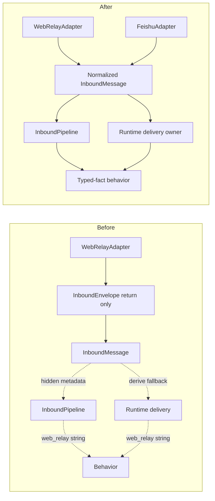
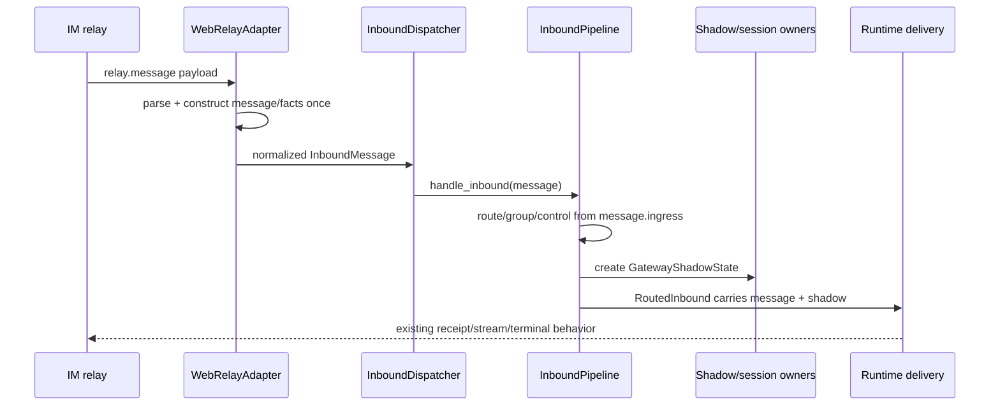

# refactor-521: Web relay typed ingress — 技术方案

> 对齐: motivation.md v1
>
> Unit branch: `unit/refactor-521` (will be created by orchestrator)

## Changelog

- 2026-08-10: Gate 2 R1 closure — 拍死两阶段 typed carrier、唯一 authority、producer matrix、`web_relay` 穷举分类与隔离 E2E runbook。
- 2026-08-10: Gate 2 R2 closure — 删除 shadow ref 内 saga/relay duplicate，固定 empty/pending/anchored 三态与分型 delivery target。

## 现状分析

### 涉及范围

- `personal_assistant.channels.base.InboundMessage` 是所有 channel adapter 交给 Gateway 的稳定单值 interface；`InboundDispatcher` 与 `InboundPipeline.handle_inbound(message)` 只接受它。
- `WebRelayAdapter.accept_relay()` 当前额外构造 `InboundEnvelope(message, protocol)`，但生产 callback 只收到 `envelope.message`，wrapper 只服务返回值测试。
- `gateway.runtime_protocol` 把 typed facts 放入 `InboundMessage.metadata["__runtime_protocol_facts__"]`；consumer 先读该私有 key，缺失时再从普通 metadata 推导同一事实。
- `InboundPipeline`、`SessionRunCoordinator`、shadow sync/saga 与 `runtime_delivery` 已各自拥有路由、session、shadow 和 run delivery 状态机；本 unit 只改变它们取得 ingress facts 的方式。
- 当前把 `channel_name == "web_relay"` 当业务语义代理的分支分散在入站门控、provisional bubble、空终态、background 与 observer 路径；registry lookup、outbound routing 和 composition 中的 adapter identity 则是合法使用。

### 既有约束

- `personal_assistant` 只经 `agent.sdk` 使用内核；本 unit 不改变包依赖方向。
- refactor-463 把 `InboundPipeline.handle_inbound(message)` 定为 channel dispatcher 的稳定 façade，本 unit 不增加第二 callback 或第二参数。
- refactor-480 的 `runtime_delivery` 继续拥有 run-to-delivery context、visibility、terminal ordering 与 task settlement；ingress 只提供事实，不吸收 delivery policy。
- feat-447 保持 IM conversation、external conversation、Kernel session 与 per-run reply target 四类 identity 分离。
- bugfix-471 要求 provider-stable event identity 是 typed value，不能从 chat id、文本或松散 metadata 推导。
- bugfix-508 要求 native Web IM group 的裸 `/new` 与 external-shadow-through-IM 的目标门控严格区分。

### 可复用能力

- 复用当前 external conversation / relay / provider-event 的事实集合，但拆成 adapter-owned `InboundIngress` 与 Gateway-owned `GatewayShadowState`；`ShadowConversationRef` 不下沉到 channel 层，也不保留 metadata attachment helper。
- 复用 WebRelay、Feishu 两个真实 adapter 的 normalization 阶段；它们分别提供 remote-owned 与 true-external 输入。
- 复用 `RunDeliveryContextStore` 承载 run 期间 delivery facts；不把 protocol facts写入 `ReplyContext.metadata` 或 SQLite session metadata。
- 复用现有 relay dedup、shadow saga、group gate、session key 与 delivery tests 作为行为回归骨架。

### 相关历史

- refactor-454 设计要求 `InboundEnvelope(message, protocol)` 的 typed handoff，实施后却形成“返回 wrapper、callback 仍收 message、再把 facts 藏回 metadata”的未完成切换；本 unit 完成其原始意图。
- refactor-463 明确保留单一 `handle_inbound(message)` façade；删除 wrapper 不等于扩大 pipeline ownership。
- refactor-480 已完成 typed run delivery authority；本 unit 不恢复 mapping façade 或 legacy delivery mirror。
- active refactor-478 明确不负责 `relay.message`，且本 unit原则上不改 `ws/im_connection.py`；active refactor-482 只触及 Web frontend owner，无文件交集。

## 架构总览

本 unit 命中 `codebase-design`：它调整重要 interface/seam、重新归属 ingress facts，并把测试面从 pass-through wrapper 移到真正的 channel callback interface。



Before 的 wrapper 不跨 seam，consumer 同时学习 typed key、fallback 和 provider string。After 的 adapter callback 只交付一个规范化值；pipeline 和 delivery owner 不再重新推导来源。

## 关键决策

### 决策 1: 保留单值 channel ingress interface，并固定 carrier shape

**保留 `InboundMessage` 作为 callback 与 `handle_inbound()` 的唯一输入；它新增且仅新增一个始终存在的 `ingress: InboundIngress` 字段。**

- **理由**: 真实 seam 位于 `ChannelAdapter.start(on_inbound)`，而不是 `accept_relay()` 的测试返回值；单值 interface 延续 refactor-463 的稳定 façade。
- **拒绝**: `(message, protocol)` 双参数、第二 callback、继续保留 `InboundEnvelope` wrapper；它们会创造平行 interface 或继续让 wrapper 只存在于测试。
- **风险**: `ingress` 以空 value 作为 generic/internal producer 的默认 absence，但 WebRelay、Feishu 和 recovery producer 必须显式传入非空事实；测试不能靠默认值伪装这三类生产输入。

### 决策 2: adapter facts 与 Gateway shadow state 分层拥有

**只把 raw transport/provider normalization 能产生的事实放到 channel ingress 层；shadow saga/ref 留在 Gateway，并在 callback 之后形成第二阶段 `RoutedInbound`。**

- **理由**: `channels.base` 不能反向依赖 `gateway` implementation；同时 `shadow_saga_id`/`ShadowConversationRef` 是 `IMShadowConversationSync` 在 pipeline 内创建的状态，不是 adapter ingress fact。
- **拒绝**: 把整个 `RuntimeProtocolFacts` 搬进 `channels.base`、让 `InboundMessage` forward-reference Gateway type，或继续用 `Any`/metadata key；三者分别会污染低层 owner、反转依赖或保留隐藏 interface。
- **风险**: coordinator 与 runtime delivery 当前都从 message metadata 取 shadow state；M1 必须让内部 request/lifecycle handoff 统一携带 `RoutedInbound`，不能在下游重新 attach 回 message。

### 决策 3: 显式区分 transport origin 与 external identity

**`InboundIngress.im_relay` 与 `InboundIngress.external_conversation` 分别表达“是否经 IM relay 进入”和“是否代表 external conversation”，不再用 `channel_name` 代替二者。**

- **理由**: native Web IM 与 external-shadow-through-IM 都使用 WebRelay，但裸 `/new`、shadow sync 与外部 mirror 语义不同；transport origin 与 conversation identity 是正交事实。
- **拒绝**: 单个 `is_web_relay` bool、从 `external_source` 猜 transport、或把 IM conversation id 当 external chat id。
- **风险**: 错误组合会让 external group 裸 `/new` 越过门控；以 bugfix-508 旅程与组合测试锁定。

### 决策 4: 同一 M1 删除 hidden metadata 与 fallback

**typed producer 和所有 consumer 一次切换后，删除 `InboundEnvelope` masquerade、`RuntimeProtocolFacts`、私有 metadata key、attach/strip helper、top-level `InboundMessage.external_event_identity`、旧 `ShadowConversationRef.{relay_task_id,shadow_saga_id}` 与 metadata-derived fallback。**

- **理由**: 双写期会让 typed 与 legacy 两个 authority 并存；replace-don't-layer 测试要求新 interface 测试替代旧 helper 测试。
- **拒绝**: 分阶段长期兼容或保留“缺字段时 derive”；内部单仓原子切换没有真实旧 consumer。
- **风险**: shadow recovery 与 synthetic/internal producers 容易漏填；producer matrix、invalid-combination contract 与 absence tests 必须覆盖。

### 决策 5: 合法 adapter identity 继续保留

**只删除把 `"web_relay"` 当业务能力代理的判断；composition、registry lookup、outbound routing 与配置中的 adapter identity 不变。**

- **理由**: `channel_name` 是真实路由 interface 的一部分；全仓字符串清零会把本 unit 扩成 ChannelManager 重构。
- **拒绝**: 机械替换所有 `web_relay` 字符串或把 adapter registry 也改成 capability graph。
- **风险**: reviewer 必须逐个分类残留字符串，避免把遗漏误称合法、或把合法 routing 删除。

## 接口与数据流

规范化后的 channel value 与 Gateway post-ingress value 采用以下准确契约；字段名是设计约束，worker 不得改成 flatten fields、第二 callback 或另一个同义 container：

```text
InboundMessage
  ingress: InboundIngress = InboundIngress()

InboundIngress                         # channels.base，adapter-owned，不可变
  im_relay: IMRelayIngress | None
  external_conversation: ExternalConversationIdentity | None
  external_event: ExternalInboundEventIdentity | None

IMRelayIngress                         # channels.base，不可变
  relay_task_id: str                   # Web relay payload required
  idempotency_key: str                 # Web relay payload required
  im_message_id: str | None

ExternalConversationIdentity           # channels.base，不可变
  external_source: str
  external_chat_id: str
  agent_id: str | None
  conversation_type: str | None
  trigger_source: str | None

RoutedInbound                          # gateway.inbound_models，Gateway-owned，不可变
  message: InboundMessage
  shadow: GatewayShadowState = GatewayShadowState()

GatewayShadowState                     # gateway.inbound_models，Gateway-owned，不可变
  saga_id: str | None
  ref: ShadowConversationRef | None

ShadowConversationRef                  # gateway.inbound_models，shadow-sync-owned，不可变
  conversation_id: str
  im_message_id: str
```

`InboundIngress` container 始终存在；三个成员缺失都用 `None`。`IMRelayIngress` 的 task/idempotency 为非空 required string。`external_event` 只有在 `external_conversation` 同时存在时合法；`trigger_source == "im"` 只用于 external conversation 经 IM relay 回流的组合。

`GatewayShadowState` 只有三种合法状态：empty=`(None,None)`，pending=`(saga_id,None)`，anchored=`(saga_id,ref)`；禁止 `(None,ref)`。`saga_id` 的唯一 authority 是 state 本身，`ShadowConversationRef` 不再携带 saga 或 relay identity，只表达已确认的 IM anchor；anchored ref 的两个字符串均 required/non-empty。旧 ref 的 `relay_task_id` 与 `shadow_saga_id` 字段同 M1 删除，构造点、equality tests 与 fallback consumers全部迁掉。

run delivery target 也分型而不复用 shadow ref：native Web relay 投影为 `IMRelayTarget(conversation_id, relay_task_id, im_message_id)`；external anchored state 投影为 `ExternalShadowTarget(ref)`；pending external state显式为 no-anchor + `saga_id`。进入 `RunDeliveryContext` 后，context 是本 run 的唯一 delivery authority，`RoutedInbound` 不再由 observer 回读；这是一次明确 stage projection，不是并行 source。



调用规则：

- Adapter normalization 是 raw provider/relay payload 进入 `InboundIngress` 的唯一位置；recovery 从已持久化的 canonical provider identity 重建同一个 value，不重新读松散 metadata。
- Pipeline 的 shadow sync 返回 `GatewayShadowState`，并与原 message 组成 `RoutedInbound`；所有 run/control request 与 lifecycle callback 在 Gateway 内部传这一阶段值，不能把 saga/ref 回写到 `InboundMessage.ingress` 或 metadata。
- Session key、run coordinator 与 runtime delivery 分别只读取 `routed.message.ingress` 与 `routed.shadow`；附件、mentions、participants 等非本期普通 channel metadata 保持现状。
- Delivery-specific facts投影进现有 `RunDeliveryContext`；不把 `InboundIngress`/`GatewayShadowState` 整体塞进 `ReplyContext.metadata`、session metadata、DB JSON 或 public payload。
- `InboundMessage.external_event_identity` 删除，provider event identity 的唯一 authority 是 `message.ingress.external_event`；`external_source` 不在 ingress container 顶层重复，唯一 authority 是 `external_conversation.external_source`。现有 scalar metadata 只可作为既有 public/durable reply projection 保留，任何业务 consumer 不得再从它回推 typed identity。
- 对 generic channel 与非消息型 internal trigger，`InboundIngress()` 明确表示三类 typed facts 均缺失；测试不得依靠该默认值伪装 WebRelay、Feishu 或 recovery。
- `GatewayShadowState` tests 覆盖 empty/pending/anchored 与 invalid ref-without-saga；deletion test 断言 `ShadowConversationRef` 不存在 saga/relay 字段，control operation id、pending boundary promotion 与 external mirror 都只从 `routed.shadow.saga_id` 投影。

### Producer / absence matrix

| Producer | `im_relay` | `external_conversation` | `external_event` | Gateway shadow result |
|---|---|---|---|---|
| native Web IM direct/group | required | `None` | `None` | empty；delivery 从 relay + IM conversation target 得出 |
| external shadow 经 Web IM 回流 | required | required，`trigger_source="im"` | `None` | empty；不创建第二个 provider saga |
| Feishu DM/group event | `None` | required，`trigger_source="feishu"` | required | sync 后为 pending `saga_id` 或 anchored `saga_id+ref` |
| durable external recovery replay | `None` | 从 canonical saga payload 重建 | 从 canonical saga payload 重建 | 与原 Feishu event 相同地重新 sync |
| generic/internal synthetic input | `None` | `None` | `None` | empty |

禁止 `external_event` 单独存在、从 chat/text 合成 provider event、或为 native Web relay 合成 external conversation。producer contract tests 覆盖每个合法组合与 invalid event-without-conversation。

### `web_relay` production 判断穷举分类

| 位置 | 当前语义 | M1 结论 |
|---|---|---|
| `inbound_pipeline.py` shadow-sync skip | 经 IM relay 的消息已有 IM anchor | 改读 `message.ingress.im_relay is not None` |
| `inbound_pipeline.py` native group 裸 `/new` | native Web transport 且非 external shadow | 改读 `im_relay is not None` 且 `external_conversation is None` |
| `runtime_delivery/context.py` visibility policy | IM relay 持有 provisional bubble | 改读 `im_relay is not None` |
| `runtime_delivery/context.py` empty completion discard | IM relay 持有 provisional bubble | 改读 `im_relay is not None` |
| `runtime_delivery/background.py` IM conversation fallback | persisted `ReplyContext` 的真实 outbound adapter/target identity | 合法保留 `reply_context.channel_name == "web_relay"` |
| `runtime_delivery/background.py` external delivery guard | persisted reply target 是否应走 external adapter | 合法保留 `reply_context.channel_name == "web_relay"` |
| `runtime_delivery/observer.py` external sender guard | `RunDeliveryContext.reply_channel_name` 的真实 outbound adapter identity | 合法保留 `channel_name == "web_relay"` |
| `channel_manager.py` managed-channel guard | 禁止动态 manifest 冒充 built-in adapter | 合法保留 provider/agent identity guard |

composition registry lookup、adapter `name`、session key 与 outbound routing 中的其余 `web_relay` 也都是 stable adapter identity，M1 不改；worker 在 progress 中附最终 production residual 清单，新的业务 proxy 命中为零。

### 依赖分类与测试 seam

- IM relay：remote-but-owned，继续使用现有 WebSocket/WebRelay adapter，不新增 port。
- Feishu：true external，继续使用现有 Feishu adapter；测试在 channel callback seam 使用 deterministic provider frames，产品验收使用真实已配置通道。
- Callback 后：in-process，直接通过 normalized message interface 测试。
- 删除旧 wrapper/helper 内部测试；新增 adapter callback → pipeline/runtime outcome 测试，断言行为而非私有字段。

## 契约层增量 (delta-spec)

- kernel: no spec delta
- im: no spec delta
- gateway: no spec delta
- cli: no spec delta

本 unit 是纯内部 interface cutover；现有 Gateway 与 IM canonical behavior 均保持。

## 风险与回退

- **external shadow 与 native Web IM 混淆**: typed facts 将 transport origin 与 external identity 分开；回归 Web group 裸 `/new` fan-out 和 external group target gate。
- **facts 泄漏持久化**: session/reply serialization 用明确字段投影，contract test 断言 DB/public metadata 不出现整个 facts value或旧私有 key。
- **遗漏 producer**: 盘点 WebRelay、Feishu、shadow recovery、internal dispatch 与测试 fixture；production consumer 禁止 fallback，以红测暴露遗漏。
- **run delivery 回归**: 不改 refactor-480 owner；聚焦 provisional bubble、空完成、`NO_REPLY`、external mirror、background/control reply 与 terminal ordering。
- **回退**: 整体 revert 本 unit，恢复当前 hidden-key 路径；不做运行数据迁移，也不修改 IM wire/SQLite schema。

## Runbook for Reviewer

先在 unit worktree 执行一次变量初始化；`NANO_MAIN_ROOT` 必须指向含项目 `.venv` 的主 checkout：

```bash
REPO_ROOT="$(git rev-parse --show-toplevel)"
WT_ROOT="$REPO_ROOT"
: "${NANO_MAIN_ROOT:?export NANO_MAIN_ROOT=/absolute/path/to/main-checkout}"
E2E_UP="$REPO_ROOT/scripts/e2e-up.sh"
E2E_DOWN="$REPO_ROOT/scripts/e2e-down.sh"
cleanup() { trap - EXIT INT TERM; "$E2E_DOWN" --wt "$WT_ROOT"; }
trap cleanup EXIT INT TERM
```

| 旅程 | 停止命令 | 启动命令 | 健康/入口检查 |
|---|---|---|---|
| Web IM direct/group/replay | `"$E2E_DOWN" --wt "$WT_ROOT"` | `PATH="$NANO_MAIN_ROOT/.venv/bin:$PATH" "$E2E_UP" --wt "$WT_ROOT"` | `source "$WT_ROOT/.e2e-ports.env" && curl -fsS "$IM_URL/openapi.json" >/dev/null && kill -0 "$(cat "$WT_ROOT/.gateway.pid")"` |
| Feishu external/shadow | `"$E2E_DOWN" --wt "$WT_ROOT"` | `PATH="$NANO_MAIN_ROOT/.venv/bin:$PATH" "$E2E_UP" --wt "$WT_ROOT" --feishu` | `source "$WT_ROOT/.e2e-ports.env" && PATH="$NANO_MAIN_ROOT/.venv/bin:$PATH" "$REPO_ROOT/scripts/e2e-feishu-probe.py" --wt "$WT_ROOT"` |

**Review 驱动方式**: 端到端真栈；本 unit 不改客户端面，Web IM 可用前端实际调用的 message/relay 接口驱动后在真实会话核对。Feishu adapter 受改动时，从真实 Feishu/Lark 客户端驱动 private/group 消息并核对原聊天与 IM shadow；不可用 fake 冒充产品验收。

**验收前置**: 仓库 `config/e2e/gateway.yaml` 提供可用 LLM catalog；隔离栈启动后从 Web IM 发送 nonce 并收到回复。Feishu 旅程只使用 `docs/development/worktree-runtime.md` 规定的 private `feishu-e2e.env`、非 default `lark-cli` profile 与固定测试 Bot；probe 会校验 App/Bot/user identity 和 listener lock。secret 不写入 evidence。缺少该专用 profile 时 external 产品旅程必须如实标为 inconclusive，不能换用个人/生产 config 或 fake 冒充。

## Milestones

单 M1：typed producer 与 legacy fallback 不能拆开独立交付；拆分会产生两个 runtime facts authority。

| ID | 标题 | 依赖 | 并行组 | 范围 | 退出标准 |
|---|---|---|---|---|---|
| refactor-521-M1 | typed-ingress-cutover | — | A | `src/personal_assistant/channels/{base.py,web_relay_adapter.py,feishu/adapter.py}`；`src/personal_assistant/gateway/{runtime_protocol.py,inbound_pipeline.py,inbound_models.py,session_keys.py,session_run_coordinator.py,shadow_saga.py,shadow_sync.py}`；`src/personal_assistant/gateway/runtime_delivery/{context.py,lifecycle.py,background.py,observer.py}`；对应 unit/integration/contract tests | `[reviewer]` motivation 的 Web IM direct/group、外部 channel/shadow、断线重放 Scenario 与重构前一致；`[worker]` callback 只交付 `InboundMessage(ingress=InboundIngress(...))`，Gateway 后续只传 `RoutedInbound(message, shadow)`；删除 parallel envelope、`RuntimeProtocolFacts`、top-level event identity、旧 ref saga/relay fields、私有 metadata key与 fallback derive；`[worker]` producer/absence matrix、Gateway shadow 三态和 invalid combination 有 contract tests，typed facts/saga 各只有一个 authority；`[worker]` native relay 与 external shadow 分型投影 run delivery target；`[worker]` 四处 ingress `web_relay` proxy 全改 typed，四处 outbound/managed identity 按穷举表合法保留并附最终 residual；`[worker]` typed containers 不进入 reply/session/DB/public metadata；`[worker]` 聚焦 Gateway/Feishu/shadow/delivery tests、`tests/contract`、Ruff check/format-check 全绿 |
