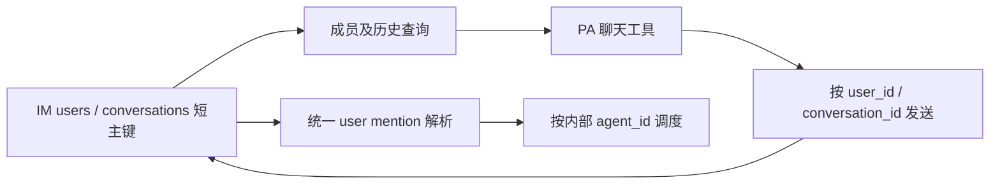
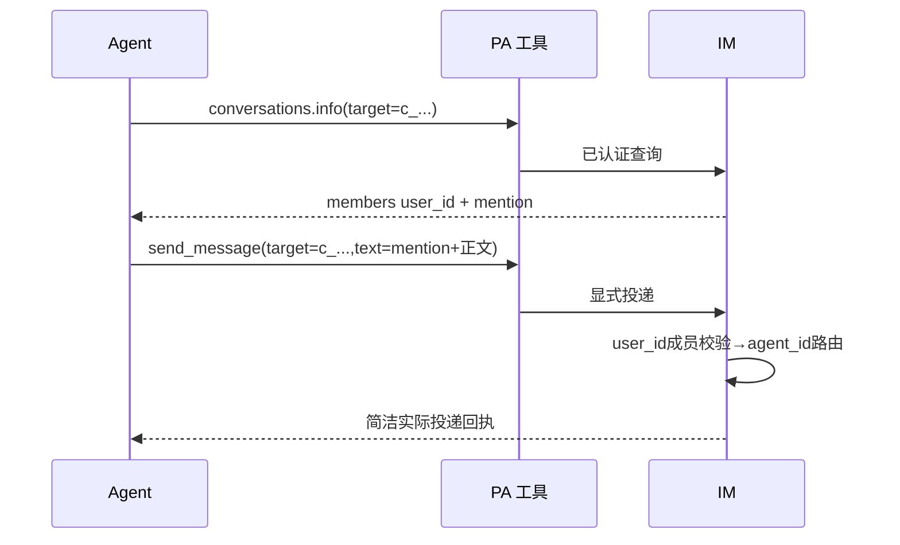

# refactor-550: 统一聊天身份与简洁工具 — 技术方案

> 对齐: [motivation.md](motivation.md) v1
> Unit branch: `codex/feat-546`（用户在开放 PR287 追加，沿用已隔离 unit-feat-546；不操作主仓 dirty checkout）

## Changelog

- 实施方式：用户明确“不用 change-orchestrator，直接干”；root直接实现与实测，不启动该编排流程。单 Thread 自身身份显示为 your_user_id/your_name，配置 agent_id 仍仅用于内部映射。

- R1修订：明确外部 shadow 历史的 owner 代记不是 IM 身份映射；合并为一个端到端 milestone，保留两个内部编码工作包。

## 现状分析

### 涉及范围

IM `UserRepository.create_user` 与 `ConversationRepository` 两个创建入口生成32位 UUID；agent_profiles.agent_id 独立且为全 IM 主键。users 中 Agent 通过 username=agent:<agent_id> 关联。群成员与消息作者使用 user_id，WorkConversationQuery.list 返回该值，Inbox 入站 Agent 常使用业务 agent_id。RelayService 只解析 type=agent 的业务 ID 标签。前端 picker 使用 agent_id；单 Thread communication context 带成员及旧标签说明，全局模式不带该段。send_message 模型 schema 叫 to；inbox/conversations 叫 target。

### 既有约束

IM 与 PA 不互相 import；PA 只 import agent.sdk。长期行为位于 docs/specs；本 unit 不改内核身份、消息 ID、权限、群回复策略。agent_id 仍全 IM 唯一。用户最新决定一次性部署迁移，拒绝运行时旧 ID/参数/mention 兼容代码。

### 可复用能力

保留 IM 的 users 统一聊天参与者模型、现有聊天/消息 HTTP 与 WebSocket查询、global Inbox 持久摄取与回执、send_message 实际投递/暂扣机制。身份映射已集中在 GatewayConversationPersistence 与 Actor 投影；改为在消费者出口明确输出 user_id。复用已有 mention tag 渲染结构，只保留 type=user 规范。无需新增身份证书、别名表或 Session 编号。

### 相关历史

feat-546 引入全局 Inbox 和显式发送；feat-548 统一会话名称；bugfix-358 的 mention 格式是本次需要一次性迁移的历史协议。总量审计见本地 output/dage-context-audit.md：members 已返回但身份/发送/mention 说明不一致。按用户要求不改推进策略或封禁工具。

## 架构总览

短 user_id 是所有聊天参与者的对外身份；agent_id 留在配置与内部运行。数据库仍保留两类实体的原有关系，但聊天消费者只依赖 user_id。

## 关键决策

1. **新用户/会话主键为 `u_` / `c_` 加8个小写字母或数字。**随机生成、数据库唯一约束保证，只有同表主键碰撞才重试；其他约束错误保留。无截断 UUID、无群/Session作用域、无复用；不改变 agent_id 唯一范围。生成辅助函数归 IM.infra，不引入跨包依赖。
2. **已有数据由部署 Agent 一次性迁移。**不在启动函数挂自动迁移，不增加 alias resolver、双格式发送参数或旧 mention parser。migration-prompt.md 是部署指令；映射仅为停机迁移/核对/备份资产，不进入运行时。验证使用演示数据副本；原演示与生产不在本轮直接迁移。
3. **成员信息按目标查询。**conversations新增info，list只返回简洁聊天条目，仍可按聊天名/成员名过滤。info无消息读取副作用，返回完整成员列表，拒绝无权目标。已有内部describe保留仅供 Gateway，附 user_id 与 agent_id 映射，不把内部 agent_id 交给模型。
4. **聊天中的 Agent 与人统一 user_id。**info成员为 {user_id,name,type,mention}。真实 IM 成员的模型消息 sender 为 {user_id,name,type}，聊天 envelope 使用target/name/type/channel。外部 shadow 当前将外部来信记在 owner_user_id 下，仅保留显示名，这不是外部联系人映射。此类 sender 固定为 {name,type:"external",channel,source_id?}，不返回 user_id；已知平台发送者 ID 时附 source_id，历史无法恢复时省略。禁止按显示名推断身份或把代记 owner 暴露为发送者。回复仍使用所属 shadow conversation target，不能据 source_id 私信。Inbox 与历史均用此例外结构；新 shadow 写入保留已知的外部 source_id 元数据以供历史读取，不新增外部账号系统。
5. **统一 mention `type=user`，target_id=user_id。**群内解析必须核对目标是本群成员，再把该成员的 username映射到内部agent_id；真人标签只渲染，不唤醒 Agent。单 Thread 与全局说明共享这一格式。前端picker/name map按user_id插入/展示；普通@名字不算提及。删除旧type=agent识别，部署时转换旧消息和上下文。指令命令寻址（/stop等）也使用新标签，触达范围不扩散。
6. **发送模型参数统一target。**只承诺接受user_id或conversation_id；后端完成user→agent内部路由。对模型不再接受to或agent业务ID。既有内部控制payload命名可保留原结构，它不是兼容模型参数。返回简洁UTF-8 JSON确认目标/成功与可用的message_id；暂扣/失败保留明确状态及后续读取目标，不回显正文和dispatch内部字段。
7. **Inbox与历史共用模型消息表达。**保留Inbox现有原子摄取、顺序、多模态、分页预算；只调整模型投影，内部receipt/entry_seq继续存在但不外泄。type/channel回到check/read结果。历史保留其既有最新页查询语义，说明页内顺序及next_cursor/before_message_id规则，不借本次改排序。所有参数给出用途/动作约束，不靠额外任务推进提示。

## 接口与数据流

| 模型操作 | 输入 | 输出与约束 |
|---|---|---|
| inbox.check | action=check,cursor?,limit? | conversations:{target,name,type,channel,unread,latest_at,mentioned?}[]；已有预算/分页不变 |
| inbox.read | action=read,target,cursor?,limit? | {target,name,type,channel,messages:[{id,sender:IM成员结构或外部来源结构,time,text或content,partial?}],next_cursor?}；只在未完成/错误时附辅助字段 |
| conversations.list | action=list,query?,cursor?,limit? | {conversations:[{target,name,type,channel,latest_at}],next_cursor?}；query按聊天名或成员名过滤，不附整群成员 |
| conversations.info | action=info,target | {target,name,type,channel,members:[{user_id,name,type,mention}]}；完整成员无隐式截断 |
| conversations.read | action=read,target,before_message_id?,cursor?,limit? | 与inbox.read同一消息结构；不消费Inbox，不改变人的已读 |
| send_message | target,text | {ok:true,target,message_id?}；held结果明确未发送及目标；失败不回显正文 |

PA↔IM内部 WorkConversationQuery仍用kind/source/part等已实现领域字段，PA在既有序列化模块投影成上述模型表达，避免改变持久receipt结构。内部describe新增kind/channel（成员已有id/name/kind/agent_id，id统一为实际user_id），PA据此将其Agent sender映射为user_id；info输出直接满足公共结构。不新增平行运输层。

## 前端原型

不新增页面或交互。保留现有输入框@候选、键盘选择、正文mention chip与手机布局；只更换身份协议和候选辅助标识。原型 [prototype.html](prototype.html) 为现有结构的静态示意。

| 当前入口 | 必须继承 | 增量 |
|---|---|---|
| chat composer / MentionPicker | 原位置、按名称过滤、方向键与Enter选择 | 候选短user_id；插入统一user标签 |
| MessagePane / mention parser | 正文与列表中显示成员名字 | name map由user_id解析 |

| 原型区域 | 对齐级别 | 产品入口 | 必验状态 | 下游投影 |
|---|---|---|---|---|
| 输入框@候选与消息名字chip | must-match | /chat/:id | desktop/mobile，选取Agent与人、发送后刷新 | M1 R2 |

## 契约层增量

- IM: specs/im/conversations-messages.md
- Gateway: specs/gateway/global-agent.md
- kernel / cli: no spec delta

## 风险与回退

ID迁移触及外键、JSON内引用、Gateway数据库与Kernel上下文。尤其channel credentials的AAD含owner_id：不得盲改密文或仅替换manifest；部署 Agent须在持有对应Gateway私钥的现场用旧AAD解密、用新AAD重封装，秘密不落日志。JWT旧subject失效，部署后通过正常登录重新获取令牌。迁移前停止所有相关写入，先在副本完成检查，正式迁移后任何失败都恢复整套备份及旧版本，不能一半新一半旧。完整清单见migration-prompt.md。

外部平台自己的用户/群ID不是IM user_id/conversation_id，不做盲目全局替换；只映射本IM生成的身份与实际语义引用。离线Gateway未迁移前不得接入新IM。历史旧URL不做兼容跳转，输出新链接。

## Runbook for Reviewer

本轮用户要求部署 Agent 日后依 migration-prompt.md迁移；保留 /tmp/feat546-feishu-authorized 原服务与数据。测试以SQLite backup和文件复制创建独立副本，另分配端口、node identity、workspace与config；任何外部channel默认关闭，防止复制凭据后重复接入。

服务采用 scripts/e2e-up.sh / scripts/e2e-down.sh 的隔离启动流程；迁移副本需保留数据则用等价启动命令，不让e2e-up清空原现场。真实入口验收需要IM+Gateway、前端构建与当前本机LLM_PROXY的DeepSeek V4 Flash连接；执行前检查端口/进程归属。根Agent在M1 progress记录最终副本路径、明确启停命令与截图/请求证据。

**Review 驱动方式**：真栈、真实浏览器（桌面/手机mention选择和显示）及真实模型（查询成员→群提及/私信）。不将mock结果当真实LLM结果。不发送到用户原群或真实外部联系人。

## Milestones

唯一端到端 milestone；内部按无交集文件 owner 并行编码，不把单侧测试通过当用户旅程退出。root负责迁移副本、集成真栈与真实模型验收。

| ID | 标题 | 依赖 | 并行组 | 范围 | 退出标准 |
|---|---|---|---|---|---|
| M1 | 统一聊天身份与通信工具 | 无 | 单一端到端 | IM持久/查询/路由、PA工具与上下文、前端mention、迁移副本 | [worker] 用户/会话短ID、仅主键碰撞重试；info授权和完整成员；统一user标签和target参数；两种prompt一致；外部发送者不冒充owner；receipt/分页/附件保持；相关测试与build通过。[reviewer] R1跨群身份一致、成员查询到私信/mention；R2桌面手机候选与chip；R3真实模型查询到群提及/私信；R4迁移副本重启保持上下文/消息/成员 |

内部工作包 A：src/IM（不含frontend）、tests/im_service，负责短ID、成员/历史查询与user标签路由、外部shadow消息元数据读取。内部工作包 B：src/personal_assistant、src/IM/frontend及对应tests，负责模型接口/投影/提示、shadow写入来源元数据和前端。A/B依据接口表协作，均不独立签收M1；root完成集成验收后才关闭M1。
