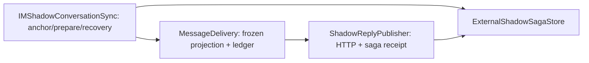

# refactor-570: Shadow publication boundary — 技术方案

> 对齐: motivation.md

## Changelog

## 现状分析

### 涉及范围

- `shadow_sync.py`：外部用户消息 anchor、durable 事实准备及恢复调度；当前将 self 交给 delivery。
- `message_delivery.py`：冻结内容投影、发送和 ledger；两个 shadow 方法还读取 shadow 私有字段执行 HTTP 和 saga 回执。
- `composition.py`：以 lazy delivery provider 解决 observer / writer / delivery 的构造顺序，接入真实 admission/release hooks。
- 既有 `test_gateway_shadow_sync.py`、`test_gateway_im_relay.py`、`test_shadow_auth.py`、`test_shadow_reply_images.py` 覆盖上述行为。

### 既有约束

遵守 AGENTS 分包边界，PA 仅调用 agent.sdk。保持 refactor-564 的唯一完整回复 owner，不给 observer 或 shadow 恢复增加裸正文发布捷径。保持当前协议、持久状态、冻结图片、publish admission 和 release 的顺序。

### 可复用能力

- 用 ExternalShadowSagaStore 的 prepare/record/acknowledge/discard，不改 schema。
- 用 ReplyImages 的已有快照和 MessageDelivery.project_saved_shadow，不重读源图片。
- 用 im_http_transport 的 header 与 URL 处理，不经 shadow_sync 间接导入。
- 用 composition 的既有 _admit_shadow / _release_shadow；本 unit 不改 run 状态判断。
- 删除 shadow_sync 无调用者的 _project_images，避免保留第二条投影契约。

### 相关历史

refactor-564 集中完整回复交付；refactor-568 集中 tool projection 并保护 stop cleanup。两者已合入，均保留。bugfix-567 的入站附件策略不在本次范围。

## 架构总览

新增具体 `ShadowReplyPublisher`，只封装 outbound shadow HTTP 协议和 saga 发布回执。依赖变为：

MessageDelivery 不再接收 IMShadowConversationSync，也不 import 它。Publisher 不依赖 sync 或 delivery；composition 显式注入同一个 saga store 与发布组件。保留 lazy delivery provider 仅解决 observer/writer 构造顺序，并标注返回类型，不能透传 sync 私有状态。

## 关键决策

1. **提取具体协议组件，不增加泛化 transport 框架。** 两条 HTTP 路径、鉴权和 durable 回执有共同职责；比暴露 shadow 私有属性为 getters 更完整，也比把所有回复决策移回 shadow 更符合既有 owner。
2. **交付 owner 先投影冻结内容，再调用 publisher，最后写 ledger。** Publisher 不接触 ReplyImages / DeliveryLedger。其返回 IM message id 或 admission 拒绝时的 None；失败抛出原有异常，保持 pending。
3. **已有 admission/release hooks 作为 publisher 的执行边界注入。** hooks 的决策仍来自现有 runtime context。token 获取在 admission 前；admission 拒绝持久 discard 且不 release；接受后无论 HTTP 成败均 finally release；收到合法 id 才确认 saga。保留这个既有先后关系，避免重构影响 /stop。

## 接口与数据流

`ShadowReplyPublisher` 构造参数：base_url、gateway_token_getter、saga_store、timeout_seconds=3、可选 transport、before_publish、after_publish。配置与 store 由 composition 同时注入 sync/publisher；不由 delivery 从 sync 取出。

- `publish_output(saga: ExternalShadowSaga, output: ExternalShadowOutput, content: str) -> str | None`：要求已有 anchor；执行原 POST、原 idempotency key、suppress_relay，校验响应 id，record_output_anchor；拒绝时 discard_output。
- `publish_snapshot(saga: ExternalShadowSaga, snapshot: ExternalShadowBubble, content: str) -> str | None`：执行原 PUT 和 token usage 映射；校验 id 后 acknowledge；拒绝时 discard_snapshot。
- MessageDelivery 构造注入可选 `shadow_publisher`（不配置 IM 的 Gateway 无此能力）；`mirror_shadow_output(saga, output)` 和 `reconcile_shadow_snapshot(saga, snapshot)` 不接收 sync。两者只负责 project_saved_shadow、调用上述接口、按原格式 record_delivery；None 不记 delivered。
- Sync 在 reconcile 时用自己的 store 解析 saga、无 anchor 返回，随后调用 delivery；ordinary output 与恢复也只传 saga/output。

处理顺序：durable source → frozen projection → token → admission → HTTP → finally release → id 校验 → saga receipt → ledger。无 anchor 不请求；失败不记成功；重试继续用旧 output key / caller idempotency key / shadow_message_id。

## 契约层增量 (delta-spec)

- Gateway / IM: no spec delta。保持 `docs/specs/gateway/external-channels.md` 与 `routing-delivery.md` 的既有行为。

## 风险与回退

风险集中在 composition 配错 store、admission/receipt 顺序变化、POST 与 PUT 回执混用。保留既有行为测试并检查生产构造路径；不扩展 stop/reset 的新语义。回退代码即可，无数据库迁移。

## Runbook for Reviewer

本次不改客户端面；使用真实 ChannelAdapter.start(on_inbound) 入口驱动 compose_gateway 的正常运行时，以客户端 REST history 观察真实隔离 IM 结果。一次性 driver `/tmp/refactor-570-channel-driver.py` 已落实：只在 `_build_channel_registry` 返回的 registry 注册 `feishu:e2e` 合成 provider adapter；start 获得生产 on_inbound 回调，局部 HTTP POST 把 text/event/chat 转成规范 InboundMessage，send 记录外部出口。未替换内核、delivery、shadow、store、HTTP 或取消 hook。该 fixture 不证明飞书网络本身，本 unit 不修改那一层。

| 服务 | 停止命令 | 启动命令 | 健康检查 |
|---|---|---|---|
| 隔离 IM + Gateway | `./scripts/e2e-down.sh --wt /tmp/refactor-570-e2e` | `mkdir -p /tmp/refactor-570-e2e` 后在 unit worktree 执行 `PATH=/Users/czj/Repos/nano-multiagent/.venv/bin:$PATH ./scripts/e2e-up.sh --wt /tmp/refactor-570-e2e` | 启动输出的 IM `/openapi.json`，并核对独立 node/cwd |

### 外部消息驱动命令

1. 运行上述 e2e-up；保留其 IM 与隔离数据，用 `kill -TERM "$(cat /tmp/refactor-570-e2e/.gateway.pid)"` 停止脚本启动的这一个 Gateway，并确认退出（不能关闭生产 Gateway）。
2. 在 `/tmp/refactor-570-e2e` 启动替代 Gateway，源码指向 unit worktree：`SHADOW_REVIEW_ROOT=/tmp/refactor-570-e2e PYTHONPATH=/Users/czj/Repos/nano-multiagent/.worktrees/unit-refactor-570/src /Users/czj/Repos/nano-multiagent/.venv/bin/python /tmp/refactor-570-channel-driver.py --config /tmp/refactor-570-e2e/.gateway-config.yaml --foreground --auto-bind`。将该进程 PID 写入隔离 `.gateway.pid`，日志写 `.fixture-gateway.log`；owner 保持 exec session 存活。停止仍由 e2e-down 负责。
3. 读取 `.fixture-port`；`curl --noproxy '*' -X POST http://127.0.0.1:<fixture-port>/ -H 'Content-Type: application/json' -d '{"text":"回复 shadow-review-ok","event":"review-1","chat":"review-chat"}'`。默认 `e2e` Agent 经真实内核和当前配置 LLM 执行。`/stop` 同一入口发新 event；不可人工放行 admission。
4. 使用 `tests/e2e/critical_paths/_im_client.py` 的 IMClient，以 e2e 固定 nano/nano1234 登录 `.e2e-ports.env` 指定 IM URL，读取 conversations/messages，验证正文、rich 状态、同身份数量。fixture GET readiness、IM `/openapi.json`、online node/cwd 一并核对。
5. 恢复场景使用隔离网络故障/服务暂时不可用或该节点专用 HTTP 故障代理，让真实发送失败后恢复；只操作隔离端口。图片从隔离 workspace 的 exports 生成并发送，冻结后删除源再恢复，检验原回复图可读。短时故障的精确触发在交接记录中给出，不改业务代码或持久状态伪造成功。

**Review 驱动方式**：端到端真栈，客户端面未改，允许用客户端同一 REST 接口读取结果。正式验收前交接独立端口、节点、被测版本和驱动命令；只检查本次 shadow publication 风险。

**验收前置**：repo `.venv`、隔离 SQLite/回复缓存、e2e 配置；测试外部消息使用合成 provider identity，不连生产 channel；LLM 使用 repo e2e 配置的本机 :4000 proxy，开验前验证可用。图片只来自隔离 workspace。真实 IM HTTP 可用性由启动 health 验证。

## Milestones

| ID | 依赖 | 并行组 | 文件范围 | 退出标准 |
|---|---|---|---|---|
| M1-boundary | 无 | 单一 | gateway/{shadow_reply_publisher,shadow_sync,message_delivery,composition}.py；上述相关测试及 helper | [worker] 无 delivery→sync 私有访问；HTTP/回执只在 publisher；现有快照/恢复/鉴权回归通过；真实 composition 同 store/hook；[reviewer] motivation 三组场景保持，独立 IM history 能看到无重复的正文/状态，失败恢复和取消不晚发 |

## 测试策略

Keep 既有 shadow sync/auth/relay/image 测试的行为断言，rewrite fixture 以显式构造 publisher 和 delivery；不复制它们为新套件。若需要补充生产接线风险，在现有 composition 测试中扩展真正缺失的路径。执行最窄相关测试后运行仓库当前 CI 等价检查；reviewer 走真栈，一次性验收脚本不进入永久 tests。
