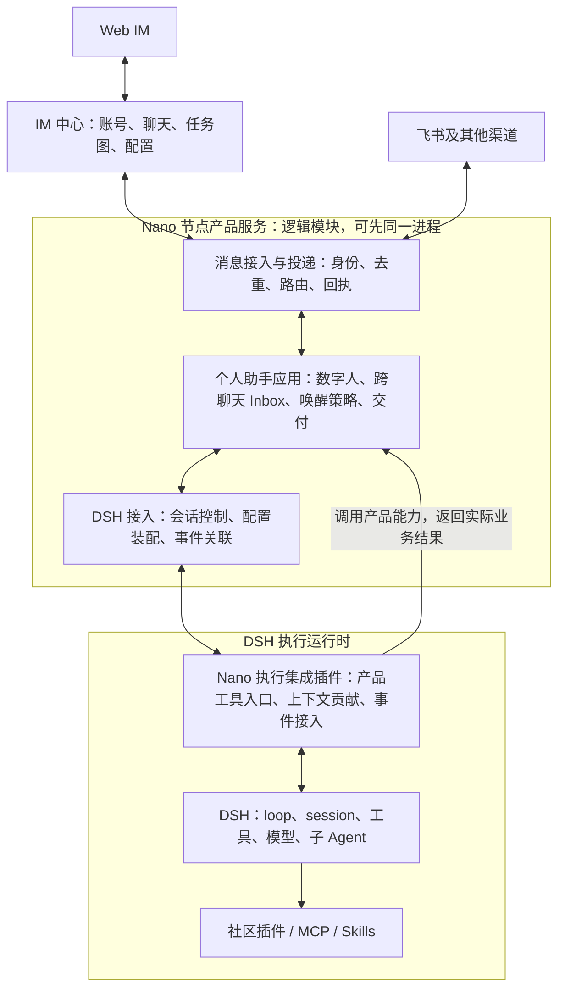
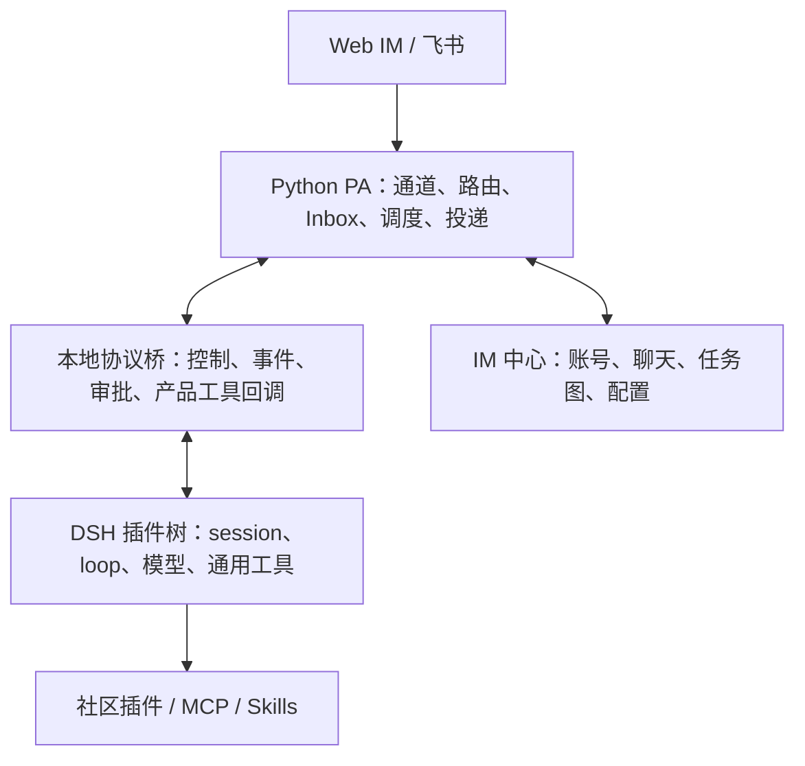
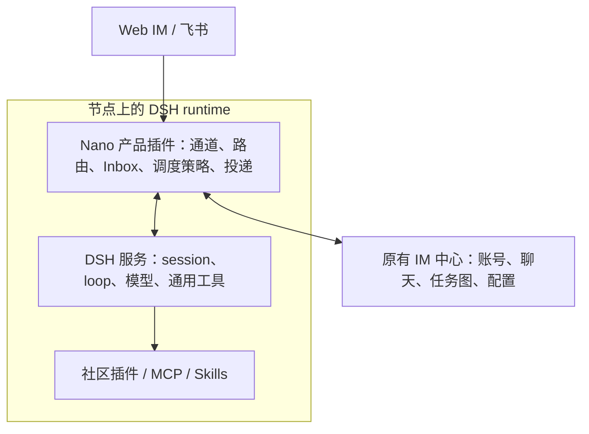

# refactor-581: 终态职责与技术选型讨论

> 2026-10-09；早期方案比较，非已批准 design，未进入 Gate 2。需求与用户原话见 [motivation.md](motivation.md)。
>
> **后续完整提案见 [target-architecture.md](target-architecture.md)**：已 fetch 两仓最新远端，纳入原生 iOS／Swift、默认独立 DSH 进程、数据和恢复边界。本文保留比较过程，旧 Nano 基线和 A／B 范围假设不覆盖新提案。
>
> 证据层次：下文“已核实”指当前源码／文档，未运行接入 PoC；成本和长期收益是据此作出的工程判断。没有给出未经验证的人日或性能指标。

## 当前讨论结论：先确定终态职责

用户指出 Gateway 的许多职责独立于 Agent，要求先考虑终态。上一轮“推荐以 B 为终局”的判断收回为未决：它过度重视少一层跨语言转换，没有充分比较产品生命周期、业务数据和依赖方向。

**当前建议是 Nano 持有个人助手产品，DSH 持有 Agent 执行，插件承担必要的执行接入。** 这是职责建议，尚不是用户批准的最终设计。下文 A／B 仍用于比较部署方案，不再是必须二选一的产品架构。

应分别决定三件事：业务模块由谁负责，模块通过什么接口交互，以及模块放在哪个进程／用什么语言。TypeScript 不等于 DSH 插件，DSH 插件也不等于其中的业务必须依赖 DSH。Cordis 可以装配一般服务；是否使用它装配，不应决定业务数据归属。

## 建议终态：产品与执行分工

图中分组表达职责，不要求每个方框部署为服务。IM 与节点的现有网络边界保留；DSH 与节点是否同进程，在职责对齐后再选择。单独进程可让 runtime 重启不连带关闭渠道连接，同进程可减少传输和部署协调；两者都能保持相同业务分工。

### 职责与数据归属

| 层次 | 核心问题 | 自己持有的事实 | 不承担的执行职责 |
|---|---|---|---|
| IM 中心 | 谁是用户／数字人、聊过什么、共享任务是什么 | 账号、聊天记录、任务图、Agent 配置与节点绑定 | 不调用模型或调度工具 |
| 节点消息接入与投递 | 谁发来消息、是否重复、结果真正发到了哪里 | 渠道映射、入站标识、附件与发送回执 | 不根据模型内部步骤决定下一次请求 |
| 个人助手应用 | 哪个数字人负责、哪些聊天待处理、何时唤醒、向哪里汇报 | 数字人与 session 的绑定、跨聊天 Inbox、主动任务与交付状态 | 不实现 loop、子 Agent 调度和上下文压缩 |
| DSH 执行 | 如何根据当前输入、上下文和工具完成执行 | session 日志、待执行输入、模型步骤、工具调用、内部子 Agent | 不成为公司身份、渠道发言资格和共享任务图的权威 |
| 执行集成插件 | 产品能力如何进入 DSH 的工具与上下文 | 必要的执行身份关联及 runtime 配置投影 | 不复制产品数据库和消息投递机制 |

这不是新增一套通用任务平台。个人助手应用从现有 PA 业务职责中收拢；DSH 执行事实仍只有一个 owner。工作视图可以持久投影 DSH 事件，但不借投影再建立一套驱动 loop 的运行状态机。

### 判断是否应成为 DSH 插件的依据

1. 需要直接参与 prompt、工具注册、工具权限执行、Agent 事件或 session 作用域的部分，适合插件。
2. Agent 尚未运行、已经结束或 runtime 暂不可用时仍有独立业务意义的部分，应由产品服务持有。即便采用 Cordis 启动它，业务模块也不应到处依赖 `ctx.agents` 等运行时对象。
3. 混合能力拆成“业务服务 + 工具入口”。例如 `send_message` 的 schema 和执行身份接入属于插件，发送资格、目标解析、渠道调用及真实回执属于产品。

| 能力 | DSH 侧 | Nano 产品侧 |
|---|---|---|
| 发消息 | 注册工具、取得可信调用身份、接收取消、返回工具结果 | 判断能否向目标发言、发送前复核、实际发送、去重和回执 |
| 读 Inbox | 注册读取工具、让读取结果进入模型上下文 | 跨聊天条目、来源、可见范围、读取／消费语义 |
| 任务图 | 注册工具并关联真实数字人身份 | IM 的共享任务图、授权、原子更新 |
| 主动跟进 | 执行被唤醒的工作；必要时提供定时工具入口 | 已接受的跟进安排、目标聊天、时区／开关、触发与交付策略 |
| 权限 | 工具执行限制及获准后的继续／取消 | 谁能批准、从哪个渠道答复、产品资源访问资格 |
| Skills／通用工具／compaction／内部子 Agent | 尽量完全复用 DSH | 选择配置和必要的产品展示，不另建执行机制 |

权限并非两套同义判断：产品控制业务资源资格，DSH 执行工具权限。某个工具动作的自动判定／审批决定只保留一个权威执行链。

### 三个容易混淆的身份与状态

- **数字人与 session**：数字人有长期身份、职责和渠道关系，可以经历多个 session；session 重建不能变成换一个员工或丢掉产品任务。
- **产品 Inbox 与 DSH inbox**：前者记录跨聊天来源及待关注内容，后者决定已经送入执行上下文的输入何时消费。二者需要稳定关联，但不维护两个相同的待执行队列。
- **工作进展与一次执行状态**：一次 turn 结束不等于交办完成；对外发送成功也不能由 turn 结束推断。长期跟进安排属于产品，执行步骤属于 DSH。

### 用一条真实旅程检查边界

用户在飞书说“明天下午提醒我看这份方案”，之后 DSH runtime 被升级重启：

1. 通道接入确认发言人与聊天，个人助手应用将输入交给对应数字人的 DSH session。
2. DSH 理解请求并调用产品提供的安排工具；产品保存提醒时间、时区、对象与投递目标，工具返回真实保存结果。
3. runtime 重启不改变提醒这件事的业务存在性；到期后产品唤醒可用执行 session，暂不可执行时保留明确待处理状态，具体补跑规则由产品契约决定。
4. DSH 生成内容或执行查询，产品通过原渠道投递并记录真实回执。

也可以选择 DSH schedule 作为某类安排的实现，但必须确认它的 session 归属、恢复、投递和管理能力满足该产品契约，并迁移为唯一记录。不能仅因名称相似，同时写两套任务或假定已具备提醒交付。

### 必要接口与维护边界

产品对执行只需要明确的会话打开／恢复、输入投递及方式、取消、执行事件、审批往返、能力与配置装配。DSH 对产品调用消息、Inbox、任务图和主动安排等已存在业务能力。具体传输和方法名留待正式设计。

不要求复刻旧 `Kernel` 所有方法，也不提前建设支持任意未来内核的抽象框架。可以明确面向 DSH，同时把 DSH 类型、事件版本和公共 API 变化集中在执行接入模块与插件。边界测试验证实际使用的 DSH 能力，产品测试验证路由、授权、提醒与投递；关键旅程仍用真实 DSH 串起来验证。

### 待共同决定的终态问题

用户认可上述职责划分方向，并明确不要求保留 Python。当前倾向是渠道接入与个人助手应用由 Nano 节点服务共同承载，DSH 作为其管理的执行运行时；不为每个模块增加微服务，也不把完整 Gateway 挂进每个 Agent 的作用域。语言建议见下节；是否隔离进程另行确定。

## 语言建议：服务端与 Web 统一 TypeScript，原生客户端与工具脚本保留适用语言

在先确定职责边界、暂不考虑迁移顺序的前提下，建议终态的 Nano 节点服务、DSH 集成、IM 后端和 Web 客户端以 TypeScript 为主。统一的是自有产品开发栈，不要求消灭 Python：已有 Skills 的 Python 脚本、数据处理、评测与依赖 Python 的工具仍可原样运行。

| 部分 | 建议终态 | 选择依据 |
|---|---|---|
| 节点消息接入／个人助手应用 | TypeScript 普通应用模块 | 与 DSH 接入同语言，减少跨语言类型维护；消息与网络业务不依赖 Python 特有计算栈 |
| DSH 接入／执行集成插件 | TypeScript | 直接使用上游导出类型、服务与插件开发生态；上游类型集中在该边界 |
| IM 中心后端 | TypeScript 独立服务 | 可与 Web 和节点共享产品协议定义、工具链与测试习惯；仍独立于 DSH |
| Web IM | 保留 React + TypeScript | 当前已使用该栈，不因后端迁移更换 UI 框架 |
| 原生 iOS | 保留 Swift | 最新主线新增的独立原生客户端；不纳入服务端语言统一 |
| Skills、数据处理、专项工具 | 按能力选择语言 | 不为语言统一重写可靠脚本，Python 继续作为工具执行依赖 |

节点侧的收益最直接；IM 后端改成 TS 的主要收益是长期维护一致性，不是 DSH 接入的技术前提。终态可以统一，实施也不必同一批重写；历史 A／B 比较原先保留 Python IM 的范围假设不再作为新终态约束。

### 依据与限度

- 本仓 Web 客户端已经采用 TypeScript；PA／IM 当前所查接线主要是异步网络、事件、调度、持久化和认证。没有因这些职责而必须选择 Python 的已知理由；这不是对所有依赖的完整移植审计。
- 飞书存在支持 TypeScript 的官方 Node SDK，并提供 API、事件处理和长连接能力，因此通道重写有现成基础，不需从头实现飞书协议。当前具体卡片、文件、多 Bot 与生命周期行为仍需对应验证。来源：[larksuite/node-sdk](https://github.com/larksuite/node-sdk)，2026-10-09 查阅。
- 同语言能共享产品协议类型和校验定义，减少 Python／TS 两份声明的漂移；跨进程消息仍要序列化、校验和版本管理。TS 本身不解决重复消息、投递幂等、事务或恢复。
- 共享的应是消息、Agent 配置、节点事件、任务图等产品协议；数据库模型和 DSH 原始 session 类型不进入通用产品协议包。前端与 IM 不因语言相同而直接 import DSH。
- 产品业务规则保持普通模块；只有 DSH 集成层依赖其 SDK／Cordis。一个持久消息服务不因改写成 TS 就必须改成 DSH 插件。
- 统一开发栈不等于统一进程。节点服务与 DSH 是否隔离，应根据运行时重启、渠道持续接入、插件故障和运维成本判断，不能仅凭两者都使用 Node 决定。

### 成本判断

这项建议主要优化后续新增能力和多人／Agent 协作维护，不意味着立即重写必然更省时。现有 Python 中成熟的行为、SQLite 数据、认证记录、协议及回归案例仍是迁移资产；迁移应重新组织职责并复用合适依赖，不能逐行翻译。IM 后端保持 Python 一段时间也不构成架构错误，只是尚未达到建议的统一语言终态。

## 共用前提

- 保留 IM 中心与 Web 客户端，以及账号、公司、聊天、任务图和节点的产品边界。以下 A／B 比较最初假设保留 Python IM；它仅用于比较当时两条接入路线，新的语言终态建议以上节为准。
- 两种方案都使用 DSH 自有 loop、通用工具、模型适配、session、compaction 和子 Agent，均停用自研 CLI，最终均退出旧 `src/agent` 运行路径。
- DSH 以锁定版本的依赖和独立 Nano 插件包复用，优先不 fork 上游、不复制其工具实现；上游公共接口缺口单独记录。
- 社区插件分三类：普通工具／Skills／MCP、运行时扩展、DSH Web 专属 UI。最后一类不会自动出现在 Nano Web IM；两种方案都需产品呈现适配。
- 旧日志转换、正在运行的任务切换、真实飞书投递、多节点上线都要单独验收；静态源码比较不能证明迁移成功。

## 已核实的关键事实

Nano 基线：`76fe1d7e7c2a4d07da06453fd2b4658749bb6f87` 加已有 dirty tree；本轮未修改产品代码。

DSH 基线：`5badb15009ae1756c3afe0ae0cef1faafc290ccc`，`0.2.1-alpha.1`。以下链接固定到该提交，避免未来上游变化覆盖本次证据。

| 事实 | 对选型的含义 | 证据 |
|---|---|---|
| DSH 是 Cordis 插件树，支持独立 profile／bundle | B 能直接组合能力；A 的 DSH 侧也能安装同样插件 | [architecture](https://github.com/deepseek-ai/deepseek-harness/blob/5badb15009ae1756c3afe0ae0cef1faafc290ccc/docs/architecture.md) |
| 官方 Python SDK 启动持久复用的 DSH 子进程，采用 stdio JSON-RPC | A 不需要自写进程载体，但高层 `run()` 不是现有 PA 的等价接口 | [Python SDK](https://github.com/deepseek-ai/deepseek-harness/blob/5badb15009ae1756c3afe0ae0cef1faafc290ccc/python/sdk/README.md) |
| SDK 请求只有 initialize、session/prompt、shutdown；cwd／模型按进程初始化；没有取消、session close、实际审批往返 | A 若只依赖原 SDK 无法完成当前 PA；须复用更完整 API 或增加受控的桥接插件 | [protocol types](https://github.com/deepseek-ai/deepseek-harness/blob/5badb15009ae1756c3afe0ae0cef1faafc290ccc/packages/sdk/protocol/src/types.ts)、[protocol limits](https://github.com/deepseek-ai/deepseek-harness/blob/5badb15009ae1756c3afe0ae0cef1faafc290ccc/packages/sdk/protocol/README.md) |
| SDK 提交回执是 inbox messageId，不代表独立请求完成；普通 prompt 调用 followup | 不能把每个 prompt 直接包装成旧 run；队列、插话、结束与投递归属需要重新设计 | [server](https://github.com/deepseek-ai/deepseek-harness/blob/5badb15009ae1756c3afe0ae0cef1faafc290ccc/packages/sdk/server/src/server.ts) |
| DSH Agent 具有 send、followup、steer、inject、cancel；inject 不唤醒 | B 可直接使用；A 必须在桥上表达这些必要差异，不能统一成“发消息” | [Agent runtime types](https://github.com/deepseek-ai/deepseek-harness/blob/5badb15009ae1756c3afe0ae0cef1faafc290ccc/packages/core/agent/src/runtime-types.ts) |
| DSH session controller 支持恢复、取消、幂等 prompt、history／follow；Web follow 有实时 assistant 帧 | 这些能力存在，不应重写。但其依赖包含 workspace、attachments、fileUploads、Typert 等，复用不是一个裸 HTTP 调用 | [session controller](https://github.com/deepseek-ai/deepseek-harness/blob/5badb15009ae1756c3afe0ae0cef1faafc290ccc/packages/api/session-controller/src/index.ts)、[README](https://github.com/deepseek-ai/deepseek-harness/blob/5badb15009ae1756c3afe0ae0cef1faafc290ccc/packages/api/session-controller/README.md) |
| DSH API Gateway 使用 Typert、运行时对象与 scoped events | Python 直接全面复制 Web 客户端协议也有维护成本；A 的桥应限定为 Nano 实际需要的操作 | [API Gateway](https://github.com/deepseek-ai/deepseek-harness/blob/5badb15009ae1756c3afe0ae0cef1faafc290ccc/packages/api/gateway/README.md) |
| DSH schedule 在原 session 投递 followup，依赖 Host session controller；不能独立挂到纯 SDK composition | 最新11a已选原主会话投递，退出旧Cron隔离语义；Heartbeat缺失策略仍需接入 | [schedule](https://github.com/deepseek-ai/deepseek-harness/blob/5badb15009ae1756c3afe0ae0cef1faafc290ccc/packages/schedule/schedule/README.md) |
| DSH 包含 MCP client、文件 Skill、pi-ai provider 和插件管理 | 能复用社区能力与多模型；不保证用户现有 OAuth、代理或 Skill 内所有工具名直接兼容 | [MCP](https://github.com/deepseek-ai/deepseek-harness/blob/5badb15009ae1756c3afe0ae0cef1faafc290ccc/packages/mcp/mcp-client/README.md)、[pi-ai](https://github.com/deepseek-ai/deepseek-harness/blob/5badb15009ae1756c3afe0ae0cef1faafc290ccc/packages/llm/llm-pi-ai/README.md) |

## A：Python 保留产品控制，DSH 承担 Agent 执行

图中是逻辑关系；Web IM 通过 IM 中心中继，飞书通过通道直达 PA。

### 接口形态与一次调用

产品侧只依赖 PA 自有 `DshRuntime` 模块。候选接口为打开／恢复 session、提交输入（明确 followup／steer／仅注入）、订阅事件、取消、回答审批、读能力和应用后续配置。它隐藏子进程、请求关联、session 身份、事件投影与关闭顺序；不原样实现旧 `Kernel` 的全部方法。

例如飞书发来更正：Python 判定目标聊天与 Agent → 通过桥向 DSH 的当前 session steer → DSH 继续执行 → 桥返回带 session／turn 归属的事件 → Python 判断是否应对外发送。Nano 的 `send_message`／Inbox／任务图工具在 DSH 注册，执行时回调 Python；真实身份从运行绑定取得，不能由模型参数决定。

桥接是否基于现成 session controller、完整 Remote 客户端还是小型专用 serving plugin，需要一个可丢弃 PoC 验证。不能因找到 SDK 就默认该选择已解决。

### 得到什么、付出什么

- **短期保留成熟产品代码最多。** 飞书、IM 重连／ACK、配置同步、租户校验与调度可先保留。
- **进程故障隔离较好。** DSH 子进程退出时 Python 可继续保留入站与投递状态；恢复仍要处理已入队但回执丢失等实际问题。
- **通用工具复用并不受 Python 阻碍。** 新装只在 DSH 内执行的文件、网页、MCP 工具，通常无需 Python 增加对应实现。
- **运行时新特性需要跨语言落地。** 新审批类型、交互问题、Workflow 状态、子 Agent 生命周期等，要同时考虑 DSH、桥协议、Python 状态与 Nano 呈现。
- **会保留两侧生命周期的协调成本。** Gateway 活着不等于 DSH 就绪；Gateway run 结束也不等于 DSH 没有未消费输入。若保留旧 run 语义，就容易形成第二套执行状态机。
- **不是“先接一下就完成”。** PA 已有 24 个文件直接导入 SDK，更多代码消费其事件与运行概念。旧内核契约不能全部隐藏在一个永远兼容的 adapter 后面。

## B：个人助手成为 DSH 的一组产品插件

产品职责仍存在，只是它与 DSH 服务在同一运行时以插件 API 交互。Nano 仍拥有自己的产品、协议和持久业务数据，不改造成 DSH Web UI 的换皮。

### 接口形态与一次调用

Nano 插件的外部接口仍是现有 IM WS／HTTP 协议、飞书事件及产品工具。内部调用 DSH 的 Agent、session、tools、approval 等服务；按需使用持久化／session controller，不新建一个通用 Nano Kernel SDK。

同一飞书更正：通道插件验明身份 → 产品路由找到 session → 在同进程调用 Agent steer → 订阅 DSH 流事件 → Nano delivery 决定对外发送。产品工具执行直接调用产品业务服务；工具进度、取消和权限沿 DSH 已有执行上下文传播。

按独立职责组织少量逻辑模块：通道与 IM 连接、产品 Inbox／工作策略、产品工具与投递、profile 装配。是否拆成多个 npm 包由真实生命周期与依赖决定，不先建设插件平台。

### 得到什么、付出什么

- **长期更容易复用运行时能力。** Nano 产品逻辑能直接使用 DSH 的事件、服务与作用域；新增复杂能力通常少一层跨语言适配。
- **有机会删除旧编排而不只删除旧 loop。** 会话和子任务执行事实由 DSH 持有，Nano 只保留跨聊天工作与交付责任。
- **插件成果较容易贡献回生态。** 例如通用飞书连接器可独立分享；账号、公司任务图等 Nano 专属行为仍是自有插件，不强行通用化。
- **迁移范围显著更大。** PA 排除 bundled skills 后约 4.88 万物理行，包含约 5,155 行 channels、3,703 行 scheduler、2,309 行 IM WS 和大量 Gateway 逻辑。它们不是全部要重写，但每条保留旅程都要重新接线、验证。
- **应用与上游的耦合更直接。** DSH API 尚未稳定，插件需要跟随升级；同进程也不能隔离错误插件的阻塞或进程崩溃。应锁版本、保持少量明确依赖，并按使用场景验收升级。
- **不等于所有业务状态交给 DSH。** IM 消息／任务图、Nano 跨聊天 Inbox、入站去重与投递回执仍有产品含义，不能塞进普通 session 历史后丢掉查询和恢复能力。

## 成本与长期演进对照

| 维度 | A：Python + DSH | B：DSH 原生 PA 插件 |
|---|---|---|
| 第一条现有聊天链路接通 | 较快，通道／IM 代码可沿用 | 较慢，要建立新节点连接与产品插件 |
| 保住飞书边界行为 | 复用现有 Python 实现占优 | 必须重新覆盖多 Bot、群触发、附件与原生交互 |
| 一般社区工具、Skills、MCP | 可直接在 DSH 侧复用 | 同样可直接复用；不是 B 独占优势 |
| 子 Agent、审批、长期任务等深层能力 | 需要桥及 Python 表达相同生命周期 | 直接使用服务／事件，产品映射仍需维护 |
| DSH Web 专属 UI 插件 | 不会自动进入 Nano UI | 也不会自动进入 Nano UI |
| Nano 特有功能演进 | 保留熟悉的 Python；涉及执行语义时跨两侧 | 业务在 TS 插件中闭合；IM 协议仍跨进程 |
| 上游升级 | 桥可吸收局部变化，但有 TS、协议、Python 三处对齐 | 少一层转换；直接依赖公共服务的插件需要升级 |
| 故障与并发 | 子进程隔离好，需处理断桥、孤儿进程、重复提交 | 节点内调用简单，共享进程故障域；仍需持久化恢复 |
| 多 Agent／workspace／模型 | 不能靠原 SDK 的进程级初始化直接覆盖全部；桥需作用域能力 | 原生 per-agent scope 更自然；真实 owner／权限仍由 Nano 绑定 |
| 部署／排障 | 节点含 Python + DSH 与桥；日志需贯通 | 节点以 DSH + 插件为主；中央 IM 仍是 Python |
| 测试资产 | 较多 Python 业务测试可保留；补协议和真 DSH 测试 | 保留产品旅程与 IM 契约测试；Python 单元测试作为行为参考迁移 |
| 一年后主要维护的代码 | 产品业务 + 跨运行时适配 + 遗留行为压缩 | 产品插件 + 上游版本适配 |
| 历史迁移 | 仍需数据与会话迁移，不因语言相同而消失 | 同样需要；语言不是决定难度的主要因素 |

没有依据声称 TypeScript 本身更快或 B 延迟更低。模型、工具和网络通常主导交互耗时；选型应看维护责任和产品行为，不以语言性能想象作结论。

## 四个未来变化的具体推演

1. **安装一个新 MCP 网页工具。** 两方案都配置 DSH MCP client 并验证工具可用；若采用通用工具卡，通常都不改核心产品。若插件要求 DSH Web 组件，两方案都需 Nano UI 接入。
2. **DSH 增加新的人工交互／审批能力。** A 可能要扩桥协议、Python 请求状态和 IM 呈现；B 直接接事件并更新产品呈现。服务本身变化两方案都受影响，B 省的是中间翻译。
3. **改进跨聊天全局助手的跟进方式。** A 在 Python 业务模型和 DSH inbox／turn 之间协调；B 在同一 runtime 中调用原生机制，但“哪些聊天该读、结果发给谁”仍由 Nano 设计。
4. **以后换另一个 Agent runtime。** A 的业务层较独立，但不能假设桥抽象能无成本兼容另一个 runtime；B 迁移成本更大。当前用户已决定采用 DSH，不为假设中的下一次换核提前建设通用多后端平台。

## 哪些现有东西值得保留，哪些不要照搬

| 现有资产 | 两方案共同原则 | B 的迁移方法 |
|---|---|---|
| IM 中心、聊天、公司、任务图 | 保留业务权威及真实身份校验 | 沿现有协议连接，不重写中央服务 |
| 飞书／其他通道和节点接线 | 体验尽量保留，先盘点实际使用项 | 使用维护中的服务 SDK，迁移产品规则，不逐行翻译旧文件 |
| 全局 Inbox、明确发言、发送前复核 | 保留产品职责与持久事实 | 用 DSH session／inbox 承接执行；产品 Inbox 继续拥有跨聊天来源与消费语义 |
| Heartbeat／Cron | Cron已选DSH原生主对话投递；Heartbeat缺失策略迁移 | 不建立独立Cron会话；11b已确认采用原生过期补发 |
| 通用 read／write／bash／web／子 Agent／compaction | 优先采用 DSH，不再维护平行实现 | 原生插件装配与配置 |
| Workflow、自动权限分类、知识维护 | Workflow控制及知识维护已确认保留；权限缺失机制补迁；风险政策默认Nano并支持配置切换DSH | 最新范围见[能力地图](capability-plugin-map.md)与[决定记录](pending-decisions.md)，不再将知识自动维护列为可删减候选 |
| 现有 Skills、脚本、workspace 文件 | 尽量直接复用，不因换语言重写 | Skill 路径、工具引用、解释器和凭据逐项验证 |
| 模型和 OAuth 配置 | 必须覆盖实际使用路线 | 优先 DSH provider；旧配置字段与认证记录不假设可直接导入 |

## 状态、数据和测试边界

两种方案均应只有一份 Agent 执行真相：DSH session／events。Nano 保存产品身份绑定、跨聊天 Inbox、配置生效记录、对外投递及任务图。UI 的“运行中”等状态可以是投影，不再作为第二套调度状态机。

必须区分：消息被产品接收、DSH inbox 接收、模型消费、回合结束、消息成功发出。不能拿 `idle` 或 `turn/end` 直接确认所有输入已经处理并交付，也不能把日志重放再次当作新发言。针对接收回执丢失、取消期间新输入、发送后断线，验证可见结果与去重边界。

旧 IM 历史展示与 DSH 模型上下文续接是两个问题。两方案都应先保留原文件／数据库，单独产生新格式，不原地覆盖。具体采用事件迁移或新会话交接需后续与用户确认。回退也不能假装旧内核可读取新增 DSH 历史。

测试以产品旅程、节点协议和少量插件边界为主：真实 DSH 跑取消／审批／插话／恢复，Web IM 和飞书验证投递与归属，故障验证只覆盖实际跨边界风险。不复制上游对每个通用工具的整套测试。

## 迁移讨论暂缓

按用户本轮指示先对齐终态；迁移分期、临时连接器、旧数据转换和生产切换，在职责与部署形态确定后再展开。现阶段不把临时迁移路径当作长期架构理由。

## 当前选择建议及未决点

职责终态为“产品服务拥有长期业务，DSH 拥有执行，插件负责接入”；用户已认可该方向。设计建议主产品采用 TypeScript，工具脚本按需保留其他语言。仍需确定物理进程与持久数据边界，再收口具体行为取舍。未对齐前不创建正式实施 milestone，不宣称 design 已通过独立审查，不提交或推送这份讨论稿。
