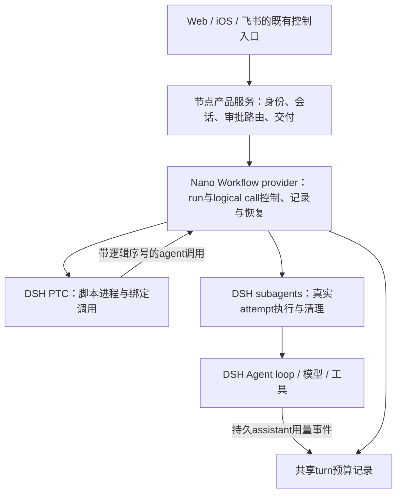

# refactor-581：保留 Workflow 控制能力的接入设计

> 2026-10-09，正式设计的Workflow详述，Q22—Q24修订已随整套设计通过独立Round 3复审。用户明确保留暂停／继续、指定运行中子任务重启、完成前缀复用、同 turn 父子共享 output-token预算。基线：Nano `4915c44c`、DSH `5badb150`。
>
> 本文是Workflow接入的设计权威位置。[能力地图](capability-plugin-map.md) 解释现有差距；[整体计划](migration-plan.md) 维护工作依赖；语言已确定JavaScript，命名复用与一层嵌套已确认保留。[产品决定](pending-decisions.md) 记录已确定的Auto规则及其他产品选择；原问题10转为具体运行边界工程核查；原有子任务审批路由直接补迁。本文与design.md一并通过独立审查，见[审查记录](design-review.md)。

## 1. 设计结论

**保留 Nano 的 Workflow 控制语义，复用 DSH 的实际 Agent执行。** 缺口位于“脚本的一次逻辑调用怎样派发、替换、持久化及重放”，不需要另写模型循环、child provider或基础工具。

推荐以一个 Nano Workflow provider 承载这些已确认语义，使用 DSH公开 `WorkflowEngine` 服务边界、`PtcRuntime` 程序执行与 `SubagentRuntime` child执行。产品侧仍使用一个 Workflow控制入口和一套持久记录。公开 stock `WorkflowRun`只有 `result/cancel/dispose`，观察事件无法拦住派发或替换脚本已经等待的结果，因此不能称为“套一层薄包装即可”。[D1][D2][D3]

这会让 Nano 维护一段 Workflow host/guest逻辑。按Nano已确认的控制契约实现自己的host/guest，通过公开WorkflowEngine/PTC/subagents组合；以固定版本`workflow-ptc`行为作为parallel/pipeline和值传递规则参考，不维护复制改写的上游实现；不能为了省去这段维护而暗中失去用户已选择的能力。插件数量不由内部模块数决定，此处可以作为同一 Nano bundle中的一个 provider。

## 2. 两条路线与选择理由

| 路线 | 需要改变的实际位置 | 成本与适用性 |
|---|---|---|
| A：给上游增加 effect-controller扩展点 | Workflow请求/控制契约；engine注入；guest→host传递逻辑序号；host派发与结果等待；budget binding和progress类型 | 未采用；Q22明确禁止本项目维护上游补丁，不能作为实施回退路线 |
| B：Nano自有 Workflow provider（推荐） | 自有host逻辑调用控制、guest helpers、持久记录及产品工具consumer；依赖DSH公开PTC/subagents/session服务 | 发布不依赖上游先接受改动，保持Agent执行原语复用；代价是维护明确的一段Workflow实现，而非仅几个事件映射 |

不采用伪造 `SubagentRun` 身份的办法把多个attempt藏成一个child。DSH的本地run ID和localAgent应指向真实child session；Nano逻辑call ID是另一层身份。[D4]

选择B不要求以后同时维护A。若上游出现稳定、足够的effect接口，再用其替换自有派发实现；本次不建设双引擎运行平台。用户已确定脚本语言采用DSH的JavaScript，使用Node PTC路线，不另维护受限Python Workflow执行器。现用旧脚本按任务效果转换，原件作为档案保留。

## 3. 责任和依赖



节点决定谁能启动和控制哪次运行、原消息归属、审批答复及最终向何处交付。Workflow provider隐藏派发gate、attempt替换、前缀记录和查询。DSH持有实际child session、工具执行、模型请求及PTC进程。各处不重复拥有同一个状态机。

调用身份至少区分：产品 `inputId`、父DSH session/turn、Workflow `runId`、逻辑 `callId/startOrdinal`、真实 `attemptId/childSessionId`。一次重启改变attempt，不改变逻辑call；一次显式前缀恢复创建新run，并记录 `resumedFrom`。

## 4. 对消费者保持小接口

以下是拟议Nano产品接口，不是宣称DSH已有这些方法：

```ts
launch({ parentBinding, script, args, resumeFromRunId? }): RunSnapshot
read({ parentBinding, runId }): RunSnapshot
control({ parentBinding, runId, action, callId? }): RunSnapshot
// action: pause | resume | stop | restart_child
```

`parentBinding`由可信产品上下文解析，包含实际parent Agent、输入归属和budget引用，模型不能自行填写另一个owner或预算owner。`restart_child`要求一个仍在运行的call。`resume`对live paused run继续派发，对已终态记录通过launch新建run。外部接口不返回原生child对象或PTC进程对象。

provider遵守公开 `WorkflowEngine.start()`、`WorkflowRun.result/cancel/dispose()`的基础契约；Nano消费者的恢复/查询/控制使用自己的公开服务方法，不能把额外字段偷偷塞进DSH已定义的请求再假定stock支持。stock与Nano的Workflow工具不同时注册给同一个Agent，避免两条拥有不同保证的启动路径。

## 5. 四项能力的实现规则

### 5.1 暂停和继续

一个live run持有派发gate。在脚本请求child、取得并发额度之后，实际调用 `subagents.start()`之前检查gate和预算。暂停关闭gate并更新快照；已有child可以收口。继续打开同一个gate，脚本promise继续等待／派发。整run停止必须唤醒gate上的等待并收拢child，不把它们留在永远paused状态。[N1]

暂停不序列化任意JS/Python栈。进程退出后，原live执行已结束，后续通过已持久结果前缀重新执行脚本。不得在UI把这两种恢复显示成同一件事。

### 5.2 指定运行中子任务重启

host为一个logical call持有稳定的result promise和当前attempt。重启先在该call上接受替换，再取消并等待旧attempt清理，然后通过公开 `subagents.start()`启动replacement。旧attempt的迟到结果仍可作为诊断，但不能结算当前logical promise；脚本最终收到replacement结果。[D3][D4]

同一call的result只结算一次，快照展示该call下的attempt变化和真实child session。停止整个run优先于尚未完成的替换，不能取消后又派发replacement。旧attempt已做的文件/外发副作用不会因重启被撤销，原产品投递身份与回执边界继续生效。

### 5.3 同会话完成前缀复用

恢复校验parent session归属，默认载入原script、args和记录；调用方提供修改后的script/args时，以新输入执行并逐调用比较原前缀。恢复新建run后重新执行脚本。每次逻辑 `agent()`在等待并发额度前取得开始序号，显式传给host；不能用stock host的实际启动编号冒充它。[D5]

记录key由前一个key、当前prompt和规范化行为选项形成链。label/phase是展示信息，不使结果失效；模型、schema等影响行为的选项进入比较。只有当前开始序号匹配且已完成的连续前缀可复用；遇到第一个变化、不完整或缺失call后，本次运行后续全部实时执行。[N2]

复用值必须在交给脚本前已持久化。命中不创建真实child，并按原完成序号释放并发结果，使pipeline的后续控制流与原运行一致。快照明确 `replayed`，不伪造一次新child执行或新增token消费。

同一parent session的终态记录在进程重启后仍可显式恢复；跨parent session拒绝。已确定旧Python脚本转JavaScript，旧Python历史run不纳入兼容转换；本机制面向新DSH运行记录，不增加旧档案恢复门槛。

### 5.4 父子共享 output-token预算

产品为可信人工逻辑轮次建立一个budget记录（fallback多个DSH原生turn仍映射同一logicalRun/budget），同一turn发起的Workflow持有同一个budget ID。父模型和这些Workflow child的真实output用量进入同一记录，包含被restart的旧attempt；缓存重放不再次计费。后续人工turn不能无意接管前一turn仍在运行的后台工作预算。[N3]

派发gate通过后、实际启动child前再检查余额。余额耗尽拒绝新派发，已运行请求可以收口；这延续现有target语义，不声称是绝不超出的流式计费硬上限。没有target时保持无限制。[N1][N3]

用量从DSH持久 `assistant/message` / `assistant/attempt` settlement中提取该attempt最后一份usage，以session事件身份避免重复处理；沿用DSH fold的attempt替换/retry分界规则，事件去重不能替代这些规则。不同时累计stream样本和最终消息，不把重试样本漏掉。完整turn的 `deriveTurnTokenUsage()`只用于结束后核对，不能等待整个parent turn结束才释放共享余额。[D6][D8]

PTC binding是异步、无损JSON接口。JS方案建议 `await budget.spent()` / `await budget.remaining()`，无target通过JSON的 `null`表达，脚本端可以呈现无上限；不将Infinity跨JSON传输，也不为保留Python同步写法新增共享内存协议。[D7]

### 5.5 已确认保留：命名复用与一层嵌套

在同一个Workflow provider旁维护命名catalog，复用当前项目/个人发现顺序、最近项目定义优先和结构化args调用；内置/命名空间定义进入同一启动入口。保存的是JavaScript脚本及元数据，不需要另一个语言执行器或第二套调度器。保存位置与原有symlink约束沿用current契约，具体扩展名与metadata装载按JS入口适配。[N1]

脚本可调用保存、内置或path引用的子Workflow并等待结果。嵌套只允许一层，共享父运行的并发额度、总Agent数、停止信号和budget ID，逻辑调用使用同一全局开始/完成序号空间。嵌套不能绕开pause gate或前缀比较，也不为子流程重复记账；子流程再嵌套明确拒绝。取消和恢复仍由同一个run控制owner协调。[N1]

验收增加命名保存/发现/传参、同名覆盖、一层嵌套返回值、共享限额/停止/预算及拒绝第二层；脚本改变子流程调用时，沿既有逻辑调用前缀规则比较，不因命名相同就无条件复用结果。

Workflow是常规工具，不新增Feature开关；工具选择按终态架构§5.5控制新调用准入。取消选择不删除保存定义和完成前缀，稳定provider下已接受run的查询/停止与终态交付按既有契约保留，结束后清理。

## 6. 持久化和完成交付

沿用节点对Workflow记录的单一owner，使用一份按run组织的持久记录和可重建快照，避免再建中心调度数据库。最少保存：script/args、parent与input归属、状态、resumedFrom、call key与开始/完成序号、attempt身份、结果/错误、用量来源及完成交付身份。

对于可复用结果，先持久化再释放给脚本；对于最终结果，先持久化再向产品请求交付。记录成功不等于渠道送达，交付继续走已有product ledger。DSH stock `workflow/end`不带最终value，因此自有consumer直接接 `WorkflowRun.result`，不能依赖该观察事件恢复丢失结果。[D1][D2]

进程重启后，记录中的旧running/paused没有live handle就应显示中断，不伪造仍在运行；已持久的终态和结果保留可查。恢复不是自动重放所有副作用，仍由用户明确恢复及原前缀规则决定哪些Agent重新执行。

## 7. 有限的实施切片与退出证据

| 切片 | 必须看到的结果 |
|---|---|
| 控制骨架 | 原生child能执行；pause后不新派发，已有child可完成；resume可继续；stop唤醒所有等待并完成清理 |
| logical call与attempt | 对正在运行的选中child重启，旧attempt结束，新attempt结果交给原promise；迟到旧结果不覆盖；UI仍是一项call |
| 持久前缀 | 相同脚本命中、改中间调用从该点重跑、只改label/phase仍命中、并发完成序保持；新进程打开同parent后显式恢复终态记录；跨parent拒绝 |
| 共享预算 | 父子/多个Workflow/替换attempt共同累计，重放不重复累计；耗尽不启动新child；无target不加上限；provider重试usage不丢不重 |
| 产品与后台 | 既有控制入口映射到唯一owner；原子任务审批路由补迁；风险政策按问题6；最终结果持久后再交付；断线/重启后状态可解释 |

测试先覆盖纯控制与key比较，再用真实DSH child/PTC进程验证取消和清理，最后走Web/原生iOS/飞书控制与交付旅程。真实parallel与pipeline仍需证明并发和值传递。当前是源码和设计证据，未运行以上验收。

## 8. 已收口的产品边界

脚本语言已确定为JavaScript，问题2a/2b已确认保留命名复用与一层嵌套。原Workflow子任务审批直接补迁，问题6已确认默认Nano规则并支持配置切换DSH规则，原问题10的A/B问法已撤销，脚本执行边界按原生接入做具体核查；所有产品选择已收口。本文已纳入整个迁移设计的正式Gate 2，结论见design-review.md。

2026-10-09 已由独立Agent对公开接口、四项语义和待定边界做一次有界技术复核，未发现阻断问题；已采纳恢复输入默认/覆盖及token accounting出处两项表述修正。此结论只覆盖本文技术草案，不代替整个迁移设计的Gate 2或实现验收。

[N1]: ../../../archive/pre-dsh-581/kernel/workflows.md
[N2]: https://github.com/Mrchen116/nano-multiagent/blob/4915c44cb7f7b829414a19087877ad9b73d69ea1/src/agent/core/workflows/resume.py
[N3]: https://github.com/Mrchen116/nano-multiagent/blob/4915c44cb7f7b829414a19087877ad9b73d69ea1/src/agent/core/workflows/activation.py
[D1]: https://github.com/deepseek-ai/deepseek-harness/blob/5badb15009ae1756c3afe0ae0cef1faafc290ccc/packages/workflow/workflow/src/runtime-types.ts
[D2]: https://github.com/deepseek-ai/deepseek-harness/blob/5badb15009ae1756c3afe0ae0cef1faafc290ccc/packages/workflow/workflow/src/index.ts
[D3]: https://github.com/deepseek-ai/deepseek-harness/blob/5badb15009ae1756c3afe0ae0cef1faafc290ccc/packages/workflow/workflow-ptc/src/host.ts
[D4]: https://github.com/deepseek-ai/deepseek-harness/blob/5badb15009ae1756c3afe0ae0cef1faafc290ccc/packages/subagent/subagent/src/types.ts
[D5]: https://github.com/deepseek-ai/deepseek-harness/blob/5badb15009ae1756c3afe0ae0cef1faafc290ccc/packages/workflow/workflow-ptc/src/runtime.ts
[D6]: https://github.com/deepseek-ai/deepseek-harness/blob/5badb15009ae1756c3afe0ae0cef1faafc290ccc/packages/llm/token-meter/src/usage-projection.ts
[D7]: https://github.com/deepseek-ai/deepseek-harness/blob/5badb15009ae1756c3afe0ae0cef1faafc290ccc/packages/ptc-runtime/ptc-runtime/src/types.ts
[D8]: https://github.com/deepseek-ai/deepseek-harness/blob/5badb15009ae1756c3afe0ae0cef1faafc290ccc/packages/llm/token-meter/src/turn-usage.ts
