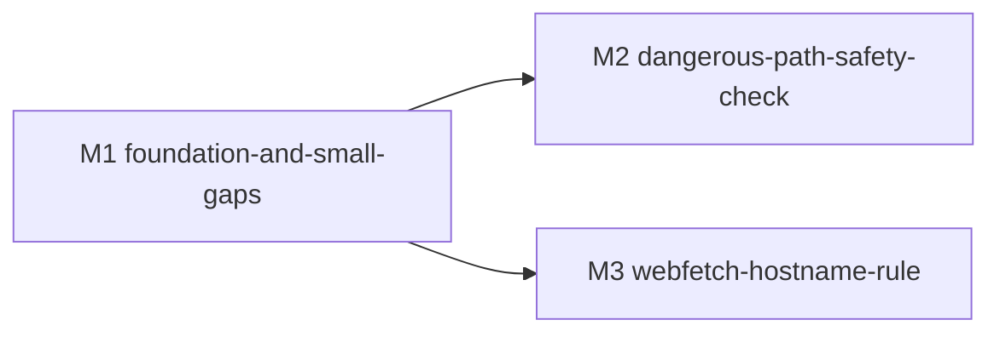

# bugfix-355: agent Read 工具读工作区外路径被硬错 — 技术方案

> 对齐: incident.md v1 + audit-vs-cc.md(refactor-353 ↔ CC 对照事实基础)

> Unit branch: `unit/bugfix-355-read-workspace-outside-rejected` (will be created by orchestrator)

## Changelog

<!-- 按时间倒序追加。格式:YYYY-MM-DD (Mx): 一句话 — 详见 Mx/progress.md -->

## 现状分析

### 涉及范围

| 路径 | 当前职责 | 本 unit 操作 |
|---|---|---|
| `src/agent/platform/tools/safety.py:269-325` | `resolve_path`(write,只 normalize)/ `resolve_read_path`(read,工作区外硬 raise)/ `normalize_path` | 改 `resolve_read_path` — 移除工作区边界检查,只 normalize |
| `src/agent/platform/tools/builtins/read.py:53` | 调 `resolve_read_path` 在 tool body 入口做边界 | 跟随 safety 变更调整调用形态 |
| `src/agent/platform/hooks/builtins/auto_mode_gate.py` | 统一权限 gate hook,含 dangerously bypass / SAFE_TOOL_ALLOWLIST 短路 / bash check_command_policy / classifier / deny-limit / ask flow | **主改动**:集成 tool 级 check_permissions dispatch(D1)+ 处理 safety_check 类 bypass-immune(W1 协同);移除 OUTSIDE NOTE(W2);从 SAFE_TOOL_ALLOWLIST 移除 `web_fetch` / `web_search`(S1/S2);**`agent` 保留**(D2 决:对齐 CC 外部用户行为,S3 不算 gap) |
| `src/agent/core/tools/base.py`(Tool 协议) | Tool 协议定义 | **新增** `check_permissions(input, ctx)` 可选方法(D1 选 B 后新增) |
| `src/agent/platform/tools/builtins/web_fetch.py` | WebFetch 工具实现,无工具级权限检查 | **大改**:实现 `check_permissions`,含 preapproved host 表 + hostname rule 引擎(S1) |
| `src/agent/products/personal_assistant/tools/web_search.py` | personal_assistant 产品级 WebSearch,无工具级权限检查 | **不动产品代码**(D3 决:core 协议默认 passthrough,WebSearch 继承默认即等价 CC `WebSearchTool.ts:101-114`);只需在 `auto_mode_gate.py` 的 SAFE_TOOL_ALLOWLIST 移除 `web_search`,落到 classifier 路径 |
| `docs/changes/refactor-353-unify-path-sandbox/spec.md` + `design.md` | refactor-353 原始文档 | 加 corrigendum 注释(段末)+ Changelog 行(底部索引),双保险(D6 决) |
| **新增** `src/agent/platform/permissions/hostname_rules.py` | 不存在 | 新建 `HostnameRuleEngine` 类(D4.2 决)|
| **新增** `src/agent/platform/tools/dangerous_paths.py` | 不存在 | 新建 `DANGEROUS_FILES` + `DANGEROUS_DIRECTORIES` 常量 + `check_dangerous_path` 函数(D5 决) |
| **新增** `src/agent/platform/tools/builtins/webfetch_preapproved.py` | 不存在 | 新建 `PREAPPROVED_HOSTS` frozenset,166 项,与 CC `preapproved.ts` 逐字一致(D4.1 决) |
| `src/agent/platform/tools/builtins/write.py` | WriteTool,无工具级权限检查 | 加 `check_permissions` 调 `check_dangerous_path`(D5 决) |
| `src/agent/platform/tools/builtins/edit.py` | EditTool,无工具级权限检查 | 加 `check_permissions` 调 `check_dangerous_path`(D5 决) |
| `src/agent/platform/permissions/broker.py` | `PermissionDecision` 等数据结构 | 扩展 `PermissionResult` 含 `decision_reason` 字段(接口与数据流段) |
| `src/agent/platform/config/auto_mode.py` | `AutoModeConfig` | 新增 `web_fetch` 子段(`preapproved_hosts_extra` / `deny_hosts` / `ask_hosts` / `allow_hosts`)|

### 既有约束

1. **依赖方向硬规则**:`platform → core + products`(单向),`core` 不依赖 `platform` / `products`。tool 级 `check_permissions` 接口加在 `core/tools/base.py`(Tool 协议);具体实现可在 platform/products 层
2. **权限决策入口集中**(refactor-353 之后):所有权限判断从 `auto_mode_gate.py on_tool_call` hook 进。引入 tool 级 checkPermissions 后,hook 仍是入口,只是在分类器决策前先调 tool.check_permissions
3. **broker**(`permissions/broker.py`)管 ask future / deny-count / session-allowlist,新增 tool-level ask 决策可以直接复用,无需新增基础设施
4. **AutoModeConfig**(`config/auto_mode.py`)支持工作区 / 全局两级 YAML 配置,新增配置(preapproved host 表、危险目录清单)可以扩展同一份 config
5. **Tool 协议现状**:`core/tools/base.py` 的 ToolProtocol 没有 `check_permissions` 字段;现有工具(ReadTool / WriteTool / WebFetch 等)都不持有权限逻辑

### 可复用能力

| 能力 | 怎么用 | 备注 |
|---|---|---|
| `auto_mode_gate.py` 主流程 | tool.check_permissions 在 dangerously 短路前调用(D1 + W1):返回 ask + `safety_check` 标记的让 dangerously 仍 ask;其他 check_permissions 结果在 SAFE_TOOL_ALLOWLIST 后分发 | 改动点集中,易测 |
| `broker.register_request` / `_handle_ask` | tool.check_permissions 返回 `ask` 时,hook 调 broker 走 ask flow | 复用现成,不新建 ask 基础设施 |
| `AutoModeConfig` YAML 配置 | preapproved host 表、危险目录清单都新增 config 字段(workspace > global > default 三级合并) | 用户可在 workspace `config.yaml` 覆盖默认值 |
| 现有 SAFE_TOOL_ALLOWLIST 短路 | 命中的工具继续直接 allow(Read / task 系 / send_message 不动) | 注意:web_fetch / web_search 从该 set 移除后,会落到 tool.check_permissions 路径 |

### 相关历史

- **refactor-353-unify-path-sandbox**(已 merge,2026-05-15):本 unit 的直接前置 — 引入 `auto_mode_gate` 统一 path sandbox,write 已经移到 hook 决策,read 留在 safety 层硬错(决策 2)。本 unit 修正其 spec.md Q1 + design.md 决策 2 的不一致(R2),并补齐 R1/W1/W2/S1/S2/(可能 S3)
- **feat-333-auto-mode-classifier**(更早,已 merge):引入 auto mode + yolo classifier。本 unit 沿用,不动 classifier 路径
- **CC 源码对照**:本 unit 的事实基础在 `audit-vs-cc.md`,逐条标了 CC 源码引用

## 架构总览

### Before(refactor-353 现状)

```
agent 发起 tool_call
  ↓
auto_mode_gate.on_tool_call (hook)
  ├── dangerously_skip_permissions? → return None (放行,但 tool 内部 safety 可能仍 raise)
  ├── session_allowlist 命中? → return None
  ├── SAFE_TOOL_ALLOWLIST 命中? → return None
  ├── bash check_command_policy → allow / deny / review
  ├── (write/edit outside workspace) classifier prompt 加 NOTE
  ├── yolo classifier → allow/deny/ask
  └── ask flow → broker
  ↓
tool body 执行
  └── (read 工具内) safety.resolve_read_path → workspace 外硬 raise ❌
```

### After(本 unit 修复)

```
agent 发起 tool_call
  ↓
auto_mode_gate.on_tool_call (hook)
  ├── [D1 + W1 新增] tool.check_permissions(input, ctx) → allow / deny / ask / passthrough
  │     ├── WriteTool / EditTool 命中危险路径 → ask + decision_reason.type='safety_check'(W1)
  │     ├── WebFetch: preapproved host → allow;hostname rule → allow / deny / ask(S1)
  │     ├── WebSearch: passthrough(委托后续流程)(S2 — 不动产品代码,落回 classifier)
  │     └── (其他工具不实现 → passthrough)
  │   若返回 ask + safety_check 标记 → safety_locked = True
  ├── dangerously_skip_permissions?
  │     ├── safety_locked → 仍走 broker ask(bypass-immune,即 W1 的 "dangerously 下危险目录仍 ask")
  │     └── !safety_locked → return None(真 bypass,tool 不再硬 raise)
  ├── session_allowlist 命中? → return None
  ├── SAFE_TOOL_ALLOWLIST 命中?(已移除 web_fetch / web_search;read / task 系 / agent / send_message 仍在)→ return None
  ├── 按 check_permissions 返回值分发:
  │     ├── allow → 直接 allow
  │     ├── deny → 直接 deny
  │     ├── ask(非 safety_check)→ broker ask flow
  │     └── passthrough → 继续 bash policy / classifier
  ├── bash check_command_policy → allow / deny / review
  ├── [W2 移除] (write/edit outside) — 不再加 OUTSIDE NOTE
  ├── yolo classifier → allow / deny / ask
  └── ask flow → broker
  ↓
tool body 执行
  └── [R1] read 工具:safety.resolve_read_path 不再硬 raise,只 normalize ✓
```

关键变化:
- **tool 级 checkPermissions**(D1 选 B):Tool 协议加可选 `check_permissions`;hook 在 SAFE_TOOL_ALLOWLIST 之后、bash policy 之前调用工具自己的 check_permissions
- **dangerously 真 bypass**(R1+W1):dangerously 下 tool 内部不再硬 raise(read 也跟着不 raise);但危险目录的 write/edit 仍要 ask(W1 `safety_check`)
- **classifier 输入 pure**(W2):不再加 OUTSIDE NOTE,classifier 凭 system prompt 自判
- **safe-allowlist 精简**(S1/S2):web_fetch / web_search 移到各自 check_permissions

## 关键决策

### 决策 D1: 引入 tool 级 check_permissions 接口(选 B)

- **选择**: Tool 协议(`core/tools/base.py`)新增可选 `check_permissions(input, ctx) -> PermissionResult` 方法;`auto_mode_gate` 在 SAFE_TOOL_ALLOWLIST 检查后、bash policy 之前调用工具自己的 check_permissions
- **理由**: 对齐 CC 架构(`AgentTool.tsx:1692` / `WebFetchTool.ts:104` / `WebSearchTool.ts:101` 都自持 checkPermissions);未来工具特异权限逻辑有标准接入点,不堆在 hook 文件;返回 passthrough 时落回 classifier,跟 CC `permissions.ts:1299-1310` passthrough→ask 语义一致
- **拒绝**: A. 集中在 hook 层 — 短期改动小,但 hook 文件会随工具数量线性膨胀,且每加一个工具特异规则都要碰中央文件,长期维护成本高
- **风险**:
  - Tool 协议加可选方法,所有现有工具默认行为是 passthrough(等价不实现),无回归压力
  - hook 拿到 tool 实例的方式需要约定:目前 hook 只拿 `tool_name` 字符串,新增"按 name 查 tool 实例"的接口(可走 ToolRegistry)

### 决策 D2: AgentTool 对齐 CC 外部用户行为(S3 出范围)

- **选择**: AgentTool 维持现状(留在 SAFE_TOOL_ALLOWLIST,所有 mode 都直接 allow),不实现 `check_permissions`。S3 **不算 gap**,从本期范围移除。
- **理由**:
  - CC 源码核实(`AgentTool.tsx:1672-1709`):外部 build 的 AgentTool 默认 allow;`USER_TYPE === 'ant' && mode === 'auto'` 才走 classifier;`process.env.USER_TYPE === 'ant'` guard 注释明确写 "enables dead code elimination for external builds",外部用户根本不存在那条分支
  - `AgentTool.tsx:1672-1673` 注释 `isReadOnly() return true // delegates permission checks to its underlying tools` — CC 的设计哲学是"派子 agent 这一步本身不检查,子 agent 跑的每个 tool call 再次过 gate",权限是底层工具兜底
  - Q4 "完全对标 CC" 的自然语义就是外部用户视角(开源默认行为);Ant 内部行为是 Anthropic 内部 dogfood + 持续训练 yolo classifier 的特殊语境,不在外部产品诉求里
- **拒绝**:
  - B(Ant 内部行为)— 每次派子 agent 多 1-3s classifier round-trip,personal_assistant 对话场景不可接受;且本仓 classifier 是 CC pixel-perfect 复刻,无自家训练循环,采集的数据没出口
  - C(feature flag)— 引入 config 项 + 切换分支,徒增维护面;真有"高安全姿态"诉求时单独立 unit 再加 flag,不在本期范围
- **风险**: 失去"prompt-injection 二阶链路"防御(父 agent 把不被 classifier allow 的指令包装成子任务派出去)。可接受 — 子 agent 自己跑 tool call 会重新过 gate,bash / write 等高危工具的拦截不依赖父级 AgentTool

### 决策 D3: Tool 协议 `check_permissions` 默认实现为 passthrough

- **选择**: `core/tools/base.py` 的 Tool 协议加可选 `check_permissions(input, ctx) -> PermissionResult`,**默认行为**(未实现)等价返回 `behavior='passthrough'`。WebSearch / 其他绝大多数工具都不实现 — 不实现即 passthrough。
- **理由**:
  - CC `permissions.ts:1210-1213` 的语义就是"工具不实现 checkPermissions 等于 passthrough"(`toolPermissionResult` 初始化为 `{behavior: 'passthrough'}`,tool 不 override 就保留这个值)— core 协议默认 passthrough 跟 CC 完全对齐
  - 绝大多数工具不需要工具级权限(read / bash / write / edit / memory / skill_manage / agent / task 系 / send_message),默认 passthrough 让"不实现"成为合理的零工作量路径
  - WebSearch 在本仓**根本不用动产品工具代码** — 继承 core 默认 passthrough,行为跟 CC `WebSearchTool.ts:101-114` 等价
  - WebFetch 是少数需要 override 的(D4 决定其内部逻辑)
- **拒绝**:
  - A(每个产品工具显式声明 passthrough)— 大量样板代码,语义噪声大
  - B(抽 PassthroughMixin)— 中间层 indirection 没有实际收益
- **风险**: 无;passthrough 在 hook 层处理为"落到下一个分支"(classifier / safe-allowlist / 默认 ask 等),语义跟 CC 一致

### 决策 D4: WebFetch preapproved host 表 + hostname rule 引擎

#### D4.1: PREAPPROVED_HOSTS 数据来源 = 抄 CC 166 行常量

- **选择**: 抄 CC `preapproved.ts` 的全部 166 行清单,落成本仓 `src/agent/platform/tools/builtins/webfetch_preapproved.py`(或同等位置)的 frozenset 常量。用户可在 workspace `auto_mode.web_fetch.preapproved_hosts_extra` 扩展。
- **理由**: Q4 "完全对标 CC";CC 的清单是 Anthropic 维护的"开发文档白名单",精简等于自己重判;后续 CC 更新清单时本仓可同步(diff 友好)。
- **拒绝**: B(精简版)— 自作主张;C(空默认全交用户)— 失去"开箱即用"
- **风险**: CC 清单偶尔加入跟我们语境无关的域名(如某些区域语言文档),无害,可接受

#### D4.2: hostname rule 引擎 = 抽 HostnameRuleEngine 中间方案

- **选择**: 抽一个 `HostnameRuleEngine` 类(放 `platform/permissions/hostname_rules.py` 或同等位置),接口干净(`evaluate(hostname) -> "allow" | "deny" | "ask" | "passthrough"`),内部实现简单(读 `auto_mode_config.web_fetch.deny_hosts / ask_hosts / allow_hosts` 三个 list 逐个 hostname 匹配)。WebFetch 的 `check_permissions` 调用该引擎。
- **理由**: 抽象成本不高(就一个类,3 个 list 查询),为后续真有"按 hostname 决策"的工具(如未来新增 url-based 工具)留扩展点;接口干净比直接在 WebFetch 内联 list 检查更容易测
- **拒绝**:
  - A(完整复刻 CC rule 引擎,含 deny/ask/allow 三层 + 来源跟踪 + suggestions)— 工作量爆炸,本期只一个工具用,over-engineering
  - B(WebFetch 内联 3 个 list 检查)— 工程上等价但抽象层缺失,后续扩展要回头改 WebFetch
- **风险**:
  - YAGNI 警告:抽象成本不高但仍可能"真没有第二个工具用"。可接受 — 接口干净时撤回到 inline 也容易
  - `HostnameRuleEngine` 的 hostname 匹配规则(精确 vs 通配 vs subdomain)需要在实施时明确(本期推荐:CC `preapproved.ts` 的匹配方式 — exact host + path prefix;user-config rules 暂只支持 exact host,后续再扩)

### 决策 D5: 危险目录保护(W1)

#### D5.1: 落点 = tool.check_permissions 路径(对齐 CC safetyCheck)

- **选择**: WriteTool / EditTool 在自己的 `check_permissions` 里检查 `file_path` 是否落在危险目录 / 危险文件,命中则返回 `behavior='ask'` + `decision_reason={'type': 'safety_check', ...}`。`auto_mode_gate` 在 dangerously 短路前看到 ask + `safety_check` 就**保留 ask**(不 bypass)。
- **理由**:
  - 跟 D1 引入的 tool 级 check_permissions 架构一致;CC `permissions.ts:1252-1260` "step 1g" 就是这种"tool 自己声明 safetyCheck,bypass-immune"的语义
  - WriteTool / EditTool 已经持有 `file_path` 输入,在 check_permissions 内做 path 匹配零额外信息成本
  - 危险目录清单 + 检查逻辑放在 `platform/tools/dangerous_paths.py`(新文件),不污染 `auto_mode_gate.py`
- **拒绝**:
  - A(auto_mode_gate 内部新分支)— 改动直接但跟 D1 的 tool 级架构脱节
  - B(单独建 hook)— 引入新 hook 文件,优先级管理复杂
- **风险**: tool.check_permissions 必须真的实现 — WriteTool / EditTool 都得 override,**漏写就失守**。design 阶段把这条作为 milestone 退出标准 + 单测要求

#### D5.2: 危险目录 / 危险文件清单(按本仓裁剪)

**DANGEROUS_FILES**(8 项):

```
.gitconfig, .gitmodules, .bashrc, .bash_profile, .zshrc, .zprofile, .profile, .mcp.json
```

(CC 10 项中**去掉** `.ripgreprc`(本仓没用 ripgrep)、`.claude.json`(CC 主程序配置文件,本仓无))

**DANGEROUS_DIRECTORIES**(6 项):

```
.git, .vscode, .idea, .claude, .nanocode, .nano-assistant
```

(CC 4 项全保留 + **新增** `.nanocode` / `.nano-assistant` — 本仓 AGENTS.md 声明的两个自家配置目录,prompt-injection 持久后门攻击面)

- **理由**:
  - CC 清单是底线(防 shell 启动 hook + git/IDE 配置劫持);本仓自家配置目录也属于持久化攻击面,必须加
  - `.vscode/.idea/.claude` 保留 — 用户即使本仓不直接用,也可能在工作目录有这些目录;裁掉就让 gap 进来
  - `.mcp.json` 保留 — 未来本仓如果集成 MCP,这条直接生效;无害保留
- **拒绝**:
  - 完整照抄 CC(10+4)— 含本仓无关项,失去裁剪意义
  - 更严(加 `~/.ssh` / `~/.aws` 等读敏感目录)— CC 的危险清单关注"写敏感",`~/.ssh/id_rsa` 写入不会自动执行;且这类清单永远不全,不是本期范围
- **风险**: 后续若本仓引入新工具 / 新配置目录,清单需要补;在 design.md 标注"清单维护跟随本仓配置目录演进"

### 决策 D6: refactor-353 文档修订(R2)= corrigendum 注释 + Changelog 索引(双保险)

- **选择**:
  - 在 `refactor-353-.../spec.md` Q1 段末追加 `> Corrigendum (2026-05-16, bugfix-355): ...`,说明 CC Read 实际行为是"auto mode 因 safe-allowlist allow / default mode 走 ask / bypass 模式覆盖 allow",**原段文字保留**
  - 在 `refactor-353-.../design.md` 决策 2 段末同样追加 corrigendum
  - 在两份文档的 Changelog 段加一行 `2026-05-16 (bugfix-355): spec.md Q1 / design.md 决策 2 与 CC 实际行为有不一致,corrigendum 已加,详见 docs/changes/bugfix-355-read-workspace-outside-rejected/audit-vs-cc.md`
- **理由**:
  - **历史可读性**:refactor-353 文档作为 unit 历史制品,记录的是当时判断 + 当时依据。后人翻 docs/changes/ 看到错判 + 旁标修正,比"看到正确但不知道有过错判"更有教训价值
  - corrigendum 紧挨原段,扫读正文的人也会看到(B 单独不够)
  - Changelog 行是底部索引,工具化检索 / git log 友好,跟 corrigendum 形成双保险
- **拒绝**:
  - B(只加 Changelog 不动正文)— 扫读正文的人会被误导
  - C(重写正文)— 失去错判历史,silent rewrite 不可审计
- **风险**: 无

## 接口与数据流

### 新增 Tool 协议字段(`core/tools/base.py`)

```python
# 现有 Tool 协议追加:
class Tool(Protocol):
    name: str
    # ... 现有字段 ...

    # 新增(可选):工具级权限检查
    def check_permissions(
        self,
        tool_input: Mapping[str, Any],
        ctx: ToolContext,
    ) -> PermissionResult:
        """Optionally inspect input and return a permission decision.

        Default behavior(协议未实现):等价 ``PermissionResult(behavior='passthrough')``。
        实现该方法的工具可以返回:
          - ``allow``:无条件放行(如 WebFetch 命中 preapproved host)
          - ``deny``:无条件拒绝(如命中 deny rule)
          - ``ask``:走 broker ask flow;若同时 ``decision_reason.type == 'safety_check'``,
                   则在 dangerously mode 下也保持 ask(bypass-immune)
          - ``passthrough``:不持有意见,委托后续 hook 层流程决策
        """
        ...
```

### `PermissionResult` 数据结构(`platform/permissions/broker.py`,扩展)

```python
@dataclass(frozen=True)
class PermissionResult:
    behavior: Literal["allow", "deny", "ask", "passthrough"]
    decision_reason: dict | None = None   # {"type": "safety_check" | "preapproved" | "rule" | ..., ...}
    reason: str = ""                      # 给用户看的文案
    updated_input: dict | None = None     # 允许工具改写输入(WebFetch 不用,留接口)
```

### `auto_mode_gate.on_tool_call` dispatch 顺序(改后)

```
入口
  ↓
1. [W1 新增] tool.check_permissions(input, ctx) 优先调用,捕获 safety_check 类 ask
   如果返回 behavior='ask' 且 decision_reason.type == 'safety_check' → 标记 safety_locked = True
2. dangerously_skip_permissions?
   - 否 → 继续 step 3
   - 是 + safety_locked → 仍然走 broker ask flow(bypass-immune)
   - 是 + !safety_locked → return None(真 bypass)
3. session_allowlist 命中? → return None
4. SAFE_TOOL_ALLOWLIST 命中?(已移除 web_fetch / web_search) → return None
5. tool.check_permissions 结果分发(已在 step 1 调用,这里只是按结果分发,不重调):
   - allow → 直接 allow
   - deny → 直接 deny
   - ask(非 safety_check)→ broker ask flow
   - passthrough → 继续 step 6
6. bash check_command_policy → allow / deny / review(review fall through)
7. [W2 移除] 不再加 OUTSIDE NOTE
   yolo classifier → allow / deny / ask
8. ask flow → broker
```

关键改动 vs 现状:
- **step 1 新增**:tool.check_permissions 在 dangerously 短路前调用,使 safety_check 类 ask 能 bypass-immune
- **step 4 调整**:SAFE_TOOL_ALLOWLIST 移除 `web_fetch` / `web_search`(保留 `read` / `task_*` / `agent` / `send_message`);具体工具列见 D2 决策
- **step 5 新增**:tool.check_permissions 非 safety_check 类结果按 behavior 分发
- **step 7 移除**:不再加 OUTSIDE NOTE 前缀

### `HostnameRuleEngine` 接口(`platform/permissions/hostname_rules.py`,新建)

```python
class HostnameRuleEngine:
    """评估 hostname 在 user-configured deny/ask/allow rule 下的归属。

    rules 来源:AutoModeConfig.web_fetch.deny_hosts / ask_hosts / allow_hosts
    """

    def __init__(self, deny: tuple[str, ...], ask: tuple[str, ...], allow: tuple[str, ...]) -> None: ...

    def evaluate(self, hostname: str) -> Literal["allow", "deny", "ask", "passthrough"]:
        """按 deny → ask → allow 优先级匹配 hostname。无匹配返回 passthrough。

        Hostname 匹配规则(本期):exact match(后续可扩 subdomain glob 等)。
        """
```

### `WebFetchTool.check_permissions` 决策链(`builtins/web_fetch.py`,改)

对齐 CC `WebFetchTool.ts:104-180`,本仓 5 个分支:

```
1. URL 解析失败 → PermissionResult(behavior='ask', reason='Invalid URL')
2. hostname + pathname 命中 PREAPPROVED_HOSTS → allow (reason='preapproved')
3. HostnameRuleEngine.evaluate(hostname) → deny/ask/allow 命中即返回
4. fallback → ask("permission not granted yet")
```

### `DANGEROUS_FILES` / `DANGEROUS_DIRECTORIES` 检查(`tools/dangerous_paths.py`,新建)

```python
def check_dangerous_path(file_path: str) -> bool:
    """Return True if path matches a known dangerous file or directory segment.

    Match rules:
      - 文件名(basename)精确匹配 DANGEROUS_FILES(case-insensitive)
      - 路径任一 segment 精确匹配 DANGEROUS_DIRECTORIES(case-insensitive)
      - 注意:`.claude/skills/` 等结构化子路径不命中(对照 CC 的 worktrees 例外)
    """
```

WriteTool / EditTool 的 `check_permissions`:

```python
def check_permissions(self, tool_input, ctx):
    file_path = tool_input.get("file_path", "")
    if check_dangerous_path(file_path):
        return PermissionResult(
            behavior="ask",
            decision_reason={"type": "safety_check", "matched_path": file_path},
            reason=f"Writing to {file_path} requires explicit confirmation (sensitive system file)",
        )
    return PermissionResult(behavior="passthrough")
```

### `AutoModeConfig` 扩展(`config/auto_mode.py`)

新增字段:

```yaml
auto_mode:
  # 现有字段 ...
  web_fetch:
    preapproved_hosts_extra: []   # 在 PREAPPROVED_HOSTS 之外,用户额外信任的 host
    deny_hosts: []                # 用户配置的 hostname deny 规则(精确匹配)
    ask_hosts: []                 # 用户配置的 hostname ask 规则
    allow_hosts: []               # 用户配置的 hostname allow 规则
```

## 实施细节锚点

> 本段是给 worker 的"避免猜测清单"。spec / 决策已定的细节,在此一次性钉死,让 worker 不用回头反复对照源码。

### 锚点 A: 现有 `Tool` 协议位置和签名(对应 G1)

文件:`src/agent/core/tools/base.py:50-83`

当前协议(原样):

```python
@runtime_checkable
class Tool(Protocol):
    name: str
    description: str
    input_schema: Mapping[str, Any]
    is_concurrency_safe: bool
    max_result_size_chars: int | None = None

    def is_concurrency_safe(self, args: Mapping[str, Any]) -> bool: ...
    def run(self, args: Mapping[str, Any], ctx: "ToolContext") -> Mapping[str, Any]: ...
    def serialize_result(self, output: Any, error: str | None = None) -> str | list[dict[str, Any]]: ...
```

本 unit 在 `Tool` Protocol 内追加(可选方法):

```python
    def check_permissions(self, tool_input: Mapping[str, Any], ctx: "ToolContext") -> "PermissionResult":
        """Default: return PermissionResult(behavior='passthrough'). Tools override to assert opinion."""
        ...
```

### 锚点 B: `check_permissions` 默认 passthrough 的实现方式(对应 G9)

不靠 `hasattr` 检查,**调用方在 `auto_mode_gate` 走 `getattr(tool, 'check_permissions', None)`**:

```python
check_fn = getattr(tool_instance, "check_permissions", None)
if check_fn is None:
    tool_result = PermissionResult(behavior="passthrough")
else:
    tool_result = check_fn(tool_input, ctx)
```

不在 `Tool` 基类提供默认实现 — Protocol 不强制方法存在,getattr fallback 比 ABC 默认更轻量,且不破坏现有工具(它们都没实现 check_permissions,自动得到 passthrough)。

### 锚点 C: hook 拿 tool 实例的路径(对应 G2)

现状:`auto_mode_gate.py` hook 拿到的是 `event["name"]`(tool_name 字符串),没有 tool 实例。

改法:**通过 `ctx.metadata["tool_registry"]` 注入 ToolRegistry**,在 hook 层用 `tool_registry.get(tool_name)` 拿实例:

- `agent/core/tools/registry.py` 已有 `ToolRegistry`,需要在 hook 派发时把 registry 引用塞进 HookContext.metadata(类似当前 `metadata["permission_broker"]`)
- `auto_mode_gate.on_tool_call` 内:`tool_registry = metadata.get("tool_registry"); tool = tool_registry.get(tool_name) if tool_registry else None`
- tool 是 None 时(测试 / 极端情况)等价 passthrough,保持 fail-open(权限 gate 自身故障不阻断业务)
- worker 顺手在 platform 装配处(agent 内核组装的入口,如 `agent/products/` 装配模块)把 registry 透传给 hook

### 锚点 D: `PermissionResult` 现有字段处理(对应 G3)

现状(`broker.py:55-62`):

```python
@dataclass(frozen=True)
class PermissionResult:    # 实际类名是 PermissionDecision,本 unit 不重命名
    behavior: Literal["allow", "deny", "ask"]
    reason: str = ""
    rule_source: str = ""
```

(*注:**类名是 `PermissionDecision`,不是 `PermissionResult`。design 前文为对齐 CC 命名简称用 `PermissionResult`,worker 实际改的是 `PermissionDecision`。*)

本 unit 改造:

1. `behavior` literal 加 `"passthrough"`:`Literal["allow", "deny", "ask", "passthrough"]`
2. 新增 `decision_reason: dict | None = None`(优先于 `rule_source`,语义更广)
3. **保留** `rule_source` 字段(向后兼容,现有 bash policy 等调用方仍用)— 不删,只 deprecate;新代码用 `decision_reason`
4. 新增 `updated_input: dict | None = None`(给 WebFetch 等可能改写 input 的工具留接口,本 unit 不真用)

现有调用方升级(只读 `behavior`,不读 reason/rule_source 的):无回归。
现有调用方读 `rule_source` 的:保留不动。
新代码统一用 `decision_reason`(含 `type` 字段:`safety_check` / `preapproved` / `hostname_rule` / `command_policy` 等)。

### 锚点 E: `safety.resolve_read_path` 删除 + `read.py:53` 改调(对应 G4)

`resolve_read_path` 函数从 safety.py **直接删除**(不留壳),包括关联的 `_read_allowed_roots` 私有函数(只被它调)。

`read.py:53` 现状:

```python
file_path = ctx.safety.resolve_read_path(raw_path, cwd=ctx.cwd, tool_name=self.name)
```

改为:

```python
file_path = ctx.safety.normalize_path(raw_path, cwd=ctx.cwd)
```

(`normalize_path` 签名 `(path: str, *, cwd: Path) -> Path`,不抛 ToolError,只做 expanduser + cwd join + resolve。read.py 后续 `if not file_path.exists()` 的 ToolError 仍然抛,行为不变。)

`is_path_in_workspace` 方法在 safety.py 保留(refactor-353 写工具仍需要,移除 `_detect_outside_workspace_path` 后**会变成只用于测试** — 让 worker 留一个 TODO 在 docstring 标注"目前只有测试代码用,工具迁移完成后可删")。

### 锚点 F: `_detect_outside_workspace_path` 整体删除(对应 G5)

`auto_mode_gate.py:638-671 _detect_outside_workspace_path` 函数 + 其在 dispatch 中的 2 处使用(`auto_mode_gate.py:722-724` 调用,`735` SAFE 守卫 `outside_workspace_path is None and ...`,`777-786` classifier prompt 加 NOTE)**全部删除**:

- 守卫(`735`)的语义"工作区外写工具不能走 safe-allowlist 短路" — 改后由 tool.check_permissions 路径处理(W1 safety_check / D1 dispatch);不再需要 hook 层路径检测守卫
- NOTE 加塞(`777-786`)— 直接删(W2)
- 调用(`722-724`)+ 函数定义(`638-671`)+ `_WRITE_TOOLS_WITH_PATH_INPUT` 常量(`631-635`)全删,不留残留

### 锚点 G: `check_dangerous_path` 输入规整(对应 G6)

函数签名 + 输入规整规则:

```python
def check_dangerous_path(file_path: str, *, cwd: Path | None = None) -> bool:
    """Return True if file_path resolves to a dangerous file or directory.

    Resolution rules:
      1. Path(file_path).expanduser()  — 展开 ~
      2. 若仍是相对路径且 cwd 给了 → cwd / path
      3. 不做 resolve()(避免 symlink 跨越文件系统;CC 也只在权限检查后期才 resolve);
         basename 和 parts 在未 resolve 的 absolute path 上做匹配
      4. basename(file_path).lower() 匹配 DANGEROUS_FILES(case-insensitive)
      5. file_path 任意 part(经 expanduser 后)lower() 匹配 DANGEROUS_DIRECTORIES
      6. 特殊例外:`.claude` 命中后,看后续 part 是否 'worktrees',是则跳过该 .claude(对照 CC AgentTool.tsx 注释 worktrees 例外)

    Args:
        file_path: 用户传入的 raw path,可能是 `~/.bashrc` / `.bashrc` / `/abs/path`
        cwd: 用于把相对路径变绝对的 base;None 时只处理 absolute / ~ 开头的 path
    """
```

WriteTool / EditTool 的 `check_permissions` 调用:`check_dangerous_path(file_path, cwd=ctx.cwd)`。

### 锚点 H: `PREAPPROVED_HOSTS` 实际项数 + isPreapprovedHost 复刻(对应 G7)

CC 实际数:

- `wc -l preapproved.ts` = 166 行(文件总行数,含注释)
- `PREAPPROVED_HOSTS` set 实际 **89 项**(用 `grep -c "^\s*'"` 数 string literal)
- 其中 **绝大多数是 hostname-only**(如 `docs.python.org`),**少数带 path prefix**(如 `github.com/anthropics`,`agentskills.io` 等)

本仓 `webfetch_preapproved.py` 必须:

1. `PREAPPROVED_HOSTS: frozenset[str]` 含**89 项**,与 CC `preapproved.ts:14-131` 逐字一致(case-sensitive)
2. 模块加载时分裂为两份(对应 CC `preapproved.ts:136-152`):
   - `HOSTNAME_ONLY: frozenset[str]` — 无 `/` 的项
   - `PATH_PREFIXES: dict[str, tuple[str, ...]]` — `hostname -> tuple of path prefixes`(每个 prefix 以 `/` 开头,如 `/anthropics`)
3. `is_preapproved_host(hostname: str, pathname: str) -> bool`:
   - 若 `hostname in HOSTNAME_ONLY` → True
   - 若 `hostname in PATH_PREFIXES`:遍历 prefix,`pathname == prefix or pathname.startswith(prefix + "/")` 任一为 True 即 True
   - 否则 False
   - **注意 path segment boundary**:`/anthropics` 必须不命中 `/anthropics-evil/malware`(用 `pathname.startswith(prefix + "/")` 强制 `/` 边界,对照 CC 注释)

### 锚点 I: `AutoModeConfig` 嵌套 `web_fetch` 配置的 parse(对应 G8)

新增 dataclass(`config/auto_mode.py`):

```python
@dataclass(frozen=True)
class WebFetchConfig:
    preapproved_hosts_extra: tuple[str, ...] = ()
    deny_hosts: tuple[str, ...] = ()
    ask_hosts: tuple[str, ...] = ()
    allow_hosts: tuple[str, ...] = ()


@dataclass(frozen=True)
class AutoModeConfig:
    # 现有字段全部不动 ...
    web_fetch: WebFetchConfig = field(default_factory=WebFetchConfig)   # 新增
```

`_parse_auto_mode_config` 内:

```python
web_fetch_section = raw.get("web_fetch", {})
if not isinstance(web_fetch_section, Mapping):
    web_fetch_section = {}
web_fetch = WebFetchConfig(
    preapproved_hosts_extra=_coerce_str_tuple(web_fetch_section.get("preapproved_hosts_extra"), ()),
    deny_hosts=_coerce_str_tuple(web_fetch_section.get("deny_hosts"), ()),
    ask_hosts=_coerce_str_tuple(web_fetch_section.get("ask_hosts"), ()),
    allow_hosts=_coerce_str_tuple(web_fetch_section.get("allow_hosts"), ()),
)
```

workspace > global merge:嵌套 dict 走 field-by-field 合并 — `_read_auto_mode_section` 返回的 dict 在 `merged.update(workspace_raw)` 时会**整体覆盖** `web_fetch` 子段(YAML 嵌套 dict 默认行为)。**这是简化处理**:用户若要部分覆盖某个 host list,workspace config 要显式列全要的 lists(本期不做深合并,docstring 写清)。

### 锚点 J: SAFE_TOOL_ALLOWLIST 命中工具的 check_permissions 调用零成本说明(对应 G10)

step 1(`tool.check_permissions` 调用)对所有工具都跑,看起来跟 SAFE_TOOL_ALLOWLIST step 4 短路有冗余 — 实际上:

- read / agent / task_* / send_message 都不实现 check_permissions → getattr fallback 返回 passthrough,**零计算开销**(就是一次 getattr + 一次对象创建)
- step 2-4 仍按现有顺序短路(safety_locked / dangerously / session_allowlist / SAFE_TOOL_ALLOWLIST)
- step 5(check_permissions 结果分发)只对 passthrough 之外的结果有意义;对 passthrough 直接 fall-through 到 step 6

短路语义未破坏,SAFE_TOOL_ALLOWLIST 仍是工具级 allowlist,只是顺序上"先调 check_permissions 拿 safety_check 标记,再做 mode/allowlist 决策"。

### 锚点 K: hostname normalize 规则(对应 G11)

`HostnameRuleEngine.evaluate(hostname)` 接收的 hostname 由 WebFetch 内部从 URL 提取后预 normalize:

```python
from urllib.parse import urlsplit
parsed = urlsplit(url)
hostname = (parsed.hostname or "").lower()   # 自动剥端口、lowercase
```

匹配仍是 exact match。**不做** strip www. / IDN punycode 转换(YAGNI,后续 unit 扩)。
用户在 config 配 `example.com` 时 fetch `www.example.com` **不命中** — docstring 写清。

### 锚点 L: `_handle_ask` 接收 safety_check ask 的调用(对应 G12)

`auto_mode_gate.py:549 _handle_ask` 现有签名:

```python
async def _handle_ask(ctx, tool_name, tool_input, reason, run_id, session_id, config, broker): ...
```

本 unit 改造:**保留签名不变**,broker 内部根据 `tool_input` 透传 decision_reason 到客户端 — 改动落在 broker.register_request 增加可选 `decision_reason: dict | None = None` 参数,broker 把它放进 `PermissionRequest` 数据结构传给 ask 卡片渲染层。

ask 卡片可以根据 `decision_reason.type == "safety_check"` 在 UI 上加红色警示标记(本 unit 不强制 UI 改动,留 hook)。
最低实现:`_handle_ask` 内调 `broker.register_request(request_id, run_id, decision_reason=tool_result.decision_reason if tool_result else None)`。

### 锚点 M: refactor-353 corrigendum 内容模板(对应 G13)

`refactor-353-.../spec.md` Q1 段末追加:

```markdown
> **Corrigendum (2026-05-16, bugfix-355)**: 本 Q1 答复"CC 也是这个口径"的判断错配。
> CC 实际 Read 行为按 mode 分支:
>   - `auto` mode → Read 在 `SAFE_YOLO_ALLOWLISTED_TOOLS`(`classifierDecision.ts:56-94`)
>     直接 allow,**不弹卡片不跑 classifier**
>   - `default` / `acceptEdits` mode → `checkReadPermissionForTool`(`filesystem.ts:1178-1193`)
>     工作区外 fallback 返回 ask,**弹卡片**
>   - `bypassPermissions` mode → 主流程 mode 维度短路 allow(`permissions.ts:1268-1281`),
>     **直接放行**;Read 在 bypass 下无危险目录保护
> 详见 `docs/changes/bugfix-355-read-workspace-outside-rejected/audit-vs-cc.md`
```

`refactor-353-.../design.md` 决策 2 段末追加:

```markdown
> **Corrigendum (2026-05-16, bugfix-355)**: 决策 2 "Reads don't go through the auto_mode_gate
> ask flow (default-allow), so the boundary check stays here as a guardrail" 与 CC 行为错配。
> CC 没有这种 "stays in safety as guardrail" 的设计 — auto 是 safe-allowlist 短路,bypass 是 mode
> 短路,两者都不经过 safety 层硬错。bugfix-355 删除 `resolve_read_path` 边界检查。
> 详见 `docs/changes/bugfix-355-.../audit-vs-cc.md` 及 `bugfix-355-.../design.md` 决策 D1。
```

两份文档 Changelog 段加一行(底部索引):

```markdown
- 2026-05-16 (bugfix-355): spec.md Q1 + design.md 决策 2 corrigendum 注释;原段保留,详见 docs/changes/bugfix-355-read-workspace-outside-rejected/audit-vs-cc.md
```

### 锚点 N: 新增单测文件路径约定(对应 G14)

| 新增模块 | 单测文件 |
|---|---|
| `platform/tools/dangerous_paths.py` | `tests/unit/agent/platform/tools/test_dangerous_paths.py` |
| `platform/permissions/hostname_rules.py` | `tests/unit/agent/platform/permissions/test_hostname_rules.py` |
| `platform/tools/builtins/webfetch_preapproved.py` | `tests/unit/agent/platform/tools/builtins/test_webfetch_preapproved.py` |

复用现有目录结构(`tests/unit/agent/{layer}/{module}/test_*.py`),不新建顶层目录。

### 锚点 O: 测试 mode 用的 workspace config 路径(对应 G15 / Reviewer 旅程)

> **Corrigendum (2026-05-16, bugfix-355-M4)**: 原 Anchor O 记录有误。
> `auto_mode_gate` 的 fallback 路径读 `<repo_root>/.nanocode/config.yaml`，
> 其中 `repo_root` 是 HookContext 中的 agent 工作区根目录（即 per-agent 的 `workspace_root`），
> **不是** `~/.nano-assistant/config.yaml`（Gateway 全局 config）。
> 按原 Anchor O 操作 reviewer 无法切换 dangerously mode，因为 Gateway 全局 config 走不同读取路径。

reviewer M2/M3 旅程要切 dangerously mode，改的是：

```
<agent_workspace_root>/.nanocode/config.yaml
```

其中 `<agent_workspace_root>` 是 `~/.nano-assistant/config.yaml` 中该 agent 的 `workspace_root` 字段值
（通常为 `~/nano-assistant/workspace/default-agent`）。实际路径示例：

```
~/nano-assistant/workspace/default-agent/.nanocode/config.yaml
```

若目录不存在，先 `mkdir -p ~/nano-assistant/workspace/default-agent/.nanocode`。

config 字段层级(在现有 `auto_mode` 段下加):

```yaml
auto_mode:
  dangerously_skip_permissions: true   # 现有字段
  web_fetch:                            # 本 unit 新增
    allow_hosts:
      - example.org
```

## 风险与回退

| 风险 | 应对 |
|---|---|
| tool.check_permissions 接口 worker 漏实现导致 W1 失守(WriteTool / EditTool 忘了 override)| M2 退出标准包含"WriteTool/EditTool 危险目录单测覆盖`.bashrc` / `.git/config` 等典型路径";reviewer 走真实旅程验证 |
| HostnameRuleEngine 抽出后 YAGNI 警告(本期只 WebFetch 一个使用方)| 接口干净时撤回到 inline 容易;不强制其他工具使用,留作可选扩展点 |
| `auto_mode_gate.py` dispatch 顺序改动影响现有 bash policy / classifier 链路 | M1 退出标准要求 `pytest tests/unit/agent/platform/hooks/test_auto_mode_gate.py` 全绿(完整保留现有断言);新增 dispatch 行为单独加单测 |
| Tool 协议加 check_permissions 字段触发 contract test 不匹配 | 单测同步更新;现有工具不实现等价 passthrough,逻辑无回归 |
| W1 危险目录清单维护(`.nanocode` / `.nano-assistant`)随本仓配置目录变化漂移 | 在 dangerous_paths.py 顶部加 docstring 提示"清单跟随 AGENTS.md 自家配置目录演进,新增配置目录时同步";不引入额外机制 |
| HostnameRuleEngine 的 exact match 匹配规则在用户期望 wildcard 时失效 | docstring + config 注释明确写"本期 exact match;wildcard / subdomain 后续 unit 扩展" |
| refactor-353 文档 corrigendum 修改原 unit 文档,可能被审计为"动了 merged unit" | docs/changes 修订本来就是允许的(只要走 PR 流程);Changelog 行 + corrigendum 提供完整审计链 |

**回退方案**:

- M1 出问题 → revert M1 即可,Tool 协议无 check_permissions 字段恢复,auto_mode_gate 旧 dispatch 恢复;Read 工作区外硬错回退,等于 refactor-353 现状
- M2 出问题 → revert M2,WriteTool/EditTool 不再有 check_permissions;dangerously 下危险写入回到"沉默放行"(回退到现状);M1 不受影响
- M3 出问题 → revert M3,WebFetch 回到 SAFE_TOOL_ALLOWLIST 直接 allow(需要把 M1 移除的那行加回去);M1/M2 不受影响

## Runbook for Reviewer

本 unit 涉及 Gateway + IM(personal_assistant 产品的常驻服务)。reviewer 走真实旅程前需要重启,确保跑的是修复后的 binary。

| 服务 | 停止命令 | 启动命令 | 健康检查 |
|---|---|---|---|
| Personal Assistant Gateway | `PYTHONPATH=src python -m personal_assistant.main stop` | `PYTHONPATH=src python -m personal_assistant.main restart` 或 `PYTHONPATH=src python -m personal_assistant.main` | `curl -s http://127.0.0.1:8000/v1/health \| grep healthy` |
| IM Service(若改了 IM 相关代码 — 本 unit 不改 IM,可不重启)| `lsof -ti:8011 \| xargs -r kill` | `IM_JWT_SECRET="demo-jwt-secret-for-feat340-testing" PYTHONPATH=src python -m uvicorn IM.app:app --host 0.0.0.0 --port 8011 &` | `curl -s http://127.0.0.1:8011/health` |

测试账号 / 配置见 AGENTS.md "测试账号" 段。reviewer 主要旅程(对应 M1/M2/M3 的 reviewer 验收):

- **M1**:在 IM 让 agent 读 `/tmp/sandbox-alpha/README.md`(预设有内容)— 应该返回真实内容,不再 `path is outside repo sandbox`
- **M2**:在 dangerously 模式下让 agent 写 `~/.bashrc.test.bak` / `.git/test_config` — 应该弹卡片;让 agent 写 `/tmp/test_normal.txt` — 应该直接放行。**dangerously 模式配置**:`auto_mode_gate` 实际读取 `<agent_workspace_root>/.nanocode/config.yaml`(agent 的工作目录,不是 Gateway 全局 config)。对于 default-agent，路径通常是 `~/nano-assistant/workspace/default-agent/.nanocode/config.yaml`（按 `~/.nano-assistant/config.yaml` 中 `agents[].workspace_root` 的实际值）。在该文件写入：`auto_mode:\n  dangerously_skip_permissions: true`。若文件/目录不存在需先创建。
- **M3**:在 auto 模式下让 agent `web_fetch https://docs.python.org/3/tutorial/`(preapproved)— 直接返回;让 agent `web_fetch https://evil.example.com`(无 rule)— 弹卡片

## Milestones

按 D7 决定:3 milestones,M2 / M3 在 M1 完成后可并行(并行组 B)。



| ID | 标题 | 依赖 | 并行组 | 范围 | 退出标准 |
|---|---|---|---|---|---|
| bugfix-355-M1 | foundation-and-small-gaps | — | A | `src/agent/core/tools/base.py`<br>`src/agent/platform/permissions/broker.py`(PermissionResult 扩展)<br>`src/agent/platform/tools/safety.py`<br>`src/agent/platform/tools/builtins/read.py`<br>`src/agent/platform/hooks/builtins/auto_mode_gate.py`(dispatch 改 + NOTE 移除 + SAFE_TOOL_ALLOWLIST 移除 `web_fetch` / `web_search`)<br>`docs/changes/refactor-353-unify-path-sandbox/spec.md`<br>`docs/changes/refactor-353-unify-path-sandbox/design.md`<br>对应单测文件 | `[reviewer]` 用户在 auto / dangerously mode 让 agent 读 `/tmp/sandbox-alpha/README.md`(预设有文件),返回文件内容,不再 `path is outside repo sandbox`<br>`[reviewer]` refactor-353 spec.md Q1 / design.md 决策 2 段末有 corrigendum 注释,Changelog 有索引行<br>`[worker]` Tool 协议 `check_permissions` 新增方法 + 默认 passthrough 行为单测<br>`[worker]` PermissionResult 数据结构含 `behavior` / `decision_reason` / `reason` / `updated_input`,单测覆盖<br>`[worker]` `auto_mode_gate.py` 新 dispatch 顺序(D1 接口与数据流段)被单测验证;现有 bash policy / classifier / ask flow 测试全绿;`pytest tests/unit/agent/platform/hooks/test_auto_mode_gate.py` 全绿<br>`[worker]` `safety.resolve_read_path` 不再做工作区边界检查,只 normalize;`pytest tests/unit/agent/platform/tools/test_safety.py` 全绿<br>`[worker]` `auto_mode_gate.py` 不再添加 `NOTE: target path '...' is OUTSIDE` 前缀;classifier 调用 prompt 单测验证 |
| bugfix-355-M2 | dangerous-path-safety-check | M1 | B | `src/agent/platform/tools/dangerous_paths.py`(新建,含 `DANGEROUS_FILES` / `DANGEROUS_DIRECTORIES` 常量 + `check_dangerous_path` 函数)<br>`src/agent/platform/tools/builtins/write.py`(加 `check_permissions`)<br>`src/agent/platform/tools/builtins/edit.py`(加 `check_permissions`)<br>对应单测文件 | `[reviewer]` 在 dangerously 模式下,agent 写 `~/.bashrc.test.bak` / `.git/test_config` / `~/.zshrc` / `~/.nanocode/config.yaml` 都**弹卡片让用户确认**,不再沉默写入<br>`[reviewer]` 在 dangerously 模式下,agent 写 `/tmp/test_normal.txt` 直接放行(不误伤普通工作区外路径)<br>`[worker]` `DANGEROUS_FILES`(8 项)/ `DANGEROUS_DIRECTORIES`(6 项)与 D5.2 清单逐字一致,单测覆盖<br>`[worker]` `check_dangerous_path` 单测覆盖:basename 精确匹配、segment 精确匹配、case-insensitive、`.claude/skills/` 子路径不命中、绝对路径 / 相对路径都处理<br>`[worker]` WriteTool / EditTool 的 `check_permissions` 命中危险路径时返回 `behavior='ask', decision_reason={'type': 'safety_check'}`;`auto_mode_gate` 在 dangerously mode 看到 safety_check 类 ask 后**保留 ask**(bypass-immune)的单测全绿 |
| bugfix-355-M4 | fix-tool-registry-injection (post-acceptance fix, round 1) | M2, M3 | C | `src/agent/platform/runtime/app.py` 或 loop/hook ctx 构建处(把 `tool_registry` 注入 HookContext metadata,对应 Anchor C)<br>`src/agent/platform/tools/dangerous_paths.py`(DANGEROUS_FILES 匹配规则:basename startswith 命中如 `.bashrc.test.bak`)<br>`docs/changes/bugfix-355-read-workspace-outside-rejected/design.md`(Runbook 路径修正:dangerously 配置实写位置)<br>对应单测/集成测试 | `[reviewer]` regression.md round 1 三个 issue(blocking #1 / major #2 / minor #3)在 round 2 复验通过<br>`[worker]` 新增**集成测试**(走真实 HookContext + AgentRuntime 装配),验证 WriteTool/EditTool/WebFetchTool 的 check_permissions 真的被 auto_mode_gate 调用(覆盖反向回归)<br>`[worker]` `check_dangerous_path` 对 `.bashrc.test.bak` / `.zshrc.bak.20260101` 等 dotfile-prefix 备份文件命中,单测覆盖;原有 segment / `.claude/worktrees` 例外等 case 不回归<br>`[worker]` design.md Runbook for Reviewer 段的 dangerously 配置路径修正为 `auto_mode_gate` 实际读取的位置 |
| bugfix-355-M3 | webfetch-hostname-rule | M1 | B | `src/agent/platform/permissions/hostname_rules.py`(新建,`HostnameRuleEngine`)<br>`src/agent/platform/tools/builtins/webfetch_preapproved.py`(新建,89 项 PREAPPROVED_HOSTS frozenset)<br>`src/agent/platform/tools/builtins/web_fetch.py`(加 `check_permissions`)<br>`src/agent/platform/config/auto_mode.py`(扩展 `web_fetch` 配置字段)<br>对应单测文件 | `[reviewer]` 在 auto 模式下,agent 调 `web_fetch https://docs.python.org/3/tutorial/`(preapproved)直接返回内容,无卡片<br>`[reviewer]` 在 auto 模式下,agent 调 `web_fetch https://evil.example.com`(无 rule,非 preapproved)弹卡片要求用户确认<br>`[reviewer]` 用户在 workspace `auto_mode.web_fetch.allow_hosts` 加 `example.org` 后,agent 调 `web_fetch https://example.org/x` 直接放行;deny / ask 列表语义对称生效<br>`[worker]` `PREAPPROVED_HOSTS` 与 CC `preapproved.ts:14-131` 逐项一致(**89 项**),单测全量比对;`is_preapproved_host(hostname, pathname)` 复刻 CC `preapproved.ts:154-165` 的 HOSTNAME_ONLY + PATH_PREFIXES 分裂逻辑,含 segment boundary 保护<br>`[worker]` `HostnameRuleEngine.evaluate` 单测覆盖 deny → ask → allow 优先级、exact match 语义、空 rule 返回 passthrough<br>`[worker]` `WebFetchTool.check_permissions` 决策链(D3 / 接口与数据流段)5 个分支单测全绿;`auto_mode_gate.SAFE_TOOL_ALLOWLIST` 已不含 `web_fetch` 的回归单测<br>`[worker]` `AutoModeConfig.web_fetch` 字段:`preapproved_hosts_extra` / `deny_hosts` / `ask_hosts` / `allow_hosts` 四个 list 字段 YAML 加载 / merge 单测全绿 |
