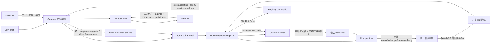
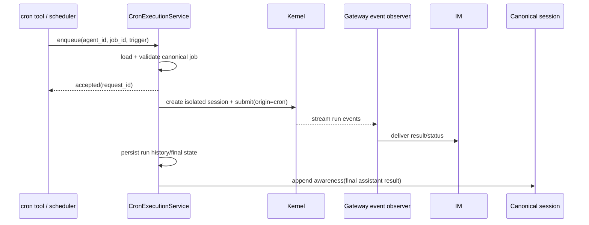

# bugfix-402: Runtime integrity follow-ups — 技术方案

> Unit branch: `unit/bugfix-402` (will be created by orchestrator)
>
> 对齐: incident.md v1

## Changelog

## 现状分析

### 涉及范围

- `src/agent/products/personal_assistant/tools/cron.py` 负责 Agent 可见的 cron
  工具。目前 `run` 动作读取从未注入、也没有服务端实现的
  `gateway_cron_url`，形成无法工作的 HTTP 旁路。
- `src/personal_assistant/scheduler/cron_runner.py` 与
  `src/personal_assistant/main.py` 已具备定时任务的隔离 session 提交、run
  流消费、IM 投递、运行历史和 canonical session awareness，但执行入口是私有方法，
  且主装配代码直接调用私有方法并重复拼接投递流程。
- `src/agent/core/session/`、`src/agent/platform/persistence/session/` 与
  `src/agent/core/agent/prompting.py` 负责 append-only JSONL 会话及模型上下文构造。
  当前加载结果会直接进入 provider mapper，没有检查 assistant `tool_calls` 是否都有对应
  tool result。
- `src/agent/core/runs/registry.py` 创建并调度专用 event loop 上的 Task，却不保存
  Task 句柄；`shutdown()` 只 stop loop 和 join 线程，无法保证 run、权限等待和 tracing
  scope 在所属 Context 内完成退出。
- `src/agent/core/llm/retry.py` 与
  `src/agent/platform/llm/providers/{anthropic,openai_compat}/` 分别承担重试和
  provider 错误提取。HTTP 错误默认可重试，流式错误却被统一设为不可重试，且重试耗尽后
  会用通用包装文案覆盖主要错误信息。
- `src/IM/frontend/src/features/chat/im-chat-api.ts` 是仍在产品路径上的旧聊天适配层，
  继续调用已删除的 `/im/v1/users`。相邻的 `features/chat/v2/` 已使用认证用户、
  Agent Actor 和 conversation participants，不依赖全局真人目录。

### 既有约束

- `personal_assistant` 只能通过 `agent.sdk` 使用内核，不能 import
  `agent.core` 或 `agent.platform` 内部实现；内核不恢复 HTTP 服务。
- cron 的调度、执行、结果投递、运行历史和对话 awareness 归 Gateway 所有；
  手动运行只能改变触发时机。
- 会话存储是 append-only 事件链。恢复受损历史必须保留原有上下文并补齐终态，
  不能删除整轮记录或要求用户新建会话。
- 重试策略不按具体模型来源维护分支。无法证明为永久错误时默认允许重试。
- IM 不恢复 `/im/v1/users`，不增加真人发现能力，也不保留旧前端兼容路径。
- 本设计以客户侧完整体验和架构职责合理性为最高判断原则；参考 Claude Code 和
  OpenClaw 的体验语义，不照搬其内部实现。

### 契约层 grounding

- `docs/specs/gateway/spec.md` 声明 Gateway 拥有 cron 隔离执行、结果投递和
  awareness，与当前定时路径一致；手动入队尚未进入契约，需要本 unit 增补。
- Gateway 契约要求进程优雅终止，但当前 `RunsRegistry.shutdown()` 不收拢运行中
  Task，实际实现已弱于契约，本 unit 负责修复。
- `docs/specs/im/spec.md` 已采用认证身份、Agent 和 conversation participants
  的 Actor-first 契约；旧聊天适配层仍调用全局用户目录，属于代码 drift，本 unit
  负责完成迁移。
- `docs/specs/kernel/spec.md` 已规定权限等待可被中断，但尚未规定中断或重启后的
  transcript 闭合与历史恢复，需要本 unit 增补。
- CLI 不新增或改变产品行为；它只会继承内核的 session 完整性、重试和关闭修复，
  预计无 CLI delta-spec。

### 可复用能力

- 改造 `CronRunner` 为 Gateway 内唯一的 cron 执行服务，复用现有隔离 session、
  run stream、投递和 awareness，不复用 `gateway_cron_url`。
- 扩展 `build_kernel()` 已有 composition root 和工具构造 wiring 模式，建立正式的
  产品运行时能力注入；不把不可序列化 callback 塞进 session metadata。
- 扩展 `SessionManager`/`SessionService` 的加载与 append 能力，在模型上下文构造前
  持久化补齐悬空工具调用；provider mapper 只消费合法 transcript，不承担数据修复。
- 扩展 `RunsRegistry` 的 controller、状态机和专用 loop 所有权，使 Task 创建、取消、
  等待和 loop 关闭形成一套生命周期。
- 复用 `ModelError` 的结构化 details 和 `RetryingLLMClient` 的统一预算，在 provider
  解析之后、重试之前增加共享语义分类，不新增 provider-specific policy。
- 以 `features/chat/v2/chat-api.ts` 的 Actor-first 调用方式为迁移基准，旧适配层只保留
  仍被 UI 使用的 presentation 转换，不再维护第二套身份目录。

### 相关历史

- `feat-394` 确立了 Gateway 对 heartbeat/cron、隔离执行、IM 投递和 awareness
  的所有权；本 unit 必须补齐统一公开入口，不能砍掉手动运行能力。
- `refactor-387` 将产品与内核改为进程内 SDK；`gateway_cron_url` 是未随迁移归位的
  HTTP 时代假设。
- `bugfix-380` 增加 provider 错误展示，但 HTTP 与 SSE 没有共享分类契约；
  本 unit 用统一错误事实和默认重试策略取代局部规则。
- `feat-340` 删除全局用户目录并引入 owner/Actor 模型，但旧适配层迁移未完成；
  本 unit 完成切换，不恢复已删除端点。

## 架构总览

当前五个故障表面分散，根因都属于“所有者没有覆盖完整生命周期”：cron 工具绕开了
Gateway owner，session owner 没有保证工具调用闭合，重试 owner 没有统一错误事实，
Registry owner 没有收拢 Task，前端身份解析仍绕开 Actor 契约。



目标形态遵循三个共同不变量：

1. 产品专属副作用通过 composition root 注入的正式能力端口进入工具，不能靠虚构 URL
   或产品反向依赖内核实现。
2. 所有持久化 assistant tool call 在再次发送给模型前必须有对应结果；中断结果也属于
   transcript 的合法终态。
3. 创建异步任务的组件拥有任务直到终态。Gateway 先停止新工作，再通过 Kernel 关闭协议
   收拢 run，最后才释放连接和 event loop。

## 关键决策

### 决策 1: 产品工具通过运行时能力端口调用 Gateway

- **选择**: 在 `agent.sdk.build_kernel()` 增加可选的产品运行时能力集合，并把它作为
  `ToolContext` 的非持久化字段注入工具执行。Gateway 注入线程安全的
  `enqueue_cron_run` 能力；cron 工具只负责校验参数、提交命令并返回 accepted ack。
- **理由**: 产品工具属于 `agent.products`，实际副作用 owner 属于 Gateway。能力端口允许
  composition root 正向注入依赖，同时保持产品只能 import `agent.sdk`、内核不反向 import
  Gateway。
- **拒绝**: 恢复 `gateway_cron_url` 或新建 loopback HTTP；让 cron 工具 import
  `personal_assistant`；把 callback 放进可持久化的 session metadata。
- **风险**: Tool 在 RunsRegistry 专用线程执行，而 Gateway 服务运行在主 asyncio loop；
  能力实现必须提供线程安全、非阻塞的 enqueue 边界。

### 决策 2: Gateway 只有一个 cron execution service

- **选择**: 将 `CronRunner` 收敛为长生命周期的 `CronExecutionService`。定时 scheduler 和
  手动工具都提交同一种 `CronRunRequest(agent_id, job_id, trigger)`；service 在入队前从
  agent workspace 的 canonical job store 校验任务存在且可运行，入队后统一完成 isolated
  session、Kernel run、stream、IM delivery、run state/history、delete-after-run 和
  canonical-session awareness。
- **理由**: 手动运行只改变触发来源。共用命令与执行服务可以从结构上保证两条路径不会再次
  漂移。
- **拒绝**: 在 cron tool 中复制执行逻辑；保留 `_cron_tick_for_agent` 中的私有方法拼装；
  手动路径同步等待完整运行。
- **风险**: one-shot job 不能在“成功提交”时过早删除。删除和运行历史必须由 execution
  service 在明确的接受/终态边界处理，避免入队后进程退出造成任务无记录丢失。

### 决策 3: transcript 完整性由 session 物化层保证

- **选择**: 为 session event log 增加引用原 `tool_call_id` 的恢复记录。加载时的
  transcript materializer 扫描 assistant tool calls 与 tool results，发现未闭合调用时按
  `session_id + tool_call_id` 幂等追加“工具执行已取消”的恢复记录，并在逻辑消息序列中把
  对应 synthetic tool result 放到产生该 tool call 的 assistant 消息之后。正常 interrupt、
  cancel 和 shutdown 也通过同一闭合服务写入取消终态。
- **理由**: JSONL 是 append-only，不能把修复结果物理插入旧行；provider 又要求 tool result
  在语义上紧跟对应 assistant tool call。引用式恢复事件同时保住不可变日志、合法消息顺序和
  跨重启幂等性。
- **拒绝**: 丢弃受损 assistant 消息或整轮历史；只在 provider mapper 临时过滤；只修新中断
  而不修既有坏数据；把恢复结果简单追加到历史尾部。
- **风险**: 多 tool call、部分已有结果、compact boundary 和 fork session 都会影响配对；
  materializer 必须按 call id 而非相邻行猜测，并且恢复记录参与 compaction/fork 重放。

### 决策 4: 统一错误事实，默认重试，永久错误采用否定清单

- **选择**: Anthropic-compatible 与 OpenAI-compatible client 都把 HTTP、SSE 和 transport
  故障解析为同一 `ModelError` 事实：transport kind、HTTP status、provider code/type、
  原始 message/body。共享分类器不识别 provider 名，只判定是否“明确永久”：
  本地序列化/mapper 错误、明确参数或格式错误、无效凭证、明确权限拒绝、资源/模型/能力不存在
  或不支持。其余包括网络、超时、429、余额/额度/欠费、服务端错误以及语义不明的 4xx 均默认
  可重试。
- **理由**: 状态码不能表达 Kimi、火山等兼容 API 的恢复语义；默认重试符合产品取舍，否定清单
  将误判成本放在可接受的一侧。
- **拒绝**: 按 HTTP 4xx/5xx 切分；按 provider/model 维护分类表；对所有错误无限重试。
- **风险**: 文本匹配会产生误重试，因此规则只能使用高置信度的永久语义，并保留结构化匹配原因
  供日志和测试诊断。

### 决策 5: 重试耗尽不替换真实上游错误

- **选择**: `RetryingLLMClient` 保留最后一个 `ModelError.message`、code/type/status/raw body，
  只在 details 中增加 attempts、retry_exhausted 和 delay 元数据。用户可见错误以最后一次真实
  provider 原因为主，stream 结束类错误不得覆盖此前已解析的 provider error。
- **理由**: 重试是控制流，不应成为新的业务错误来源。
- **拒绝**: 抛出只有 “exceeded N retries” 的新错误；只在 debug log 保留原始响应。
- **风险**: 上游 body 可能包含敏感信息；展示沿用现有错误脱敏边界，原始 body 只作为受控诊断
  字段，不无条件进入 UI。

### 决策 6: RunsRegistry 对 Task 生命周期负全责

- **选择**: Registry 在接受 submit 前检查 accepting 状态，创建 Task 后登记
  `run_id -> Task` 并用 done callback 清理。关闭执行固定状态机：
  `OPEN -> DRAINING -> CLOSED`；进入 DRAINING 后拒绝新 run，向 queued/running controller
  发 cancel/abort，解除全部权限等待，在 Registry 自己的 loop/Context 中等待任务进入终态；
  grace timeout 后才 cancel 剩余 Task，并显式标记 run cancelled，最后 shutdown async
  resources、stop/close loop、join thread。`Kernel.close()` 保持同步公共接口，但内部等待该协议
  完成且幂等。
- **理由**: ContextVar token 必须在创建它的 Task Context 中 reset。等待 Task 自己退出，而不是
  stop loop 后由析构清理，是消除二次 tracing 异常的根本方式。
- **拒绝**: 捕获并忽略 `ValueError`；直接 stop loop；只等待线程但不等待 Task；关闭时让 run
  留在 queued/running。
- **风险**: 某些工具或网络调用可能不响应协作式 abort，因此必须有有限 grace timeout 和强制
  cancel 兜底。

### 决策 7: Gateway 按生产者到消费者顺序关闭

- **选择**: Gateway 先停止 intake、heartbeat/cron producer 和 dispatch queue，再调用
  `Kernel.close()` 收拢 run；在 run 终态事件处理完之前保留 IM observer/connection，之后才关闭
  channels、IM client 和其他资源。关闭阶段的次要错误记录但不覆盖最早的 process failure。
- **理由**: 先关闭事件出口会使仍在运行的内核无法完成最后状态传播；先停生产者可保证 drain
  期间没有新工作进入。
- **拒绝**: 维持当前“先关 IM、最后停 Kernel”的顺序；在多个 closer 中无序 best-effort。
- **风险**: IM 已断线时最终状态无法远端展示，但本地 run 和 session 仍必须进入明确终态。

### 决策 8: Web IM 只使用 Actor-first 数据源

- **选择**: 删除 `listUsersRaw`、`createUserRaw`、`ensureUser`、Agent user alias bootstrap 和
  `loadUserMap`。当前用户只来自 auth store；可新建对话的候选只来自 `/im/v1/agents`；
  conversation 的 `participants` 是展示现有真人和 Agent 的权威来源。创建 direct/group
  conversation 发送 Actor participants，由后端解析 Agent 对应 user row；Agent 返回的
  `user_id` 仅在仍要求 `participant_ids` 的边界使用，前端不构造虚拟真人。
- **理由**: 这与 IM canonical contract 和现有 v2 client 一致，并从调用面彻底移除全局用户目录。
- **拒绝**: 恢复 `/users`；保留 silent fallback；新增 owner 范围用户搜索；继续维护
  `agent:<id>` alias user。
- **风险**: 历史 conversation 若缺失 Actor display name，UI 只能显示稳定 id；本 unit 不通过
  全局目录补全，后端 conversation response 才是正确修复位置。

## 接口与数据流

### 产品运行时能力

`agent.sdk` 暴露一个只包含可选 callable 的稳定能力对象。能力对象不进入 session metadata、
JSONL 或 prompt：

```text
build_kernel(..., runtime_capabilities=ProductRuntimeCapabilities(...)) -> Kernel

ProductRuntimeCapabilities.enqueue_cron_run(
    CronRunCommand(agent_id, job_id, source_session_id)
) -> CronEnqueueAck

CronEnqueueAck:
    accepted: bool
    job_id: str
    request_id: str | null
    error_code: "job_not_found" | "job_disabled" | "capability_unavailable" | null
```

cron 工具只在 `accepted=true` 时向模型返回“已入队”。未知任务和未启用任务在入队前失败，不创建
Kernel session。未注入能力代表当前宿主不支持手动 cron，返回明确 tool error。

### Cron 统一执行链



scheduled tick 不再自行拼装执行/投递闭包，只负责找出 due job 并调用同一个 `enqueue`。执行服务按
`request_id` 去重，防止同一请求被重复消费；不同请求按既有并发策略执行。

### Session transcript 修复

新增 append-only recovery entry，至少携带：

```text
type: "tool_call_recovery"
session_id
tool_call_id
tool_name
reason: "interrupted" | "cancelled" | "shutdown" | "orphaned"
timestamp
idempotency_key: "tool-call-recovery:<tool_call_id>"
```

加载流程为：

1. 重放原始 turn、compaction、fork 和 recovery entries。
2. 以 assistant `tool_calls` 建 pending map，以 tool result/recovery entry 关闭对应 call id。
3. 对仍 pending 的 call id 原子地 append recovery entry；并发加载依赖 idempotency key 去重。
4. 重新物化 transcript，把 synthetic tool result 放在对应 assistant group 后、下一条非 tool
   消息前。
5. `build_chat_messages` 只接收已通过完整性检查的消息序列。

运行中的 interrupt/cancel/shutdown 复用相同 recovery writer，使当前 UI 尽快看到取消结果；若进程在
写入前硬退出，下次加载仍由步骤 3 兜底。

### Provider 错误与重试

```text
HTTP/SSE/transport exception
  -> extract_provider_error_facts()
  -> classify_retryability()
       explicit permanent => retryable=false
       otherwise          => retryable=true
  -> RetryingLLMClient
       retry budget available => retry same request
       exhausted => raise last error + retry metadata
  -> runtime persists/displays actual provider message
```

分类优先级：

1. 本地 mapper/schema 构造错误：不可重试。
2. 明确的参数、格式、凭证、权限、not-found、unsupported 结构化 code/type 或高置信文本：不可重试。
3. transport timeout/disconnect、429、5xx：可重试。
4. quota/balance/billing/overdue/rate-limit 语义：可重试，即使 HTTP 为 4xx。
5. 其余无法确定的错误：可重试。

### Kernel/Gateway 关闭

```mermaid
sequenceDiagram
    participant G as GatewayRuntime
    participant P as Producers/Channels
    participant K as Kernel
    participant R as RunsRegistry loop
    participant IM as IM observer

    G->>P: stop accepting + stop heartbeat/cron/dispatch
    G->>K: close(grace timeout)
    K->>R: DRAINING; reject submit
    K->>R: abort controllers + resolve permission waits
    R->>R: await owned Tasks in their Context
    R-->>IM: terminal run events
    R->>R: cancel timeout remainder; close loop
    K-->>G: close complete
    G->>IM: close connection
    G->>P: close remaining resources
```

重复调用 `Kernel.close()` 返回成功；关闭开始后的 `submit()` 返回稳定的 closed error，不创建
queued record。

### Web IM 身份与参与者

```text
self identity         <- auth store (/auth/me result)
agent candidates      <- GET /im/v1/agents
existing participants <- conversation.participants
new direct/group      -> POST /im/v1/conversations {participants:[Actor...]}
```

现有真人会话只展示服务端随 conversation 返回的参与者，不提供搜索或创建其他真人会话。旧
`im-chat-api.ts` 中仍被非 v2 页面使用的功能可以保留，但所有身份解析必须改为上述三个来源，并增加
源码级 contract test 禁止 `/im/v1/users` 字符串重新出现。

## 契约层增量 (delta-spec)

- kernel: `specs/kernel/spec.md`
- im: `specs/im/spec.md`
- gateway: `specs/gateway/spec.md`
- cli: no spec delta

## 风险与回退

- **历史修复顺序错误**: synthetic result 若放到 transcript 尾部仍会被 provider 拒绝。用引用式
  recovery entry 和物化层插入，并用 Anthropic/OpenAI mapper contract tests 覆盖多 call、部分
  result、compact/fork。
- **关闭死锁**: Kernel close 从 Gateway 主 loop 调用，而 Registry 有独立 loop。同步 close 只能
  通过 thread-safe future 等待 Registry loop，不得反向等待 Gateway loop；能力队列在 close 前先
  停止生产。
- **误重试导致等待变长**: 这是已接受的产品取舍。仍保留既定 20 次预算和 cooldown，不扩大为无限
  重试；永久错误命中原因写入 diagnostics。
- **cron 入队后进程退出**: accepted 只表示 Gateway execution service 已接管请求，不承诺进程崩溃后
  自动重放。运行状态必须留下 accepted/terminal 记录，避免用户误以为成功完成。
- **旧前端耦合范围大**: 删除 user map 后可能暴露依赖其 display-name fallback 的页面。迁移以
  conversation actors 为权威，测试覆盖启动、列表、详情、direct/group 创建和已有真人会话。
- **回滚**: 本 unit 不含数据 schema 破坏性迁移。代码可整体回滚；新增 recovery JSONL entry 对旧版本
  是未知事件，应由 loader 的既有未知事件容忍策略忽略。不能单独回滚 session materializer 而保留
  recovery writer，也不能单独恢复旧 `/users` 调用。

## Runbook for Reviewer

| 服务 | 停止命令 | 启动命令 | 健康检查 |
|---|---|---|---|
| IM API | `[[ -f .im.pid ]] && kill "$(cat .im.pid)" 2>/dev/null; rm -f .im.pid` | `IM_JWT_SECRET="bugfix-402-review" PYTHONPATH=src python -m uvicorn IM.app:app --host 127.0.0.1 --port "$IM_PORT" > .im.log 2>&1 & echo $! > .im.pid` | `curl -fsS "http://127.0.0.1:$IM_PORT/docs" >/dev/null` |
| Web IM (Vite) | `[[ -f .vite.pid ]] && kill "$(cat .vite.pid)" 2>/dev/null; rm -f .vite.pid` | `cd src/IM/frontend && npm run dev -- --host 127.0.0.1 --port "$VITE_PORT" --strictPort > ../../../.vite.log 2>&1 & echo $! > ../../../.vite.pid` | `curl -fsS "http://127.0.0.1:$VITE_PORT/" >/dev/null` |
| Gateway | `[[ -f .gateway.pid ]] && kill "$(cat .gateway.pid)" 2>/dev/null; rm -f .gateway.pid` | `PYTHONPATH=src python -m personal_assistant.main --config "$WT_CFG" --im-service-url "http://127.0.0.1:$IM_PORT" --foreground --auto-bind > .gateway.log 2>&1 & echo $! > .gateway.pid` | `kill -0 "$(cat .gateway.pid)" && ! rg -n "Traceback|gateway startup failed" .gateway.log` |

Reviewer 在 worktree 中优先运行 `./scripts/e2e-up.sh`，该脚本负责空闲端口、隔离 config、workspace
和 auto-bind；完成后必须运行 `./scripts/e2e-down.sh`。上表用于单独重启受影响服务时照搬。

## Milestones

本 unit 预计修改超过 20 个文件，覆盖 core session、LLM providers、run registry、Gateway scheduler、
SDK composition root 和 Web frontend，明显超过单 worker 窗口。M1/M2/M3/M5 文件范围互不重叠，
可真并行；M4 与 M3 都修改 `agent/sdk/kernel.py` 和 Gateway composition root，因此依赖 M3 后串行。

| ID | 标题 | 依赖 | 并行组 | 范围 | 退出标准 |
|---|---|---|---|---|---|
| bugfix-402-M1 | transcript-integrity | — | A | `src/agent/core/session/`; `src/agent/platform/persistence/session/`; `src/agent/core/agent/runtime.py`; transcript materialization/prompting；对应 session/runtime tests | `[reviewer]` 权限等待中断后同一会话可继续，已有悬空 tool call 自动恢复且多次加载不重复（覆盖 incident 三个会话 Scenario）。<br>`[worker]` append-only recovery entry 按 call id 幂等，Anthropic/OpenAI 映射均收到合法顺序；`pytest -xvs tests/unit/test_session_manager.py tests/unit/test_session_service.py tests/unit/test_agent_prompting.py tests/unit/test_session_persistence_fidelity.py tests/integration/test_session_store_persistence_integration.py` 全绿。 |
| bugfix-402-M2 | model-error-semantics | — | A | `src/agent/core/errors.py`; `src/agent/core/llm/retry.py`; `src/agent/platform/llm/providers/`; provider/retry/error-visible tests | `[reviewer]` 网络、限流、额度和未知错误按预算重试；明确永久错误快速失败；耗尽后展示最后真实原因。<br>`[worker]` HTTP/SSE/transport 共用 provider-neutral facts/classifier，无 provider-name 分支；Kimi/火山代表性 4xx fixtures、永久错误和 exhaustion tests 覆盖；`pytest -xvs tests/unit/test_loop_retry.py tests/unit/test_runtime_retry_no_duplicate_user_message.py tests/contract/test_llm_provider_contract.py tests/integration/test_provider_error_user_visible.py` 全绿。 |
| bugfix-402-M3 | owned-run-shutdown | — | A | `src/agent/core/runs/registry.py`; `src/agent/sdk/kernel.py`; Gateway shutdown order in `src/personal_assistant/main.py`; registry/gateway lifecycle tests | `[reviewer]` 有活动 run 或权限等待时 stop/restart 进入明确终态，日志无 cross-Context 二次异常，真实首因保留。<br>`[worker]` Registry 登记并清空所有 owned Tasks，close 幂等、拒绝新 submit、grace timeout 可控；`pytest -xvs tests/unit/test_runs_registry.py tests/unit/test_runs_registry_transport_lifecycle.py tests/unit/personal_assistant/test_gateway_stop_command.py tests/unit/personal_assistant/test_gateway_pid_lifecycle.py` 全绿。 |
| bugfix-402-M4 | unified-cron-run | bugfix-402-M3 | B | `src/agent/sdk` 产品能力契约；`src/agent/core/tools` context wiring；`src/agent/products/personal_assistant/tools/cron.py`; `src/personal_assistant/scheduler/`; Gateway composition；cron tests | `[reviewer]` 手动运行立即返回入队，完成结果进入原目标会话、运行历史和后续 awareness；未知任务明确失败。<br>`[worker]` scheduled/manual 只调用同一 execution service，不存在 `gateway_cron_url` 或 loopback HTTP；`pytest -xvs tests/unit/personal_assistant/test_cron_tool_openclaw.py tests/unit/personal_assistant/test_cron_delivery_chain.py tests/unit/personal_assistant/test_cron_runner_awareness.py tests/unit/personal_assistant/test_cron_scheduler_tick.py tests/contract/test_cron_coding_cli_isolation.py` 全绿。 |
| bugfix-402-M5 | actor-first-web-im | — | A | `src/IM/frontend/src/features/chat/im-chat-api.ts`; chat facade/components as required；frontend chat tests/contract tests | `[reviewer]` 打开、浏览、进入 Agent 或已有真人会话及创建 Agent direct/group 均无 `/users` 404；无真人发现入口。<br>`[worker]` frontend source 不含 `/im/v1/users` 调用或 alias bootstrap；在 `src/IM/frontend` 执行 `npm run test -- --run` 与 `npm run build` 全绿。 |
