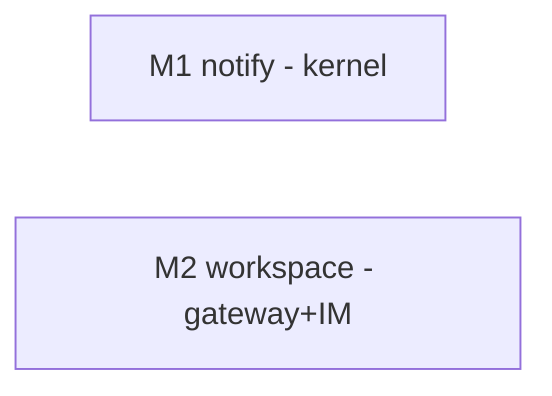

# bugfix-404: PA 后台通知丢失 + workspace 隔离失效 — 技术方案

> 对齐: incident.md v1
> Unit branch: `unit/bugfix-404` (will be created by orchestrator)

## Changelog

## 现状分析

### 涉及范围

**缺陷一（通知丢失）——全部在 kernel 内：**

- `src/agent/platform/background_tasks/wiring.py` —— `_deliver_notification`（:126-157）投递断点：parent 空闲路径 `runs_registry.submit` 不带 workspace_root，`except ValueError: pass` 吞掉失败
- `src/agent/core/runs/registry.py` —— `submit`（:299-328）用裸 `SessionManager.get_session(workspace_root=None)` 做存在性校验，per-workspace scoping 下定位不到非默认 workspace 的 session
- `src/agent/core/background_tasks/models.py` —— `BackgroundTaskRecord` 无 workspace_root 字段，信息在注册时即丢失
- `src/agent/core/background_tasks/registry.py` —— `register_bash` / `register_subagent` 签名需随 record 加字段
- `src/agent/platform/tools/builtins/bash.py` / `agent.py` —— 注册调用方；session 级 ToolContext 的 `repo_root`/`cwd` 即 session workspace（`core/tools/registry.py:_resolve_execution_context` 保证）

**缺陷二（workspace 覆盖）——gateway + IM：**

- `src/personal_assistant/reporter/upstream_reporter.py:300` —— `node.register` 帧只发 `agents: [agent_id]`，不带 workspace_root
- `src/IM/ws/gateway_handler.py:_handle_register` —— 新 agent 落库 `managed_workspace_root(agent_id)` 凭空填 default（注释自认 "node.register only carries agent_ids"）
- `src/personal_assistant/main.py:322-326` —— `sync_agent` 回拉 IM mirror，workspace_root 非空即覆盖本地 config
- `src/IM/application/config_service.py` —— **真正的残留可变更面**：HTTP 层 `UpdateAgentConfigRequest` 本不含 workspace_root（`extra:"ignore"`，符合 OUTPUT_ONLY 惯例），但路由调 `update_profile(workspace_root=None)`，`normalize_workspace_root(None)` 把 None 落库为 managed default——**任何一次 UI 配置编辑都会把 workspace_root 重置回默认路径**（incident.md 引的 `routes/agents.py:203` 是读路径 live-snapshot 合并，系误读，已更正）

### 既有约束

- IM 与 gateway 可跨机，IM **绝不**直读 gateway workspace 文件（契约层 Decision G）——种子值必须经 WS 帧传递
- 产品包只 import `agent.sdk`；缺陷一的修复全在 kernel core/platform 内，不触产品边界；core 不依赖 platform
- `node.register` 断线重连后会**重发**——种子写入必须幂等，不能覆盖 IM 已有值（feat-379-M6 已确立"重注册不覆盖用户编辑"模式，沿用）
- IM 契约层已定「agent.create 时 workspace_root 由节点分配、IM 持久化」——本 unit 是把**存量 config agent 的 node.register 路径**对齐到同一模型，不是引入新模型

### 可复用能力

- **前端无需改动**：agent 详情页 workspace-root input 已 `disabled`，创建页发 `workspace_root: null`（节点分配）——Q4「UI 不可改」在前端已是现实
- `_handle_register` 的 existing-profile 保持逻辑（feat-379-M6）——种子写入的幂等模式直接沿用同一分支结构
- runtime 的 session 级 ToolContext 重建机制（`_resolve_execution_context`）——bash/agent 工具注册任务时可直接从 ctx 取 session workspace，无需新增查询链路

### 相关历史

- **bugfix-348**：引入 per-workspace session scoping，是缺陷一的回归引入点；其"session 定位必须带 workspace_root"的不变量本 unit 必须遵守而非绕过
- **#64 / feat-385 (PR #62)**：同家族修复（stream 链路漏传 workspace_root），修法同方向：把 workspace_root 透传到位
- **refactor-360/M4 (43f0a120)**：引入 `except ValueError: pass` 兜底与前台通知抑制（#19 修复）;后者的 `notified=is_foreground` 语义必须保留
- **feat-337**：后台任务通知功能引入 unit；其设计意图（完成后主动通知、parent 忙 inject / 闲新 run 双路径）是修复的硬约束，见 incident.md RCA

## 架构总览

```
缺陷一：后台任务完成通知链（kernel 内）

  bash/agent 工具注册任务                    任务完成
  ┌──────────────────────┐               ┌──────────────────────────┐
  │ ctx(session 级)       │               │ _NotifyingStore.update    │
  │  ├ session_id         │               │   └ _deliver_notification │
  │  └ repo_root ═ ws ────┼──┐            │      ├ parent 忙: inject  │ ←内存,本来就好
  └──────────────────────┘  │            │      └ parent 闲: submit  │
                            ▼            │         (session_id,      │
              BackgroundTaskRecord        │          ★workspace_root) │
              ┌──────────────────┐        └───────────┬──────────────┘
              │ + workspace_root │ ───────────────────┘
              └──────────────────┘   before: 无此字段 → submit(ws=None)
                                             → ValueError 被 pass 吞掉 ✗
                                     after:  注册时存 → 投递时透传 ✓
                                             真实失败 log_error,不再裸吞

缺陷二：workspace_root 数据流（gateway ↔ IM）

  before:
    本地 config(真值) ──node.register(只有 id)──▶ IM 凭空填 managed default
    runtime 实际用值 ◀──sync_agent 回拉 mirror──── (default 覆盖本地 config) ✗

  after:
    本地 config(真值) ──node.register(id+ws)──▶ IM 首见种子落库(已存在则保持)
    runtime 实际用值 ◀═══ 本地 config 直供(回拉不再采用 mirror 的 ws 字段) ✓
    IM(展示/广播) ──── workspace_root 创建即定,update API 忽略该字段
```

两缺陷共享同一主题——"workspace_root 在某条链路丢失/被篡改"——但断点分别在 kernel 内部与 gateway↔IM 同步协议，文件零交集，可并行实施。

## 关键决策

### 决策 1: workspace_root 随任务记录全程携带（缺陷一修法）

- **选择**: `BackgroundTaskRecord` 新增 `workspace_root: str | None = None` 字段；bash / agent 工具注册任务时从 session 级 ToolContext 取（`ctx.repo_root`，即 session workspace）；`_deliver_notification` 起新 run 时透传给 `runs_registry.submit(workspace_root=...)`
- **理由**: 信息在产生点（注册时，session 必然活跃）一次性捕获、显式落进数据流，投递时点（可能数小时后）不依赖任何缓存状态；与 #64 修法同构（透传到位），与 bugfix-348 的不变量（定位 session 必带 workspace_root）正面对齐
- **拒绝**: 投递时查 `runtime._session_configs` 缓存反查 workspace_root —— 投递时点缓存是否仍持有该 session 不可控（依赖 runtime 内部生命周期），且让 platform wiring 隐式耦合 runtime 私有状态；改 `RunsRegistry.submit` 的存在性校验走 runtime 缓存 —— 影响所有 submit 调用方，扩大爆炸半径
- **风险**: ToolContext 的 repo_root 在个别调用路径下可能不等于 session workspace（如未带 cwd metadata 的产品装配）——worker 落地时以单测锁定"注册进 record 的值 == session workspace_root"

### 决策 2: 投递失败必须可观察，subagent 跳过改为显式判别

- **选择**: 删除裸 `except ValueError: pass`。投递前显式判断 parent 是否顶层 session（子 session 有 parent_session_id 链，具体判别由 worker 落地）：是子 session → debug 级日志跳过（保留 feat-337 既有语义）；顶层 session 的 submit 失败 → `log_error` 带 task_id / parent_session_id / workspace_root，不吞
- **理由**: incident.md RCA 不变量明确要求"跳过语义保留，但不能再静默吞真实失败"；本缺陷能潜伏一个月正是因为零可观察性
- **拒绝**: 保留 except 但加日志 —— 异常驱动的控制流仍把"预期跳过"和"真实失败"混在同一信号里，下次语义漂移照样误吞
- **风险**: 判别条件写错会把子任务通知也起 run（行为变化）或漏掉顶层通知——回归测试双向覆盖（顶层送达 + 子 session 跳过）

### 决策 3: node.register 帧加带 per-agent workspace_root，IM 首见种子落库（缺陷二·种子链路）

- **选择**: `node.register` payload 新增可选字段 `agent_workspaces: {agent_id: workspace_root}`（`agents: [id]` 保持原样不动）；IM `_handle_register` 在 profile **不存在**时用上报值落库（取代凭空 `managed_workspace_root()`），profile 已存在时保持既有值不动（与 feat-379-M6 同模式，重连重发天然幂等）
- **理由**: 加可选字段保新旧帧兼容（老 gateway 发的帧无此字段，IM 走原逻辑）；"已存在则不动"实现 Q4「创建即定」语义；走 register 帧而非注册后补 HTTP upsert，避免两步之间的竞态窗口（heartbeat md.request 可能在 upsert 前到达）
- **拒绝**: `agents` 列表对象化 `[{agent_id, workspace_root}]` —— 破坏 `_require_string_list` 与既有消费者，兼容成本高；注册后补一次 config upsert —— 两步竞态 + 多一次往返
- **风险**: 已被污染的存量 IM DB（profile 已存 managed default、本地 config 是别的路径）不会被自动矫正——见风险段

### 决策 4: sync_agent 回拉不再采用 IM mirror 的 workspace_root（缺陷二·消费侧）

- **选择**: `sync_agent`（`main.py:322-326`）构造 `AgentWorkspaceConfig` 时，workspace_root 一律取本地 config（现 fallback factory 路径升为唯一路径）；IM mirror 的 workspace_root 仅作展示/广播，不进 runtime。其余字段（system_prompt / skills / tool_allowlist / features 等）的 mirror-wins 同步**完全不变**
- **理由**: Q4 决策后 workspace_root 不可经 UI 改，本地 config 是唯一可信源；即使 IM DB 有脏值（决策 3 的遗留风险），runtime 也不再被污染——这是对缺陷二的纵深防御，worktree e2e 隔离不再依赖 IM DB 干净
- **拒绝**: 仅靠决策 3 种子正确、回拉照旧 —— 存量脏 DB 下缺陷照样复现；"本地 YAML 永远赢"扩大到全字段 —— 阉割配置中心能力，违反不变量
- **风险**: IM 前端新建 agent 的路径（agent.create → gateway 分配 workspace → 写回本地 config）必须保持闭环，否则本地 config 缺条目时 fallback factory 会算出默认路径——该写回逻辑已存在（AGENTS.md 明确 Gateway 自动写回），回归测试覆盖

### 决策 5: service 层 update 路径不得触碰 workspace_root（缺陷二·封口）

- **选择**: 从 `ConfigService.update_profile` 签名删除 `workspace_root` 参数，repo 层 update 保持存量值不动。HTTP 层无需改——`UpdateAgentConfigRequest` 本就不含该字段且 `extra: "ignore"`（符合 AIP-203 OUTPUT_ONLY 惯例：节点分配字段只出现在响应）
- **理由**: 现状真窟窿在 service 层——路由传 `workspace_root=None`，`normalize_workspace_root(None)` 把 None 落库为 managed default，**任何一次 UI 配置编辑都会把 workspace_root 重置回默认**。主仓默认路径下不可见；不修它，决策 3 的种子值会被第一次 UI 编辑冲掉。删参数比"None=保持"语义更彻底：编译期就杜绝再有人传值
- **拒绝**: HTTP 层加忽略逻辑 —— 框架层已忽略，画蛇添足；service 层保留参数改"None=保持存量" —— 弱于删参数，下个调用方仍可能传值复活窟窿
- **风险**: `update_profile` 其他调用方（若有）需同步改签名——M2 范围加 `src/IM/application/config_service.py`，worker grep 全部调用方

## 接口与数据流

### 缺陷一（kernel 内部）

```
BackgroundTaskRecord                       # core/background_tasks/models.py
  + workspace_root: str | None = None     # 注册时捕获,投递时消费

BackgroundTaskRegistry                     # core/background_tasks/registry.py
  register_bash(..., workspace_root: str | None = None)
  register_subagent(..., workspace_root: str | None = None)

bash.py / agent.py 注册调用方:
  registry.register_bash(..., workspace_root=str(ctx.repo_root))

_deliver_notification(record, runs_registry):   # platform/background_tasks/wiring.py
  parent 忙  → inject_pending_message(不变)
  parent 闲  → if <parent 是子 session>: log_debug 跳过
              else:
                runs_registry.submit(
                    session_id=parent,
                    parts=[notification_xml],
                    origin=BACKGROUND_TASK,
                    source_task_id=record.task_id,
                    workspace_root=Path(record.workspace_root)  # ★ 新增透传
                )
                失败 → log_error(task_id, parent, workspace_root),不吞
```

时序（修复后）：

```
用户消息 → run R1 → bash(run_in_background) 注册 record{ws=会话workspace} → R1 结束回"已启动"
60s 后进程退出 → monitor 线程 → registry.complete → _NotifyingStore.update
  → _deliver_notification → submit(parent, ws=record.ws) → run R2 (BACKGROUND_TASK)
  → R2 产出 assistant 回复 → gateway background_session_events 订阅器 → IM 第二条消息 ✓
```

### 缺陷二（gateway ↔ IM 协议）

```
node.register payload（upstream_reporter.send_register）:
  {
    "node_id": ...,
    "agents": ["Arch", ...],                      # 不变
    "agent_workspaces": {"Arch": "/abs/path"},    # ★ 新增可选字段
    ...
  }

IM _handle_register（gateway_handler.py）:
  for agent_id in agents:
      existing = get_profile(agent_id)
      if existing is None:
          ws = agent_workspaces.get(agent_id) or managed_workspace_root(agent_id)  # ★ 种子
      else:
          ws = existing.workspace_root or managed_workspace_root(agent_id)         # 不变

gateway sync_agent（main.py）:
  workspace_root = local_config[agent_id].workspace_root or workspace_root_factory(agent_id)
  # ★ 不再读 payload["workspace_root"]；其余字段照旧取 mirror

IM ConfigService.update_profile（application/config_service.py）:
  签名删除 workspace_root 参数；repo update 不写该列 → 存量值保持   # ★ immutable
  （HTTP 层 UpdateAgentConfigRequest 本就不含该字段,extra:"ignore",无需改）
```

## 契约层增量 (delta-spec)

- kernel: `specs/kernel/spec.md`（后台任务完成通知在任意 workspace_root 下送达 parent session）
- im: `specs/im/spec.md`（node.register 种子落库；workspace_root 创建后 immutable）
- gateway: `specs/gateway/spec.md`（register 帧携带 agent_workspaces；runtime workspace 以本地 config 为准）
- cli: no spec delta

## 风险与回退

- **存量脏 DB 不自动矫正**（决策 3 遗留）：已把 managed default 落库、而本地 config 是别的路径的 IM DB（如主仓 `data/im_service.sqlite3` 里的历史 profile），种子逻辑不会改写它们。**缓解**：决策 4 保证 runtime 不被脏值污染（核心症状消失）；IM 广播值仍可能与 runtime 实际不一致，属展示层瑕疵——worktree e2e 全新 DB 不受影响，主仓 DB 的脏值恰好等于真实值也不受影响。接受，不做迁移脚本。
- **register 帧新旧兼容**：同仓同发布，gateway/IM 不会跨版本组合部署；可选字段设计下即使出现（老 gateway+新 IM）也只是退回旧行为（种子缺失），不会崩。接受。
- **决策 1 的 ctx.repo_root ≠ session workspace 的边缘路径**：若存在未带 cwd metadata 的装配路径，record 会存到 kernel 级 repo_root，通知投递将退化为修复前行为（submit 定位失败）——但此时有 log_error 可观察，不再静默。单测锁定主路径正确性。
- **回滚**：两 milestone 互不依赖，可独立 revert；record 新字段带默认值，revert 不破坏序列化兼容（InMemoryTaskStore 进程内存，无持久化迁移问题）。
- **降级**：决策 2 的 log_error 即降级可观察面——若修复后仍有未覆盖路径，症状从"静默丢"变为"日志可查"，本身就是网底。

## Runbook for Reviewer

| 服务 | 停止命令 | 启动命令 | 健康检查 |
|---|---|---|---|
| IM (worktree e2e) | `./scripts/e2e-down.sh` | `./scripts/e2e-up.sh`（自动分配端口，`source .e2e-ports.env` 取 `$IM_URL`） | `curl -s $IM_URL/` 返回 200 |
| Gateway (worktree e2e) | 同上（e2e-down 一并停） | 同上（e2e-up 一并起，`--auto-bind` 已含） | `.gateway.log` 无 "failed to start"；`GET $IM_URL/im/v1/nodes`（带 token）节点 online |
| 主仓 IM（验缺陷一用户旅程可选） | `stop_pidfile .im.pid` | `IM_JWT_SECRET="demo-jwt-secret-for-feat340-testing" PYTHONPATH=src python -m uvicorn IM.app:app --host 0.0.0.0 --port 8011 > .im.log 2>&1 & echo $! > .im.pid` | `curl -s http://127.0.0.1:8011/` 返回 200 |
| 主仓 Gateway | `PYTHONPATH=src python -m personal_assistant.main stop` | `PYTHONPATH=src python -m personal_assistant.main` | 启动输出 `[connected]`；IM nodes 列表 demo-node online |

> 注意：reviewer 验证缺陷一需真实 LLM（本地代理 127.0.0.1:4000，见 `docs/可用LLM_API与联调说明.md`）；验证缺陷二只需服务拉起 + `GET /im/v1/agents` 对比 workspace_root，不耗 LLM。

## Milestones

| ID | 标题 | 依赖 | 并行组 | 范围 | 退出标准 |
|---|---|---|---|---|---|
| bugfix-404-M1 | notify | — | A | `src/agent/core/background_tasks/`（models.py, registry.py）、`src/agent/platform/background_tasks/wiring.py`、`src/agent/platform/tools/builtins/bash.py`、`src/agent/platform/tools/builtins/agent.py`、对应 tests | `[reviewer]` IM 直聊让 agent 后台跑 `sleep 60 && echo X`：先收到"已启动"，任务完成后收到含结果的第二条回复（非默认 workspace 的 PA agent 上验）；`[reviewer]` 后台 subagent（agent 工具 run_in_background）完成后同样收到结果回复；`[worker]` 回归测试：非默认 workspace_root 下 bash + subagent 完成通知送达 parent session（修前红）；`[worker]` 子 session 的后台任务完成不起顶层 run（跳过语义保留，测试覆盖）；`[worker]` 前台 budget 内完成仍不发通知（#19 不回归）；`[worker]` 投递失败路径产生 log_error（测试断言日志）；`[worker]` `pytest tests/ -m "not e2e"` 全绿 |
| bugfix-404-M2 | workspace | — | B | `src/personal_assistant/reporter/upstream_reporter.py`、`src/personal_assistant/main.py`（sync_agent 段）、`src/IM/ws/gateway_handler.py`、`src/IM/application/config_service.py`、`src/IM/api/routes/agents.py`（update 路由调用处）、对应 tests | `[reviewer]` worktree 内 `e2e-up.sh` 起栈后，`GET /im/v1/agents` 广播的 workspace_root 为 worktree 路径（非主仓），`workspace_is_default=false`；`[reviewer]` worktree gateway 运行期间主仓 `~/nano-assistant/workspace/` 零写入；`[reviewer]` 主仓默认配置用户行为不变（agents 广播与现状一致）；`[reviewer]` UI 编辑 agent 其他配置（如 system prompt）后 workspace_root 保持不变；`[worker]` node.register 带 agent_workspaces 的种子落库测试（首见用上报值、已存在不覆盖、无字段退回旧行为）；`[worker]` sync_agent 不采用 mirror workspace_root 的单测（IM 给脏值，runtime config 仍为本地值）；`[worker]` `update_profile` 不再有 workspace_root 参数，update 后存量非默认值保持（修前红：update 会重置为 managed default）；`[worker]` `pytest tests/ -m "not e2e"` 全绿 |



M1/M2 文件零交集、无逻辑依赖，并行组 A/B 可同时派发（拆分举证：跨独立模块真并行 + 用户 Q2 显式要求分 milestone）。
