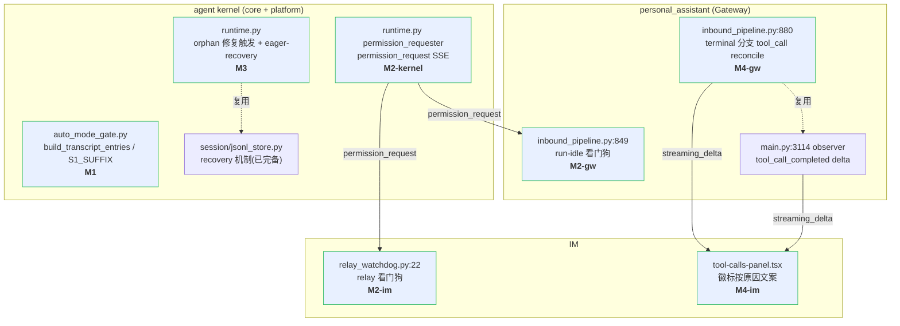
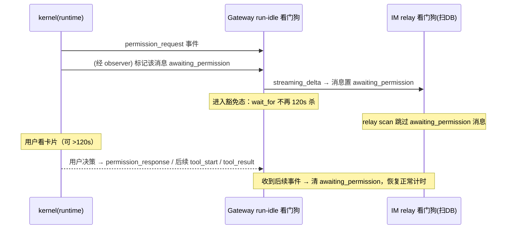
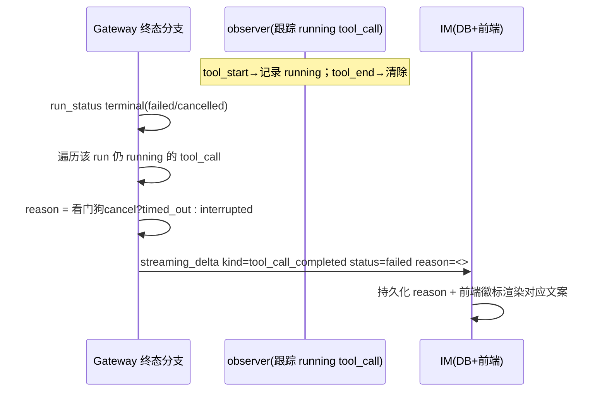
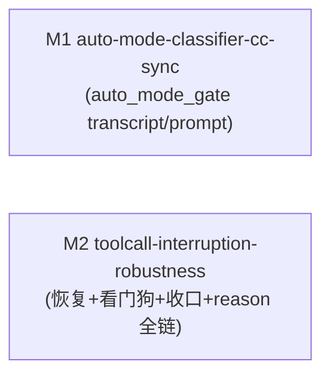

# bugfix-410: 无人值守工具轮 + 权限门的会话健壮性 — 技术方案

> 对齐: incident.md v1

> Unit branch: `unit/bugfix-410` (will be created by orchestrator)

## Changelog

## 现状分析

### 涉及范围

四个缺陷落在三个包，按 milestone：

- **M1（#99，纯 kernel 内部）** `src/agent/platform/hooks/builtins/auto_mode_gate.py`
  - `build_transcript_entries:369` assistant 分支只读 `content` list 里的 `tool_use` block，不读内核
    `LLMMessage.tool_calls` 独立字段 → 历史工具调用静默丢弃。
  - `XML_S1_SUFFIX:159` 旧短版；system prompt `:55` 含 CC 2.1.177 已废的措辞。
  - 单测 `tests/unit/test_auto_mode_gate.py:114` 喂 Anthropic 格式 fixture → false-green。

- **M2（#98，kernel + Gateway + IM）**
  - Gateway run-idle 看门狗 `src/personal_assistant/gateway/inbound_pipeline.py:849-862`（120s 无事件 → `cancel`）。
  - IM relay 看门狗 `src/IM/application/relay_watchdog.py:22`（`running` 超 120s → `failed`）。
  - 现成抓手：内核 park 等决策时**已发 `permission_request` SSE 事件**（`src/agent/core/agent/runtime.py:1320`），Gateway 已监听。

- **M3（#82，纯 kernel）**
  - 恢复机制 `src/agent/core/session/jsonl_store.py:402 prepare_transcript_for_run` / `:488 append_tool_call_recovery` 已完备（bugfix-402）。
  - 缺口在触发覆盖：`runtime.py:306` orphan 修复只在 cache-miss 跑；`:568-613` eager-recovery 在 `try` 体末尾、被 `CancelledError` 绕过、cache 未 invalidate。

- **M4（#97，kernel → Gateway → IM）**
  - `src/personal_assistant/main.py:3114` observer 只在 `tool_end` 发 `tool_call_completed`；`inbound_pipeline.py:880` terminal run_status 直接 break，无「收口在飞 tool_call」。
  - 前端 `src/IM/frontend/src/features/chat/v2/components/tool-calls-panel.tsx` 徽标只认 `running`/`completed`/`✕` 三态，无「按原因」文案。
  - **reason 体系落点（归 M2）**：`src/agent/core/tools/registry.py:172` 是所有 block（auto block + 用户 Deny）物化成 ✕ tool_result 的唯一收口点（`raise ToolError(details={blocked_by_hook, reason})`），denied 的 `reason_code` 在此盖；`src/agent/core/tools/base.py` 是 ToolResult/ToolError 字段定义点。现有 `details["reason"]` 是给模型看的自由文本，不可复用为分类枚举。

### 既有约束

- `core` 不依赖 `platform`（M3 recovery 在 `core/session`，`core/hooks/context.py` 已用 duck-typing 规避 core→platform 引用）。
- 产品（`personal_assistant` / `coding_cli`）只 import `agent.sdk`；M2/M4 跨 kernel→Gateway→IM 必须走事件流，不能直接调内核内部。
- IM 不调用 `agent`，只与用户和 Gateway 交互；M4 徽标终态经 Gateway `node.streaming_delta` 下发。

### 可复用能力

- **悬空恢复**：`prepare_transcript_for_run` / `append_tool_call_recovery`（成熟机制，bugfix-402）→ M3 只扩触发覆盖，不另造。
- **权限**：`permission_request` SSE 事件 + `PermissionBroker`（`runtime.py:1307` closure）→ M2 复用。
- **徽标更新**：IM `streaming_delta kind=tool_call_completed`（observer `main.py:3114`）→ M4 复用，加终态 + reason。

### 相关历史

- **bugfix-402（PR #89）**：上一次修 #82，加两道防御（orphan 修复 + eager-recovery）→ M3 补其 gap（漏掉「运行中被外部超时在阻塞态打断」）。
- **feat-333**：引入 auto_mode_gate 分类器 → M1 修其格式契约 bug + 跟齐 CC 2.1.177。
- **feat-394**：heartbeat/cron redesign，dogfood 期间暴露这批缺陷。

### 契约层 grounding 结论

- **kernel spec:375**「持久化 transcript 进入模型前保持 tool call 闭合」**已声明** M3 要的行为（含 Scenario「中断权限等待后继续同一会话」），但 #82 reopen 证明实现在「cache-hit + 外部 cancel」路径 **drift** → M3 让既有契约真正成立。
- **gateway spec:45**「静默运行失败后释放同会话队列」（120s 无事件即取消）与 M2 张力 → M2 须 MODIFY，区分「真失去进展」vs「合法等权限」。
- **im spec** 无 tool_call 徽标终态条目 → M4 新增 im 契约。

## 架构总览

四个缺陷共享「无人值守工具轮 + 权限门」主线，但改动点落在不同模块、相对独立。下图标出四处改动落点与跨模块边界：



**核心思路**：M1 纯内核单函数 + prompt 保真；M3 纯内核补 recovery 触发覆盖；M2 让「等权限」成为看门狗豁免态（kernel 发信号、Gateway + IM 两个看门狗识别）；M4 在 run 终态对在飞 tool_call 按原因 reconcile（Gateway 补 delta、前端按原因渲染）。M2 与 M4 都跨 kernel→Gateway→IM，且 M2/M4 都触及 `inbound_pipeline.py`、M2/M3 都触及 `runtime.py` —— milestone 拆分需处理范围交集。

## 关键决策

### 决策 1: 看门狗用事件驱动状态切换识别「合法等权限」

**选了事件驱动的豁免态切换，不用周期心跳**（M2）。内核 park 等决策时已发 `permission_request` 事件；两个看门狗据此进入「等权限」豁免态，收到任一后续事件（`tool_start`/`tool_result`/`run_status`）退出豁免。

- **理由**: `permission_request` 事件已存在（`runtime.py:1320`），零新增噪音；语义精确区分「合法停顿」vs「真卡死」，对未进入 pending 态的无事件停顿仍快速兜底。
- **拒绝**: 周期 keepalive 心跳 — 治标、污染事件流，两个看门狗都要处理心跳频率，IM relay 还要据此刷 `last_event`。
- **风险**: 两个看门狗机制不同（Gateway 消费事件流 / IM relay 扫 DB 时间戳），豁免两侧落地方式不同（见接口段）。

### 决策 2: 权限等待不设硬上限，靠 interrupt 兜底

**选了无限等待 + 仅显式决策（批/拒）或 `interrupt`/cancel 才收口**（M2）。

- **理由**: 人看权限卡片时长不可预测，固定上限会误杀；run 只占该 session 串行槽，跨会话并行不受影响（gateway spec:38）。`kernel.interrupt` 已会 cancel parked permission futures（`inbound_pipeline.py:647`）。
- **拒绝**: 远长于 120s 的硬上限（如 30min）— 仍是武断值。
- **现状澄清（已核实 `auto_mode_gate.py:794` + 注释:22 + `main.py:2148`）**: 无人值守轮（heartbeat/cron）带 `run_origin ∈ {heartbeat, cron}`，auto_mode_gate 识别后走 `unattended_fallback`（直接 allow/deny），**从不 park**。因此本决策的「无限等待」只作用于**有人值守**（direct chat 用户在场）的 ask；无人值守轮在 **kernel 侧**就短路、不发 `permission_request`、不设 `awaiting_permission` marker，其意外中断仍由常规 120s 看门狗兜底——**marker 不会在无人值守场景制造永久 ghost**（不依赖 Gateway 判断 origin）。

### 决策 3: 在恢复式架构内补全覆盖，不引入原子持久化

**选了把 eager-recovery 挪到 `finally`/cleanup + `invalidate_session_cache`，覆盖 `CancelledError` 穿透路径**（M3），不改持久化时序。

- **理由**: kernel spec:375 契约本就是「恢复式」语义（append-only + 幂等 recovery，接受死亡窗口、靠下次 submit 前恢复兜底），是合理的纯架构。M3 让这套机制无死角：`finally + invalidate` 一处改动同时覆盖 issue gap ①（cache-hit 不重修）②（CancelledError 绕过 eager-recovery）；invalidate 后下次 cache-miss 触发 `prepare_transcript_for_run` 重修，in-memory 砖化自愈。
- **拒绝**: 原子持久化（issue 方向④）— 根除死亡窗口但要改 `loop.py` 落盘时序、与既有 append-only 恢复式架构并存反而不纯。请求构造防御（方向③）— `finally + invalidate` 生效后基本冗余，不单列（除非自检发现未覆盖路径）。
- **风险**: `finally` 在 `CancelledError` 期间做 recovery 写，需对关键写用 `asyncio.shield` 防二次 cancel 丢失。

### 决策 4: 在飞 tool_call 收口只产「执行超时/已中断」；「已拒绝」走 deny result

**选了把 Q5 三种终态拆成两条独立路径**（M4），尊重 bugfix-367「park/deny 不发 tool_start」语义。

- **在飞 tool_call 收口**（Gateway 终态 reconcile）: 只针对 `tool_start` 已发、running 中、run 异常终止 `tool_end` 没来的工具，reason ∈ {`timed_out`(看门狗 cancel), `interrupted`(其他异常终止)}。
- **「已拒绝」不走在飞收口**: deny 的工具（auto block / 用户 Deny）从不进入 running（`loop.py:363-367`），本就在 tool_result 阶段渲染 ✕；只需在 `registry.py:172` 的 block 收口处盖 `reason_code=denied`，前端把 ✕ 细化成「已拒绝」（落点见接口段，**全在 M2**，不碰 auto_mode_gate）。
- **理由**: 不为统一而让 deny 走 running→收口的假路径；denied 在 registry 统一收口处盖，省得让 M1 为 reason 改 auto_mode_gate。
- **风险**: reason 是横跨 kernel(registry/base.py)→Gateway→IM→前端的字段链，必须单一 owner（M2）端到端做，避免定义点与透传点割裂。

### 决策 5: 旁路 reason 字段，不扩 status 枚举

**选了在 tool_call 终态旁加 `reason` 字段，status 仍是 `completed`/`failed`**（M4 / 跨层）。

- **理由**: reason 是对非成功终态的细化，旁路字段对既有 status 三态判断零侵入；前端只在已走「非 running」渲染分支时多读 reason 决定文案。
- **拒绝**: 扩 status 枚举 — 波及 kernel/Gateway/IM/前端所有 status 判断分支，改动面大易漏。
- **风险**: `reason` 要端到端透传（Gateway delta → IM DB → 前端），每跳都要带。

## 接口与数据流

### reason 字段（整体归 M2，M1 不碰）

tool_call 终态新增旁路 `reason_code` 字段，端到端透传：

```
reason: "denied" | "timed_out" | "interrupted" | null
  denied      — 工具被 hook 拒绝（auto block 或用户 Deny）  （来源见下）
  timed_out   — Gateway run-idle 看门狗 cancel             （Gateway reconcile 产）
  interrupted — 其他异常终止（崩溃 / stall / interrupt）   （Gateway reconcile 产）
前端文案: denied→已拒绝  timed_out→执行超时  interrupted→已中断
```

**denied 的真实落点是 `registry.py:172`，不是 auto_mode_gate**：所有 block（auto block 与用户 Deny——后者经 `_handle_ask` 返回 `{block:True}`）都统一回到 `registry.py` 的 `blocked_by_hook` 分支 `raise ToolError(details=...)` 收口。在该分支盖一个**独立分类字段 `reason_code="denied"`**，与现有给模型看的自由文本 `reason`（`"no permission channel ..."` / LLM `<reason>` 整句）**并存、不复用**（复用会污染模型可读理由）。

字段链路：`ToolError.details`/`ToolResult`（`core/tools/base.py` 定义）→ tool_result message → `streaming_delta` payload（Gateway）→ tool_call 持久化（IM DB）→ 前端类型。**整条链（base.py 字段定义 + registry 盖 denied + Gateway 产 timed_out/interrupted + IM + 前端文案）全部归 M2**，单一 owner。**M1 完全不碰 reason** —— 因此 M1（auto_mode_gate transcript/prompt）与 M2 文件零交集，真并行成立。

### M1: transcript 提取适配

`build_transcript_entries` assistant 分支：`content` 是 list 且含 `tool_use` block 时走原路径（兼容）；否则回退读 `LLMMessage.tool_calls` 字段，对每个 call 的 `name`/`arguments` 走 `project_tool_input` 投影。单测 fixture 改喂内核真实 `LLMMessage`（`tool_calls` 独立字段）。prompt（`XML_S1_SUFFIX` + system prompt）以**实际安装的 CC 2.1.177 二进制 strings 提取**为保真基准。

### M2: 权限等待豁免（两个看门狗机制不同）



- **Gateway run-idle 看门狗**（`inbound_pipeline.py:849`，消费事件流）：见 `permission_request` → 置 `awaiting_permission`，期间 `anext` 不施加 120s 超时；见任一后续事件 → 清标记恢复。
- **IM relay 看门狗**（`relay_watchdog.py`，周期扫 DB `last_event`）：消息加 `awaiting_permission` 标记（Gateway 转发 `permission_request` 时经 `streaming_delta` 置上），`scan_and_fail_stuck_running_messages` 对该标记的消息**不施加常规 120s 超时**。
  - **marker 不是永久豁免**，三条清理 / 兜底路径缺一不可（否则 Gateway 崩溃会让 marker 泄漏、消息永不被 reap，比原 bug 更糟）：
    1. **决策落地**（`permission_response`）→ 清 marker，恢复常规计时。
    2. **run 终态事件**（failed/cancelled，含 `interrupt`）→ 一并清 marker —— 覆盖「Gateway 还活着、但该轮因别的原因终止」的路径。
    3. **崩溃兜底**：marker 不靠「存在与否」永久豁免，而靠 **liveness**——Gateway 借既有节点 heartbeat 周期 touch 该消息的 marker 时间戳；relay 看门狗对 marker 时间戳 **stale 超过一个远长于 heartbeat 间隔的崩溃阈值**（独立于 120s）的消息照常 reap。Gateway 活着 → 持续刷新 → 真无限等待（合决策 2）；Gateway 崩溃 → 刷新停止 → 崩溃阈值后回收。

### M3: recovery 触发覆盖

`runtime.py` 把 eager-recovery（现 `:568-613`）从 `try` 体末尾移入 `finally`/cleanup，覆盖所有中断路径。下次发消息 cache-miss → `prepare_transcript_for_run`（`:402`，逻辑已完备）重修。

**实现陷阱（必读，否则原地复现 gap）**：现有 eager-recovery 靠 `turn_meta` 的 `stop_reason in ("aborted","cancelled")` 触发（`:583`）。但 loop 的 abort 是**协作式**的——只在迭代边界检查 `controller.is_aborted` 才 yield `turn_meta`（`loop.py:246-262`）。外部 `cancel()` 引发的 `CancelledError` 在工具/LLM 的 `await` 点穿透时，run **回不到迭代边界、不写 turn_meta**，`all_messages` 里没有 turn_meta、`_run_stop_reason` 为 `None`（`#82 reopen` 实测：JSONL 末尾无 recovery 条目）。**worker 若把 `if _run_stop_reason in (...)` 整块照搬进 finally，`None` 仍不匹配 → 再次漏掉 CancelledError 路径，正是本次要修的 gap 本体。**

所以 finally **不依赖 stop_reason**：
- **无条件扫描** `all_messages` 里未闭合的 tool_call（assistant 发起 tool_call、无对应 tool result/recovery）——正常完成的 run 此集合天然为空，无条件扫描不误伤；
- 集合非空即中断，对每个补 recovery；**但 `invalidate_session_cache` 与 `append_tool_call_recovery` 保护级别不对等，不能并列对待**（见下）；
- **reason 合成不依赖 turn_meta**：能读到 `stop_reason`（协作式 abort/cancel 路径）则沿用，读不到（CancelledError 穿透，无 turn_meta）则合成 `interrupted`；

**两步保护级别不对等（必读）**：
- `invalidate_session_cache` 是 **load-bearing 的自愈保证**——把 session 移出 `_session_histories`，使下次 `submit` cache-miss → `prepare_transcript_for_run` 从 JSONL 重修（`runtime.py:306/312`）。`append_tool_call_recovery`(+flush) 只是 out-of-band 加速（让 LLM 侧立即闭合）。
- **失败不对称**：invalidate 成功 / append 失败 → 下次 `prepare` 兜底（悬空 turn 已落盘则修复、未落盘则那轮整丢，**都不砖化**）；append 成功 / **invalidate 失败 → 内存缓存仍脏 → 下条消息 cache-hit 复用脏历史 → 砖化到进程重启**（正是 #82 reopen 原症）。
- **所以 `invalidate` 放 finally 最前、I/O 之前**：它是**同步原子 dict pop**（`runtime.py:1056`，CPython 原子、不 await），放在任何 await 之前就必然跑完、无 cancel 注入点，**比 shield 更强且无需 shield**；`append_tool_call_recovery` + flush 的 I/O 放其后、best-effort，可用 `asyncio.shield` 包，其 UI 徽标终态另由 M4 Gateway reconcile 兜底。
- `except asyncio.CancelledError:` 捕获以标记 cancel 上下文（供 reason 合成）并 re-raise。

### M4: run 终态在飞 tool_call reconcile



Gateway 在 terminal run_status 分支（`inbound_pipeline.py:880` / observer `main.py:3114`），对该 run 已发 `tool_start` 但未收 `tool_end` 的 tool_call 补发 `tool_call_completed`（带 reason）。observer 需跟踪「该 run 哪些 tool_call 仍 running」（tool_start 记录 / tool_end 清除）。

## 契约层增量 (delta-spec)

- **kernel**: `no spec delta` — M1（transcript/prompt）是 kernel 内部 hook，分类器 prompt 对 `agent.sdk` 消费者不可观察；M3 是让既有 spec:375 契约（已含「中断、取消、关闭」语义）真正成立的 bug fix，无新增对外契约；M2 kernel 侧复用既有 `permission_request` 事件。
- **im**: `specs/im/spec.md` — ADD「等权限消息不被 relay 看门狗误判 failed」+ ADD「工具徽标按中断原因显示终态（执行超时/已拒绝/已中断）」。
- **gateway**: `specs/gateway/spec.md` — MODIFY spec:45「静默运行失败后释放同会话队列」（区分等权限 vs 真失去进展）+ ADD「run 终态对在飞 tool_call 按原因收口」。
- **cli**: `no spec delta` — 不涉及。

## 风险与回退

- **M2 豁免信号丢失致永久挂起**: 若 `permission_request` 后的「后续事件」因 bug 永不到达，run 永久豁免。回退：保留一个远大于 120s 的「等权限」最终硬上限作为防御性兜底（默认不启用，spec 选无限等待；信号可靠性存疑时启用）。
- **M3 finally I/O 被二次 cancel**: `CancelledError` 期间 finally 做 recovery 写，需 `asyncio.shield` 保护关键写，否则补偿丢失、砖化重现。
- **M2 awaiting_permission marker 泄漏**（review 暴露）: 若 marker 做成纯豁免标记，Gateway 在等权限期间崩溃 → marker 永不清 → relay 看门狗永久绕过这条已死消息（从「120s 必杀」退化成「永不杀」，比原 bug 更糟）。**缓解**: marker 靠 liveness 而非存在性豁免（接口段三条清理/兜底路径）——run 终态清 marker + Gateway heartbeat 刷新 marker 时间戳 + relay 对 stale 超崩溃阈值的 marker 照常 reap。崩溃阈值取数倍 heartbeat 间隔，远短于会误杀人决策的程度。
- **M4 Gateway 进程崩溃**: 跟踪 running tool_call 的状态在 Gateway 内存，崩溃则丢、IM 徽标 stale。残留风险——崩溃后 LLM 侧由 kernel recovery 兜底（M3），IM 侧由上一条的 relay 崩溃阈值兜底（消息最终被 reap 为 failed，徽标随之收口），不会永久 ghost。
- **reason 端到端字段**: 开发态项目，不考虑前后向兼容（incident Q1）。

## Runbook for Reviewer

本 unit 改 kernel（库，被 Gateway 进程内加载）+ Gateway + IM + 前端。reviewer 走 IM 旅程需重启：

| 服务 | 停止命令 | 启动命令 | 健康检查 |
|---|---|---|---|
| IM | 杀对应 uvicorn 进程（`lsof -i :8011`） | `IM_JWT_SECRET="demo-jwt-secret-for-feat340-testing" PYTHONPATH=src python -m uvicorn IM.app:app --host 0.0.0.0 --port 8011` | `curl http://127.0.0.1:8011/` |
| Gateway | `PYTHONPATH=src python -m personal_assistant.main stop` | `PYTHONPATH=src python -m personal_assistant.main restart` | 进程存活 + IM 节点在线 |
| IM 前端 | — | `cd src/IM/frontend && npm run build`（改了 `tool-calls-panel.tsx` 后必须重构建） | 浏览器加载 `http://127.0.0.1:8011/` 徽标渲染正常 |

## Milestones

| ID | 标题 | 依赖 | 并行组 | 范围 | 退出标准 |
|---|---|---|---|---|---|
| bugfix-410-M1 | auto-mode-classifier-cc-sync | — | A | `src/agent/platform/hooks/builtins/auto_mode_gate.py`、`tests/unit/test_auto_mode_gate.py`（**仅 transcript/prompt，不碰 reason**） | `[worker]` `build_transcript_entries` 从 `LLMMessage.tool_calls` 提取、单测改喂真实 `LLMMessage` 全绿；`[worker]` `XML_S1_SUFFIX` + system prompt 与实际安装 CC 2.1.177 strings 基准对齐；`[reviewer]` 无直接产品 UI 变化（可观察面=LLM proxy 日志分类器请求 `<transcript>` 含历史工具调用投影，覆盖 incident Req「分类器 transcript 包含历史工具调用」） |
| bugfix-410-M2 | toolcall-interruption-robustness | — | B | `src/agent/core/agent/runtime.py`、`src/agent/core/session/`、`src/agent/core/tools/registry.py`、`src/agent/core/tools/base.py`、`src/personal_assistant/gateway/inbound_pipeline.py`、`src/personal_assistant/main.py`、`src/IM/application/relay_watchdog.py`、IM tool_call 持久化、`src/IM/frontend/src/features/chat/v2/components/tool-calls-panel.tsx` | `[reviewer]` 工具轮中断后会话仍可继续对话（覆盖 incident Req「中断的工具轮不再永久污染会话」全部 Scenario）；`[reviewer]` 权限卡片等待 >120s 后仍可批准、pending 显示「等待批准」、拒绝显示「已拒绝」（覆盖 Req「等人工权限决策不被 idle 看门狗误杀」全部 Scenario）；`[reviewer]` run 异常终止在飞 tool_call 按原因收口（执行超时/已中断）、已完成工具不被改写（覆盖 Req「run 异常终止时在飞 tool_call 徽标收口」全部 Scenario）；`[worker]` reason_code 全链（`registry.py:172` 盖 denied + `base.py` 字段 + Gateway/IM 透传 + 前端文案）端到端贯通、deny/timeout/interrupt 三态徽标单测；`[worker]` recovery `finally` 覆盖 `CancelledError` + 看门狗豁免 + 终态 reconcile 单测全绿 |



> M1/M2 **文件零交集、零依赖，真并行**（组 A / 组 B）。M1 只碰 `auto_mode_gate.py` 的 transcript/prompt，**完全不碰 reason**；整个 reason_code 链（`registry.py` 盖 denied + `base.py` 字段 + Gateway/IM/前端）由 M2 单一 owner 端到端做。两者无共享文件、无 schema 序依赖。
