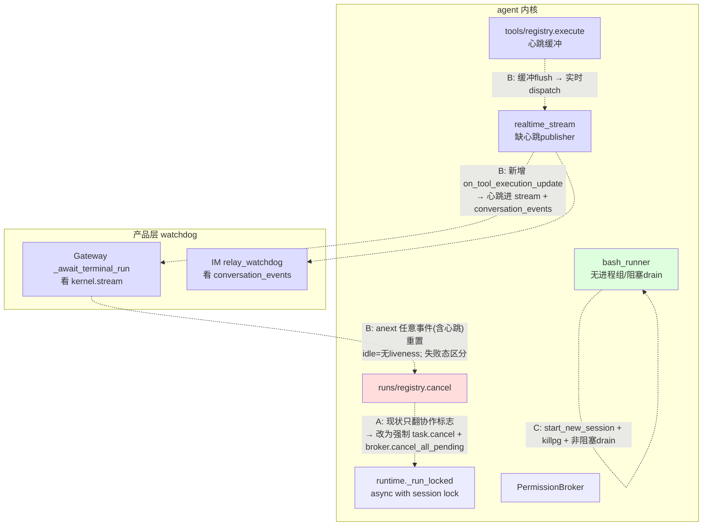
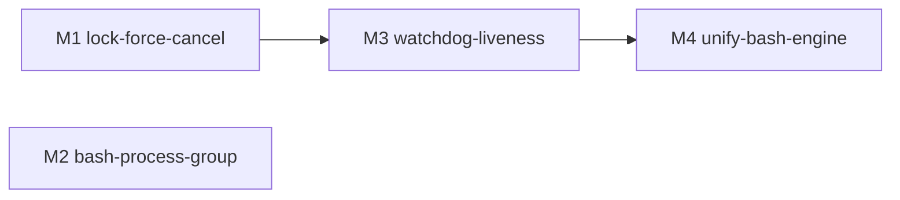

# bugfix-417: 超时/卡死工具锁死会话三层事故链 — 技术方案

> 对齐: incident.md v1
> Unit branch: `unit/bugfix-417` (will be created by orchestrator)

## Changelog

- round 1 后 A 升级第四轮 design-review 采纳：M4 加"经 build_kernel 真实 wiring 的端到端集成测试"为 DONE 硬闸（不再让人手 live 复验做唯一端到端守卫，决策 8 测试策略）；M4 [worker] 加 ShellRunner docstring/唯一引擎声明、前台心跳复用 M3 `run_coroutine_threadsafe` 线程桥；数据流补 background 路径 liveness 划界；M2 标 superseded by M4。

## 现状分析

### 涉及范围

| 文件 | 当前职责 | 本 unit 改动 |
|---|---|---|
| `src/agent/core/runs/registry.py` | 运行登记 + Task 生命周期；`cancel(run_id)`（:464）只 `controller.cancel()` 翻协作标志；`_owned_tasks[run_id]`（:126）持有承载 run 的 `asyncio.Task`，仅 `drain_async` 关停时 `task.cancel()` | **A 主改**：`cancel` 复用 `_owned_tasks` 强制取消 Task |
| `src/agent/sdk/kernel.py` | 对外面；`cancel`（:959）转发 `runs_registry.cancel` | **A 主改**：cancel 时连带 `permission_broker.cancel_all_pending(run_id)` |
| `src/agent/core/agent/runtime.py` | `_run_locked` 整轮在 `async with lock`（:278）内；已有 `asyncio.CancelledError` 路径（:577，bugfix-410-M2 R1 为 watchdog 取消 parked await 准备，含孤儿 tool_call 在 `finally` 用 `asyncio.shield` 恢复）；非流式（:276 `del stream`） | **B 改**：LLM await 期补 liveness 心跳 |
| `src/agent/core/tools/registry.py` | `StreamingToolExecutor.execute`；`_emit_execution_update`（:206）只 append 到 `_pending_updates`；`asyncio.to_thread(tool.run)`（:234）阻塞整个工具时长；跑完才循环 flush（:247） | **B 主改**：实时 dispatch 心跳（同步回调桥回 loop） |
| `src/agent/platform/hooks/builtins/realtime_stream.py` | observe hook → `publish_session_event`，现仅 `tool_start`/`tool_end`/`assistant_message`/`turn_end` | **B 主改**：新增 `on_tool_execution_update` publisher |
| `src/agent/platform/tools/builtins/bash_runner.py` | bash 执行；`Popen`（:80）无 `start_new_session`；`process.kill()`（:117/:161）只杀直接子；`process.stdout.read()`（:166）阻塞 drain；selector 循环已实时发 `phase:running` 心跳（:150） | **C 主改**：进程组隔离 + killpg + 非阻塞 drain |
| `src/personal_assistant/gateway/inbound_pipeline.py` | Gateway watchdog `_await_terminal_run_async`（:822）：`anext` 120s 无事件 → `kernel.cancel` + `_emit_terminal_reconcile(reason="timed_out")` + raise；`awaiting_permission` 豁免（:853） | **B 改**：liveness 重定义 + 失败态区分 + 豁免一般化 |
| `src/IM/application/relay_watchdog.py` | IM DB sweep 兜底：按 `conversation_events` 最近行时间戳判 120s 静默 → flip failed + `relay.failed`；`awaiting_permission_at` marker 豁免（:80） | **B 改**：心跳进 conversation_events + 失败态区分 |
| `src/agent/platform/permissions/broker.py` | `PermissionBroker`；`cancel_all_pending(run_id=...)`（:194）已存在 | A 复用，**不改逻辑** |

### 既有约束

- **`core` 不能 import `platform`**：`PermissionBroker` 是 platform，core 经注入端口（`runtime._permission_broker` / `hook_context.permission_requester`）访问。心跳 liveness 机制不能让 core 依赖 platform；A 的 broker 取消必须在 `sdk/kernel.py`（同时持有 registry 与 broker）层编排，不下沉 core。
- **跨线程**：`runs/registry` 跑在专用 async loop 线程（`_async_loop`，:134）；`tool.run()` 又在 `asyncio.to_thread` 工作线程。同步回调（`execution_event_callback`）→ 异步 dispatch 必须经 `run_coroutine_threadsafe` / `call_soon_threadsafe`。
- **产品包只 import `agent.sdk`**：cancel 语义、心跳事件经 `kernel.cancel` / `kernel.stream` 暴露。
- **observe hook 失败 fail-open**（registry.py:384）：心跳 dispatch 失败不能拖垮业务流。

### 可复用能力（本 unit 主体是"接线"，非"造轮子"）

- `_owned_tasks[run_id]` Task 句柄 → A 强制取消（机制已在，仅 shutdown 用）。
- `PermissionBroker.cancel_all_pending(run_id)` → A 取消 broker pending future（resolve 为 deny）。
- `_run_locked` 的 `asyncio.CancelledError` 恢复路径（runtime.py:577-582）→ A 的锁释放 + 孤儿 tool_call 恢复，**已就绪**，无需新写。
- `execution_event_callback` 回调端口 + bash selector 循环已有的实时 `phase:running` 心跳 → B 的工具层心跳源。
- realtime_stream `observe → publish_session_event` 模式 → B 加一个 publisher，沿用同模式。
- `_emit_terminal_reconcile` + `relay.failed` payload 的 `reason`/`semantic` 字段 → 失败态区分沿用，不另造通路。
- IM `awaiting_permission_at` marker（Gateway 心跳刷新）→ 已是"Gateway 存活"liveness 源，permission 域沿用。

### 相关历史

- **bugfix-361 / 383**（#22）：watchdog liveness 判据从 `created_at` 改 `last_event` 时间戳——已确立"按最近事件判存活"，本 unit 沿此方向把"事件"扩到含心跳。
- **bugfix-410-M2**（#98/#97/#82）：permission 豁免（`awaiting_permission` / `awaiting_permission_at`）+ `_run_locked` CancelledError 恢复 + 终态 reconcile。本 unit 把"豁免"一般化为统一的 liveness 模型，并真正接上触发 CancelledError 的 `task.cancel()`。
- **feat-414**：running 气泡 `elapsed_ms` 是**前端**按 `tool_start` 时间戳计时，**非**服务端心跳——所以气泡在转圈，服务端却收不到 liveness，watchdog 照杀。本 unit 补的是服务端 liveness 通路。

> **契约层 grounding 结论**：读 `docs/specs/{kernel,im,gateway,cli}/spec.md` 与代码核对——现有契约层对"run 取消语义""watchdog 收尸判据""工具超时进程回收"无显式 Requirement（watchdog 是防御性补丁演进而来，未沉淀为契约）。本 unit **新增**这些对外行为契约，无 drift 需修。

## 架构总览

事故链 `C 触发 → B 误杀 → A 锁死`，三层独立缺陷。修复对应三个独立改动面，**文件不重叠**：



- **A（红，M1）**：`registry.cancel` 强制取消承载 Task + `kernel.cancel` 连带取消 broker。复用现成 `_owned_tasks` / `cancel_all_pending` / runtime CancelledError 恢复路径——**只接线**。
- **B（蓝，M3）**：心跳从工具/LLM 两层实时流到两个 watchdog；watchdog 重定义为 liveness 驱动；超时与卡死区分失败态。
- **C（绿，M2）**：bash 起独立进程组、超时杀整组、非阻塞 drain。**单文件**。

**before/after 一句话**：现状任一"活着但安静"的工具会因输出静默被误杀，误杀后合作式 cancel 停不下 parked run，session 锁永不释放；改后心跳让"活着"可见、watchdog 只收真不前进的 run、强制 cancel 保证锁总能释放、bash 超时连进程树一起回收。

## 关键决策

### 决策 1（A）: `kernel.cancel` 强制取消承载 Task + 连带取消 permission broker

**选了"`registry.cancel` 经 `loop.call_soon_threadsafe` 强制 `_owned_tasks[run_id].cancel()`，`kernel.cancel` 再调 `broker.cancel_all_pending(run_id)`"**。让 `async with lock` 经 `CancelledError` 异常路径退出释放锁。

- **理由**：强制取消 Task 与 broker 取消两个零件都现成（`_owned_tasks`、`cancel_all_pending`），runtime 的 CancelledError 恢复路径也已就绪（含孤儿 tool_call 在 `finally` 用 `shield` 恢复）。缺的只是把 `task.cancel()` 接进普通 cancel 路径。最小改动闭合 P0 不变量"没有任何单条 run 能让 session 锁永久不可释放"。
- **拒绝**：保留纯合作式 cancel（parked run 查不到标志，停不下）；杀整个 session/loop（波及无辜 run，过宽）。
- **风险**：`task.cancel()` 在 run 阻塞于 `asyncio.to_thread(tool.run)`（bash 阻塞读）时，**协程立即 unwind 释放锁**，但底层线程跑到阻塞读返回才退——锁已释放（达标），残留线程是资源泄漏，由 C（非阻塞 drain）兜底。两层叠加才彻底干净。

### 决策 2（B）: liveness 心跳作为事件实时流入两个 watchdog

**选了"工具层 + LLM-await 层各发周期 liveness 心跳，经 observe→publish 走与 tool_start 同一条通路进 `kernel.stream`（Gateway）与 `conversation_events`（IM）"**。

- **理由**：两个 watchdog 都已"按最近事件判存活"（bugfix-383），把心跳做成事件就天然复用现有判据，无需各自加特例。沿用 realtime_stream 的 observe→publish 模式，不另造通路。
- **拒绝**：单一无条件后台 ticker（只要 Task 对象在就 tick）——会掩盖真死锁（CPU 死循环在 to_thread 不阻塞 loop，ticker 照 tick → watchdog 永不触发，违反不变量 2）。心跳必须由"确实在前进的执行层"发出，证明的是 progress 而非"对象存在"。
- **风险**：心跳事件量（bash 实时心跳）可能偏多——以 `heartbeat_interval` 节流到 watchdog 友好的粒度（默认远小于 120s，取 ~5–15s 上报间隔，见决策 3），避免事件风暴；observe 失败 fail-open（已有），心跳丢失最坏退化为按业务事件判存活。

### 决策 3（B）: 心跳来源 = 工具实时心跳（解缓冲）+ LLM-await ticker；watchdog idle 重定义

**选了"un-buffer bash `phase:running` 心跳实时 dispatch + LLM 调用期跑一个 await-bound ticker；watchdog idle = N 秒内无任何事件（业务或心跳）→ 判不再前进 → 强制 cancel + 报『中断』"**。

- **理由**：覆盖 incident 列的两类"活着但安静"空窗——跑静默长命令（bash 心跳）、等 LLM 返回（非流式，整段无事件 → LLM-await ticker）。LLM-await ticker 仅在 in-flight LLM 调用期存活、调用返回即停，其 dead-connection 由 LLM client 自身 timeout 兜底（max-duration 归 deadline，不归 watchdog）。watchdog 退化为纯 liveness 探测器。
- **拒绝**：逐特例豁免（issue 反模式）；给 watchdog 加时长上限（混淆 idle 与 max-duration）。
- **风险**：上报间隔取值——必须 `心跳间隔 << watchdog timeout`（建议心跳 ≤15s、watchdog 维持 120s），否则抖动期仍可能误杀；取值在 worker 实现期定，单测覆盖边界。

### 决策 4（B）: permission 等待作为第三个 liveness 源，由**内核** emit 进 stream，两侧 watchdog 零特例真镜像

**选了"内核在 run parked-on-permission 期周期 emit liveness 进 `kernel.stream`（与工具/LLM 心跳同一通路、同一事件类型），两个 watchdog 都退化为『任意 liveness 即维持存活』，移除 Gateway 的 `if awaiting_permission` 分支与 IM 的 `awaiting_permission_at` 专用 marker"**。

- **理由**：permission liveness 必须进 `kernel.stream` 才能被 Gateway 的 `anext` 看到——runtime(core) 本就持 `permission_requester` 端口、`permission_request` 事件本就由内核 emit 进 stream（inbound_pipeline.py:892），用与决策 3 的 LLM-await 完全相同的 await-bound ticker 在权限等待期发心跳即可。这样 permission 成为 kernel delta liveness 源的第三项，两个 watchdog 自动复用现有"按最近事件判存活"判据，**无任何 permission 专用分支**——这才是 issue"豁免一般化"的真正落地，也消除了 Gateway(心跳驱动) vs IM(marker) 的机制不对称（reviewer Rec #1）。
- **拒绝**：① "Gateway 自发 `permission_pending` 心跳"——Gateway 自 emit 的事件不在 `kernel.stream` 里，进不了 `anext`，移除特例分支后 parked run 仍会被误收（reviewer WARNING，本设计原稿的缺陷）。② 保留 `awaiting_permission` 枚举分支 / `awaiting_permission_at` 专用 marker（issue 反对的逐特例补丁，且与统一通路冗余）。
- **崩溃检测仍保住**：内核随 Gateway 进程内运行，Gateway/内核崩溃 → 心跳停 → 两侧 watchdog 在 N 秒（120s）内正常收尾，比旧 `permission_crash_threshold_seconds`(600s) 更快，严格更优。人类决策时长不再受上限约束（存活期心跳不断）。
- **风险**：permission 心跳周期需 `<< watchdog timeout`（同决策 3 取值）；IM 侧若用"刷新存活标记列"承接心跳（见数据流"二选一"），该列是**通用 liveness 标记**（非 permission 专用），不重蹈特例。

### 决策 5（B+C）: 超时与卡死区分两种失败态

**选了"两个独立终态原因：`tool_timeout`（耗时过长，来自工具自身 deadline 如 bash timeout）vs `stalled`（已中断/卡死，来自 watchdog liveness 判定），分别落 `relay.failed` payload 的 `reason`/`semantic` 与 IM 失败气泡文案"**。

- **理由**：incident Req C 要求用户侧区分，也是 B 重设计的可验证投影（reviewer 从气泡文案即可确认 idle 与 max-duration 真拆开）。bash 自身 timeout 已产 `timed_out` 终态 → 映射"耗时过长"；watchdog 强制 cancel → 映射"中断"。
- **拒绝**：两种失败共用一句中性文案（无法验证拆分、误导用户排查）。
- **风险**：现有 `_emit_terminal_reconcile(reason="timed_out")` 同时被"工具超时"和"watchdog 误杀"复用——需按真实来源分流 reason，避免把 watchdog 收尸也标成"耗时过长"。
- **盘点既有常量**（reviewer Rec #2）：`_emit_terminal_reconcile` 现已有 `reason="interrupted"`（inbound_pipeline.py:913/:920，显式 abort/interrupt 路径）。M3 引入 `tool_timeout`/`stalled` 前须盘点 `interrupted` 的语义归属——`stalled`（watchdog liveness 判定的卡死）与 `interrupted`（用户/系统显式打断）是不同成因，用户侧文案可都归"中断"但 reason 常量应区分清楚，避免新增常量与旧常量语义重叠、留下孤儿分支。watchdog idle 路径现用的 `timed_out`(:869) 应改名 `stalled`。

### 决策 6（C）: bash 进程组隔离 + killpg + 非阻塞 drain

**选了"`Popen(..., start_new_session=True)` 起独立进程组；超时改 `os.killpg(os.getpgid(pid), SIGTERM)` 宽限后 `SIGKILL` 杀整组；收尾 drain 改带超时/非阻塞读，杜绝线程挂死"**。

- **理由**：直击 C 根因——孤儿孙进程持 stdout 写端致阻塞 read 永等 EOF。killpg 杀整棵树，非阻塞 drain 保证执行线程必然解封。
- **拒绝**：只 `process.kill()`（孙进程孤儿化）；保留阻塞 `read()`（孤儿持写端则永挂）。
- **风险**：`start_new_session` 改变信号语义（脱离调用方进程组）——需确认不破坏现有 bash 工具的 Ctrl-C / 前台输出语义（feat-414 / bugfix-354 涉及的回显路径）；先 SIGTERM 宽限再 SIGKILL，给子进程 flush 机会。

### 决策 7: max-duration 不引入 run 级硬上限（非目标）

**选了"只靠工具自身 deadline，不加 run 级墙钟预算"**（incident Q3 确认）。

- **理由**：bash 是最常见长工具且已有 `timeout`；只要工具持续发 liveness 即视为正常。run 级预算是新机制，撑大 scope，偏离修事故链主线。
- **拒绝**：本期引入 run 预算（用户明确判定边缘场景"问题不大"）。
- **风险**：无 deadline 又持续吐心跳的死循环工具无人收——边缘，用户可自行加 `timeout`；文档提示即可。

## 接口与数据流

### A: 强制 cancel 时序

```mermaid
sequenceDiagram
  participant WD as Gateway watchdog
  participant K as kernel.cancel
  participant REG as registry.cancel
  participant LOOP as registry async loop
  participant RT as _run_locked (parked)
  participant BRK as PermissionBroker

  WD->>K: cancel(run_id)  (idle 判定后)
  K->>REG: cancel(run_id)
  REG->>REG: controller.cancel() (保留)
  REG->>LOOP: call_soon_threadsafe(task.cancel)
  LOOP-->>RT: raise CancelledError (parked await 点)
  RT->>RT: except CancelledError → finally: shield 恢复孤儿 tool_call
  RT-->>REG: async with lock 退出 → 锁释放 ✅
  K->>BRK: cancel_all_pending(run_id) → pending future resolve=deny
```

关键签名（仅形态，实现留 worker）：
- `RunsRegistry.cancel(run_id)`：新增"若 `_owned_tasks` 有该 run 的未完成 Task，经 `_async_loop.call_soon_threadsafe(task.cancel)` 强制取消"。幂等（已终态/无 Task 则跳过）。
- `Kernel.cancel(run_id)`：在 `runs_registry.cancel` 后，若持有 `permission_broker`，调 `permission_broker.cancel_all_pending(run_id=run_id)`。

### B: 心跳数据流

```mermaid
sequenceDiagram
  participant BASH as bash_runner (to_thread)
  participant TREG as tools/registry execute
  participant LOOP as run async loop
  participant RS as realtime_stream
  participant HUB as event hub / kernel.stream
  participant GW as Gateway watchdog
  participant IM as IM conversation_events / relay_watchdog

  BASH->>TREG: execution_event_callback(phase:running, elapsed_ms)  [实时, 每≤15s]
  TREG->>LOOP: run_coroutine_threadsafe(_dispatch_observe("tool_execution_update"))
  LOOP->>RS: on_tool_execution_update(event)
  RS->>HUB: publish_session_event("run_heartbeat", {run_id, elapsed_ms})
  HUB-->>GW: anext 收到事件 → 重置 120s ✅
  HUB-->>IM: relay 消费 → 写 conversation_events 行 → last_evt 推进 ✅
  Note over GW,IM: LLM-await 与 parked-on-permission 期均由 runtime 的 await-bound ticker 发同类心跳进 stream
```

- 新事件类型 `run_heartbeat`（或复用 `tool_execution_update` 的 stream 投影），payload 至少 `{run_id, phase, elapsed_ms}`。**仅作 liveness**，前端可忽略其内容（不强制渲染，避免 UI 噪音）。
- **三个 liveness 源，全部进 `kernel.stream` 同一通路**：① 工具执行（解缓冲的 bash 实时心跳）；② 等 LLM 返回（runtime await-bound ticker）；③ **等权限决策（runtime 在 parked-on-permission 期同款 ticker emit）**——三者用同一事件类型，两个 watchdog 一视同仁。
- `tools/registry`：移除 `_pending_updates` 缓冲，`_emit_execution_update` 改为捕获 execute 时的 loop 句柄、经 `run_coroutine_threadsafe` 实时调度 `_dispatch_observe`。
- `realtime_stream`：新增 `on_tool_execution_update` → `publish_session_event`。
- `runtime`：LLM 调用与权限等待各包一层 await-bound ticker（await 前起、返回/异常/resolve 即停），周期发同类心跳事件。permission 心跳进 stream 后，Gateway `anext` 与 IM `conversation_events` 都自动看到，**无需** Gateway 自发心跳或 IM 专用 marker（决策 4）。
- **IM 通路接线点**：Gateway `_map_kernel_event_to_run_activity`（inbound_pipeline.py:950）对未映射事件返回 `None`——心跳必须在此新增映射（或走专用 liveness relay），否则到不了 IM，IM watchdog 看不到。心跳进 IM 后推进该消息的存活判定（append `conversation_events` 行刷新 `last_evt`，**或**刷新轻量存活标记列，避免高频写放大——二选一由 M3 定，可观察结果是"活跃 run 不被 IM watchdog 误收"）。
- **失败态字段复用**：`_emit_terminal_reconcile(reason=...)` 现以 `reason="timed_out"` 同时表征 watchdog 误杀（应改 `"stalled"`/中断）与真·工具超时（`"tool_timeout"`/耗时过长）——M3 按真实来源分流 reason（决策 5）。

### watchdog 重定义（伪逻辑）

```
# Gateway _await_terminal_run_async
event = await wait_for(anext(stream), timeout=N)   # 任意 stream 事件(业务/工具心跳/LLM心跳/permission心跳)都重置
on TimeoutError:                                    # N 秒无任何 liveness
    kernel.cancel(run_id)                           # A 的强制 cancel
    emit_terminal_reconcile(reason="stalled")       # 报"中断/卡死"(决策5)
    raise
# 移除 awaiting_permission 分支(决策4) —— permission 心跳已进 stream,无需特判
# IM relay_watchdog 同步: 移除 awaiting_permission_at 专用 marker,统一按 conversation_events 最近事件(含心跳)判存活

# 工具自身 deadline 命中(bash timeout) → 终态 reason="tool_timeout" → "耗时过长"(决策5)
```

## 契约层增量 (delta-spec)

> 本 unit **重定义** watchdog 判据与失败态映射——这些行为 evergreen 早有契约（其一正是 bug 的契约化身），故 delta 必须 **diff 既有 canonical**，用 MODIFIED/REMOVED 顶替既有条目，不能只 ADDED（否则收尾合并后 canonical 自相矛盾）。

- kernel: `specs/kernel/spec.md`
  - **MODIFIED** `运行可被中断与取消`（canonical 原仅断言 status=cancelled+幂等；本 unit 强化为强制终止 parked run + 释放 session 锁 + 取消待决 permission）。
  - **ADDED** `alive-but-quiet 窗口经 stream 持续发出 liveness 事件`（净新增：工具/LLM/权限三类窗口同通路发心跳）。
- gateway: `specs/gateway/spec.md`
  - **MODIFIED** `入站消息按四步决策路由并回发原通道原目标`（其内 idle 看门狗 scenario：输出静默判据 → liveness 心跳判据；移除 permission 特例豁免；补长命令/等 LLM 不误杀）。
  - **MODIFIED** `run 进入终态时对在飞 tool_call 按原因收口`（watchdog-reap 原因「执行超时」→「已中断」；新增工具自身 deadline →「执行超时」）。
- im: `specs/im/spec.md`
  - **REMOVED** `等人工权限决策的消息不被中继看门狗误判为失败`（泛化掉）。
  - **ADDED** `中继看门狗按 liveness 判存活，不误杀活着但安静的消息`（统一三类窗口 + 崩溃兜底）。
  - **MODIFIED** `工具徽标按中断原因显示终态`（徽标失败原因映射：工具自身超时→「执行超时」、watchdog/异常→「已中断」）。
- cli: no spec delta（CLI 经 `kernel.cancel` 间接受益于强制取消，但本 unit 不新立 CLI 中断行为契约）。
- **C 层 / bash（M2）no spec delta**：Req D"派生子进程命令超时干净收尾"不是新契约——evergreen kernel `docs/specs/kernel/spec.md:218-220`「bash 超时 → 暴露稳定超时细节而非静默挂起/丢失」早已存在，本 unit C 层是修该既有契约对**派生子进程**命令不成立的 bug（恢复符合），故无新增/修改契约。
- **A 升级（M4）no spec delta**：bash 引擎统一是**内核内部（platform）重构**，对外行为增量已由上述 kernel/gateway/im delta 声明；M4 只是让这些已声明的契约在**生产路径**真生效，无新增对外契约。

## A 升级：bash 引擎统一（round-1 验收后根因升级）

> round-1 reviewer FAIL（B1 静默长命令仍被误杀、C1 超时 reason=null）。orchestrator 取证定位到比"改错方法"更深一层的根因，用户拍板按架构最优解，不留技术债。本段是对 M1/M2/M3 之上的根因升级，**incident 的 Req A/B/C/D 不变**。

### 根因（取证结论）

- `agent.sdk/kernel.py:417` 的 `build_kernel` **无条件** `wire_background_tasks` → `BashTool` 永远有 wiring → 生产前台/后台 bash 永远走 `_run_foreground`/`_run_background` → **`ShellRunner`**（`agent.platform/background_tasks/shell_runner.py`）。
- 已核实 `coding_cli` 与 `personal_assistant` **都**经 `build_kernel` 建 kernel（cli: product.py:142）→ 两产品当前都用 ShellRunner。
- `BashRunner.run_stream` / `_run_legacy_sync`（bash.py:240，`wiring is None` 分支）是**生产死路**，仅单测（wiring=None）执行。
- **M2 的 killpg/drain（在 run_stream）、M3 的 bash 心跳/reason（在 _run_legacy_sync）全落在死路上** → 生产 ShellRunner 一项没有 → live 下静默长命令零心跳被误杀、超时无 reason。这是 live 全挂的最深根因，也是两套平行 bash 引擎（一活一死、修了死的）这一系统性技术债的体现。

### 决策 8：硬化 ShellRunner 为单一 bash 执行引擎，删除死路 run_stream

**选了"把 ShellRunner 硬化成唯一引擎（进程组 + killpg 杀整树 + 实时心跳进 run 事件流 + 非阻塞 drain + 超时 reason_code），删除 `BashRunner.run_stream` + `_run_legacy_sync` + `wiring is None` 分支，单测改打 ShellRunner"**。

- **理由**：消除"一活一死"的平行引擎——正是它让 M1/M2/M3 修在死路上、骗过单测、live 全挂。统一到唯一生产引擎，杜绝"下次再漏一处"。架构最优，不背技术债。
- **拒绝**：① "ShellRunner 委托 run_stream 复用硬化核"——run_stream 是死路，把活路由进死核是反的；② 只把三项 port 进 ShellRunner、保留 run_stream（B）——留两套引擎=留技术债，下次还漏。
- **风险**：硬化碰的是**当前生产活路**，回归风险全在这（见风险表）；删除碰的是死代码（零用户影响，已验证）。
- **测试策略（incident 元教训）**：本事故本质 = 单测全绿 / live 全红——M2/M3 的 killpg/心跳/reason 各有孤立单测且通过，但生产走 ShellRunner，全部撒谎。心跳链横跨 `build_kernel→ShellRunner→ctx→tools/registry executor→realtime_stream publisher→watchdog` 五层，孤立单测证明不了它真到 watchdog（B1 失败正是此）。故 M4 守卫**不能只押人手 live 复验**，必须有经真实 `build_kernel` wiring 的端到端集成测试断言"静默长命令 → stream 真冒 `run_heartbeat`""bash timeout → `reason=tool_timeout`"，把守卫从人手变成自动化回归（写入 M4 [worker] 退出标准）。

### 决策 9：硬化采"最小侵入 pump 模型"，不替换 I/O 架构

**选了"在 ShellRunner 现有 pump→文件模型上加 killpg + 心跳 + reason，不替换成 run_stream 的 selector 模型"**。

- **理由**：ShellRunner 的 pump→文件是 bugfix-354 前台回显、feat-414 计时的现行正确实现；替换 I/O 架构会把回显回归面拉满。最小侵入降低对当前体验的扰动。
- **拒绝**：把 ShellRunner 重写成 selector 模型——回归面过大、收益仅"代码风格统一"。
- **风险**：pump 模型加 killpg/心跳的接缝要确保不改输出落盘/截断语义。

### M1/M2/M3 存留与改动

| 已合产物 | 在死路还是活路 | 处置 |
|---|---|---|
| M1 registry/kernel 强制 cancel | 活路（与 bash 引擎无关）| **保留** |
| M3 watchdog 重定义 / liveness ticker / realtime_stream publisher / tools-registry 实时 dispatch | 活路（executor 级，包任何 tool.run）| **保留** |
| M2 killpg/drain（在 run_stream）| **死路** | 能力**重落到 ShellRunner**，删死路；M2 milestone 标 superseded by M4 |
| M3 bash 心跳源 + reason（在 _run_legacy_sync）| **死路** | 由硬化后 ShellRunner/`_run_foreground` 供给，接已活的 executor→publisher→watchdog 链 |

### 接口与数据流（A 增量）

- **心跳源（活路）**：bash 在 ShellRunner 执行期产生 phase:running → 经 `ctx.emit_execution_event`（`_run_foreground` 持 ctx；后台框架经回调）→ tools/registry 实时 dispatch（M3-R1，已活）→ realtime_stream publisher（M3-R2，已活）→ `run_heartbeat` 进 stream。即 M3 的下游链全复用，只把**源**从死路换到 ShellRunner。
- **前台等待 liveness**：`_run_foreground` 的 `completed_event.wait(budget)` 改为带心跳的轮询等待（它持 ctx），覆盖前台等待期。`_run_foreground` 在 `to_thread` 工作线程发心跳，**必须复用 M3 已建的 `run_coroutine_threadsafe` 线程桥**把事件投回 async loop，不另起新通路。
- **background 路径 liveness 边界**：后台 bash（auto-background / 非前台任务）**不持会话锁、不被 watchdog 等待**，故无需 run-liveness 心跳——worker 只为前台执行期补心跳，勿为后台路径过度构建。
- **reason**：ShellRunner 超时 `on_fail` 带可区分的超时信号 → `_run_foreground` 映射 `reason_code="tool_timeout"`（同 `_run_legacy_sync` 现做法），贯通到 IM `tool_call.reason` → 前端"执行超时"。
- **killpg**：ShellRunner 的 `Popen` 加 `start_new_session=True`；`_monitor` 超时与 `_stop_task` 改 killpg 杀整组 + 宽限升级（判整组存活，非直接子）。

## 风险与回退

| 风险 | 应对 |
|---|---|
| `task.cancel()` 释放锁但 to_thread 线程残留（A 单独落地时） | C（非阻塞 drain + killpg）兜底；A/C 同 unit 闭环。回退：A 可独立 revert，恢复合作式 cancel（退回现状，不更坏）。 |
| 心跳事件风暴拖累 stream/DB | 上报间隔节流（≤15s）；observe fail-open，心跳丢失退化为按业务事件判存活。 |
| 心跳间隔 ≥ watchdog timeout 仍误杀 | 硬约束 `心跳 << timeout`；单测覆盖"长静默命令不被收""间隔边界"。 |
| `start_new_session` 破坏 bash 回显/信号语义 | 决策 6 SIGTERM 宽限 + 保留 selector 实时回显；回归 feat-414/bugfix-354 的前台输出测试。 |
| 两侧 watchdog 阈值/失败态语义漂移 | Gateway 与 IM 失败 reason 用同一组常量（`tool_timeout`/`stalled`）；delta-spec 双包同步。 |
| 移除 IM `awaiting_permission_at` marker 后，崩溃期权限等待无人收 | 决策 4 已论证：内核随 Gateway 进程内，崩溃→permission 心跳停→两侧 120s 内正常收（比旧 600s 更快）。单测覆盖"崩溃停心跳→被收"。回退：保留 marker 作为兜底（退化为现状，不更坏）。 |
| **A 硬化 ShellRunner 碰当前生产活路 → 改坏现有 bash 体验** | 这是 A 的主风险。硬回归闸（[worker] 退出标准）：bash 输出/退出码/截断语义不变（bugfix-354 前台输出、feat-414 计时）、停止/中断行为不变、`start_new_session` 不破坏现行 stopper/cancel 停止路径。**CLI + PA 双产品 live 复验**通过方可 DONE。决策 9 取最小侵入 pump 模型降低回显回归面。 |
| 删 run_stream/_run_legacy_sync 误删活路 | 已核实两产品都经 build_kernel 无条件 wire、run_stream 无其它生产调用方（仅死路 + 单测）。删前 worker 再 grep 确认零生产调用方；单测改打 ShellRunner。回退：保留 run_stream 不删（仍能闭合 incident，只是留死代码技术债）。 |

**回滚方案**：M1（cancel）、M3（watchdog/liveness 活路部分）可独立 revert 回现状。M4（A 引擎统一）若 live 回归：先回退"删 run_stream"（恢复死路，无害）再排查 ShellRunner 硬化；硬化本身可逐项（killpg / 心跳 / reason）独立 revert，每项回退退回现状（incident 在该项上重现，但不更坏）。

## Runbook for Reviewer

本 unit 改内核库 + Gateway + IM，reviewer 走旅程前需重启 IM 与 Gateway（内核进程内随 Gateway 重启）。

| 服务 | 停止命令 | 启动命令 | 健康检查 |
|---|---|---|---|
| IM | `stop_pidfile .im.pid`（或 `lsof -ti:8011 \| xargs kill`） | `IM_JWT_SECRET="demo-jwt-secret-for-feat340-testing" PYTHONPATH=src python -m uvicorn IM.app:app --host 0.0.0.0 --port 8011 > .im.log 2>&1 & echo $! > .im.pid` | `curl -s localhost:8011/im/v1/health`；Web IM `http://127.0.0.1:8011/` |
| Gateway（内核进程内） | `PYTHONPATH=src python -m personal_assistant.main stop` | `PYTHONPATH=src python -m personal_assistant.main`（默认配置 `~/.nano-assistant/config.yaml`） | `gateway.pid` 存在且进程在；发一条消息能秒回 completed |

> 验证三层闭环的旅程脚本见各 Requirement Scenario：A（超时/卡死后同会话发新消息能恢复）、B（跑 `sleep 200 && echo done` 这类静默长命令不被 120s 误杀 / 跑 `timeout 5 sleep 200` 报"耗时过长"）、C（`npm run build` 这类派生子进程命令超时后会话可继续）。
>
> **M4（A 引擎统一）双产品回归**：除 PA(IM+Gateway) 旅程外，还须 CLI 侧 live 验 bash 体验不回归——`PYTHONPATH=src python3 -m coding_cli.main` 跑普通命令（输出/退出码正常）、长静默命令（不被误杀）、超时命令（报"执行超时"）、Ctrl-C/停止（正常中断）。CLI 与 PA 当前都经 build_kernel→ShellRunner，硬化 ShellRunner 同时影响两者，故双产品都要 live 验。

## Milestones

三层缺陷文件不重叠，垂直切分为三个独立可交付 milestone。M1（A，P0 锁释放）与 M2（C，bash 进程组）无依赖可并行；M3（B，watchdog 重设计）的"真卡死→收尸→会话恢复"验收依赖 M1 的强制 cancel，故 depends M1。**M4（bash 引擎统一）是 round-1 验收暴露根因后的架构升级**：M2/M3 的 bash 改动落在生产死路 run_stream 上，M4 把能力重落到唯一生产引擎 ShellRunner 并删死路，depends M3（承接其已活的 executor→publisher→watchdog 链）。

| ID | 标题 | 依赖 | 并行组 | 范围 | 退出标准 |
|---|---|---|---|---|---|
| bugfix-417-M1 | lock-force-cancel | — | A | `src/agent/core/runs/registry.py`, `src/agent/sdk/kernel.py` | `[reviewer]` 覆盖 Req A（工具超时后会话自愈 / 真卡死被收后会话恢复）：超时/取消一条 run 后，同会话下一条消息无需重启 Gateway 即正常回复。`[worker]` `cancel(run_id)` 强制取消承载 Task 并触发 `_run_locked` CancelledError 释放锁的单测全绿；`kernel.cancel` 连带 `cancel_all_pending(run_id)` 单测；幂等（已终态/无 Task）单测。 |
| bugfix-417-M2 | bash-process-group | — | A | `src/agent/platform/tools/builtins/bash_runner.py` | **(superseded by M4)** killpg/drain 落在死路 `bash_runner.py`、Req D 当初验在死路上；能力由 M4 重落到生产引擎 ShellRunner，本 milestone 代码被 M4 删。历史退出标准：`[reviewer]` 覆盖 Req D（派生子进程命令超时干净收尾）；`[worker]` `start_new_session=True` + `os.killpg` 杀整组 + 非阻塞 drain 单测全绿。 |
| bugfix-417-M3 | watchdog-liveness | M1 | B | `src/agent/core/tools/registry.py`, `src/agent/platform/hooks/builtins/realtime_stream.py`, `src/agent/core/agent/runtime.py`, `src/personal_assistant/gateway/inbound_pipeline.py`, `src/IM/application/relay_watchdog.py` | `[reviewer]` 覆盖 Req B（静默长命令/等 LLM/等权限不误杀；真卡死被收）+ Req C（超时报"耗时过长"、卡死报"中断"、失败不静默）。`[worker]` 心跳实时 dispatch（解缓冲）单测；`on_tool_execution_update` publish 单测；LLM-await ticker 单测；两 watchdog idle 重定义 + 失败态区分（`tool_timeout`/`stalled`）单测；移除 `awaiting_permission` 特例后崩溃仍被收的回归。 |
| bugfix-417-M4 | unify-bash-engine | M3 | C | `src/agent/platform/background_tasks/shell_runner.py`, `src/agent/platform/tools/builtins/bash.py`, `src/agent/platform/tools/builtins/bash_runner.py`(删 run_stream), `src/agent/core/agent/runtime.py`, `src/personal_assistant/gateway/inbound_pipeline.py`, `src/IM/`(reason 常量/措辞), 前端徽标 | (post-acceptance fix→架构最优 root-cause 升级, round 1) **根因**：build_kernel 无条件 wire → 生产用 ShellRunner，`run_stream`/`_run_legacy_sync` 是死路；M2/M3 的 bash 改动全落死路、骗过单测、live 全挂（决策 8/9）。`[reviewer]` Req B/B1（`sleep 200` live 不被误杀、gateway.log 真有 run_heartbeat）+ Req C/C1（超时→IM `tool_call.reason=tool_timeout`→前端"执行超时"）+ Req D 生产路径复验（派生子进程超时整树回收无孤儿）+ **CLI/PA 双产品 bash 体验回归不变**。`[worker]` 硬化 ShellRunner（start_new_session+killpg 杀整组+实时心跳进 ctx 事件流+非阻塞 drain+超时 reason_code，最小侵入 pump 模型）；前台 `_run_foreground` 工作线程发心跳必须复用 M3 已建的 `run_coroutine_threadsafe` 线程桥，不另起新路；`_run_foreground` 等待期带心跳轮询；删 `run_stream`+`_run_legacy_sync`+wiring=None 分支（grep 确认零生产调用方后）、单测改打 ShellRunner；runtime permission 改用 `liveness_ticker`；reason 常量中心化（消 `watchdog_timeout`≠`stalled`）；收尸 content 措辞与徽标一致；ShellRunner 加 docstring 明写"前台+后台唯一 bash 引擎，bash_runner.py 已删"（消"哪个是真引擎"混淆，本 bug 的栖息地）。**端到端自动化集成测试（决策 8 测试策略，下列两条是 DONE 硬闸，非人手 live 替代品）：经真实 `build_kernel` wiring 跑静默长命令断言 `kernel.stream` 真冒 `run_heartbeat`、跑 bash timeout 断言 `tool_call.reason=tool_timeout`** + bash 输出/退出码/截断/停止语义逐条回归不变 + CLI/PA 双产品 live 端到端复验通过方可 DONE。 |



> **M3 推进顺序建议**（reviewer Rec #3，给 orchestrator/worker 参考，不预填 tasks.md）：M3 跨 5 文件是本 unit 最重的内聚垂直切片（心跳 liveness 端到端），**不可横切拆分**。建议 roadpoint 顺序：R1 工具心跳解缓冲（tools/registry 实时 dispatch）→ R2 `realtime_stream` 加 publisher → R3 runtime LLM-await + permission await-bound ticker → R4 两个 watchdog idle 重定义 + 失败态区分 + 移除两侧 permission 特例。orchestrator 派发时留足 worker 窗口。
