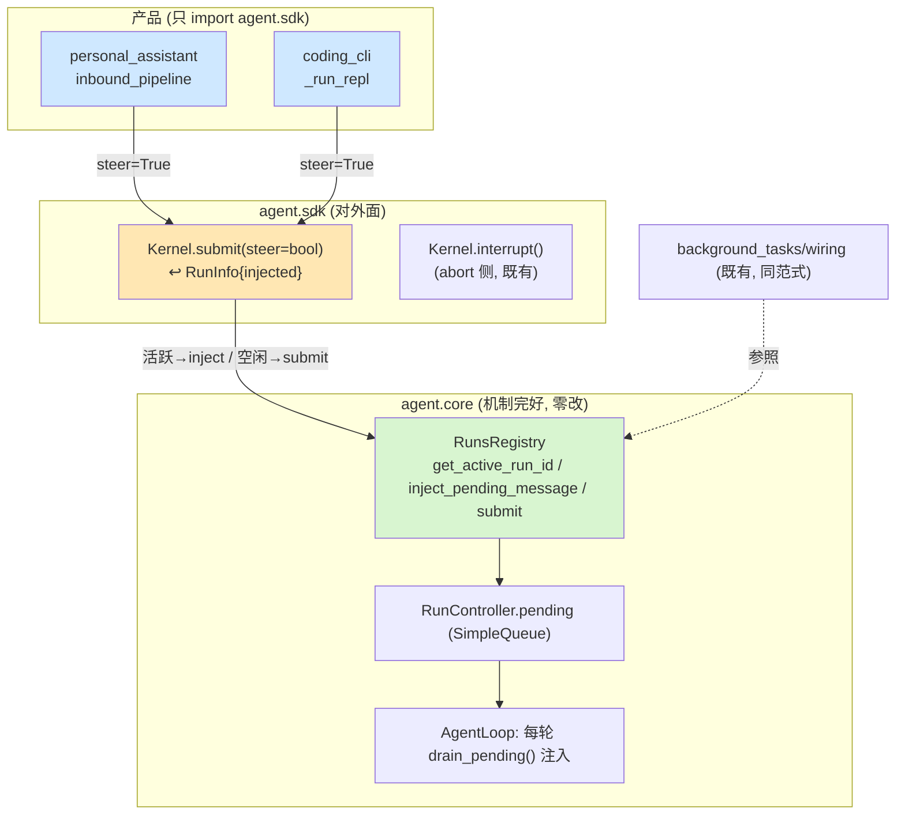
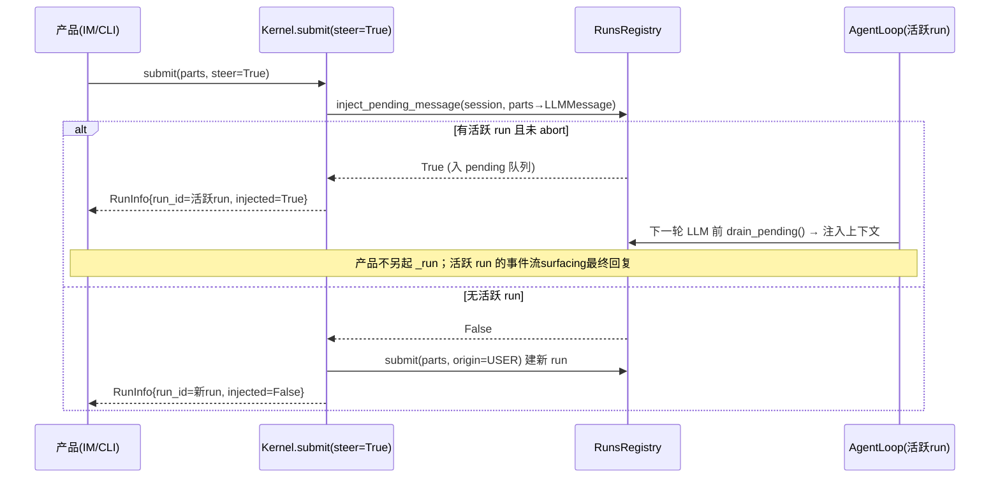
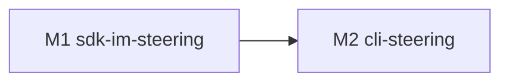

# bugfix-426: 运行中用户消息无法 steer 进当前 run — 技术方案

> 对齐: incident.md v1
> Unit branch: `unit/bugfix-426` (will be created by orchestrator)

## Changelog

<!-- design 阶段保持空 -->

## 现状分析

### 涉及范围

- `src/agent/core/agent/run_control.py` —— `RunController` 持 pending `SimpleQueue`，`enqueue_message(LLMMessage)` / `drain_pending()`。**完好，不改。**
- `src/agent/core/agent/loop.py` —— `AgentLoop` 每轮 LLM 调用前 `drain_pending()` 注入（round-boundary）。**完好，不改。**
- `src/agent/core/runs/registry.py` —— `get_active_run_id()`(:453)、`inject_pending_message()`(:508) 完好；run 结束竞态兜底 stranded 续跑(:635-648) **要改**（origin 硬编码 BACKGROUND_TASK + 文本重建丢多模态）。
- `src/agent/sdk/kernel.py` —— `Kernel.submit()`(:831) **要改**（加 steer 入参 + injected 返回）；`interrupt()`(:908) 已是 abort 侧，不动。
- `src/agent/sdk/dto.py` —— `RunInfo` **要改**（加 `injected` 字段）。
- `src/personal_assistant/gateway/inbound_pipeline.py` —— **要改**（投递前走 steer；现仅无脑 `_run_queue.submit`，`/stop` 已走 `_active_runs`+interrupt 可参照）。
- `src/coding_cli/commands.py` (`_run_repl`/`_send_message_async`) + `src/coding_cli/runtime/repl_runtime.py`(死代码) —— **要改**（恢复非阻塞输入 + 运行中走 steer）。

### 既有约束

- 产品（`coding_cli` / `personal_assistant`）只能 import `agent.sdk`，够不着 `agent.core`——注入能力**必须**经 SDK 面接出（对应 incident Q4）。
- `core` 不依赖 `platform`；注入机制全在 `core`，SDK 只做接出。
- pending 注入只在 run 活跃时成立（`get_active_run_id` 非空）；`inject_pending_message` 内部已持锁原子判定，返回是否入队。

### 可复用能力

- **`background_tasks/wiring.py:160` 的范式直接复用**：先 `get_active_run_id` 有活跃 run 则 `inject_pending_message`，否则 `submit` 新 run。这正是缺失的接线，SDK 把它收敛成一个原子方法。
- 内核 round-boundary 注入通道（`drain_pending`）**零改动复用**。
- `LLMMessage.content: str | list[dict]` 原生支持多模态 block——注入携带图片无需改载荷形状。

### 相关历史

- **feat-338-kernel-message-sse**（上游契约源）：spec.md 决策16/17 定义 `priority="next"`（注入活跃 run、复用 run_id、返回 `injected=true`）/ `priority="now"`（中断+新 run）；返回体含 `injected` 标志（spec.md:202/207-208）。
- **feat-337-cc-background-subagents**：design.md:526 定 FIFO 下一轮批量 drain；:528 定续跑 run origin 跟随活跃 run（通常 USER）。
- **refactor-387**（回归引入点）：`03f02376`(M2 CLI async REPL) + `8840e42f`(M3 Gateway 进程内) + `bc12a628`(M4 删 http_api) 把两产品重建到进程内 `agent.sdk`，新 submit 未接出 `priority=next`，SDK `priority` 参数删除——IM/CLI 注入双双断链。submit/observe 拆分与 `priority=now`(→`interrupt()`) 幸存。

> **契约层 grounding**：kernel/cli/gateway 的 `docs/specs/<包>/spec.md` 均未声明 mid-run 注入对外契约（能力被架空期间无契约可立），本 unit 新增 delta，不存在与代码 drift 的既有条目。

## 架构总览

bugfix-426 = 把 feat-338 的 `priority="next"` 需求语义，以进程内 `Kernel.submit(steer=True)` 形态在 SDK 面重新接出，复用纹丝未动的内核注入通道。改的只是"消费侧接线 + SDK 接出口 + 两处兜底"，内核机制零改。



before：产品用户消息一律 `submit()` 建新 run → 排队等当前 run 跑完（bug）。
after：运行中入口传 `steer=True` → 有活跃 run 就注入下一轮、无则照常建新 run。

## 关键决策

### 决策 1: SDK 注入 affordance = `Kernel.submit(steer=False)` + 返回 `injected`

**扩 `submit`，加 `steer: bool = False`；`steer=True` 时内核原子地"有活跃 run 则 inject、否则建新 run"，返回的 `RunInfo` 带 `injected: bool`。**（= feat-338 `priority="next"` 在进程内的形态）

- **理由**: 消费者只有一个心智"投递这条用户消息"，steer 与否由内核按活跃态决定；产品不再自己查 active run 再分支（那正是当年漏接的根源）。默认 `False` 零破坏现有调用方（text_runner / `--text` / main / 程序化提交）。运行中入口（IM inbound、CLI REPL）恒传 `True`——无活跃 run 时自动退化建新 run，无副作用。
- **拒绝**: 暴露 `get_active_run_id`+`inject_pending_message` 两原子给产品自拼（把竞态判断泄漏到每个产品，违背 Q4 统一复用）；独立新方法 `Kernel.steer()`（与 submit 的"无活跃则新 run"兜底重叠，调用方反要二选一）；重新引入三值 `priority` 枚举（`now` 已由既有 `interrupt()` 覆盖，再引入与 `interrupt` 重叠）。
- **风险**: `submit` 调用方多；加默认 `False` 保证现状不变，仅两个运行中入口翻 `True`。

### 决策 2: 注入消息携带完整 parts，附件与纯文本无差别

**注入用与 submit 同一套 parts→`LLMMessage` 转换，content 可为多模态 block 列表；带不带附件走完全相同路径。**

- **理由**: `LLMMessage.content: str | list[dict]` 原生支持图片 block，注入携带附件零障碍。"带附件退化排队"会制造文字能 steer、图片不能的体感分裂，无正当理由。
- **拒绝**: 注入仅 text、附件退化排队（人为分裂，错误）；注入丢附件（静默丢失）。
- **风险**: 无新增——注入与正常 turn 的 user 消息载荷一致。

### 决策 3: 续跑兜底保 origin=USER + 保完整 content（修 registry.py:635-648）

**run 结束竞态时 drain 出的 stranded 消息续跑，origin 跟随注入来源（用户 steer→`USER`，非硬编码 `BACKGROUND_TASK`），且 content 为 list 时原样保留（不降级成 text part）。**

- **理由**: feat-337:528 既定"续跑 origin 跟随活跃 run（通常 USER）"；现硬编码 `BACKGROUND_TASK` 会让用户 steer 消息在竞态路径被错标来源、并丢多模态内容。
- **拒绝**: 维持现状（错标 origin + 丢图片，与决策 2 自相矛盾）。
- **风险**: 续跑 origin 需知注入来源；由调用方在 inject 时携带 origin 元信息（实现层，worker 定具体载法）。

### 决策 4: CLI 恢复非阻塞 REPL 输入，运行中输入走 steer

**`_run_repl` 不再同步 `await` 整个 run；run 流作为 task 推进，输入循环并行读，运行中提交的输入走 `submit(steer=True)` 注入而非排队/阻塞。** abort 侧（`/stop` / Ctrl-C）维持既有 `interrupt()`。

- **理由**: CLI 现 `_run_repl` 全程 `await _send_message_async` 阻塞到 run 结束（commands.py:716），运行中根本无法输入；`ReplRunQueue` 是死代码。feat-338 §8.1 既定 CLI 保留"active run 注入 + 本地输入队列"。
- **拒绝**: 仅复活 `ReplRunQueue` 旧形（多引一层，与现 async REPL 结构不贴）——倾向直接 task 化 `_send_message_async` + 输入并行，最终具体改法由 M2 worker explore 定，design 只钉"运行中输入必须非阻塞且走 steer=True"。
- **风险**: 非阻塞输入 + 事件流并发渲染的终端竞争（输入行 vs 流式输出）；M2 需复用既有 reader 渲染管道，避免抢占输入行。

## 接口与数据流

### SDK 接口（决策 1）

```python
# Kernel.submit —— 仅新增 steer 参数，签名其余不变
def submit(self, *, session_id: str, parts: list[dict],
           origin: RunOrigin = RunOrigin.USER,
           workspace_root: Path | None = None,
           trace_id: str | None = None,
           steer: bool = False) -> RunInfo: ...

# RunInfo 新增字段
@dataclass
class RunInfo:
    run_id: str
    session_id: str
    status: str
    injected: bool = False   # True=注入了活跃 run(复用其 run_id); False=新建 run
    ...
```

`steer=True` 内部流程（收敛 background_tasks 范式，原子）：



### Gateway 数据流（决策 1，M1）

`inbound_pipeline` 在 `_run_queue.submit` **之前**（仿 `/stop` 走 `_active_runs` 的位置）：解析 binding → `kernel.submit(steer=True)`：
- `injected=True` → 不进 `_run_queue`，发 steer lifecycle，活跃 run 的常驻 SSE 订阅自然 surfacing 后续回复；
- `injected=False` → 照现状把 `_run` 入 `_run_queue`。

### CLI 数据流（决策 4，M2）

`_run_repl` 输入循环：run 进行中（流 task 未终态）时读到输入 → `kernel.submit(steer=True)`；空闲时照常新 run。

## 契约层增量 (delta-spec)

- kernel: `specs/kernel/spec.md` —— `Kernel.submit` 新增 steer 语义 + `injected`（agent.sdk 消费者可观察）
- im: no spec delta —— IM 中心服务仅中继消息，行为不变
- gateway: `specs/gateway/spec.md` —— IM 运行中用户消息注入活跃 run 下一轮
- cli: `specs/cli/spec.md` —— CLI 运行中输入注入活跃 run 下一轮（非阻塞）

## 风险与回退

- **竞态：inject 返回 False 与新 run 之间**——内核 `inject_pending_message` 持锁原子判定；run 恰好在 inject 时结束由既有 stranded 续跑兜底（决策 3 修正其 origin/content）。低风险。
- **Gateway steer 后回复归属**——注入消息的回复由活跃 run 的常驻 SSE 流 surfacing，不另起 `_run`；需确认 lifecycle 不重复发 bubble。M1 测试覆盖。
- **CLI 终端并发**（决策 4 风险）——非阻塞输入与流式渲染竞争输入行，M2 复用既有 reader 管道缓解。
- **回退**：两 milestone 均为加法（`steer` 默认 False）。回滚任一 milestone 只需让对应入口不传 `steer=True`，退回当前"排队"行为，无数据迁移。

## Runbook for Reviewer

| 服务 | 停止命令 | 启动命令 | 健康检查 |
|---|---|---|---|
| IM + Gateway (e2e 栈, M1 验收) | `./scripts/e2e-down.sh` | `./scripts/e2e-up.sh` | `source .e2e-ports.env && curl -s -o /dev/null -w '%{http_code}' $IM_URL/` = 200 |
| Coding CLI (M2 验收) | (前台进程，Ctrl-C) | `PYTHONPATH=src python3 -m coding_cli.main --model <model>` | REPL 提示符可输入 |

> M1 走 IM 旅程（运行中发消息看是否当前 run 下一轮被消费）；M2 走 CLI 旅程（run 执行中输入看是否注入、不阻塞）。

## Milestones

| ID | 标题 | 依赖 | 并行组 | 范围 | 退出标准 |
|---|---|---|---|---|---|
| bugfix-426-M1 | sdk-im-steering | — | A | `src/agent/sdk/kernel.py`(submit+steer)、`src/agent/sdk/dto.py`(RunInfo.injected)、`src/agent/core/runs/registry.py`(决策3 stranded 修正)、`src/personal_assistant/gateway/inbound_pipeline.py`(steer 接线) | `[reviewer]` IM 运行中发消息在当前 run 下一轮被带进上下文、不另起新 run（覆盖 Req-运行中下一轮注入 / Scenario-工具循环中途发消息·不掐工具·连发保序·空闲开新 run；Req-IM/CLI 两端 / Scenario-IM 运行中 steer）`[worker]` `submit(steer=True)` 有/无活跃 run 返回 `injected` 正确 + 注入携带多模态 parts + stranded 续跑 origin=USER；最窄相关单测全绿（kernel runs + gateway inbound） |
| bugfix-426-M2 | cli-steering | M1 | B | `src/coding_cli/commands.py`(`_run_repl`/`_send_message_async` 非阻塞)、`src/coding_cli/runtime/repl_runtime.py` | `[reviewer]` CLI run 执行中输入注入当前 run 下一轮、不阻塞、空闲仍开新 run（覆盖 Req-IM/CLI 两端 / Scenario-CLI REPL 运行中 steer）`[worker]` CLI 运行中输入走 `submit(steer=True)`；最窄相关 CLI 单测全绿 |


