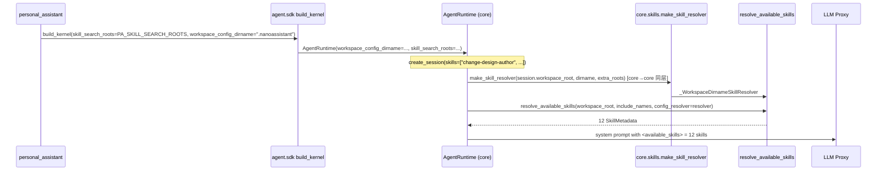

# bugfix-431: runtime skill resolution 与 preview 不一致 — 技术方案

> 对齐: incident.md v1
>
> Unit branch: `unit/bugfix-431` (will be created by orchestrator)

## Changelog

<!-- design 阶段保持空 -->

## 现状分析

### 涉及范围

- `src/agent/sdk/kernel.py`
  - `build_kernel()`：构造 `AgentRuntime` 和 `Kernel`；持有 `workspace_config_dirname` 和 `skill_search_roots`。
  - `Kernel.list_skills(workspace_root)`：已正确，每次调用时基于 `_workspace_config_dirname + _skill_search_roots` 构造 `_WorkspaceDirnameSkillResolver`。
  - `Kernel.assemble_prompt_preview()`：已正确（refactor-406-M3fix #3），同样构造 `_WorkspaceDirnameSkillResolver` 解析 `skill_ids`。
  - `_WorkspaceDirnameSkillResolver`（kernel.py:567-599）：per-call 构造，roots = `<workspace>/<dirname>/skills` + `extra_roots`。**纯逻辑、零 sdk 依赖**（只用 `Path`/list 去重），实现的是 core 的 `SkillRootResolver` Protocol——当前住在 sdk 只是历史位置，本 unit 将其下沉到 core（见决策 2）。
  - kernel.py:1150 / 1420 已 `from agent.core.skills... import resolve_available_skills`——sdk 向下 import core 是既有依赖方向。
- `src/agent/core/agent/runtime.py`
  - `AgentRuntime`：仍保留 `config_resolver: ConfigResolverLike | None` 字段；`build_kernel()` 未传值，故恒为 `None`。
  - `_resolve_session_available_skills*`：调用 `resolve_available_skills(..., config_resolver=self._config_resolver)`。
  - `AgentRuntime.config_resolver` property：被 `agent` 工具读取，用于子 agent 的 `load_skills` 校验。
- `src/agent/core/skills/discovery.py`
  - `resolve_available_skills(..., config_resolver=None)` 回退到 Codex-only 默认 roots。
  - 当 `config_resolver` 非 None 时，会**完全使用 resolver 的 roots，忽略传入的 workspace_root**——这是 legacy 固定 resolver 语义，不适合 2 层路径 per-workspace 需求。
- `src/agent/platform/tools/builtins/agent.py`
  - `_validate_new_agent_args()`：校验 `load_skills` 时用 `runtime.config_resolver`。
  - `_create_subagent_session()`：创建子 agent session 时传 `skills=load_skills`，子 agent 运行时同样受 `runtime.config_resolver` 影响。

### 既有约束

- `coding_cli` / `personal_assistant` 只能 `import agent.sdk`，不能反向 import `agent.core` / `agent.platform`。
- **`agent.core` 不能 import `agent.sdk`**（core 是最内层；`test_agent_sdk_boundary_contract.py` 守护）。这是决策 2 helper 归属的硬约束：放 sdk 而让 core 调用 = 反向依赖。
- `agent.core` 不能 import `agent.platform`。
- `refactor-406` 明确退役 `ConfigResolver`，不能复活。
- kernel 必须保持 product-neutral：只搜索 `build_kernel` 被告知的 roots。

### 可复用能力

- `_WorkspaceDirnameSkillResolver` 可直接复用（下沉到 core 后由 core runtime 与 sdk kernel 共用）。
- `PA_SKILL_SEARCH_ROOTS`（`~/.nanoassistant/skills`、`~/.claude/skills`、`~/.codex/skills`）已由 PA 工厂维护并传入 `build_kernel(skill_search_roots=...)`。
- `resolve_available_skills` 调用点已存在，只需注入正确的 resolver。

### 相关历史

- `refactor-406` 解散 `agent/products/`、退役 `ConfigResolver`，建立 2 层装配 + `skill_search_roots`。
- `refactor-406-M3fix #3` 修了 preview 的 resolver，但漏了 runtime 的 `_resolve_session_available_skills*` 和 `agent` 工具的调用点。

## 架构总览

```mermaid
graph TD
    subgraph PA[personal_assistant]
        Factory[build_pa_kernel]
        Factory -->|skill_search_roots=PA_SKILL_SEARCH_ROOTS| SDK
    end

    subgraph SDK[agent.sdk]
        BK[build_kernel]
        K[Kernel]
        BK -->|注入 dirname + extra_roots| RT
        BK -->|同参数构造| K
        K -->|向下 import + 调用| Helper
    end

    subgraph Core[agent.core]
        RT[AgentRuntime]
        Loop[AgentLoop]
        Helper["make_skill_resolver(ws_root, dirname, extra_roots)"]
        Resolver[_WorkspaceDirnameSkillResolver]
        SkillDisc[resolve_available_skills]
        RT -->|持有| Loop
        RT -->|同层调用| Helper
        Helper -->|构造| Resolver
        RT -->|resolve_available_skills(ws, names)| SkillDisc
    end

    subgraph Platform[agent.platform]
        AgentTool[agent tool]
        AgentTool -->|runtime.resolve_available_skills(ws, names)| RT
    end

    SDK -.->|当前 bug：未注入 dirname/extra_roots| RT
    RT -.->|config_resolver=None| SkillDisc
    SkillDisc -.->|回退 Codex roots| Roots[(~/.codex/skills only)]
```

**Before**：`AgentRuntime` 持有一个退役后恒为 `None` 的 `config_resolver`。runtime skill resolution 回退到 Codex-only 默认路径；preview / `list_skills` 已经走 sdk 内联的 `_WorkspaceDirnameSkillResolver`，三者不同源。

**After**：把 `_WorkspaceDirnameSkillResolver` + 统一 helper `make_skill_resolver` **下沉到 `agent.core.skills`**（紧邻 `SkillRootResolver` Protocol 与 `resolve_available_skills`）。`AgentRuntime.resolve_available_skills`（core）与 helper **同层调用**；`Kernel.list_skills` / `assemble_prompt_preview`（sdk）**向下 import** 该 helper；子 agent 校验经 runtime 方法。runtime 与 preview 完全同源、依赖方向合法（core 不再被要求 import sdk），且未来改 skill 发现规则只改一处。

## 关键决策

用户授权：按架构最优选择，强调 preview 与 runtime 必须**同源**（同一处 resolver 构造逻辑），未来 system prompt 变更也能自然保持一致。

### 决策 1：runtime skill resolver 的注入方式

**选择**：让 `AgentRuntime` 持有 `workspace_config_dirname` 和 `skill_search_roots`，内部按需构造 `_WorkspaceDirnameSkillResolver`，不复活 `ConfigResolver`。

- **理由**：
  - `Kernel` 已经用同一组参数（`_workspace_config_dirname + _skill_search_roots`）构造 resolver，这是经过验证的 2 层路径模式。
  - `_WorkspaceDirnameSkillResolver` 是 per-call 构造的，天然适合 runtime 里每个 session / 子 agent 的不同 `workspace_root`。
  - 不需要改变 `resolve_available_skills` 的 public 签名或 `SkillRootResolver` Protocol。
- **拒绝**：
  - 在 `build_kernel` 里构造一个固定 workspace_root 的 `_WorkspaceDirnameSkillResolver` 传给 `AgentRuntime`：这会让不同 session 的 workspace skill root 被固定为 build-time repo_root，违反 per-agent 隔离。
  - 复活 `ConfigResolver`：`refactor-406` 明确退役该抽象，且 2 层路径下没有 ProductProfile 可供其绑定。
  - 让 `AgentRuntime.config_resolver` property 继续返回固定 resolver：legacy 语义会忽略传入的 `workspace_root`，无法处理多 workspace。
- **风险**：需要改动 `AgentRuntime.__init__` 签名；`agent` 工具读取 `runtime.config_resolver` 的调用点需同步处理。

### 决策 2：统一 resolver 构造逻辑下沉到 core，保证 preview / runtime / list_skills / agent 工具同源

**选择**：把 `_WorkspaceDirnameSkillResolver` + 新 helper `make_skill_resolver(workspace_root, workspace_config_dirname, skill_search_roots)` 放在 `agent.core.skills`（discovery.py，紧邻 `SkillRootResolver` Protocol 与 `resolve_available_skills`）。所有 skill 发现路径都经它构造 resolver。

- **理由**：
  - **依赖方向合法**：helper 落 core 后，`AgentRuntime`（core，决策 1）**同层调用**合法；`Kernel`（sdk）的 list_skills/preview **向下 import** core helper 合法（kernel.py:1150/1420 本就已向下 import `resolve_available_skills`，同方向）。若反过来放 sdk，决策 1 让 core 调它就成 `core→sdk` 反向依赖，违反 `agent.core ↛ agent.sdk` 硬规则。
  - **资格充分**：resolver 是纯逻辑、零 sdk 依赖（kernel.py:567-599 只用 `Path`/list 去重），且实现的正是 core 自己的 `SkillRootResolver` Protocol——它本就该住 core，当前在 sdk 只是历史位置。
  - **同源**：`Kernel.list_skills`、`Kernel.assemble_prompt_preview`、`AgentRuntime`、子 agent 校验全部走同一 helper，消除"preview 修了 runtime 没修"的结构性复发条件。
  - **未来-proof**：以后改 skill 发现规则（新增 root 类型、改 dedup 顺序），改一处即可，preview 与 runtime 自动一致。
  - 保持 kernel product-neutral：helper 不硬编码 PA 路径，只组合调用方传入的 `workspace_config_dirname + skill_search_roots`；roots 仍由 consumer 经 `build_kernel(skill_search_roots=)` 注入。
- **拒绝**：
  - 让 `AgentRuntime` 自己内部拼 resolver、preview 用另一套代码：正是当前 bug 的根因，不能重复。
  - 把 helper 留在 `agent.sdk.kernel`：与决策 1（core runtime 调它）组合即 `core→sdk` 反向依赖，撞 `test_agent_sdk_boundary_contract.py`。"core 不感知部署输入"的旧理由不成立——决策 1 已让 core 持有 `skill_search_roots` 字段，且 resolver 只是组合传入参数、不读环境。
  - helper 设为 sdk 私有、core 复制一份：破坏"同源"目标，双份实现仍会再次漂移。
- **风险**：helper 跨 core/sdk 两层消费，故设为 core 的**公开** API（`agent.core.skills.make_skill_resolver`，进 `__all__`），而非下划线私有跨模块 import；`_WorkspaceDirnameSkillResolver` 保持 core 内部实现细节（下划线、不进 `__all__`）。

### 决策 3：替换 `AgentRuntime.config_resolver` 为显式 `resolve_available_skills` 方法

**选择**：移除 `AgentRuntime.config_resolver` property，新增 `AgentRuntime.resolve_available_skills(workspace_root, include_names)` 方法；`agent` 工具的 `load_skills` 校验改为调用 runtime 该方法。

- **理由**：
  - `config_resolver` 是 legacy ProductProfile / ConfigResolver 时代的残留，2 层路径下没有固定 resolver 的概念（roots 是 per-workspace 的）。
  - 直接让 runtime 暴露一个高阶方法，内部使用决策 2 的统一 helper，调用方无需关心 resolver 细节。
  - 避免 `resolve_available_skills(..., config_resolver=...)` 当前"忽略传入 workspace_root"的 legacy 语义陷阱。
- **拒绝**：
  - 保留 `config_resolver` property 改语义：property 不能带 workspace_root 参数，无法自然表达 per-workspace；若返回"共享 roots"对象又需要改 `default_skill_search_roots` 语义，引入额外耦合。
  - 混淆 tools/hooks 路径：tools/hooks 的 resolver 由 SDK 装配层直接注入（`build_kernel` 时构造 `_SearchRootsResolver` 传给 loader），不走 runtime property；skills 改为 runtime 方法是刻意的不对称，不能把 tools/hooks 也拉进 runtime。
- **风险**：`AgentRuntime.config_resolver` 可能还有测试或旧代码引用，需 grep 全仓后同步更新或保留兼容层；`agent` 工具的改点仅 `_validate_new_agent_args` 一处。

### 决策 4：清理 `default_skill_search_roots` 的 Codex roots 默认回退

**选择**：当 `config_resolver=None` 且未传入 `product_skill_root` 时，`default_skill_search_roots` 返回空元组，不再隐式回退到 `~/.codex/skills` / `<ws>/.codex/skills` / `<ws>/.nano/skills`。

- **理由**：
  - 这些默认 roots 是 legacy ProductProfile / Codex 兼容路径的残留；2 层路径下，`~/.codex/skills` 已由消费者通过 `skill_search_roots` 显式传入，`<ws>/.codex/skills` 和 `<ws>/.nano/skills` 没有产品使用。
  - 隐式默认根违背"kernel product-neutral + 只搜索被告知 roots"的架构原则，且正是本次 bug 中"preview 走了显式 roots、runtime 走了隐式默认 roots"不同源的原因之一。
  - 清理后，所有 skill 发现必须显式声明 roots（通过 resolver 或 `SkillRegistry(search_roots=...)`），行为更可预测。
- **拒绝**：
  - 保留默认回退：继续留下隐式双路径，未来仍可能再次出现 preview/runtime 漂移。
- **风险**：
  - 任何直接调用 `resolve_available_skills(config_resolver=None)` 且无显式 roots 的代码/测试会拿到空 skills，需要同步更新。
  - `product_skill_root` 全仓零生产调用方（仅 discovery.py 内部定义+引用），且 `config_resolver=None` 分支当前根本不 consult 它。本 unit 顺手清理：清空后随 Codex 回退一起删除该参数（实际波及面为 0）。

## 接口与数据流

### 核心数据流（修复后）



### 关键接口变化

```python
# agent.core.skills.discovery — 新增公开 helper（与 SkillRootResolver / resolve_available_skills 同住 core）
# _WorkspaceDirnameSkillResolver 从 agent.sdk.kernel 整体搬到此处（内部细节，保持下划线、不进 __all__）

def make_skill_resolver(
    workspace_root: Path,
    workspace_config_dirname: str | None,
    skill_search_roots: tuple[Path, ...],
) -> SkillRootResolver | None:
    """Build a per-workspace skill resolver from the same inputs used by preview/list_skills."""
    if not workspace_config_dirname:
        return None
    return _WorkspaceDirnameSkillResolver(
        workspace_root=workspace_root,
        workspace_config_dirname=workspace_config_dirname,
        extra_roots=skill_search_roots,
    )

# agent.core.skills.__init__.__all__ 追加 "make_skill_resolver"

# agent.sdk.kernel.build_kernel
runtime = AgentRuntime(
    ...
    workspace_config_dirname=workspace_config_dirname,
    skill_search_roots=tuple(Path(r).expanduser().resolve() for r in skill_search_roots),
    ...
)
# Kernel.list_skills / assemble_prompt_preview 改为：
#   from agent.core.skills import make_skill_resolver  # 向下 import，合法
#   resolver = make_skill_resolver(workspace_root, self._workspace_config_dirname, self._skill_search_roots)

# agent.core.agent.runtime.AgentRuntime
class AgentRuntime:
    def __init__(
        self,
        *,
        ...
        # 新增（替代恒为 None 的 config_resolver）
        workspace_config_dirname: str | None = None,
        skill_search_roots: tuple[Path, ...] = (),
        ...
    ) -> None:
        ...

    def resolve_available_skills(
        self,
        workspace_root: Path,
        include_names: Sequence[str] | None = None,
    ) -> tuple[SkillMetadata, ...]:
        """Resolve skills for a workspace using the same roots as preview/list_skills.

        Returns an empty tuple when no workspace_config_dirname was supplied at
        build time, matching the cleaned-up default_skill_search_roots behavior.
        """
        if not self._workspace_config_dirname:
            return ()
        # 同层调用（core→core），合法
        resolver = make_skill_resolver(
            workspace_root,
            self._workspace_config_dirname,
            self._skill_search_roots,
        )
        return resolve_available_skills(
            workspace_root=workspace_root,
            include_names=include_names,
            config_resolver=resolver,
        )

# agent.platform.tools.builtins.agent._validate_new_agent_args
# 从：
#   config_resolver = getattr(self._runtime, "config_resolver", None)
#   available = resolve_available_skills(workspace_root=ctx.repo_root, include_names=load_skills, config_resolver=config_resolver)
# 改为：
    available = self._runtime.resolve_available_skills(
        workspace_root=ctx.repo_root,
        include_names=load_skills,
    )
```

### 调用方改造清单

| 调用方 | 当前 | 改后 |
|---|---|---|
| `AgentRuntime._resolve_session_available_skills` | `resolve_available_skills(..., config_resolver=self._config_resolver)` | 调用 `self.resolve_available_skills(session.workspace_root, session.skills)` |
| `AgentRuntime._resolve_session_available_skills_from_config` | 同上 | 调用 `self.resolve_available_skills(config.workspace_root, config.skills)` |
| `AgentRuntime._compact` 路径 | `self._resolve_session_available_skills_from_config(config)` | 复用上述方法 |
| `agent` 工具 `_validate_new_agent_args` | `resolve_available_skills(..., config_resolver=runtime.config_resolver)` | `runtime.resolve_available_skills(ctx.repo_root, load_skills)` |
| `_WorkspaceDirnameSkillResolver` + `make_skill_resolver` | 当前 `_WorkspaceDirnameSkillResolver` 在 `agent.sdk.kernel`（无 helper） | 整体搬到 `agent/core/skills/discovery.py`；helper 设为公开、进 `agent.core.skills.__all__` |
| `Kernel.list_skills` | 内联构造 `_WorkspaceDirnameSkillResolver` | `from agent.core.skills import make_skill_resolver` 向下 import 后调用 |
| `Kernel.assemble_prompt_preview` | 内联构造 `_WorkspaceDirnameSkillResolver` | 同上，向下 import core helper |
| `default_skill_search_roots` | `config_resolver=None` 时回退 Codex roots | `config_resolver=None` 时返回空元组 |
| `tests/unit/test_core_skills_location.py` | 仅导出存在性/模块归属断言 | 现有断言仍成立（helper 落 core）；为新 `make_skill_resolver` 补一条模块归属断言（确认住 core、非 sdk） |

**注意**：`ctx.repo_root` vs `ctx.cwd` 在子 agent 场景下的差异不在本 unit 修复范围内；本 unit 保持 `agent` 工具现有取值（`ctx.repo_root`），只改 resolver 来源。若后续发现子 agent workspace 取值不对，另开 bugfix。

## 契约层增量 (delta-spec)

- kernel: `docs/changes/bugfix-431-runtime-skill-resolution/specs/kernel/spec.md`（ADDED Requirement：runtime skill resolution 与 preview/list_skills 同源）
- im: no spec delta
- gateway: no spec delta
- cli: no spec delta

## 风险与回退

### 已知风险

1. **helper 归属层级**：helper 必须落 `agent.core.skills` 而非 `agent.sdk.kernel`——否则决策 1（core runtime 调它）造成 `core→sdk` 反向依赖，撞 `test_agent_sdk_boundary_contract.py`。
   - 缓解：`make_skill_resolver` 与 `_WorkspaceDirnameSkillResolver` 落 core；`AgentRuntime` 同层调用、`Kernel` 向下 import。M1 退出标准含 `test_agent_sdk_boundary_contract.py` 绿（无反向 import）+ `test_core_skills_location.py` 对 `make_skill_resolver` 的模块归属断言（住 core）。helper 是 core 公开 API，不进 `agent.sdk.__all__`，sdk 表面无新增导出。
2. **AgentRuntime 签名变更**：新增构造参数可能影响现有单元测试直接构造 `AgentRuntime` 的用例。
   - 缓解：新增参数有默认值（`None` / `()`），保持向后兼容；旧测试不传新参数时 skill resolution 返回空（因决策 4 清理了默认 roots）。
3. **移除 `config_resolver` property 的引用点**：`agent` 工具、`AgentRuntime` 内部、可能还有测试会引用该 property。
   - 缓解：grep 全仓所有 `config_resolver` 引用，逐一更新；对无其他用途的 `ConfigResolverLike` Protocol 可一并移除。
4. **清理 Codex roots 默认回退的波及面**：直接调用 `resolve_available_skills(config_resolver=None)` 的测试/代码会拿到空 skills；需要改为显式传 resolver 或显式构造 `SkillRegistry(search_roots=...)`。
   - 缓解：grep 所有 `resolve_available_skills` 与 `default_skill_search_roots` 调用点，逐一更新；`tests/unit/test_core_skills_location.py` 等只验导出存在性的测试需同步确认。
5. **`ConfigResolverLike` Protocol 清理**：移除 `config_resolver` property 后，`ConfigResolverLike`（`runtime.py:94`）仅剩定义无引用方，可一并移除。注意 `platform/tools/loader.py` 和 `platform/hooks/loader.py` 有各自独立的 `_ToolRootResolver` / `_HookRootResolver` Protocol，不受影响。
6. **子 agent workspace root 取值**：`agent` 工具校验用 `ctx.repo_root`，创建用 `ctx.cwd`，两者可能与父 session workspace 不一致；本 unit 只改 resolver 来源，不改 workspace root 取值。
   - 缓解：与 `_create_subagent_session` 保持一致是更安全的改动；若后续发现不一致导致问题，另开 bugfix。

### 回退方案

- `git revert` 本 unit 的修改；`AgentRuntime` 回到 `config_resolver=None` 状态，runtime skill resolution 回到 Codex-only 路径。
- 或临时在 `build_kernel` 里显式传旧参数，保持现状。

## Runbook for Reviewer

| 服务 | 停止命令 | 启动命令 | 健康检查 |
|---|---|---|---|
| IM | `stop_pidfile .im.pid` | `IM_JWT_SECRET=<unit随机串> PYTHONPATH=src python -m uvicorn IM.app:app --host 127.0.0.1 --port $IM_PORT > .im.log 2>&1 & echo $! > .im.pid` | `curl -sf http://127.0.0.1:$IM_PORT/im/v1/health` |
| Gateway | `stop_pidfile .gateway.pid` | `PYTHONPATH=src python -m personal_assistant.main --config $WT_CFG --im-service-url http://127.0.0.1:$IM_PORT --foreground --auto-bind > .gateway.log 2>&1 & echo $! > .gateway.pid` | `.gateway.log` 出现 node.register 成功 + IM 节点 online |

## Milestones

| ID | 标题 | 依赖 | 并行组 | 范围 | 退出标准 |
|---|---|---|---|---|---|
| bugfix-431-M1 | runtime-skill-resolver | — | A | `src/agent/core/skills/discovery.py`（resolver + `make_skill_resolver` 新家 + 清理默认 roots/`product_skill_root`）、`src/agent/core/skills/__init__.py`（导出 helper）、`src/agent/core/agent/runtime.py`（构造 + per-session resolver + 移除 config_resolver/ConfigResolverLike）、`src/agent/sdk/kernel.py`（注入参数 + 改向下 import core helper + 删本地 resolver）、`src/agent/platform/tools/builtins/agent.py`（子 agent 校验）、相关测试 | `[reviewer]` 在 IM 给 PA agent 勾选 12 个 skills，真实对话后 LLM proxy 请求中 `<available_skills>` 出现全部 12 个，与 preview 一致；`[reviewer]` 子 agent 工具加载 PA workspace skills 成功；`[worker]` 新增/更新单元测试覆盖 runtime skill resolution 与 preview 同源；`[worker]` `tests/contract/test_agent_sdk_boundary_contract.py` 绿（core 无 `import agent.sdk` 反向依赖）；`[worker]` `test_core_skills_location.py` 断言 `make_skill_resolver` 住 core；`[worker]` `pytest tests/unit/ tests/integration/ tests/contract/ -m "not e2e"` 全绿 |
