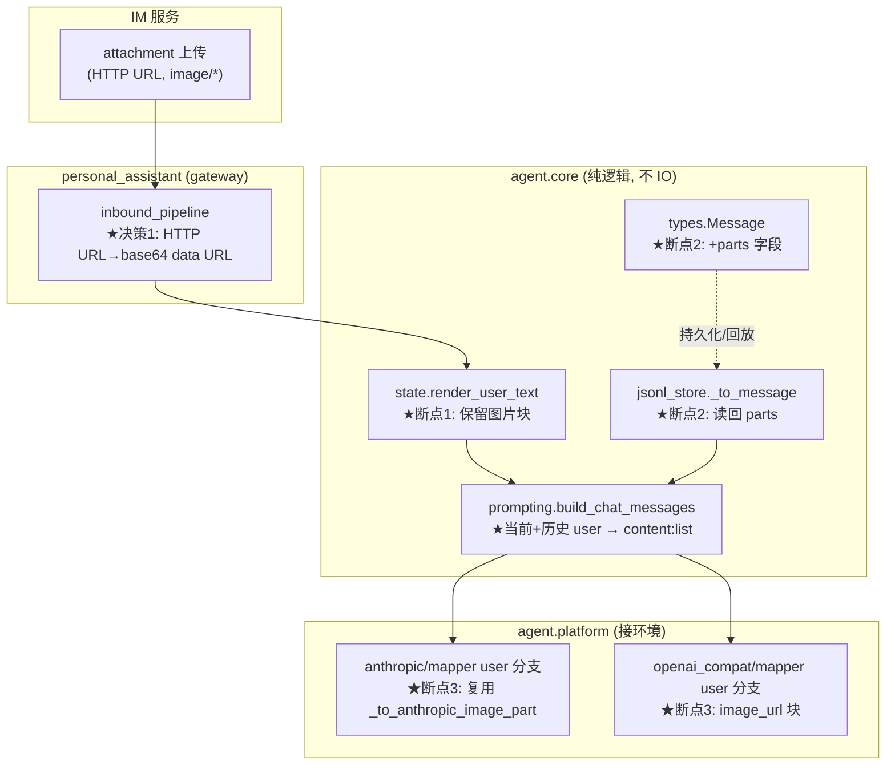
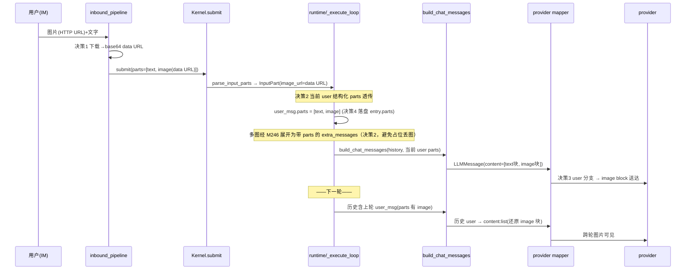

# bugfix-433: 打通用户图片输入端到端送达 + 跨轮持久化 — 技术方案

> 对齐: incident.md v2（grounding 修订后）
> Unit branch: `unit/bugfix-433` (will be created by orchestrator)

## Changelog

## 现状分析

调研围绕「用户图片从 IM 输入 → 送达 LLM → 落盘 → 跨轮回放」整条链路，三处断点均逐处核实源码。

### 涉及范围

| 文件 | 当前职责 | 本 unit 要改的点 |
|---|---|---|
| `src/agent/core/agent/state.py` | `parse_input_parts`/`render_user_text`：解析 image part、渲染纯文本 | `render_user_text` 把 image 丢成 `[image:placeholder]`（断点1）；需保留图片块供下游构造 |
| `src/agent/core/agent/loop.py:230` | `_execute_loop` 调 `build_chat_messages(history, user_text)` | 只传 `user_text`，当前轮图片无通道（断点1）；需把当前 user 的结构化 parts 透传 |
| `src/agent/core/agent/prompting.py:48` | `build_chat_messages`：history+当前 user → `LLMMessage` | 当前 user 与历史都只产 `content:str`；需在有图时产 `content:list[dict]` |
| `src/agent/core/types.py:19` | `Message`（仅 `content:str`） | 增结构化 `parts` 字段承载图片（断点2） |
| `src/agent/core/agent/runtime.py:518,538-558,2121` | 构造 user `Message`、**M246 多部件展开**、`_message_to_entry` 落盘 | user_msg 落 parts；M246 展开时 image part 构造带 `parts` 的 Message（非占位文本，决策2）；`_message_to_entry` **新增** parts 写出（现状不写） |
| `src/agent/core/session/jsonl_store.py:754` | `_to_message`：entry → `Message`（只读 content） | 读回 `entry.parts` 还原 `Message.parts`（断点2，消除悬空双轨） |
| `src/agent/platform/llm/providers/anthropic/mapper.py:147` | user 分支硬编码 `[{type:text}]` | 支持 `content:list` 的 image 块（断点3，复用 `_to_anthropic_image_part`） |
| `src/agent/platform/llm/providers/openai_compat/mapper.py:104` | user 分支原样透传 content | 支持 image 块 → `{type:image_url,image_url:{url}}` |
| `src/personal_assistant/gateway/inbound_pipeline.py:276` | attachment → `{type:image, image_url: <IM HTTP URL>}` | 入站把 IM HTTP URL 下载转 base64 data URL（决策1） |

### 既有约束

- **依赖方向**：`core` 不做 IO（持久化经 `platform/persistence`）；`platform → core`；产品（gateway）只 import `agent.sdk`。→ 图片下载（IO）不能放 core，落在 gateway 入站边界。
- **`LLMMessage.content` 已是 `str | list[dict[str,Any]]`**（`src/agent/core/llm/interfaces.py`）——结构化内容无需改类型签名，顺势使用。
- **纯文本逐字节不变**：现有文本 session 的 JSONL 落盘与重建结果不得因引入结构化内容而漂移（不变量1）。
- **JSONL entry 已写 `parts`**（`manager.py:193`），只是回放 `_to_message` 不读——双轨悬空的物理证据，修复即「让回放消费它」。

### 可复用能力

- **`_to_anthropic_image_part`**（`anthropic/mapper.py:213-251`）：已能把 image part 转 Anthropic `image` 块，**已支持 `data:` base64 URL**；对 HTTP URL 返回 `None`。→ 决策1 让图片在入站即成 data URL，此函数直接复用，mapper 改动最小。
- **`_normalize_tool_result_parts`**（anthropic）/`_normalize_tool_output_parts`（openai_compat）：tool-result image 块映射范式，user 分支照此扩展。
- **PA `httpx`**：`send_message.py`/`im_auth_client.py` 已用 httpx + 持有 IM token → 入站下载 attachment 复用。

### 相关历史

- **feat-330**（JSONL storage + `InputPart.image_url`）：引入图片解析但未闭合送达/持久化——本 bug 的源头 unit。
- **feat-340**（IM 原生 agent）：IM 图片上传 → attachment → 入站 image part 这条产品链路的来源。
- **PR #145 / bugfix-431**（`/stop` 改 append_message）：review 中暴露 parts 悬空双轨，触发本 unit 立项。

## 架构总览

修复把断裂的三处接上，并让图片以 **base64 data URL** 形态贯穿内核（自包含、不依赖 IM URL 存活）。

**改动落点（静态结构）**：

**before/after 一句话**：before — 图片在 `render_user_text` 即丢成占位符，既不送达也不落盘；after — 图片在入站化为 data URL，随当前 user 消息构造成结构化 content 送达 provider，并随 `Message.parts` 落盘、回放时还原，跨轮可见。

## 关键决策

### 决策 1: 图片在 gateway 入站边界把 IM HTTP URL 下载转 base64 data URL，内核全程只见 data URL

**选了「入站转 base64」**（图片获取这件 IO 放在 gateway，core/mapper 保持纯净）。

- **理由**：IM 托管 URL 对真实 LLM provider 不可达（内网/localhost，proxy 转发给远端模型时取不到）；base64 data URL 自包含，落盘后不依赖 IM URL 存活（对齐 Claude Code 存 base64）；`_to_anthropic_image_part` 已支持 data URL，内核改动面最小；满足 core 不 IO 约束。
- **拒绝**：让 HTTP URL 一路存历史、由 mapper 送达时下载——违反 core 不 IO，URL 失效则历史不自包含，mapper 纯函数性被破坏。
- **风险**：base64 使 JSONL 历史膨胀（见风险段）；入站下载失败需降级（决策5）。

### 决策 2: 当前轮图片送达——`build_chat_messages` 接收当前 user 的结构化 parts，有图时产 `content:list`，无图保持 `content:str`

**选了「按需结构化」**（无图片的消息内容形态逐字节不变）。

- **理由**：`LLMMessage.content` 已支持 `list[dict]`，顺势用；无图走 `str` 分支保证纯文本 session 零扰动（不变量1）；当前轮图片从 `state` 透传到 `build_chat_messages`，补上断点1 缺的通道。
- **M246 多部件展开须携带结构化 parts**（review CRITICAL-1，grounding 补漏）：`runtime.py:538-558` 在进 loop 前，对 `len(input_parts)>1` 会把除末 part 外的各 part 经 `render_user_text` 渲成占位文本塞进 loop_history、只末 part 作 `effective_input_parts`。多图（`parts=[text,img1,img2]`）下 img1 会被渲成 `[image:placeholder]` 丢失（单图恰好让 image 作末 part 存活，故只多图暴露）。**修法**：M246 生成 extra_messages 时，image part 构造成带 `parts`（决策4 的 `Message.parts`）的 Message，使其经 history 侧 `build_chat_messages` 还原为 image 块——与决策4 同一机制，多图全部送达。
- **拒绝**：在 `render_user_text` 内塞图片——它产出 `str`，承载不了结构化块。
- **风险**：`build_chat_messages` 签名变化，所有调用点需同步（grep 收敛）；M246 分叉历史上易被漏（本条已显式纳入范围）。

### 决策 3: provider mapper 的 user 分支支持 `content:list` 的图片块，复用既有 image 转换

**选了「user 分支照 tool-result 范式扩展」**。

- **理由**：Anthropic 复用 `_to_anthropic_image_part`（data URL 直通）；OpenAI-compat 产 `{type:image_url,image_url:{url}}`（OpenAI 原生支持，data URL 亦可）；与既有 tool-result image 映射同构，行为可预期。
- **拒绝**：只改一个 provider——两个 provider 都在用，漏一个则该 provider 下图片仍不可见。
- **风险**：两个 mapper 各有格式差异，需各自单测覆盖。

### 决策 4: 持久化回放——`Message` 增 `parts` 字段承载结构化内容，`content:str` 降为纯文本投影，回放消费 parts（消除双轨）

**选了「Message 加 parts，回放读它」**（parts 从悬空字段升为图片的权威表示）。

- **理由**：`content:str` 假设贯穿 reasoning/tool/compaction/provider-error 太多处，全改成 blocks 数组（CC 模型）风险巨大；保留 `content:str`（纯文本投影，给检索/日志/纯文本 fallback）+ 新增 `parts`（结构化权威）是最小侵入。JSONL entry 已写 `parts`，本决策让 `_to_message` 读回它——双轨从此「写且读」、一致。
- **拒绝**：content 直接变 blocks 数组——侵入面与回归风险不可控；维持双轨写而不读——正是 bug 本身。
- **风险**：`Message` 是 frozen dataclass，加字段须全构造点默认 `parts=None`；回放重建顺序/parent 链不得受影响（不变量3）。

### 决策 5: 异常图片 → 本轮停下、回发明确提示、等用户重发（对齐 CC，不调模型、不静默、不喂假占位）

**选了「图片处理失败则本轮不调用模型，回发固化错误提示让用户重发」**（对齐 CC 实测行为：`query.ts:1216` 捕获 `ImageResizeError` 后 `yield createAssistantAPIErrorMessage(...)` 并 `return {reason:'image_error'}`，模型**未被调用**）。

- **理由（核实 CC 后确定语义）**：CC 对图片失败是**硬停**——图片 resize/压缩仍超限即 `throw`，本轮直接以错误消息收尾、不调模型。这比「剔除图继续答」更诚实：不存在「模型基于残缺输入答了」的中间态，用户明确知道图没进去、需重发。
- **先压缩、压不下才停**（对齐 CC `maybeResizeAndDownsampleImageBuffer`）：超大图优先自动 resize/压缩到大小上限内正常送达；只有压缩也救不回来才停下报错。自动压缩为 worker 增强项，核心契约是「无法送达 → 停下报错，不静默」。
- **校验统一在 gateway 入站，mapper 不校验**（消除失败路径裂缝）：图片的下载、大小校验、解析与（可选）压缩**全部在 gateway 入站（决策1 同一处）完成**——失败即在 `submit` 前拦截、不进 core。mapper 保持纯映射（决策3）、只处理已是 data URL 的图片块、不做大小校验。这样失败路径无需 core/runtime 中途回退（对齐 CC：校验在发送前 `imageResizer`，不在 API mapper）。大小上限取保守值（默认对齐最严格 provider，如 5MB），不依赖运行时 provider 选择，worker 落地。
- **拒绝**：① 静默降为 `[图片无法加载]` 文本喂模型——隐藏错误、诱发编造；② 剔除失败图、带其余内容继续调模型——CC 不这么做，「部分送达」语义模糊；③ 抛异常中断整轮——用户只见崩溃，同样不知情。
- **实现指引（失败提示仅 outbound 展示、不持久化进 kernel 历史）**（review CRITICAL-2，纠正原「复用 is_provider_error 通道」）：gateway 入站下载/校验失败时**本轮不 submit 模型**，失败提示经 gateway outbound（类似 `/stop` ack 的用户消息回发路径）显示在 IM 给用户，**不写入 kernel session 历史**。理由：本轮未 submit，user 的图片消息本就未进 kernel 历史，历史天然干净——下一轮重建时既无失败图也无失败文案，无需任何回放过滤，比「持久化 is_provider_error + 回放过滤」更简自洽。（原措辞不成立：gateway 的 `append_message→append_turn_message` 写白名单 `manager.py:185-197` **不含** `is_provider_error`，该标记会被静默丢弃；能写它的 `_message_to_entry` 仅在 in-run 模型路径可达，正是这里要避开的。）效果对齐 CC `return {reason:'image_error'}`：本轮停下、模型未被调用、下一轮上下文干净。
- **固化文案（worker 照抄，禁止自由发挥）**：按失败类型取下表**精确字符串**。与 CC 不同点：CC 英文 + CLI「esc esc」提示 + 无「下载失败」场景（CC 是本地 base64，本仓是 IM HTTP URL 需下载）——本仓化为中文、去 CLI 交互、补「无法获取」一类；语义为「停下、没收到、请重发」（**不暗示已回答**）：

  | 失败类型 | 触发处 | 固化文案（一字不差） |
  |---|---|---|
  | 无法获取 / 下载失败 | 入站 base64 转换（决策1）下载 IM attachment 失败（不可达 / token 失效 / 404） | `这张图片没能加载，我没有收到它，无法据此回复。请重新发送图片试试。` |
  | 图片过大 | 入站 base64 转换后校验，自动压缩后仍超出大小上限（保守值，默认对齐最严格 provider 如 5MB） | `这张图片太大了，超出可接收的大小，我没能收到它，无法据此回复。请压缩或换一张更小的图片后重新发送。` |
  | 无法识别 / 损坏 | 图片解析失败（格式不支持 / 数据损坏） | `这张图片我无法识别，没能收到它，无法据此回复。请确认图片有效后重新发送。` |

  一条消息里多张图、任一张失败：本轮停下、不调模型，回发对应失败文案（指明哪一类失败）；用户重发后再处理。**不做**「成功的先送、失败的略过」的部分送达（对齐 CC 的整轮停）。阈值（「过大」字节数）取值留 worker 参照 provider 限制，**不进文案**（保持可固化、稳定）。
- **风险**：图片失败统一在 gateway 入站判定（下载 / 大小 / 解析），经 outbound 直接回发用户、**不写 kernel 历史**，core 全程不接触失败图（与上「实现指引」一致，不再用 is_provider_error 持久化）。

## 接口与数据流

**主流程时序（用户发图 → 当前轮送达 → 落盘 → 下一轮回放）**：

**关键接口形态（只写"长什么样、谁调谁"，代码留 worker）**：

- `build_chat_messages(*, history_messages, user_text, user_parts=None)` — 新增 `user_parts`（当前轮结构化 parts）。`user_parts` 含 image → 当前 user `LLMMessage.content` 为 list；否则 `content=user_text`（保持现状）。历史侧：遍历 `Message`，`m.parts` 含 image → list content，否则 `m.content`。
- `Message`（types.py）增 `parts: tuple[Mapping[str,Any], ...] | None = None`。`_message_to_entry` **新增** `entry["parts"]` 写出（submit 路径现状**不写**，仅 `append_turn_message` 写；新增时仅当 parts 非空，守纯文本 golden）；`_to_message` 读 `entry.get("parts")` → `Message.parts`。
- image 块统一形态：`{"type":"image","image_url":"data:<mime>;base64,<...>"}`（内核内规范，mapper 据此映射）。
- mapper user 分支：`content` 为 list → 逐块（text→text block，image→provider 各自 image 形态）；为 str → 维持现状。mapper 只映射、不做图片大小校验。
- 失败路径（gateway 入站，决策5）：下载 / 大小 / 解析失败 → **不 submit 模型**，经 gateway outbound 回发失败提示给 IM 用户（**不写入 kernel session 历史**；本轮未 submit 故历史天然干净，无需回放过滤）。失败路径在 gateway 闭合，不进 core。

## 契约层增量 (delta-spec)

- kernel: `specs/kernel/spec.md` — 经 `agent.sdk`（submit/append_message）携带 image part 的消息，图片送达模型且随会话历史保留、后续 turn 仍可见。
- gateway: `specs/gateway/spec.md` — 用户经 IM 发送图片，agent 当轮即可看到、后续轮追问仍可见。
- im: no spec delta（IM 上传/attachment 行为不变）。
- cli: no spec delta（无图片输入路径）。

## 风险与回退

- **JSONL 历史膨胀**：base64 图片进 transcript 使会话文件显著增大（一张图数百 KB）。对齐 CC 现状，本 unit 接受；缓解：决策5 超大图对用户明确报错（不送达）+ 未来可优化为 side-store 引用（非本 unit）。回退：若膨胀不可接受，回退到「历史只存占位、仅当前轮送达」的半程方案（仍优于现状）。
- **入站下载依赖 IM 可达 + token**：gateway 下载 attachment 需 IM 在线且 token 有效。缓解：决策5 失败时本轮停下、向用户明确报错（图片未送达模型）等重发，不静默、不喂假占位给模型，会话不崩。
- **纯文本 session 漂移（不变量1）**：`Message.parts` 默认 None、`build_chat_messages` 无图走原 str 分支——无图路径必须与改前逐字节一致，由 worker 用既有持久化/回放测试 + golden 守。
- **两 provider 格式分叉**：Anthropic（base64 source）与 OpenAI（image_url）格式不同，各自单测覆盖；data URL 对两者都适用降低分叉风险。
- **回退总策略**：改动集中在「图片有无」的分支上，纯文本路径不变，单 unit 可整体 revert 回退到现状（图片不可见，但无其它回归）。

## Runbook for Reviewer

| 服务 | 停止命令 | 启动命令 | 健康检查 |
|---|---|---|---|
| IM | `stop_pidfile .im.pid`（worktree e2e）/ 主仓用户自管 | `IM_JWT_SECRET=<unit随机串> PYTHONPATH=src python -m uvicorn IM.app:app --host 127.0.0.1 --port $IM_PORT > .im.log 2>&1 & echo $! > .im.pid` | `curl -s 127.0.0.1:$IM_PORT/ ` 返回前端；登录 nano/nano1234 |
| Gateway | `stop_pidfile .gateway.pid`（--foreground 起的） | `PYTHONPATH=src python -m personal_assistant.main --config "$WT_CFG" --im-service-url http://127.0.0.1:$IM_PORT --foreground --auto-bind > .gateway.log 2>&1 & echo $! > .gateway.pid` | `.gateway.log` 无 error；IM 里 agent 在线 |

> reviewer 旅程：登录 IM → 给 agent 发一张图 + 问题（验当前轮可见）→ 同会话下一轮只发文字追问该图（验跨轮）→ 另发纯文本多轮（验无回归）→ 发一张异常图（验：本轮收到明确提示、agent 不对该图编造、可重发、会话不崩）。

## Milestones

单 M1：端到端垂直切片（用户图片当前轮 + 跨轮可见）。链路虽跨 core/platform/gateway，但是一条不可横切的垂直通路（横切成 core/mapper/gateway 会让每段都不可独立交付、且互相阻塞，违反 §4.3）。估算 ~400-600 行，单 worker 窗口内可完成；内部用 roadpoint R1（当前轮送达）/R2（持久化回放）/R3（gateway base64 边界 + e2e）推进。

| ID | 标题 | 依赖 | 并行组 | 范围 | 退出标准 |
|---|---|---|---|---|---|
| bugfix-433-M1 | image-end-to-end | — | A | `src/agent/core/agent/{state,prompting,loop,runtime}.py`、`src/agent/core/types.py`、`src/agent/core/session/jsonl_store.py`、`src/agent/platform/llm/providers/{anthropic,openai_compat}/mapper.py`、`src/personal_assistant/gateway/inbound_pipeline.py`、相关 tests | `[reviewer]` 用户发图当轮 agent 即可作答（Req-当前轮可见/Scenario-单轮发图即问、单轮发多张图） `[reviewer]` 上轮发图、下轮只发文字仍可追问（Req-跨轮保留/Scenario-上一轮发图下一轮追问） `[reviewer]` 纯文本多轮对话与修复前无可观察差异（Req-纯文本不受影响） `[reviewer]` 异常图片：用户收到「未送达模型 + 原因 + 建议」明确提示、对话不崩、agent 不对该图编造（Req-异常图片明确告知用户） `[worker]` 新增端到端往返单测「发图→送达 provider mapper→落盘 entry.parts→重建 Message.parts→下一轮含 image 块」全绿 `[worker]` 多图单测：单条消息多 image part 经 M246 展开后**全部**送达（守 CRITICAL-1，防只末图存活） `[worker]` Anthropic / OpenAI-compat mapper user 分支 image 块映射各有单测 `[worker]` 纯文本 session 持久化/回放既有测试 + golden 不回归 `[worker]` `pytest -m "not e2e"` 全绿、ruff check + format clean |

依赖图：单 milestone，无需。
