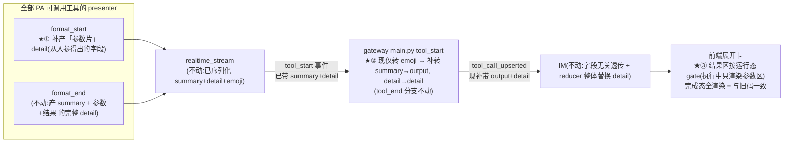

# bugfix-441: 工具执行中不展示参数(折叠摘要 + 展开命令),要等执行完才出 — 技术方案

> 对齐: incident.md v1

> Unit branch: `unit/bugfix-441` (will be created by orchestrator)

## Changelog

## 现状分析

展示链是一条**全字段透传管道**,病根是它的两端不对称——结束端转发参数+结果,开始端只转 emoji:

```
presenter.format_start/end  →  realtime_stream._presentation_dict(序列化 summary+detail+emoji)
  →  gateway main.py relay(tool_start / tool_end)  →  IM gateway_handler._parse_tool_call(读 output/detail/emoji)
  →  落库 tool_calls_json + WS 广播  →  前端 ToolCall(input/output/detail/emoji) → 折叠行 + 展开卡渲染
```

### 涉及范围

- **工具 presenter(本 unit 改点①,范围=PA 运行时全部可调用工具,不止内核 builtin)**:
  - 内核 builtin:`src/agent/platform/tools/builtins/{bash,read,edit,write,web_fetch,agent,memory,skill_manage,task_stop}.py` + `presentation.py`(`_summarize_*` / 默认 presenter)。各 `format_start` **现仅产 summary、不产 detail**。
  - PA 产品工具:`src/personal_assistant/tools/{web_search,send_message,cron}.py`(经 `build_pa_kernel` 注入)——同样经 agent 调用、同样走展示链。**web_search 自带 `_WebSearchPresenter`**(`format_start` 现仅产 summary=query),纳入切分;**send_message / cron 当前无 presenter**(只 name/description/input_schema/run,走默认 presenter)——Q5 用户选 b,本 unit 给它俩**新建** presenter(完成态展示有意从裸 JSON 升级为结构化,详见决策2)。
  - 配置目录加载的 DIY 工具:`loader.py` 从 `<repo>/.nano/tools/*.py` 或 `config_resolver.user_tool_roots()` / `product_tool_dir` 动态加载,工具文件导出 `TOOL/TOOLS/get_tool()`;`presenter` 是工具**可选自带属性**(`_resolve_presenter_for_tool` 经 `getattr(tool,"presenter",None)` 认,无则走默认 presenter)。本仓**不支持 MCP**。
- **gateway**(本 unit 改点②):`src/personal_assistant/main.py:3652-3692`(`tool_start` 分支)取出 `presentation` 却**只读 emoji**,丢 summary+detail;`tool_call_upserted` delta 无 `output`/`detail`。
- **前端**(本 unit 改点③,详见决策1):`src/IM/frontend/src/features/chat/v2/components/tool-detail-renderers.tsx`——部分展开卡把"结果区"**无条件**渲染,执行中只有参数时会显伪完成态,须按运行态 gate。
- 只读不改(已是字段无关透传,自动生效):`realtime_stream.py:69-79`(format_start 已被调、`_presentation_dict` 已序列化 summary+detail+emoji)、`IM gateway_handler._parse_tool_call:2535`(tool_start/tool_end 共用,读 output/detail/emoji)、`IM repositories/event_types`(条件透传)、前端 `chat-types.ts ToolCall`(已有 detail?)、`chat-stream-reducer.ts mergeToolCall`(detail 走 `{...prev,...next}` 整体替换)、折叠行 `collapsedSummary`(读 output)。

### 既有约束

- **gateway 纯透传管道**(feat-409 决策1):不按工具语义裁剪。本方案在 tool_start 补的也是纯透传。
- **展示随工具走 / presenter 拥有展示**(feat-409 决策4、feat-425 决策1):前端不按工具名派生展示**数据**,数据由 presenter 产、经事件透传。本方案的参数由 presenter 产;前端只负责"运行态不渲染结果区"这一**展示态**逻辑(非数据派生)。
- **【硬约束·incident 不变量】完成态展示与旧代码逐项一致**:只允许改"执行中";执行完的折叠摘要、展开卡(参数+结果)、失败态必须与变更前等同。直接否决任何改动结束路径(format_end / tool_end relay / reducer 完成态合并)的方案。
- 内核四层 import 边界:内核 builtin presenter 在 `agent/platform`;PA 产品工具 presenter 在 `personal_assistant/tools`;gateway 经 `agent.sdk` 进程内持内核。

### 可复用能力

- **整条透传链 + 落库/WS/前端 detail 渲染**:`detail` 从内核到前端 bespoke 卡已全程贯通(feat-409 为完成态铺好)。本 unit **复用它承载执行中的参数**,IM 与 reducer **零改动**。
- **各 presenter `format_end` 已有的"从 args 取参数"逻辑**:format_start 产参数片直接复用同源字段(command/path/url/prompt/action/target/query…),不另造。

### 相关历史

- **feat-409**:建 summary→output 折叠链 + 展开卡按 detail 渲染;"执行中不退化"仅指保住脉冲。
- **feat-425**:给 tool_start 新增 presentation 转发,**只接 emoji**,summary/detail 留地上——本 unit 补完。
- **bugfix-427**:把 bash format_start 改产 description summary,但只测 presenter 未验 UI,因 gateway 转发缺口成 **false-fix**(详见 incident RCA)。教训:展示链改动必须真栈 e2e 看 UI。

## 架构总览

三个改点(★),结束路径与 IM/reducer **不动**:



**核心原则(回答"切分哪些在开始展示"):按字段来源切,不按工具挑;且这是工具作者规范,不是硬编码集。** 每个工具的展示字段,凡**从入参就能得出**(command/path/url/prompt/action/target/query…)→ 归"参数",`format_start` 产、执行中展示;凡**执行完才有**(stdout/退出码/diff/正文/status/results/message…)→ 归"结果",`format_end` 产、执行完展示。这是**每个工具 presenter 自身遵循的约定**:本 unit 让现有全部工具(内核 builtin + PA 产品工具)的 presenter 落实它;未来新增工具(含配置目录加载的 DIY 工具)按**同规范自设 presenter**,与现有工具一样,而非由 bugfix-441 逐一硬编码。无 presenter 的工具走默认 presenter,其 start=入参摘要、end=输出摘要,天然符合该约定。

## 关键决策

### 决策 1: format_start 补「参数片」detail + gateway 镜像转发 + 前端结果区按运行态 gate;结束路径不动

**实现"参数提前" = ① 各工具 presenter `format_start` 补产参数片 detail；② gateway `tool_start` 镜像 `tool_end` 转发 summary→output、detail→detail；③ 前端展开卡的「结果区」按运行态 gate(执行中不渲染)。`format_end` / `tool_end` relay / reducer 完成态合并不碰。**

- **理由**:完成态一致由两半保证——**后端**:未改的 `format_end` detail 经 reducer `{...prev,...next}` **整体覆盖**执行中参数片 → 完成态 detail=旧码,按构造成立;**前端**:gate(③)在 `status≠running` 时为 no-op,结果区照常全渲染 → 完成态渲染=旧码(单测钉死)。两半合起来满足 incident 最硬不变量。执行中新出现的参数片是 format_end detail 的子集,用同一套 bespoke 卡渲染。
- **为何需要 ③(纠正早期"零前端改动"的误判)**:部分展开卡把"结果区"**无条件**渲染——`AgentCard`(tool-detail-renderers.tsx:300-320)无条件显 `✓ completed`、`MemoryCard`/`SkillCard`/`TaskStopCard` 无条件显 `✓done` 头、`WebSearchCard` 空 results 显"无结果"空态。执行中参数片无结果字段 → 这些卡会显**伪完成态**(折叠行还在"运行中"脉冲),自相矛盾、违背"跑完才转完成态"。故必须给这些卡的结果区加运行态 gate。
  - **gate 机制**:`ToolDetailBody` 把工具调用的运行态(`status==="running"`)传给 bespoke 卡;卡按"**参数区始终渲染 + 结果区仅非运行态渲染**"组织。完成态(status≠running)→ 结果区照常全渲染 → 与旧码一致。两类卡改法不同:
    - 参数与结果**已在不同元素**的卡(`AgentCard` prompt 在独立 Section、`MemoryCard` meta+content 与 ✓head 分离):只需给结果区(✓head / content / status)包运行态条件,参数区原样。
    - 参数与结果**混在同一元素**的卡(`SkillCard` 的 `✓ action name`、`TaskStopCard` 的 `✓ status·taskid`、`WebSearchCard` 只渲 results 不渲 query):须先**拆出参数区**(action·name / task_id / query 单独渲染),再把结果标记/结果体放进仅完成态渲染的结果区。
    - worker 须对每个需 gate 的卡核对其当前 JSX 属哪类,据此最小改动;单测断言"完成态(status=completed)渲染与变更前逐字一致"。
- **拒绝(早期设想)**:让 `format_end` 拆出参数字段 + reducer 改 detail 字段级合并 —— 动了结束路径,完成态有被改变风险,违硬约束。
- **拒绝**:前端在无 detail 时直接渲染裸 `call.input` —— 违"展示随工具走";input 是裸 args,不如 presenter 产的参数片(用户:"不是很死板的直接展示")。
- **风险**:见决策 2(参数片须逐分支对齐 format_end);gate 机制须保证完成态零行为变化(单测:同一 detail 在 status=completed 下渲染与变更前逐字一致)。

### 决策 2: 切分是「工具 presenter 作者规范」,本 unit 落实现有全部工具,逐分支对齐 format_end

**切分约定 = 每个工具 presenter 自身遵循:`format_start` 产参数片 ⟺ 其 `format_end` 对应分支产 detail,参数片字段名与 format_end 同名(避免完成态覆盖后错位)。本 unit 落实:内核 9 个 builtin + PA 的 web_search(`_WebSearchPresenter`,已有);并 Q5(用户选 b)给当前无 presenter 的 send_message / cron **新建** presenter。本仓不支持 MCP。**

- **理由**:这是一类缺陷(参数侧展示被整体推迟),非某工具专属;按字段来源统一切分才是原则,按"工具够不够慢/改卡成本"挑拣是错的(成本只作工作量,不作缩范围理由)。且它是**规范**不是硬编码集:新增工具(含配置目录加载的 DIY 工具)按同规范自设 presenter 即自动符合,本 unit 不为未来工具兜底。
- **send_message / cron 新建 presenter(Q5 有意改善完成态,incident 豁免)**:二者当前无 presenter、完成态显裸 JSON(默认 presenter)。本 unit 给它俩写 presenter,**完成态展示从裸 JSON 升级为结构化 key/value**——这是对"完成态一致"针对这两工具的**有意豁免**(见 incident Q5),非回归。字段切分:
  - send_message:参数=`target`+`text`,结果=送达状态(`ok`/error)。format_start detail=`{target,text}`;format_end detail=`{target,text,status}`。
  - cron:参数=`action`(+create 时 `job.name`/`schedule`),结果=`jobs`/`count`/`jobId`/`removed` 等(随 action)。format_start detail=参数片;format_end detail=参数+结果。
  - **不写 bespoke 卡 → 落 `GenericCard`**(前端 BESPOKE 表无此二者):GenericCard 逐 `detail` 字段渲染 key/value、无 ✓done 头 → **无伪完成态、无需 gate**。执行中 detail 只含参数字段 → 只显参数行;完成态含参数+结果 → 全显。
  - 验收按 incident 豁免:完成态是改善后的结构化展示(信息不少于旧裸 JSON、不报错),而非"与旧裸 JSON 逐字一致"。
- **逐分支(非逐工具)**:`format_end` 的 detail 随分支变——失败/退化分支(如 read 无 path 分支)可能 detail=None。参数片只镜像"该分支有 detail"的情况;某分支 format_end 不产 detail,则该路径完成态本就无展开卡,执行中也不产参数片(否则残留破坏完成态一致)。
- **参数片大字段必须复用同一 cap**:`ToolPresentationEvent.detail` 不自动截断,format_end 靠显式 `_enforce_cap` 截 stdout/diff/content 等大字段。参数片里含大字段的(如 write/memory 的 `content`=入参原文)**必须同样过 `_enforce_cap`**(同一 hard cap + `truncated` 语义),否则 running 事件 / WS / `tool_calls_json` 会被超大入参撑爆。
- **DIY 工具**:若自带 presenter,作者按本规范切分 + 自行 gate 其卡 + cap 大字段;无 presenter 则随默认。
- **风险**:worker 须逐工具、逐 format_end 分支核对参数字段名,单测钉死;漏一个工具 = 该工具执行中仍空白(回归面,reviewer 走查需覆盖多工具)。

### 决策 3: 折叠行摘要(summary)纯转发,不涉及拆分

**summary 是参数侧的折叠标题,`format_start` 早已产出,gateway 直接转发即可。**

- **理由**:summary 是单值串。gateway tool_start 写 `output=summary` 后,tool_end 仍写 output(同值或结果摘要),reducer 覆盖无碍 → 完成态折叠行一致。
- **风险**:reducer `mergeToolCall` 对 output 有"非空不 clobber"(chat-stream-reducer.ts:74)——tool_start 先写非空 output 后,tool_end 的 output 必须非空才覆盖。各工具 format_end summary 恒非空,安全;单测钉死。

## 接口与数据流

无新增对外 API。改的是各 presenter `format_start` 的 detail 填充 + gateway tool_start 字段转发 + 前端卡的运行态 gate。

### 逐工具实况表(改后:执行中 vs 执行完,折叠 + 展开)

"参数"=入参可得、改后**执行中**展示;"结果"=执行完才有、**执行完**展示。**「完成·折叠」「完成·展开」两列 = 改前完全一致**(format_end 不动 → 不变量"完成态与旧码一致"的可验证面);「开始·折叠」「开始·展开」两列是改后**新出现**的展示(改前执行中:折叠仅图标+名+脉冲、展开空白)。

| 工具 | 开始·折叠 | 开始·展开(只参数) | 完成·折叠(=改前) | 完成·展开(=改前) | 卡需 gate? |
|---|---|---|---|---|---|
| bash | description(空→命令首段) | 命令 | description | 命令+stdout+退出码 | 否 |
| read | path | path | `path·N行·读取a-b` | path+行数/范围 | 否 |
| edit | path | path | `updated +N-M` | path+diff | 否 |
| write | path | path+内容(content 是入参) | path | path+字节+内容 | 否 |
| web_fetch | url | url | url | url+状态+正文 | 否 |
| **web_search** | query | query | query | results 列表(空→"无结果") | **是**(空 results 空态须 gate) |
| **agent** | description | prompt | description | prompt+**✓completed·子类型**+content+产物 | **是**(✓结果区无条件;prompt 已在独立 Section,gate 结果区即可) |
| **memory** | `action target` | action·target+content | `±target:"预览"` | **✓message**+action·target+content | **是**(✓头无条件) |
| **skill_manage** | `action name` | action·name | `创建skill：name` | **✓action name**+message+path | **是**(✓头无条件) |
| **task_stop** | task_id | task_id | `停止后台任务X` | **✓status·taskid** | **是**(✓头无条件) |
| send_message(新建 presenter) | `→ target` | target+text(GenericCard) | `→ target` | target+text+送达状态(GenericCard) | 否(GenericCard 逐字段,完成态**有意改善**) |
| cron(新建 presenter) | `action (+job名)` | action+job名/schedule(GenericCard) | `action …` | action+结果(jobs/jobId/removed)(GenericCard) | 否(同上,完成态**有意改善**) |
| DIY(自带 presenter) | 按其 presenter | 按其 presenter | 按其 presenter(=改前) | 按其 presenter(=改前) | 作者按规范自设 + 自 gate + cap |
| 无 presenter(默认) | 截断**入参** | 同折叠(回退入参串) | 截断输出 | 输出串 | 否 |

两点:
- **完成两列与改前逐项一致**——这是 reviewer 走查的硬判据(同一 detail 在完成态渲染不变)。
- **部分工具折叠文案从开始→完成自然变化**(read:`path`→`path·N行`;edit:`path`→`updated`;memory:`action target`→`±target:"预览"`;skill/task_stop 同):这是各工具 `format_end` summary 比 `format_start` summary 更富(掺了结果)所致,属**既有 format_end 行为,本 unit 不改**;开始折叠取 format_start summary(参数标题),完成折叠取 format_end summary(不变)。bash/agent/web_fetch/web_search 两端 summary 同值,无此变化。
- 需 gate 的卡(结果区无条件渲染):**agent / memory / skill_manage / task_stop / web_search**,统一用决策1③的运行态 gate;其余卡本就逐字段条件渲染,不动。

### 主流程时序

```mermaid
sequenceDiagram
  participant K as presenter
  participant G as gateway main.py
  participant I as IM
  participant U as 前端展开卡

  Note over K,U: 执行中(★ 参数侧透传 + 运行态 gate)
  K->>G: tool_start(summary + 参数片 detail)
  G->>I: tool_call_upserted { status:running, output:summary, detail:参数片 }
  I->>U: 折叠行显摘要; 展开卡渲染参数区(status=running → 结果区不渲染)
  Note over K,U: 执行完(结束路径不动 → 完成态=旧码)
  K->>G: tool_end(summary + 完整 detail)
  G->>I: tool_call_completed { status:completed, output, detail:完整 }
  I->>U: reducer {...prev,...next} 整体替换 detail; status=completed → 参数区+结果区全渲染
```

## 契约层增量 (delta-spec)

- kernel: `specs/kernel/spec.md` —— tool_start 会话事件携带 presenter 的参数侧展示(summary + 参数片 detail)。
- im: `specs/im/spec.md` —— 工具执行中折叠行显参数摘要、展开卡显参数(命令/入参/prompt…),不显结果与完成标记;执行完显参数+结果。
- gateway: `specs/gateway/spec.md` —— 本 unit 改变 Gateway→IM 的 `tool_call_upserted`(tool_start)中继 payload:执行中新增携带 `output`(=summary)+ 参数侧 `detail`。gateway canonical 现无 tool_start 转发 presenter 展示的条目,须补,否则将来再漏转发(正是 feat-425 的原 bug)无 contract 报警。delta 只锚 Gateway→IM 中继边界,不写 IM UI 细节。
- cli: no spec delta —— 本 unit 不改 CLI 渲染。

## 风险与回退

- **完成态被意外改变**(最高):参数片字段名与 format_end 不一致、加到无 format_end detail 的分支、或 gate 机制误伤完成态渲染 → 完成态残留/错位/缺失。对策:决策2 的"⟺逐分支 + 同名"规则;gate 机制单测断言"同一 detail 在 status=completed 下与变更前逐字一致";覆盖多工具的完成态回归。
- **漏工具**:范围是全部 PA 工具,漏一个 = 该工具执行中仍空白。对策:worker 枚举 PA 运行时真实工具注册集(内核 builtin + PA 产品工具 + 配置目录加载的 DIY 工具;本仓不支持 MCP),逐个落实;reviewer 走查覆盖 bash/agent/web_search 至少三类。
- **reducer 覆盖**:output/detail 在 tool_end 覆盖执行中值依赖 mergeToolCall;detail 无 clobber 保护、整体替换,覆盖天然成立;output 非空覆盖(决策3)。
- **start detail 撑爆链路**:`ToolPresentationEvent.detail` 不自动 cap,write/memory 的参数片含入参原文(可能极大)。对策:决策2"参数片大字段复用 `_enforce_cap`";单测断言大 content 被截断 + `truncated` 置真。
- **send_message/cron 完成态有意改变(Q5)**:这是 incident 显式豁免的改善,非回归。风险在"改坏"——新 presenter 的 format_end 若漏字段/报错,完成态信息反而比旧裸 JSON 少。对策:单测断言新 detail 含全部关键字段(send_message: target/text/状态;cron: action/结果),GenericCard 正常渲染、失败走 ErrorCard;reviewer 走查确认是人话结构化、信息不少于旧裸 JSON。
- **回退**:改点=各 presenter format_start + gateway 一分支 + 前端卡 gate。回滚 = 还原三处即回变更前;无数据迁移、无 schema 变更(detail 列早存在)。

## Runbook for Reviewer

| 服务 | 停止命令 | 启动命令 | 健康检查 |
|---|---|---|---|
| IM | `stop_pidfile .im.pid` / 主仓按 AGENTS.md | `IM_JWT_SECRET=... PYTHONPATH=src python -m uvicorn IM.app:app --port <P>` | `curl :<P>/` 返回页面 |
| Gateway(进程内持内核,presenter+gateway 改动经此重启生效) | `python -m personal_assistant.main --config <cfg> stop` / `stop_pidfile .gateway.pid` | `PYTHONPATH=src python -m personal_assistant.main --config <cfg> --im-service-url http://127.0.0.1:<P> --foreground --auto-bind` | Gateway 日志 bound + agent 在线 |
| 前端(本 unit 改了展开卡 → 须重新构建) | — | `cd src/IM/frontend && npm run build`(或 `npm run dev -- --port <P> --strictPort`) | 页面加载、工具卡渲染正常 |

**Review 驱动方式**: 端到端真栈,**必须真驱动客户端面(IM web UI)**。理由:可观察行为是"工具执行中"的 UI 展示时机 + 运行态 gate,且 bugfix-427 因只验 presenter 单测/接口未看 UI 成 false-fix。reviewer 须真开 IM,让 agent 跑**耗时较长的 bash**(如 `sleep 5 && echo done`,带 description)+ 一次 **agent 子任务** + 一次 **web_search**,在**执行中**核:折叠行出摘要、展开卡出参数(命令/prompt/query)、**且不显伪完成态(无 ✓completed / 无"无结果")**;再核**执行完**折叠+展开全貌与变更前一致。

## Milestones

| ID | 标题 | 依赖 | 并行组 | 范围 | 退出标准 |
|---|---|---|---|---|---|
| bugfix-441-M1 | split-param-display | — | A | presenter(切分参数片,逐 format_end 分支对齐 + 大字段 cap):`src/agent/platform/tools/builtins/{bash,read,edit,write,web_fetch,agent,memory,skill_manage,task_stop}.py` + `presentation.py`(helper)+ `src/personal_assistant/tools/web_search.py`;**新建 presenter**:`src/personal_assistant/tools/{send_message,cron}.py`(Q5);gateway:`src/personal_assistant/main.py`(tool_start 转发 summary+detail);前端:`src/IM/frontend/src/features/chat/v2/components/tool-detail-renderers.tsx`(结果区运行态 gate);相关单测 + vitest | `[reviewer]` 真栈 IM:长 bash / agent 子任务 / web_search 执行中,折叠出摘要 + 展开出参数(命令 / prompt / query)(覆盖 incident【期望·参数】) `[reviewer]` 上述工具执行中展开**不显伪完成态**(无 ✓completed、无"无结果"空态),折叠仍"运行中"脉冲(覆盖不变量"跑完才转完成态") `[reviewer]` 执行完折叠+展开(参数+结果)与变更前**逐项一致**(send_message/cron 除外:其完成态为改善后的结构化展示,见 Q5 豁免) `[reviewer]` send_message/cron 执行中显参数(target/text、action/job)、执行完显参数+结果,均人话结构化非裸 JSON `[worker]` 有 presenter 的工具(内核 9 builtin + web_search)逐个落实参数片;字段名与各 format_end 分支同名(单测逐工具/逐分支断言) `[worker]` send_message/cron 新 presenter:format_start=参数片、format_end=参数+结果,落 GenericCard 渲染、无 ✓ 头(单测) `[worker]` write/memory 等含大字段(content)的参数片经 `_enforce_cap` 截断、`truncated` 置真,且完成态仍与旧码一致(单测) `[worker]` gateway tool_start delta 带 output(=summary)+ detail(=参数片)(单测,对照 tool_end) `[worker]` 前端 gate:status≠running(completed/failed)时展开卡渲染与变更前逐字一致;status=running 时结果区不渲染、只渲参数区(vitest) `[worker]` reducer:tool_end 的 output/detail 覆盖 tool_start 写入值(vitest) `[worker]` `pytest -m "not e2e"` + 前端 `npm run build` + `npm run test` 全绿 |

单 M1:改点全在"参数侧透传"一条垂直链(presenter + gateway + 前端 gate + 测试),跨包但逻辑强耦合、无法真并行,远低于拆分门槛。
