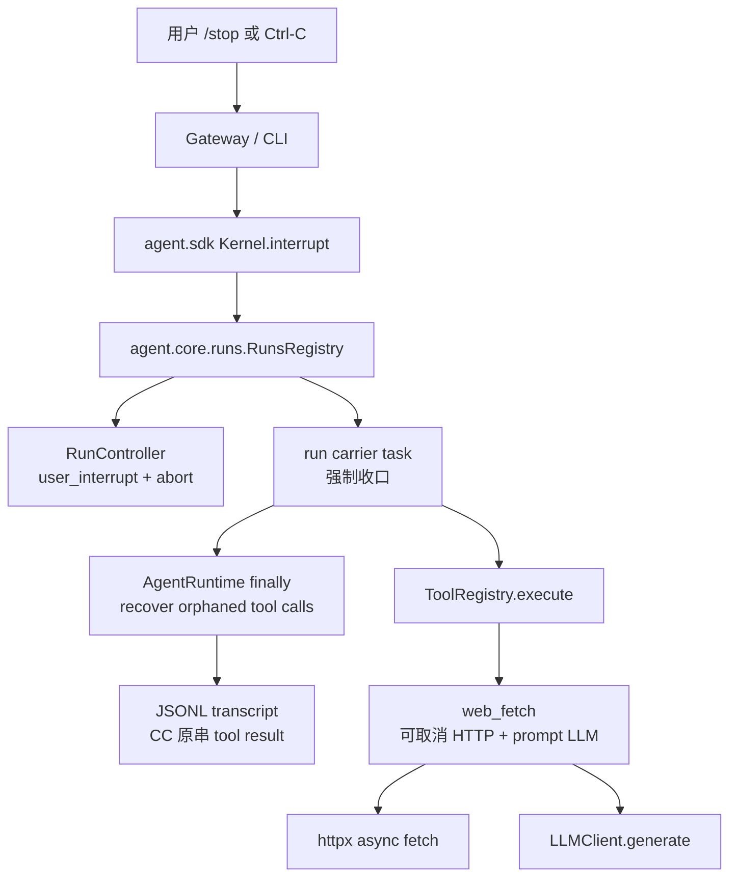
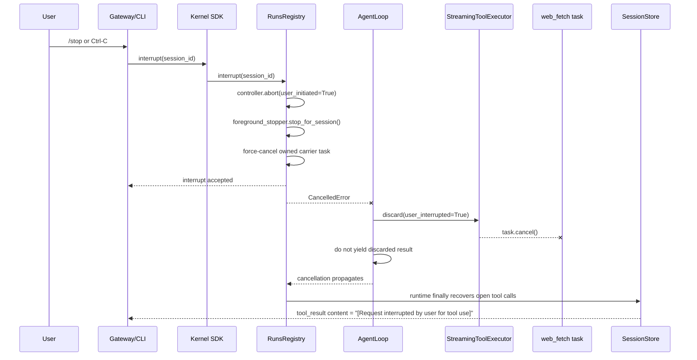
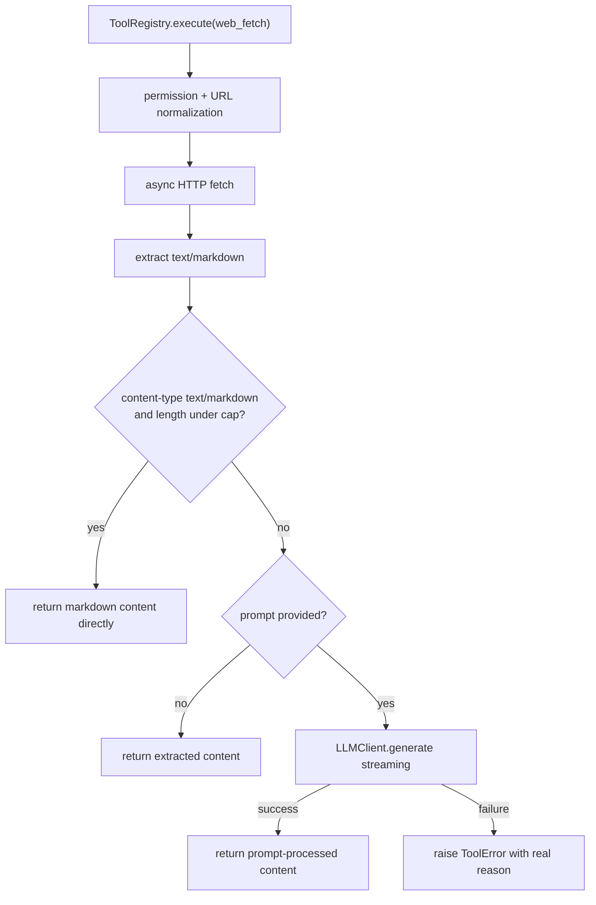

# bugfix-448: web_fetch 取消与 prompt 处理退化 — 技术方案

> Unit branch: `unit/bugfix-448` (will be created by orchestrator)
> 对齐: incident.md v1

## Changelog

- 2026-06-30: 初稿定稿。决定升级用户主动中断的 run 层语义，引入 sync-compatible async tool 执行分支，并将
  `web_fetch` 迁到 async HTTP + async LLM prompt 链路；补 kernel/gateway/cli delta-spec。
- 2026-06-30: 吸收 design-review WARNING，补齐取消传播官方路径、async liveness、discard/recovery 边界、
  未迁移 sync 工具的剩余语义，以及旧中断单测需要同步改写的验证要求。

## 现状分析

### 涉及范围

- `src/agent/core/runs/registry.py` 负责 run 生命周期、`interrupt()`/`cancel()` 与 carrier task
  强取消。当前 `interrupt()` 只有在 `foreground_stopper(session_id)` 返回 true 时才 force-cancel
  carrier task；无 foreground stopper 时只设置 `RunController.abort(user_initiated=True)`，等待运行逻辑
  合作式观察 abort。
- `src/agent/core/agent/run_control.py` 已有跨线程 `RunController.abort_event` 与
  `user_interrupt_event`。这是区分用户 `/stop` / CLI Ctrl-C 与系统收尸的既有归因来源。
- `src/agent/core/tools/registry.py` 负责工具执行与 hook lifecycle。当前同步工具统一通过
  `await asyncio.to_thread(tool.run, normalized_args, execution_context)` 执行，并在外层包通用 liveness
  ticker；它能防止长工具沉默被 watchdog 误收尸，但不能停止 worker thread 中的同步阻塞 I/O。
- `src/agent/core/agent/loop.py` 当前创建并驱动 `StreamingToolExecutor`，但取消路径没有调用
  `executor.discard()`。因此 run carrier 被取消时，executor 内已启动的工具 task 不会自动随 run 收口。
- `src/agent/core/tools/base.py` 的真实 `ToolContext` 已携带 `llm_client` 与 execution callback，但没有
  暴露给工具的取消信号。`src/agent/sdk/contracts.py` 的公开 `ToolContext` Protocol 也尚未承诺取消字段。
- `src/agent/platform/tools/builtins/web_fetch.py` 负责 URL 校验、权限决策、HTTP 抓取、HTML 转文本、
  prompt 二次处理和 presenter 展示字段。当前 HTTP 抓取走同步 `httpx.Client.get()`；prompt 分支仍按旧式
  `LLMGenerateRequest(stream=False)` 调用 LLM，异常被吞掉后 fallback 为原始正文。
- `src/coding_cli/commands.py` 已将活跃 turn 期间的 Ctrl-C 映射到 `kernel.interrupt(session_id)`。
- `src/personal_assistant/gateway/inbound_pipeline.py` 已将 IM `/stop` 映射到 `kernel.interrupt(session_id)`，
  并将用户中断 run 的 tool_call reconcile content 投影为
  `[Request interrupted by user for tool use]`。
- `src/IM/frontend/` 本 unit 不改 UI 组件；它只消费既有 tool_call 状态、reason、output/detail。

### 既有约束

- 产品包只能经 `agent.sdk` 调用内核；本 unit 不让 `coding_cli` 或 `personal_assistant` import
  `agent.core` / `agent.platform` 内部。
- `agent.core` 不能依赖 `agent.platform`。取消信号、工具执行协议、run 生命周期必须留在 core 抽象层；
  `web_fetch` 作为 platform built-in 只能消费 core 提供的上下文字段或协议。
- SDK 公开 `ToolContext` Protocol 目前只承诺 `repo_root` / `cwd` / `session_id` /
  `session_metadata`。本 unit 不给真实 `ToolContext` 或公开 Protocol 增加取消字段，避免形成第二条取消通道。
- `bugfix-417` 已把用户主动中断的 tool result content 定为 CC 原串
  `[Request interrupted by user for tool use]`；本 unit 不能为 `web_fetch` 发明另一套用户中断文案。
- `feat-425` 已把 `web_fetch` 展示字段定为 `content` / `final_url` / `status`；本 unit 不能让 IM
  展开卡重新退化为空正文或机器串。
- `bugfix-355` 已把 WebFetch 权限判定约束在 URL 校验、preapproved host、hostname rules、fallback ask
  这条链上；本 unit 不改变权限策略。

### 契约层 grounding

- `docs/specs/kernel/spec.md` 已声明 `cancel(run_id)` 必须强制终止 parked run 并释放 session 锁，也声明
  transcript 进入模型前必须闭合 tool call。当前 `cancel()` 与该契约一致；`interrupt()` 的无-stopper
  分支比用户对 `/stop` 的期望更弱，是本 unit 需要补强的行为。
- `docs/specs/gateway/spec.md` 已声明 `/stop` 中断当前运行，并在 run 终态时对在飞 tool_call 收口为
  “已中断”。本 unit 需要保证 `web_fetch` 也能走到这个收口路径。
- `docs/specs/im/spec.md` 已声明 `web_fetch` 折叠行显示 URL，展开卡显示 URL、状态码和正文；本 unit
  只强化结果来源和中断语义，不改变展示目标。
- `docs/specs/cli/spec.md` 尚未明确交互 REPL 中 Ctrl-C 的中断契约，但当前代码与 `bugfix-417` 历史已经
  使 Ctrl-C 调用 `kernel.interrupt()`。本 unit 预计需要补 delta-spec，使 CLI 交互中断行为进入长青契约。

### 可复用能力

- 复用 `RunController.abort(user_initiated=True)` 和 `is_user_interrupt` 作为用户主动中断归因来源。
- 复用 runtime 的 `_recover_orphaned_tool_calls()` 与 `JsonlSessionStore.append_tool_call_recovery()`，
  保持 transcript 闭合与 CC 原串回填。
- 复用 `ForegroundExecutionRegistry` 的设计原则：底层资源有专属 stopper 时先停底层资源，再让 run
  carrier task 收口；没有底层 stopper 时，run 层仍必须释放 session 锁。
- 复用现有 `LLMClient.generate()` async streaming 形态与 `RetryingLLMClient` 的统一 LLM 错误/重试语义；
  `web_fetch(prompt=...)` 不再使用旧的同步 response API，也不在工具里吞错 fallback。
- 复用 `ToolRegistry.execute()` 的 hook dispatch、presentation、generic liveness 和 result serialization
  入口；不要为 `web_fetch` 绕开工具执行管线。

### 相关历史

- `bugfix-355`：WebFetch 权限模型对齐 CC，修复时必须保住权限链。
- `bugfix-402`：建立 append-only transcript recovery，修复时必须保证中断/错误路径仍有合法 tool result。
- `bugfix-417`：建立用户中断 CC 原串、前台 bash stopper、通用 liveness。它留下一个旧边界：无 foreground
  stopper 时 `interrupt()` 只 cooperative abort；本 unit 需要修订这条边界以覆盖 `web_fetch`。
- `feat-425`：WebFetch 展示字段修复，只关注 presenter 和 `content`/`final_url`，没有背书 prompt
  静默 fallback。

## 架构总览



核心变化是把“用户主动停止”从部分工具特例提升为 run 层不变量：产品入口仍只调用
`kernel.interrupt()`，内核负责强收口 run、闭合 transcript；`web_fetch` 额外接入可取消 HTTP 和 prompt LLM，
避免只是释放会话而把底层请求留到后台超时。

## 关键决策

### 决策 1: 用户主动中断统一强收口当前 run

**选了 `/stop` / Ctrl-C 对当前活跃 run 统一 hard-cancel carrier task；有底层 stopper 时先停底层资源，没有 stopper 也必须释放 session 锁并闭合 transcript。**

- **理由**: 这对齐 CC 的用户侧体验：用户按停后当前操作立即收口，同会话可继续，模型拿到用户中断 tool
  result，而不是等某个同步工具合作式返回。旧语义只保护了 bash 这类已登记 stopper 的工具，无法覆盖
  `web_fetch`。
- **拒绝**: 继续维持“无 foreground stopper 时只 cooperative abort”。这会让 `web_fetch` 卡在同步 HTTP /
  prompt 处理时仍占住 run 生命周期，用户体验与 CC 不一致。
- **风险**: 旧单测 `test_interrupt_without_inflight_foreground_tool_only_aborts` 锁住了 cooperative abort
  语义；本 unit 需要有意识地改写该期望，并确保普通非阻塞 run 的中断仍呈现为用户主动停止，而不是系统失败。

### 决策 2: 工具执行层新增 async-native 分支，sync 工具继续兼容

**选了在 `ToolRegistry.execute()` 中优先执行工具的可选 `run_async(args, ctx)`，没有 `run_async` 的工具继续走现有 `asyncio.to_thread(tool.run, ...)`。**

- **理由**: Python 线程里的同步阻塞 I/O 不能被可靠 kill。仅 hard-cancel carrier task 可以释放 session 锁，
  但无法保证 `web_fetch` 的 HTTP/prompt 操作不在后台继续跑到超时。把可取消 I/O 做成 async task，才能让
  `CancelledError` 顺着 task 取消传播到 HTTP 和 LLM prompt。
- **兼容**: 现有工具协议、hook、generic liveness、presentation 入口不拆。`run_async` 是增量能力，不要求本
  unit 迁移所有工具。
- **取消传播官方路径**: 不把 `RunController`、`cancel_event` 或任何取消字段塞进 `ToolContext`，也不允许工具经
  `metadata["run_id"]` 反向查 run registry。用户中断先由 `RunsRegistry` 取消 run carrier；carrier 取消会取消
  `AgentLoop`；`AgentLoop` 再 discard 它持有的 `StreamingToolExecutor`；async-native 工具通过
  `asyncio.Task.cancel()` / `CancelledError` 在 `await httpx.AsyncClient.get(...)`、LLM stream 等 await 点自然停止。
- **边界**: 不把取消字段加入 `agent.sdk.contracts.ToolContext` 的公开承诺。第三方工具作者本 unit 仍只依赖既有
  公开 Protocol。
- **liveness**: async 分支仍必须被现有 generic liveness ticker 包裹，和 sync `to_thread` 分支一样在长 HTTP /
  长 prompt 阶段持续发 execution update，防止 Gateway idle watchdog 误判。不能因为 `run_async` 就绕开 ticker。
- **后续**: `web_search` / `send_message` / `cron` 等同步 HTTP 工具可在后续 unit 逐步迁移。bash 不能简单照搬
  `web_fetch`：它的核心资源是外部进程组，仍需要 `ForegroundExecutionRegistry` 的 killpg stopper。

### 决策 3: AgentLoop 取消时必须 discard 未完成工具任务

**选了让 run carrier 被取消或用户 abort 收口时，`AgentLoop` 对当前 `StreamingToolExecutor` 执行 discard，取消已启动工具 task 并标记未完成 tool call 的内部清理状态。**

- **理由**: 当前 `StreamingToolExecutor` 会为每个工具创建独立 `asyncio.Task`。如果只取消 carrier，而不
  cancel executor 内部 task，async-native `web_fetch` 仍可能成为孤儿任务。
- **归因**: 用户 `/stop` / Ctrl-C 产生的闭合内容继续使用
  `[Request interrupted by user for tool use]`；系统取消或其他异常不冒充用户中断。
- **约束**: transcript recovery 仍由 runtime 的 finally 路径兜底。executor discard 只负责取消 task、清队列和
  阻止 late result；用户中断路径不能再把 discard 生成的内部 result yield 给模型或 transcript。持久化闭合统一
  由 runtime recovery 写入 CC 原串，避免同时出现 `"aborted: tool execution discarded"` 和
  `[Request interrupted by user for tool use]` 两套文案。

### 决策 4: `web_fetch(prompt)` 不再静默 fallback

**选了用现行 `LLMClient.generate()` async streaming API 实现 prompt 二次处理；prompt LLM 失败时返回显式 error tool_result，保留真实错误原因，不返回原始抓取内容冒充成功。**

- **理由**: 原问题的第二半是真缺陷：旧代码使用过期 `LLMGenerateRequest(stream=False)`，并吞掉所有异常，
  导致用户以为 prompt 已处理，实际得到原网页正文。
- **错误形态**: URL/网络/HTTP 抓取失败保持 `web_fetch` 既有 in-band 失败展示模型，避免破坏 `feat-425`
  presenter；prompt LLM 失败属于“网页抓取成功但二次 LLM 处理失败”，应抛为工具错误结果，让用户和模型都能
  看见失败原因。
- **超时**: 不新增 WebFetch prompt 专属超时。prompt 处理使用统一 LLM client 的 timeout/retry/cancel
  语义；HTTP 抓取继续保留 fetch 自身 timeout，并且 async task 可响应用户取消。

### 决策 5: 短 markdown 直接返回，不绑预批准域名

**选了当响应 `Content-Type` 是 `text/markdown` 且正文长度小于 prompt 处理上限时，`web_fetch` 直接返回 markdown 原文；这个策略不要求域名处于 preapproved 列表。**

- **理由**: 这是内容处理优化，不是权限放行。权限仍在 URL/host 校验阶段决定；一旦允许 fetch，短 markdown
  已是目标内容，无需再交给 prompt LLM 压缩或重写。
- **交互影响**: 若用户给了 prompt，但页面已经是短 markdown，返回原文符合本 unit 澄清结果；不应为了 prompt
  再引入额外 LLM 失败面。

### 决策 6: 单 milestone 垂直闭环

**选了一个 milestone 覆盖 run interrupt、tool async seam、`web_fetch` 迁移和测试。**

- **理由**: 这些改动不是可独立交付的分层重构。只改 run interrupt 会释放锁但留下后台同步请求；只改
  `web_fetch` async 但不 discard executor 会留下孤儿 task；只修 prompt API 不能解决 `/stop`。单个垂直切片
  更容易用一组端到端验收锁住用户体验。

### 决策 7: 未迁移 sync 工具只承诺 run 层收口

**选了本 unit 只保证所有工具在用户中断后释放 session 锁并闭合 transcript；只有 async-native 工具或已有 foreground stopper 的工具保证底层 I/O/进程也被停止。**

- **理由**: `asyncio.to_thread()` 不能强杀 Python worker thread。把 `web_search` / `send_message` / `cron` 等
  sync HTTP 工具一起迁移会扩大 blast radius，偏离本 bugfix 的主线。
- **用户侧语义**: 用户按 `/stop` / Ctrl-C 后，同会话必须能继续，旧 run 的 late result 不能污染新 run；但未迁移的
  sync 工具底层请求可能在后台跑到自身 timeout。这个残余只影响资源占用，不应影响 transcript 或 session lock。
- **后续策略**: 后续按工具重要性逐个迁移到 async-native 或专属 stopper，不在本 unit 里承诺“一次性停止所有底层
  阻塞资源”。

## 接口与数据流

### 中断路径



用户可见结果：

- Gateway: `/stop` 仍即时回复“已停止当前操作。”；正在运行的 `web_fetch` 卡片收口为“已中断”，正文为 CC 原串。
- CLI: 活跃 turn 期间 Ctrl-C 打印既有中断提示，REPL 留在同一 session，可继续输入下一轮。
- 内核: `interrupt()` 后 session lock 必须释放；late `web_fetch` 结果不能追加到下一轮 transcript。

### 工具执行协议

- `ToolRegistry.execute()` 保持唯一工具执行入口，继续负责参数校验、before/after hooks、generic liveness、
  result serialization 和 error wrapping。
- 执行时按以下顺序选择实现：
  1. 工具有 `run_async(args, ctx)`：在当前 event loop 中 `await`，让 task cancellation 能穿透到底层 async I/O。
  2. 否则：保留 `await asyncio.to_thread(tool.run, args, ctx)`，保证所有既有 sync 工具行为不变。
- 两个分支都必须在同一个 `execution_update_ticker` 作用域内执行；异步工具不能自建第二套 hook/liveness 管线。
- `StreamingToolExecutor.discard()` 从被动能力变成 run 收口路径的一部分。它必须 cancel 已启动 task、清理队列，
  并把未完成 tool call 标记为 interrupted/cancelled，使 runtime recovery 有一致输入。用户中断时，discard 结果
  是 executor 内部清理状态，不作为正常 tool result 继续 yield；runtime recovery 是唯一落 transcript 的闭合点。

### `web_fetch` 数据流



实现约束：

- 保留 WebFetch 权限路径和 `feat-425` presenter 字段：`content` / `final_url` / `status`。
- async HTTP 使用 request timeout 与 task cancellation；用户取消时不把取消包装成普通 fetch 失败。
- prompt LLM 读取 async stream，收集 text delta；若 LLM client 返回模型错误、上游错误或取消，错误必须显式进入
  tool result。
- `serialize_result` 继续承担过长内容截断，避免把超长正文直接灌入模型。
- 未迁移的 sync 工具仍可能在 `to_thread` worker 中跑到自己的 timeout；run/executor 收口后这些 late return 必须被
  丢弃，不能触发 after-hook 的用户可见 completion，也不能追加 transcript。

## 契约层增量 (delta-spec)

- kernel: `specs/kernel/spec.md`
- im: no spec delta
- gateway: `specs/gateway/spec.md`
- cli: `specs/cli/spec.md`

IM 没有 delta-spec：既有 `web_fetch` 工具卡显示 URL、状态和正文的契约不变，本 unit 改的是内核结果来源与
中断收口。

## 风险与回退

- **误伤普通 interrupt**: hard-cancel carrier task 会改变旧 cooperative interrupt 的时序。测试必须覆盖
  “无 foreground stopper 的 parked run 被中断后 session 可继续”和“空闲 session 调 interrupt 仍 no-op”。
- **孤儿工具 task**: async-native 工具引入后，如果 AgentLoop 没有在 finally/discard 中 cancel executor task，
  late result 会污染日志或占资源。测试必须显式断言 cancel 传播到工具 coroutine。
- **liveness 回退**: async 分支若没有复用 generic ticker，慢 HTTP 或慢 prompt 会重新触发 Gateway idle watchdog
  风险。测试需要覆盖 async 工具长时间 await 期间仍产生 execution update。
- **discard/recovery 双写**: executor discard 的内部错误文案不能进入用户可见 transcript；用户中断闭合只允许
  runtime recovery 写 CC 原串。
- **错误归因混淆**: 用户取消、HTTP 失败、prompt LLM 失败三类结果必须分开。用户取消用 CC 原串；HTTP 失败保留
  WebFetch 展示失败；prompt LLM 失败是 error tool_result。
- **SDK 表面膨胀**: 不把 `run_async` 或 cancellation field 写进公开 SDK contract，避免一次 bugfix 变成工具
  插件 API 扩容。若未来要公开 async tool authoring，另开 feature/refactor。
- **未迁移 sync 工具残留线程**: 本 unit 改变后，所有工具都应释放 run/session 和 transcript，但只有 async-native
  工具或前台 stopper 工具保证底层资源立即停止。后续迁移其他 sync HTTP 工具时要以这个设计为基线。
- **回退方式**: 若 async `web_fetch` 迁移导致不可控回归，可先保留 run hard-cancel 与 prompt API 修复，把
  async HTTP 迁移回滚为 sync fetch；但必须保留测试暴露“底层请求可能等 HTTP timeout 才结束”的残余风险，并在
  后续 unit 处理。

## Runbook for Reviewer

本 unit 不改前端组件；常规验收以单测/contract 为主，IM `/stop` 走真实 Gateway+IM 栈，CLI Ctrl-C 走真实
REPL。

| 服务 | Stop | Start | Health |
|---|---|---|---|
| IM + Gateway worktree 栈 | `./scripts/e2e-down.sh` | `./scripts/e2e-up.sh && source .e2e-ports.env` | `curl -fsS "$IM_URL/chat" >/dev/null`，并确认 `.gateway.log` 无启动错误 |
| 本地 LLM proxy | 不由本 unit 管理 | 使用操作者已有 `http://127.0.0.1:4000` | `curl -fsS http://127.0.0.1:4000/health` |
| Coding CLI | 退出 REPL 或 Ctrl-D | `PYTHONPATH=src python -m coding_cli.main --model <可用模型>` | 进入 REPL 后能创建 session 并响应普通消息 |

建议验证命令：

```bash
PYTHONPATH=src pytest -q \
  tests/unit/test_run_cancel.py \
  tests/unit/test_streaming_tool_executor.py \
  tests/unit/agent/platform/tools/builtins/test_web_fetch_run.py \
  tests/unit/agent/platform/tools/builtins/test_web_fetch_permissions.py
```

`tests/unit/test_run_cancel.py` 必须随实现同步改写旧期望：无 foreground stopper 的用户 interrupt 不再只是
cooperative abort，而要 force-cancel carrier 并释放 session。

```bash
PYTHONPATH=src pytest -q \
  tests/unit/test_cli_async_repl_sdk.py \
  tests/unit/personal_assistant/test_gateway_stop_command.py \
  tests/contract/test_agent_sdk_surface_guard.py \
  tests/contract/test_kernel_sdk_behavior_contract.py \
  tests/contract/test_cli_http_only_contract.py \
  tests/contract/test_core_no_platform_imports.py
```

手工/自动化验收要覆盖：

- CLI：触发一个慢 `web_fetch` 后按 Ctrl-C，看到中断提示，同一 REPL 下一条消息可继续。
- IM：通过真实 Gateway 发起慢 `web_fetch` 后发送 `/stop`，用户收到停止确认，工具卡最终为“已中断”，正文含
  `[Request interrupted by user for tool use]`，下一条消息不被 late fetch 污染。
- WebFetch prompt：抓取成功且 prompt LLM 成功时返回处理后正文；prompt LLM 失败时返回明确 tool error；短
  `text/markdown` 小正文直接返回原文。

## Milestones

| Milestone | 名称 | 依赖 | 风险 | 主要改动范围 | Exit Criteria |
|---|---|---|---|---|---|
| bugfix-448-M1 | interrupt-and-web-fetch | — | 高 | `src/agent/core/runs/registry.py`, `src/agent/core/agent/loop.py`, `src/agent/core/agent/tool_executor.py`, `src/agent/core/tools/registry.py`, `src/agent/platform/tools/builtins/web_fetch.py`, CLI/Gateway stop 相关测试 | `/stop`/Ctrl-C 对 `web_fetch` 立即释放 session 并闭合 tool call；async tool path 与 sync fallback 均被单测覆盖；`web_fetch(prompt)` 不静默 fallback；短 markdown 直接返回；delta-spec 通过人工核对，相关 unit/contract 测试 green |
