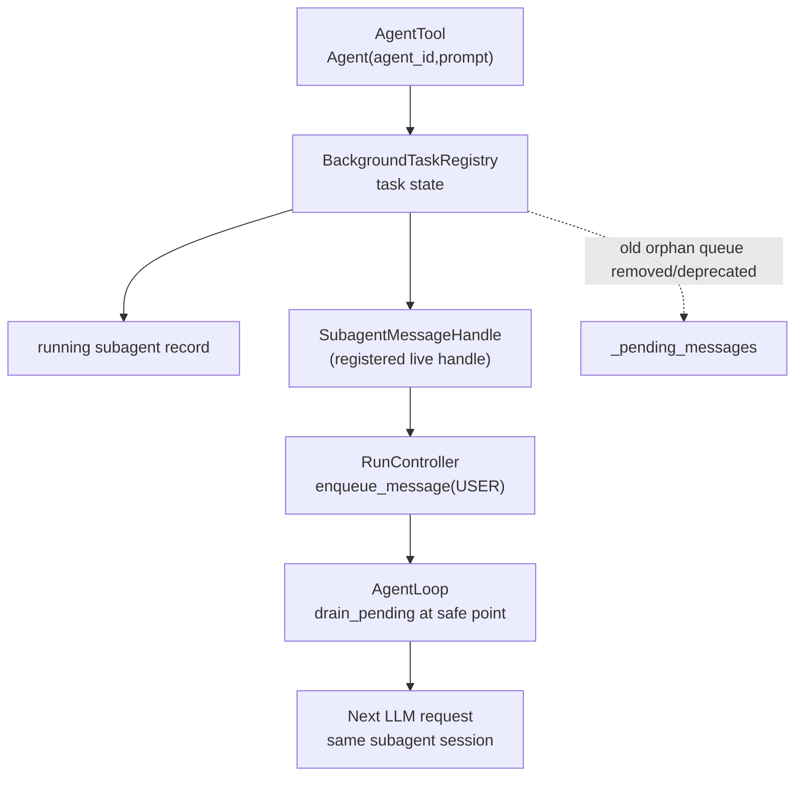
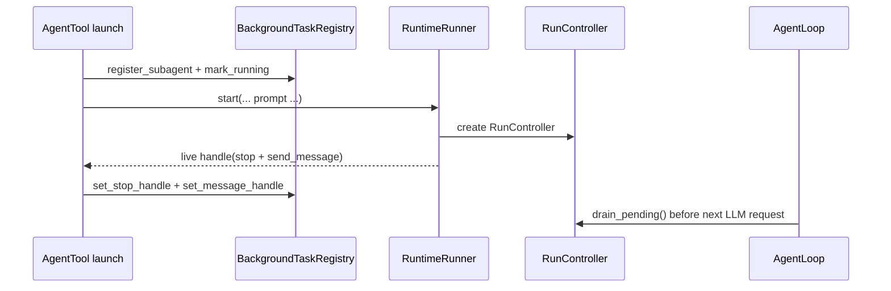
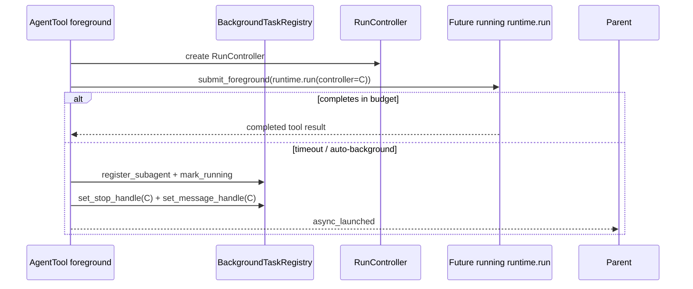
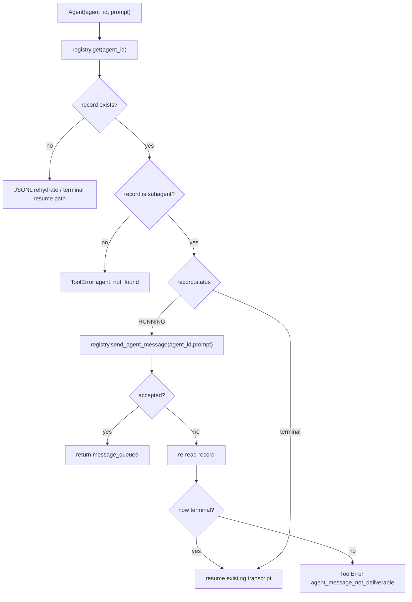

# bugfix-450: running subagent resume delivery — 技术方案

> 对齐: incident.md v1
> Unit branch: `unit/bugfix-450` (will be created by orchestrator)

## Changelog

## 现状分析

### 涉及范围

- `src/agent/platform/tools/builtins/agent.py`：`Agent(agent_id=..., prompt=...)` 命中 running subagent 时当前只写入 `BackgroundTaskRegistry._pending_messages` 并返回 `message_queued`。这是用户可见假成功入口。
- `src/agent/core/background_tasks/registry.py`：维护 background task 生命周期、stop handle 和无人消费的 subagent pending message list。生产 `AgentRuntime` / `AgentLoop` 不读取该 pending list。
- `src/agent/platform/background_tasks/runtime_runner.py`：explicit background subagent 运行时已创建 `RunController` 并传给 `runtime.run()`，但返回给 registry 的 handle 只暴露 `stop()`，不暴露 live follow-up 注入。
- `src/agent/platform/tools/builtins/agent.py` 的 foreground auto-background 路径：超出前台预算后会把同一个 subagent run 注册成 background task，也持有 `RunController`；因此本修复必须同时覆盖 explicit background 与 auto-background 后的 running subagent。
- `src/agent/core/agent/run_control.py` 与 `src/agent/core/agent/loop.py`：已有成熟的 round-boundary pending injection 机制。`RunController.enqueue_message()` 写入 FIFO pending queue；`AgentLoop` 在下一次 LLM request 前 `drain_pending()`，并在 terminal window 用 `try_commit_terminal()` 处理竞态。
- `tests/unit/agent/tools/test_agent_tool.py` 与 `tests/integration/background_tasks/test_agent_continuation.py`：现有测试只断言 registry 能 drain 到 pending string，没有证明 subagent runtime 消费了 follow-up。

### 既有约束

- `agent.core` 不依赖 `agent.platform`；background task registry 可以保存协议型 handle，但不能直接执行 LLM 或依赖 platform runtime。
- running follow-up 必须安全点消费：不能中途打断工具执行、shell/file edit 或 LLM stream。
- 同一 running subagent 不能因为 follow-up 启动第二个并发 run。
- `message_queued` 只能表示 live subagent 投递链路已接受消息，不能表示“写入无人消费的内存 list”。
- subagent 的 `agent_id`、transcript/output file、terminal resume 语义必须保持不变。

### 可复用能力

- 复用 `RunController.enqueue_message()` / `AgentLoop.drain_pending()` 作为 live subagent follow-up 的唯一消费通道。
- 复用 `bugfix-426-midrun-message-steering` 已打磨过的 FIFO、安全点、terminal race 语义，不另造一套 subagent-only pending queue。
- 复用 `BackgroundTaskRegistry.set_stop_handle()` 的 live handle 注册模式，但把“停止能力”和“follow-up 注入能力”区分为两个协议能力，避免把 stop handle 强行扩成不相关职责。

### 相关历史

- `feat-337-cc-background-subagents`：原始设计要求 running subagent follow-up 进入 pending messages，并在下一安全点作为 user-role input 追加到 subagent runtime session 和 transcript。实现只落到了 registry 入队。
- `bugfix-426-midrun-message-steering`：恢复并完善主会话 mid-run steer，证明内核已有可复用的 live run pending injection 机制。
- `feat-449-subagent-observability`：相关但不阻塞。本单不扩大为 subagent 观测面重做，只要求能通过 transcript / LLM request / 输出验证 follow-up 被消费。

## 架构总览

本修复把 running subagent follow-up 从“registry 孤岛队列”改为“live run controller 注入”。`AgentTool` 仍然先通过 registry 找到 running subagent，但 `message_queued` 的判定改为 live handle 接受成功。



## 关键决策

### 决策 1: running follow-up 复用 RunController live 注入

**选用每个 running subagent 自己的 `RunController.enqueue_message()` 作为唯一真实投递链路；registry 只保存可调用的 live message handle。**

- **理由**: 这是当前内核已经存在并被 `bugfix-426` 验证过的安全点注入机制；它天然满足 FIFO、不中断当前工具/LLM stream、terminal window 竞态处理。
- **拒绝**: 继续使用 `BackgroundTaskRegistry._pending_messages` 并补消费者，因为那会复制 `RunController` 已有职责，还要重新处理安全点和 terminal race；直接启动第二个 run 处理 follow-up，会违反 feat-337 的 running continuation 不变量。
- **风险**: explicit background 与 foreground auto-background 都要注册 live handle；漏掉任何一条启动路径都会留下新的假 queued 分支。

### 决策 2: live 投递不可用时显式失败，不静默另起 subagent

**如果 registry 仍显示 subagent running，但 live message handle 不存在或拒绝 enqueue，`AgentTool` 不得返回 `message_queued`，也不得静默启动第二个并发 subagent。**

- **理由**: 用户要求的是给“那个正在运行的 worker”追加上下文。静默新开 subagent 会丢失原 worker 的当前执行上下文，效果完全不同；假成功则继续误导主 agent。
- **拒绝**: fallback 到 `_resume_subagent()` 新启一轮，因为原 worker 可能仍在运行，会形成两个同 agent_id 语义的并发执行；继续写 registry pending list，因为仍然无人消费。
- **风险**: 极窄竞态下可能出现“record 仍 running，但 worker 已经到终态、live handle 已 commit terminal”的失败结果。该结果比假 queued 更安全；用户或主 agent 可以稍后重试，届时 record terminal 后走现有 resume。

## 接口与数据流

### Live message handle 协议

在 `agent.core.background_tasks.interfaces` 增加一个最小协议，表示“这个 running subagent 可以接收 follow-up”：

```python
class BackgroundSubagentMessageHandle(Protocol):
    def send_message(self, prompt: str) -> bool: ...
```

语义：

- 返回 `True`：follow-up 已进入 live run 的安全点注入队列，可向主 agent 返回 `message_queued`。
- 返回 `False`：live run 已经无法接收该消息，调用方不得返回 `message_queued`。

`BackgroundTaskRegistry` 保存 `task_id -> BackgroundSubagentMessageHandle` 的内存映射，并提供：

```python
def set_message_handle(task_id: str, handle: BackgroundSubagentMessageHandle) -> None: ...
def send_agent_message(agent_id: str, prompt: str) -> bool: ...
```

`send_agent_message()` 是 running continuation 的唯一入口。现有 `enqueue_agent_message()` / `drain_agent_messages()` 不再作为生产路径；测试应迁移到 live delivery 行为。

### Runner handle

`RuntimeRunner.start()` 创建的 `RunController` 继续作为真实控制面。返回 handle 除 `stop()` 外还应支持 `send_message(prompt)`：

```text
send_message(prompt)
  -> controller.enqueue_message(
       LLMMessage(role="user", content=prompt),
       origin=RunOrigin.USER,
     )
```

`RunOrigin.USER` 的理由：follow-up 是主 agent 代表用户/编排者主动发出的继续指令，不是后台任务完成通知。

explicit background subagent 数据流：



foreground auto-background 数据流：



### Continuation path



`ToolError` message 应让主 agent 明白：目标 subagent 当前未确认可接收 follow-up，消息没有被当作已送达处理；不要说“已发送”。

## 契约层增量 (delta-spec)

- kernel: `specs/kernel/spec.md`
- im: no spec delta
- gateway: no spec delta
- cli: no spec delta

## 风险与回退

- **live handle 注册遗漏**：explicit background 与 foreground auto-background 都会形成 running subagent。退出标准要求两条路径都有测试覆盖。
- **terminal 竞态**：`record.status == RUNNING` 与 `send_message()` 之间，subagent 可能刚完成。handle 返回 False 时重读 record；如果已 terminal 则走 resume，否则显式失败。
- **测试假阳性复发**：现有测试通过手动 `drain_agent_messages()` 验证孤岛队列。新测试必须证明 handle/RuntimeRunner/AgentLoop 消费链路有效，不能只测 registry 内存 list。
- **回退**：回滚本 unit 会恢复旧的假 queued 行为，无数据迁移。若实现期发现 live injection 影响 terminal resume，可临时只禁用 running follow-up 并返回明确 ToolError，但不得恢复假成功。

## Runbook for Reviewer

| 服务 | 停止命令 | 启动命令 | 健康检查 |
|---|---|---|---|
| 无常驻服务 | — | — | 本 unit 修改内核库代码；reviewer 通过测试和真实 `agent` tool 旅程驱动 |

**Review 驱动方式**: 端到端真栈；本 unit 不改客户端面，可用客户端实际调用的同一 `agent` tool 路径代驱动，验证 running follow-up 是否进入 subagent 输出。

## Milestones

默认单 milestone。修复点虽跨 core/platform/tool/tests，但它是一条不可拆的垂直链：协议和 handle 不落地，`AgentTool` 无法可信返回；`AgentTool` 不改，测试无法证明用户场景恢复。拆成横切 milestone 会产生半成品。

| ID | 标题 | 依赖 | 并行组 | 范围 | 退出标准 |
|---|---|---|---|---|---|
| bugfix-450-M1 | impl | — | A | `src/agent/core/background_tasks/interfaces.py`; `src/agent/core/background_tasks/registry.py`; `src/agent/platform/background_tasks/runtime_runner.py`; `src/agent/platform/tools/builtins/agent.py`; `tests/unit/agent/tools/test_agent_tool.py`; `tests/integration/background_tasks/test_agent_continuation.py`; related background task regression tests if signatures change | `[reviewer]` running subagent follow-up 不再假成功：主 agent 发送 follow-up 后，原 subagent 后续能实际响应或在可读输出中体现收到 follow-up（覆盖 incident Requirement: running subagent follow-up 真实投递）。<br>`[reviewer]` live delivery 不可用时，主 agent 不看到“已成功排队”，也不会静默开第二个 subagent（覆盖 Requirement: 不再返回假 queued 状态）。<br>`[reviewer]` terminal subagent resume 与 `output_file` 读取体验不退化（覆盖 Requirement: 既有后台任务体验不退化）。<br>`[worker]` explicit background 和 foreground auto-background 两条 running subagent 路径都注册 live message handle。<br>`[worker]` running follow-up 测试验证 `RunController` / runtime 消费链路，而不是直接 `drain_agent_messages()`。<br>`[worker]` 最窄测试通过：`pytest -xvs tests/unit/agent/tools/test_agent_tool.py tests/integration/background_tasks/test_agent_continuation.py`。<br>`[worker]` 相关后台任务回归通过：`pytest -xvs tests/integration/background_tasks/test_agent_background.py tests/integration/background_tasks/test_auto_background.py tests/unit/agent/tools/test_task_stop_tool.py`。 |
