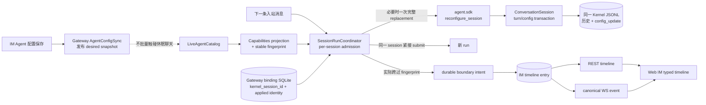
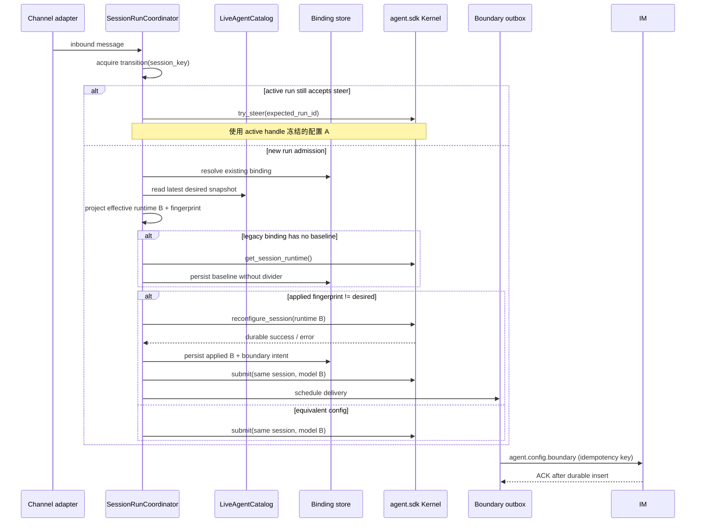
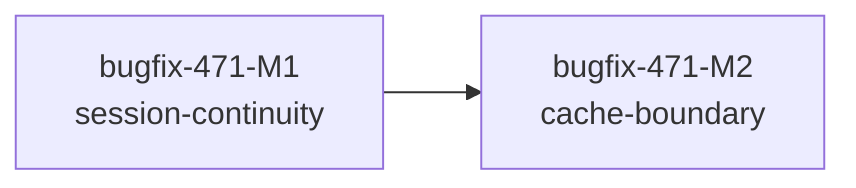

# bugfix-471: Agent 配置更新后保持聊天上下文连续 — 技术方案

> 对齐: incident.md v1
>
> Unit branch: `unit/bugfix-471` (will be created by orchestrator)

## Changelog

## 现状分析

### 涉及范围

- `src/agent/sdk/kernel.py` 是产品唯一允许调用的 Kernel interface；会话创建已接收 prompt、skills、tools、features，但没有在原 session 上替换运行配置的 interface。
- `src/agent/core/session/conversation.py` 的 `ConversationSession` 已拥有 transcript、turn serialization、lifecycle gate 与 loaded state，是把配置替换做成单一事务的既有深模块。
- `src/agent/core/session/transcript.py` 已能在恢复时读取并归并 `config_update` entry，却没有对应 writer，且当前归并字段不覆盖完整 prompt seed 与 features。
- `src/personal_assistant/gateway/agent_config_sync.py` 发布新 `LiveAgentSnapshot` 后，`GatewaySessionBinder.invalidate_stale()` 会删除旧 revision binding；`SessionRunCoordinator` 随后为同一聊天创建空 session，正是本缺陷的直接路径。
- `src/personal_assistant/gateway/session_composition.py` 已统一投影 prompt、skills、enabled tools、features；`session_keys.py` 的 SQLite binding 只存 session id 与回复目标，没有“该聊天实际采用了哪份运行配置”的持久状态。
- `src/IM/infra/db.py` 已有可持久化、`message_id` 可空的 `conversation_events`，但消息历史 REST、前端 reducer 与 `MessagePane` 仍以 `Message[]` 为唯一时间线模型。
- 外部 channel 经 `IMShadowConversationSync` 先取得 shadow conversation id，再进入同一 Gateway session key；因此上下文连续性可共用 M1，Web IM 分界线则锚到 shadow conversation 的用户消息，不向外部平台伪造消息。

### 既有约束

- `personal_assistant` 只能 import `agent.sdk`，不能穿透到 `agent.core` 或自行操作 Kernel JSONL。
- 一条活跃回复可能包含多次模型往返与 steer；配置必须以新 run admission 为边界，不能在 turn 中途热切换。
- model 当前由 `Kernel.submit(..., model=...)` 每 run 指定，prompt/tools/skills/features 当前主要在 session seed 中；修复必须把它们视为同一份原子运行配置，不能新 model 配旧 capabilities。
- IM `Message` 是用户、Agent、system 消息的领域对象。缓存分界线不参与模型上下文，也没有发送者、气泡状态或消息菜单，不能伪装为 system message。
- timeline 必须支持初次 REST 加载、向前分页、WebSocket 实时到达、重连恢复与 fork；这些路径要共享同一排序、锚定和幂等规则。
- 长青契约发生 drift：Gateway 已要求历史会话下一轮采用新模型并在重启后续接历史，IM 配置契约却仍写“只对新会话生效”，Kernel prompt 契约也把产品 prompt 写成整会话固定。本 unit 负责把三者收敛到实际目标行为。

### 可复用能力

- **扩展** `ConversationSession` 的 lifecycle/turn gate 与 JSONL transcript：同一 seam 已负责 turn、compact、discard、close 的一致性，新增一个完整 replacement interface 能把持久化、原子性、幂等和恢复隐藏在内核里。
- **复用** `project_agent_session_capabilities()`：创建 session、reconfigure 与 runtime fingerprint 必须来自同一次 projection，避免三份字段清单漂移。
- **扩展** `SessionRunCoordinator._transition(session_key)`：reconfigure、binding applied-state 更新、配置边界登记与 submit 在同一 per-session admission 临界区排序。
- **扩展** `PersistentSessionBindingStore`：它已是 crash-safe session binding 权威，适合同时持久化 applied runtime identity；不再用进程内 catalog revision 判断旧会话是否失效。
- **扩展** IM conversation event/read model 与现有用户 WS stream：独立 timeline entry 沿用持久事件和 canonical WebSocket 投递模式，但不复用 relay delivery receipt，因为 receipt 只描述 relay task 生命周期，外部入站也可能没有该 task。
- **不用** `fork_session()`：fork 会引入新 session identity、双 transcript、binding swap、message id remap 与 orphan 清理；普通配置更新不需要这些复杂度。
- **不用** IM 可见消息回灌 Kernel：IM 历史不是 Kernel transcript 的完整表示，无法忠实恢复 thinking、tool result、压缩和其他内核持久状态。

### 相关历史

- `refactor-463` 的原意是把入站状态所有权收回 Gateway，同时保持“下一轮新配置 + 会话连续”；其 revision invalidation 把配置一致性错误地实现成 binding 删除。
- `refactor-470` 只移动了 managed channel composition ownership，没有改变该失效语义。
- `feat-445` 的 fork 能力确立了“用户显式分叉”才创建新 session 的语义；配置编辑不应偷偷走同一路径。
- `refactor-460` 已把前端聊天状态集中到 reducer，新增 timeline union 应继续收敛在那里，不在页面组件分别拼接事件。

本 unit 命中 deep-module 设计：它调整 `agent.sdk` 的重要 interface，并把配置替换、持久化、turn serialization 和恢复归回 `ConversationSession`，以提高 Gateway 调用方的 leverage 与内核维护的 locality。

## 架构总览



**Before**：配置发布即删除旧 binding，同一聊天下一条消息取得新能力但进入空 session。

**After**：配置发布只更新 desired snapshot；每个聊天下一次新 run admission 在原 session 上原子替换配置并继续同一 transcript，Web IM 只在实际跨过配置边界时插入持久 divider。

## 关键决策

### 决策 1：配置更新在同一 Kernel session 上原子替换

**选了 `Kernel.reconfigure_session()`，保留 session id、transcript 与 Gateway binding。**

- **理由**：`ConversationSession` 已拥有配置、历史与 turn 序列化；一个完整 replacement interface 能把 JSONL schema、prompt seed、loaded-state invalidation 和幂等性藏在深模块内部。
- **拒绝**：reconfigured fork 会制造第二份 session 身份和 transcript；IM 消息 hydration 会让产品层复制不完整的内核持久化语义；继续旧 session 但只换 model 则会产生混合配置。
- **风险**：replacement 必须覆盖全部会影响后续请求的 session capabilities；遗漏字段会形成 fingerprint 与实际请求不一致，故 projection、fingerprint 与 reconfigure 共用一个 typed value。

### 决策 2：配置生效点是“下一新 run 的 admission”，不是保存时或消息入站时

**配置保存只更新 desired state；某聊天真正获得新 run 槽位时重新读取最新 snapshot，并在 submit 前应用。**

- **理由**：休眠聊天不应被写入；排队期间连续修改多次应折叠为最终版本；active run 及纳入该 run 的 steer 已由 `_ActiveRunHandle` 冻结配置 A。
- **顺序**：在同一 `_transition(session_key)` 内 resolve binding → 读取 catalog latest → project/fingerprint → 必要时 reconfigure → 持久化 applied identity → 记录 boundary intent → submit。
- **拒绝**：沿用入站时捕获的 snapshot 会依次重演排队期间的中间配置；配置 publish 时遍历 binding 会制造 O(休眠聊天) 写放大并违背用户语义。
- **风险**：reconfigure 失败时当前消息必须失败且不 submit；禁止单独用新 model 继续，以免配置撕裂。原 binding、历史和 applied identity 保持旧值，可在下一次 admission 重试。

### 决策 3：运行配置身份使用稳定 effective fingerprint

**fingerprint 对实际投影到一次新 run 的完整有效配置做 canonical hash，而不是使用进程 revision 或 IM profile version。**

纳入：resolved model、四槽 `PromptSlots` 的有序名称与文本、resolved enabled tools、skills 的显式语义、effective Kernel features，以及未来真正改变模型请求或工具能力的字段。canonical representation 必须区分 `None`（默认发现/继承）与空集合（显式禁用），map key 排序、list 保持语义顺序，使用带 schema version 的 SHA-256。

排除：title/display name、avatar、description、group reply routing、heartbeat cadence 等不改变该 foreground run 请求/能力的字段。`profile_version` 仅作为 provenance 持久化与排障，不参与等价判断。

- **拒绝**：`LiveAgentSnapshot.revision` 在 Gateway 重启后重置；`profile_version` 表示 IM 配置同步代次，不证明某个 run 实际采用了哪些能力。
- **风险**：fingerprint schema 未来变化不能给所有旧聊天制造虚假 divider；schema version 变化必须提供 baseline migration 或显式兼容比较。

### 决策 4：Gateway 持久化“实际采用状态”，旧 binding 惰性建立 baseline

**每个 binding 持久化 `applied_runtime_fingerprint`、fingerprint schema、applied profile provenance；不再因 catalog revision 变化删除 binding。**

- 新 binding 创建时用创建 session 的同一 projection 写入 applied identity。
- 已有列值完整时，admission 直接与 desired fingerprint 比较。
- 升级前旧 binding 列值为空时，Gateway 通过新的 SDK session inspection 读取该 transcript 当前已持久化的 runtime identity；能读取则回填 baseline，不产生 divider，再正常比较 desired。
- 极旧 transcript 不含可计算 identity 时，第一次 admission 用当次 desired config reconfigure 同一 session并把它记为 baseline，**不显示 divider**。这是一次兼容性保守选择：宁可首轮不解释缓存边界，也不把部署升级误报成用户修改配置；此后变化均精确检测。
- fork 后的新 binding 以 fork 结果 transcript 的当前 identity作为 baseline，fork 创建本身不产生配置更新 divider。

- **拒绝**：把空列当“不相等”会使升级后所有活跃聊天首次使用都出现假提示；从当前 catalog 猜旧 session 配置无法区分升级前已经发生的配置变化。
- **风险**：极旧 transcript 的第一次新配置切换可能不显示一次 divider，但历史连续和新配置生效仍受保证。

### 决策 5：缓存分界线是独立、可锚定、幂等的 timeline entry

**IM 增加 `agent_config_changed` 时间线实体，锚到第一条真正采用新配置的用户消息之前，不扩展 `Message` 语义。**

最小字段：stable `boundary_id`、`conversation_id`、`agent_id`、`before_message_id`、非敏感 `runtime_fingerprint`、fingerprint schema、`profile_version` provenance 与 `applied_at`。不保存 prompt 正文、完整配置、secret、工具参数或变更字段明细。

幂等键固定为 `(conversation_id, before_message_id, runtime_fingerprint)`；late delivery 仍按 `before_message_id` 排在正确位置。divider 与 anchor message 是分页原子单元：包含 anchor 的页面必须同时返回 divider，游标仍使用 message id；前端按 stable id 去重。

- **拒绝**：system message 会进入消息领域并可能污染模型上下文；按 `created_at` 排序会让晚到 marker 落到错误位置；单独 event cursor 会让 divider 与 anchor 跨页。
- **风险**：REST response 从 messages-only 演进为 typed union，需要前端与 endpoint 同 milestone 切换并保留 message cursor 的兼容语义。

### 决策 6：配置边界采用 Gateway 本地 durable outbox + IM 幂等 ACK

**actual-applied 是 Gateway 才知道的事实；它先在本地事务中持久化 boundary intent，再异步通过新 upstream frame 投递到 IM，成功 ACK 后删除。**

- intent 在 applied binding state 与 anchor identity 可用后写入本地 SQLite；包含稳定 idempotency key，Gateway 重启或 IM 重连后继续发送。
- `IMConnectionManager` 的内存 pending queue 只覆盖进程存活期间的断线重发，不足以承担 crash durability；新 outbox 负责跨进程恢复，发送使用 `send_json_await_ack()`，IM 先幂等落库再 ACK。
- Web relay 已有 `conversation_id` 与 `im_message_id`；external channel 的 shadow sync 必须返回 `ShadowConversationRef(conversation_id, im_message_id)`，而不只返回 conversation id，供同一 marker protocol 使用。
- external channel 的业务回复不等待 IM marker 成功；IM 暂时离线时 outbox 重试，late marker 仍由 anchor 排序。Web IM 自身 relay path 可在 submit 前确认 anchor；若 boundary intent 不能持久化，当前 run 不应宣称完成配置切换。
- 不复用 `node.report`/`node.delivery_receipt`：它们要求 run/message 或 relay task 生命周期，external ingress 可能没有 relay task，且其领域语义不是 timeline mutation。

- **风险**：外部 shadow user message 本身目前是 best-effort；M2 必须先让 shadow identity 的创建具备可恢复幂等键，否则 marker 无可靠 anchor。外部平台仍不展示 divider，只有 Web IM shadow timeline 展示。

### 决策 7：fork 复制可见边界，但 fork 动作本身不生成新边界

**IM fork 在复制消息历史时，同时复制 fork 点以前的 config divider，并按 source→target message id map 重锚。**

Kernel fork 继续复制截至 fork 点的 transcript 与 resolved config；Gateway 为 target binding 建立 baseline applied identity。源会话中 anchor 在 fork 范围外的 divider 不复制；复制后的 boundary 使用新 stable id 与 target 幂等键。用户显式 fork 没有发生 Agent 配置更新，因此不新增 divider。

### 决策 8：两个垂直 milestone 串行交付

**拆为 M1“跨渠道上下文连续”与 M2“Web IM 持久缓存边界”，M2 依赖 M1。**

触发硬门槛：预计改动超过 10 个文件、800 行和单 worker 4 小时。M1 独立交付用户可观察的上下文连续性；M2 独立交付 actual-applied 的解释能力，不是数据层/后端/前端横切拆法。

## 接口与数据流

### Kernel public interface

```python
@dataclass(frozen=True, slots=True)
class SessionRuntimeConfig:
    prompt: PromptSlots
    skills: list[str] | None
    enabled_tools: list[str]
    features: dict[str, bool] | None
    runtime_fingerprint: str
    fingerprint_schema: str

@dataclass(frozen=True, slots=True)
class SessionReconfigureResult:
    session_id: str
    changed: bool
    runtime_fingerprint: str
    fingerprint_schema: str

async def Kernel.reconfigure_session(
    *,
    session_id: str,
    workspace_root: Path | str,
    runtime: SessionRuntimeConfig,
) -> SessionReconfigureResult: ...

async def Kernel.get_session_runtime(
    *,
    session_id: str,
    workspace_root: Path | str,
) -> SessionRuntimeConfig | None: ...
```

Interface 语义：

- replacement，不是 patch；caller 提供完整 projected config，避免“未传字段是保留还是清空”的歧义。
- `ConversationSession` 与 turn/compact/discard 使用同一 lifecycle permit 和 turn gate；active turn 完成前 reconfigure 等待，持久化 `config_update` 后才使 loaded state 失效并返回。
- 相同 fingerprint 且持久配置等价时 `changed=False`，不追加重复 entry。
- JSONL write 失败不修改可见 in-memory config；抛出明确异常，caller 不得 submit。
- `get_session_runtime()` 只返回 SDK value，不暴露 reserved metadata 或 JSONL entry schema；极旧 archive 无完整 identity 时返回 `None`。
- `create_session()` 与 `fork_session()` 的外部兼容 interface 保持，内部持久化同一 runtime identity。

### Gateway projection 与 binding

```python
@dataclass(frozen=True, slots=True)
class ProjectedAgentRuntime:
    model: str
    capabilities: AgentSessionCapabilities
    runtime_fingerprint: str
    fingerprint_schema: str
    profile_version: int | None

@dataclass(frozen=True, slots=True)
class SessionBinding:
    session_key: str
    kernel_session_id: str
    reply_context: ReplyContext
    applied_runtime_fingerprint: str | None
    applied_fingerprint_schema: str | None
    applied_profile_version: int | None
```

`project_agent_runtime(snapshot, scenario, resolved_model)` 是创建、比较、reconfigure 和 submit 的唯一 projection。SQLite migration 新增 nullable applied columns；store 提供一个事务方法提交 applied identity 与可选 boundary intent，避免 caller 学会列级顺序。

### 新 run admission 时序



同一聊天的 normal messages 在 transition lock 上排队；轮到它获得 admission 时用 catalog latest，所以连续多次保存只跨一次最终 fingerprint。active steer 分支不重新读取 catalog。

### IM timeline interface

REST 保持既有路径：

```http
GET /im/v1/conversations/{conversation_id}/messages?before_message_id=...&limit=...
```

response 演进为：

```ts
type TimelineItem =
  | { type: "message"; message: Message }
  | {
      type: "agent_config_changed";
      id: string;
      conversation_id: string;
      agent_id: string;
      before_message_id: string;
      applied_at: string;
    };

interface ListTimelineResponse {
  items: TimelineItem[];
  next_before_message_id: string | null;
}
```

分页规则：repository 先按 message timeline 选页，再把每个选中 message 的 anchored entries 紧邻放在 message 前；limit 仍按 message 数计，divider 不消耗 limit。`next_before_message_id` 仍取本页最早 message。这样旧客户端游标语义不变，typed response 由本 unit 的 Web frontend 同步升级。

canonical WS event：

```json
{
  "type": "agent.config.changed",
  "payload": {
    "id": "...",
    "conversation_id": "...",
    "agent_id": "...",
    "before_message_id": "...",
    "applied_at": "..."
  }
}
```

IM upstream protocol 接收 `agent.config.boundary`，按 owner/node/conversation/agent 归属校验并幂等落库；用户 WS 使用 `agent.config.changed`。协议内部可携带 fingerprint/provenance，面向浏览器 payload 不暴露 prompt 或完整配置。

### Frontend state seam

`ConversationState` 改为 typed `timeline: TimelineItem[]`，reducer 统一处理：

1. REST reset 与 older-page prepend；
2. `message.*` 与 `agent.config.changed` live events；
3. 以 item stable id 去重；
4. divider 无论何时到达，都按 `before_message_id` 紧邻 anchor 前排序；anchor 尚未加载时先保留索引，加载后显现；
5. reconnect refetch 与 live event race 得到同一结果。

`MessagePane` 只做 union render：message 继续走 `MessageBubble`，config entry 走无头像、无气泡、无菜单的 `ConfigurationBoundaryDivider`。

### 用户文案

任何 effective runtime fingerprint 变化都使用同一文案；协议不传输变更字段明细。纯展示和调度字段在 projection 阶段排除，因此不产生 entry。前端固定显示：

> Agent 配置已更新 · 后续请求将不再命中此前的上下文缓存

## 前端原型

- 原型文件：[prototype.html](prototype.html)
- 覆盖范围：桌面聊天、375px 移动聊天、持久 divider 与“纯展示字段变化时无 divider”的对照状态。

### 现有 UX grounding

| 当前产品入口 / 组件 | 必须继承的 UX 特征 | 本次增量如何嵌入 |
|---|---|---|
| `/chat/:conversationId` / `chat-workspace-page.tsx` | 桌面为约 262px 深色 sidebar + 浅色聊天 pane；消息区保持紧凑时间线 | 不改变导航、标题栏、composer，只在消息序列内增加一个 entry |
| `MessagePane` / `MessageBubble` | 消息按时间纵向排列，气泡有发送者、头像、状态和交互；system message 仍是气泡 | divider 横跨内容区、居中低对比度小字，不复用 bubble |
| `<768px` chat detail | 列表与详情二选一，约 12px 横向 padding，消息气泡最大约 88% | divider 在窄屏保持单行优先，必要时自然换行，不横向滚动 |
| history pagination / reconnect | prepend、refetch 与 live stream 不应让时间线跳序或重复 | divider 与 anchor 绑定，刷新、重进、晚到事件位置稳定 |

本 unit 不重做现有聊天 UX；原型中的 sidebar、气泡和 composer 仅用于提供真实增量上下文。

### 原型对齐契约

| 原型区域 / 状态 | 对齐级别 | 产品入口 | 必验 viewport / 状态 | 下游验收投影 |
|---|---|---|---|---|
| 配置缓存分界线结构、位置与固定文案 | `must-match` | `/chat/:conversationId` | desktop 1440 / desktop 1280 / mobile 375；位于首条采用新配置的用户消息前 | M2-C1 |
| divider 的非消息语义 | `must-match` | `MessagePane` | 无头像、无 bubble 背景、无发送者/时间/菜单/状态 | M2-C2 |
| 刷新、重进与晚到后的锚定位置 | `must-match` | 聊天历史 + live stream | reload / reconnect / older-page prepend | M2-C1 |
| 颜色、线宽、具体间距与小字号 | `may-adapt` | 现有 chat design system | desktop/mobile | 可按现有 token 微调，但视觉层级必须低于消息正文 |
| sidebar、消息内容、composer 操作 | `out-of-scope` | 整体 chat workspace | 所有 viewport | 真实产品保持现状；原型不定义其改版 |

## 契约层增量 (delta-spec)

- kernel: `specs/kernel/context-persistence.md`, `specs/kernel/prompts.md`
- im: `specs/im/agents-nodes.md`, `specs/im/conversations-messages.md`, `specs/im/web-chat-ux.md`
- gateway: `specs/gateway/agent-capabilities.md`, `specs/gateway/routing-delivery.md`
- cli: no spec delta（CLI 不参与 Agent 配置同步或 Web IM timeline）

## 风险与回退

| 风险 | 应对 |
|---|---|
| reconfigure 与 submit 之间崩溃 | Kernel config 已 durable、binding baseline 可在重启后由 SDK inspection 校正；重复 admission 幂等，不丢历史 |
| Kernel 已 reconfigure，但 Gateway applied-state 写失败 | 不 submit；重试时 Kernel 返回 `changed=False`，Gateway 再补 applied-state。旧 fingerprint 不能诱发新 session |
| IM 离线或 Gateway 在 marker ACK 前崩溃 | durable outbox 持有稳定幂等键；重连后重发，IM 重复 insert 返回同一 entry |
| marker 晚于 anchor message到达 | `before_message_id` 决定顺序而非 arrival time；REST/WS reducer 使用同一 anchor 规则 |
| 旧 binding 无 runtime identity | 惰性 baseline 不显示 divider；极旧 archive 首次 conservative reconfigure，避免全量假提示 |
| fingerprint 演进 | schema version 入 hash 与 binding；schema 升级需显式 baseline migration，不能直接比较不同 schema |
| removed tool 的历史 tool blocks 被新 allowlist 拒绝解析 | allowlist 只约束未来 dispatch；transcript materialization 必须保留既成 tool call/result，并加回归测试 |
| timeline union 改动旧前端假设 | M2 内 REST、TS type、reducer、renderer 同步落地，API contract test 覆盖分页和 reconnect |

**降级**：M2 marker 投递暂时失败时，M1 的历史连续和新配置生效仍可工作；外部 channel 回复不得被 IM 临时离线阻塞。但 Web IM relay 在无法持久化 boundary intent 时不应静默宣称已完整应用，必须给当前消息真实失败并可重试。

**回滚**：可整体回滚 unit。不可只恢复 `invalidate_stale()` 删除 binding 而保留新 timeline，因为那会重新引入失忆；若单独回滚 M2，先停止产生 boundary intent并保留表/事件的向后可读性，不能删除既有 divider 数据。

## Runbook for Reviewer

| 服务 | 停止命令 | 启动命令 | 健康检查 |
|---|---|---|---|
| IM + Gateway | `./scripts/e2e-down.sh` | `./scripts/e2e-up.sh` | `source .e2e-ports.env && curl -fsS "$IM_URL/openapi.json" >/dev/null && kill -0 "$(cat .gateway.pid)" && grep -Eq 'INFO node .* auto-bound to IM|Gateway started|node_id=|INFO im_connection' .gateway.log` |
| IM frontend production bundle | 随 IM 由上行停止 | `cd src/IM/frontend && npm ci && npm run build`，再重启 IM | 浏览器打开 `$IM_URL/`，登录后可进入直聊 |

**Review 驱动方式**：端到端真栈；本 unit 改了 Web IM 客户端面，必须在真实浏览器走配置编辑→回到旧聊天→发送消息→观察 Agent 回复与 divider，覆盖 desktop 1440/1280、mobile 375、reload/reconnect。群聊也走真实 Web IM；外部渠道用已配置 Feishu channel 真发消息并在 shadow chat 对账，不能以 mock/stub 替代。

**验收前置**：

- Web IM 测试账号：`nano` / `nano1234`；`scripts/e2e-up.sh` 从 worktree 隔离配置启动，确保主配置含有效 `llm:`。
- 至少一个可调用工具的测试 Agent，以及一个已有完整工具调用历史的聊天。
- Feishu 测试 channel 与 `lark-cli` 已由当前开发环境提供；先发送一条探测消息并确认 Web IM shadow chat 可见，再执行外部连续性旅程。
- LLM proxy 日志 `/Users/czj/Repos/LLM_PROXY/logs/<session_id>/` 用于 worker/verifier 证明配置边界两侧请求仍携带历史；reviewer 判定仍以产品回复和 UI 为准。

## Milestones

拆分举证：预计涉及 Kernel、Gateway、IM backend 与 frontend 超过 20 个源码/测试文件，新增/修改约 1,200–2,000 行，明显超过单 worker 800 行 / 10 文件 / 4 小时窗口。M2 依赖 M1 产出的 stable actual-applied identity，因此串行组 A→B。

| ID | 标题 | 依赖 | 并行组 | 范围 | 退出标准 |
|---|---|---|---|---|---|
| bugfix-471-M1 | session-continuity | — | A | `src/agent/{core,platform,sdk}/session*`, `src/personal_assistant/gateway/{agent_config_sync,agent_catalog,session_binder,session_composition,session_keys,session_run_coordinator}.py` 及最窄 unit/integration/contract/e2e 测试 | **M1-C1 [reviewer]** 增加/删除 tools，或修改 model/prompt/skills 后，同一 Web IM 直聊与群聊下一新回复使用最终配置且理解修改前历史；删除工具只禁止未来调用，历史 tool result 可理解。 **M1-C2 [reviewer]** active 回复及被纳入该轮的插话保持旧配置，下一新 run 才采用最新配置；连续保存不重演中间版本。 **M1-C3 [reviewer]** Gateway 重启后配置边界两侧历史连续，不同聊天不串线；Feishu 同一外部对话继续新配置且理解前文。 **M1-C4 [worker]** Kernel public interface 测试覆盖 replacement、幂等、并发等待、持久恢复、write failure；Gateway 测试覆盖 admission ordering、legacy baseline、projection/fingerprint、失败不 submit。 **M1-C5 [worker]** 真栈证据包含边界前后 LLM 请求 messages/tools/model 对账、Gateway restart、Web IM direct/group 与真实 Feishu 外部旅程；`pytest -m "not e2e"` 相关树及 contract 全绿。 |
| bugfix-471-M2 | cache-boundary | bugfix-471-M1 | B | `src/personal_assistant/{gateway,ws}/` boundary outbox/shadow identity，`src/IM/{domain,infra,application,api,ws}/` timeline，`src/IM/frontend/src/features/chat/`，fork/pagination/reconnect/e2e 与 durable visual evidence | **M2-C1 [reviewer]** 运行配置实际首次采用时，固定文案 divider 位于首条用户消息前；刷新、重进、重连、向前分页后位置稳定（prototype must-match）。 **M2-C2 [reviewer]** divider 不是消息气泡，无头像/发送者/状态/菜单，不进入 Agent 上下文；desktop 1440/1280 与 mobile 375 保持原聊天布局（prototype must-match）。 **M2-C3 [reviewer]** 休眠聊天无 marker；连续修改只出现最终一条；纯展示更新与保存失败无 marker；fork 复制既有边界但 fork 本身不新增边界。 **M2-C4 [reviewer]** IM 暂时离线时外部 channel 正常回复，恢复后 shadow timeline 在正确 anchor 前补齐唯一 divider，外部平台不收到伪造消息。 **M2-C5 [worker]** outbox crash/reconnect/ACK retry、IM owner/idempotency、timeline pagination/fork、frontend reset/prepend/live/refetch reducer 测试全绿；`npm run test && npm run build` 全绿。 **M2-C6 [worker]** `progress.md` 含 Prototype Comparison 表及真实浏览器截图/录屏，覆盖全部 must-match viewport/state；证据保存在 `M2-cache-boundary/evidence/`。 |


