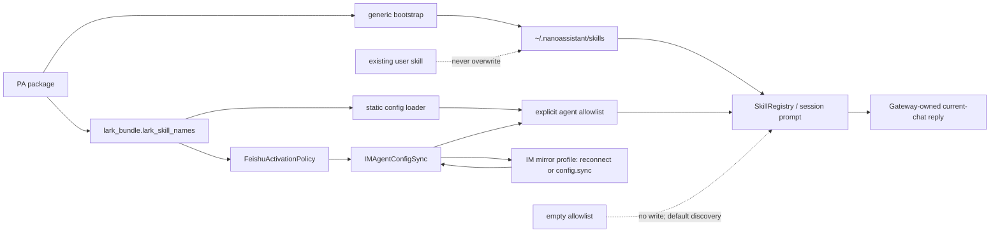

# bugfix-499: Lark skill bundle for Feishu agents — 技术方案

> 对齐: incident.md v1
>
> Unit branch: `unit/bugfix-499` (will be created by orchestrator)

## Changelog

## 现状分析

### 涉及范围

- `personal_assistant.builtin_skills.bootstrap` 已能将任意完整的包内
  `<skill>/` 目录复制至 `~/.nanoassistant/skills`，并在同名 `SKILL.md`
  已存在时保留用户版本；它不是本问题的瓶颈。
- PA 的全局 skill roots 已包含这个安装目标，因此一次成功的自举即可让
  `SkillRegistry` 发现 bundle。当前 product roots 不读取
  `~/.agents/skills`。
- `FeishuActivationPolicy`、`ManagedChannelControl` 与
  `IMAgentConfigSync.ensure_agent_skill_enabled()` 目前只围绕一个
  `feishu-doc` 字符串协作；显式非空 allowlist 会被补入该字符串，空
  allowlist 则保留“发现全部全局 skill”的语义。
- 静态 `config.channels` 的 Gateway 启动不经过上述托管 policy：
  `load_gateway_runtime_config()` 调用 `local_store` 的
  `provision_feishu_doc_skill_for_gateway()`，直接把 `feishu-doc` 写入
  静态 Feishu agent 的显式非空 allowlist。
- 现有 PA routing prompt 与 Gateway runtime delivery 已拥有当前会话的
  可见回复：飞书触发的输出由 Gateway 回写原 chat 并镜像内部 IM。
  `lark-im` 若直接向当前 chat 发消息，会越过这条已有链路。

### 既有约束

- 完整 Lark capability bundle 以当前全局 `lark-*` skills 为基线，不按
  产品偏好删减能力；默认身份沿用它们的 `--as user` 语义，
  `lark-vc-agent` 的 `--as bot` 例外不改。
- M1 的复制输入固定为当前已同步的 `lark-cli 1.0.82`：27 个 `lark-*` 目录、
  458 个文件。新版增加的是既有 skills 内的资源和通用能力；`lark-im` 的直接
  chat 操作与 `lark-event` 的独立 listener 语义不变，继续只叠加 D3 的 Gateway
  边界说明。
- 用户已明确不迁移或清理旧 `feishu-doc` 安装目录及旧 allowlist；本期只
  定义尚未上线的目标状态。
- PA 继续只经 `agent.sdk` 使用内核；本变更不引入 IM 对 agent 的依赖，
  也不新建 Gateway 托管的事件自动化系统。

### 可复用能力

- `install_builtin_skills()` 的目录级、非覆盖安装行为可原样复用，能保留
  Lark skills 之间的相对引用文件。
- `SkillRegistry` 已负责多 root 发现与先到 root 优先；无需另造 Lark
  专用加载器。
- `IMAgentConfigSync` 负责托管 channel 的显式 allowlist，`local_store`
  负责静态 config 的同类持久化；两条路径都应消费同一 bundle 集合，而不是
  各自维护 skill 名称。
- Gateway 已有外部回复与 IM shadow delivery，不复制出第二条 Feishu
  发送链路。

### 相关历史

- feat-447 建立了飞书 channel、外部回复目标和 IM shadow 会话的边界；本期
  只扩展 agent 可发现能力，不改变该回复所有权。
- `feishu-doc` 由 feat-447 随包安装时仍以 `feishu-cli` 为前提；当前全局
  Lark skills 已改为 `lark-cli` 多 skill 集合，造成能力与运行环境漂移。
## 架构总览

包内的 Lark skills 是一个完整、版本固定的资源 bundle；一个 PA 内部模块
作为它的唯一 **Module**，向 bootstrap、静态/托管 Feishu activation 与测试暴露
稳定的 `skill_names` **Interface**。调用方不读取 bundle 的目录布局、不重复维护
名称列表；bundle 的相对引用和具体文件分布留在该模块之后，形成足够深的封装。

```text
packaged lark-* directories
             │
             ▼
     lark_bundle.lark_skill_names()
        │                   │                    │
        ▼                   ▼                    ▼
bootstrap install   static config loader  FeishuActivationPolicy
        │                   │                    │
        ▼                   └───── explicit agent allowlist ─┘
~/.nanoassistant/skills               │
        │                              │
        └───── SkillRegistry / session prompt ─────┘
                         │
                         ▼
           Gateway-owned current-chat reply route
```

## 关键决策

### D1: 将 Lark skills 作为 PA 随包的版本快照

- **Context**: Gateway 需要在任意部署机器上稳定提供完整 Lark 能力；机器
  上是否恰好存在、以及何时更新 `~/.agents/skills` 不应改变产品行为。
- **Decision**: 把完整 `lark-*` skill 目录作为
  `personal_assistant.builtin_skills` package data 随 PA 发布；不在运行时把
  `~/.agents/skills` 加入 product roots。以一个内部 bundle module 公开确定的
  skill 名称集合。
- **Alternatives**: 运行时直接读取 `~/.agents/skills` 会使开发机省去复制，
  但部署、CI 与升级结果依赖操作者本机状态；在 bootstrap 和 channel policy
  各自维护名称列表则会重新制造浅层重复。
- **Consequences**: 发布物会增大，更新全局 Lark skills 需要显式升级 PA；
  换来可复现安装、可审计来源和稳定的测试输入。用户仍可通过既有全局 root
  的同名 skill 覆盖包内安装版本。

### D2: 仅为 Feishu 绑定补齐完整 bundle，保留空 allowlist 语义

- **Context**: 现有 policy 只为显式非空 allowlist 添加 `feishu-doc`；空
  allowlist 已表示发现所有全局 skills。用户要求 Feishu 绑定的 agent 默认
  获得完整 Lark 能力，但没有要求改变其他 agent 的能力选择。
- **Decision**: 静态 `local_store` provisioning 与托管
  `IMAgentConfigSync` 都从 bundle module 读取同一组 skill ids；
  `FeishuActivationPolicy` 只负责托管 lifecycle 的触发。两条 Feishu 入口均只
  把缺失项追加到显式非空 allowlist，空 allowlist 不写回，非 Feishu agent 不
  修改；也不移除用户已有的旧 `feishu-doc` 条目。带 IM 的静态 Gateway 在
  register/reconnect 或实时 `config.sync` 接受 mirror profile 前，由
  `IMAgentConfigSync` 依据本地静态 Feishu binding 把同一组缺项 PATCH 回该
  profile，再发布 runtime，避免旧显式 profile 覆盖启动时的 provisioning。
  在 reconnect 的逐 agent 对账中，这个 PATCH 失败沿用既有 liveness 契约：记录
  并跳过该 agent，不发布未补齐的 raw profile，继续其余 agent 与 post-register
  delivery；实时 `sync_agent()` 仍走其已有 retry / error 语义。
- **Alternatives**: 无条件把 bundle 写入所有 agent 会扩大未绑定 agent 的
  权限面；把空 allowlist 物化为完整列表会破坏其随全局 skill 发现变化的既有
  语义；迁移删除旧条目超出本期范围。
- **Consequences**: 显式列表的 Feishu agent 得到稳定、可审计的 Lark 能力；
  用户明确保留的其他 skills 与顺序不变，重复 reconcile 不产生额外写入。

### D3: 把渠道边界写进两个冲突 skill，而不新建传输机制

- **Context**: `lark-im` 能直接向任意 Lark chat 发送或操作消息，
  `lark-event` 能建立独立事件消费；它们与 Gateway 现有的当前 Feishu chat
  回复所有权相交，但都仍是用户需要的独立能力。
- **Decision**: 随包 snapshot 保留全部全局 skill 内容，并在 `lark-im` 与
  `lark-event` 的触发说明附近各加入一个简短 Gateway 边界段：当前 Feishu
  chat 的普通回复直接输出、由 Gateway 投递；`lark-im` 只在用户明确指定另
  一个 chat 时直接操作；`lark-event` 只为用户明确请求的独立监听/自动化而
  启动，不能承接普通 Feishu 入站或回复。
- **Alternatives**: 新建 Gateway 发送 adapter、常驻事件服务或一个覆盖全局
  行为的 overlay skill，都会复制已有路由并扩大本期职责；不写边界则让模型
  在已知冲突处有机会绕开 IM shadow 与去重链路。
- **Consequences**: 两份随包 skill 相对全局版本存在有意、可审查的小差异；
  更新 snapshot 时必须保留并复核这两个边界段。`lark-vc-agent` 不改。

## 接口与数据流

### 资源与内部接口

| 位置 | 责任 | 对外形状 / 不变量 |
|---|---|---|
| `personal_assistant.builtin_skills.lark_bundle`（新增） | 产品随包 Lark snapshot 的唯一清单 | `LARK_SKILL_NAMES: tuple[str, ...]` 与返回其不可变副本的 `lark_skill_names()`；名称按稳定顺序、无重复，且每项都对应一个包内 `lark-*/SKILL.md` |
| `personal_assistant.builtin_skills/lark-*/`（新增资源） | 27 个完整全局 Lark skill 目录与 references | 保留目录、相对链接和各 skill 既有 CLI/身份/权限语义；仅 `lark-im`、`lark-event` 含 D3 边界段 |
| `local_store`（扩展） | 静态 `config.channels` 启动时，为 Feishu agent 补齐 bundle | `ensure_lark_skill_bundle_for_feishu_agents(config)` 与 provisioning wrapper 都从 `lark_skill_names()` 取值；仅写显式非空 allowlist，单次持久化，并复用“启用的静态 Feishu binding agent ids”判定 |
| `IMAgentConfigSync`（扩展） | 将一组必要 skill 原子并入托管 agent、以及 IM-enabled 静态 agent 的 mirror profile | `ensure_agent_skills_enabled(agent_id, skill_ids) -> bool` 处理托管 activation；共享的 profile-ingress helper 由 `reconcile_all_agents()` 和 `sync_agent()` 在各自既有版本拒绝检查后、decode/publish 前调用。它仅为静态 Feishu agent 的显式 mirror list 合并同一组 names、一次 PATCH 后发布；空 allowlist 不物化。reconcile 中 PATCH 失败只跳过当前 agent，不发布 raw profile，也不阻断其余对账/出站恢复；实时 sync 复用已有 retry/error 行为 |
| `FeishuActivationPolicy`（扩展） | 在托管 channel reconcile 时声明 Feishu agent 必须具备的 bundle | 持有 bundle names，幂等地把整组交给 config sync；测试用的 `load_skills/save_skills` 路径也一次追加整组 |

`lark_bundle` 是本期的 deep **Module**：目录清单、资源布局与调用方隔离在
一个 **Interface** 之后。bootstrap 继续只做通用复制，channel manager 继续只
负责 channel lifecycle；两者都不需要了解 27 个名字或 skill 内部引用，从而把
将来更新 snapshot 的局部性留在 bundle module 与资源目录中。

### 主流程



这条流程回答两个容易混淆的边界：bundle 安装与 agent allowlist 是不同步骤；
获得 `lark-im` 不会改变当前飞书会话的回复出口。

### 实现顺序与测试 seam

1. 从已同步到 `lark-cli 1.0.82` 的 `/Users/czj/.agents/skills/lark-*` 复制 27 个
   完整目录（当前 458 个文件）到 `src/personal_assistant/builtin_skills/`，删除随包的旧
   `feishu-doc`。不删除用户 runtime 中的旧目录，也不修改旧配置。
2. 新增 `lark_bundle.py` 静态清单；让 bundle 名称成为唯一的实现常量。测试
   必须反向比较清单与包内目录，防止将来复制资源时漏项或多项。
3. 将 `local_store` 的 `provision_feishu_doc_skill_for_gateway()` 与
   `ensure_feishu_doc_skill_for_feishu_agents()` 替换为 bundle 版本；静态
   `config.channels` 从 `lark_skill_names()` 取整组并只做一次配置持久化。保留
   空 allowlist 不物化、停用 channel 不移除用户 skills 的现有语义。提取静态
   启用 Feishu binding 的 agent-id 判定，供 startup provisioning 与后续 profile
   reconcile 复用。
4. 将 `IMAgentConfigSync` 的单个 enable 路径收敛为集合操作；已有
   `skill_created` 单 skill 调用复用该内部集合实现，避免行为分叉。显式列表只
   获取一次 IM profile、一次 PATCH、一次本地 sync；空列表只 republish。
   新增私有的 profile-ingress helper，供 `reconcile_all_agents()` 与实时
   `sync_agent()` 在各自既有 stale-version 拒绝后、decode/publish 前共同使用。
   它检查本地静态 Feishu binding；若刚获取 profile 的 skills 显式非空但缺项，
   基于该 profile 一次 PATCH，随后只发布 PATCH 后的 profile；空 skills 则不
   PATCH，保持默认 discovery。这样 IM 仍是完整 profile 的权威来源，Gateway
   只持久化由本地 static binding 强制要求的缺失 capability，且任何 profile
   ingress 都不能撤销它。在 `reconcile_all_agents()` 中把该 helper（包括 PATCH）
   纳入现有 per-agent HTTP/ValueError 容错范围：失败只记录并跳过该 agent，绝不
   发布未合并的 raw profile，随后继续其他 agent，保证 post-register outbox 仍会
   调度；`sync_agent()` 保持现有 retry/exhaustion error 行为。
5. `FeishuActivationPolicy` 接收所需名称集合，并在其 test seam 与生产
   callback 中同样按整组、幂等地处理。`ManagedChannelControl` 不再硬编码
   `feishu-doc`。
6. 在复制版 `lark-im`、`lark-event` 的 front matter 后、正文主说明之前写入
   D3 的渠道边界。现有 PA routing prompt 与 runtime delivery 保持不改，作为
   真正的投递 owner。

永久回归保护放在现有最低层测试文件，而不是新建 milestone 编号测试：

| 风险 | 归属测试与验证 |
|---|---|
| 资源漏打包、相对引用或 Gateway boundary 丢失 | 扩展 `tests/unit/personal_assistant/test_builtin_skill_bootstrap.py`：断言 manifest 与资源目录一致、完整 bundle 被安装、`lark-doc`/`lark-shared` 可共同发现、`lark-im` 和 `lark-event` 的边界段存在 |
| 静态 Feishu config 少项或空列表被物化 | 扩展 `tests/unit/personal_assistant/test_gateway_launch.py`：从 `load_gateway_runtime_config()` 验证静态显式列表一次持久化完整 bundle、空列表不写回 |
| 静态 agent 的旧 IM mirror 覆盖启动结果 | 扩展 `tests/unit/personal_assistant/test_gateway_reconcile_on_connect.py`：给静态 `config.channels` + `im_service` 的 agent 返回预存显式旧 profile，断言 connection/reconnect 后远端、local config 与后续 session projection 都保留 bundle，首次仅 PATCH 一次 |
| 在线 `config.sync` 覆盖静态 agent 的 bundle | 扩展 `tests/unit/personal_assistant/test_gateway_im_config_sync.py`：对同一静态 agent 的显式旧 mirror 触发 `sync_agent()`，断言 shared ingress 一次 PATCH 后才 publish，重复同步零 PATCH，远端/local/catalog 的 allowlist 一致 |
| bundle PATCH 短暂失败中断 reconnect 收敛 | 扩展 `tests/unit/personal_assistant/test_gateway_reconcile_callback.py`：GET 成功但该 agent PATCH 失败时，断言 raw profile 未发布、其余 agent 仍完成对账且 post-register callback 可继续；不把此 failure 当作 startup 崩溃 |
| 托管 allowlist 少项、重复 PATCH 或空列表被物化 | 扩展 `tests/unit/personal_assistant/test_channel_manager.py` 与 `test_gateway_im_config_sync.py`：断言一次追加全组、重复 reconcile 不写、空列表不写、生产同步只 PATCH 一次 |
| 新 bundle 与现有 capability/prompt discovery 断开 | 将现有 `feishu-doc` preview 测试替换为 `lark-doc`（并保留跨 skill 的 `lark-shared` 前提），验证 capabilities、discovery 与 prompt 都可见 |

不添加 Gateway `lark-cli` 启动预检、代理配置或新的认证流程。每个 skill 已声明
`lark-cli` 前提，`lark-shared` 已拥有 user/bot identity、登录和授权失败指引；
新增预检既不能替用户完成授权，也会把可选 Lark 能力错误地变成 Gateway 启动条件。

## 契约层增量 (delta-spec)

本期有用户可观察的 Gateway 能力变化，创建两个 delta target：

| Delta target | 变更 |
|---|---|
| `specs/gateway/agent-capabilities.md` | 移除与通用 PA builtin bootstrap 重复、且只描述旧 `feishu-doc` 的 Requirement；新增“飞书绑定 agent 获得完整 Lark skill bundle”，覆盖新安装/显式 allowlist、空列表与独立监听的可观察结果 |
| `specs/gateway/external-channels.md` | 修改“外部 channel 触发源决定回复去向”，明确拥有 Lark IM 操作能力不改变当前 Feishu chat 的 Gateway 回复所有权，另 chat 操作仍可用 |

这避免把模块名、目录清单或 `lark-cli` 的内部命令细节写入长青 spec；它们属于
实现和随包 skill 本身。`agent-capabilities.md` 当前有两条同义的内置 skill
自举 Requirement；这是本 unit 触及区域已发现的契约层重复，delta 会保留通用的
“PA 内置 skill 启动自举”，删除旧的 Feishu 专用重复条目，而代码的通用 bootstrap
行为与前者一致，未发现行为 drift。

## 风险与回退

| 风险 | 缓解 / 回退 |
|---|---|
| snapshot 日后落后于全局 Lark skills | bundle 是刻意版本化的发布输入；后续升级以新 unit 比较完整目录，并复核 D3 两处有意差异，不在运行时悄然漂移 |
| 用户本地已有同名目录而没有新内容 | 沿用不覆盖承诺；本期不迁移。需要更新时由用户显式管理目录或另立迁移 change |
| bundle 中高风险 Lark 操作被误当作 Gateway 功能 | 保留各 skill 的权限、确认和身份规则；PA 不增加绕过授权的 native tool 或代理凭据 |
| `lark-event` 长驻消费与普通回复混淆 | D3 明确隔离；不注册 Gateway consumer，不接入 channel manager。用户请求监听仍遵循 skill 的 timeout/stop 约束 |
| reconnect 时补齐 mirror profile 的 PATCH 短暂失败 | 记录并跳过该 agent，绝不发布未合并的 raw profile；继续其余 agent 与 post-register delivery。后续 reconnect 可再次收敛，实时 sync 走已有 retry/error 语义 |
| 回退发布物后用户目录残留 snapshot | 这是非覆盖安装的既有行为；回退只撤销新发布和自动启用，绝不自动删除用户目录或 agent 配置 |

## Runbook for Reviewer

### 驱动方式与栈生命周期

本 unit 不改 Web/IM 客户端面；产品 reviewer 用隔离真栈中的测试 Feishu chat 驱动
Gateway，而不是 mock channel 或直接调用内部函数。Gateway 与 IM 的既有生命周期不
因本变更新增服务，按 worktree runtime 的成对脚本执行：

```bash
REPO_ROOT="$(git rev-parse --show-toplevel)"
WT_ROOT="$REPO_ROOT"
NANO_MAIN_ROOT="/absolute/path/to/main-checkout"
FEISHU_E2E_MAIN_CONFIG="/absolute/local/0600-feishu-e2e-config.yaml"
IM_FRONTEND_DIST_DIR="$NANO_MAIN_ROOT/src/IM/frontend/dist"
test -f "$IM_FRONTEND_DIST_DIR/index.html" || {
  (cd "$NANO_MAIN_ROOT/src/IM/frontend" && npm run build)
}
test -f "$IM_FRONTEND_DIST_DIR/index.html"
IM_FRONTEND_DIST_DIR="$IM_FRONTEND_DIST_DIR" PATH="$NANO_MAIN_ROOT/.venv/bin:$PATH" \
  "$REPO_ROOT/scripts/e2e-up.sh" \
  --wt "$WT_ROOT" --main-config "$FEISHU_E2E_MAIN_CONFIG"
source "$WT_ROOT/.e2e-ports.env"
curl -fsS "$IM_URL/openapi.json" >/dev/null
kill -0 "$(cat "$WT_ROOT/.gateway.pid")"
tail -n 50 "$WT_ROOT/.gateway.log"
# e2e-up does not start Vite. The existing IM app must serve this checked dist.
curl -fsS "$IM_URL/settings/agents/<managed-test-agent-id>" | \
  grep -q '<!doctype html>'
# 验证结束（包括失败）后：
"$REPO_ROOT/scripts/e2e-down.sh" --wt "$WT_ROOT"
```

启动前确认 `WT_ROOT` 是实施 unit 的隔离 worktree，`NANO_MAIN_ROOT` 指向含完整
`.venv` 的主 checkout；不得在本仓主工作区运行上述清理。`e2e-up.sh` 每次都会
清除 worktree 内的 IM DB、channel key 与 manifest，因而 `FEISHU_E2E_MAIN_CONFIG`
是专门为本次验收准备、仓外保存且权限为 `0600` 的测试配置，不能是日常或生产
config。`IM_FRONTEND_DIST_DIR` 必须指向 `NANO_MAIN_ROOT` 的已构建、未修改的当前
Web IM；该目录是本机 build artifact，不提交也不复制进 milestone worktree。该环境变量
由 `e2e-up.sh` 继承给 IM，使受控的 `/settings/agents/...` 页面随临时 IM 一同服务；上面
shell 检查失败时先 build，仍不可用则是产品门禁 blocker。脚本只验证 IM/Gateway 启动，
Lark/Feishu 真实旅程仍以以下前置为准。

### 静态与单元验证

1. 复核资源清单与 `src/personal_assistant/builtin_skills/lark-*/` 目录一一对应，
   引用到 `../lark-*/` 的相对文件均在同一 bundle 内；只允许 `lark-im`、
   `lark-event` 相对源 snapshot 有 D3 边界差异。
2. 运行
   `./.venv/bin/python -m pytest tests/unit/personal_assistant/test_builtin_skill_bootstrap.py tests/unit/personal_assistant/test_gateway_launch.py tests/unit/personal_assistant/test_gateway_reconcile_on_connect.py tests/unit/personal_assistant/test_channel_manager.py tests/unit/personal_assistant/test_gateway_im_config_sync.py`，
   并确认静态启动、静态连接 IM 后、在线 `config.sync`、托管的显式与空
   allowlist、一次 PATCH 与 `lark-doc` discovery 的行为均有保护。
3. 运行 `PYTHON="$PWD/.venv/bin/python" ./scripts/docs-check`，确认 delta 的路径、
   Requirement 标题和 canonical area 索引可归并。
4. 对静态 agent 的 bundle PATCH 注入一次 HTTP 失败，确认该 agent 不发布旧显式
   profile，但 Gateway 仍继续其余 profile 对账和 post-register delivery。

### 真实 Feishu fixture 与建通道（实现后，由 verifier / 产品 reviewer 执行）

真实旅程需要一个专用测试 tenant、测试用户、两个隔离 chat（当前 chat 与另一
目标 chat）、最小权限的 `lark-cli` user identity，以及可收消息的测试 Feishu
application Bot；不得在生产 chat 或生产资源上验证写操作。凭据只保存在
`FEISHU_E2E_MAIN_CONFIG` 或 IM 的密文 channel store，绝不写入 unit、命令历史或
截图。

该仓外 source config 至少有一个静态验证 agent 的**显式非空** `skills`，以及一条
可实际启动的静态 channel；字段形状是：

```yaml
channels:
  - name: feishu:<static-test-agent-id>
    enabled: true
    settings:
      appId: <isolated-test-app-id>
      appSecret: <isolated-test-app-secret>
```

`appSecret` 是静态 adapter 的实际启动前提；`credentialRef` 且没有 `appSecret`
只适用于 IM 托管回放，不能用作这条静态验收 channel。可选的 `botOpenId` 由既有
identity probe 填充。用另一没有上述 `config.channels` binding 的、显式非空 skills
测试 agent 做托管路径；可使用第二个测试 Bot，或在独立的第二次 run 中移除静态
channel 后复用同一个 Bot，不能让两个 adapter 争用同一条 live connection。

新鲜 IM 不带 manifest，所以在上述脚本启动、自动绑定完成后，登录这次临时 IM 的
`nano` 测试账号，在 Web IM 打开
`/settings/agents/<managed-test-agent-id>` → **通道** → **添加通道** → **Feishu**，
填写隔离测试 App ID 与 App Secret 并保存。这是现有的受控入口：`POST
/im/v1/agents/{agent_id}/channels` 将 secret 封装后向已连接 node 下发 reconcile，
不把 secret 写入 `config.yaml`。等待页面的 desired state 变为已应用、runtime
`connection_state` 显示 `connected`（失败时按诊断修正 app、Bot、长连接或权限，
不要把空 manifest 当成通过）。

### 后续真实旅程门槛（实现后，由 verifier / 产品 reviewer 执行）

1. 先对静态和托管测试 Bot 各从测试用户发送一条 `fixture ping`，收到 Gateway
   回复后才进入下列 Scenario。检查当前 chat 对应的 IM shadow conversation 同时
   出现；它带 `external_source=feishu` 与当前 `external_chat_id`，可在同一临时 IM
   的会话页核对，或通过既有认证 `GET /im/v1/conversations` / `GET
   /im/v1/conversations/{id}/messages` 核对。未能收发的 fixture 是产品门禁 blocker。
2. 分别以静态 `config.channels` 与刚建立的 IM 托管 manifest 的显式非空 skills
   allowlist agent 绑定 Feishu，确认各自一次性获得完整 Lark bundle；静态场景在 IM
   返回预存旧 profile 后、以及随后一次 `config.sync` profile 更新后都重新确认
   bundle 未丢失。以空 allowlist 的 agent 重复验证不写入列表而仍可发现 bundle。
3. 从当前测试 Feishu chat 请求一个只读 Lark 操作，确认 agent 遵循 `lark-shared`
   的当前用户身份/授权提示；若 CLI 或授权缺失，必须报告前提而非伪称成功。
4. 从当前 chat 请求普通回答（例如只回复 `gateway-normal-ok`）。该文本必须回到
   该当前 Feishu chat，且同一轮新增到上一步识别出的 IM shadow；不得出现针对该
   当前 chat 的 `lark-im` direct operation。随后在**当前 chat** 明确指定另一条
   隔离测试 chat，并请求向其发送唯一 marker（例如 `cross-chat-<run-id>`）：目标
   chat 必须收到 marker，原当前 chat 必须经 Gateway 收到该操作的结果说明，并在
   对应 IM shadow 中可见。两步共同验收“普通回复仍归 Gateway、显式另一 chat 的
   Lark IM 操作仍可用”。

测试身份、`lark-cli` 授权、测试 Bot/channel、两条 chat 或网络任一不可用时，真实
旅程不得用 mock、空栈 health 或主环境状态冒充通过；记录为 M1 产品门禁的环境
blocker。

## Milestones

| ID | 标题 | 依赖 | 并行组 | 范围 | 退出标准 |
|---|---|---|---|---|---|
| `bugfix-499-M1` | `lark-skill-bundle` | — | A | `src/personal_assistant/builtin_skills/lark_bundle.py`、`builtin_skills/lark-*/`、移除 `builtin_skills/feishu-doc/`；`config/local_store.py`、`gateway/{agent_config_sync,channel_manager,managed_channel_control}.py`；`tests/unit/personal_assistant/{test_builtin_skill_bootstrap,test_gateway_launch,test_gateway_reconcile_on_connect,test_gateway_reconcile_callback,test_gateway_im_config_sync,test_channel_manager}.py`；两个 `specs/gateway` delta | **[worker]** 新安装与用户覆盖不变量成立；静态启动、静态 IM mirror 的 reconnect / `config.sync` 对账与托管的显式/空 allowlist 行为、一次 PATCH、PATCH 失败不阻断 post-register 收敛，以及聚焦 tests/docs-check 通过。 **[reviewer]** 使用 Runbook 的仓外 isolated fixture，先让静态和 fresh-IM 托管 Bot 各通过真实 `fixture ping`，再真实执行 `external-channels` delta 的“当前飞书 chat 不走 Lark IM 直发”与“另一段 Lark chat”两个 Scenario，确认 Gateway reply/IM shadow 所有权保持不变；fixture 缺失明确为产品门禁 blocker。 |

虽然 snapshot 约含 458 个资源文件，M1 仍是默认的单 milestone：资源目录、名称
清单与 activation 缺任何一项都不能形成可用能力，拆成“复制资源”与“接线”会是
没有独立用户价值的水平切分。worker 在 M1 中只创建自己的 `tasks.md` 与
`progress.md`，本设计阶段仅保留目录骨架。
