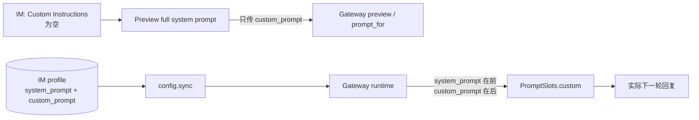
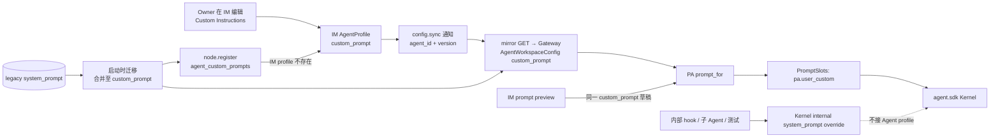

# bugfix-507: 收敛 Agent 的公开提示词配置 — 技术方案

> 对齐: incident.md
> Unit branch: `unit/bugfix-507`（由 orchestrator 创建）

## Changelog

- 2026-08-06 (设计修订): Gate 2 R1 补齐 Gateway-first 空 IM 的 canonical seed 所有权，并将公开 contract cutover 收敛为一个原子 milestone；详见 `design-review.md` Round 1 Author Resolutions。
- 2026-08-06 (设计初稿): 收敛 IM/PA 公开 Agent 人设到 `custom_prompt`，把已生效的 legacy 值可见迁移，并保留 Kernel 内部 override。

## 现状分析

### 涉及范围

| 路径 | 当前职责 | 本 unit 的变化 |
|---|---|---|
| `src/IM/domain/models.py`、`application/config_service.py`、`infra/repositories/agents.py` | IM 的 `AgentProfile` 和其 SQLite 映射同时持有 `system_prompt`、`custom_prompt` | 公开 profile 只保留 `custom_prompt`；启动 migration 把 legacy 内容合并进它后删除列 |
| `src/IM/api/routes/agents.py`、`nodes.py` | Agent 创建、读取、更新与 live merge 的 HTTP 形状 | 去掉 profile 的 `system_prompt` 请求/响应/同步形状；能力返回的 `default_system_prompt` 不变，它是只读产品默认值 |
| `src/personal_assistant/config/local_store.py`、`gateway/agent_config_sync.py`、`reporter/upstream_reporter.py` | Gateway 本地 Agent 配置、IM 的通知式 config.sync 和首次 `node.register` 种子 | 只存、收、发公开 `custom_prompt`；旧 YAML 在载入时规范化，首次注册把它作为明确 seed 交给空 IM profile |
| `src/personal_assistant/product.py`、`gateway/session_binder.py` | Agent 配置投影为 `PromptSlots` 与 Kernel session metadata | `pa.user_custom` 成为唯一 profile 供给的专属段；不再把 profile 值接到内核 `system_prompt` override metadata |
| `src/personal_assistant/gateway/composition.py`、`ws/im_connection.py` | IM 的 prompt preview RPC 与运行时同源 prompt 组装 | 继续经同一 `prompt_for`；只接受与运行时相同的 `custom_prompt` 配置，并修正 UI 名称以说明 runtime exclusion |
| `src/IM/infra/repositories/conversations.py`、`application/relay_service.py` | 对话配置 provenance 与中继选 Agent | 不再记录/传递公开 legacy prompt 字段；配置版本仍保留，Agent 选择语义不变 |
| `src/agent/core/agent/runtime.py` | Kernel 的内部完整 system-prompt override | 不改。该入口继续服务内部 hook、子 Agent 和测试，绝不由 IM/PA profile 调用 |

### 当前失败路径



实际路径由 `product.prompt_for()` 读取 `agent.system_prompt` 并写入 `pa.system_prompt_override`，再追加 `pa.user_custom`；预览临时 Agent 只有 `custom_prompt`。所以 UI 的空输入与实际行为可以不同。

### 既有约束与可复用能力

- `feat-379` 的决策 5 已确定：用户面不再提供整串 `system_prompt`；per-agent 人设走 `pa.user_custom`。本修复恢复这一边界，而不是重新选择产品策略。
- Kernel 的 generic `system_prompt` override 是内部控制面，不是 IM/PA profile 的存储模型；`personal_assistant` 仍只 import `agent.sdk`，IM 与 PA 不互相 import。
- `prompt_for()` 已是 preview 和运行时共同的 PA `PromptSlots` factory；应收敛它的输入，而非新建第二套 preview assembler。
- IM SQLite migration 与 Gateway YAML load/save 都是现有 canonicalization 点；首次 `node.register` 已有 workspace/skills/tools 的 seed 协议，扩展同一协议承载 canonical custom 文本。迁移不放在 HTTP handler 或 UI 中做一次性补丁。

## 架构总览

**核心决定：IM/PA 的 Agent profile 只有一个公开人设字段 `custom_prompt`。** 它从 IM 存储、config sync、Gateway 本地配置到 `pa.user_custom` 是一条直线。Kernel 的内部完整 override 留在另一条不与 profile 相连的控制线。



这不是把“完整提示词覆盖”换一个字段名：公开输入始终是公共 PA 规则后的命名追加段，用户不能改写公共规则。内核 override 的所有权仍在内部调用方，避免为了修 UI 配置而削弱子 Agent / test harness 能力。

## 关键决策

### 决策 1：`custom_prompt` 是 IM/PA profile 唯一公开的人设接口

**选择：** 从 `AgentProfile`、创建/更新 API、Gateway config.sync、`AgentWorkspaceConfig` 和运行时 projection 删除 profile `system_prompt`；`prompt_for()` 只将非空 `custom_prompt` 组装为 `pa.user_custom`。

- **理由：** Agent owner 只需检查一处可编辑输入即可理解下一轮专属人设；预览和运行时可由同一值、同一 factory 保证一致。
- **拒绝：** 保留 API/存储里的 deprecated 字段但忽略它。它会形成可被旧同步帧重新写入的“幽灵配置”，也让维护者继续误把它当可用入口。
- **边界：** `default_system_prompt` capability 仍表示只读的产品默认提示词，不能与 profile `system_prompt` 混淆；前端文案要表达这个差异。

### 决策 2：在每个持久化边界迁移 legacy 文本，按旧运行顺序合并且只注入一次

**选择：** IM SQLite 初始化和 Gateway YAML load 各自识别旧字段，计算 canonical `custom_prompt` 后删除 legacy 值。合并规则固定如下：

| 旧 `system_prompt` | 现有 `custom_prompt` | 迁移后的 `custom_prompt` |
|---|---|---|
| 空/空白 | 任意 | 保留现有值 |
| 非空 | 空/空白 | legacy 文本 |
| 非空 | 去除首尾空白后相同 | 只保留一份文本 |
| 非空 | 不同 | `legacy + "\n\n" + custom` |

迁移保留过去实际运行的“legacy 在前、custom 在后”语义。存储规范化后，后续启动和 config.sync 均不再产生 legacy 字段；迁移要幂等，不能第二次加同一段。

**归属与顺序：**

1. 已存在的 IM profile 是持续编辑后的权威值。IM 启动时先把其 legacy 列迁入 `custom_prompt`；之后 Gateway 的 ordinary `config.sync` 仍只是 `{agent_id, profile_version}` 通知，Gateway 通过既有 mirror GET 拉取权威 profile，不能把本地旧值反写覆盖用户选择。
2. Gateway 载入旧 YAML 时立即在内存中得到同一 canonical `custom_prompt`，因此即使尚未连接 IM，下一轮运行也不再执行 legacy 字段。`save_local_config()` 永不写 legacy key；成功经过 mirror reconcile 或任何正常 config persistence 后，已规范化 Agent 被写回 YAML。单纯 load 不承诺写盘，避免在 IM 连接/认证失败时把唯一可恢复副本提前覆盖。
3. **空 IM 的首次注册例外：** Gateway 在 `node.register` 的现有每-Agent seed 中新增 `agent_custom_prompts`，只发送 canonical 非空文本；IM 仅在创建此前不存在的 profile 时采用该 seed，与 workspace/skills/tools 一样“first seen wins”。注册创建后，随后 mirror GET 把同一 canonical 值持久回 Gateway YAML。旧 Gateway 不认识该可选 seed；新 IM 对省略 seed 仍创建无专属说明的 profile，保持协议兼容。

这给出唯一终态：一旦 profile 已存在，IM profile 为权威；只有“尚未存在 profile”的首次注册由 Gateway 规范化后的本地值创建它。不存在“先空镜像覆盖 YAML、再猜测是否反写”的分支。

- **理由：** 用户既有行为不会静默丢失，升级后又立即在可见输入中可审阅、可清空。
- **拒绝：** UI 首次打开时临时显示 legacy 值，或保留两字段并在运行时兼容。前者不能覆盖 API/离线 Gateway，后者继续留下双真源。
- **风险：** 发布顺序必须让 Gateway 首次注册时携带 canonical seed，或先迁移已有 IM 数据库；旧 Gateway 对新 IM 的首次注册不会凭空提供其本机遗留文本。新 Gateway 读取旧 IM mirror 时仍按合并表 canonicalize，直到 IM 也升级完成。

### 决策 3：预览是“稳定提示词预览”，不是声称包含运行时上下文的完整提示词

**选择：** preview RPC 继续直接以当前草稿或已保存的 `custom_prompt`、features、tools、skills 调 `prompt_for()` 和 SDK preview；设置页的展示标题改为“Preview stable system prompt / 预览稳定系统提示词”（按现有 i18n 约定落文案），保留明确的群聊、记忆等运行时段排除说明。

- **理由：** 稳定用户配置和实际下一轮的共同部分可被可靠检查；群成员、记忆等本来在会话开始才知道，不能假装可预览。
- **拒绝：** 为了让标题“full”成立而模拟群成员、记忆或实际会话数据。那会制造另一份不真实的上下文，超出事故范围。
- **不变量：** 除明确标注的 runtime-only 段外，保存的 Agent profile 对下一轮生效的稳定文本必须与 preview 相同。

### 决策 4：对话 provenance 不再保存 prompt 正文，版本保留为实际采用的边界线索

**选择：** 移除 `conversations.config_system_prompt` 及 `_ConversationConfigSnapshot.system_prompt` / `_RelayAgentSnapshot.system_prompt`；对话继续保存 `config_agent_id`、`config_profile_version`，中继仍按 Agent id 和 profile version 路由。

- **理由：** 这些内部 snapshot 不参与 payload prompt 组装，却让已经退休的公开字段继续存在。版本足以表达“某一代配置”的 provenance，避免在 conversation 表复刻敏感 prompt 正文。
- **拒绝：** 改名为 `config_custom_prompt` 并继续在 conversation 表保存正文。它不能改善运行一致性，只增加敏感文本副本和迁移负担。

### 决策 5：以一个原子 milestone 完成公开 contract cutover

**选择：** profile/API、SQLite/YAML migration、first-register seed、Gateway projection、preview、conversation provenance 与前端文案放在同一 M1。worker 可以在 milestone 内拆 roadpoint，但不能把“已不可见”与“已不执行/不能复活”拆成两个可发布阶段。

- **理由：** 用户验收的“Custom Instructions 是唯一入口”只有在所有 public/runtime ingress 同时关闭时才成立；conversation 正文清理也是同一次 schema cutover 的一部分。
- **拒绝：** 先交 UI/runtime、后交 storage retirement 的两阶段做法。中间态仍可能被 live snapshot、sync 或对话快照复活 hidden prompt，既非独立用户价值也让 worker 范围重叠。
- **规模处理：** 这是超过十个文件的原子风险，不是两个可并行的垂直体验。由一个 worker 在 `tasks.md` 中分 3–7 个 roadpoint；测试、迁移和真实入口验证在一个 integration branch 上闭环。

## 接口与数据流

### 公开 profile / sync contract

`AgentConfigResponse`、`UpdateAgentConfigRequest`、`CreateNodeAgentRequest`、Gateway live snapshot 使用同一套公开字段：`custom_prompt: str | null`；不再携带 profile `system_prompt`。`config.sync` 保持既有 notification-only 形状 `{agent_id, profile_version}`，由 Gateway mirror GET 取得这一 profile。空/空白 `custom_prompt` 表示没有 Agent 专属说明。

Gateway 读取旧的本地 YAML 或旧 IM mirror response 时，在应用前调用同一个局部 canonicalization helper；该 helper 输出 `custom_prompt`，不把 legacy 值写入 `session_binder` metadata。Gateway `node.register` 将 canonical 的非空文本作为 `agent_custom_prompts[agent_id]` seed；IM SQLite migration 在 repository 开放前把表内数据规范化，再由普通 repository 映射读写，并只在 first-seen profile 接受该 seed。

### 保存、预览和下一轮采用

```mermaid
sequenceDiagram
  participant O as Owner
  participant IM as IM API / SQLite
  participant G as Gateway config sync
  participant P as PA prompt_for
  participant K as Kernel

  O->>IM: 保存 Custom Instructions
  IM->>IM: 仅持久 custom_prompt, profile_version + 1
  IM->>G: config.sync(agent_id, profile_version)
  G->>IM: mirror GET 当前 profile
  G->>G: 持久 canonical local config
  O->>IM: 预览当前草稿
  IM->>G: preview(custom_prompt, features, tools, skills)
  G->>P: 同一 prompt_for 输入
  P-->>O: 稳定提示词预览
  O->>G: 下一条消息
  G->>P: 当前 AgentWorkspaceConfig
  P->>K: PromptSlots(pa.user_custom)
  K-->>O: 新回复; 原聊天历史继续
```

该时序不承诺 preview 包含 group/memory/runtime 片段；这些仍是 Kernel/场景输入，不属于公开 profile。

## Runbook for Reviewer

本 unit 的产品验收只使用隔离 IM + Gateway + Vite 栈，绝不接触主实例的 `8011` / `5173` 或其配置。验收者在 `unit/bugfix-507` worktree 的根目录执行；主 checkout 仅提供已安装的 Python 环境。

```bash
REPO_ROOT="$(git rev-parse --show-toplevel)"
MAIN_ROOT="/Users/czj/Repos/nano-multiagent"

# 先关掉本 worktree 可能遗留的栈；不会碰主实例。
"$REPO_ROOT/scripts/e2e-down.sh" --wt "$REPO_ROOT"

PATH="$MAIN_ROOT/.venv/bin:$PATH" \
  "$REPO_ROOT/scripts/e2e-up.sh" --wt "$REPO_ROOT"
source "$REPO_ROOT/.e2e-ports.env"
curl -fsS "$IM_URL/openapi.json" >/dev/null

# 前端由验收者在独立终端启动，并选取空闲端口；其 PID 必须在结束时停止。
VITE_PORT="$("$REPO_ROOT/scripts/free-ports.sh" 1)"
cd "$REPO_ROOT/src/IM/frontend"
VITE_IM_PROXY_TARGET="$IM_URL" \
  npm run dev -- --host 127.0.0.1 --port "$VITE_PORT" --strictPort
```

在浏览器中登录隔离 IM、打开 `Agents → e2e → Config`，验证保存 Custom Instructions、展开“Preview stable system prompt”，并确认 runtime exclusion 文案。验收结束后停止 Vite，再执行 `"$REPO_ROOT/scripts/e2e-down.sh" --wt "$REPO_ROOT"`；参见 `docs/development/worktree-runtime.md` 的端口、进程和清理检查。

## 数据迁移、兼容与回退

- **IM SQLite：** 在 `_migrate_agent_profile_tables` 中先确保 `custom_prompt` 列存在，逐行按决策 2 规范化，再删除 `system_prompt`。同一初始化中删除 conversations 的 `config_system_prompt`；迁移事务内完成，失败则整个 schema migration 失败而不半迁移。
- **Gateway YAML：** `load_local_config` 接受旧 `system_prompt` 仅用于迁移，解析结果立即只保留 canonical `custom_prompt`；`save_local_config` 永不写 legacy key。成功 mirror reconcile 或后续正常 persistence 才写回 YAML，保证 IM 不可达时旧文件仍可重试迁移。新的 `AgentWorkspaceConfig` 类型不公开该字段。
- **空 IM 首次注册：** `node.register.agent_custom_prompts` 是可选的 canonical seed，IM 只在 profile 不存在时采用，随后 mirror GET 收敛两端。这是旧 YAML 有内容、IM 尚无 profile 时唯一允许 Gateway 提供初值的时点；已有 IM profile（包括用户明确清空）永远不被 seed 覆盖。
- **交错升级：** 新 IM / 新 Gateway 均不执行 legacy 字段；新 Gateway 读取旧 IM mirror 时先按合并表规范化。生产部署先升级 Gateway 或先升级并迁移已有 IM，避免旧 Gateway 首次连接新的空 IM 时缺少可上送的本机 legacy 文本。
- **回退：** 这是 schema/配置语义迁移，不提供把隐蔽字段重新激活的代码回退。发布前以数据库和 YAML fixture 验证迁移；若部署必须回退，恢复升级前的持久化备份，而不是在新版本重新保存 `system_prompt`。

## 测试策略

- IM repository/API：覆盖 schema migration 四种合并组合、响应不含 `system_prompt`、创建/更新/profile-version 仍正常，以及 existing agent 空 custom 真正无专属说明。
- Gateway config/sync：覆盖旧 YAML、旧 IM mirror response、notification-only sync、重复启动/重同步的幂等合并，断言保存与新 payload 不含 legacy key。
- Registration seed：覆盖“旧 YAML 非空 + 空 IM first register → 可见 custom_prompt → mirror reconcile → 重启”的真实协议路径；同时断言已有 profile（含用户明确空值）不被 seed 覆盖。
- PA/preview：用同一 Agent fixture 对比 `prompt_for()` 与 preview 的稳定 `pa.user_custom` 输出；legacy 输入即使残留在 duck-typed fixture 上也不能注入。保留 Kernel 内部 override 的单测，证明本修复未删内核能力。
- 跨进程：使用隔离 e2e stack 创建带 legacy 数据的 Agent，升级/同步后在 IM 读取可见 Custom Instructions、调用 preview，并在既有会话的下一条消息确认新配置采用且历史延续。
- 前端：验证预览标题和 runtime exclusion 文案；不新增团队角色 UI。

## Milestones

| M | 用户价值 | 范围 | 退出标准 |
|---|---|---|---|
| M1-visible-custom-cutover | Owner 升级后能在 Custom Instructions 看到旧角色，并可用可信 preview 检查下一轮的稳定人设；公开 legacy 配置没有任何路径可继续生效或复活 | IM agent API/profile + SQLite/conversation migrations、`node.register` custom seed、Gateway local store/config sync/live snapshot、PA `prompt_for`/session metadata、preview RPC、Agent 设置页及跨进程测试 | [reviewer] 旧 hidden role 变为可编辑 Custom Instructions；空输入不再有额外 profile 人设；首次从旧 YAML 注册到空 IM 不丢角色；preview 与下一轮稳定配置一致且标注 runtime exclusions；既有聊天继续。 [worker] 旧数据四种合并、first-register seed precedence、API/notification sync、prompt/preview、relay 和隔离 IM↔Gateway 用例通过；Kernel internal override 回归仍通过。 |

## 风险与缓解

| 风险 | 缓解 |
|---|---|
| legacy 与 custom 都有不同文本时意外调换优先级或重复 | 用固定合并表和幂等 migration tests；保留 legacy-first 的历史运行顺序 |
| SQLite column 删除遗漏查询或对话 snapshot 代码 | M1 将 schema、domain/repository、relay query 放同一 atomic milestone，并以 fresh DB + old DB fixture 跑测试 |
| 修复误删 Kernel 的合法内部 override | 仅切断 IM/PA profile 到 `session_binder` metadata 的连接；为 core override 保留独立回归测试 |
| preview 再次和 runtime 分叉 | 不新建 assembler；两条路径都调用 `prompt_for`，测试直接比较稳定 segment |

## Spec / 文档影响

- 修改 `docs/specs/im/agents-nodes.md`：公开 Agent 配置字段、preview 可信边界、legacy upgrade 行为。
- 修改 `docs/specs/gateway/agent-capabilities.md`：下一轮完整配置中的 profile prompt 语义仅为 visible custom instruction。
- Kernel spec 无 delta：内部 override 和 SDK preview contract 都保留，外部消费者行为不变。
