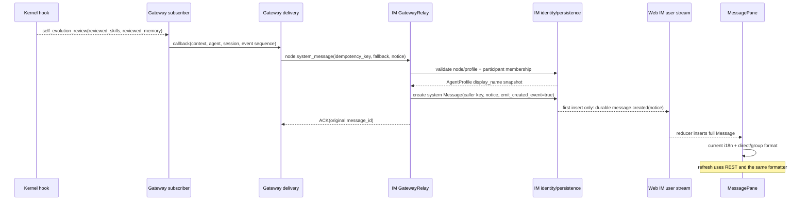
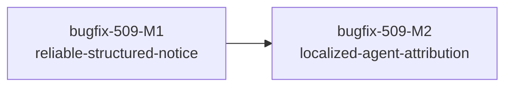

# bugfix-509: 群聊后台自进化提示标明 Agent — 技术方案

> 对齐: [incident.md](incident.md) v1
>
> Unit branch: `unit/bugfix-509`（由 `change-orchestrator` 在实施阶段创建）

## Changelog

## 现状分析

### 涉及范围

- `src/agent/platform/hooks/builtins/self_improvement.py` 发布结构化 `self_evolution_review` session event，已经包含 `reviewed_skills` 与 `reviewed_memory`；本 unit 只消费该事件，不改 hook、触发阈值或写入逻辑。
- `src/personal_assistant/gateway/background_subscriptions.py` 的订阅请求已经保存 `agent_id`，但 session-event callback 目前只收到 `ReplyContext + event`，因此通知路径丢失来源身份。
- `src/personal_assistant/gateway/runtime_delivery/background.py` 把事件格式化成固定英文，并通过 `node.system_message` 只发送 `conversation_id + text`。
- `src/IM/ws/gateway/relay.py` 把 `node.system_message` 直接持久为 `sender_type="system"`；当前写入不发布 canonical `message.created`，所以刷新能看到而在线页面不保证即时出现。
- `src/IM/domain/models.py`、`src/IM/infra/db.py`、`src/IM/infra/repositories/messages.py`、`src/IM/infra/repositories/_message_projection.py` 与 `src/IM/api/routes/messages.py` 共同承担消息 sidecar 的持久化、历史 REST 与实时事件投影；目前没有 system notice 的结构化字段。
- `src/IM/infra/gateway_persistence.py` 已能从 `agent_id` 找到 Agent profile、IM synthetic user 与 conversation participant；profile 是当前显示配置权威，synthetic user 只用于 participant identity。
- `src/IM/application/web_im_service.py` 会把 direct-chat fork 点以前的消息逐条复制到新会话；新增 Message sidecar 必须显式随消息复制，否则分支里的 system 行会退回旧正文。
- `src/IM/frontend/src/features/chat/chat-types.ts` 与 `chat-stream-reducer.ts` 分别承接历史/实时消息类型和 `message.created` 归并；`components/message-pane.tsx` 对 system message 只输出 `message.content`，但已经拥有 `isDirectChat` 与 `useTranslation()`。
- `src/IM/frontend/src/i18n/{zh,en}.json` 是当前中英文文案权威；界面语言保存在浏览器 `localStorage`，Gateway/IM 服务端没有可靠的当前浏览器语言。

### 既有约束

- `IM` 不 import `agent`；`personal_assistant` 只经 `agent.sdk` 消费内核。本 unit 必须沿现有 Gateway WebSocket 边界传递语义，不能让 IM 直接理解 kernel event。
- 自进化提示继续是 `sender_type="system"` 的轻量居中行，不伪装为 Agent 第一人称消息，不进入模型上下文。
- Coding CLI 继续走自己的 `self_evolution_review` formatter；本 unit 不改 CLI 文案、事件或测试。
- 新 schema 必须兼容已有普通 system message 与修复前的纯英文历史行；不回填历史数据。
- 前端语言可在同一个已登录浏览器内切换，因此服务端不能在持久化时选择唯一语言。
- `src/IM/frontend/dist/` 是构建产物，不提交；真实浏览器截图作为 milestone evidence，不进入长期测试套件。

### 可复用能力

- **现有 `node.system_message` 与 system 行样式：改后复用。** 它已经表达“非第一人称、非模型消息”的正确产品语义；只扩展可选 sidecar 和实时投影，不新造一类时间线条目。
- **消息 JSON sidecar 链：复用。** `tool_calls` / `thinking` 已证明 SQLite JSON → domain → REST → `message.created` → reducer 的贯通方式；`system_notice` 沿同一链路增加一个窄字段。
- **`MessageRepository.create_message(..., emit_created_event=True)`：复用。** 让 system notice 在 durable write 后发布完整 `message.created`，不另建 event bridge。
- **Gateway conversation persistence 的 profile/user/conversation 查询：改后复用。** 新增一个窄的来源解析操作，统一验证 agent 属于已认证 node 和目标会话，并从 `AgentProfile.display_name` 取得当前显示名；不信任 Gateway 自报显示名，也不使用可能陈旧的 synthetic user display name。
- **`MessageRepository.caller_idempotency_key`：复用。** 以 Kernel session event 的稳定身份防止 IM commit 成功但 ACK 丢失后的重放产生第二条消息。
- **`WebIMService.fork_conversation()` 的消息复制循环：改后复用。** 原样复制已持久的 notice 快照，不在 fork 时重新解析 fallback 或重新查询当前 Agent 名。
- **前端 `useTranslation()` 与 enum → i18n key 映射：复用。** 已识别的 notice 按稳定枚举选择整句翻译；不解析英文正文。
- **独立 `agent.config.changed` 时间线边界：不用。** 它需要锚点、分页和 fork 语义，而自进化提示本来就是一条 system message；复用会引入不匹配的复杂度。

### 相关历史

- `feat-349-self-evolving-skills-memory` 确立了 per-agent 隔离、结构化 session event 与轻量 meta/system 提示；本 unit 补齐多 Agent 群聊归因和 IM i18n，不改变自进化本体。
- `bugfix-399-self-evolution-review-replay` 收敛了 session event 的单一后台订阅与去重语义；本 unit 只给该订阅的 callback 补回请求中已有的 `agent_id`。
- `bugfix-404-bg-notify-workspace-isolation` 已让后台 Agent 正文通过 `message.created` 实时出现；本 unit 对 system notice 使用同一 durable live seam，但不把 system notice 改成 Agent 正文。
- `feat-397-spec-design-agent-team` 让群聊中的多个 Agent 成为一等参与者；本 unit 必须使用该 conversation membership 作为归因校验依据。

## 架构总览

改前，Gateway 把结构化 kernel event 压平成英文，IM 只剩一条无法归因的正文。改后，既有 system message 获得可选 `system_notice` sidecar：Gateway 提供稳定事件语义与来源 id，IM 校验并快照显示名，Web IM 在消息行和当前语言之间做最后一公里渲染。

```mermaid
graph LR
    Hook["Kernel self_evolution_review\n既有，不改"] --> Sub["Gateway BackgroundSubscriptionManager\nReplyContext + agent_id + event"]
    Sub --> Delivery["Gateway runtime delivery\n构造 node.system_message"]
    Delivery -->|"text fallback + system_notice"| Relay["IM GatewayRelay"]
    Relay --> Identity["GatewayConversationPersistence\n校验成员 + 快照显示名"]
    Identity --> Repo["MessageRepository\nsystem_notice_json + message.created"]
    Repo --> History["REST timeline"]
    Repo --> Live["owner user stream"]
    History --> Reducer["Web IM Message / reducer"]
    Live --> Reducer
    Reducer --> Format["system-notice formatter\nzh/en + direct/group"]
    Format --> Row["既有 chat-bubble-system"]
```



边界保持不变：Kernel 不知道 IM；IM 不 import Kernel；本地化只发生在浏览器；普通 system message 仍可只带 `content`。

## 关键决策

### 决策 1：在既有 system message 上增加窄 `system_notice` sidecar

**选择 `node.system_message + optional system_notice`，不新增 Agent 气泡或独立 timeline item。**

- **理由**：原有 system 行的语义、位置和视觉层级已经正确；缺的是可本地化、可归因的数据。sidecar 能沿现有消息持久化与实时投影链闭环，并保留普通 system 消息兼容性。
- **拒绝**：把提示改成 Agent 消息——会伪造第一人称发言并改变消息交互；新建独立 timeline event——要重做分页、排序、恢复和 fork 规则，且偏离 `feat-349` 的 system/meta 意图；前端解析英文正文——无法稳定取得 agent id，也把文案变成协议。
- **风险**：消息模型多一个可选 JSON 字段。字段只服务一种已声明 kind，不建设通用通知框架。

最终 Gateway → IM payload：

```json
{
  "conversation_id": "conv-123",
  "idempotency_key": "self-evolution-review:sess-456:87",
  "text": "· background self-evolution review: memory updated",
  "system_notice": {
    "kind": "self_evolution_review",
    "source_agent_id": "speclab-product",
    "updated_targets": ["memory"]
  }
}
```

`text` 是旧客户端/未知 notice 的兼容回退，不是新前端的翻译来源。`idempotency_key` 由 `self-evolution-review:{kernel_session_id}:{event_sequence}` 构成；同一 session event 重发保持完全相同。`updated_targets` 只允许非空的 `skills` / `memory` 集合，规范顺序固定为 `skills, memory`。

direct-chat fork 复制消息时，`system_notice` 与 `content` 一起原样复制。复制后的消息获得分支自己的 message id，但 notice 内的来源显示名快照和更新对象不变；fork 不重新校验当前 Agent 名，也不把修复前无 sidecar 的历史正文“升级”为结构化 notice。

### 决策 2：浏览器按当前界面语言渲染完整句子

**已识别 notice 由 Web IM 使用整句 i18n key 渲染；服务端不猜浏览器语言。**

- **理由**：同一用户的多个浏览器可以选择不同语言，持久化一份中文或英文都会让另一端错误；结构化语义可以在实时、刷新和切换语言后重复渲染。
- **拒绝**：Gateway 读取系统 locale、IM 按用户 profile 猜语言、或存双语正文——三者都不是当前 UI 语言的权威。
- **风险**：旧 Web 客户端仍显示英文 fallback；这是 rolling compatibility，不影响升级后的当前界面。修复前的历史行无 sidecar，继续显示原正文，符合“不回填历史”的范围。

文案采用 6 个完整句子 key（direct/group × skills/memory/both），避免跨语言拼接语序：

| 会话 | 中文示例 | 英文示例 |
|---|---|---|
| 群聊 memory | `· SpecLab Product · 后台自进化：记忆已更新` | `· SpecLab Product · Background self-evolution: memory updated` |
| 单聊 memory | `· 后台自进化：记忆已更新` | `· Background self-evolution: memory updated` |
| 群聊 skills + memory | `· SpecLab Product · 后台自进化：技能与记忆已更新` | `· SpecLab Product · Background self-evolution: skills and memory updated` |

### 决策 3：IM 校验来源归属并快照显示名

**Gateway 传 `source_agent_id`，IM 以已认证 node 绑定和目标 conversation membership 为权威解析并持久化 `source_agent_display_name`。**

- **理由**：订阅请求持有实际执行 agent id；IM dispatcher 已把每个业务帧绑定到已认证 `node_id`，并持有 Agent↔node、synthetic agent user、Agent profile 与会话参与者。node binding、participant identity 与 profile 三项同时匹配，才能保证另一个 Gateway 不能冒用群成员身份且新 notice 使用当时的当前名称。
- **拒绝**：Gateway 直接发送显示名——显示配置权威在 IM，且字符串不可证明是会话成员；前端从群成员猜——多个 Agent 时无法知道是哪一个触发。
- **风险**：Agent 不属于已认证 node、已从会话移除或身份不存在时通知会被 IM 拒绝并返回 `invalid_system_message`；Gateway 记录 warning，但后台通知失败不得影响自进化任务和主会话。

显示名权威拍死为 `AgentProfile.display_name`：Agent 配置更新会写 profile，而既有 synthetic user display name 可能仍是创建时值；synthetic user 只用于把 `agent_id` 映射为 participant user id。profile 缺失、node binding 不匹配、profile display name 为空或 participant 不匹配均拒绝 notice。

IM 持久/下发的 sidecar 在 ingress 字段上增加显示名快照：

```json
{
  "kind": "self_evolution_review",
  "source_agent_id": "speclab-product",
  "source_agent_display_name": "SpecLab Product",
  "updated_targets": ["memory"]
}
```

快照保证实时与刷新一致，也落实“Agent 改名不反向改写历史”。前端不得用当前 participants 中的新名字覆盖该快照。

### 决策 4：以 session event 身份幂等落库，并在 durable write 后发布完整 `message.created`

**Gateway 用稳定 event identity 等待业务 ACK；IM 复用 message caller idempotency，在同一条消息写入路径中持久 sidecar并启用 canonical `message.created`。**

- **理由**：当前刷新可见、实时不可靠的根因是写入没有 created event；同时，Gateway business frame 在 IM commit 后丢 ACK 会重放，若每次生成新 message id 就会永久重复。现有 `send_json_await_ack()` 与 repository `caller_idempotency_key` 正好覆盖这两个 seam。
- **拒绝**：只靠前端 message id 去重——重放会生成新 id，DB 已经重复；前端轮询、发送临时 WS-only event、或先广播后落库——都会让实时与历史形成两套权威或产生刷新闪回；本 unit 新建专用 outbox——当前目标是同一 Gateway 进程内 connection reconnect 的可靠重放，Kernel stream 已提供稳定的进程内 session/sequence identity，跨 Gateway 进程重启的通知恢复不在本次范围。
- **风险**：callback 在 IM negative ACK、ACK timeout 或 socket disconnect 时记录 warning，但不抛回 self-evolution task；disconnect 后 connection queue 仍以同一 key 重发。IM 首次 insert 才发布 `message.created`，幂等命中只 ACK 并返回原 message id，不再发布事件或推进会话投影。

具体契约：

- `BackgroundSubscriptionManager` 调 callback 时补入固定的 `kernel_session_id`；event 必须携带正整数 `_id` 或 `sequence_num`，否则记录 warning 并跳过无法安全去重的通知。
- Gateway 生成 `idempotency_key=self-evolution-review:{session_id}:{sequence}`，调用 `send_json_await_ack()`；success ACK 至少含相同业务类型与已持久的 `message_id`。
- IM 把该 key 传给 `MessageRepository.create_message(caller_idempotency_key=...)`。第一次写入生成 message + sidecar + canonical event；重放在 conversation-scoped key 上返回同一 Message。
- deterministic error ACK 由现有 connection manager 变成 callback 可观察异常；callback 只记录 conversation/agent/event identity，不让通知失败改变后台 review 或前台 run 结果。

### 决策 5：未知/旧 system message 退回正文，CLI 与 Kernel 完全不动

**只有结构完整且 kind 已识别的 `system_notice` 进入 i18n formatter，其余 system message 继续显示 `content`。**

- **理由**：普通 system message、旧历史和未来新 kind 都必须保持可读；本 unit 只修一个通知，不扩成系统消息平台。
- **拒绝**：迁移旧英文正文、修改 CLI formatter、或让 kernel event 加 IM 显示名——都越过本 unit 的产品和架构边界。
- **风险**：修复前历史仍是英文，这是首文档明确接受的非目标。

## 接口与数据流

### 接口契约

| 边界 | 变更后输入/输出 | 校验与兼容 |
|---|---|---|
| `BackgroundSubscriptionManager → session_event_callback` | `(reply_context, agent_id, kernel_session_id, event)` | agent/session/reply context 来自首次建立订阅的 `BackgroundSubscriptionRequest`；event sequence 来自 stable in-process Kernel stream |
| `Gateway → IM node.system_message` | 既有 `conversation_id`, `text`；新增 `idempotency_key` 与可选 `system_notice` | 无 notice 的旧调用完全不变；self-evolution notice 必带 stable key/kind/source/targets，并走 awaited business ACK |
| IM ingress → persistence | `SystemNotice(kind, source_agent_id, source_agent_display_name, updated_targets)` | dispatcher 注入的 `node_id` 与 AgentProfile binding 一致；synthetic agent user 是 participant；display name 取 profile；targets 非空、去重并规范排序 |
| SQLite | `messages.system_notice_json NULL` | 旧行/普通 system message 为 NULL；schema migration 只加 nullable column，不回填 |
| REST / `message.created` | `message.system_notice: object | null` | 两条路径输出同一快照；未知/NULL 由前端 fallback |
| Web IM | `formatSystemNotice(t, notice, isDirectChat)` | 群聊插入 snapshot name；单聊不插入；三类 targets 使用完整句子 key |
| direct fork copy | source `Message.system_notice` → copied `Message.system_notice` | 精确复制快照与 targets；无 sidecar 仍为 NULL；不重新解析/改名 |

`SystemNotice` 是消息 domain 的窄值对象，不对任意 action、链接或富组件开放。只有 IM ingress 负责把不可信 wire object 归一为该值对象；repository 不重复解析协议。

### 主流程



若 ACK 丢失，connection 重放同一 `idempotency_key`；IM 命中原 message 并返回原 id，不再发第二个 `message.created`。direct fork 则在新会话创建新的 message id，同时精确复制 notice 快照；这是用户主动复制历史，不与 transport dedupe 混用。

### 更新对象映射

| Kernel event | `updated_targets` | i18n variant |
|---|---|---|
| skills=true, memory=false | `["skills"]` | `skills` |
| skills=false, memory=true | `["memory"]` | `memory` |
| skills=true, memory=true | `["skills", "memory"]` | `both` |
| skills=false, memory=false | 不发送 notice | 不渲染 |

最后一行有意比当前 generic `self-evolution updated` 更严格：没有被 review 的目标就没有可向用户声明的更新语义。它不会改变 hook，只避免制造无法解释的 system notice。

## 前端原型

- 原型文件: [prototype.html](prototype.html)
- 覆盖范围: 现有 Web IM 桌面/移动聊天结构内的 system 行；可切换群聊/单聊、中文/英文、skills/memory/both，展示最终文案与信息层级。

### 现有 UX grounding

| 当前产品入口 / 组件 | 必须继承的 UX 特征 | 本次增量如何嵌入 |
|---|---|---|
| `/chat/:conversationId` / `ChatWorkspacePage` | desktop 保留左侧 conversation rail + 右侧 chat；mobile 保留单页聊天，不新增 modal 或设置页 | 原型只在既有 chat timeline 内替换一条 system 行内容 |
| `MessagePane` / `.chat-bubble-system` | system 信息居中、无头像、无发送者头、无气泡菜单，视觉层级低于普通消息 | 群聊仅在同一行中加入 Agent 显示名；单聊维持无姓名结构 |
| `UserMenu` language + `useTranslation` | zh/en 由当前浏览器即时切换 | 原型语言切换即时改写 notice；正式实现使用同一 i18n 实例 |
| 现有响应式 chat | desktop/mobile 消息顺序与语义一致，不产生横向滚动 | system 行允许自然换行，名称和文案不拆成新卡片 |

改变点只有两项：已识别自进化 system 行按当前语言显示；群聊在正文中明确显示来源 Agent。周边 header、消息气泡、composer 和 navigation 不改。

### 原型对齐契约

| 原型区域 / 状态 | 对齐级别 | 产品入口 | 必验 viewport / 状态 | 下游验收投影 |
|---|---|---|---|---|
| `#system-notice` 的居中轻量 system 行 | must-match | `/chat/:conversationId` → `MessagePane` | desktop group/direct；mobile group/direct | bugfix-509-M2 reviewer/worker 退出标准 P1 |
| `#language-controls` 与 `#target-controls` 展示的 2×3 文案矩阵 | must-match（控制按钮仅用于原型，真实产品使用既有语言入口和真实事件） | 既有 UserMenu language + chat timeline | zh/en × skills/memory/both | bugfix-509-M2 reviewer/worker 退出标准 P2 |
| `#viewport-controls` 下 system 行的换行与无横向滚动 | must-match | desktop/mobile chat | 1280×800、390×844 | bugfix-509-M2 reviewer/worker 退出标准 P3 |
| 原型周边 sidebar/header/messages/composer | may-adapt | 现有 Chat 页面 | desktop/mobile | 只需保持当前生产设计，不要求逐像素复刻原型 |
| 原型顶部的会话/语言/结果/viewport 控制条 | out-of-scope | 无生产入口 | prototype only | N/A；不得实现为生产调试控件 |

## 契约层增量 (delta-spec)

- kernel: no spec delta
- im: [specs/im/gateway-relay.md](specs/im/gateway-relay.md), [specs/im/conversations-messages.md](specs/im/conversations-messages.md), [specs/im/web-chat-ux.md](specs/im/web-chat-ux.md)
- gateway: [specs/gateway/relay-protocol.md](specs/gateway/relay-protocol.md)
- cli: no spec delta

## 风险与回退

- **来源身份失配**：IM 拒绝 source AgentProfile 不属于已认证 node、profile 缺失/无当前显示名或 synthetic user 不属于 conversation 的 structured notice，返回现有 error ACK 形态；Gateway warning 带 conversation/agent/event identity，不让通知异常冲垮后台任务。
- **ACK 模糊结果与重放**：每个 notice 使用 Kernel session + event sequence 稳定 key；IM commit-before-ACK-loss 后重放只返回原 message id。无 sequence 的 event 不发送，避免用不稳定 hash 制造假幂等。
- **实时/历史漂移**：同一个 `SystemNotice` 快照同时进入 DB row、REST 与 `message.created`；frontend reducer 不自行补名字，避免刷新后变样。
- **本地化漂移**：群聊/单聊与三类目标使用 6 个完整句子 key，并由同一 formatter 选择；组件测试覆盖 zh/en 矩阵，不靠英文字符串 parser。
- **fork 完整性**：direct fork 精确复制已有 sidecar；不重新解析旧正文、不用改名后的 profile 覆盖历史快照。若 copy transaction 失败，沿既有 fork 原子回滚。
- **兼容回退**：无 sidecar、未知 kind 或旧历史继续显示 `content`。若需回滚前端，英文 fallback 仍可读；若需回滚后端，前端看到 NULL 后也回退正文。
- **消息列表次级投影**：本 unit 改的是聊天时间线内的 system 提示；conversation list 的 `last_message_preview` 仍沿既有纯文本投影，不把它扩成第二套结构化通知 UI。若产品后续要求列表也随浏览器语言动态变化，应单独给 conversation summary 增加结构化投影，不能解析 fallback 文本。
- **数据迁移**：只增加 nullable `messages.system_notice_json`，不回填、不删除；回滚应用代码后该列可安全保留。

## Runbook for Reviewer

Reviewer 在自己的 unit worktree 执行。`e2e-up.sh` 同时启动隔离 IM 与 Gateway，Vite 单独由 tmux 持有；结束后必须执行两行停止命令并确认端口释放。

| 服务 | 停止命令 | 启动命令 | 健康检查 |
|---|---|---|---|
| isolated IM + Gateway | `./scripts/e2e-down.sh --wt "$(git rev-parse --show-toplevel)"` | `PATH="/Users/czj/Repos/nano-multiagent/.venv/bin:$PATH" ./scripts/e2e-up.sh --wt "$(git rev-parse --show-toplevel)"` | `source .e2e-ports.env && curl -fsS "$IM_URL/openapi.json" >/dev/null && kill -0 "$(cat .gateway.pid)"` |
| Web IM Vite | `tmux kill-session -t bugfix-509-vite 2>/dev/null || true; rm -f .bugfix-509-vite-port` | `source .e2e-ports.env; VITE_PORT="$(./scripts/free-ports.sh 1)"; printf '%s\n' "$VITE_PORT" > .bugfix-509-vite-port; tmux new-session -d -s bugfix-509-vite "cd '$PWD/src/IM/frontend' && VITE_IM_PROXY_TARGET='$IM_URL' npm run dev -- --host 127.0.0.1 --port '$VITE_PORT' --strictPort"` | `curl -fsS "http://127.0.0.1:$(cat .bugfix-509-vite-port)/chat" >/dev/null` |

**Review 驱动方式**: 端到端真栈；本 unit 改了客户端面，必须真驱动 Web IM。用浏览器登录 `nano / nano1234`，分别进入一个 `E2E Agent` 单聊和一个同时包含 `E2E Agent`、`E2E Peer Agent` 的群聊；在 UserMenu 切换中文/英文，观察真实 `self_evolution_review` 实时到达、刷新和重进后的同一 system 行；再在单聊 notice 之后完成下一轮回复并从该回复 fork，确认分支历史里的 notice 仍按当前语言显示。以 1280×800 与 390×844 两个 viewport 对照 [prototype.html](prototype.html)。不得用直接写 SQLite、组件预览或只调 `handle_system_message` 替代用户旅程。

**验收前置**:

- 当前环境已落实：`curl -fsS http://127.0.0.1:4000/health` 返回 `{"ok":true}`；主 checkout `.venv` 可 import PyYAML；`src/IM/frontend/node_modules`、`tmux` 与 `npm` 可用。无需第三方账号或凭据。
- `e2e-up.sh` 完成后、浏览器发送第一条消息前，为两个隔离 Agent 写入 review 间隔 1 的 worktree-local 配置：

  ```bash
  for agent in e2e e2e-peer; do
    config_dir=".gateway-workspace/$agent/.nanoassistant"
    mkdir -p "$config_dir"
    printf '%s\n' \
      'self_evolution:' \
      '  enabled: true' \
      '  skill_creation: true' \
      '  memory_curation: true' \
      '  skill_nudge_interval: 1' \
      '  memory_nudge_interval: 1' \
      > "$config_dir/config.yaml"
  done
  ```

- 群聊中分别 @ 两个 Agent 并让其至少调用一次 `skill_view` 后完成回复，可产生两条不同来源的 combined notice；单聊发送普通一轮至少产生 memory notice。若某轮 LLM 未调用工具，只把它作为 memory 场景，重开会话后再明确要求使用 `skill_view`，不伪造数据库结果。

## Milestones

本 unit 预计修改约 16–17 个生产文件、8–11 个测试文件、530–780 行，超过单 worker 的 10 文件窗口，触发拆分。按两个用户可观察结果串行完成：M1 交付“system notice 在线即时出现、断线重放不重复、刷新/fork 不丢语义”的可靠结构化通知，现有客户端仍显示 fallback；M2 消费该结构化语义，统一交付 group/direct 的当前语言文案与群聊来源归因。边界按可靠投递结果与最终呈现结果划分，不是把一个不可观察流程机械地拆成 backend/frontend。



| ID | 标题 | 依赖 | 并行组 | 范围 | 退出标准 |
|---|---|---|---|---|---|
| bugfix-509-M1 | reliable-structured-notice | — | A | 预计 10–11 个生产文件、6–8 个测试文件、350–500 行。Gateway subscription callback + stable in-process event identity、`runtime_delivery/background.py` 的 awaited ACK；IM AgentProfile/node/membership 校验、display-name snapshot、system notice domain/SQLite/repository/API/WS projection与 `message.created`；`src/IM/application/web_im_service.py` direct-fork copy。现有 Web IM 无需改动即可把 fallback system row 实时显示。 | `[reviewer]` 单聊与群聊中的真实 self-evolution fallback system row 无需刷新即可出现，刷新/重进后仍是同一条；commit-before-ACK-loss reconnect 不产生第二行；从 notice 后的 Agent 回复 fork 后，分支中仍有同一 system row，且旧普通 system message/Coding CLI 不变；`[worker]` Gateway payload/awaited ACK、重放只产生一个 message id/created event、negative ACK 只记 warning、来源 Agent profile/node/conversation 归属拒绝、profile rename 后新 snapshot、nullable migration、REST/live/fork sidecar round-trip、旧行 fallback、三类 targets 规范化的最低层回归全绿；`[worker]` `progress.md` 保存 live/reconnect/reopen/fork 的真实浏览器与协议证据。 |
| bugfix-509-M2 | localized-agent-attribution | bugfix-509-M1 | B | 预计 6 个生产文件、2–3 个测试文件、180–280 行。Web IM message types/reducer、窄 system-notice formatter、zh/en 完整句子 keys 与 `MessagePane` direct/group 呈现；不再修改 Gateway/IM persistence。 | `[reviewer]` 中文/英文界面的单聊与群聊都以当前语言显示 skills、memory、both，实时、刷新、重进与 fork 后语义一致（P2）；群聊中 `E2E Agent` 与 `E2E Peer Agent` 的每条 system 行分别显示自己的快照名称，单聊不重复名称，且保持无头像、无发送者头、无消息菜单的居中轻量样式（P1）；desktop 1280×800 与 mobile 390×844 无横向滚动、长名称可自然换行（P3）；`[worker]` history/live reducer round-trip、unknown/NULL fallback、group/direct × zh/en × 三类 targets 的 component matrix 全绿，formatter 使用 notice snapshot、不从当前 participants 覆盖历史名称；`[worker]` `cd src/IM/frontend && npm test -- src/features/chat/chat-stream-reducer.test.ts src/features/chat/components/message-pane.test.tsx && npm run build` 全绿；`[worker]` `progress.md` 保存 zh/en × 三类 targets、group/direct、fork 与 desktop/mobile 的真实浏览器证据并对照 prototype P1/P2/P3。 |
