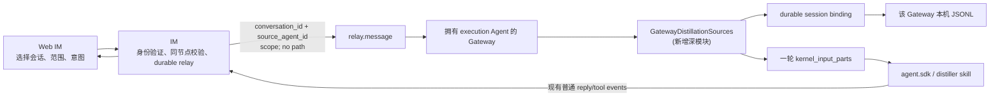
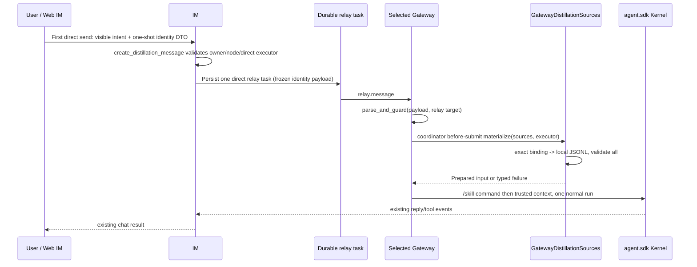
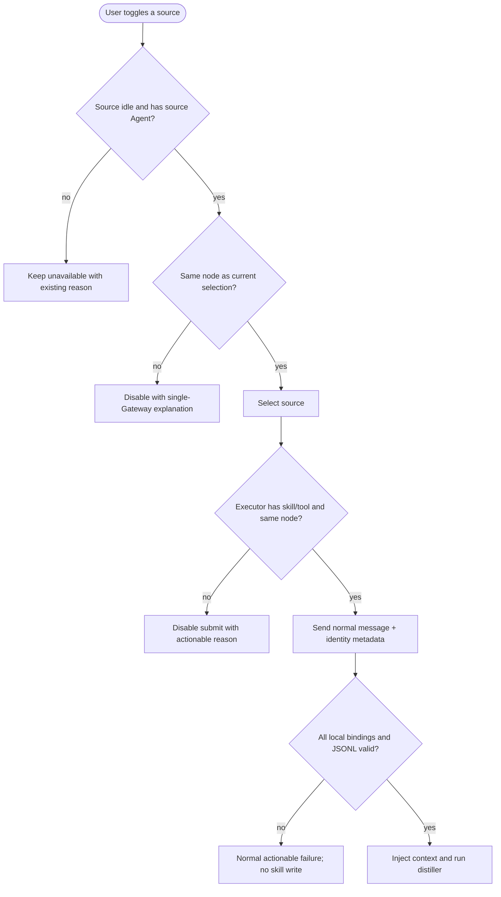

# bugfix-518: Gateway-owned skill distillation — 技术方案

> 对齐: [incident.md](incident.md) v1

## Changelog

| Version | Change |
|---|---|
| v1 | Initial design. |
| v2 | Close R1-C1/C2/C3 and R1-W1: define the typed one-shot wire, Gateway activation and failure lifecycle, and retained Web IM contracts. |
| v3 | Close R2-C1/C2/W1: keep IM capability preflight non-authoritative, make Gateway final authority, keep private activation out of protocol delta, and retain failed-receipt state. |

## 现状分析

### 涉及范围

- `src/IM/infra/repositories/conversations.py` 目前从 `agent_profiles.workspace_root` 扫描
  `.nanoassistant/sessions/*.jsonl`，把结果投影为 `Conversation.source_jsonl_path`；这让 IM
  越过了 Gateway 的本机文件系统边界。
- `src/IM/frontend/src/features/chat/` 的选择器和 `chat-workspace-page.tsx` 以该绝对路径作为
  eligibility 与预填 `/skill:conversation-skill-distiller` 消息的输入。
- IM 的 `RelayService` 已能把由一次用户消息派生的 opaque metadata 持久化进唯一 relay task；
  Web Relay Adapter 会把该 metadata 交给目标 Gateway。
- Gateway 的 `GatewaySessionBinder` 持有稳定的
  `(web_relay, conversation_id, agent_id) -> kernel_session_id` binding；其本机 workspace 才拥有
  相应 JSONL。`SessionRunCoordinator` 也已有单轮 `kernel_input_parts` seam；inbound pipeline 在路由到
  relay Agent 后、交给 coordinator 前是本修复唯一需要的 typed-action guard。
- 内置 `conversation-skill-distiller` 目前要求普通消息携带 `source_jsonl_paths` 并自行读文件，
  因而仍把本机文件位置当成跨包接口。

### 既有约束

- `IM` 不 import 或调用 `agent`，且不得读 Gateway local workspace；Gateway 只经 `agent.sdk`
  持有内核。浏览器与 Gateway 只通过 IM 的 HTTP/WebSocket 通信。
- 一次蒸馏的 source conversations 与 execution Agent 固定在同一 Gateway；不设计跨节点
  transcript 拼接或 global skill 同步。
- 用户仍从既有 sidebar 的「生成 skill」入口选会话、选择 execution Agent 和 agent/global 范围；
  成果仍出现在既有普通聊天与 tool output 中，不增加专用结果页或确认卡。
- relay task 的 idempotency key 与 Gateway Web Relay 去重是已有的 delivery 语义；本修复不增加
  第二套 retry/recovery 队列。

### 可复用能力

| 能力 | 决定 | 原因 |
|---|---|---|
| `RelayService.extra_metadata` + durable relay task | 用 | 将逻辑 source identity 和 scope 随原用户消息可靠地送到唯一 Gateway，无新 RPC。 |
| Web Relay opaque metadata + persistent dedupe | 用 | 请求重传仍只进入 Gateway 一次，结果继续沿普通聊天 delivery 生命周期展示。 |
| `GatewaySessionBinder.capture_binding_provenance()` / conversation session key | 用 | Gateway 以 durable binding 定位自己拥有的 session，而不是以 IM 传来的路径或目录扫描猜测。 |
| `SessionRunCoordinator` 的 `kernel_input_parts` | 用 | Gateway 可在一轮内把已验证 transcript material 与可见用户意图一起送给模型，不把内部 prompt 写回浏览器。 |
| `session.log.resolve`、IM-side JSONL scanner | 不用并删除 | 它们投影本机文件路径，正是跨机故障的根因。 |
| 新的 cross-Gateway transcript RPC / skills 同步 | 不做 | 与已确认的单 Gateway 产品边界冲突，且会把一次修复扩成分发系统。 |

### 相关历史

`feat-515` 一度为 workspace root change 补过 session-log 投影与跨节点选择；清理提交已把这条
correction 从该 PR 移除，并保留创建断线 recovery。`bugfix-518` 接管它暴露的真实缺陷，但不触碰
Agent 创建、workspace root 或其 operation recovery。

## 架构总览

现状把“来源会话”降格成绝对文件路径，由 IM 扫描并交给普通 prompt。目标是把它恢复为
**Gateway-local source identity**：IM 只做权限、同节点选择和路由；目标 Gateway 是唯一读 JSONL、
构造模型输入并执行 distiller 的 owner。



图中唯一越过进程边界的是 identity-only relay metadata；绝对路径和 transcript bytes 都停在
Gateway 进程内。`GatewayDistillationSources` 是一个深模块：调用方只交 source pairs，它隐藏
binding、local JSONL 定位/解析和 all-or-nothing failure。

## 关键决策

### **D1：单 Gateway 是请求合法性的前提，而不是失败后的 fallback。**

IM 从来源 Agent profile 投影 `source_node_id`（不是 workspace path）。选择第一个来源后，来自
其他 node 的 conversation 立刻禁选；execution Agent 下拉只显示该 node 的 Agent。提交时 IM 再次
按当前 profile 校验全部 source 与 executor 同 node，并将请求只 enqueue 到该 node。Gateway 仍验证
所有 source binding 都是本进程本 node 的，以防陈旧 UI、直接 API 调用或配置变更。跨节点不会自动
拆批、转发或隐式选择其中一部分。

### **D2：一条 typed、一次性的 direct-message action 是唯一跨进程请求。**

浏览器保持目前“新建 execution Agent 对话、用户补充意图后发送”的旅程。新建对话完成后，
`ChatWorkspacePage` 在该 conversation 的 composer state 保有一个 one-shot
`distillation_request`；只随**该 conversation 第一次** `createMessage` 发送，发送、取消或离开页面即清除。
用户可编辑的正文和附件仍按普通消息展示；action 不写入 `Message`、browser history 或后续 draft。

`POST /messages` 的 `CreateMessageRequest` 为此增加可选 typed field：

```text
distillation_request = {
  sources: [{ conversation_id, source_agent_id }, ...],  // 1..N，pair 必须唯一
  execution_agent_id,
  target_scope: "agent" | "global"
}
```

浏览器不发送 `target_node_id`、workspace/path、kernel id 或 transcript。路径为非法字段；空 source、空 id、
重复 `(conversation_id, source_agent_id)` 或未知 scope 在 IM HTTP 边界返回 validation error。

该 field 存在时 route 调用新的 `WebIMService.create_distillation_message` application operation；没有该 field
的普通 direct/group 消息继续原有 all-relay 行为。该 operation 在 owner scope 内重新加载 source
conversations、source Agent profiles、execution conversation/profile，确认：每个 source 的 Agent identity 精确
匹配、均 idle；所有 source 和 executor 的 profile node 相同；execution conversation 是当前用户与该 executor
的 direct conversation。它自行计算唯一 target node，不能接受 browser 指定的路由。浏览器现有的 capability
读取仅是 preflight：它在创建 execution conversation 前提示 distiller/`skill_view`/`skill_manage` 不可用，
但不成为这次 relay 的权威或额外跨进程依赖。

通过校验后才创建普通用户消息，并使用单 target
`RelayService.enqueue_message_relay(..., extra_metadata={"distillation_request": ...})`，而非
`enqueue_message_relay_all`。因此 canonical relay payload 是 identity-only action 的唯一 durable 副本。
同一 message/idempotency key 仅复用该 frozen relay task/payload、不会二次 relay；相同 key 附带不同 action
fingerprint 则被拒绝，不能用重试替换 metadata。这里复用既有 relay/dedupe，不增加 recovery 子系统。

### **D3：Gateway 以精确 binding materialize 所有来源，失败则整轮不运行。**

`GatewayDistillationSources` 接受逻辑 source pairs 和 executor，逐一用既有 conversation session key
取得 provenance/binding，并只在该 source Agent 的 local workspace 读取已绑定 `kernel_session_id` 的
JSONL。它验证来源完成、Agent/工作区仍匹配、记录可读且可解析；任一个失败均生成可理解的普通失败
回复，既不启动模型也不写 skill。不会返回“无 transcript”给 IM 作为本机目录扫描的替代结果。

### **D4：Gateway 显式激活 distiller，并将验证后的 transcripts 注入这一次 run。**

成功 materialize 后，coordinator 以此 typed run 替换默认正文 parts，按如下固定顺序生成
`kernel_input_parts`：第一段 text **恰为** `/skill:conversation-skill-distiller`；第二段为有长度上限、明确标记的
Gateway-provided context，内含 target scope、用户在 composer 中可见的意图以及所有 materialized transcript。
这复用内核既有 `/skill:` activation，不要求前端拼接特权命令。该内部 command/context 不回写 Web IM history
或 reply context。

builtin distiller 改为只消费该标记的 Gateway context，始终把 transcript 作为数据而非指令；普通手工
`/skill:conversation-skill-distiller` 而没有该 context 时给出可理解的不足证据失败。它不再接受或读取
`source_jsonl_paths`，并保留现有 evidence / `skill_manage(create)` 约束。

### **D5：`global` 仅表示 execution Gateway 的本机 global skills root。**

这是单 Gateway 边界的自然结果。agent scope 写 execution Agent 的 local scope；global 写该 Gateway
的 global scope。写完后的工具/回复仍由原聊天展示；其他 Gateway 不自动发现或同步该 skill。

### **D6：typed failure 使用现有聊天 delivery lifecycle，而不是异常或第二套队列。**

Web Relay Adapter 仍只运输 opaque metadata。`InboundPipeline` 在已解析 relay target Agent 后调用
`DistillationRequest.parse_and_guard()`：重新验证完整 schema/scope、`payload.agent_id == execution_agent_id`
和当前 Gateway 的 Agent membership；无效 metadata 是 actionable delivery failure，绝不降级为普通 prompt。
通过 guard 的 action 交给 `SessionRunCoordinator.prepare_distillation()` 这个 **before-submit** hook；它先在
本机以实际 execution Agent runtime 复核 `conversation-skill-distiller`、`skill_view` 和 `skill_manage`，再调用
`GatewayDistillationSources`，两者都发生在创建 execution binding/session、接受模型 run 前。

`GatewayDistillationSources` 返回 `PreparedDistillationInput` 或 typed `DistillationSourceFailure`。malformed action、
local capability failure 与 source failure 都由 coordinator 的
`fail_distillation_before_submit()` 经现有 outbound normal reply 与 failed `node.delivery_receipt` 路径发回 IM，
说明不能蒸馏且没有写入 skill；不创建 execution binding/session、不提交模型、不部分 materialize。成功时才进入
D4 的单次 run。

## 接口与数据流

### Relay metadata contract

```text
distillation_request = {
  sources: [{ conversation_id, source_agent_id }, ...],
  execution_agent_id,
  target_scope: "agent" | "global"
}
```

此结构只存在于用户本次 send 的 IM request、IM 的 relay task 和目标 Gateway inbound message。它不得
包含 `workspace_root`、`source_jsonl_path`、kernel session path 或 transcript bytes。IM API 的
conversation projection 改为可选 `source_node_id`，并移除 `source_jsonl_path`。

### Four concrete boundaries

| Boundary | Input / authority | Guaranteed outcome |
|---|---|---|
| Browser one-shot action | `createMessage` of the just-created direct execution conversation | Sends visible intent plus identity-only DTO once; never chooses a node or writes an action into history. |
| IM `create_distillation_message` | Owner-scoped current conversations/profiles and target direct conversation | Rejects stale/malformed/cross-node/ineligible identity input before a relay exists; creates one normal message and one canonical direct relay payload. |
| Gateway `parse_and_guard` | Durable relay payload plus resolved relay target Agent | Rejects malformed or mismatched metadata before local I/O; only the target executor can request materialization. |
| Coordinator before-submit | Local execution runtime plus `GatewayDistillationSources` result | Is the final capability authority; either calls `fail_distillation_before_submit()` for a normal failed reply/receipt with no run/session, or activates the builtin with trusted local context. |





## 前端原型

- 原型文件: [prototype.html](prototype.html)
- 覆盖范围: sidebar selection mode、跨节点不可选状态、同节点 execution Agent/range dialog 与生成后的
  普通聊天输入框。它故意不显示任何 local path。

### 现有 UX grounding

| 当前产品入口 / 组件 | 必须继承的 UX 特征 | 本次增量如何嵌入 |
|---|---|---|
| `ConversationSidebar` | 既有会话行、selection checkbox、窄屏仍以聊天单页为主 | 只在 distill mode 显示 checkbox/status；跨 node 行保留原列表位置但禁选并解释。 |
| `ChatWorkspacePage` | 现有 modal、Agent picker、创建新对话后由 composer 发送 | modal 只列同 node executor，并把范围延续为 agent/global；新 composer 只显示用户可读的 distillation intent。 |
| 现有聊天时间线 | user bubble、tool output、assistant reply 是唯一结果展示 | 不增加 skill draft/confirm card。 |

### 原型对齐契约

| 原型区域 / 状态 | 对齐级别 | 产品入口 | 必验 viewport / 状态 | 下游验收投影 |
|---|---|---|---|---|
| Sidebar 的 distill mode 与 checkbox | must-match | `ConversationSidebar` | desktop、390px；idle/running/cross-node | M1 reviewer-1、worker-1 |
| Scope dialog 的 executor/range | must-match | `ChatWorkspacePage` | desktop、390px；single-node sources | M1 reviewer-1、worker-1 |
| 新对话 composer 与聊天结果 | must-match | `MessagePane` | send 后，不出现 path 或专门结果卡 | M1 reviewer-2、worker-1 |
| 颜色、圆角、文案微调 | may-adapt | existing IM design tokens/i18n | desktop、390px | M1 worker-1 |

## 契约层增量 (delta-spec)

- kernel: no spec delta
- im: [specs/im/web-chat-ux.md](specs/im/web-chat-ux.md), [specs/im/gateway-relay.md](specs/im/gateway-relay.md)
- gateway: [specs/gateway/relay-protocol.md](specs/gateway/relay-protocol.md)
- cli: no spec delta

## 风险与回退

| 风险 | 控制与回退 |
|---|---|
| binding 丢失、JSONL 已删除或损坏 | coordinator 在模型接受前经普通 reply + failed receipt 失败；不建 execution session、不部分蒸馏、不调用 `skill_manage`。 |
| source 在 UI 选定后开始运行或 node/profile 改变 | IM submit 与 Gateway materialization 双重验证；要求用户刷新选择，不静默改来源。 |
| transcript 被当成 prompt instruction | Gateway 使用有界的 trusted-context 标记；skill 明确把记录作为数据而非指令。 |
| relay ACK/连接中断 | canonical direct relay payload 复用 message relay idempotency + Gateway dedupe；不增设第二 recovery path。 |
| 回退此次变更 | 回退 IM identity metadata 与 Gateway materializer/skill 更新即可恢复原入口，但不能恢复跨机可用性；不回退或迁移 workspace root / #515 recovery。 |

## Runbook for Reviewer

| 服务 | 停止命令 | 启动命令 | 健康检查 |
|---|---|---|---|
| IM + Gateway | `./scripts/e2e-down.sh --wt "$WT_ROOT"` | `./scripts/e2e-up.sh --wt "$WT_ROOT"` | `source "$WT_ROOT/.e2e-ports.env"; curl -fsS "$IM_URL/openapi.json" >/dev/null; kill -0 "$(cat "$WT_ROOT/.gateway.pid")"` |
| Vite (reviewer own process) | stop the recorded Vite PID | `source "$WT_ROOT/.e2e-ports.env"; VITE_PORT="$("$REPO_ROOT/scripts/free-ports.sh" 1)"; VITE_IM_PROXY_TARGET="$IM_URL" npm --prefix "$REPO_ROOT/src/IM/frontend" run dev -- --host 127.0.0.1 --port "$VITE_PORT" --strictPort` | open `http://127.0.0.1:$VITE_PORT` using the E2E account |

**Review 驱动方式**: 端到端真栈；本 unit 改 Web IM，reviewer 必须以浏览器驱动 sidebar、dialog 和
composer，而非只调用后端接口。

**验收前置**: 使用隔离 worktree 的 `e2e-up.sh` 账号登录；按
`docs/development/worktree-runtime.md` 的第二 Gateway 隔离要求准备两个独立 config、runtime state、workspace
root、node identity 和 port 的 Gateway，令 IM host 对它们均不可读。一个 source/executor 在同一 Gateway
成功；另一个 node 的 idle source 在 UI 及 submit 处均不可组合。记录浏览器截图/录屏和
`relay_tasks.payload_json`/Gateway log 的脱敏检查，证明路径未越过边界；结束执行 `e2e-down.sh` 并停止 Vite。

## Milestones

虽然影响多个包，但这是一条不可拆开的垂直旅程：页面选择、identity relay、Gateway local materialize
与普通聊天结果缺任一都无用户价值；按层拆分只会制造假并行。因此采用单一 M1。

| ID | 标题 | 依赖 | 并行组 | 范围 | 退出标准 |
|---|---|---|---|---|---|
| bugfix-518-M1 | Gateway 读取本地 transcript 并蒸馏 | 无 | A | IM source-node projection/typed direct relay；Web IM selection/dialog/one-shot draft；Gateway source module/before-submit activation/skill；delta specs、必要回归与真栈验收 | [reviewer] 1. 用户只能在一次操作中选择同一 Gateway 的 idle conversations 和 execution Agent；desktop 与 390px 均清楚显示 running/cross-node 不可用原因，并保留 agent/global 范围。<br>[reviewer] 2. 在 IM 与 Gateway 文件系统互不可见的真栈中，同 Gateway 来源能生成 skill，结果按既有普通聊天/tool output 展示；浏览器、IM API/relay payload 和可见 composer 都没有 JSONL/workspace 绝对路径。<br>[reviewer] 3. cross-Gateway、离线 Gateway、缺 binding/损坏 JSONL、运行中 source 或缺 skill/tool 时不生成 partial skill，并给出可理解反馈。<br>[worker] 1. 用真实浏览器在 desktop + 390px 对照 [prototype.html](prototype.html) 记录截图/录屏和结论至 `M1-gateway-owned-distill/progress.md`。<br>[worker] 2. 扩展已有 relay/API seam，覆盖 direct typed send → frozen canonical payload → Gateway guard 的成功与拒绝；扩展 existing frontend journey 以覆盖 retained states；新增 deep source module 和 coordinator outcome tests，覆盖 exact local binding/all-or-nothing、builtin activation 以及 failure reply/receipt。删除仅断言 `source_jsonl_path`、目录扫描、私有锁或内部调用次序的旧覆盖。<br>[worker] 3. 运行关联 Python/Frontend tests、production frontend build、ruff、`git diff --check`、docs check；按 Runbook 在两个隔离 Gateway roots 的真栈验证完整旅程并清理全部进程。 |
