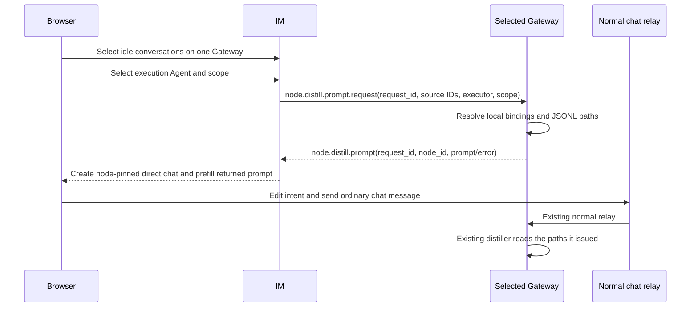

# bugfix-518: Gateway-owned distill prompt — 技术方案

> 对齐: [incident.md](incident.md) v1

## Changelog

| Version | Change |
|---|---|
| v5 | 按用户确认收口为最小修复：同 Gateway 选择后，IM 向该 Gateway 请求当前格式的 distill prompt；不再由 IM 扫描 JSONL。此前 metadata、内部 prompt 注入和新 delivery lifecycle 设计全部撤回。 |
| v5.1 | 记录用户确认的 visible-path policy；把 prompt 生成与 execution direct conversation 的同节点路由绑定为一个 IM operation；保留既有 skill readiness，并补全 control RPC/result 与测试处置。 |
| v5.2 | 使 conversation pin 在服务端优先于 legacy message `target_node_id` hint，并把受影响 HTTP/control 测试归属写入 tasks。 |
| v5.3 | 保留既有 external shadow conversation 的 binding fallback：browser 仍只提交 source ID，IM 仅在已有 external identity 时将其随 control request 交给 Gateway。 |
| v5.4 | 补齐 reviewer 的隔离 IM/Gateway/Vite 双节点验收 runbook；不改变产品或协议决策。 |

## 问题与边界

当前 Web IM 为得到 `source_jsonl_path`，在 IM 机器上根据 Agent workspace root 扫描
`.nanoassistant/sessions/*.jsonl`。这只有 IM 与 Gateway 恰好同机时才工作；跨机部署时，路径和文件只属于
来源 Gateway 本机。

本修复只移动**路径获取**的 owner：IM 继续做用户权限、同 Gateway 选择、execution Agent 选择和聊天导航；
Gateway 继续执行现有 builtin skill。返回的 prompt 与当前格式相同，仍含 `/skill:conversation-skill-distiller`、
`source_jsonl_paths`、`execution_agent_id`、`target_scope` 和用户可编辑的意图。没有新的**普通 relay**消息类型、
relay metadata、内核 input injection、skill 行为或 recovery subsystem；仅新增一次 request/result Gateway control RPC。

一次操作仅能选同一 Gateway 的来源和 execution Agent。当前格式 prompt 中的 paths 可以展示和经普通 relay
传递；这是为保持既有 builtin skill 契约而由用户确认的取舍。它们只能由该 Gateway 生成，IM 不读取、扫描、
解析、改写或以其选择来源。IM 把这次 execution conversation 固定路由到生成 prompt 的 node，保证 path 最终仍
会由它的 issuing Gateway 读取；同节点约束不意味着 IM 能读取该 Gateway 的文件。

## 最小数据流



## 具体决策

### D1：IM 只投影 node identity，不扫描本机 JSONL

`Conversation` 增加/投影 source Agent 所属的 `source_node_id`；移除 `source_jsonl_path` 及 repository 的
workspace/session scanner。sidebar 的 eligibility 仍是“有 source Agent 且 idle”，选择第一个来源后，其他
node 禁选；execution Agent picker 只显示该 node 的 Agent。

### D2：IM 先校验和 readiness preflight，再请求一个 Gateway-produced prompt

Web IM 保留当前 execution Agent 的 distiller/`skill_view` capability preflight：缺任一时保持 dialog、说明原因，
不请求 prompt、不创建聊天。通过后，在创建 execution direct conversation 前调用 owner-scoped
`POST /im/v1/conversations/distill-prompt`。IM 验证 source conversations/Agents 属于当前用户、均 idle、所有
source 与 execution Agent 的 `node_id` 相同，并用这个计算出的 node 发送控制帧
`node.distill.prompt.request`。browser 不传 node、workspace 或 path。

browser 请求和其对 Gateway 的普通 source identity 始终为：`sources[{conversation_id, source_agent_id}]`、
`execution_agent_id`、`target_scope(agent|global)`。IM 生成 `request_id`；若 source 是已有 external shadow
conversation，则仅把 IM 已持有的 `external_source`/`external_chat_id` 附到对应 control source，供 Gateway 在正常
`web_relay` binding 不存在时沿用既有 external binding fallback。browser 不传这些字段。Gateway 以自己的 durable
session binding 找到这些 source 在本机的 JSONL path，并在本机复核 distiller/`skill_view` readiness。它返回
`node.distill.prompt{request_id,node_id,prompt}` 或
`node.distill.prompt{request_id,node_id,error_code,message}`；IM 只接受 request_id 和 authenticated node_id 都匹配的
结果。连接中断、timeout、malformed 或错误 node result 都是当前 dialog 的可理解 prompt error，不创建聊天。
这是一次短生命周期 control waiter，不持久 operation、不重试恢复。

### D3：prompt 是现有普通聊天协议，不再发明第二条执行链

RPC 成功后，**同一 IM application operation** 创建 execution Agent direct conversation，将已计算 node 写为这个
conversation 的 opaque `target_node_id`，并把返回的 `prompt` 原样作为 draft seed。对任何带这个 non-empty pin 的
direct conversation，message route 必须先取 pin，再看 legacy request `target_node_id`；caller supplied hint 被忽略，
不能把该聊天改送另一 node。未 pinned 的 existing conversation 保持当前 hint/profile routing。普通 direct-message
relay 因而优先该 conversation target，而非之后 Agent profile 的当前 node；后续 agent registration/rebind 不能把
issuing Gateway 的 paths 送到另一 node。browser 不见也不能指定有效的 `target_node_id`。用户可在末尾编辑意图；发送
后仍走现有 `createMessage` 和 normal relay，没有 special metadata 或第二条执行链。builtin
`conversation-skill-distiller` 保持现有“解析普通消息 fields、读取自身本机 paths”的行为。

### D4：失败发生在开始聊天前

用户不可选 running 或跨 node 来源；前端或 Gateway readiness 不满足、Gateway 无法为合法选择生成 prompt 时，IM
显示原因，不建空 direct conversation、不写 skill，也不产生 normal relay task。prompt 返回成功后，聊天执行及错误
反馈完全复用当前普通消息和 builtin skill 行为。

## 接口责任

| 层 | 新增/调整 | 不做 |
|---|---|---|
| Browser | 用 `source_node_id` 限制选择；保留 readiness preflight；调用 IM prompt endpoint；预填并展示返回 prompt。 | 不扫描路径、不决定 target node。 |
| IM | owner/node/idle 校验；把 IDs 转成一次 correlated Gateway control request；成功时创建 node-pinned direct conversation 并返回 prompt。 | 不读/扫描/解析 JSONL，不生成/修改 path。 |
| Gateway | 用本机 binding 解析 JSONL paths，复核 readiness，按当前 prompt 模板返回。 | 不读取 transcript、不执行模型、不新建消息或 session。 |
| Existing ordinary chat | pinned direct conversation 以 server pin（优先于 legacy client hint）正常 relay；builtin skill 原样解析并读取 paths。 | 不增加 metadata 或 special relay。 |

## 前端影响

视觉结构保持原样：sidebar selection、execution Agent/scope dialog、创建 direct chat、composer 的 slash-skill
draft、普通 tool output/result 均不重做。唯一用户可见改变是不同 Gateway 的会话不能混选；skill/tool 或 prompt
无法从该 Gateway 取得时，在创建对话前给出错误。返回的 draft 继续展示当前格式的 paths 和 skill 命令。

原型: [prototype.html](prototype.html)。它只表达“同 Gateway 选择 → dialog → 当前格式 draft”的原有旅程；路径
在 composer 中按当前行为可见。

## 契约层增量 (delta-spec)

- im: [specs/im/web-chat-ux.md](specs/im/web-chat-ux.md)
- gateway: [specs/gateway/relay-protocol.md](specs/gateway/relay-protocol.md)
- kernel / cli: no delta

## 测试与验收

| 风险 | 最低保护 |
|---|---|
| IM 继续碰 Gateway filesystem | 原 conversation API 不再给 `source_jsonl_path`；repository scanner tests 删除/改写为 `source_node_id` projection。 |
| source/executor 跨 Gateway | existing sidebar/frontend journey：第一个 source 锁定 node，跨 node 不能选择。 |
| Gateway 返回错误 path、source 或 capability 不可用 | 一个 Gateway prompt-resolver unit：durable binding→local path + readiness→current-format prompt；任一 failure 不返回 prompt。 |
| IM 到 Gateway 控制往返 / rebind / client hint | 一个 existing control/API seam：owner/node/idle validation → correlated request/result → node-pinned conversation/prompt；stale execution node 或 caller-supplied B hint 都不把 prompt 发往另一 node。 |
| 原聊天旅程退化 | existing frontend journey：returned prompt（含 skill 和 paths）被原样 prefill，随后普通 message send。 |

两个隔离 Gateway 的 browser acceptance 只证明 IM 无法读取其 workspace、但同节点请求仍可取得 prompt 并完成既有
distill；跨 node 被禁止。它是一次性 `progress.md` 证据，不扩为常驻 E2E suite。

## Runbook for Reviewer

本 unit 同时改动 IM、Gateway control 和 Web IM。验收前必须在 reviewer 自己的 worktree 无脑停-起，不能复用
任何已有 IM、Gateway 或 Vite 进程。

| 服务 | 停止命令 | 启动与新鲜度检查 | 健康检查 |
|---|---|---|---|
| 隔离 IM + 首个 Gateway | `./scripts/e2e-down.sh --wt "$WT_ROOT"` | `PATH="$NANO_MAIN_ROOT/.venv/bin:$PATH" ./scripts/e2e-up.sh --wt "$WT_ROOT"` | `source .e2e-ports.env && curl -fsS "$IM_URL/openapi.json" >/dev/null`；确认 `.im.pid`、`.gateway.pid` 存活 |
| Web IM Vite | 停止本轮自己的 Vite PID / tmux session | 在 `$WT_ROOT/src/IM/frontend` 以现有依赖运行 `npm run build`，再按下方命令起 Vite | 浏览器经该 Vite 地址登录隔离测试用户 |
| 第二个验收 Gateway | 停止本轮自己的第二 Gateway PID / tmux session | 按下方命令在独立 runtime directory 派生 config、启动 | IM agent 列表出现 `e2e-second`，其 node 与首 Gateway 不同 |

启动前设 `WT_ROOT="$(git rev-parse --show-toplevel)"`，并将 `NANO_MAIN_ROOT` 设为含受控 `.venv` 和已安装前端
依赖的主 checkout。reviewer 不运行包安装；若自己的前端 `node_modules` 缺失，只链接
`$NANO_MAIN_ROOT/src/IM/frontend/node_modules`。构建和 Vite 必须在前端目录执行：

```bash
cd "$WT_ROOT/src/IM/frontend"
npm run build
rg -l 'distill-prompt' dist/assets/
source "$WT_ROOT/.e2e-ports.env"
VITE_PORT="$("$WT_ROOT/scripts/free-ports.sh" 1)"
VITE_IM_PROXY_TARGET="$IM_URL" npm run dev -- --host 127.0.0.1 --port "$VITE_PORT" --strictPort
```

第二 Gateway 只用于本次跨节点 UI 验收。以下派生物必须留在 `$WT_ROOT`、不可提交；以 tmux 启动后，查询 IM
确认它已注册，再为它建立一条 direct source conversation：

```bash
source "$WT_ROOT/.e2e-ports.env"
NODE2_DIR="$WT_ROOT/.review-node2"
NODE2_WORKSPACE="$WT_ROOT/.review-node2-workspace"
NODE2_ID="${NODE_ID}-review-node2"
mkdir -p "$NODE2_DIR" "$NODE2_WORKSPACE/e2e-second"
cp "$WT_ROOT/.gateway-config.yaml" "$NODE2_DIR/gateway.yaml"
NODE2_ID="$NODE2_ID" NODE2_WORKSPACE="$NODE2_WORKSPACE" yq -i '
  .node.node_id = strenv(NODE2_ID) |
  .node.workspace_base = strenv(NODE2_WORKSPACE) |
  .agents = [.agents[0] | .agent_id = "e2e-second" | .title = "E2E second" |
    .workspace_root = (strenv(NODE2_WORKSPACE) + "/e2e-second")] |
  .channels = [{"name": "web_relay"}]' "$NODE2_DIR/gateway.yaml"
tmux new-session -d -s bugfix518-review-node2 -c "$WT_ROOT" \
  "PYTHONPATH=$WT_ROOT/src $NANO_MAIN_ROOT/.venv/bin/python -m personal_assistant.main \
  --config $NODE2_DIR/gateway.yaml --im-service-url $IM_URL --foreground --auto-bind \
  > $NODE2_DIR/gateway.log 2>&1"
NODE2_TOKEN="$(yq -r '.im_service.token' "$NODE2_DIR/gateway.yaml")"
curl -fsS -H "Authorization: Bearer $NODE2_TOKEN" "$IM_URL/im/v1/agents?limit=50" \
  | jq -e --arg node "$NODE2_ID" '.[] | select(.agent_id == "e2e-second" and .node_id == $node)' >/dev/null
```

浏览器使用 `.gateway-config.yaml` 的隔离 `im_service.username/password`（默认 `nano` / `nano1234`）。以 ordinary
direct message 建立首个 Gateway source，使其产生本机 durable binding 和 JSONL；选择该 source 后，第二 Gateway
source 必须显示为 `Different Gateway` 且不可选。随后选择同 Gateway execution Agent 和 scope，确认新单聊预填
Gateway 返回的当前格式 prompt，并发送为普通消息。记录用户可见结果和 control/browser 仅提交 identity 的证据。

结束时停止 Vite、第二 Gateway 与 `e2e-down.sh --wt "$WT_ROOT"` 启动的栈；确认本轮端口、PID、credentials、config
和 manifest 均未残留或暂存。标准 E2E 数据仅可作为本地排障材料，不能提交。

### 受影响测试处置

| 现有测试 | 处置 | 理由 |
|---|---|---|
| `tests/im_service/integration/test_users_conversations_api.py` | rewrite-merge | 用 source Agent/node projection 替代公开 path scanner 断言。 |
| `tests/im_service/unit/test_repositories_user_conversation.py` | rewrite-merge / delete nested scanner case | 保留 conversation owner/run-state 行为；删除仅保护 IM recursive scan 的 path/nested scan 断言。 |
| `src/IM/frontend/src/features/chat/chat-workspace.integration.test.tsx` | rewrite-merge | 保留完整 current-format prompt prefill/ordinary send 和 readiness；改为 mock Gateway prompt result。 |
| `src/IM/frontend/src/features/chat/components/conversation-sidebar.test.tsx` | rewrite-merge | path eligibility 改为 source-node same-Gateway selection。 |
| existing Gateway control request/result tests | rewrite-merge | 增加一组 correlated distill-prompt request/result、wrong-node/timeout outcome；不另建 transport matrix。 |

## Milestone

| ID | 范围 | 退出标准 |
|---|---|---|
| bugfix-518-M1 | source-node projection、Gateway prompt control RPC、Web IM same-node selection/prefill、现有 prompt tests 改写与双 Gateway 验收 | 同 Gateway 选择后能在跨机 IM/Gateway 拓扑完成现有 distill prompt→普通消息旅程；IM 无 JSONL scan；跨 Gateway、运行中、离线或不可解析 source 在创建聊天前明确失败；相关 focused Python/Vitest、frontend build、ruff、diff/docs check 与双 Gateway browser evidence 通过。 |
