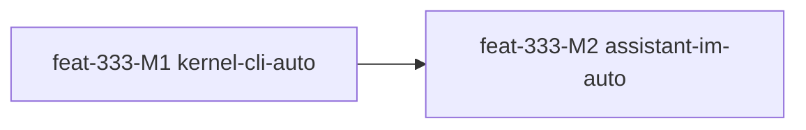

# feat-333: Auto 模式默认体验 — 技术方案

> 对齐: spec.md v1
> Unit branch: `unit/feat-333` (will be created by orchestrator)

## Changelog

## 现状分析

### 涉及范围

- `src/agent/core/tools/registry.py` — 当前工具执行统一入口。每个 tool call 先触发 `tool_call` intercept hook，再执行工具，再触发 `tool_result` intercept hook。这里是 auto 权限门禁的唯一稳定插入点。
- `src/agent/core/hooks/{registry,runner,context}.py` — hook 已支持 intercept、优先级、timeout、`ctx.call_model()`、`ctx.publish_session_event()` 和 registry extension state。新权限门禁可以作为 built-in hook 装入，不需要让 core 依赖 platform。
- `src/agent/platform/hooks/builtins/bash_risk_gate.py` — 现有“bash 未列入 allow_prefixes 时让 LLM 判 safe/unsafe”的局部能力。它只覆盖 bash，只能 allow/block，没有用户可响应 ask，也不读 `.nanocode/config.yaml` / `.nanoassistant/config.yaml`。
- `src/agent/platform/tools/safety.py` — 当前 shell 安全策略是 `.nano/policy.toml` + prefix allowlist + deny fragments。没有 `dangerously-skip-permissions`，也没有 `allow/deny/ask` 三态权限结果。
- `src/agent/platform/config/resolver.py` 与 `src/agent/products/*/defaults.py` — 已有产品级目录声明：Coding CLI 为 `~/.nanocode` + `<workspace>/.nanocode`，Personal Assistant 为 `~/.nanoassistant` + `<workspace>/.nanoassistant`。但 resolver 目前只返回 tools/hooks/skills/session db 路径，不读取 `config.yaml`。
- `src/agent/platform/http_api/routes/session.py` 和 `src/agent/core/runs/registry.py` — 已有 session SSE 和 run 状态。适合承载 `permission_request` / `permission_resolved` 事件，以及 `POST /v1/permissions/{request_id}` 回答端点。
- `src/coding_cli/{commands.py,client.py}` — CLI 只通过 HTTP/SSE 访问 kernel。managed 模式 kernel 是子进程，不能让 kernel hook 直接读 CLI stdin；CLI 必须从 SSE 收到 `permission_request` 后在终端提示，再 POST 回 kernel。
- `src/personal_assistant/gateway/inbound_pipeline.py`、`src/personal_assistant/main.py`、`src/personal_assistant/ws/im_connection.py` — Gateway 已消费 kernel SSE，并把 `run_status` / `assistant_message` / `tool_start` / `tool_end` 转发给 IM。权限请求应复用这条 observer seam，新增 `permission_request` 转发和 permission response 回写。
- `src/IM/ws/gateway_handler.py`、`src/IM/application/event_bridge.py`、`src/IM/frontend/src/features/chat/v2/*` — IM 已有 Gateway WS、ConversationEvent、浏览器 user WS、chat reducer/action UI 基础。需要新增“权限请求事件 + 用户响应 API/WS + 前端动作条”。

### 既有约束

- 四个顶层包之间禁止 Python import。`coding_cli`、`personal_assistant` 只能通过 HTTP 调 agent；IM 不直接调用 agent，只和 Gateway/浏览器交互。
- `core` 不能依赖 `platform` / `products`，也不能直接做文件 IO。权限分类器的核心类型可以在 core，配置读取、LLM 分类、HTTP 等实现放 platform。
- 产品配置目录必须沿用 ProductProfile：local_coding 使用 `.nanocode`，personal_assistant 使用 `.nanoassistant`，workspace 覆盖 global。
- tool 真实执行已经在 `StreamingToolExecutor` 后台 task 中发生；ask 会暂停该 tool task，但 run 仍占用当前 session 的 active run，必须支持超时、取消和响应后的继续。
- hook timeout 当前会隔离错误并继续 dispatch。权限 ask 不能使用默认 1.5s timeout；auto gate hook 必须显式设置足够长的 timeout，且在 run cancel/session shutdown 时能释放 pending future。
- 用户可见 ask 不能绕过 SSE/HTTP 边界。CLI/PA/IM 都要通过事件与响应端点闭环，不能在 kernel 进程里直接做产品 UI。

### 可复用能力

- 复用 `tool_call` intercept 作为权限入口；拒绝为 `{"block": true, "reason": ...}`，允许为继续执行。
- 复用 `HookContext.call_model()` 做 auto 分类器 LLM 调用；分类器不可用时 fail closed 到 ask 或可见拒绝。
- 复用 `ctx.publish_session_event()` / session SSE 推送 `permission_request`，CLI 和 Gateway 都已经有 session stream 消费能力。
- 复用 `ConfigResolver` 的目录优先级，但需要新增 config.yaml 读取 API，不能继续硬编码 `.nano/policy.toml`。
- 复用 IM 的 `conversation_events` 和 browser WS；权限请求是新的 event type，不需要新长连接。
- 不复用 `bash_risk_gate` 作为默认门禁。它的语义太窄，且会在 auto gate 允许 bash 后再次 LLM review，导致重复判定。保留文件兼容用户手动启用，但产品默认改为 `auto_permission_gate`。

### 相关历史

- `feat-335-streaming-tool-executor` 已把工具执行改为流式并发队列；权限 gate 必须兼容 safe tool 并发和 non-safe FIFO 阻塞。
- `feat-338-kernel-message-sse` 已提供 session-scoped SSE、`run_status.origin`、Gateway/CLI 观察链路；权限事件应走同一条 session stream。
- `feat-337-cc-background-subagents` 让 bash/agent 后台任务可长时间运行；权限 gate 必须在后台任务启动前判断，而不是启动后再问。
- `feat-340-agent-native-im` 已把 kernel streaming 事件桥到 IM chat；本 unit 可沿用 `node.streaming_delta` 思路，但权限请求需要可响应，不只是展示。

## 架构总览

### Before

```text
LLM tool_call
  -> ToolRegistry.execute()
     -> bash_risk_gate? (bash only: allow/block, LLM safe/unsafe)
     -> tool.run()
     -> tool_result

CLI/Gateway 只看到 tool_start/tool_end/run_status；没有权限请求事件。
配置目录存在，但 config.yaml 不参与权限策略。
```

### After

```text
                              ┌──────────────────────────────┐
                              │ product config.yaml           │
                              │ global < workspace            │
                              │ auto_mode + danger bypass     │
                              └──────────────┬───────────────┘
                                             │
LLM tool_call                                ▼
  -> ToolRegistry.execute() ───────► auto_permission_gate
                                      │
                                      ├─ bypass enabled -> allow
                                      ├─ hard deny / classifier deny -> block(reason)
                                      ├─ classifier allow -> continue
                                      └─ classifier ask
                                           │ publish permission_request SSE
                                           ▼
                          ┌─────────────────────────────────────┐
                          │ PermissionService waits on request_id│
                          └───────────────┬─────────────────────┘
                                          │ POST decision
          ┌───────────────────────────────┴───────────────────────────────┐
          ▼                                                               ▼
   Coding CLI prompt                                             Gateway -> IM
   terminal options                                              browser action UI
   POST /v1/permissions/{id}                                     POST back through Gateway
```

核心思路：权限判断属于 kernel 的 tool-call boundary；权限交互属于产品客户端。kernel 只发布“需要用户决定”的结构化事件并等待回答，不直接渲染 CLI/IM UI。

## 关键决策

### 决策 1: 默认且唯一的受控模式是 auto

- **选择**: 内部权限模式只有 `auto` 和 `dangerously_skip_permissions=true` 的危险旁路。无配置时 `auto` 开启，危险旁路关闭。
- **理由**: spec 明确“只有两个模式：默认 auto 开启，dangerously-skip-permissions 默认关闭”。这也避免把 default/plan/dontAsk 做成可见产品模式。
- **拒绝**: 做用户可切换 permission mode 枚举。会扩大范围并和“暂时不提供其他模式”冲突。
- **风险**: 老的 `.nano/policy.toml` 用户预期会变化；设计中保留读取作为 bash hard policy 的兼容输入，但不作为产品模式。

### 决策 2: Auto gate 用 built-in hook 实现，替换默认 bash_risk_gate

- **选择**: 新增 `src/agent/platform/hooks/builtins/auto_permission_gate.py`，注册 `tool_call` intercept，优先级早于 realtime/presentation。两个产品的 `DEFAULT_HOOK_MODULES` 都启用 `auto_permission_gate`，不再默认启用 `bash_risk_gate`。
- **理由**: 现有工具执行入口已经把拦截语义集中在 hook；hook 可以 call_model、publish_session_event，也能通过 registry extension state 拿到 PermissionService。
- **拒绝**: 把权限判断写进每个工具。会重复实现，也漏掉用户工具。把权限逻辑写进 `StreamingToolExecutor` 会让 core 依赖 platform 策略。
- **风险**: hook timeout 必须大幅高于用户响应时间；实现时需单独处理 run cancel，避免 pending request 永久挂起。

### 决策 3: ask 通过 session SSE + HTTP response 闭环

- **选择**: kernel 新增 `PermissionService` 维护 pending request；auto gate ask 时发布 `permission_request` SSE 并 await future。客户端用 `POST /v1/permissions/{request_id}` 回答。
- **理由**: CLI/PA 都已经消费 session SSE。HTTP response endpoint 保持产品边界，远程 CLI 和 IM 都能走同一协议。
- **拒绝**: kernel 直接读 stdin 或直接发 IM。前者 managed 子进程不可行，后者破坏 agent 与 IM 边界。
- **风险**: 非交互式 CLI 命令或无人在线 IM 无法响应。处理策略是 permission request 超时后可见拒绝，错误返回给 agent。

### 决策 4: 分类器结果是 allow / deny / ask，soft_deny 配置进入 deny 倾向

- **选择**: 分类器 prompt 接收工具名、参数摘要、cwd、产品 id、`auto_mode.allow`、`auto_mode.soft_deny`、`auto_mode.environment`、内置默认规则，输出严格 JSON：`{"decision":"allow|deny|ask","reason":"...","rule_id":"..."}`。
- **理由**: spec 用户可理解结果就是 allow/deny/ask；Claude Code 风格的 `soft_deny` 是配置给分类器的自然语言规则，不应成为第四种用户可见结果。
- **拒绝**: 继续用 bash safe/unsafe 二分。无法覆盖 edit/write/agent/send_message，也无法 ask。
- **风险**: LLM 分类器不稳定。必须有 deterministic hard deny（例如危险 shell fragments、越权路径）和 fail-closed fallback。

### 决策 5: 配置读取按“session workspace + product profile”解析

- **选择**: platform 新增产品运行配置读取器，读取 `<workspace>/<product_dir>/config.yaml` 覆盖 `~/<product_dir>/config.yaml`。配置 key 支持 `dangerously_skip_permissions`，兼容读取 `dangerously-skip-permissions` 别名。
- **理由**: HTTP app 可能管理多个 session workspace，不能只在进程启动 repo_root 读取一次 workspace 配置。tool hook 的 `ctx.metadata["cwd"]` 是当前 session workspace。
- **拒绝**: 只读启动目录配置。Personal Assistant 多 agent workspace 会串配置。
- **风险**: 每个 tool_call 都读 YAML 会增加 IO；实现应按 `(product_id, workspace_root, file_mtime)` 做轻量缓存。

### 决策 6: “记住同类规则”写回 workspace config.yaml 的自然语言规则

- **选择**: ask response 支持 `scope=once|session|workspace`。`session` 写入内存规则；`workspace` 把一条生成的自然语言规则追加到 workspace `config.yaml` 的 `auto_mode.allow` 或 `auto_mode.soft_deny`。
- **理由**: spec 要求自然语言规则作为分类器上下文，也要求“记住同类规则”。写回同一配置面最一致。
- **拒绝**: 新增单独 permission DB。会制造第三套规则来源，和“为了简化代码和其他东西一致”冲突。
- **风险**: 自动生成规则可能过宽。实现时 workspace 记忆默认用保守模板，展示给用户的选项文案必须说明将记住的范围。

### 决策 7: 危险旁路只绕过权限门禁，不绕过底层工具基本约束

- **选择**: `dangerously_skip_permissions=true` 时 auto gate 直接 allow，不发 ask，不跑分类器；但 file sandbox、参数 schema、tool 自身错误处理仍保留。
- **理由**: spec 对该模式的语义是“不进行权限管控”，不是禁用所有运行时安全边界。保留 schema/path normalization 可防止工具实现崩坏。
- **拒绝**: 让工具完全无 sandbox。会要求重写 ToolSafety，风险远大于本需求。
- **风险**: 名称会让用户以为连 path sandbox 也关闭；CLI/IM 必须明确显示“权限管控已关闭，基础工具约束仍存在”。

### 决策 8: IM 权限请求作为 ConversationEvent，而不是普通聊天消息

- **选择**: IM 新增 permission request event type，并在前端当前会话渲染 action bar；用户点击后由 IM 发送 `node.permission_response` 给 Gateway，再由 Gateway POST 回 kernel。
- **理由**: 权限请求是操作控件，不是 agent 自然语言回复；做成 ConversationEvent 能断线恢复、按 owner 隔离、复用 user WS。
- **拒绝**: 让用户回复“allow/deny”文本。歧义大，也会污染 agent 对话上下文。
- **风险**: 若浏览器不在线，Gateway 仍会等待到超时；IM 里要展示过期态，避免用户事后点击产生误导。

## 接口与数据流

### 配置 schema

```yaml
# <workspace>/.nanocode/config.yaml or ~/.nanocode/config.yaml
# <workspace>/.nanoassistant/config.yaml or ~/.nanoassistant/config.yaml
dangerously_skip_permissions: false

auto_mode:
  allow:
    - "Allow read-only inspection commands such as ls, rg, sed, git status, git diff."
  soft_deny:
    - "Deny destructive filesystem operations outside the current workspace."
  environment:
    - "This workspace is a local development checkout."
```

兼容别名：读取时接受 `dangerously-skip-permissions`，保存时统一写 `dangerously_skip_permissions`。

### Kernel 内部类型

```python
class PermissionDecision(StrEnum):
    ALLOW = "allow"
    DENY = "deny"
    ASK = "ask"

class PermissionResponseAction(StrEnum):
    ALLOW = "allow"
    DENY = "deny"

class PermissionScope(StrEnum):
    ONCE = "once"
    SESSION = "session"
    WORKSPACE = "workspace"
```

`PermissionRequest` 关键字段：

| 字段 | 说明 |
|---|---|
| `request_id` | 全局唯一，HTTP response 使用 |
| `session_id` / `run_id` / `turn_id` / `tool_call_id` | 关联当前 run/tool |
| `tool_name` / `arguments_preview` | 展示和分类器输入，不泄露超长参数 |
| `decision_reason` | 分类器为什么 ask |
| `options` | 本次允许、拒绝、session 级允许、记住同类规则等 |
| `expires_at` | 超时后 kernel 自动拒绝 |
| `dangerously_skip_permissions` | 当前是否旁路，正常 ask 中为 false |

### HTTP API

| 方法 | 路径 | 请求 | 响应 | 说明 |
|---|---|---|---|---|
| GET | `/v1/permissions/{request_id}` | — | `PermissionRequestResponse` | 便于客户端重连后补查 |
| POST | `/v1/permissions/{request_id}` | `{action, scope, remember_rule?}` | `{request_id,status}` | 回答 pending ask |
| GET | `/v1/sessions/{session_id}/permissions` | — | `{items:[...]}` | 列出 session pending requests |

权限事件通过现有 `/v1/sessions/{session_id}/stream`：

```json
{
  "event": "permission_request",
  "run_id": "run_...",
  "request_id": "perm_...",
  "tool_name": "bash",
  "arguments_preview": {"command": "pytest -xvs tests/unit/..."},
  "decision_reason": "Command writes no files but is outside built-in allow rule.",
  "options": [
    {"id": "allow_once", "action": "allow", "scope": "once", "label": "Allow this time"},
    {"id": "deny_once", "action": "deny", "scope": "once", "label": "Deny"},
    {"id": "allow_session", "action": "allow", "scope": "session", "label": "Allow in this session"},
    {"id": "remember_allow", "action": "allow", "scope": "workspace", "label": "Remember similar"}
  ],
  "expires_at": "..."
}
```

Resolution event:

```json
{
  "event": "permission_resolved",
  "run_id": "run_...",
  "request_id": "perm_...",
  "status": "allowed|denied|expired",
  "scope": "once|session|workspace"
}
```

### CLI flow

```text
ServerClient.stream_session()
  -> event_pipeline sees permission_request for target run
  -> render terminal prompt with tool-specific options
  -> read one key / line from REPL input
  -> ServerClient.respond_permission(request_id, action, scope)
  -> continue streaming tool_start/tool_end/run_status
```

Non-interactive `send-message` / `--text` can either prompt if stdin is TTY, or print a clear error after timeout. It must not silently allow.

### Personal Assistant / IM flow

```text
kernel SSE permission_request
  -> InboundPipeline._kernel_event_observer(event)
  -> IMConnectionManager.send_json("node.permission_request", payload)
  -> IM GatewayHandler persists permission ConversationEvent + browser WS fan-out
  -> Frontend renders action bar in current conversation
  -> user clicks option
  -> POST /im/v1/permissions/{request_id}/responses
  -> GatewayHandler sends "node.permission_response" to owning Gateway node
  -> Gateway posts POST /v1/permissions/{request_id}
  -> kernel unblocks tool gate
```

IM request payload must include owner/conversation/run/tool metadata so the browser can recover after reconnect. Response must validate owner_id and request status before forwarding.

### Tool-specific options

- `read` / `web_fetch` / `web_search`: allow once, deny, allow session, remember allow.
- `write` / `edit`: allow once, deny, allow session for same path pattern, remember allow for similar workspace file edits.
- `bash`: allow once, deny, allow session for normalized command prefix, remember allow. Destructive hard-deny fragments should not offer allow.
- `agent` / background tasks: allow once, deny, allow session for subagent launch class.
- `send_message`: allow once, deny, allow session for same target; remember should be conservative because it can contact other people/agents.

## 风险与回退

- **Run 卡在 pending permission**: request 有 `expires_at`，run cancel/session interrupt 会 resolve 为 denied/expired，并释放 future。
- **分类器不可用或输出不可解析**: 不允许 fail open。交互客户端在线时进入 ask；没有 responder 或超时则可见拒绝。
- **重复门禁**: 默认 hook 列表移除 `bash_risk_gate`，避免 auto gate allow 后再被 legacy gate LLM review。
- **配置写回过宽**: workspace 记忆只生成保守自然语言规则；如果无法生成安全规则，降级为 session scope。
- **IM/Gateway 断线**: kernel 等待超时后拒绝；IM 侧过期请求显示 disabled，不允许补交。
- **危险旁路误开**: CLI 启动和 IM agent runtime 状态都要显式显示；回滚为删除 config key 或设为 false。
- **回滚方案**: 从产品默认 hooks 中移除 `auto_permission_gate`，恢复 `bash_risk_gate`；删除/忽略新增 config keys 后系统回到当前 prefix policy 行为。新增 HTTP/IM 端点可保留为无 pending 数据的空接口。

## Runbook for Reviewer

本 unit 涉及 3 个常驻服务。reviewer 做 IM 旅程前应重启；只验 CLI 旅程时重启 Agent Kernel 即可。

| 服务 | 停止命令 | 启动命令 | 健康检查 |
|---|---|---|---|
| Agent Kernel (Coding CLI profile) | `pkill -f "uvicorn coding_cli.kernel_app:app" || true` | `PYTHONPATH=src python -m uvicorn coding_cli.kernel_app:app --host 127.0.0.1 --port 8000` | `curl -s http://127.0.0.1:8000/v1/health` |
| IM Service | `pkill -f "uvicorn IM.app:app" || true` | `PYTHONPATH=src python -m uvicorn IM.app:app --host 0.0.0.0 --port 8011` | `curl -s http://127.0.0.1:8011/im/v1/health || curl -s http://127.0.0.1:8011/` |
| Personal Assistant Gateway | `PYTHONPATH=src python -m personal_assistant.main stop` | `PYTHONPATH=src python -m personal_assistant.main --im-service-url http://127.0.0.1:8011` | `curl -s http://127.0.0.1:8000/v1/health` plus IM Nodes page shows node online |

前端如有改动，启动 IM 前在 `src/IM/frontend` 执行 `npm run build`，避免 IM 静态服务拿到旧 bundle。

## Milestones

| ID | 标题 | 依赖 | 并行组 | 范围 | 退出标准 |
|---|---|---|---|---|---|
| feat-333-M1 | kernel-cli-auto | — | A | `src/agent/core/hooks/*`, `src/agent/core/tools/registry.py`, `src/agent/platform/{config,permissions,hooks,http_api}/`, `src/agent/products/*/{hooks,profile,defaults}.py`, `src/coding_cli/{client,commands,events,input,render}/`, `tests/{unit,integration,contract}/` | 无配置启动 Coding CLI 时默认 auto；`allow` 静默执行、`deny` 作为 tool error 反馈给 agent、`ask` 在终端可选择允许/拒绝；`dangerously_skip_permissions` 配置可关闭权限门禁并在 CLI 可见；global/workspace config 覆盖规则通过测试 |
| feat-333-M2 | assistant-im-auto | feat-333-M1 | B | `src/personal_assistant/{client,gateway,main,ws,config}/`, `src/IM/{api,application,domain,infra,ws}/`, `src/IM/frontend/src/features/chat/`, `src/IM/frontend/src/i18n/`, `tests/{unit,integration,im_service}/` | Personal Assistant / IM 默认 auto；kernel `permission_request` 能在 IM 会话中显示可响应动作；用户允许/拒绝后 Gateway 回写 kernel 并继续/拒绝工具；危险旁路状态在 IM 可见；断线/超时请求不会静默放行 |



拆分理由：本 unit 跨 kernel、CLI、Gateway、IM、前端，预计超过 10 个文件且两个产品交互面不同。M1 先交付完整 CLI 可观测闭环和共享 kernel 协议；M2 在稳定协议上交付 Personal Assistant / IM 闭环，避免两个 UI 同时改动互相阻塞。

## 待确认问题

- `dangerously-skip-permissions` 的配置落盘 key 是否统一采用 Python/YAML 友好的 `dangerously_skip_permissions`，并兼容读取 hyphen 版本。本文推荐这样做。
- “记住同类规则”写回 workspace config 时，是否允许自动追加自然语言规则。本文推荐允许，但规则必须保守且用户可见。
- 非交互式 CLI 遇到 ask 时是否应立即失败，还是等待固定超时。本文推荐 TTY 可 prompt；非 TTY 直接可见拒绝。
- IM 权限请求是否必须出现在 chat timeline 中，还是可以放全局 notification center。本文推荐 timeline 内 action event，后续可再加全局入口。

## 自检

- spec 的 11 条验收标准均由 M1/M2 覆盖：M1 覆盖默认 auto、danger bypass、三态决策、CLI ask、配置读取、fail closed；M2 覆盖 PA/IM ask、危险状态展示、IM 响应路径。
- 设计没有引入 default / plan / dontAsk / acceptEdits 等非目标模式。
- `core` 只承载类型/接口，不读取配置、不调用 IM/CLI；平台和产品边界符合 AGENTS.md。
- 每个接口都有调用方：SSE 给 CLI/Gateway，HTTP permission response 给 CLI/Gateway，IM permission response 给浏览器/Gateway。
- 风险段均有对应退路或降级路径。
