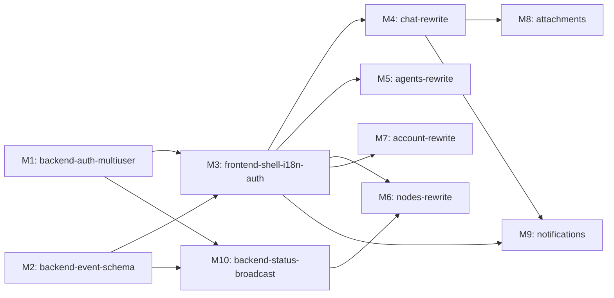

# feat-340: Agent-native IM 前端按新原型重写 — 技术方案

> 对齐: spec.md v1

> Unit branch: `unit/feat-340-agent-native-im` (will be created by orchestrator)

## Changelog

<!-- 按时间倒序追加。格式:YYYY-MM-DD (Mx): 一句话 — 详见 Mx/progress.md -->

- 2026-05-12 (M18 立项,post-acceptance fix round 9 — final): R9 final 验:M17 6 issues 中 5 个修通 + 视觉对照全 ≥ 近(/me 从偏→近),但暴露 2 blocking 同根:(R9-1) 新建 agent 后端不自动建 IM users 表行 → user_id=null → 无法发起私聊;(R9-2) Open chat ↗ 已 4 轮静默退化,根因 = `/im/v1/users` 404 + mutation onError 吞错。两者同根(IM users 表缺 agent 行 + 前端容错差)。M18 闭合:agent 注册同步建 user 行 + 删除 listUsersRaw 调用链 + onError 显 toast + 用户消息乐观渲染(R9-3 minor)。同步更新 docs/IM-SPEC.md。修后 R10 验,pass 即提 PR。
- 2026-05-12 (M17 立项,post-acceptance fix round 8 — cap-override): R8 (fresh dist + 真服务实例 + 原型对照首次进入验收范围) 证实 M16 真修 R7-1/R7-3,但暴露 1 blocking + 3 major + 2 minor 残留:(R8-1) relay 镜像消息被前端误渲染成重复气泡、(R8-2) WS 推送时 agent 气泡标签显 UUID 而非 display_name、(R7-5) Chat 头部缺原型要求的 Node chip + ⚙、(R8-4) Mobile /me 与原型偏差大、(R7-4) Open chat 404、(R8-3) Token Chip 显示错字段。原型对照首次进入 acceptance 流程(R7+R8),证明 spec L16/22/28 要求的"像素级对齐"前 7 轮全漏验。M17 收口所有残留 + 原型缺口。
- 2026-05-12 (Runbook 补"前端重建"段 + 前置检查 #4): R7 cap 触发后诊断:M16 worker 改了 `src/IM/frontend/src/features/chat/v2/chat-stream.ts:21`(?token=),但 `dist/assets/*.js` 仍是旧的(`user_id=`),IM 服务静态 serve 旧 bundle,R7 reviewer 浏览器持续 WS 403,误以为是 R6-1 回归。根因 = Runbook 漏 `npm run build` 步骤。补:§Runbook 加"前端重建"段(必跑 `npm run build`)+ 前置检查 #4(dist/index.html mtime 应晚于 git pull),让今后任何前端改动都不会再因 stale bundle 让 reviewer 拿错证据。该改动同样应反向输入到 change-design-author skill(任何 unit 涉及前端构建产物时 Runbook 必含 build step)。
- 2026-05-12 (M16 立项,post-acceptance fix round 6): R6 reviewer 用新 skill 独立验证 M15,3 个 blocking 全部重现 + 新发现 R6-1(前端 WS 仍用 `?user_id=` 被 403):(R6-1)前端剩余 WS 入口未切到 `?token=`,UI 完全无实时事件;(R6-2 = R5-1 重现)无 `message.created` 帧、无 agent 占位 bubble;(R6-3 = R5-2 重现)`message.completed` content 把 user+agent 文本拼接、刷新后用户气泡污染。同 issue 指纹 R5-1/R5-2 = 第 2 轮(未达 5 轮 cap),unit 第 6 轮(R7 = 7 轮 cap 末轮)。详见 M16-fix-streaming/progress.md。
- 2026-05-12 (Runbook for Reviewer 补齐): 新版 change-design-author skill 要求 design.md 必填 §Runbook for Reviewer(列本 unit 涉及的所有常驻服务 + 停止/启动/健康检查命令),让 reviewer 进旅程前无脑重启服务以避免 stale-binary 让证据失真。补 3 个常驻服务:Agent Kernel(:8000)、IM(:8011)、PA Gateway;明示 LLM_PROXY 外部不动。背景见 R5 案例。
- 2026-05-12 (M15 立项,post-acceptance fix round 5): R5 验收发现 message.created 不触发 + message_id 指向用户消息而非 agent 占位（R5-1/R5-2）。修法：_build_relay_lifecycle_callback accepted 阶段通过 IM REST 预创建 agent 占位消息，将 agent message_id 存入 run_context_store；observer turn_start 分支改为 pass。详见 M15-fix-r5/progress.md。
- 2026-05-11 (M14 立项,post-acceptance fix round 4): e2e 实跑(真 LLM moonshot:kimi-k2.5 + 起 IM/Gateway/Kernel)发现 R1-R3 reviewer 均未真验 streaming 链:`src/IM/application/event_bridge.py` 整类是 dead code(无任何实例化/调用);`src/personal_assistant/main.py` 构造 `InboundPipeline` 时从不传 `kernel_event_observer`,该 hook 永远 None;`src/IM/ws/gateway_handler.py._persist_report_event()` 仅产 `relay.processing/report`,从不产 `message.created/delta/completed` 与 `tool_call.upserted/completed`;`node.report` 不带 `token_usage`,Token Chip 无源数据。M14 闭合 streaming 链。详见 acceptance-e2e.md。
- 2026-05-11 (M13 立项,post-acceptance fix round 3): reviewer R3 发现新 major bug R3-1: `src/IM/api/routes/web_im.py:136` create_conversation 路由 `del user` 丢失 caller owner_id;`src/IM/infra/repositories.py:377` 在 multi-owner participants 时随机生成 UUID 作为 conversation owner_id,导致 list_conversations_for_owner 查不到。修法:create_conversation 路由把 caller_owner_id 显式传入 repository。
- 2026-05-11 (M12 立项,post-acceptance fix round 2): reviewer round 2 verdict pass-with-issues,2 个 in-unit fix-implementation(R2-1 major: zh.json shell.tabs.agents 漏抽;R2-2 minor: app.py 还有 ?user_id= legacy WS fallback,R1 注释承诺 unit lands 前删)。打包小 fix milestone。
- 2026-05-11 (M11 立项,post-acceptance fix round 1): reviewer round 1 输出 8 个 in-unit fix-implementation issues(4 blocking + 3 major + 1 minor),打包为单个 fix milestone M11。覆盖 chat CSS 缺失、im-chat-api 不带 Bearer、WS token query 名错配、SPA fallback 404、i18n 漏抽、tsc 失败、Settings 多余 Policies 链接。
- 2026-05-11 (M10 立项): 补 M10 backend-status-broadcast,闭合 §5 映射表"heartbeat scheduler"未归属的 producer 与 §接口 2a 中 `node.status_changed` / `agent.status_changed` 的 owner-scoped 推送路径;M6 依赖追加 M10、M5 退出标准追加 agent status WS 实时反映。原因:M2 完成后 M6 worker 启动时发现 producer 与无 conversation_id 的 owner-scoped 旁路 dispatcher 都没归任何既有 milestone,需补一个。

## 架构总览

### 现状(before)

```
┌──────────────────────────────────────────────────────────────────────────┐
│  Browser                                                                  │
│  ┌──────────────────────────────────────────────────────────────────┐   │
│  │  IM Frontend (React + Zustand + React Query + React Router v7)    │   │
│  │  - 当前为浅色 Workspace 布局, 5 页骨架已搭                          │   │
│  │  - hardcoded owner-1001 / username=you 作为单用户                  │   │
│  │  - 无 i18n, 无 auth, 无通知, 无富 tool_call/token chip 视图        │   │
│  │  - mock-*-api.ts + im-*-api.ts 双层(测试可解耦)                   │   │
│  └────────────────┬─────────────────────────────────────────────────┘   │
└───────────────────┼────────────────────────────────────────────────────────┘
                    │ HTTP /im/v1/*   +   WS /im/ws/user?user_id=…
                    ▼
┌──────────────────────────────────────────────────────────────────────────┐
│  IM Service (FastAPI, SQLite at data/im.db)                              │
│  - /im/v1/{messages,agents,nodes,conversations,users,me,uploads,...}      │
│  - WS /im/ws/user (浏览器实时事件) + /im/ws/gateway (Gateway 中继)        │
│  - ConversationEvent 表 + /im/v1/sync 断点续传                           │
│  - 数据模型 multi-tenant ready (User/Agent/Conv/Msg/Node 都有 owner_id)  │
│  - 没有 auth (bearer token = no-op)                                      │
│  - Message.attachments 字段已有, tool_calls 结构待定                     │
│  - UsageMetric 表已有, token_usage 中继路径不完整                        │
└───────────────────┬───────────────────────────────────────────────────────┘
                    │ WS /im/ws/gateway (relay + heartbeat)
                    ▼
┌──────────────────────────────────────────────────────────────────────────┐
│  Personal Assistant Gateway (process)                                     │
│  - Channel registry + heartbeat scheduler                                 │
│  - Inbound pipeline: WS event → kernel dispatch → relay deliver           │
└───────────────────┬───────────────────────────────────────────────────────┘
                    │ HTTP /v1/{runs,events,sessions,tools,hook}
                    ▼
┌──────────────────────────────────────────────────────────────────────────┐
│  Agent Kernel (FastAPI HTTP API)                                          │
│  - RuntimeEvent: INPUT / TURN_START / MESSAGE_UPDATE / TOOL_CALL /        │
│                  TOOL_RESULT / RUN_ERROR / RUN_TIMEOUT / RUN_ABORT        │
│  - TokenUsage 在 MESSAGE_UPDATE / TOOL_RESULT payload 里                  │
│  - tool_calls 实时事件已支持, 但 IM 中继 schema 未对齐                    │
└──────────────────────────────────────────────────────────────────────────┘
```

### 目标(after)

```
┌──────────────────────────────────────────────────────────────────────────┐
│  Browser                                                                  │
│  ┌──────────────────────────────────────────────────────────────────┐   │
│  │  IM Frontend (重写)                                                │   │
│  │  - 暗色顶栏 + 浅色主体, IBM Plex Sans/Mono, oklch 调色板          │   │
│  │  - 桌面: 顶栏 + Chat/Agents 两侧栏 + 内容; 移动: 底栏 + Me 聚合页 │   │
│  │  - Auth: 登录/注册/登出, JWT/Cookie session, currentUser 替换硬码 │   │
│  │  - i18n: react-i18next, EN/中, localStorage + me.locale 持久化     │   │
│  │  - 富 Chat: 4 类会话渲染 + Tool Calls 面板 + Token Chip + Mention  │   │
│  │  - 附件 chip / Notification API / 移动响应式                        │   │
│  │  - Service Worker (后台通知) + lazy bundle                          │   │
│  └────────────────┬─────────────────────────────────────────────────┘   │
└───────────────────┼────────────────────────────────────────────────────────┘
                    │ HTTP /im/v1/* (含 Authorization: Bearer)
                    │ WS /im/ws/user (token in protocol or query)
                    ▼
┌──────────────────────────────────────────────────────────────────────────┐
│  IM Service (扩展)                                                        │
│  - /im/v1/auth/{login,register,logout,refresh,me}  ← 新                  │
│  - /im/v1/{messages,...} 全部走 currentUser owner_id (从 token 提取)     │
│  - Message schema 扩展: tool_calls[] + token_usage 字段(可空)            │
│  - WS event_type 扩展: message.delta(text) / tool_call.update /          │
│    tool_call.result / token_usage.update / heartbeat.node_status         │
│  - bearer auth 真启用 (require_bearer_auth → JWT 校验)                    │
│  - Gateway/IM 中继路径桥接 Agent Kernel 的 RuntimeEvent → IM event       │
└───────────────────┬───────────────────────────────────────────────────────┘
                    │
                    ▼  (Gateway / Kernel 保持不变;仅事件桥接层补齐)
```

变更核心:**前端 5 页全部重写视觉 + 接通真实数据**;**IM 后端扩 auth + 事件 schema + Message 富字段**;**Gateway/Kernel 保持不变,事件桥接层补齐 token_usage / tool_call 实时中继**。

## 关键决策

### 决策 1: Auth 用 JWT + Refresh Token

- **选择**: JWT(access 15min + refresh 7d 轮换),Authorization: Bearer 头,WS 用 `Sec-WebSocket-Protocol: bearer.<token>` 或 query。密码 bcrypt 哈希,users 表加 `password_hash` 字段。前端 access_token 存 localStorage。
- **理由**: 无状态、WS 鉴权友好、前端可解析 user_id、本地/局域网工具不需外部 IdP。
- **拒绝**: Session cookie+CSRF(SPA/WS 翻车多)、OAuth(过度)、API key(无过期)。
- **风险**: localStorage XSS——项目无第三方脚本,access 短 TTL 缓解;紧急封号靠 `user.is_active` 每次 refresh 校验。
- **新端点**: `POST /im/v1/auth/{register,login,refresh,logout}`、`GET /im/v1/auth/me`。
- **现有改造**: `require_bearer_auth()` 启用真 JWT 校验;所有 `/im/v1/*` 路由从 token 提取 `owner_id`,移除 `?user_id=` query param 强绑。

### 决策 2: i18n 用 react-i18next + JSON 文案

- **选择**: `react-i18next` + `src/IM/frontend/src/i18n/{en,zh}.json` 平铺 key + localStorage `im_lang` + 后端 `users.locale` 字段。UserMenu/Me 页 LangToggle 切换并 PATCH `/im/v1/me`。
- **理由**: 社区最广 + React 19 兼容 + 按需加载、JSON 文案 grep 友好、低改造成本(无新构建插件)。
- **拒绝**: lingui(需 babel/swc 插件,本项目用 esbuild)、自研 t()(无插值/复数)、react-intl(重于需求)。
- **风险**: 翻译漏抽,ESLint 规则兜底;后端系统消息保持 EN,不强制 i18n。
- **决策原则**: 选项里**代码复杂度最低 + 易于演进 + 运行稳定** 优先(用户明示,后续所有决策沿用)。

### 决策 3: WS 实时事件 schema 扩展(增量 delta + sync 兜底)

- **选择**: 新增 WS 事件类型 `message.created` / `message.delta` / `message.completed` / `tool_call.upserted` / `tool_call.completed` / `node.status_changed` / `agent.status_changed`,带 `seq` 顺序号。增量 delta 传"新增 token",前端按 seq 拼接;断线/gap → 触发 `/im/v1/sync` 兜底。
- **理由**: 延迟低 + 带宽省 + 原型逐字效果天然实现;sync 兜底机制 IM 已有,复用零成本;事件类型扩展是 enum 加项,演进容易。
- **拒绝**: 全文重发(移动端带宽爆,1k token 推 1000 次全文);SSE 改造(WS 已通,无收益);kernel 直出 IM 格式(破坏 kernel 产品无关性)。
- **风险**: delta 丢/乱 → seq + sync 兜底;WS 重连 → 现有 `/im/v1/sync` 断点续传无改动。

### 决策 4: Tool Calls / Token Usage 内嵌 Message JSON 列

- **选择**: `messages` 表加两列 `tool_calls TEXT NULL`(JSON 数组 `[{id,name,status,duration_ms,input,output}]`) + `token_usage TEXT NULL`(JSON `{output,context_used,context_window}`)。不单独建表。
- **理由**: tool_call 与消息强从属、不跨消息查询、生命周期一致;最少改 + 最简查询 + SQLite JSON1 演进路径开放;UsageMetric 表已负责跨消息统计,不抢职责。
- **拒绝**: 独立 `tool_calls` 表(多表 join、N+1、本期无跨消息查询需求);独立 TokenUsage 表(同上)。
- **风险**: 本期只读不查 JSON 列,无性能问题;真要按 tool_call 维度统计,JSON1 函数足够或将来 backfill 拆表。

### 决策 5: 中继桥接层放 IM 服务内

- **选择**: Gateway 把 kernel `RuntimeEvent` 原样投递到 IM,IM 内新增 `event_bridge` 模块翻译为 ConversationEvent + 写 `messages.tool_calls` / `messages.token_usage` + 广播 WS 事件。kernel 不动,Gateway 仅扩展投递的事件种类(已转 message,补转 tool_call/token_usage)。
- **理由**: IM 是"对浏览器的服务",事件 schema 归它定义;kernel 保持产品无关(coding_cli 也用);改动局部、单一责任。
- **拒绝**: kernel 直出 IM 格式(破坏复用);Gateway 内翻译(Gateway 已含多种职责,继续加重越界)。
- **风险**: 桥接层是新模块,需单元测试覆盖映射(MESSAGE_UPDATE→delta、TOOL_CALL→tool_call.upserted、TokenUsage→token_usage 字段)。

### 决策 6: 设计 token 重写 + 沿用 Tailwind v4 utility

- **选择**: 不引入新样式库。改 `styles/global.css` 的 CSS 变量(IBM Plex Sans/Mono + oklch 调色板)+ Tailwind v4 `@theme` 暴露 token + 删除旧 `im-card` / `im-title` 等编码暖米色视觉的辅助类。组件 class 串随视觉重写一并更新。Radix primitives 保留。
- **理由**: 当前代码已经 100% Tailwind utility(527 className vs 1 inline style),无切换成本;token 集中改一处便于演进;Radix 是 unstyled 壳,样式语义切换无影响。
- **拒绝**: 沿用原型 inline style(主题切换难、snapshot 噪音大);CSS Modules / CSS-in-JS(双轨,违反复杂度低)。
- **风险**: 旧 class 的 snapshot test 会大批失效——重写为行为 test;`im-card` 引用面要 grep 评估删除影响。

### 决策 7: 桌面通知仅前台 Notification API

- **选择**: `Notification.requestPermission()` + 仅在 `document.hidden` / `visibilityState !== "visible"` 时触发。点击 → `window.focus()` + 路由跳会话。Account/Me 页 toggle 开关 + localStorage 持久化。
- **理由**: 无需 Service Worker / VAPID / 后端 push 服务,覆盖 spec 场景 D 够用。
- **拒绝**: Service Worker + Web Push(后端 VAPID + 订阅持久化复杂,本期不值)。
- **演进路径**: 将来要"浏览器关闭也通知" → 加 SW + push,可独立增量,不破坏本期。

### 决策 8: 附件复用 `/im/v1/uploads` + 白名单 + 大小限制

- **选择**: 沿用 `POST /im/v1/uploads`(multipart),返回 `{attachment_id, url, mime, size}`。MIME 白名单(`image/*` / `application/pdf` / `text/plain` / `text/markdown` / `application/json`);单文件 ≤ 10 MB;单消息 ≤ 5 个附件。前端 chip:图片缩略图 / 文档 icon + 文件名 + 叉号删除。
- **理由**: 复用已有端点;白名单 + 大小限制是默认安全姿势。
- **风险**: 存储增长——超范围,运维定期清理。

### 决策 9: Mention picker 候选 = 当前会话内的 agents + 模糊匹配

- **选择**: 数据源 = 当前会话的 agent 参与者列表 `[{agent_id, display_name, avatar_initials, status}]`。`@` 触发,前缀/子串模糊匹配排序;↑↓/Enter/Esc 按 spec。
- **理由**: spec Q8 已锁:用户严格隔离,群聊参与者只能是"当前用户 + 自有 agents",所以候选不含其他 user,只列 agent;数据形态比"User|Agent 混合"更简单。
- **拒绝**: 全局拉所有 agents(破坏会话语义);含 User 候选(隔离原则下当前用户 @ 自己无意义)。
- **风险**: 大量 agent 虚拟列表——本期推后。

### 决策 10: 开发态无后向兼容,DB 直接重建

- **选择**: 开发期不写迁移脚本;模型变更直接 drop & recreate(`data/im.db` 重新建)。Bootstrap 脚本 `python -m IM.cli init_admin --username … --password …` 创建首个用户。前端 hardcoded `owner-1001` 整段删除,`resolveCurrentUserId()` 删除。测试 fixture 用 mock JWT。
- **理由**: 用户明示当前处于开发态、不背兼容包袱——简化最大化。生产化前再补迁移脚本(不在本 unit)。
- **拒绝**: 渐进迁移脚本(本期负担无价值);auth dev bypass(留隐患)。
- **风险**: 现有本地 db 重启会丢——开发态可接受;用户 README 提示。

### 决策 11: 状态事件(node/agent)的 owner-scoped 广播路径

- **选择**: 在 `src/IM/ws/user_stream.py` 的 `UserStreamRegistry` 上新增便利函数 `broadcast_to_user(user_id, frame)`(直接复用既有 `user_id → set[WebSocket]` 索引,不引入新索引);在 `src/IM/ws/gateway_handler.py` 的 `_handle_register` / `_handle_heartbeat` / 节点断连路径上,接 PA 上行帧之后做 node 状态 diff(`record_heartbeat` 返回的 before/after status 或显式比较),变化时 build `node.status_changed` 帧并 `broadcast_to_user(owner_id, frame)`(owner_id 从 `nodes` 行查出);agent.status_changed 同路径——agent_profiles 的 status 字段在 `_handle_register` 写入 agent_count 之后做 agent 维度 diff(若实施期发现 agent.status 没有显式字段,M10 worker 在 progress.md 记决策:把 `agent_profiles.status` 用 `last_heartbeat_at_node_status` 派生,或与 node.status 一致折叠)。offline 判定阈值:连续 `heartbeat_interval × 4 ≈ 60s` 未收到 → offline 边界事件(M10 worker 在 progress.md 钉死实际数值)。
- **理由**: `UserStreamRegistry` 已经是 user-keyed(M1 装好),不需要新机制;diff 放 receive 端最自然,不需要单独 scheduler;复用已有 `broadcast_to_users` 路径(同一个出口 → 一致的死连接清理与 fan-out 语义)。
- **拒绝**: (a) 单独 scheduler 周期轮询所有 nodes 推 status——多一个常驻协程、状态权威源容易撕裂(scheduler vs receive 两个写点)。(b) 引入内部 event bus / pub-sub 抽象——本 unit 唯二订阅方(node.status / agent.status)+ 一处生产端,抽象无价值。(c) 把 producer 塞进 M2 event_bridge——bridge 是 kernel → IM 翻译,PA heartbeat 不是 kernel 事件,语义不一致。
- **风险**: (1) heartbeat 失踪 → offline 判定依赖 timeout 任务,M10 必须实现 timeout 触发器(asyncio task 每 10s 扫一次 `nodes` 表,过期则 emit offline + broadcast);(2) 同一 owner 多连接(多 tab)→ 现有 `broadcast_to_users` 已 fan-out 处理;(3) seq 号给 node/agent 事件 — design §4 说"per conversation 或全局",node/agent 无 conversation,M10 用 owner-scoped 单调递增(从 `nodes.last_heartbeat_at` 派生或简单 monotonic 计数,worker 决定)。

## 接口与数据流

### 1. 新增 HTTP 端点(IM 服务)

| 方法 | 路径 | 请求体 | 响应 | 说明 |
|---|---|---|---|---|
| POST | `/im/v1/auth/register` | `{username, password, display_name?, locale?}` | `{access_token, refresh_token, user}` | 注册并自动登录 |
| POST | `/im/v1/auth/login` | `{username, password}` | `{access_token, refresh_token, user}` | 登录 |
| POST | `/im/v1/auth/refresh` | `{refresh_token}` | `{access_token, refresh_token}` | refresh 轮换 |
| POST | `/im/v1/auth/logout` | `{refresh_token}` | `{ok: true}` | 加 jti 黑名单 |
| GET  | `/im/v1/auth/me` | — | `{user_id, username, display_name, locale, ...}` | 从 Bearer 解析 |

### 2. 现有端点改造

- 全部 `/im/v1/*` 路由从 `?user_id=` query 切到 `Authorization: Bearer <token>` 头提取 `owner_id`
- `require_bearer_auth()` 实装 JWT 校验(HS256,密钥从 env `IM_JWT_SECRET`)
- `PATCH /im/v1/me`:locale 字段可改
- **删除 `GET /im/v1/users`**:严格用户隔离下,列出全部 user 与隔离原则冲突;前端无"用户列表"页,删除即可。如未来需 admin 视图,新立 unit 加 `/im/v1/admin/users`。

### 2a. 租户隔离硬约束

- **所有 repository 查询必须按 owner_id 过滤**——封装到 `OwnerScopedRepository` 基类(在 `src/IM/infra/repository.py`):构造时绑定 `owner_id`,后续 list/get/update/delete 自动加 `WHERE owner_id = ?`。
- API 路由从 token 解出 owner_id → 注入 repository → 路由层无需也无法跳过过滤。
- **WS 广播按 token 解出的 owner_id 过滤,非己之事件不投递**(`message.*` / `tool_call.*` / `node.status_changed` / `agent.status_changed` 全部):IM 内事件分发器维护 `owner_id → ws_connections[]` 索引,事件投递时按事件资源的 owner_id 选择目标连接,绝不广播给全体。
- 单元测试加跨租户隔离断言:用户 A 不能用 token A 读到任何 owner_id=B 的资源(返回 404,非 403,避免泄漏存在性)。

### 3. 现有数据模型扩展

```python
# src/IM/domain/models.py
class User:
    ...
    password_hash: str | None   # 新增,bcrypt
    locale: str = "en"          # 新增

class Message:
    ...
    tool_calls: list[ToolCall] | None  # 新增,持久化为 JSON 列
    token_usage: TokenUsage | None     # 新增,持久化为 JSON 列

class ToolCall:                # 新类型(嵌入,非独立表)
    id: str
    name: str
    status: Literal["running", "completed", "failed"]
    duration_ms: int | None
    input: dict
    output: str | None

class TokenUsage:              # 新类型(嵌入)
    output: int
    context_used: int
    context_window: int
```

### 4. WS 事件 schema(新增 IM → Browser)

```ts
type WsEvent =
  | { type: "message.created"; seq: number; conversation_id: string; message: Message }
  | { type: "message.delta"; seq: number; message_id: string; delta_text: string }
  | { type: "message.completed"; seq: number; message_id: string; content: string; token_usage?: TokenUsage }
  | { type: "tool_call.upserted"; seq: number; message_id: string; tool_call: ToolCall }
  | { type: "tool_call.completed"; seq: number; message_id: string; tool_call_id: string; output: string; duration_ms: number; status: "completed" | "failed" }
  | { type: "node.status_changed"; seq: number; node_id: string; status: "online" | "offline"; last_heartbeat_at: string; last_error?: string }
  | { type: "agent.status_changed"; seq: number; agent_id: string; status: "online" | "offline" };
```

所有事件带 `seq` 递增序号(per conversation 或全局,具体由 worker 实现时定);前端检测 gap → 调 `GET /im/v1/sync?after_seq=…` 兜底。

### 5. Kernel → IM 桥接层

- 位置:`src/IM/application/event_bridge.py`(新模块)
- 输入:Gateway 投递的 `RuntimeEvent`(MESSAGE_UPDATE / TOOL_CALL / TOOL_RESULT / TURN_START / TURN_END / TokenUsage payload)
- 输出:
  - 写 `messages.content`(增量累积)、`messages.tool_calls` JSON、`messages.token_usage` JSON
  - 投递 ConversationEvent → 触发 WS 广播

映射表:

| Kernel 事件 | IM 持久化 | WS 广播 |
|---|---|---|
| `TURN_START` (agent message) | 新 message row(content="", status=running) | `message.created` |
| `MESSAGE_UPDATE`(增量 token,无 token_usage) | append `messages.content` | `message.delta` |
| `MESSAGE_UPDATE`(完成,含 TokenUsage) | 写 `messages.token_usage` + status=completed | `message.completed` |
| `TOOL_CALL`(running) | 插入到 `messages.tool_calls` JSON 数组 | `tool_call.upserted` |
| `TOOL_RESULT` | 更新 `messages.tool_calls` 对应项 status/output/duration_ms | `tool_call.completed` |

PA gateway 上行帧 → IM 状态广播(M10 落地,见决策 11):

| PA 上行 / IM 内部触发 | IM 持久化 | WS 广播(owner-scoped,经 `broadcast_to_user(owner_id, frame)`)|
|---|---|---|
| `node.register`(首次或重连) | `nodes` 行 upsert + status=online | `node.status_changed: online` |
| `node.heartbeat`(状态变化:status 字段或 last_error 翻转) | `node_status` 表更新 | `node.status_changed`(仅状态翻转时,稳态不广播) |
| `node.heartbeat`(`agent_count` 变化或 agent 维度 diff) | `agent_profiles.status` 更新 | `agent.status_changed`(diff) |
| offline 守护任务(asyncio,扫 `nodes.last_heartbeat_at` 过期 60s) | `nodes.status=offline` | `node.status_changed: offline` |
| WS 连接断开(`gateway_handler` finally 块) | `nodes.status=offline`(立即,不等 timeout) | `node.status_changed: offline` |

### 6. 前端数据流(浏览器内)

```
┌──────────────────────────────────────────────────────────────┐
│  AppProviders (React Query Client + Zustand store + i18n)     │
└──────────────────────────────────────────────────────────────┘
                       │
        ┌──────────────┼──────────────┐
        ▼              ▼              ▼
   REST 查询      WS 订阅       UI 触发(发送/上传)
        │              │              │
        ▼              ▼              ▼
  React Query      WS reducer    Mutation
  cache(事实源)   ───patch───▶  /im/v1/messages POST
                                /im/v1/uploads POST
                                /im/v1/agents PATCH
        │              │              │
        └──────────────┴──────────────┘
                       │
                       ▼
              组件订阅 cache 渲染
```

- **事实源**:React Query cache。WS 事件不直接渲染,先 patch cache,组件订阅 cache 自然更新。
- **状态分层**:Zustand store 只放纯 UI state(选中会话 ID、附件草稿、mention picker open、search 输入串等);**所有服务器数据走 React Query**。
- **i18n**:`react-i18next` 顶层 Provider;`useTranslation()` 在叶子组件用。
- **Auth context**:Zustand store 一片 `authSlice = { accessToken, refreshToken, user }`,fetch wrapper 自动注入 header,401 → 触发 refresh → 失败跳 /login。

### 7. 模块归属

| 模块 | 路径 | 职责 |
|---|---|---|
| Auth | `src/IM/application/auth_service.py` + `api/routes/auth.py` | JWT 签发/校验/refresh |
| Tenant isolation | `src/IM/infra/repository.py` (OwnerScopedRepository) + `src/IM/api/ws/dispatcher.py` (owner-scoped 广播) | 强制 owner_id 过滤,杜绝跨租户泄漏 |
| Event Bridge | `src/IM/application/event_bridge.py` | Kernel → IM 翻译 |
| Message extensions | `src/IM/domain/models.py` + `infra/db.py` | ToolCall / TokenUsage 嵌入 |
| WS event schema | `src/IM/api/ws/event_types.py`(新)+ 现有 ws/gateway | 类型 + 序列化 |
| Frontend auth | `src/IM/frontend/src/features/auth/` | 登录/注册/refresh hook |
| Frontend i18n | `src/IM/frontend/src/i18n/` | en.json / zh.json + i18next 配置 |
| Frontend shell | `src/IM/frontend/src/app/shell/` | 顶栏 / 底栏 / UserMenu / Me 页 |
| Frontend chat 重写 | `src/IM/frontend/src/features/chat/` | 4 类会话 + 富交互 |
| Frontend agents/nodes/account 重写 | 各自 features 子目录 | 字段表单 + dirty + 真存盘 |
| Notifications | `src/IM/frontend/src/features/notifications/` | Notification API 封装 + toggle |
| Attachments | `src/IM/frontend/src/features/chat/attachments/` | 上传 hook + chip 组件 |
| Design tokens | `src/IM/frontend/src/styles/global.css` | IBM Plex + oklch + Tailwind @theme |

依赖方向:`api → application → domain ← infra`(沿用 CLAUDE.md 既有规则,不引入反向)。

## Milestones

桌面 + 移动响应式 + 5 页全栈 + 多用户 auth + i18n + 附件 + 通知 + 后端事件 schema 扩展——估算超 2000 行改动、跨 30+ 文件、单 worker 远超 4 小时。**必须拆分**(触发条件 #2:工作量),且模块间多组真不交集(触发条件 #1:可真并行)。

| ID | 标题 | 依赖 | 并行组 | 范围 | 退出标准 |
|---|---|---|---|---|---|
| feat-340-M1 | backend-auth-multiuser | — | A | `src/IM/api/routes/auth.py`(新)、`src/IM/application/auth_service.py`(新)、`src/IM/domain/models.py`(User+password_hash/locale)、`src/IM/infra/db.py`(users 表)、`src/IM/cli/init_admin.py`(新)、`require_bearer_auth` 实装、全部 `/im/v1/*` 路由切换到 token 提 owner_id、删除 `GET /im/v1/users`、`src/IM/infra/repository.py`(OwnerScopedRepository 基类)、WS 广播 owner_id 过滤(`src/IM/api/ws/dispatcher.py`)、跨租户隔离单元测试 | `curl -X POST /im/v1/auth/register` → 拿 token → `curl -H "Authorization: Bearer <t>" /im/v1/me` 返回正确身份;`?user_id=` query 彻底移除;用户 A 无法用 token A 读到 owner_id=B 的资源(返回 404);WS 用户 A 连接收不到 owner_id=B 的事件 |
| feat-340-M2 | backend-event-schema | — | A | `src/IM/domain/models.py`(Message.tool_calls/token_usage)、`src/IM/infra/db.py`(messages 表 2 列)、`src/IM/application/event_bridge.py`(新)、`src/IM/api/ws/event_types.py`(新)、`src/personal_assistant/gateway/inbound_pipeline.py`(转发 TOOL_CALL/TOOL_RESULT/TokenUsage) | 跑端到端测试:用户发消息 → kernel mock 出 MESSAGE_UPDATE 增量 + TOOL_CALL + TokenUsage → 浏览器 WS 收到 `message.delta` / `tool_call.upserted` / `message.completed`,DB messages 行写入 tool_calls/token_usage JSON |
| feat-340-M3 | frontend-shell-i18n-auth | M1, M2 | B | `src/IM/frontend/src/styles/global.css`(token 重写)、`src/IM/frontend/src/i18n/{en,zh}.json` + i18next 配置、`src/IM/frontend/src/features/auth/`(登录/注册/refresh)、`src/IM/frontend/src/app/{shell, router, providers}.tsx`(暗顶栏 + 移动底栏 + UserMenu + 路由)、`src/IM/frontend/src/features/me/me-page.tsx`(新)、移除 hardcoded `owner-1001` / `resolveCurrentUserId` | 启动应用,看到登录页(EN/中 可切);登录后看到暗顶栏 + Chat/Agents/UserMenu;移动断点切到底栏 + Me 聚合;路由 `/login` `/register` `/me` 工作;无 hardcoded user;旧测试更新或重写 |
| feat-340-M4 | frontend-chat-rewrite | M3 | C | `src/IM/frontend/src/features/chat/`(全部子文件:chat-overview / chat-detail / message-pane / conversation-list / 各组件)+ 4 类会话渲染 + Tool Calls 面板 + Token Chip + @mention picker + 新建群聊模态 + 分类标签 + 搜索 + 会话头部 chip/badge/⚙ + 流式 WS reducer | 端到端:可看到原型 4 种会话样式;发消息触发流式渲染(消息逐字 + tool_call running 动画 + 完成 token chip);群聊 @ 触发 picker 200ms 内出现;新建群聊真创建;桌面 + 移动两端像素级对齐原型 |
| feat-340-M5 | frontend-agents-rewrite | M3 | C | `src/IM/frontend/src/features/settings/agents/`(全部:list / detail / create + Identity/Behavior/Access&Model/Workspace&Runtime 四卡 + dirty/Save/Discard + Open chat) | Agents 列表/详情/新建桌面+移动像素级对齐;字段全部真存盘;dirty 检测正确;Open chat 跳直聊;status pill 由 `agent.status_changed` WS 实时反映(M10 完成后端,M5 消费即可) |
| feat-340-M6 | frontend-nodes-rewrite | M3, M10 | C | `src/IM/frontend/src/features/settings/nodes/` + 列表 + relay/reporting toggle + 节点视角列 agents/新建 agent + heartbeat 实时驱动 status | Nodes 页像素级对齐;toggle 真存盘;status 由 `node.status_changed` WS 实时反映 |
| feat-340-M7 | frontend-account-rewrite | M3 | C | `src/IM/frontend/src/features/settings/account/` + Account 页字段表单 + locale 切换 + 通知开关 | Account 页像素级对齐;display_name/default_entry_node/locale/通知开关全部真存盘 |
| feat-340-M8 | feature-attachments | M4 | D | `src/IM/frontend/src/features/chat/attachments/`(上传 hook + chip 组件 + drag&drop)、`src/IM/api/routes/uploads.py`(白名单 + size 校验加固)、Message.attachments 渲染 | 桌面拖入图片/PDF → chip 出现 → 发送 → agent 气泡显示附件 + tool 能读到附件路径;白名单/大小限制起效 |
| feat-340-M9 | feature-notifications | M3, M4 | D | `src/IM/frontend/src/features/notifications/`(Notification API 封装 + Account/Me toggle + permission flow + visibility 判断 + 点击聚焦) | 标签未激活时 agent 完成回复 → 系统通知弹出;点击 → 窗口聚焦 + 跳到对应会话;toggle 关闭后不再弹 |
| feat-340-M10 | backend-status-broadcast | M1, M2 | A | `src/IM/ws/user_stream.py` 新增 `broadcast_to_user(user_id, frame)` + node/agent 事件 builder(在 `src/IM/api/ws/event_types.py` 补 `build_node_status_changed` / `build_agent_status_changed`)、`src/IM/ws/gateway_handler.py` `_handle_register` / `_handle_heartbeat` / WS disconnect finally 块插入状态 diff + emit、新增 asyncio offline 守护任务(每 10s 扫 `nodes.last_heartbeat_at` 过期 60s)、跨租户隔离单测(owner A 不收 owner B 节点事件)+ 端到端集成测试(PA gateway 起 → IM 收 register → 浏览器 owner WS 收 online;PA 断 → 收 offline) | PA gateway 起一个 node 发 register/heartbeat → 浏览器 owner WS 收到 `node.status_changed: online`;PA 断开或心跳超时 → 收到 `node.status_changed: offline`;agent 维度 status 翻转 → 收到 `agent.status_changed`;owner A WS 收不到 owner B 的事件;单测覆盖 diff 不变不广播、跨租户隔离 |
| feat-340-M14 | fix-r4 (post-acceptance fix, round 4 — streaming wiring) | M13 | H | (1) `src/personal_assistant/main.py` 构造 `InboundPipeline` 时实例化 `kernel_event_observer` 回调,把 kernel SSE `TURN_START / MESSAGE_UPDATE(增量) / TOOL_CALL / TOOL_RESULT / token_usage` 翻译成 gateway → IM 的 WS 中继帧(新增 `node.streaming_delta` / `node.tool_call_event` 子类型,或扩 `node.report` payload — 由 worker 选最小改动)。(2) `src/IM/ws/gateway_handler.py` 增加 streaming 帧的 IM 端 fanout:实例化并调用 `src/IM/application/event_bridge.EventBridge` 的 `on_turn_start / on_message_delta / on_message_completed / on_tool_call_upserted / on_tool_call_completed`,经 `UserStreamRegistry.broadcast_to_user` 推 `message.created / message.delta / message.completed / tool_call.upserted / tool_call.completed`。(3) `node.report` payload 内补 `token_usage: {prompt, completion, total}`(沿用 kernel 已聚合值),`message.completed` 与 `relay.report` 双侧都带。(4) 跨租户隔离:streaming 帧只走当前 conversation 的 caller owner WS,不广播。(5) 前端 token chip / streaming text 已在 M4 设计,接受新事件即可点亮 — worker 验证 chip 显示真实数字、bubble 字符级递增。 | 启动 IM + Gateway + Kernel(moonshot:kimi-k2.5)→ web 发"What is 2+2?"→ WS 捕获 `message.created → message.delta(多帧)→ message.completed`(token 序列与文字逐字一致)+ `relay.report` 含 `token_usage.total > 0`;UI 看到 bubble 逐字出现 + Token Chip 显示数字 + 含 tool_call 的轮次有 tool_call.upserted/completed;owner A WS 收不到 owner B 会话的 streaming 帧;现有 relay.* 链路不破坏 |
| feat-340-M13 | fix-r3 (post-acceptance fix, round 3) | M12 | G | `src/IM/api/routes/web_im.py` create_conversation 路由不再 `del user`,把 `user.owner_id` 显式传入 repository;`src/IM/infra/repositories.py:377` create_conversation 接受 `caller_owner_id` 参数,multi-owner participants 时用 caller 而非 `uuid4().hex` | 新建群聊后侧栏立即可见(POST 201 → GET /im/v1/conversations 返回该会话);跨租户隔离不退化(单测覆盖 owner A 创群仅 A 可见);现有 conversations 单测全绿 |
| feat-340-M12 | fix-r2 (post-acceptance fix, round 2) | M11 | F | `src/IM/frontend/src/i18n/zh.json` 补 `shell.tabs.agents` = "智能体"(R2-1 major);`src/IM/app.py` 删除 `?user_id=` legacy WS fallback(R2-2 minor) | `npx tsc -b` 干净;中文模式顶栏 tab 全中文;WS 仅接受 `?token=`,`?user_id=` 返 403 |
| feat-340-M11 | fix-r1 (post-acceptance fix, round 1) | M3, M4, M5, M7 | E | reviewer round 1 的 8 个 in-unit issues:`src/IM/frontend/src/styles/global.css`(补 chat-* 类规则或改用 utility)、`src/IM/frontend/src/features/chat/im-chat-api.ts`(切 authFetch)、`src/IM/frontend/src/features/chat/v2/chat-stream.ts`(WS query `access_token` → `token`)、`src/IM/app.py`(加 `/login` `/register` `/me` SPA fallback)、shell + Settings 侧栏 + agents 操作的 hardcoded 字符串切 `t()`、`src/IM/frontend/src/features/settings/account/account-page.test.tsx`(fixture 类型修)、Settings 侧栏移除/注释 Policies 链接 | 重跑 reviewer R2,J2/J5/J6/J9 旅程全通(Chat workspace 有样式、API 有 Bearer、WS 真连、SPA 直链 OK)、`npx tsc -b` 无错、i18n 中文模式无 EN 漏字、Settings 侧栏与 spec 一致 |
| feat-340-M18 | fix-r9 (post-acceptance fix, round 9 — agent IM user bootstrap + 404 silent fail) | M17 | K | R9 final 验证发现 2 blocking 同根:**主用户旅程"注册→新建 agent→聊"在第 3 步断**。(R9-1 blocking) 新建 agent 后,`/im/v1/agents` 返回 `user_id: null` → POST `/conversations` 报 400 `participant_ids contains unknown users` → 用户无法与新建 agent 私聊。修法:`src/IM/api/routes/agents.py` POST 路由(或 application 层 AgentService.create)在创建 agent 行的同一事务里同步建 IM users 表行(username=`agent:<agent_id>` 或 sluggified display_name,display_name 同 agent.display_name,owner_id 同 caller),并把新建 user 的 id 返回为 agent.user_id;返回 user_id != null。同步更新 `docs/IM-SPEC.md` 加"agent 注册时同步建 IM user 行"契约段。(R9-2 blocking) Open chat ↗ 完全静默失败,已 4 轮未修(R7-4 / R8 minor / M17 invalidate / R9 退化)。根因 = `agent-detail-page.tsx::openDirectChatMutation` → ensureBootstrap → listUsersRaw → `/im/v1/users` **404**(端点不存在或路由错配),mutation onError 吞错。修法:删除 listUsersRaw / ensureBootstrap 这条调用链(R9-1 修后 agent 自带 user_id,直接 `POST /conversations { participant_ids: [agent.user_id] }` 即可);保留 onError 加显式 toast 反馈,不再 silent。(R9-3 minor) 用户消息未在主 pane 立即渲染:`chat-workspace-page` 发送 user message 后只刷侧栏 preview,主 pane 等 WS 回放才出。修法:发送成功后乐观插入主 pane 当前 conversation 的消息列表。**worker 完成必须跑 `npm run build` + 自验 dist bundle 含新代码**(沿用 M17 教训)。 | 浏览器登录 → Settings → Agents 新建一个 agent → Open chat ↗ 点击后立即跳 `/chat/<conv_id>` 且主 pane 已加载消息列表(不再 404 / 静默);或从 Chat 页直接 `+ New conversation` 选刚建的 agent 后能成功私聊(POST /conversations 200);用户发消息立即在主 pane 看到自己气泡(无 WS 等待);完整旅程"登录→新建 agent→聊→看 streaming bubble→看 Token Chip"端到端通,无任何 4xx |
| feat-340-M17 | fix-r8 (post-acceptance fix, round 8 — relay dup bubble + sender name + 原型缺口) | M16 | J | R8 真验残留:(R8-1 blocking) 前端把 DB 中 `id=...:relay:...` 的 relay 镜像消息渲染成第二个 Alpha 气泡 → `src/IM/frontend/src/features/chat/v2/chat-stream.ts` 或 `conversation-list.tsx` 等渲染层增加过滤,凡 message id 含 `:relay:` 子串的不渲染;或者 backend `GET /im/v1/conversations/{id}/messages` 默认排除 relay 镜像。(R8-2 major) WS 实时推送的 agent 气泡顶 label 显示 sender_user_id UUID 而非"Alpha";DB load 路径正确 → 前端 WS reducer 在 message.created/delta/completed 中根据 sender_user_id 查 agents 表(react-query cache)取 display_name,而不是直接显 UUID。(R7-5 major) Chat workspace 会话头部缺原型要求的 Node chip + ⚙ Config 按钮 → `src/IM/frontend/src/features/chat/chat-detail.tsx` 或同层 header 组件加 Node pill(连 `online`/`offline` status)+ ⚙ 点击跳 `/settings/agents/{agent_id}`。(R8-4 major) Mobile `/me` 偏:缺大头像 + user_id 卡片、Language 应为 pill toggle 而非 radio、菜单行无 icon → `src/IM/frontend/src/features/me/me-page.tsx` 按原型 `im-mypage.jsx` 重排。(R7-4 minor) Open chat ↗ 404 → 修跳转目标 URL。(R8-3 minor) Token Chip 显示"1 tok"而非 relay.report 的真 total → 前端读 token_usage.total 字段而非 token_usage.completion。**worker 完成必须跑 `npm run build` 并 commit 含 dist/ 重建后的最终结果验证**(虽然 dist/ git-ignored,但 worker 自己跑过 build 确认 bundle 含修后才视为 DONE) | 浏览器登录 → 发消息 → 截图:(a) 每轮 agent 回复后只出现 1 个 Alpha 气泡(无 relay 重影)、(b) 实时推送的 agent 气泡顶 label 显示"Alpha"而非 UUID、(c) Chat 头部含 Node pill + ⚙ 按钮、(d) Token Chip 显示真实 total(应 > 1)、(e) /me 移动布局含大头像 + pill toggle + 菜单图标、(f) Open chat ↗ 跳到正确 agent 详情 |
| feat-340-M16 | fix-r6 (post-acceptance fix, round 6 — streaming UX 真闭环) | M15 | I | R6 独立验证 M15 未真修。3 个 blocking:**R6-1**(新发现):前端某处 WS 仍用 `?user_id=` 连接,被 403 拒绝,UI 完全无实时事件。worker 排查 `src/IM/frontend/src/**/*.ts*`(grep `user_id=` `user_id:` `?user_id`)定位剩余调用点,改为 `?token=<jwt>` + Authorization header,确保 chat-stream / settings / notifications 所有 WS 入口统一走 token。**R6-2**(R5-1 重现):WS 抓帧零 `message.created`。worker 验证 `src/personal_assistant/main.py` `_build_relay_lifecycle_callback` accepted 阶段是否真在调用 IM REST 预创建 agent 占位消息(M15 声称做了),如有但未触发广播 → 追根因到 `src/IM/ws/gateway_handler.py` / `event_bridge.py` 的 fanout 缺失;补 emit `message.created` 帧。**R6-3**(R5-2 重现):`message.completed` content 字段污染(user msg + agent delta 拼接,如"What is 2+2? Please answer briefly.4")。worker 定位 message 文本累加器初始化点,确保 agent message buffer 不与 user input 共享 state;message_id 必须指向 agent assistant message,绝不指向 user message | 浏览器登录 → 发消息 → **截图**显示:(a) WS console 无 403,(b) agent 占位 bubble 立即出现,(c) bubble 内文字逐字渐显,(d) 完成后 Token Chip 显示数字,(e) 刷新页面后 user/agent 消息分离正确显示(无文本拼接污染);WS 抓帧序列 `message.created → message.delta(N≥2) → message.completed` 与 UI 行为对应;跨租户隔离不退化 |
| feat-340-M19 | fix-visual-alignment (post-acceptance fix, round 11 — 5 页视觉对齐重写) | M18 | L | R11 reviewer 重判后 5 页全部不达 spec §22 像素级("精")标准(0 精 / 1 近 / 9 viewport 偏)。10 个 in-unit issues 同根 = 视觉一遍重写 5 页布局(不可并行,单 worker 单 milestone)。R7→R11 已是第 5 轮视觉对齐回合;若 M19 修后 R12 仍 fail,触发 unit 7 轮硬上限 escalate。范围:**(R11-1 blocking)** `src/IM/frontend/src/features/me/me-page.tsx` 按 prototype `attachments/prototype/project/im-mypage.jsx` AggregatedMePage 重写为卡片式 list(白卡 + padding + chevron + Sign out 红色 + Language 分段控件 + 每行 icon);**(R11-2 blocking)** `src/IM/frontend/src/features/settings/{layout,*-page,...}` 移除 Settings 二级侧栏 / sub-nav pill — Agents/Nodes/Account 改回各页直达,UserMenu 链接到 Account/Nodes,移动 Me 页聚合到 Account/Nodes;**(R11-3 major)** `src/IM/frontend/src/features/settings/agents/agent-detail-page.tsx` Skills/Tool Allowlist 60+ checkbox grid 改为 prototype `im-settings-page.jsx` AgentForm 的 PillSelector(`bg-accent/15 text-accent rounded-full px-2 py-0.5 text-xs` selected pills + 多选 picker);**(R11-4 major)** Identity row1 字段 `Agent ID + Owner(裸 UUID)` 改为 `Agent ID + Display Name`(按 prototype 字段顺序);Owner 字段隐藏或并入头部;**(R11-5 major)** `src/IM/frontend/src/features/settings/nodes/nodes-page.tsx` 加 4 张顶部 KPI 卡(Total nodes / Online / Offline / Total agents)+ 每节点行加 🖥 icon + Version `v0.9.4` 右上大字号 + 移除 Relay Enabled / Reporting Enabled 文本暴露(改成隐藏 toggle 或编辑表单内开关);**(R11-6 major)** `src/IM/frontend/src/features/settings/account/account-page.tsx` 改为 2 卡窄居中(max-w≈720px)— Profile [avatar + User ID + Display Name + 副文案] + Gateway [Default Entry Node 下拉 + 3 节点状态 list + Default 徽标 + Member since / Owned nodes 小卡] + footer Save;移除自创的 Preferences 卡(Language 移回 UserMenu;Desktop notification toggle 视情况);**(R11-7 major)** `src/IM/frontend/src/features/chat/chat-detail.tsx` 或同层 message-pane 组件:消息气泡内加 timestamp(每条 "HH:mm");Token chip 移到气泡下方 "<n> tok · ctx <%>" 含 70%/90% 预警染色;agent avatar 用统一青色或角色专属色板而非 agent_id hash 颜色;**(R11-8 major)** `src/IM/frontend/src/features/chat/` 加移动专用 chat-thread 视图(< 768px 进直聊用紧凑 chat header:返回 / avatar / 名 / Node Chip / ⚙ + 全屏消息流),不再退化为窄 sidebar;**(R11-9 minor)** 顶栏 "nano IM" 旁加 "internal" 徽标(`bg-bg-soft text-[10px]`);UserMenu 加 ▾ chevron;移动底部 tab 加 💬🤖👤 emoji icon + Chat tab unread 数字徽标;**(R11-10 minor)** 会话列表 list item 移除 "Agent" kind badge(prototype 无);avatar 加 online/offline 圆点。**Worker 完成必须**:(1) 跑 `npm run build` 并自验 dist bundle 含新视觉代码;(2) 每页桌面 + 移动双 viewport 截图自查(放到 `M19-fix-visual-alignment/progress.md` Evidence 段);(3) 与 prototype `attachments/prototype/project/im-{chat,settings,mypage,extra,components}-page.jsx` 对照,无理由偏离 prototype 视觉规范不算 DONE。**禁止**:动后端 / 改 spec/design / 自降 spec §22 标准。 | 浏览器登录 r11alex(或新建)→ 5 页全量 prototype-vs-actual 桌面 1440x900 + 移动 375x812 并排截图对照:Chat / Agents 列表 / Agents 详情 / Nodes / Account / Mobile Me — 每页与原型 prototype 视觉一致(布局 / 配色 / 字体 / 间距 / 组件细节);Mobile Me 页有白卡 list + padding + chevron + Sign out 红 + Language 分段;5 页无多余 Settings 二级侧栏;Agents 详情四组卡片 row1 字段对、Skills 是 selected pills 不是 checkbox grid;Nodes 有 4 KPI 卡 + 🖥 icon;Account 是窄 2 卡有 avatar;Chat 气泡有 timestamp + 气泡下 token chip 含预警染色;移动 Chat 有专用 thread 视图;细节(internal 徽标 / UserMenu ▾ / tab emoji + unread / list item kind badge 去除 / avatar online 圆点)全部到位 |
| feat-340-M20 | fix-visual-alignment-2 (post-acceptance fix, round 12-bis — 4 偏 viewport 收口 + 4 minor polish + deploy 链路闭合) | M19 | M | R12-bis reviewer 在 deploy fix 后真验得到 0 精 / 5 近 / 4 偏 / 0 零;4 张"偏"viewport(Agents detail 1440 / Nodes 1440 / Nodes 375 / Account 375)是 M19 worker 漏改或表面 polish 没碰核心 layout。8 个 in-unit issues(4 major + 4 minor),全部能 1:1 对到 prototype JSX,无 design 歧义。本轮 fingerprint count 6,距 unit 7 轮 hard cap 仅差 1 轮 — **这是 unit 在 escalate 前的最后一次 fix-implementation 机会**。范围:**(R12-bis-1 major)** `src/IM/frontend/src/features/settings/agents/agent-detail-page.tsx` 桌面 1440 加左侧 240px agent rail(选中状态高亮),实现 spec §83/§95 Agents split layout(proto `im-settings-page.jsx::AgentsRailDesktop`);M19 的"Settings 二级侧栏移除"留下的 agent rail 空缺由此补上(单 agent 选中时能切到其他 agent);**(R12-bis-2 major)** `src/IM/frontend/src/features/settings/nodes/nodes-page.tsx` Save 按钮从全宽 teal 改为 NodeCard 右下 pill(参 proto `NodeCard::Footer`)+ 加 "+ New agent on node" 按钮(NodeCard 内)+ 加 "All saved" footer 状态文本(全局或卡级);**(R12-bis-3 major)** `src/IM/frontend/src/features/settings/account/account-page.tsx` 375x812 viewport 修水平溢出 — Default 徽章 + node_id mono 被截需 truncate / wrap / 缩字号;`account-owned-node-{id}` row 重排为响应式 layout;**(R12-bis-4 major)** Account `account-user-id` 字段从完整 UUID 替换为 display_name(prototype `AccountPage` row1 第二列 Display Name 而非 Owner UUID);R12-3 / R11-4 同源 issue,M19 R5 段 Identity row1 改了但 Account User ID 这处漏改;**(R12-bis-5 minor)** Agent Detail Identity card Display Name 字段下方加 helper text `Shown in conversations and group chats`;**(R12-bis-6 minor)** `src/IM/frontend/src/features/me/me-page.tsx` Nodes / Account 行加 subtitle("3 owned · 2 online · 1 offline" / "Profile and gateway",数据从 `useNodesQuery` 聚合或硬编占位);移除 "Enable desktop notifications" 行(prototype Mobile Me 无,M19 R2 段决策保留是错的);**(R12-bis-7 minor)** Agents 375 viewport 标题改为居中对齐(proto AgentsListPage Mobile header);**(R12-bis-8 minor)** Conversation avatar / Account avatar 等多处头像统一圆角(`rounded-full`,M19 部分位置可能漏改 fontWeight 或 border-radius)。**Worker DONE 流程强制(M19-D 闭合 — 防 deploy 链路 bug 复发)**:(1) 在 worktree 完成 TDD 三提交 + merge 到 unit 分支后,(2) **回主仓** `git checkout unit/feat-340-agent-native-im && git pull --ff-only` 拉刷,(3) **主仓** `cd src/IM/frontend && npm run build` 生成新 dist,(4) `kill <pid>` 旧 IM service(可向 orchestrator 询问 pid),(5) **重启 IM service** 显式 `IM_FRONTEND_DIST_DIR=$(主仓绝对路径)/src/IM/frontend/dist`(**绝对路径**,不要 $(pwd)),(6) `curl -s http://127.0.0.1:8011/ \| grep -oE 'index-[a-zA-Z0-9_]+\.js'` 必须输出新 bundle hash,(7) `grep -lE "<关键 testid>" /Users/czj/Repos/nano-multiagent/src/IM/frontend/dist/assets/*.js` 命中 8 issues 涉及的新 testid,(8) 重 build 后 playwright 拍 9 张 viewport(`M20-fix-visual-alignment-2/evidence/actual-r12bis-fixed/`)自审,9/9 ≥ 精 + 无 R12-bis-1~8 任何残留 才能 SendMessage DONE。`progress.md` 必须含独立 **"Deploy 验收表"** 段(8 步全部勾 [x] + 证据 grep / curl 输出贴上)。**禁止**:在 worktree 内 build dist 后不在主仓再 build / 用相对 $(pwd) 起 IM service / 自审"9/9 精"不带 dist grep + curl bundle 串号 + 重拍证据。 | 浏览器登录(可用 r12review 复用)→ 5 页 9 viewport prototype-vs-actual 桌面 1440x900 + 移动 375x812 并排截图对照:Agents detail 1440 含左 240px agent rail;Nodes 1440/375 NodeCard 内 Save 在右下 + 含 "+ New agent on node" + footer "All saved";Account 375 无水平溢出 + node 行无 truncate 灾难;Account User ID 显示 display_name 不是 UUID;Display Name 字段含 helper text;Mobile Me Nodes/Account 行有 subtitle + 无 Notifications 行;Agents 375 标题居中;所有头像圆角统一。**必须先验 deploy 链路**(curl bundle hash + dist grep testid 命中)再开始视觉对照截图;无 deploy 链路 evidence 不算 DONE。 |

依赖图:



并行编排:
- **并行组 A**:M1 + M2 + M10(纯后端,改动文件完全不交集;M10 需 M1+M2 合并后才启动,故实际是 A 内的第二波)
- **并行组 B**:M3(只有一个,因为它是壳)
- **并行组 C**:M4 + M5 + M6 + M7(四页前端重写,文件完全不交集 — chat/ vs settings/agents/ vs settings/nodes/ vs settings/account/;M6 额外依赖 M10 后端 producer,需等 M10 完才能验"WS 实时反映";M5 消费 agent.status_changed 也需 M10,但 M5 主体 UI/字段保存不依赖,可与 M10 并行,只在收尾消费事件)
- **并行组 D**:M8 + M9(M8 改 chat 输入框扩展、M9 加新 features/ 目录,M9 还需读 M4 的消息事件 hook 名做 reducer 订阅,实际多半串行但勉强可并行)

## 风险与回退

### 风险 1:M3 阻塞所有下游(壳是单点)

- **描述**:M3 包含 token 重写 + i18n + auth + 路由壳。如果 M3 拖长,M4-M7 全部空等。
- **缓解**:M3 worker 优先把"shell + 路由 + auth"先打通到能 runtime 跑(EN 文案先全英写死,zh 后补),不必死等所有 token 终极完美。M4-M7 启动时 M3 已经提供"可登录 + 顶栏在 + 路由能切"即可。
- **回退**:若 M3 验证发现 i18n 框架选型不合适,在 M3 内修不外溢;影响范围限于 M3。

### 风险 2:WS 事件 schema 在 M2 定型后,M4-M7 发现不够用

- **描述**:实施期常见——事件类型设计时漏一个 case,M4 写到一半发现要加。
- **缓解**:M2 完成时,M4 worker 启动前先和事件 schema 走一遍 spec 5 场景"思想实验",确认覆盖。如发现缺,在 design.md Changelog 追加 + 同步 M2/progress.md。
- **回退**:加事件是 enum 加项,不破坏既有;extend 是安全操作。

### 风险 3:像素级对齐 vs 行为测试稳定性

- **描述**:原型 magic number 多(`262px`、`16/16/4/16`、`oklch(...)` 具体值)。视觉重写后旧 snapshot test 大量失效。
- **缓解**:snapshot test 删,重写为"行为 + 可访问性 + 关键 layout"测试(`screen.getByRole`、`expect(...).toHaveAccessibleName`)。视觉对齐靠 design-review 流程兜底(/design-review skill 可调用)。
- **回退**:CSS 变量出问题,只回退 global.css,不动组件 class——token 切换是原子操作。

### 风险 4:Kernel 事件桥接对 Gateway/Kernel 双侧行为有暗依赖

- **描述**:`event_bridge` 翻译时假设了 kernel 事件 payload 的字段名/形态。kernel 升级可能破坏。
- **缓解**:event_bridge 单元测试用 kernel 真实事件 fixture(从 logs/<session>/ 取一份),不用手写假数据。kernel 改 schema 时 fixture 一起更新。
- **回退**:fixture 测试一旦 fail,锁版本回退 kernel 改动。

### 风险 5:开发态 DB 重建 → 用户本地对话丢失

- **描述**:M1 + M2 上线后,旧 `data/im.db` schema 不兼容,启动时需重建。
- **缓解**:Bootstrap 检测 schema version 不匹配 → 提示"开发态需重建 DB,数据将丢失,Y/N",非交互模式默认拒绝并退出。运行 `python -m IM.cli reset_db` 显式确认。
- **回退**:迁移路径留作生产化 unit(超范围)。

### 风险 6:租户隔离查询泄漏(新)

- **描述**:JWT 启用后,每个 DB 查询都必须 `WHERE owner_id = current_user_id`;任何一处漏写过滤 = 跨用户数据泄漏(返回别人的对话/agent/node/消息)。SQL 拼接式查询尤其危险。
- **缓解**:`OwnerScopedRepository` 基类强制把过滤封装在底层,业务代码拿到的 repo 实例本身就绑定 owner_id,**无法**写出跨 owner 查询(API 层不提供绕过);WS 分发器按 owner_id 路由,绝不全员广播;跨租户隔离单元测试覆盖每一种资源(用户 A 用 token A 访问 owner_id=B 的资源应返回 404)。
- **回退**:若发现实现期某条路径绕过 OwnerScopedRepository(例如直接拼 SQL),CI 用 grep 规则禁止 `SELECT ... FROM (messages|agent_profiles|conversations|nodes|conversation_participants)` 出现在 repository 基类以外的位置。

### 风险 8:streaming 链跨包穿透被 R1-R3 reviewer 忽略(新)

- **描述**:M2 标 DONE 但仅落了 `EventBridge` 类骨架与 schema 字段;真正的"kernel SSE → gateway → IM WS → 浏览器"穿透从未连接(`kernel_event_observer` 钩子悬空、`EventBridge` 从未实例化、gateway WS handler 没有 streaming fanout)。R1-R3 reviewer 因未真起 kernel + LLM,只验 `message.sent / relay.* / message.delivered` 链路就给了 pass。直接后果:用户看不到逐字 streaming、看不到 Token Chip、看不到 tool_call 实时面板。
- **缓解**:M14 强制 worker 完成端到端走查(真起 IM + Gateway + Kernel,真调 LLM,真抓 WS 帧),并把"WS 帧序列包含 `message.delta` 且至少 N>1 个增量、`relay.report.token_usage.total>0`"写进退出标准;reviewer R5 用新版 change-reviewer skill 的"验收标准覆盖表",必验项=用户可观察(bubble 逐字 + Token Chip + tool_call 面板);单测/API 200 不能替代。
- **回退**:M14 内部回退路径:若 EventBridge 翻译某个 kernel 事件 payload 字段名不对,fixture 测试用 `/Users/czj/Repos/LLM_PROXY/logs/<session>/` 真日志钉死字段,fail 立即可见;若新中继帧名冲突,改用扩 `node.report` payload 的最小路径(不引入新帧名)。

### 风险 7:M10 状态广播 producer 复杂度被低估(新)

- **描述**:owner-scoped 旁路看似只补一个广播函数,但实际牵涉(a) heartbeat receive 端状态 diff、(b) offline timeout 守护任务、(c) WS 连接断开 finally 块、(d) agent 维度 status 派生(agent_profiles.status 字段语义在现有代码里不明确)。任一点漏了,reviewer 验"online↔offline 实时反映"会 fail。
- **缓解**:M10 worker 启动时先 explore `record_heartbeat` 返回值 + `gateway_handler._handle_register/_handle_heartbeat` + finally 路径,写一份 5 行 diagram 钉死 4 个触发点和数据流后再动手;agent.status 派生策略若 explore 发现不可行,在 progress.md 钉死"folding into node.status"做最小决策。
- **回退**:若 owner-scoped 旁路实施期发现现有 `UserStreamRegistry.broadcast_to_users` 行为有意外副作用,新增 producer 暂用 `broadcast_to_users({owner_id}, frame)` 直接调既有路径(不引新函数),不破坏既有 conversation-scoped 流量。

## Runbook for Reviewer

本 unit 涉及 3 个常驻服务,reviewer 进入旅程前必须**无脑全部 kill + 按下表重启**,确保跑的是 unit 集成分支当前 HEAD 的代码。LLM_PROXY (127.0.0.1:4000) 是外部依赖,**不归本 unit**,不要重启它。前端是 vite 构建产物 (`src/IM/frontend/dist/`),由 IM 服务静态出,不是独立 daemon——**但 `dist/` 不是 daemon 不代表免重建**,见下方"前端重建"段。

### 前端重建(必做,先于服务重启)

`src/IM/frontend/dist/` 是 git-ignored 构建产物。任何对 `src/IM/frontend/src/**` 的修改如果没跑 `npm run build`,IM 服务静态 serve 的还是旧 bundle——**这是 R7 cap 案例的直接根因(M16 改了 chat-stream.ts 但没人 rebuild,reviewer 浏览器收到的还是 `?user_id=` 旧码,被后端 403 拒)**。

```bash
cd <repo>/src/IM/frontend && npm run build
```

构建完成后 `ls dist/assets/index-*.js` 的 mtime 应在你最近一次 `git pull` 之后;并 `grep "?token=" dist/assets/index-*.js | head -3` 验关键修复确实进了 bundle。

**只要本轮验收范围涉及前端(任何 src/IM/frontend/src 改动),前置检查 #4 = npm run build,不可省略。** 验完 mtime/grep 才进入服务重启表。

| 服务 | 停止命令 | 启动命令 | 健康检查 |
|---|---|---|---|
| Agent Kernel (`:8000`) | `lsof -ti:8000 \| xargs -r kill -9` | `cd <repo> && PYTHONPATH=src python -m uvicorn agent.platform.http_api.app:app --host 127.0.0.1 --port 8000 >/tmp/feat340-kernel.log 2>&1 &` | `curl -fsS http://127.0.0.1:8000/healthz \|\| curl -fsS http://127.0.0.1:8000/v1/sessions` 返回 200/JSON |
| IM Service (`:8011`) | `lsof -ti:8011 \| xargs -r kill -9` | `cd <repo> && PYTHONPATH=src python -m uvicorn IM.app:app --host 0.0.0.0 --port 8011 >/tmp/feat340-im.log 2>&1 &` | `curl -fsS http://127.0.0.1:8011/im/v1/conversations -H "Authorization: Bearer <token>"` 返回 200/401(未 auth 也算 daemon ok) |
| PA Gateway (常驻进程) | `PYTHONPATH=src python -m personal_assistant.main stop` | `cd <repo> && PYTHONPATH=src python -m personal_assistant.main --im-service-url http://127.0.0.1:8011 >/tmp/feat340-gateway.log 2>&1 &` | `tail /tmp/feat340-gateway.log` 看到 `registered with IM` + `lsof` 看到 gateway 进程持有 WS 连到 :8011 |

**前置检查**:

1. LLM_PROXY 在跑(`curl http://127.0.0.1:4000/health` 返回 ok)——不在跑就停验收,**不要**自己起,SendMessage 告诉 orchestrator。
2. `git rev-parse HEAD` 等于 unit 集成分支当前 HEAD,且 worktree 干净。
3. 重启前 `pkill -f uvicorn; pkill -f personal_assistant.main` 一次性清旧进程,再按上表逐个起。
4. **前端 dist 是当前 HEAD 构建**:`stat -f "%Sm" src/IM/frontend/dist/index.html`(mac) 或 `stat -c "%y" ...`(linux) 应晚于最近一次 unit 分支 `git pull`;若早于,跑"前端重建"段命令再继续。

**启停顺序**(强依赖):

1. 先 kernel (8000) → 等 healthz 通
2. 再 IM (8011) → 等 conversations 端点回 200/401
3. 最后 PA Gateway → 等 log 看到 "registered with IM"

**记录到 acceptance.md §环境声明**:每个服务新启动后,记 PID、端口、`git rev-parse HEAD`、启动时间。
