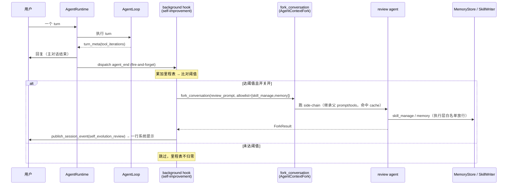
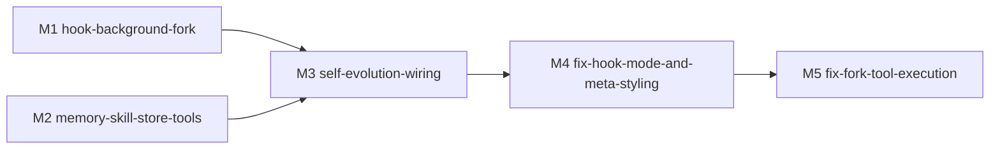

# feat-349: Skill 自进化 + Agent 策展式 Memory — 技术方案

> 对齐: spec.md v1
> Unit branch: `unit/feat-349` (will be created by orchestrator)
> 参考资料: `hermes-reference.md`（hermes-agent 代码级实现调研，供 worker 复刻时对照）

## Changelog

<!-- 按时间倒序追加。格式：YYYY-MM-DD (Mx): 一句话 — 详见 Mx/progress.md -->

- 2026-05-15 (M5): 用户实测发现 M4 修了 hook mode 触发后,fork loop 仍只跑 round 1 就停 —— LLM 回了干净的 `tool_use: skill_manage(...)` 但 `iteration_tool_calls` 显然空,`if not iteration_tool_calls: break` 直接退出,工具没执行、文件没落盘,REPL 回显误判为成功。立 M5 fix milestone 定位并修复 fork loop 工具执行回路;同时补 round 2 reviewer 走真 E2E 验证(M4 因 LLM 额度限制由 orchestrator 亲自实施且跳过了 round 2)
- 2026-05-15 (M4): round 1 验收后立 M4 fix milestone — 修 `_filter_hook_registry` 丢 `mode` 字段（blocking，自进化 hook 从不触发）；Issue #3（IM system 消息样式）核查为 reviewer 对 v1 死代码误判，活跃 v2 路径已合规；Issue #2（PA Gateway user_id 持久化）判定 out-of-unit，转 GitHub issue #10 — 详见 M4/progress.md

## 现状分析

### 涉及范围

| 路径 | 现状职责 | 本 unit 怎么动 |
|---|---|---|
| `agent/core/skills/` | `SkillRegistry` + `discovery.py` —— 只读发现型：扫描 `SKILL.md`、缓存、列表。无 create/edit/patch 写能力 | 新增"写"侧（自动落盘 / 改写 skill） |
| `agent/core/agent/runtime.py` | `AgentRuntime._run_locked` turn 编排核心，已算 `turn_count`，turn 结束 dispatch `agent_end` | 持 `tool_iterations` 里程表、给 hook context 注入 fork 能力、`agent_end` payload 带计数 |
| `agent/core/agent/loop.py` | `AgentLoop.run` 单 turn，`api_round_count` = tool iteration 计数（未对外暴露） | `turn_meta` 暴露 `tool_iterations` |
| `agent/core/agent/prompting.py` | `build_system_prompt` 注入 skills index | 增注入 memory block + `SKILLS_GUIDANCE`/`MEMORY_GUIDANCE` |
| `agent/core/agent/context_fork.py` | `AgentContextFork` side-chain 执行抽象（docstring 已写用途含 memory extraction） | `fork_conversation` 跑在其上 |
| `agent/core/hooks/` | hook 内核：`HookEventMode`、`HookRunner`、`HookContext`、`HookRegistry` | 新增 `background` mode + `fork_conversation` 注入 |
| `agent/platform/tools/builtins/` | builtin 工具，`Tool` Protocol 契约，`register_builtin_tools` 注册 | 新增 `skill_manage`、`memory` 两个工具 |
| `agent/platform/hooks/builtins/` | builtin hook，`setup(hooks)` + `hooks.on(event,cb)` + `hooks.set_state()` | 新增 `self_improvement.py`：background hook 模块（nudge 语义 + fork review + 回显） |
| `agent/products/{local_coding,personal_assistant}/` | profile 定义 toolset/hook/skill 策略；`memory_layout` 字段已预埋未接线 | 接线 memory_layout、注册工具、注入 guidance、配开关 |
| `agent/platform/config/resolver.py` | `ConfigResolver` 统一路径解析（`user_skill_roots` 等） | 新增 `user_memory_root()` / 自进化 skill 落盘 root 解析 |
| `personal_assistant/config/local_store.py` | `ensure_workspace_defaults()` 为每个 agent workspace seed `MEMORY.md` / `HEARTBEAT.md`（workspace 根） | 改 seed 位置到 `.nanoassistant/memory/`，seed 两文件 |
| `agent/products/personal_assistant/prompts.py` | PA system prompt 引导 agent "write to `MEMORY.md`" | 改 memory 路径引导（或随 memory 工具调整引导方式） |
| `coding_cli/render/`、`IM/api/routes/messages.py` | 两产品的输出层 | 接入"沉淀回显"系统提示 |

### 既有约束

- **结构化 memory 子系统不存在，但 PA 已有约定式 memory 机制**：
  - PA 每个 agent 的 `<workspace_root>/MEMORY.md`（workspace 根）由 `local_store.ensure_workspace_defaults()` seed；agent 用普通 `read`/`edit`/`write` + PA system prompt 引导读写。**无 memory 工具、无 nudge、无 store** —— 这部分本 unit 建。
  - `ProductProfile.memory_layout` 字段已预埋（PA `{"kind":"personal_memory"}` / LC `{"kind":"workspace_scoped"}`），docstring 明写 "runtime wiring can evolve later"。
- **`需求.md` L52-61「独立私有记忆机制」是已立项需求**，本 unit 落地其未完成部分，硬约束：
  - L60：抽取结果沉淀到「固定文件集合」，**禁止按会话无限新增记忆文件**（否决"一条一文件"方案）。
  - L61：记忆条目须保留**来源索引**（会话 ID / 时间戳 / 原始记录路径），支持回溯核验与纠错。
  - L46 / L57：子 Agent、`task` 临时子 Agent **共享主 Agent 的 `MEMORY.md`**，不单独持久化 —— 隔离粒度是「每**配置级** agent」。
  - L56：按需读取（agent 需要时才加载记忆文件）。
- `core` 不能依赖 `platform` / `products`；依赖方向 `platform → core + products`。
- 路径解析必须走 `ConfigResolver`，不在别处硬编码目录名。
- 四个顶层包禁止互 import；`coding_cli` / `personal_assistant` 只能 HTTP 访问 `agent`。
- session DB 永远在 `global_config_root`，不进 workspace。
- 产品差异：`local_coding` global home `~/.nanocode`（单 agent / workspace 维度）；`personal_assistant` global home `~/.nanoassistant`（多 agent，IM 可建多个 agent）——"每 agent 隔离"在 PA 侧需要 agent 维度子目录。

### 可复用能力

- **`AgentContextFork` —— 直接复用**：现成的 side-chain 执行抽象，docstring 用途已含 "memory extraction"，是 hermes "后台 fork review agent" 的天然载体。hermes 侧对照物是完整 `AIAgent` fork（见 `hermes-reference.md` §2）。
- **hook 体系 —— 复用 + 扩展**：`turn_end` / `agent_end` 事件已 dispatch，hook 模块 `setup(hooks)` + `set_state` 模式现成。现状 hook 只有 blocking 的 `observe`/`intercept`；本 unit 扩展出 `background` mode 让 hook 能 fork 当前对话（决策 1）。
- **`Tool` Protocol —— 复用**：新工具 `skill_manage` / `memory` 按现有 builtin 契约写。
- **`SkillRegistry` —— 改 / 扩**：发现侧复用，新增写侧（create/edit/patch + 校验 + 落盘 + 缓存失效）。

### 相关历史

- **feat-337** background subagents（`core/background_tasks/`）：后台任务基础设施，可参考其 fork / daemon 模式。
- **refactor-345** compact-in-agent-loop：compaction 跑在 `AgentContextFork` 上，是"side-chain 复用"先例。
- 无其他直接改 skills / memory 区域的近期 unit。

## 架构总览

核心思路：在 agent 内核现有 turn 编排上挂一条**旁路**——每个 turn 结束后做 nudge 计数判定，达阈值就用现成的 `AgentContextFork` 在后台跑一个 review agent；review agent 只拿到 `skill_manage` / `memory` 两个新工具，由它自主决定把经验落盘成 skill 文件或 memory 条目。主对话路径不变、不被打断；两个产品各自接线"落盘根目录（按 agent 隔离）+ guidance 注入 + 回显输出 + 开关"。

```
                          ┌─────────────── 主对话路径（不变）───────────────┐
 user turn ─▶ AgentRuntime._run_locked ─▶ AgentLoop.run ─▶ 回复用户
                  │                          ▲
                  │          system prompt：skills index + memory block + guidance（新增注入）
                  │
                  └─[agent_end dispatch]──▶ self-improvement background hook
                                                  │  读里程表 + 配置 → 比对阈值
                                                  └─达阈值?─▶ fork_conversation（AgentContextFork 后台 side-chain）
                                                              │  执行层白名单：skill_manage / memory
                                                              ▼
                                                  ┌─ skill 文件落盘（create/edit/patch）
                                                  └─ memory 条目落盘（add/replace/remove）
                                                              │  按 agent 隔离的根目录
                                                              ▼
                                                  回显：CLI 系统提示 / IM meta 消息
```

模块拓扑（`[新]` 新增 / `[扩]` 扩展 / `[改]` 改动）：

```
core/
  memory/          [新] MemoryStore：§ 分隔 + 来源索引文件读写 + 文件锁 + 原子写
  skills/          [扩] + SkillWriter 写侧：create/edit/patch + 校验 + 落盘 + 缓存失效
  hooks/           [扩] 新增 background mode；HookContext 注入 fork_conversation
  agent/
    runtime.py     [改] 持 tool_iterations 里程表；给 hook context 注入 fork 能力
    loop.py        [改] turn_meta 暴露 tool_iterations
    prompting.py   [改] 注入 memory block + SKILLS_GUIDANCE/MEMORY_GUIDANCE
    context_fork.py[改] 承载 fork_conversation
platform/
  tools/builtins/
    skill_manage   [新] 工具 → core/skills 写侧
    memory         [新] 工具 → core/memory
  hooks/builtins/
    self_improvement.py [新] background hook 模块：nudge 语义 + fork review + 回显
  config/resolver  [改] 新增 user_memory_root()
products/
  */profile+defaults+prompts [改] 接 memory_layout、注册工具、注入 guidance、开关、回显适配
```

## 关键决策

### 决策 1：扩展 hook 内核 —— 新增 background fork hook 机制

- **选择**：在 hook 内核新增第三种 dispatch mode `background`，并让 background hook 能 fork 当前对话跑后台 side-chain。self-improvement review 作为这套基建的首个 consumer。

  hook 的两个正交维度（写进内核语义）：

  | mode | 数据流 | 执行 | 典型用途 |
  |---|---|---|---|
  | `intercept` | 可改写 / 中止 | blocking + `timeout_ms` | `input` / `tool_call` 改写拦截 |
  | `observe` | 只读 | blocking + `timeout_ms` | 快速记录（`usage_metrics`） |
  | `background` | 只读 | fire-and-forget，无 timeout，可 `fork_conversation` | 长时 side-chain（self-improvement review） |

  （`intercept × background` 是矛盾组合 —— intercept 靠返回值改数据流必须阻塞等待 —— 故 collapse 成 mode 三值枚举。）

  机制要点：
  1. `background` hook 注册在某事件上（本 unit 用 `agent_end`，turn 完全结束后才 dispatch）；`HookRunner` 对它 fire-and-forget（`asyncio.create_task`），不 await、不受 `timeout_ms` 约束，主 turn 收尾不等它。
  2. `HookContext` 增强：为 background hook 注入 `fork_conversation` callable，内部封装 `AgentContextFork` + 当前 turn 的 messages snapshot。**system prompt 与 tools 参数逐字节继承父 agent**（复用该 turn 的 `rendered_system_prompt` + `active_tools`，不重新 `build_system_prompt`）—— 这是命中 provider prefix cache 的关键，低成本。工具收窄**不走 prompt**，而靠执行层拦截白名单（详见决策 6）。可指定 max_turns。
  3. 回显复用现有 `HookContext.session_event_publisher`：background hook 跑完 `ctx.publish_session_event(...)`，CLI / IM 各自消费成"轻量系统提示"，无需新管道。

- **理由**：用户明确要"hook 能 fork 当前对话"作为通用基建——后续任何"turn 结束后插入后台 side-chain"的场景都能复用；fork 主 agent 命中 prompt cache 使后台 side-chain 成本极低。与 hermes 做法一致（review agent 继承父 agent cached system prompt，见 `hermes-reference.md` §2）。
- **拒绝**：① review 逻辑放 runtime 私有模块 `core/agent/review/`（路线 A/C）——能在本 unit 范围内完成，但"fork 当前对话"能力沦为 review 专用，无基建复用价值，用户已明确否决。② 把 fork 能力靠 `HookContext.model_caller` 实现——`model_caller` 只是单次 model call（无工具、无多轮），承载不了会调 `skill_manage`/`memory` 跑 8~16 轮的 review agent。
- **风险**：① background side-chain 的生命周期 —— turn 结束后 fork 仍在跑，进程退出（尤其 CLI 短生命周期）需决定 detach 还是 join，否则 review 可能被中途杀掉。② fork 出的 side-chain 自身也会经过 turn 流程并 dispatch hook 事件，若不抑制会**递归 fork**；必须在 fork context 里禁用 background hook（对照 hermes：review agent 的 nudge interval 置 0）。

### 决策 2：nudge 计数器宿主 —— runtime 持原始计数，hook 持 nudge 语义

- **选择**：把"原始计数（运行事实）"与"nudge 语义（产品策略）"分离：
  - **runtime 持有原始计数**：`runtime` 持有 `tool_iterations`（单调累加里程表，只增不减），`loop.py` 每个 iteration `+1` 更新；`turn_count` 沿用现有（从 history 数）。两者作为"session 运行事实"通过 `agent_end` payload 暴露。runtime 完全不知道 nudge / interval / skill / memory 的存在。
  - **hook 模块持有 nudge 语义**：self-improvement background hook 模块只记轻量状态"上次 review 时的里程表读数"，判断逻辑为 `current_reading − last_review_reading >= interval`；阈值 `interval`（`creation_nudge_interval` / `nudge_interval`）从 product config 读。
- **理由**：runtime 是 session 生命周期的权威持有者，里程表跟着 session 走最自然、最规范；同时 runtime 不沾产品策略，`core` 纯逻辑边界不被污染。hook 模块改"自己累加"为"记上次重置点"，逻辑更简单。
- **拒绝**：① 计数器 + 阈值判断都放 runtime——把产品级 nudge 配置塞进 `core`，污染纯逻辑边界。② 计数器放 hook closure state 自己累加（`usage_metrics` 同款）——可行，但 runtime 才是 session 事实的权威持有者，里程表挂 runtime 更稳，且为"重启恢复"留了可能。
- **风险**：`tool_iterations` 里程表是否落盘可恢复 —— 现状 `turn_meta` 消息不持久化（`runtime._run_locked` 对 `turn_meta` 直接 `continue`，不进 history/JSONL）。若要支持重启恢复需让 per-turn iteration 数落进持久化 entry；否则 skill iteration 计数重启即丢（与 hermes 同）。worker 实现时定，倾向：能落盘则落盘。

### 决策 3：自进化产出落盘 —— `workspace_root` 隔离 + `.<namespace>/` 扩展目录

- **选择**：隔离维度统一用 `workspace_root`（每**配置级** agent 一个；子 agent / `task` 子 agent 共享主 agent 的，符合 `需求.md` L46/L57）。落盘路径都走 `ConfigResolver` 按各产品 `workspace_config_dirname` 解析：

  | 产品 | memory | skill |
  |---|---|---|
  | PA | `<workspace_root>/.nanoassistant/memory/{MEMORY.md,USER.md}` | `<workspace_root>/.nanoassistant/skills/` |
  | LC | `<workspace_root>/.nanocode/memory/{MEMORY.md,USER.md}` | `<workspace_root>/.nanocode/skills/` |

  - `ConfigResolver` 新增 `user_memory_root()`；skill 路径已在 `user_skill_roots()` 的 workspace 项内，发现侧不用改。
  - memory 从既有的 workspace 根迁到 `.<namespace>/memory/` 子目录（两文件收进扩展目录，与 skill 结构一致）。
  - **不做老数据迁移**（开发态）：`ensure_workspace_defaults()` 直接改 seed 到新位置，旧的 workspace 根 `MEMORY.md` 不管。
- **理由**：复用现有 `workspace_config_root()` 机制，改动最小；两产品统一维度，PA 不需新造 agent_id 路径维度；`core` 写侧靠注入的 resolver（沿用 `discovery.py` 的 `SkillRootResolver` Protocol）拿路径，不破坏分层。
- **拒绝**：① global home 下按 agent_id 分（`~/.nanoassistant/agents/<id>/...`）—— 要新造 agent_id 路径维度 + 两产品分叉，`workspace_root` 已够隔离。② memory 留 workspace 根 —— 两文件散在根目录，不如收进 `.<namespace>/` 整洁、与 skill 不一致。
- **风险**：① LC 的 memory 跟 workspace 走，删项目目录 memory 即丢（符合 LC `workspace_scoped` 语义，但若用户期望 memory 比项目持久会有落差）。② 既有不一致：`ConfigResolver` 解析出 `.nanoassistant`（`defaults.py` 的 `WORKSPACE_CONFIG_DIRNAME`），但 `NodeGateway-SPEC.md` / Gateway config 用 `.nano-assistant` —— 本 unit 以代码为准用 `.nanoassistant`，顺手同步 SPEC 文档。

### 决策 4：memory 存储形态 —— 两文件 + `§` 分隔条目 + 来源索引

- **选择**：复刻 hermes 的两文件结构，叠加 `需求.md` L60/L61 约束：
  - **两个固定文件**（满足 L60「固定文件集合」）：`MEMORY.md` 装 agent 自己演化的笔记 / 最佳实践，`USER.md` 装用户画像 / 偏好。
  - 文件内是 `§` 分隔的条目列表（对齐 hermes）。
  - **每个条目带来源索引**（满足 L61）：条目须含会话 ID / 时间戳等溯源字段——这是 hermes 纯文本 `§` 条目**没有**的，本项目条目格式要在此基础上扩展。具体字段编码格式留 worker 定。
  - 字符上限：对齐 hermes 量级（`MEMORY.md` ~2200 / `USER.md` ~1375），作为可配项；超限时由 review agent 自行压缩（system prompt 显示使用率，见决策后续/接口段）。
- **理由**：用户已拍板两文件；两文件是「固定文件集合」满足 L60；`MEMORY.md`/`USER.md` 的内容分工对齐 hermes，review agent 按信息性质决定写哪个 target。
- **拒绝**：① 单 `MEMORY.md`（延续 PA 既有）—— 用户已决定两文件，且内容分工更清晰。② 一条 memory 一个文件 + 索引文件 —— `需求.md` L60 明确禁止「按会话无限新增记忆文件」。
- **风险**：来源索引让条目格式偏离 hermes 的纯文本 `§` 块，memory 工具的解析/写入逻辑要自己设计，不能逐字照搬 hermes 的 `memory_tool.py`；`hermes-reference.md` §5 作为机制参考而非格式参考。

### 决策 5：skill 写侧 + `skill_manage` / `memory` 工具的模块归属

- **选择**：

  | 新增物 | 归属 | 职责 |
  |---|---|---|
  | `core/skills/` 扩写侧（`SkillWriter`） | `core`（扩展） | create/edit/patch + frontmatter 校验 + 落盘 + 触发发现 cache 失效；路径靠注入 |
  | `core/memory/`（`MemoryStore`） | `core`（新建） | 两文件 `§` 分隔 + 来源索引的读写 + 文件锁 + 原子写；路径靠注入 |
  | `platform/tools/builtins/skill_manage.py` | `platform` | 薄 `Tool` 包装，调 `core/skills` 写侧，注册进 `register_builtin_tools` |
  | `platform/tools/builtins/memory.py` | `platform` | 薄 `Tool` 包装，调 `core/memory`，从 `ToolContext` 拿 workspace_root 解析路径 |

- **理由**：skill 写/校验/缓存失效、memory 读写都是纯逻辑 → `core`；"把 core 能力暴露成 LLM 工具"是集成 → `platform/tools/builtins`；两产品共用 → builtins 而非 product tools；路径注入沿用 `discovery.py` 的 `SkillRootResolver` Protocol，`core` 不依赖 `platform`。
- **拒绝**：① skill 写侧放 `platform` —— 纯逻辑应在 `core`。② 工具放 product tools —— 两产品共用会复制两份。
- **风险**：`SkillRegistry` 有发现 cache，写侧改文件后必须让 cache 失效（对照 hermes：`skill_manage` 成功后清两层缓存）；`memory` 工具从 `ToolContext` 取 per-agent workspace_root，worker 需核实 `ToolContext.cwd` / `session_metadata` 能拿到正确值。

### 决策 6：工具配置 —— 主 agent 持有，review fork 靠"prompt 继承 + 执行层收窄"

- **选择**：
  - **主 agent 持有 `skill_manage` + `memory`**：加入两产品默认工具集。对齐 hermes（其默认 preset 含这俩，`toolsets.py`）；PA 主 agent 本就能用 `read`/`write` 操作 `MEMORY.md`，给专用工具是结构化升级。
  - **review agent fork 的工具收窄分两层**（对照 hermes `_spawn_background_review`，引 issue #25322 / PR #17276，实测 Sonnet 4.5 端到端成本降 ~26%）：
    - **发给 LLM 的 system prompt + tools 参数：逐字节继承父 agent**——复用该 turn 的 `rendered_system_prompt` + `active_tools`，不重建。这样 provider prefix cache 命中。**绝不能**按窄 toolset 重建 prompt（时间戳/session_id/skills 段都会变，cache key 字节失配）。
    - **实际允许执行的工具：执行层拦截白名单**——只放行 `skill_manage` / `memory`，其余在 `ToolRegistry.execute`（或 hook `tool_call` 拦截处）deny。白名单不碰 prompt。
  - **review prompt**：复刻 hermes 三件套（`_SKILL_REVIEW_PROMPT` / `_MEMORY_REVIEW_PROMPT` / `_COMBINED_REVIEW_PROMPT`，见 `hermes-reference.md` §3），memory prompt 须额外写入"条目带来源索引"的要求。
  - **计数器归零**：主 agent 实际调用 `skill_manage` → 更新 skill 里程表"上次重置点"；调用 `memory` → 更新 memory turn 计数"上次重置点"（决策 2 延续，对齐 hermes）。
  - **边界澄清**（防 reviewer 混淆）：主 agent 主动调 `skill_manage`/`memory` 是**对话内工具调用**，用户在对话流里本就可见，**不走** spec Q4 的"轻量系统提示回显"；Q4 回显只针对**后台 review agent** 的静默沉淀。两条路径解耦。
- **理由**：主 agent 持有工具才能让"主动总结 → 计数器归零 → 后台不催"成立，后台 review 是兜底而非唯一路径；prompt 继承 + 执行层收窄是 hermes 已验证的 cache 友好方案，用户已确认。
- **拒绝**：① 只有 review agent 持有工具 —— 偏离 hermes，PA 主 agent 反而退化，"主动总结归零"失效。② review fork 按窄 toolset 重建 prompt —— 破坏 prefix cache，与"低成本 side-chain"的核心动机直接冲突。
- **风险**：① 执行层拦截白名单的挂点（`ToolRegistry.execute` 内置 vs 复用 hook `tool_call` intercept）需 worker 定，要保证 fork side-chain 内生效、不影响主 agent。② 主 agent 多两个工具 → 工具列表变长、模型可能误用 → 靠 `SKILLS_GUIDANCE`/`MEMORY_GUIDANCE` 写清使用时机缓解。

### 决策 7：自进化能力开关 —— per-agent 维度，三层粒度

- **选择**：
  - **配置结构**（三层粒度，满足 spec Q5「整体关 + 分别关」）：
    ```yaml
    self_evolution:
      enabled: true            # 总开关
      skill_creation: true     # skill 自进化子开关
      memory_curation: true    # memory 自动策展子开关
      skill_nudge_interval: 10 # 调参（非开关）
      memory_nudge_interval: 10
    ```
  - **配置位置**：per-agent / per-workspace 维度，各产品用**各自既有配置入口**承载：
    - **PA** → `AgentWorkspaceConfig`（Gateway `~/.nano-assistant/config.yaml` 的 `agents[]` 下，本就 per-agent）。
    - **LC** → **workspace 级配置文件** `<workspace>/.nanocode/config.yaml`：kernel `local_coding` bootstrap 用 `ConfigResolver.workspace_config_root()`（现成）读取并注入 session config/metadata；文件缺失则用 profile 默认（全开）。注：LC 现状**无用户配置文件机制**（`llm-config` 是运行时 reconfigure，`runtime.reconfigure_llm` 纯进程内、不落盘），本 unit 给 LC 补这个 workspace 级配置入口。
    - 两者最终都注入 session config / metadata。
  - **透传**：self-improvement hook 模块统一从 `HookContext.metadata` 读（`runtime._run_locked` 已把 `config.metadata` 灌进 `hook_metadata`，现成通道）。
  - **默认**：`ProductProfile` 提供默认值，**全开**；per-agent 配置覆盖。
- **理由**：自进化是 per-agent 能力（skill/memory 本就每 agent 隔离），开关也该 per-agent；三层粒度正好满足 Q5；`interval` 单列为调参不兼做开关，语义清晰；profile 默认 + per-agent 覆盖贴合现有 `ProductProfile` → `AgentWorkspaceConfig` 覆盖模式；两产品各用既有配置入口，不新造机制。
- **拒绝**：① 全局单一开关（不分 agent）—— 违反 Q5 与 per-agent 隔离。② 只用 `nudge_interval=0` 兼表关闭（hermes 做法）—— 调参兼做开关，语义含混。
- **风险**：① 配置透传链路 `AgentWorkspaceConfig`（PA）/ workspace 配置文件（LC）→ kernel session → `HookContext.metadata` 要逐跳打通，worker 核实每跳都带上。② LC 的 workspace 级配置文件机制是**本 unit 新建**（LC 此前无用户配置文件），范围上要算进去。

### 决策 8：回显机制 + background 事件送达（SSE 生命周期）

- **选择**：
  - **事件**：新增 session event `self_evolution_review`，**结构化 payload**（created/updated 的 skill 名 / memory target 列表），不发死字符串 —— 两产品各自按形态渲染。
  - **CLI**：REPL 事件渲染层（`render/repl_live.py` / `session_stream.py`）识别该事件 → 渲染成一行系统提示（`·` 前缀样式，与 agent 消息区分）。
  - **IM**：Gateway 消费该事件 → 转成 IM **system/meta 消息**（非 agent 第一人称聊天消息）。
  - **SSE 生命周期 = 路径 B（本 unit 内解决）**：background review 是 fire-and-forget，跑完（数十秒后）发事件时主 turn 的 SSE 订阅可能已关 —— 本 unit 负责打通"background 工作完成事件能送达"（SSE 订阅生命周期覆盖到 background side-chain 完成）。与仓库 **issue #8**（background bash 完成通知丢失）同根，commit `Refs #8`。
- **理由**：回显是 spec Q4 的验收标准（"每次沉淀后用户看到一行轻量提示"），事件送达不了 = 功能残一半；本 unit 既引入了 background hook 这个"turn 后还在跑的东西"，就有责任把它的事件送达打通；与 issue #8 大概率同一修法。
- **拒绝**：① 路径 A（纯依赖 issue #8 修复）—— 引入外部依赖，issue #8 不修则回显残。② 路径 C（接受降级，SSE 在才显示）—— Q4 验收标准无法稳定满足。③ review agent 直接发 agent 消息 —— 违反 Q4。④ 各产品自己扫文件变化回显 —— 脆弱、绕开现成事件通道。
- **风险**：① IM 的 system/meta 消息类型是否现成需 worker 核实 `IM/api/routes/messages.py` 消息模型，可能需补一个轻量 meta 类型（跨 `IM` 包改动）。② CLI 的 SSE 事件流要确保不过滤掉新事件类型。③ "background 事件送达"的修法要与 issue #8 协调，避免两处分别改出冲突。

## 接口与数据流

> 只写"长什么样、谁调谁"，行级实现留 worker。签名为示意。

### 1. hook 内核扩展（`core/hooks/`）

- `HookEventMode` 增 `BACKGROUND`（types.py）。
- `HookContext` 增 `fork_conversation: ForkConversation | None`（仅 background dispatch 时注入）：
  ```
  ForkConversation = async (review_prompt: str, *, tool_allowlist: tuple[str,...],
                            max_turns: int) -> ForkResult
  ```
  内部封装 `AgentContextFork`：system prompt + tools 参数取父 turn 的 `rendered_system_prompt` / `active_tools`（不重建）；messages = turn snapshot；`tool_allowlist` 仅作用于**执行层拦截**。
- `HookRunner` 增 background dispatch 分支：对 `BACKGROUND` hook 用 `asyncio.create_task` fire-and-forget，不 await、不套 `timeout_ms`。
- 注册：`hooks.on("agent_end", handler, mode="background")`（或平行的 `on_background`）。

### 2. `core/memory/`（新建）

- `MemoryStore(memory_root: Path)` —— `memory_root` 注入：
  ```
  read(target) -> tuple[MemoryEntry, ...]
  add(target, entry) / replace(target, old_text, new_entry) / remove(target, entry)
  format_for_prompt(target) -> str   # 含使用率百分比，对照 hermes
  ```
- `target ∈ {"memory", "user"}` → 文件 `MEMORY.md` / `USER.md`；条目 `§` 分隔。
- `MemoryEntry = { text: str, source: MemorySource }`；`MemorySource = { session_id, timestamp, ... }` —— 满足 `需求.md` L61 来源索引。
- 写入：文件锁 + 原子写（temp + `os.replace`）。

### 3. `core/skills/` 写侧（扩展）

- `SkillWriter(skill_root: Path, registry: SkillRegistry)`：
  ```
  create(name, content) / edit(name, content) / patch(name, old_string, new_string)
  ```
- 校验：`name` regex、frontmatter 合法性、内容大小上限；成功后触发 `registry` 发现 cache 失效。

### 4. 两个 builtin 工具（`platform/tools/builtins/`）

- `skill_manage`：`input_schema` = `{ action: create|edit|patch|view|list, name?, content?, old_string?, new_string? }` → 调 `SkillWriter` / `SkillRegistry`。
- `memory`：`input_schema` = `{ action: add|replace|remove, target: memory|user, content?, old?, new? }` → 调 `MemoryStore`，`memory_root` 从 `ToolContext` 的 workspace_root 经 `ConfigResolver.user_memory_root()` 解析。

### 5. nudge 计数信号流

```
loop.py：turn_meta.metadata 增 tool_iterations:int
   └─▶ runtime：持有 tool_iterations 里程表（单调累加），turn_count 沿用
        └─▶ agent_end payload 增 { tool_iterations, turn_count }
             └─▶ self-improvement background hook：
                   读 HookContext.metadata 里的 self_evolution 配置（开关 + interval）
                   + agent_end payload 的里程表读数
                   → 比对"上次 review 读数" → 决定 review skill / memory / combined / 跳过
```

### 6. session event（回显）

- 新增 `self_evolution_review` 事件，payload：
  ```
  { actions: [ { kind: skill_created|skill_updated|memory_added|memory_replaced|...,
                 name?: str, target?: memory|user } ] }
  ```
- 经 `HookContext.session_event_publisher` 发出 → 走 session event 流 / SSE → CLI REPL 渲染层 + IM Gateway 各自消费。

### 7. system prompt 注入（memory block + guidance）

- `build_system_prompt`（`core/agent/prompting.py`）渲染时新增两块注入：
  - **memory block**：调 `MemoryStore.format_for_prompt(target)` 渲染 `MEMORY.md` / `USER.md` 内容（含使用率百分比），注入 system prompt；属 volatile 段，每 turn 重渲染。
  - **guidance 常量**：`SKILLS_GUIDANCE` / `MEMORY_GUIDANCE` 文本常量，按 `skill_manage` / `memory` 工具是否在该 session 工具集中决定是否注入（对照 `hermes-reference.md` §6）。
- skills index 注入沿用现有 `<RUNTIME_FILL:SKILLS_SECTION>`，不变。
- 注意：review fork 继承父 turn 的 `rendered_system_prompt`（决策 6），故 memory block 注入也随之被 fork 复用，无需 fork 侧重渲染。

### 8. 端到端时序



## 风险与回退

### 全局风险

| # | 风险 | 应对 |
|---|---|---|
| R1 | **递归 fork** —— review agent 跑 side-chain 也会 dispatch `agent_end` → 再触发 background hook → 无限 fork | fork context 内必须禁用 background hook（不注入 `fork_conversation`，或 nudge 配置强制关）。对照 hermes：review agent 两个 nudge interval 置 0。**这是正确性红线，必须有测试覆盖**。 |
| R2 | **background side-chain 生命周期** —— turn 结束 / 进程退出时 fork 仍在跑（CLI 短生命周期尤甚） | `fork_conversation` 的 task 由 runtime 持有引用，进程退出前给有限 grace 等待；超时则放弃（review 是 best-effort）。CLI 侧 worker 需确认 REPL 退出不会硬杀正在跑的 review。 |
| R3 | **prefix cache 失效** —— fork 未正确继承父 `rendered_system_prompt` / `active_tools`，cache miss 成本上升 | 决策 6 已定继承方案；worker 须有测试断言 fork 请求的 system prompt 与父 turn 字节一致。 |
| R4 | **background 事件送达** —— SSE 订阅在 turn 结束时关闭，回显丢失（issue #8 同根） | 决策 8 路径 B：本 unit 打通 background 事件送达，`Refs #8`。 |
| R5 | **并发写同一文件** —— PA 一个 agent 多个 session（多群聊/单聊）可能并发触发 review，写同一份 `MEMORY.md` / skill | `MemoryStore` 文件锁 + 原子写；`SkillWriter` 原子写。锁粒度要覆盖"读-改-写"全程。 |
| R6 | **review agent 写出低质量 / 破坏性 skill** | 本 unit **不做** hermes 式安全扫描（范围控制）；兜底是 spec 已定的"skill/memory 是纯文本文件、用户可查看/编辑/删除"。安全扫描可作后续 unit。 |
| R7 | **计数器进程重启丢失** —— skill iteration 里程表重启即丢（决策 2） | 接受（与 hermes 同）；memory turn 计数可在 `session_start` 从 history 数 user turn 恢复。 |
| R8 | **跨包改动面大** —— agent 三层 + `IM` + `personal_assistant` + `coding_cli` 四顶层包都被触及 | `tests/contract/` 的依赖方向校验须保持绿；改动按包边界切分，core 不依赖 platform/products 的红线不破。 |

### 降级路径

- **自进化开关关闭** = 天然降级:agent 回到现状行为(不自动沉淀、无回显),主对话完全不受影响。线上出问题先关开关。
- **background fork 失败/超时** = best-effort:`HookRunner` 对 background hook 异常吞掉(对照 hermes `except: pass`),主对话路径无感。

### 回滚方案

- 本 unit 全部是增量(新增 `core/memory/`、`core/agent/`(review 相关)、扩展 `core/skills/`、新增 `BACKGROUND` mode 枚举值、新增两个 builtin 工具、新增配置项)。回滚 = 撤 PR,不影响现有 `observe`/`intercept` hook。
- 已落盘的 `skill` / `memory` 文件是用户数据,回滚代码不触碰数据文件。

## Runbook for Reviewer

本 unit 改动 agent 内核 + `IM` + `personal_assistant`。reviewer 接管时按下表无脑重启：

| 服务 | 停止命令 | 启动命令 | 健康检查 |
|---|---|---|---|
| PA Gateway（带起 kernel） | `PYTHONPATH=src python -m personal_assistant.main stop` | `PYTHONPATH=src python -m personal_assistant.main` | Gateway 进程存活 + `curl -s http://127.0.0.1:8000/v1/health` 返回 200 |
| IM 服务 | `pkill -f "uvicorn IM.app"` | `IM_JWT_SECRET="demo-jwt-secret-for-feat340-testing" PYTHONPATH=src python -m uvicorn IM.app:app --host 0.0.0.0 --port 8011` | `curl -s http://127.0.0.1:8011/` 返回页面 |

备注：LC（Coding CLI）不是常驻服务，验 LC 路径直接跑 `PYTHONPATH=src python3 -m coding_cli.main --mode managed --base-url http://127.0.0.1:8000`（managed 模式自起 kernel，无需单独重启）。

## Milestones



| ID | 标题 | 依赖 | 并行组 | 范围 | 退出标准 |
|---|---|---|---|---|---|
| feat-349-M1 | hook-background-fork | — | A | `core/hooks/`（types/runner/context/registry）、`core/agent/runtime.py`（注入 fork 能力到 hook context）、`core/agent/context_fork.py` | `[worker]` 能注册 `mode="background"` 的 hook；turn 结束后 `HookRunner` 以 fire-and-forget 跑 `fork_conversation`，不阻塞主 turn、不受 `timeout_ms` 约束；`fork_conversation` 复用父 turn 的 `rendered_system_prompt` + `active_tools`（测试断言字节一致）、按 `tool_allowlist` 做执行层拦截；递归 fork 被抑制（覆盖 R1）；`[worker]` `core/hooks` + 相关 runtime 单测全绿 |
| feat-349-M2 | memory-skill-store-tools | — | A | `core/memory/`（新建）、`core/skills/`（写侧扩展）、`platform/tools/builtins/skill_manage.py`、`platform/tools/builtins/memory.py`、`platform/tools/builtins/__init__.py`、`platform/config/resolver.py`（`user_memory_root()`） | `[worker]` `skill_manage` 的 create/edit/patch 正确落盘到 `<workspace>/.<ns>/skills/` 且触发发现 cache 失效；`memory` 的 add/replace/remove 作用于 `memory`/`user` 两 target，`§` 分隔 + 每条目带来源索引、文件锁 + 原子写；name regex / frontmatter / 大小上限校验生效；`[worker]` 两工具 + store 单测全绿 |
| feat-349-M3 | self-evolution-wiring | M1, M2 | B | `platform/hooks/builtins/self_improvement.py`（background hook 模块）、`core/agent/`（`loop.py` 暴露 tool_iterations、`runtime.py` 持里程表 + agent_end payload、`prompting.py` 注入 memory block + guidance）、`agent/products/{local_coding,personal_assistant}/`（profile/defaults/prompts/toolsets/hooks 接线）、`personal_assistant/`（`local_store` seed 位置 + 配置透传）、`coding_cli/`（workspace 配置文件 + REPL 回显渲染）、`IM/`（meta 消息 + SSE 送达） | `[reviewer]` `spec.md` 全部 12 条验收标准通过（reviewer 走 PA + LC 两产品旅程验）；`[worker]` nudge 计数信号链路、两产品接线、回显（CLI 系统提示 + IM meta 消息）、background 事件 SSE 送达，单测 + `tests/contract/` 依赖方向校验全绿 |
| feat-349-M4 | fix-hook-mode-and-meta-styling | M1, M2, M3 | C | `platform/bootstrap.py`（`_filter_hook_registry` 保留 `mode` 字段）、`IM/frontend/`（`message-pane.tsx` / `MessageBubble` —— `sender_type=system` 消息渲染为视觉区分的轻量 meta 提示） | （post-acceptance fix, round 1）`[reviewer]` spec AC-1/2/3/4 通过：多轮对话后 background hook 真实触发、skill/memory 自动沉淀、CLI 一行回显 + IM meta 提示浮现且视觉区别于聊天气泡；`[worker]` `_filter_hook_registry` 透传 `mode`（单测断言 background 注册过滤后仍为 background）、IM 前端构建通过 |
| feat-349-M5 | fix-fork-tool-execution | M1, M2, M3, M4 | D | `core/agent/`（`loop.py` / `tool_executor.py` / `context_fork.py` — 定位并修 fork loop 在 round 1 tool_use 后未进入 round 2 的根因）、必要时 `platform/llm/providers/anthropic/client.py` | （post-acceptance fix, round 1 — 实测发现 M4 后的 E2E 仍未达成）`[reviewer]` spec AC-1/AC-2/AC-3 通过：跑 LC managed 模式对话超过 nudge 阈值后,`<workspace>/.nanocode/skills/` 或 `.nanocode/memory/` 下**真的出现**自动创建的 skill 文件 / memory 条目（而非仅 REPL 回显但落盘为空）；`[worker]` 新增单测覆盖"fork loop 在 LLM 返回 tool_use 后正确进入 round 2 并执行工具",`tool_names_called` 非空,fork `completed=True` 且工具结果反馈回 LLM |
