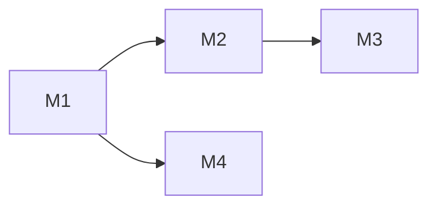

# feat-379: System Prompt 段式体系构建 — 技术方案

> 对齐: spec.md v1
> Unit branch: `unit/feat-379` (will be created by orchestrator)

## Changelog

<!-- 按时间倒序追加。格式：YYYY-MM-DD (Mx): 一句话 — 详见 Mx/progress.md -->
- 2026-05-22 (设计修订, 新增决策 11-14 + M9): spec 增补「特性↔工具双向联动 + 从零可达 + 新建页预览可加载」后回 design。亲自核实(非笔记)3 缺陷根因：**A** `_build_tool_names()`(`upstream_reporter.py:98`)用 `runtime=None`/`hook_runner=None` 建 registry→memory/skill_manage 需 bootstrap 注入路径才进 `list_specs()`→即便在 `DEFAULT_TOOL_IDS` 也被交集滤掉(实跑确认输出无二者)→`capabilities.tools` 永缺→allowlist UI 无此项可选；**B** IM 仅 `POST /im/v1/agents/{id}/prompt-preview` 一条按-agent 路由,新建页传 `__preview__` 占位 id→profile 查不到→必 404,无 node 级路由；**C** `agent-detail-page.tsx:136` 的 `effectiveToolIds` 把 available features 的 requires_tool 注入预览 tool_ids,掩盖 A。决策：**11** 预览改 node 级、丢 agent_id(组装只需前端配置 features/custom_prompt/tool_ids/scenario + node 段集,与 agent 无关；agent_id 原仅用于路由)；**12** 特性↔工具前端即时联动 + 移除特性 checkbox 的 `disabled=!available`(从零可达)；**13** 修 `_build_tool_names` 让 memory/skill_manage 进列表；**14** 删 effectiveToolIds 注入,预览 tool_ids 直接用 draft.tool_allowlist。落 M9 统一修复。详见 M9-fix-feature-tool-coupling/。
- 2026-05-22 (M8, post-acceptance fix round 4): round 4 ISSUE-1/2 PASS(node-caps features + 真实重启持久化均通过),仅剩 ISSUE-3(降 major)。根因:detail 页 preview 请求虽写了 `tool_ids: draft.tool_allowlist ?? []`(line 140),但真实 UI 请求里 tool_ids=[] 空→门控(需 memory 工具在位)永远失败→切 memory_curation 预览不变。需查 draft.tool_allowlist 为何在 preview 触发时为空(timing/数据形状),令真实 UI 切开关时 preview 内容真变。详见 M8-fix-preview-tool-ids/。
- 2026-05-22 (M7, post-acceptance fix round 3): 连续 3 轮 fail,共性=失败全在 Gateway 多服务链路接合点,组件单测过但真实链路坏。orchestrator 钉到文件级根因:ISSUE-1 `ws/im_connection.py` 的 `node.capabilities.resolve` handler 调裸 `build_runtime_capabilities().as_payload()` 不含 features 投影(features 投影在按 agent allowlist 算的 per-agent builder 里,create 页查 node-caps 拿不到)；ISSUE-2 重启 `node.register` 只发 `register_flags_payload`(无 per-agent features/custom_prompt),M6 的 upsert CASE 未覆盖 re-register 覆盖路径；ISSUE-3 gating 代码正确(orchestrator 直接验证 on/off 段进出),reviewer 503 是其环境 Gateway WS 未连上,需真实链路复验。**M7 强制要求经真实 live chain(curl HTTP + 真实重启 + IM-proxy→Gateway→agent)复现每个修复,非单测。** 详见 M7-fix-gateway-integration/。
- 2026-05-22 (M6, post-acceptance fix round 2): M5 的修复打在错误的层,reviewer round 2 复验 3 个 issue 仍 fail。根因定位(orchestrator)：ISSUE-2 IM durable 写读正确(同会话 GET 能读回),但重启时 Gateway re-sync 覆盖回空——M5 把 Gateway config.yaml 写回 hand-wave 成"无需新代码"是错的；ISSUE-3 预览端点已传 flags 进 PromptContext,门控仍不生效→前端预览请求未带 tool_ids(memory) 或 gate 未读 flag；ISSUE-1 create 页有 Features 逻辑但列表来自 per-agent capabilities,新建时 agent 不存在→列表空→渲染不出。详见 M6-fix-persistence-gating-create/。
- 2026-05-22 (M5, post-acceptance fix round 1): reviewer 端到端旅程发现 features/custom_prompt 持久化缺口(IM `/config` PATCH/GET + Gateway config.yaml 写回未接通,M2 单测只覆盖了 AgentWorkspaceConfig round-trip 与 capabilities 投影)、agent-create 页未迁移到新 Behavior card、features 门控未真正影响组装输出、capabilities `default_system_prompt` 仍旧 f-string 格式。详见 M5-fix-persistence-and-create-page/。

## 现状分析

### 涉及范围

| 路径 | 现状职责 | 本 unit 改动 |
|---|---|---|
| `src/agent/core/agent/prompting.py` | `build_system_prompt` 对单串模板做 4 个 `<RUNTIME_FILL:*>` replace + 尾部条件追加 `MEMORY_GUIDANCE`/`SKILLS_GUIDANCE`/`memory_block`/`BACKGROUND_TASK_PROMPT_BLOCK` | 重写为段式组装器；core 段拆出独立模块 |
| `src/agent/products/personal_assistant/prompts.py` | 一整个 f-string `PERSONAL_ASSISTANT_SYSTEM_PROMPT` | 拆成 `pa.*` 段集合 |
| `src/agent/products/personal_assistant/hooks/communication_context.py` | `before_agent_start` hook，群聊场景把 `[Communication Context]` 追加进 system prompt | 逻辑迁入 `pa.communication_context` 段（场景必加），hook 退役 |
| `src/agent/products/base.py` `ProductProfile` | 持 `default_system_prompt: str` 单串 | 新增 `prompt_sections` 提供者字段 |
| `src/agent/platform/bootstrap.py` | 把 `profile.default_system_prompt` 解析进 `resolved_system_prompt` | 改为解析产品段集合 |
| `src/agent/core/agent/runtime.py` `_run_locked` | 组装 `hook_metadata`（含 `conversation_type`/`participants`/`run_origin`），`frozen_system_prompt = config.system_prompt`，经 `before_agent_start` 得 `system_prompt_override` 传 loop | 把场景 + 特性 flag 打成 `PromptContext` 入参，向下传到 `build_system_prompt` |
| `src/agent/core/agent/loop.py` `run` | `build_system_prompt(system_prompt=override or self._system_prompt, ...)` | 改为传 `PromptContext` |
| `src/personal_assistant/config/local_store.py` `AgentWorkspaceConfig` | 字段 `system_prompt`（整串覆盖）等 | 新增 per-agent `features` + `custom_prompt`；`system_prompt` 整串覆盖语义废弃 |
| `src/personal_assistant/main.py` `handle_agent_create` / `current_agent_payload` | 透传 `system_prompt` 等到 IM/config.yaml | 透传 `features` + `custom_prompt` |
| `src/IM/infra/db.py` `repositories.py` + agent config 路由 | 存/取 agent 配置（含 `system_prompt`/`group_reply_policy`） | 增 `features` + `custom_prompt` 字段 |
| `src/IM/frontend/src/features/settings/agents/agent-detail-page.tsx` / `agent-create-page.tsx` / `im-agent-config-api.ts` | Behavior card：整串 System Prompt textarea + 群回复策略 select | 重构为「特性开关组 + 自定义补充 + 折叠预览(必做)」 |

### 既有约束

- 四个顶层包无 import 依赖：`personal_assistant`/`IM` 只经 HTTP 调 `agent`，不得直接 import（`tests/contract/` 验收）。
- agent 内核三层 `core → platform → products`，`core` 不依赖 `platform`/`products`。**段式框架（PromptSection/PromptContext/组装器）属 core；core 段属 core；产品段属各 product 包**，由 platform `bootstrap` 装配——core 不得反向 import 产品段。
- `before_agent_start` hook 的输出 `{"system_prompt": ...}` 当前是 prompt 改写的唯一运行时上下文入口（hook 能读 `ctx.metadata`）。改造后场景数据须由 runtime 显式传入 `PromptContext`，不能再依赖 hook 旁路。
- `self_evolution` 配置（`{enabled, skill_creation, memory_curation, skill_nudge_interval, memory_nudge_interval}`）已存在，但是**产品实例级**（workspace `config.yaml` → `default_session_metadata` → 所有 session），非 per-agent。

### 可复用能力

- **`self_evolution` 配置链**（`bootstrap._load_self_evolution_config` → `default_session_metadata` → session metadata）：**改写复用**——把"特性 flag"从产品实例级提升为 per-agent，沿用这条 metadata 注入链，不另造 flag 平台。
- **`communication_context` 段构造逻辑**（`_build_communication_context_block`）：**搬迁复用**——整体迁入 `pa.communication_context` 段的 render，gate 改为读 `PromptContext.scenario`。
- **开/关控件**：核实现状——前端**无 Switch 组件**（radix 依赖只有 avatar/dialog/label/select/tabs），on/off idiom 是**样式化 checkbox**（`appearance:none` + `:checked`→`--im-accent`，见 `allowlist-selector.tsx:129` / `.chat-modal-agent input[type=checkbox]`）。特性开关**复用此 checkbox idiom**，不引入产品没有的 Switch 新视觉。
- **折叠/disclosure**：核实现状——约定是**手写 `<button aria-expanded>` + `▸/▾` 箭头 + `--open` class**（`tool-calls-panel.tsx` 的 `chat-tool-calls-toggle`、user-menu、token-chip）。预览面板**复用此模式**，不引入 `<details>`/Accordion。
- **`im-agent-card` / `im-agent-field` 版式 + `--im-*` CSS 变量**（`--im-accent`/`--im-border`/`--im-surface-2`）：前端**直接复用**，新区块套同款卡片、颜色走变量（非 inline oklch 字面量）。

### 相关历史

- `feat-333`：`auto_mode_gate` 统一 allow/deny/ask 分类器（也用 `build_yolo_system_prompt` 的 tag-replace 模板），与本 unit 的主 system prompt 解耦，不冲突。
- `feat-349`：背景自进化（`self_improvement` hook + `self_evolution` 配置 + `skill_nudge_interval`），本 unit 复用其配置链并把开关提升到 per-agent。
- `bugfix-358`：把群聊 message_format 从 `@agent_id` 改为 inline `<mention>` 标签——此文案在 `communication_context` 里，迁段时**逐字保真**。
- `project-agent-config-ux-requirements-2026-03-14`（memory）：agent 配置须用可勾选 allowlist + 可编辑标准 System Prompt 模板——本 unit 把"可编辑整串模板"演进为"特性开关 + 自定义补充段 + 预览"。

## 架构总览

**Before**（三处拼装，机制分裂）：

```
产品默认串 PERSONAL_ASSISTANT_SYSTEM_PROMPT (带 RUNTIME_FILL)
  └ 或 per-agent system_prompt 整串覆盖(完全替换产品默认)
       │
       ▼  before_agent_start hook (communication_context)
   base + "\n\n[Communication Context]"   ← 群聊场景旁路注入
       │
       ▼  build_system_prompt
   replace(RUNTIME_FILL) + 尾部 append(memory/skills guidance + memory_block + background)
       │
       ▼  最终 system 串
```

**After**（单一段式组装器，分层 + 门控统一）：

```
                         PromptContext
   (tools, skills, datetime, cwd, memory_block, flags{特性开关}, scenario{会话类型/成员/回复策略/是否heartbeat}, vars{custom_prompt})
                              │
   core 段集合  ─────┐        │        ┌───── 产品段集合 (ProductProfile.prompt_sections)
   (agent/core)      │        ▼        │      (products/<product>)
                     └──►  assemble_system_prompt(sections, ctx)  ◄──┘
                              │  按 order 排序 → 逐段 enabled_when(ctx)? render(ctx)→str|None → 过滤空 → "\n\n" join
                              ▼
                          最终 system 串
```

核心思路一句话：**system prompt = 一组有序的、各自带门控的命名段，内核与产品各自贡献自己的段；段出不出现由 `PromptContext`（场景 + 特性 flag）决定，不再有"整串覆盖"和"hook 旁路"两套机制。**

### 从 CC 真实源码核实的设计优势（已逐项决断纳入/暂缓）

> 核实文件：`claude-code/src/constants/systemPromptSections.ts`、`utils/queryContext.ts`、`utils/systemPrompt.ts`。以下是源码（非笔记）确认的四点，及本 unit 的取舍。

1. **段级缓存稳定性纪律（结构 + 收益当下生效）**：CC 的 `systemPromptSection(name, compute)` 默认把段产物 memoize 进 `Map<name,str|null>`，命中即复用；只有 `DANGEROUS_uncachedSystemPromptSection(name, compute, reason)` 才每轮重算并打断 prompt cache，且**强制给 reason**；缓存在 `/clear`、`/compact`、worktree 切换（cwd 变）时显式清。本质是为**保住 prompt cache 命中**——稳定段算一次，易变段才打断，且打断要"喊出来"。
   - **缓存事实（本项目）**：我们**永不用 Anthropic 官方 API**，`cache_control` 这类官方 API 专有标记**不纳入考量**。LLM_PROXY 对接的 provider（OpenAI 兼容 / DeepSeek / Kimi / 豆包等）做**自动前缀缓存**——无需 marker，只要 system 前缀字节稳定即自动命中，命中率取决于稳定前缀有多长。
   - **决断**：稳定前缀越长、命中越多是**当下就生效**的省 token 收益 → 决策 8 的"易变段后置 / `cache_safe` 声明"是 load-bearing、本 unit 落地。memoization Map（CC 用来省进程内重算段字符串，与 provider 缓存无关）属另一层小优化，暂缓。
2. **显式 override 优先级阶梯（纳入）**：CC `buildEffectiveSystemPrompt` 用一个函数集中决议 `override > coordinator > agent > custom > default` + `appendSystemPrompt` 恒在末尾；且 agent 自定义在 proactive 模式**追加**（`# Custom Agent Instructions`）、否则**替换**。→ 印证我们把 `custom_prompt` 做成**叠加段**（而非整串替换）是对的，并促使我们把"内部原始串直通 / 产品段默认 / 用户自定义叠加"的关系收敛成一个**文档化的解析器**而非散落逻辑（决策 9）。
3. **`compute: ()=>string|null|Promise` + null=缺席（部分纳入）**：返回 null 即本段不出现——我们 `render→str|None` 已等价。CC 允许 async compute；我们段为纯同步（无 IO），**保持同步**，async 作为 `render` 签名的后续可扩展点，本期不引入。
4. **静态/动态段间显式缓存边界（印证决策 8）**：CC `getSystemPrompt` 返回数组里有一行 `SYSTEM_PROMPT_DYNAMIC_BOUNDARY`（注释 "DO NOT MOVE OR REMOVE"），其上是 7 个静态可缓存段（Intro/# System/# Doing tasks/# Executing actions/# Using tools/# Tone/# Output），其下是注册表管理的动态段（session_guidance/memory/env/language/mcp(`DANGEROUS_uncached`)/…）。**这正是决策 8 的"稳定前缀 + 易变尾部"**——我们的 order≤800 / 900+ 分带与之同构（CC 用边界 + cacheBreak 是因其面向官方 API；我们靠 provider 自动前缀缓存，无需标记，仅靠排序）。注意 CC 把 env(cwd/date) 放动态段，我们因 datetime=session_created_at 稳定而留在稳定前缀（710），是有依据的微差异。
5. **CC 通用规范段的内容对齐（新增 M4，见 Milestones）**：核实 CC 真实段文案后，发现我们 core 段内容相对 CC 通用规范缺失/跑偏：缺 `# Executing actions with care`（风险操作先确认）、`# Tone and style`（`file_path:line_number`/`owner/repo#123`/emoji 按需/tool 前不加冒号）；`# System` 缺 prompt-injection flag、被拒工具调用处理、system-reminder 说明、自动压缩说明；`# Using your tools` 方向相反（现叫用户用 bash 做 grep，CC 是专用工具优先 + 并行调用）。这些都是 harness 通用不变量（非 coding 专属），**纳入本 unit 作 M4 内容对齐**。不照搬 CC 的 `# Doing tasks`（软工框架，归 coding_cli）/ `/help /issue /share`（CC 产品专属）/ output_style/scratchpad/token_budget 等特性门控段（我们无此特性）。
6. **三段式缓存前缀拆分（暂不纳入）**：CC 把 `userContext`(claudeMd/currentDate→塞进一条 user `<system-reminder>`) 与 `systemContext`(gitStatus→system 数组末尾) 同 `systemPrompt` 数组**分成三块缓存前缀**。这是更深的缓存结构选择，超出本 unit"段式化 system prompt"范围，**显式不纳入**（datetime/cwd 仍作 `core.runtime_footer` 留在 system 段内）；记为未来若上 prompt cache 时的优化项。

段的门控分三类（内核、产品两层都各有这三类）：

| 门控类型 | 出现条件 | 用户能否关 | 例 |
|---|---|---|---|
| 固定无条件 | always | 否 | `core.system`、`pa.identity` |
| 固定按场景必加 | 场景/能力满足即必加 | 否 | `pa.communication_context`(群聊)、`pa.heartbeat`(配了 heartbeat)、`core.memory_block`(有快照) |
| 用户可勾特性 | 特性 flag 为真（+ 依赖工具在位） | 是，写回 config.yaml | `core.memory_guidance`、`core.skills_guidance` |

外加一类特殊段：**用户自定义** `pa.user_custom`——内容来自 per-agent `custom_prompt` 文本，非空才出现。

## 关键决策

### 决策 1: 段的有序拼接用显式 `order: int`，不用命名锚点

- **选择**: 每个 `PromptSection` 带 `order: int`；组装器全局按 `order` 升序排。core 与 product 段混入同一序列，用分段号区（100 产品身份/runtime / 200 内核行为(system·actions·tools·tone) / 300 产品正文 / 400 工具与技能清单 / 500 特性指引 / 700 机制段(背景任务·footer) / 800 用户自定义 / 900+ 易变尾部(场景·易失记忆)）。号区常量在 core 暴露，产品段引用常量定位。详见下「段顺序总表」。
- **理由**: 整数 order 零机制、完全可控、可单测断言顺序；号区让"内核段与产品段按意图交错"（而非按层堆叠），符合 spec"内核/产品都各有固定+可勾"的交错诉求。
- **拒绝**: 命名锚点插入（`before("core.system")`）——多一套锚点解析与冲突处理，收益不抵复杂度；纯数组位置——产品段无法在内核段之间插队。
- **风险**: 号区耗尽/撞号；以 10 为步进留余量，撞号在组装器里按 `(order, name)` 稳定排序兜底。

### 决策 2: `PromptSection`/`PromptContext` 形态 + 内核 core 段、产品段经 bootstrap 合并

- **选择**:
  - `PromptSection(name, order, render: (ctx)->str|None, enabled_when: (ctx)->bool = always)`，纯数据 + 两个纯函数，无副作用。
  - `PromptContext` 冻结 dataclass，载：`available_tools / available_skills / current_datetime / cwd / memory_block / flags: Mapping[str,bool] / scenario: Mapping[str,Any] / vars: Mapping[str,str]`。
  - core 段定义在 `agent/core/agent/prompt_sections/`（core 拥有）；产品段定义在 `products/<product>/prompt_sections.py`，由 `ProductProfile.prompt_sections` 暴露；`bootstrap` 把"core 段 + 产品段"合并成有序列表放进 `ResolvedProductConfig`，runtime 持有后每轮调 `assemble_system_prompt`。
- **理由**: 段是声明式纯函数 → 可单测、可 golden 比对；core 不 import 产品（产品段经 profile 注入，方向 `platform→products+core` 不破）；`render` 返回 `None` 即"本段缺席"，与 CC 的 `string|null` 等价。
- **拒绝**: 让每个产品 hook 在 `before_agent_start` 各自拼段（沿用现 hook 旁路）——上下文分散、顺序不可控、core 段与产品段无法统一排序。
- **风险**: `PromptContext` 字段膨胀；约束为"组装期只读快照"，运行时可变状态不进 ctx。

### 决策 3: 特性 flag = per-agent 配置，沿用 self_evolution metadata 链，不引入 flag 平台

- **选择**: 在 `AgentWorkspaceConfig` 新增 `features: dict[str,bool]`（per-agent）。优先级合并：`ProductProfile.capabilities`（产品级默认）← per-agent `features`（用户覆盖）→ 落进 session metadata → runtime 取出填 `PromptContext.flags`。`self_evolution` 的 `skill_creation`/`memory_curation` 收敛为 features 里的键，避免双份开关。
- **理由**: 复用已验证的 metadata 注入链（feat-349），改动面最小；per-agent 粒度满足 spec；不引入 GrowthBook 式独立 flag 基础设施（YAGNI）。
- **拒绝**: 新建独立 feature-flag 服务/表——超出需求；继续用产品实例级 self_evolution——粒度不对（spec 要 per-agent）。
- **风险**: features 键命名漂移；用决策 7 的"特性注册表"作单一事实源，键集中定义。

### 决策 4: 场景数据由 runtime 显式注入 PromptContext，`communication_context` hook 退役

- **选择**: `runtime._run_locked` 已有的 `hook_metadata`（`conversation_type`/`participants`/`participant_agent_ids`/`run_origin`/group_reply_policy）打包成 `scenario` dict，随 loop.run 下传到 `assemble_system_prompt`。`pa.communication_context` 段 `enabled_when = scenario.conversation_type=="group"`，render 复用 `_build_communication_context_block`。原 `before_agent_start` 里的 prompt 改写逻辑删除。
- **理由**: 消除"hook 旁路 + 组装器"双轨；场景段与其它段同序、同门控、可单测；group_reply_policy 作为场景必加段的内容（spec 场景 3：群聊行为不可关）。
- **拒绝**: 保留 hook 旁路只把 core 段式化——双机制并存正是本 unit 要消的病。
- **风险**: 场景字段需从 runtime 一路传到 core 组装器（跨 loop）；按"新增一个可选 `prompt_context` 入参、默认空 dict"渐进式接线，老调用方不传即退化为无场景。

### 决策 5: 废弃用户面"整串覆盖"，per-agent 自定义降级为 `custom_prompt` 叠加段

- **选择**: per-agent `system_prompt`（整串覆盖产品默认）的**用户面语义废弃**（spec：不考虑后向兼容）。新增 per-agent `custom_prompt: str`，作为 `pa.user_custom` 段内容（叠加在标准段之上，非空才出现）。内核 `assemble_system_prompt` 仍保留一个"原始串直通"内部入口，仅供测试 / 子 agent fork 等内部场景，**不作为产品用户面功能**。
- **理由**: spec 明确"段式是唯一机制、自定义=开关+自定义段"；叠加段比整串覆盖安全（用户改不动内核固定段，群聊/heartbeat 行为可固定）。
- **拒绝**: 保留整串覆盖作高级逃生舱——spec 已否；逐段覆盖 map——spec Q2 已否。
- **风险**: 存量 agent 的 `system_prompt` 串失效——开发期无真实存量需保留，**不做存量迁移**（spec 非目标）；新建 agent 一律走段式 + `custom_prompt`，DB/config 读取对遗留 `system_prompt` 字段忽略容错即可（不读进组装链）。

### 决策 6: 自定义段照 CC 用 `# Custom Agent Instructions` 标题，排稳定前缀最末（order 800），无冲突前言

- **选择**: `pa.user_custom` 标题用 CC 同款 `# Custom Agent Instructions`（核实自 `claude-code/src/main.tsx:3284`：`\n# Custom Agent Instructions\n${customPrompt}`），正文即 per-agent `custom_prompt` 原文，**不加任何"与上文冲突以本节为准"之类前言**。order=800——在全部默认/机制段（≤710）之后、易变边界（900）之前，是**稳定前缀的最末段**，`cache_safe=True`。
- **理由**: CC 核实结论——它对追加的 agent 自定义只用一个干净标题，靠**位置靠后**取得高权重，不靠措辞声明优先级。我们 user_custom per-session 稳定，放稳定前缀末位即可同时拿到"末位=权重高"和"留在可缓存前缀"，无需自造前言。
- **拒绝**: 自造冲突前言——CC 没有，多余且可能与产品段语气打架；放最前(100 旁)——被后续默认稀释；放易变段之后(>900)——把稳定文本挤出可缓存前缀。
- **风险**: 极小。`# Custom Agent Instructions` 是英文标题，与全篇英文 prompt 一致；若希望本地化标题可在 M4 一并定（措辞欢迎审阅时调整）。

### 决策 7: 用"特性注册表"作 flag↔段↔默认值↔依赖工具的单一事实源

- **选择**: 建一张特性注册表（结构化常量），每条：`feature_key → {sections: [段名], default_on: bool, requires_tool: str|None, layer: core|product, label/help i18n key}`。组装器据此对"用户可勾"段做门控：`flags.get(key, default_on) and (requires_tool is None or tool 在位)`。IM 前端据此渲染开关列表（label/help/默认值/是否因缺工具而禁用）。
- **理由**: flag 名、默认值、段映射、依赖工具集中一处，避免后端门控逻辑与前端开关列表各写一份漂移；spec Q6"每个特性有默认值"在此落地。
- **拒绝**: 在各段 `enabled_when` 里硬编码 flag 名 + 在前端再硬编码一份开关清单——双份易漂移。
- **风险**: 注册表需被 core（门控）与 IM 前端（渲染）共享，但二者跨包不能 import；解决：注册表的"用户可见部分"经 agent capabilities HTTP 接口下发给前端（与 skills/tools allowlist 同路），core 侧持完整表。

### 决策 8: 段声明 `cache_safe`，易变段排序最后（吃下 CC 的缓存纪律，缓存机制本身暂缓）

- **选择**: `PromptSection` 增 `cache_safe: bool = True`。会随轮次变化的段（`pa.communication_context` 群成员、`core.memory_block` 易失快照）显式 `cache_safe=False`，并落到序列最后（order ≥ 900）；100–800 全为 `cache_safe=True` 的稳定段，构成"可缓存前缀"。组装器仅落地"稳定前缀连续 + 易变段集中尾部"的结构（不建 memoization Map）。
- **理由**: 我们 LLM_PROXY 对接的 provider 做**自动前缀缓存**（无需 marker），稳定前缀越长命中越多——这是**当下生效**的省 token 收益。把"哪些段易变、易变段必须靠后"做成段的**声明属性 + 排序约束**几乎零成本，直接抬高自动缓存命中。对照 CC：它用 `cacheBreak` + 易变内容（memory/gitStatus）后置来护住缓存前缀，同理。
- **拒绝**: 不管缓存属性、易变段散在中间——会把易变内容塞进稳定前缀，每轮变就让整段前缀缓存失效，自动缓存命中率直接塌；照搬 `Map<name,str|null>` memoization（进程内重算优化，与 provider 缓存无关）——本期无必要。
- **风险**: 误把易变段标成稳定会导致将来缓存返回陈旧内容；用单测断言"所有 `cache_safe=False` 段的 order 严格大于所有 `cache_safe=True` 段"。

### 决策 9: 用一个文档化的 override 优先级解析器，取代散落的 prompt 来源判断

- **选择**: 仿 CC `buildEffectiveSystemPrompt`，在 core 暴露一个解析函数集中决议最终 prompt 来源，优先级：`内部原始串直通(override，仅测试/子 agent fork) > 段式组装(core 段 + 产品段)`；其中 `pa.user_custom` 作为**段**参与组装（叠加，非替换），不再有产品级"整串替换默认"。runtime 据此一处决断，不在 loop / hook / bootstrap 各写一份"用谁的 prompt"。
- **理由**: CC 把来源优先级收敛到一个函数 → 可读、可测、改一处。我们当前来源判断散在 `runtime._run_locked`（frozen vs hook override）+ `loop.run`（override or self._system_prompt）+ `bootstrap`（resolved_system_prompt）三处，正是要收敛的。CC 的 "agent 自定义 proactive 下追加、否则替换" 印证 user_custom 取**追加**语义。
- **拒绝**: 保留三处散落判断——改一处行为要同步三处，易漏。
- **风险**: 收敛解析器要兼顾子 agent fork 现走的 `system_prompt` 直通路径（`AgentContextFork`）；解析器把"内部 override 直通"作为最高优先显式分支保留，覆盖该路径。

### 决策 10: 每个段的定义处必带 `Provenance:` 注释，标明 CC 来源与改动

- **选择**: 每个 `PromptSection` 定义处写一行 `Provenance:` 注释（符合 COMMENTING_GUIDE「写约束」——约束是"改文案前要知道跟 CC 什么关系、不能随手重写 CC 逐字段"）。3 类标签：
  - `CC-verbatim` — 文案**逐字**取自 CC，必注 `<file:symbol>`（如 `prompts.ts:getActionsSection`）。**约束**：改动前须回查 CC 源，不可随手改。
  - `CC-adapted` — **基于** CC 改写，注源 + **改了什么/为什么**（如"去掉 CC 的 git/CI 举例，不适用于个人助手"）。
  - `new` — 不来自 CC（本项目原有文案或全新撰写都算），可自由改；注依据（决策号 / spec / 原位置如 `prompts.py`）。
- **理由**: 段式化后文案散到多个段定义里，唯一需要标的是"跟 CC 什么关系"——CC-sourced 的不能随手改（CC 段注释里大量标 `Eval-validated`），其余可自由改。这行注释让该约束随代码走，不依赖本 design 文档。
- **拒绝**: 区分"本项目原有"vs"全新"——对"能不能改"无意义，多此一举；只在 design 表记来源、代码不标——文档与代码会漂移。
- **对应**: 表「来源」列速查（`[新增·CC]`→`CC-verbatim`、`[纠偏·CC]`→`CC-adapted`、`[迁移]`/`[新建]`→`new`）。

格式示例：

```python
# Provenance: CC-adapted — based on claude-code getActionsSection (prompts.ts:256);
#   kept reversibility/blast-radius + confirm-before-risky; dropped CC's git/CI
#   examples that assume a coding workflow. See feat-379 design 决策 6/M4.
CORE_ACTIONS_CARE = PromptSection(name="core.actions_care", order=210, ...)
```

> 以下决策 11-14 为 post-acceptance 设计修订（2026-05-22），对应 spec Q9–Q12 / 场景 5-6 / 新增 4 条 AC，统一由 M9 实施。

### 决策 11: prompt 预览改 node 级、丢弃 agent_id

- **选择**: 新增 node 级预览链路 `POST /im/v1/nodes/{node_id}/prompt-preview`，入参 `{features, custom_prompt, tool_ids, scenario:"direct"}`，**不带 agent_id**。detail 页传 agent 的 owning node_id、create 页传所选 node_id，两页对称走同一条链路。IM → 该 node 的 Gateway WS（仿 `node.capabilities.resolve` 的 node 级 round-trip）→ Gateway `prompt_preview_provider`（`agent_id`/`workspace_root` 变可选，缺省用 node 默认 workspace，仅 cwd 显示用，不影响段组装）→ agent kernel `/v1/prompt-preview`（本就不读 agent 身份）。废弃按-agent 的 `POST /im/v1/agents/{id}/prompt-preview`（或保留为薄 wrapper 解析 agent→node 后转调，二选一由 worker 定，但前端两页都改用 node 级）。
- **理由**: 组装一份 system prompt 的全部输入 = 前端配置（features/custom_prompt/tool_ids/scenario）+ 该 node 的段集合（bootstrap 时 app 级合并），**与具体 agent 无关**。原实现里 agent_id 仅用于路由，却因此让"新建时 agent 尚不存在"成了死结。改 node 级后，新建页预览天然可加载（缺陷 B 根治），两页对称也消除了缺陷 C 那个 hack 的存在理由。
- **拒绝**: 让按-agent 路由容忍 `__preview__` 哨兵——仍是 agent 语义打补丁，两套心智；给新建页单独造一条不同 schema 的端点——两页预览不对称，回到分裂。
- **风险**: node 级预览的 cwd/datetime 取 node 默认（非真实 agent workspace），预览顶部已注明"基线/单聊视角"，差异可接受；node 级 WS round-trip 需新增一个 message 类型，照搬 `node.capabilities.resolve` 既有模式，风险低。

### 决策 12: 特性↔工具前端即时联动，移除特性开关的"缺工具禁用"

- **选择**: 联动为纯前端 draft 状态逻辑（spec Q10：即时），抽成两页共用 helper：
  - 勾选特性 `key` → 把 `FEATURE_REGISTRY[key].requires_tool`（经 capabilityFeatures 已知）并进 `draft.tool_allowlist`（spec Q9-a）；
  - 取消特性 → **不动** `tool_allowlist`（spec Q9-c：工具是更底层能力，可为别的用途保留）；
  - 从 `tool_allowlist` 移除某工具 → 若它是某特性的 `requires_tool`，**取消该特性勾选**（spec Q9-b）。
  - **移除特性 checkbox 的 `disabled = !feat.available`**（`agent-detail-page.tsx:213`）：特性永远可勾，勾了就联动加工具——这是"从零可达"（spec 场景 5 / 可达性 AC）的实现关键。`available`/`requires_tool` 字段仍保留供前端联动取 tool 名，但不再据此禁用控件。
  - 后端 `PATCH /config` 落库前做一次一致性兜底：保证"特性开 ⇒ 其 requires_tool 在 tool_allowlist"，防止异常路径写入矛盾态。
- **理由**: 前端 `capabilityFeatures` 已带 `requires_tool`，足够本地完成双向联动，零新增后端往返；spec Q10 要"立刻变"，即时 draft 联动正中诉求。禁用态正是缺陷 A 暴露给用户的样子（开关灰着点不动），与"从零可达"直接冲突，必须去掉。
- **拒绝**: 保留禁用态、要求用户先手动加工具——违反场景 5"不必先想着加工具"；后端联动（保存时才校正）——用户先看到矛盾态再被纠正，违反 Q10。
- **风险**: 联动逻辑两页各写一份易漂移——抽 helper 单一实现；contract 上"特性开⇒工具在"的不变量由后端兜底测试守住。

### 决策 13: 修 `_build_tool_names`，让 memory/skill_manage 进 advertise 工具列表

- **选择**: `_build_tool_names()` 改为不依赖 runtime 实例的工具规格来源——advertise 阶段只需工具 `name + description`（静态可得），应从 `PERSONAL_ASSISTANT_PROFILE` 的 `default_tool_ids + optional_tool_ids` 直接取名、配以工具模块自带的静态 description，而非"runtime=None 建的 registry 的 `list_specs()` ∩ allowed_set"（后者把需路径注入的 memory/skill_manage 漏掉）。最终 `capabilities.tools` 含 memory/skill_manage。
- **理由**: 工具能否被 advertise（让用户在 allowlist 里选）与该工具运行时是否需要路径注入是两回事——前者只要名字和描述。联动（决策 12）要让 memory 工具在 allowlist 区"变绿"，前提就是它得是个可选项。这是缺陷 A 的根治。
- **拒绝**: 在 advertise 时强行用真实路径建全量 registry——advertise 上下文无 workspace，且为列个名字而构造运行时实例不划算；只在前端硬塞两项——绕过单一事实源（决策 7），易漂移。
- **风险**: 工具的静态 description 来源需核实（工具模块常量 vs registry spec）——worker 落地时确认；contract 测试断言 `capabilities.tools` 含 `FEATURE_REGISTRY` 所有 `requires_tool`。

### 决策 14: 删除 effectiveToolIds 注入，预览 tool_ids 直接取 draft.tool_allowlist

- **选择**: 删掉 `agent-detail-page.tsx` / `agent-create-page.tsx` 里 `effectiveToolIds`（把 available features 的 requires_tool 并进预览 tool_ids 的 M8 hack），预览请求的 `tool_ids` 直接用 `draft.tool_allowlist`。
- **理由**: 决策 12 让 `draft.tool_allowlist` 真实反映"特性开⇒工具在"，预览不再需要旁路补偿；该 hack 正是缺陷 C——它让预览无视真实工具集恒显示段，掩盖了 A。决策 11/12/13 落地后它既无必要也有害。
- **拒绝**: 保留 hack 作"双保险"——会继续掩盖真实工具集与预览的偏差，违背"预览即所见即所得"。
- **风险**: 删除后若某路径 `draft.tool_allowlist` 注水不及时（M8 当初想修的 timing 问题），预览 tool_ids 可能短暂为空——决策 12 的联动保证勾特性即写入 allowlist，draft 是组件本地 state 同步可得，timing 问题随之消失；M9 worker 须用真实浏览器验证切开关后预览即变。

## 接口与数据流

### 数据结构（核心）

```
# agent/core/agent/prompt_sections/base.py  (core 拥有)
PromptContext(frozen):
  available_tools, available_skills, current_datetime, cwd,
  memory_block: str|None, flags: Mapping[str,bool],
  scenario: Mapping[str,Any], vars: Mapping[str,str]
PromptSection(frozen):
  name: str; order: int
  render: Callable[[PromptContext], str|None]
  enabled_when: Callable[[PromptContext], bool] = lambda c: True
  cache_safe: bool = True          # 决策 8：易变段(随轮次变)显式 False，且 order≥900

assemble_system_prompt(sections: Sequence[PromptSection], ctx: PromptContext) -> str
  # 按 (order, name) 稳定排序 → enabled_when(ctx)? render(ctx)→str|None → 过滤 None/空 → "\n\n" join
resolve_effective_prompt(...) -> str   # 决策 9：override 直通 > 段式组装，单一来源决议
```

### 特性注册表（单一事实源，core 侧完整）

```
FEATURE_REGISTRY: feature_key -> {
  sections: tuple[str,...],      # 该特性开启时纳入的段名
  default_on: bool,              # spec Q6：每特性默认值
  requires_tool: str|None,       # 段还需此工具在位才出现
  layer: "core" | "product",
  label_i18n / help_i18n: str,   # 前端渲染用
}
# 例（最终键以实现为准）:
#  memory_curation   -> sections=("core.memory_guidance",), default_on=True,  requires_tool="memory"
#  skill_creation    -> sections=("core.skills_guidance",), default_on=True,  requires_tool="skill_manage"
```

### 配置流（per-agent features + custom_prompt 端到端）

```
IM 前端 Behavior card (toggle + textarea)
  └─PATCH /im/v1/agents/{id}/config  { features:{...}, custom_prompt }
      └─ IM 持久化(db) + 经节点协议回传 Gateway
          └─ personal_assistant: AgentWorkspaceConfig{features, custom_prompt} → save_local_config(config.yaml)
              └─ Gateway 起 session 时把 features/custom_prompt 写入 session 创建请求 metadata
                  └─ agent runtime: config.metadata → PromptContext.flags / vars["custom_prompt"]
                      └─ assemble_system_prompt → 最终 prompt
```

### capabilities 下发（前端渲染开关列表）

`GET /im/v1/agents/{id}/capabilities` 现回 `skills/tools/model_options/default_system_prompt`。新增 `features`（注册表的用户可见投影：key/label/help/default_on/available 是否因缺工具禁用），前端据此渲染特性开关组，与现有 PillSelector 取 allowlist 同路。

### 段顺序总表（最终段集合，order 步进 10）

号区分两段：**100–800 稳定可缓存前缀（`cache_safe=True`）**；**900+ 易变尾部（`cache_safe=False`，随轮次变）**。稳定段全在前 → provider 自动前缀缓存命中最大化（决策 8）。

**段名 ≠ prompt 里的标题**：段名（如 `core.system`）是内部标识符（命名约定 `<层>.<语义名>`，层=`core`/`pa`/`lc`），用于排序、注册表引用、缓存 key，**不出现在 prompt 文本里**；prompt 里实际显示的标题由该段 `render()` 输出的正文自带（见「实际标题」列），与段名无关。同 CC：`systemPromptSection('session_guidance', …)` 的 name 只是 handle，正文才带 `# Session-specific guidance`。

行为段顺序镜像 CC 已验证的排列（System → Executing actions → Using tools → Tone）。「来源」标注：**[迁移]**=现有文案原样搬入（M1，golden 等价）；**[新增·CC]**/**[纠偏·CC]**=M4 对齐 CC 通用规范的新增或改写。

（段名前缀即层：`core.`=内核 / `pa.`=个人助手 / `lc.`=local_coding。）

| order | 段名(内部) | 实际标题(prompt 里) | 门控 | cache_safe | 具体内容（要点） | 来源 |
|---|---|---|---|---|---|---|
| 100 | `pa.identity` | `# Nano Personal Assistant` | 固定 | ✓ | "You are a helpful personal assistant communicating through instant messaging." | [迁移] `prompts.py` |
| 110 | `pa.runtime` | `## Runtime` | 固定 | ✓ | `Platform: <macOS/Linux/Windows arch>` | [迁移] |
| 200 | `core.system` | `# System` | 固定 | ✓ | 输出即用户可见(GFM markdown 渲染);工具在权限模式下执行、被拒的调用不要原样重试而要调整;`<system-reminder>` 是系统注入的标签;**疑似 prompt injection 先 flag 给用户**;hook 可拦截工具调用;系统自动压缩历史→上下文不受限 | [新增·CC] 对齐 CC `# System`(现仅零散"外部内容不可信") |
| 210 | `core.actions_care` | `# Executing actions with care` | 固定 | ✓ | 操作前权衡可逆性/影响面;本地可逆操作可径直做,不可逆/影响共享系统/破坏性的**先确认**;授权只在指定范围、不外溢(一次同意 push≠永久);别用破坏性捷径绕障碍(`--no-verify`),遇陌生文件/分支/锁先查再动 | [新增·CC] 对齐 CC `# Executing actions with care`(现完全缺) |
| 220 | `core.tool_rules` | `# Using your tools` | 固定 | ✓ | 有专用工具就别用 bash 干同样的事(read/edit/write/glob/grep 优先于 cat/sed/find/grep);bash 仅留给真需 shell 的系统命令;无依赖的工具调用**并行**,有依赖则串行 | [纠偏·CC] 对齐 CC `# Using your tools`(现状相反:叫用户"用 bash grep") |
| 230 | `core.tone_style` | `# Tone and style` | 固定 | ✓ | 非用户要求不用 emoji;引用代码用 `file_path:line_number`;引用 issue/PR 用 `owner/repo#123`;tool 调用前用句号别用冒号 | [新增·CC] 对齐 CC `# Tone and style`(现完全缺) |
| 300 | `pa.memory_intro` | `## Memory` | 固定 | ✓ | 你有持久工作区+长期记忆;重要事实/用户偏好写进 `MEMORY.md`(写前先读);记忆跨会话留存 | [迁移] `## Memory` |
| 310 | `pa.heartbeat` | `## Heartbeat` | 场景必加(配了 heartbeat) | ✓ | 工作区可能有 `HEARTBEAT.md` 描述定时任务;heartbeat 运行是独立会话;无可做的事就不输出 | [迁移] `## Heartbeat` |
| 320 | `pa.platform_policy` | `## Platform Policy (POSIX/Windows)` | 固定 | ✓ | POSIX:优先 UTF-8 与标准 shell 工具,文件操作能用文件工具就用(Windows 有变体) | [迁移] |
| 330 | `pa.guidelines` | `## Guidelines` | 固定 | ✓ | M4 后只留 PA 特有项:IM 风格简洁口语化、**调用前声明意图但绝不预报结果**、改文件前先读、模糊先澄清(通用的工具/读改写规则已上移 core) | [迁移·瘦身] |
| 340 | `pa.routing` | (并入 `## Guidelines` 末或独立小标题) | 固定 | ✓ | 回复当前会话直接输出文本、不调 `send_message`;仅跨会话投递才用(私聊 `to=user_id`/触达 agent `to=agent_id`/发到其他群 `to=conversation_id`);群聊若既要本线可见又要他处投递,先本线文本再 send_message;仅 `ok=true` 才算送达 | [迁移] |
| 400 | `core.runtime_tools` | `## Available Tools` | 固定 | ✓ | 渲染当前 session 工具清单(name + description) | [迁移] `RUNTIME_FILL:AVAILABLE_TOOLS` |
| 410 | `core.skills_listing` | (skills 清单标题,沿用现状) | 场景必加(有 skills) | ✓ | 渲染可用 skills 清单(name + description),供 Skill 工具调用 | [迁移] `RUNTIME_FILL:SKILLS_SECTION` |
| 500 | `core.memory_guidance` | 无标题(段落) | 用户可勾(memory_curation) | ✓ | 跨会话持久记忆;用 memory 工具存耐久事实(偏好/环境/工具怪癖/稳定约定),保持紧凑;别存任务进度/会话结果/TODO;写成陈述性事实 | [迁移] `MEMORY_GUIDANCE` |
| 510 | `core.skills_guidance` | 无标题(段落) | 用户可勾(skill_creation) | ✓ | 复杂任务(5+工具调用)/解决棘手错误/发现非平凡流程后用 skill_manage 存为 skill;用到过时/错的 skill 立即 patch | [迁移] `SKILLS_GUIDANCE` |
| 700 | `core.background_tasks` | 无标题(段落) | 场景必加(有 Agent/后台任务工具) | ✓ | 如何对待后台 worker 完成时投递的 `<task-notification>`(别道谢/非新请求/继续原任务/需细节才读 output_file)。CC 无此独立段(靠自描述 notification + fork 指引),我们保留更明确的框定,但比照 CC 按工具门控 | [迁移·门控] `BACKGROUND_TASK_PROMPT_BLOCK`,改无条件→按工具 |
| 710 | `core.runtime_footer` | 无标题(`Current date and time: …`) | 固定 | ✓ | `Current date and time: …`(=session_created_at,稳定);`Current working directory: …` | [迁移] |
| 800 | `pa.user_custom` | `# Custom Agent Instructions` | 用户自定义(custom_prompt 非空) | ✓ | per-agent `custom_prompt` 原文(无前言);稳定前缀最末→末位权重高(决策 6,照 CC) | [新建] 决策 5/6 |
| — | ←—— 稳定前缀 / 易变尾部 边界（provider 自动缓存命中到此为止）——→ | | | | | |
| 900 | `pa.communication_context` | `[Communication Context]` | 场景必加(群聊) | ✗ | session_type、your_agent_id、group_participants(display+type+id)、message_format(inline `<mention type=… target_id=…/>` 用法)、当前会话直接输出 vs 跨会话 send_message | [迁移] hook(含 bugfix-358 文案逐字) |
| 950 | `core.memory_block` | (MemoryStore 块自带标题) | 场景必加(有快照) | ✗ | MemoryStore 本轮注入的易失记忆快照 | [迁移] `memory_block` 入参 |

local_coding 产品提供 `lc.*` 段（identity/guidelines 等），无群聊/heartbeat/user_custom 段，复用 core 的 system/actions_care/tool_rules/tone_style/工具清单/技能清单/footer/背景任务段。

### 前端：特性开关清单 + Behavior card 设计（M3）

**用户可勾开关清单**（FEATURE_REGISTRY 投影，经 `capabilities.features` 下发，**非前端硬编码**）。当前实际 2 个：

| 开关(label) | feature_key | 默认 | 依赖工具 | 开启→加段 |
|---|---|---|---|---|
| 记忆自进化 | `memory_curation` | ON | `memory` | `core.memory_guidance` |
| 技能自进化 | `skill_creation` | ON | `skill_manage` | `core.skills_guidance` |

> `heartbeat` / 群回复策略 = 场景必加不可关，不进开关组；web 检索属工具，归现有 tool allowlist。清单随注册表增长，前端不改。

**Behavior card 重构**（替换现 `agent-detail-page.tsx` 的「System Prompt 整串 textarea + 群回复策略」）：

```
┌─ Behavior ───────────────────────────────────────────────┐
│ Tune how this agent talks and what it does.               │
│                                                           │
│ Custom Instructions  (optional)                           │
│ ┌───────────────────────────────────────────────────┐   │
│ │ 你是我的私人法律顾问，回答时优先引用条款…           │   │ ← custom_prompt → pa.user_custom
│ └───────────────────────────────────────────────────┘   │
│ 叠加在标准提示词之上；留空即用标准提示词。                │
│                                                           │
│ Features                                                  │
│ ┌───────────────────────────────────────────────────┐   │
│ │ ☑  记忆自进化                                      │   │ ← 勾选(checkbox idiom)
│ │     让 agent 主动把偏好/事实写入长期记忆            │   │
│ ├───────────────────────────────────────────────────┤   │
│ │ ☐  技能自进化                                      │   │ ← 未勾
│ │     复杂任务后自动沉淀/修补 skill                   │   │
│ ├───────────────────────────────────────────────────┤   │
│ │ ☐  技能自进化                                      │   │ ← 决策12后：可勾,勾上即联动把 skill_manage 加进 allowlist
│ └───────────────────────────────────────────────────┘   │
│                                                           │
│ Group reply policy   [ Mention ▾ ]                        │ ← 保留(场景必加段的内容,非开关)
│ 群聊中何时回复（始终在场，不可关）                        │
│                                                           │
│ ▸ Preview full system prompt                              │ ← 折叠(aria-expanded 按钮+箭头)
└───────────────────────────────────────────────────────────┘
```

- **特性控件**：复用产品 checkbox idiom（`appearance:none` + `:checked`→`--im-accent`），一行 = 左侧 checkbox、右侧 label(13px semibold)+help(11px muted)，套 `im-agent-field` 版式；行结构参照 `allowlist-selector` 的选项行。不新建 Switch。
- **二态（决策 12 修订，原三态废弃）**：勾 / 不勾，**不再有禁用态**。原设计的"禁用（`available=false`，依赖工具不在 allowlist）"正是缺陷 A 暴露给用户的死结（开关灰着点不动），与"从零可达"冲突。改为：特性永远可勾，勾上即联动把 `requires_tool` 加进 `tool_allowlist`（在工具区"变绿"），从而保证"特性开⇒工具在"而无需用户预先准备工具。`available`/`requires_tool` 字段仍由注册表下发，但仅供前端联动取 tool 名，不再据此 disable 控件。详见决策 12。
- **折叠预览**：复用 `tool-calls-panel` 的 `<button aria-expanded>` + `▸/▾` 箭头 + `--open` class 模式（新增 `im-agent-*` 命名的对应类），不引入 `<details>`/Accordion。
- **数据**：开关状态 = `draft.features[key]`（缺省取 `capabilities.features[key].default_on`）；保存走现有 `updateAgentConfig` PATCH，body 加 `features` + `custom_prompt`。
- **校验**：移除现有「System Prompt 必填」校验（整串废弃）；Custom Instructions 可空。
- **预览**（折叠，**必做**，spec Q8）：只读展示"固定段 + 已开特性段 + custom 段"拼出的完整 prompt（单聊基线视角；群聊 `pa.communication_context`、`core.memory_block` 等运行时易变段不在预览内，预览底部一行注明"群聊/记忆等运行时段不在此预览"）。切换开关 / 改 custom 文本 → 重新拉取预览（debounce）。固定段灰显、特性/自定义段正常色，让"哪些可改"一目了然。
  - **后端预览接口**（M2 落地）：组装在 agent core，跨包链路 frontend → IM → Gateway(personal_assistant) → agent HTTP API。新增 `POST /v1/prompt-preview`（agent 平台）：入参 `{tool_ids, features, custom_prompt, scenario:"direct"}` → 返回 `assemble_system_prompt` 的结果串（复用决策 2/9 的组装器，scenario 固定单聊、不含易变段）。IM 侧加一条代理路由 `POST /im/v1/agents/{id}/prompt-preview` 经节点转发。
    - **【决策 11 修订，M9】** IM 侧代理改为 **node 级** `POST /im/v1/nodes/{node_id}/prompt-preview`（不带 agent_id），detail 页与 create 页对称共用；按-agent 路由废弃或降为薄 wrapper。agent kernel `/v1/prompt-preview` 不变（本就不读 agent 身份）。详见决策 11。

## 风险与回退

- **prompt 文案漂移导致行为回归**：迁段是大面积文案搬运，最大风险是"重排后语义/顺序变了，模型行为漂移"。对策：M1/M2 落 **golden 测试**——对若干典型场景（单聊/群聊/有无 memory 工具/有无 custom_prompt）断言组装产物与重构前**逐段等价**（允许顺序规整，不允许内容丢失）。`bugfix-358` 的 mention 文案逐字保真。
- **跨包契约（特性注册表）漂移**：core 完整表与前端渲染表两处。对策：前端表只经 capabilities 接口下发（决策 7），不在前端硬编码；加一条 contract 测试断言接口字段与注册表 key 一致。
- **场景字段从 runtime 传到 core 跨层**：接线长。对策：`prompt_context` 入参全程可选、默认空 dict，分阶段接线；未接通时退化为"无场景"段（等价老 hook 不命中）。
- **缓存边界**（决策 8 衍生）：本 unit 落"易变段后置 + `cache_safe` 声明"的结构——在自动前缀缓存 provider 上**当下即提升命中率**。`cache_control` 与本项目无关（永不用 Anthropic 官方 API）。memoization Map（进程内重算优化）、compaction 清缓存属各自独立的后续小优化，非本 unit 验收项。
- **回退方案**：本 unit 在 `unit/feat-379` 集成分支推进，未合 main 前可整体丢弃。M1 内核框架若 golden 不过，停在 M1 不影响 main。已合 main 后回滚 = revert unit PR（段式与配置字段是新增/重写，无外部数据格式破坏，唯 `custom_prompt`/`features` 两个 config.yaml 字段需保留读容错）。

## Runbook for Reviewer

reviewer 验收前按下表无脑重启本 unit 涉及的常驻服务（端口/JWT secret 见 AGENTS.md）。

| 服务 | 停止命令 | 启动命令 | 健康检查 |
|---|---|---|---|
| IM 服务 | `pkill -f "uvicorn IM.app:app"` | `IM_JWT_SECRET="demo-jwt-secret-for-feat340-testing" PYTHONPATH=src python -m uvicorn IM.app:app --host 0.0.0.0 --port 8011` | `curl -s localhost:8011/ ` 返回前端；登录 `nano/nano1234` |
| Gateway(个人助手) | `PYTHONPATH=src python -m personal_assistant.main stop` | `PYTHONPATH=src python -m personal_assistant.main`（读 `~/.nano-assistant/config.yaml`） | Gateway 日志显示 agent 同步成功；IM 中 agent 在线 |
| IM 前端产物 | —(静态) | `cd src/IM/frontend && npm install && npm run build` | 浏览器开 `http://127.0.0.1:8011/`，进 Settings→Agents 看到特性开关组 |

验收旅程要点：① 编辑某 agent，切某特性开关→保存→重启 IM+Gateway→开关保持；② 关 memory/skills 自进化→对话观察行为消失，开→恢复；③ 填自定义补充→该 agent 表现该人设，其它 agent 不受影响；④ 群聊中该 agent 始终遵守回复策略（开关里找不到可关项）。

## Milestones

拆分举证（§4.2）：本 unit 跨 **core 段框架 + 两产品段迁移 + 三层配置打通 + IM 前端 + core 内容对齐 CC**，工作量远超单 worker 窗口（>800 行 / >10 文件）；存在**真并行**（M4 只动 `prompt_sections/core_sections.py` 的段文案，M2 只动 `prompt_sections/feature_registry.py` 填充 + 配置/IM/前端外的接线，两者 core 内文件不交集；与 M3 前端更无交集）+ **分阶段验证依赖**（M2 特性配置契约先落地，M3 前端才能据 capabilities 渲染开关）。故拆 4 个 milestone。**关键 de-risk**：M1 保持 golden-等价（纯结构迁移、零内容变更），把"重构"与"改文案"分离——M4 才故意改 core 段内容（按措辞 review 验，不走 golden 等价），避免两者混在一起让 golden 失去意义。

依赖图：



| ID | 标题 | 依赖 | 并行组 | 范围 | 退出标准 |
|---|---|---|---|---|---|
| feat-379-M1 | section-framework | — | A | `agent/core/agent/prompt_sections/*`(含 PromptSection/PromptContext/assemble/resolve_effective_prompt/特性注册表骨架)、`agent/core/agent/prompting.py`、`agent/products/base.py`(prompt_sections 字段)、`agent/platform/bootstrap.py`、`agent/products/personal_assistant/prompts.py`+`prompt_sections.py`、`agent/products/personal_assistant/hooks/communication_context.py`(退役)、`agent/products/local_coding/*`(段迁移)、`agent/core/agent/runtime.py`+`loop.py`(scenario 接线) | `[worker]` `pytest tests/.../test_prompting*` + 段单测全绿；`[worker]` golden 测试断言 PA/LC 在 单聊/群聊/有无 memory 工具/有无 custom 场景下组装产物与重构前逐段等价（含 bugfix-358 mention 文案逐字）——**唯一例外**：`core.background_tasks` 改为按 Agent 工具门控，无 Agent 工具的 agent 不再含此段（去噪，不视为回归；有 Agent 工具时仍逐字等价）；`[worker]` 不变量测试：所有 `cache_safe=False` 段 order 严格大于所有 `cache_safe=True` 段（决策 8）；`[worker]` `resolve_effective_prompt` 的 override 直通分支覆盖子 agent fork 路径（决策 9）；`[worker]` 每个段定义处带 `Provenance:` 注释（决策 10，迁移段标 `new` + 原位置）；`[worker]` `tests/contract/` 依赖方向不破（core 不 import 产品段） |
| feat-379-M2 | per-agent-features-config | feat-379-M1 | A | `personal_assistant/config/local_store.py`(AgentWorkspaceConfig +features/+custom_prompt)、`personal_assistant/main.py`(透传+持久化)、`IM/infra/db.py`+`repositories.py`+agent config 路由(字段+capabilities.features 投影)、特性注册表**填充**(core `prompt_sections/feature_registry.py`，骨架已在 M1)、session 创建 metadata 接线、**预览接口**(agent `POST /v1/prompt-preview` + IM 代理 `POST /im/v1/agents/{id}/prompt-preview`) | `[worker]` 改 `config.yaml` 某 agent 的 `features`/`custom_prompt`→该 agent 组装出的 prompt 段相应增减（集成测试）；`[worker]` 特性开关写后重启 Gateway 仍保持（持久化测试）；`[worker]` `GET /agents/{id}/capabilities` 返回 features 投影且与注册表 key 一致(contract)；`[worker]` 预览接口按给定 features/custom 返回组装串、单聊场景不含易变段(单测) |
| feat-379-M3 | im-frontend-feature-toggles | feat-379-M2 | A | `IM/frontend/src/features/settings/agents/agent-detail-page.tsx`+`agent-create-page.tsx`+`im-agent-config-api.ts`、特性 checkbox 行(复用 checkbox idiom,非新建 Switch)、`aria-expanded` 折叠预览(复用 tool-calls-panel 模式)、i18n、Behavior card 重构、预览面板接 `POST /im/v1/agents/{id}/prompt-preview` | `[reviewer]` Settings→Agents 每个用户可勾特性有开关并按默认值呈现；`[reviewer]` 切开关保存→重启 IM+Gateway→状态保持；`[reviewer]` 关 memory/skills 自进化→对话行为消失,开→恢复；`[reviewer]` 填自定义补充→该 agent 表现该人设,其它 agent 不受影响；`[reviewer]` 群聊 agent 始终守回复策略(开关无可关项)；`[reviewer]` 展开「完整系统提示词预览」看到当前特性+自定义拼出的提示词，切开关/改文本后预览更新；`[worker]` `npm run test`(vitest)+`npm run build` 通过 |
| feat-379-M4 | core-content-align-cc | feat-379-M1 | B | `agent/core/agent/prompt_sections/core_sections.py`(core 段 render 文案，**不含 `feature_registry.py`**，与 M2 文件不交集)：新增 `core.actions_care`、`core.tone_style`；补全 `core.system`(prompt-injection flag/被拒工具调用处理/system-reminder 说明/自动压缩说明)；修 `core.tool_rules`(专用工具优先+并行调用，纠正"用 bash grep")；按需补 PA `# Communicating` 文案。**不**改 coding 专属/CC 产品专属/特性门控段 | `[reviewer]` agent 在不可逆/影响他人的操作(发消息、删文件、push 等)前先确认；`[reviewer]` 引用代码用 `file_path:line_number`、引用 issue 用 `owner/repo#123`、非请求不滥用 emoji；`[worker]` 新增/改写段单测通过；`[worker]` core 段文案与 CC 对应通用段语义一致(去除 coding/CC 产品专属)，逐段 review 记录在 progress.md；`[worker]` 每个新增/改写段带 `Provenance:` 注释（决策 10，标 `CC-verbatim`/`CC-adapted` + CC 源 `<file:symbol>` + 改了什么） |
| feat-379-M5 | fix-persistence-and-create-page (post-acceptance fix, round 1) | feat-379-M2, feat-379-M3 | A | `IM/infra/db.py`+`repositories.py`+agent `/config` PATCH/GET 路由(读写 `features`/`custom_prompt`)、`personal_assistant/main.py`(收 IM agent-update 后把 features/custom_prompt 写回 config.yaml 对应条目)、features 门控真正接进组装器(memory/skill_manage 工具在位时 on/off 影响段进出)、`IM/frontend/src/features/settings/agents/agent-create-page.tsx`(迁到新 Behavior card：Custom Instructions + Features 开关组按 capabilities.features default_on 渲染 + Preview)、capabilities `default_system_prompt` 字段更新或废弃(消除旧 `<RUNTIME_FILL:*>` 串) | `[reviewer]` 切特性/填 custom_prompt 保存→重启 IM+Gateway→状态保持(AC2/AC4)；`[reviewer]` 关 memory/skills 自进化→对话/预览中对应段消失,开→恢复(AC3)；`[reviewer]` 新建 agent 页 Behavior card 与 detail 一致,特性按默认值呈现(AC1 create 半);`[worker]` IM `/config` PATCH→GET round-trip 含 features/custom_prompt(集成测试)；`[worker]` Gateway 写回 config.yaml 含两字段(持久化测试)；`[worker]` 带 memory 工具的 agent,preview `features.memory_curation` true/false 时 section 数/内容有差异(单测)；`[worker]` `npm run test`+`npm run build` 通过 |
| feat-379-M6 | fix-persistence-gating-create (post-acceptance fix, round 2 — M5 修在错误的层) | feat-379-M5 | A | **ISSUE-2 持久化(重启路径)**：定位并修复"IM 重启后 features/custom_prompt 归零"——durable 写读已正确(同会话 GET 能读回),根因在重启时 Gateway re-sync 覆盖,查 `personal_assistant/main.py` 启动同步路径 + `config/local_store.py` 的 config.yaml 存取,确保 ① config.yaml 真持久化这两字段且 Gateway 重启后能读回 ② 启动时 Gateway→IM 注册/同步 payload 携带这两字段、IM 注册 upsert 保留而非重置为空(`IM/infra/repositories.py` 的节点注册/sync 路径)。**ISSUE-3 门控**：preview 端点已传 `flags=payload.features`(`agent/.../global_routes.py`),查为何 memory 工具 agent on/off 仍同——前端预览请求是否带 `tool_ids`(含 memory)、gate 函数是否真读 `ctx.flags`,补端到端测试(经 HTTP 端点而非仅 gate 函数)。**ISSUE-1 create 页 Features**：`agent-create-page.tsx` 有 CreateBehaviorCard 但 features 列表来自 per-agent capabilities,新建时 agent 不存在→空→不渲染,改用建前可用的特性来源(全局/默认 FEATURE_REGISTRY 投影或 owning node 的 capabilities) | `[reviewer]` 编辑 features+custom_prompt→保存→重启 IM+Gateway→重新打开配置页状态保持(AC2/AC4,真实旅程)；`[reviewer]` 带 memory 工具 agent memory_curation on/off→preview 的 core.memory_guidance 段进/出(AC3)；`[reviewer]` 新建 agent 页 Features 开关组可见且按默认值呈现(AC1 create 半)；`[worker]` 经真实 HTTP 端点(curl/集成)复现"重启后字段保持""on/off preview 差异",非仅 gate 单测；`[worker]` 全量与 main diff 0 新增失败；`[worker]` `npm run test`+`npm run build` 通过 |
| feat-379-M7 | fix-gateway-integration (post-acceptance fix, round 3 — M6 仍停在组件层) | feat-379-M6 | A | **三个 issue 全在 Gateway 多服务链路接合点,必须经真实 live chain 复现+修复。ISSUE-1**：`personal_assistant/ws/im_connection.py` 的 `node.capabilities.resolve` handler 调裸 `build_runtime_capabilities().as_payload()`→无 features 投影;改为返回含 FEATURE_REGISTRY 投影的 payload(node 级 `available` 按默认/全工具集算,无 per-agent allowlist),并确保 `as_payload()`→IM `node.capabilities` 接收→IM HTTP `NodeCapabilitiesResponse`→前端 create 页 整条链路 features 不被丢。**ISSUE-2**：重启 re-sync 覆盖——查 `node.register`/`config.sync` 重连路径(`ws/im_connection.py`+`reporter/upstream_reporter.py`+IM `repositories.py` 节点注册 upsert),确保 Gateway 重连/注册时 IM 不把已持久化的 features/custom_prompt 重置为空(register 不带这俩字段时 IM 须保留 DB 现值,而非覆盖)。**ISSUE-3**：gating 内核已对,修通 IM-proxy→Gateway WS `agent.prompt.preview.request`→agent 的真实链路(确认 Gateway WS 连接稳定、tool_ids 透传到 agent /v1/prompt-preview),使 UI 切 features→preview 真变 | `[reviewer]` 真实旅程:编辑保存→重启→状态保持(AC2/4)、UI 切 memory_curation→preview 段进出(AC3)、create 页 Features 开关组可见按默认呈现(AC1)；`[worker]` **必须**贴真实 live chain 证据(curl `GET /im/v1/nodes/{id}/capabilities` 返回非空 features、PATCH+真重启 IM&Gateway 后 GET 仍含两字段、POST `/im/v1/agents/{id}/prompt-preview` on/off 返回不同串),非仅单测;`[worker]` 全量与 main diff 0 新增失败;`[worker]` `npm run test`+`npm run build` 通过 |
| feat-379-M8 | fix-preview-tool-ids (post-acceptance fix, round 4) | feat-379-M7 | A | `IM/frontend/src/features/settings/agents/agent-detail-page.tsx`(+`agent-create-page.tsx` 若同样问题):查 preview 请求 `tool_ids` 在真实 UI 中为空的原因(draft.tool_allowlist 在 preview useEffect 触发时未注水/数据形状不符),令请求真正携带 agent 的 tool_allowlist | `[reviewer]` 真实 UI:带 memory 工具的 agent 切 memory_curation on/off→preview 的 core.memory_guidance 段进/出(AC3);`[worker]` **真实浏览器**验证(非 curl 手填 tool_ids):切开关后浏览器 Network 里 preview 请求 body `tool_ids` 非空且含 memory、preview 内容随之变(贴截图/请求体);`[worker]` `npm run test`+`npm run build` 通过;`[worker]` 全量与 main diff 0 新增失败 |
| feat-379-M9 | fix-feature-tool-coupling (post-acceptance 设计修订, 决策 11-14) | feat-379-M8 | A | **缺陷 A（决策 13）**：`personal_assistant/reporter/upstream_reporter.py` `_build_tool_names()` 改为从 `PERSONAL_ASSISTANT_PROFILE.default_tool_ids+optional_tool_ids` 取名（不依赖 runtime registry 的 list_specs），使 `capabilities.tools` 含 memory/skill_manage。**缺陷 B（决策 11）**：新增 node 级预览链路——IM `POST /im/v1/nodes/{node_id}/prompt-preview`（`IM/api/routes/agents.py`+`ws/gateway_handler.py` node 级 WS round-trip，仿 `node.capabilities.resolve`）、`personal_assistant/ws/im_connection.py`+`main.py` 的 `prompt_preview_provider` 的 `agent_id`/`workspace_root` 变可选、`IM/frontend/.../im-agent-config-api.ts` 加 node 级 preview 调用；按-agent 路由废弃或降薄 wrapper。**联动+缺陷 C（决策 12/14）**：`agent-detail-page.tsx`+`agent-create-page.tsx`+共用 helper——勾特性→加 requires_tool 进 tool_allowlist、移工具→取消对应特性、取消特性不动工具；移除特性 checkbox 的 `disabled=!available`；删 `effectiveToolIds` 注入，预览 tool_ids=draft.tool_allowlist；两页预览都改调 node 级。**后端兜底**：`IM` agent `/config` PATCH 落库前保证"特性开⇒requires_tool 在 tool_allowlist" | `[reviewer]` 从**全新建** agent 出发：打开记忆自进化开关→memory 工具在 allowlist 区即时变绿→保存→对话中该特性行为生效（AC 可达性 / 场景 5）；`[reviewer]` 从 allowlist 移除 memory 工具→记忆自进化开关即时取消勾选；取消记忆自进化→memory 工具仍在（AC 联动）；`[reviewer]` 特性开关不再有"灰着点不动"的禁用态；`[reviewer]` **新建 agent 页**（agent 尚未创建）展开「完整系统提示词预览」能加载、按当前勾选拼出提示词、不报 404/无法加载（AC 新建页预览 / 场景 6）；`[reviewer]` detail 页与 create 页预览表现一致；`[worker]` 实跑确认 `capabilities.tools` 含 memory/skill_manage（contract：含 FEATURE_REGISTRY 所有 requires_tool）；`[worker]` node 级预览端点 curl 可达、不依赖既有 agent 返回组装串；`[worker]` 联动 helper 单测（勾/取消/移工具三向）；`[worker]` 后端 PATCH 一致性兜底测试；`[worker]` **真实浏览器**验证联动 + 两页预览加载（贴截图/请求体）；`[worker]` `npm run test`+`npm run build` 通过；`[worker]` 全量与 main diff 0 新增失败 |
