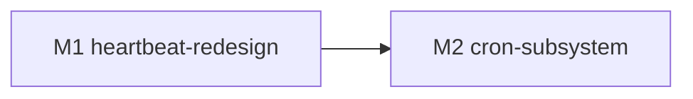

# feat-394: heartbeat/cron 重新设计 — 技术方案

> 对齐: spec.md v1

> Unit branch: `unit/feat-394` (will be created by orchestrator)

## Changelog

- 2026-06-05 (post-acceptance design revision → 新增决策 D + M9): acceptance 测出 **capability↔tool↔prompt 模型三套并存**。feat-394 把 heartbeat/cron 做成平行 ad-hoc（`cron_json`/`heartbeat_json` + CronCard/HeartbeatCard + `ctx.vars` 门控 prompt + gateway 把 cron 注入 `tool_allowlist`），与 feat-379 的 FEATURE_REGISTRY（memory/skill 走 `ctx.flags` + `requires_tool` 联动）不一致，连带三个 bug：①默认工具无法禁用（M7 R5-2 在 inbound_pipeline 强制 merge DEFAULT_TOOL_IDS，allowlist 退化成纯加项）；②`tool_allowlist` 的 mirror/live 分裂（cron 仅运行时注入，IM mirror=`[]`、live=`["cron"]`，前端读 mirror → 工具 pill 全灰）；③Preview full system prompt 漏 cron/heartbeat（promptPreview 只发 features/custom_prompt/tool_ids/skill_ids，不发 cron/heartbeat 开关 → 勾选不变；runtime 实际正确注入）。决策 D：**cron/heartbeat 并入 FEATURE_REGISTRY**（cron `requires_tool="cron"` / heartbeat `requires_tool=None`，prompt 段统一 `ctx.flags` 门控、退役 `ctx.vars`），UX 进 Behavior 的 Features 列表勾选 + 勾后展开各自配置面板，所有工具统一 pill 且默认工具可禁。M_fix1（真白名单：删 R5-2 强制 merge + 删 gateway cron 注入）已落 `unit/feat-394`；新增 **M9-unify-feature-model** 实施其余。openclaw 实证（已核源码）：无 FEATURE_REGISTRY，模型是「prompt 跟工具走」，仅 prompt 段文案逐字照抄不变、结构模型保留本项目 FEATURE_REGISTRY。
- 2026-06-04 (M10): R6-2 awareness 彻底收口 — orchestrator 亲自驱动真内核定位，**推翻"asyncio race"误判**。真根因是三层叠加，缺一不可：(1) `SessionManager.append_turn_message` 硬编码 `parent_uuid=None`，awareness 被写成游离 orphan，被 `JsonlSessionStore.load` 的 parent_uuid 链回溯丢弃，后续 user turn 从旧 tail 延伸永远绕过它；(2) `store.append` 入异步后台 writer 队列、`load` 读磁盘 → 紧随的 load 读不到未落盘的项（这才是被误认作 race 的现象，本质缺一次同步 flush）；(3) runtime `_session_histories` cache-first，turn1 填的缓存不含 out-of-band append。修复：`service.append_message` 读 chain tail 设 parent_uuid + flush 前后各一次；`Kernel.append_message` 调新增的 `runtime.invalidate_session_cache`。该修复对所有 out-of-band append（含 send_message 持久化）通用，非 cron 专用。新增 real-kernel 回归测试 `test_append_message_visible_to_next_turn`（驱动真内核两轮、断言 append 进下一轮 prompt，旧码三处任一未修都挂）——纠正 retro 错误#3：此前所有 awareness 测试用 `_FakeKernelClient` 只记录 append 调用，完全掩盖真实缓存/链/落盘问题。全树 2249 passed。
- 2026-06-04 (M8): round-6 verifier+reviewer fail（R5 全关闭、cron 首次投递成功，暴露尾部运行时 bug）→ 新增 M8-fix-round6。R6-1(blocking) `_IntervalSchedule.due_times_up_to` 用 ceil → 首次触发后 next_due 恒晚于 now → heartbeat/cron 只跑一次再不触发（前轮 live 只验首次故漏；改 floor，但保 round-2 不补跑：大 gap 只跑一次推进到最近边界）；R6-2(major) cron `_append_awareness` 未生效(疑 _resolve_canonical_session_id 返空/BLE001 吞异常)→ 追问 agent 不知；CRITICAL-1 合约白名单 auto_mode_gate.py 703→707 行号失配(M7 插 4 行)→ CI 红。详见 M8-fix-round6/progress.md。
- 2026-06-04 (M7): round-5 fail + orchestrator 亲自端到端 trace cron 执行链 → 新增 M7-fix-round5（一次找全所有剩余接缝，不再逐轮）。关键发现：**cron 的可见 IM 投递从未实现**——`_submit_cron_job` 是纯 fire-and-forget（create_session→submit→return run_id），无 run_context_store 播种 / 无 stream 消费 / 无 observer 接线 / `_append_awareness` 从未被调用；M2 只做了 fire + 未接上的 awareness。完整接缝：R5-1(RunOrigin 无 CRON，submit 走 else→SYSTEM AttributeError)、R6-投递(cron run 需接 feat-393 可见投递链：run_context_store + 消费 stream + observer→node.streaming_delta→IM 可见消息 + run 完成调 _append_awareness)、R5-2(agent 缺 file 工具写不了 HEARTBEAT.md)、R5-3(配置页无 activeHours UI)、R5-4(cron 过期 at 重启重跑)。详见 M7-fix-round5/progress.md。
- 2026-06-03 (M6): round-4 验收 verifier pass / reviewer fail（LLM proxy 起后首次能跑到 cron 执行层）→ 新增 M6-fix-round4。R4-1(blocking) cron_runner 按不存在的 create_session(session_id=) 契约写、_KernelClientShim 实际签名无 session_id → cron 到点执行 TypeError crash(注册✓权限✓触发✓执行✗)；R4-2(major) heartbeat owner_unresolved 投递 skip(疑 reviewer worktree node.user_id 未绑的 env，待 worker 判 code/env)。**最后一轮：proxy 已起，worker 必须亲跑 cron 注册→触发→投递成功(真消息进直聊)才 DONE，并补一条驱动真 _KernelClientShim 的 cron 端到端集成测试堵住"对不存在契约编码"。若仍不收敛则升级人工。** 详见 M6-fix-round4/progress.md。
- 2026-06-03 (M5): round-3 验收 verifier pass / reviewer fail → 新增 M5-fix-round3。cron live 第三轮失败(不同根因)：R3-1(blocking) cron 工具无 check_permissions → 被 auto_mode_gate 拦(blocked_by_hook)；R3-2(major, R2-2 复发) preview 端点 live 仍全显所有段(函数修了但调用方/第二条 preview 入口未接线)；R3-3(minor, 疑 S1.3 回归) heartbeat 25min 不 tick(agents_getter 从空/stale pipeline 读?)。**换打法：fix 必须先起 live 环境、端到端 trace 整链路找全集成接缝、亲跑 live 旅程通过才 DONE** — 详见 M5-fix-round3/progress.md。
- 2026-06-03 (M4): round-2 验收 verifier pass / reviewer fail → 新增 M4-fix-round2。R2-1(blocking) PersistentSessionBindingStore 缺 find_by_kernel_session_id → cron 工具链运行时 AttributeError(test-double 用内存版掩盖)；R2-2(major) assemble_prompt_preview 路径未注入 heartbeat/cron_enabled vars；S1.3 heartbeat 调度器冻结 _agents tuple、关闭开关需重启才生效(改 per-tick 读 live 配置)；R2-3(minor) 高频 heartbeat 与用户消息争用 — 详见 M4-fix-round2/progress.md。round-1 其余项已关闭(config sync 401、prompt vars 运行时路径、tsc、cadence)。
- 2026-06-02 (M3): round-1 验收 fail → 新增 M3-fix-round1。verifier+reviewer 合并出 3 关键 + 3 warning + 2 minor：cron 未接入运行循环(死代码)、heartbeat/cron_enabled 未注入 PromptContext.vars(门控失效)、config sync 无 token_getter(401 开关到不了 gateway)、cron 工具门控未随开关、heartbeat 触发消息未照抄 openclaw、CronCard 缺任务清单+删除、tsc -b 类型断言、cadence select-all — 详见 M3-fix-round1/progress.md。

## 现状分析

### 涉及范围

- `src/personal_assistant/scheduler/heartbeat_scheduler.py` —— 现在读 `HEARTBEAT.md`、**只允许一条调度**（`_load_heartbeat_spec` 第 344 行 `if len(schedule_entries) != 1: raise`），`_IntervalSchedule` 仍是**补跑洪流**版（267-272 行 `while cursor <= now`），`_submit_run` 每 tick 现造 fresh session。本 unit：heartbeat 侧改"单脉冲节律 + 带上下文"，cron 调度逻辑（at/every/cron + 不补跑）从这里抽出/复用。
- `src/personal_assistant/main.py` —— `PollingHeartbeatRunner`（后台 tick 循环）、`run_context_store`（run_id→投递上下文）、`_build_kernel_event_observer`（kernel 事件→`node.streaming_delta`，feat-393 已加 heartbeat 惰性 turn_start 分支）。cron 也要接同一条投递路径。
- `src/agent/products/personal_assistant/prompt_sections.py` —— `_PA_HEARTBEAT`（73-86）是**被动**描述，无 cron、无 agent 自管。本 unit：重写 heartbeat 段（照抄 openclaw 措辞）、新增 cron 工具引导段。
- `src/agent/products/personal_assistant/tools/` —— 只有 `send_message.py`/`web_search.py`。agent 已有 `read/write/edit/bash`（`toolsets.py` DEFAULT_TOOL_IDS）可自管 HEARTBEAT.md；**cron 需新增一个工具**（照抄 openclaw `cron-tool` 的 action/schema/描述）。
- `src/personal_assistant/config/local_store.py` —— `AgentWorkspaceConfig`（per-agent：agent_id/workspace_root/tool_allowlist/system_prompt/custom_prompt，**无** heartbeat 启用/节律字段）；`HeartbeatConfig`（全局，仅 `tick_interval_seconds` 轮询周期）。两开关需在 per-agent 配置上新增字段。
- `src/IM/frontend/src/features/settings/agents/`（`agent-create-page.tsx` / `agent-detail-page.tsx` / `allowlist-selector.tsx` / `pill-selector.tsx`）+ `src/IM/application/config_service.py`（`AgentProfile` CRUD + `ConfigSyncNotifier` 把 profile 变更同步给 gateway）—— **两个开关的 UI 落点**与配置下发链路。
- `docs/NodeGateway-SPEC.md §6`（145-175）—— 现 SPEC："参考 OpenClaw Cron 模型""三种调度""**进程重启后补跑错过的到期任务**"。本 unit 重写 §6（拆 heartbeat/cron 双机制、改"不补跑"）。

### 既有约束

- 产品包（`personal_assistant`）只能 import `agent.sdk`，不得碰 `agent.core`/`agent.platform`（AGENTS.md 依赖方向硬规则）。cron 工具走 `agent.sdk` 工具协议。
- IM 不依赖 `agent`；heartbeat/cron 投递必须经 gateway↔IM 既有 WS 协议（`node.streaming_delta`），不能让 IM 反向调内核。
- 对 `web_relay`，用户可见的 agent 消息**完全由流式 `node.streaming_delta` 创建**——cron/heartbeat 的结果"出现在会话"＝走这条流式路径（不能走 no-op 的 `send_text`）。
- IM `events` 表外键硬引用 `messages` 表——投递必须基于真实 message 行（M138 合成 FK 旁路崩溃的教训，feat-393 已纠正）。
- 配置真源在 IM（`AgentProfile`），经 `ConfigSyncNotifier` + `profile_version` 乐观锁同步到 gateway；两开关状态必须从 IM 侧流到 gateway 调度器。

### 可复用能力

- **feat-393 投递闭环（PR #74）**——`node.streaming_delta` 流式 + 惰性建泡 + `turn_start{to_user_id}` 解析 (owner,agent) canonical 直聊 + NO_REPLY/空静默。**heartbeat 与 cron 的结果投递都复用这一条**，本 unit 不重做投递。
  - **分支策略（用户定）**：feat-393 **不单独合并、将被 feat-394 取代/废弃**。`unit/feat-394` 直接从 **feat-393 分支 tip** 起，全部工作在 feat-394 完成，最终只合并 feat-394。即 feat-394 = 在 feat-393 既有改动之上继续，而非"依赖一个会先合的 PR"。
- **feat-393 决策 4 的 `:heartbeat` 稳定 session** —— 当前 heartbeat 跑在**隔离** session（不带 canonical 直聊上下文）。feat-394 spec 要 heartbeat"带你的上下文"，正是 feat-393 风险段所列"后续 unit 把汇报接回 canonical session"的 follow-up——**本 unit 改这条决策**。
- **现有 `_AtSchedule`/`_IntervalSchedule`/`_CronSchedule` + cron 字段解析器**（`_parse_cron` 等）—— at/every/cron 解析可复用/改写给 cron 子系统；但 `_IntervalSchedule` 的补跑洪流逻辑要改成 openclaw 的"只排下一未来时隙"。
- **openclaw 逐字 prompt 源（按用户要求照抄 + 代码注释标来源）**：
  - heartbeat 默认 prompt：`openclaw/src/auto-reply/heartbeat.ts:14` `HEARTBEAT_PROMPT`（"Read HEARTBEAT.md if it exists…reply HEARTBEAT_OK."）。
  - heartbeat 系统段：`openclaw/src/agents/system-prompt.ts:124-138` `buildHeartbeatSection`（"## Heartbeats … reply exactly: HEARTBEAT_OK …"）。
  - cron 工具描述/schema：`openclaw/src/agents/tools/cron-tool.ts:524-598`（actions/JOB SCHEMA/SESSION TARGET/SCHEDULE TYPES/PAYLOAD/DELIVERY/CONSTRAINTS）。
  - cron 不补跑调度：`openclaw/src/cron/schedule.ts:65` `computeNextRunAtMs`（every 跳下一时隙、cron 取下一未来点、过期 at 不跑）。

### 相关历史

- **feat-393**（heartbeat 结果回发 IM；PR #74，分支保留待并）—— 本 unit 的直接前置，复用其投递闭环，并修订其"heartbeat 隔离 session"决策。
- **M138 / refactor-387** —— heartbeat→IM 汇报的旧坑（合成 FK 旁路崩溃）与健壮性加固，feat-393 已收口；本 unit 沿用其"必须打真实 FK message 路径"硬约束。

## 架构总览

一句话：**两套独立调度（heartbeat 单脉冲 / cron 多任务）共用 feat-393 那一条流式投递闭环；agent 自管两侧任务（HEARTBEAT.md 走文件工具、cron 走新 cron 工具）；IM 配置页两开关经 AgentProfile 同步到 gateway 调度器。** 区别本质：heartbeat 跑在 owner 直聊会话上（带上下文），cron 跑在隔离会话里（无上下文）。

Before（现状）：单调度扁平 `HEARTBEAT.md`（只许 1 条、补跑洪流、fresh session），无 cron、无自管、无 per-agent 开关。

After：

```
IM agent 配置页  ──[两开关: heartbeat{enabled,every} / cron{enabled}]──▶ AgentProfile
                                                  │ ConfigSyncNotifier(profile_version)
                                                  ▼
                                   gateway AgentWorkspaceConfig (新增 heartbeat/cron 字段)
                                                  │
              ┌───────────────────────────────────┼───────────────────────────────────┐
              ▼                                    ▼                                    ▼
   ┌─────────────────────┐         驱动调度（下方两套）              ┌──────────────────────────────┐
   │ 驱动主 agent 能力    │                                          │（同一份开关也喂给调度器）      │
   │ 门控注入提示词:      │                                          └──────────────────────────────┘
   │  · heartbeat 段(开)  │
   │  · cron 引导段(开)   │   ← 让 agent 知道机制存在 + 怎么用 + 路由(确定性定时→cron / 带上下文盯梢→heartbeat)
   │  · 路由段(都开)      │
   │ 门控工具:            │
   │  · cron 工具(cron 开)│   ← 新增；heartbeat 复用已有 read/write/edit 改 HEARTBEAT.md
   └─────────────────────┘
                    ┌─────────────────────────────┴─────────────────────────────┐
                    ▼                                                             ▼
        ┌───────────────────────┐                                   ┌───────────────────────┐
        │ Heartbeat（单脉冲）    │                                   │ Cron（多任务）         │
        │ 每 agent 1 条节律 every │                                   │ 每 agent N 条 job      │
        │ 读 HEARTBEAT.md 判断    │                                   │ at/every/cron + 指令   │
        │ 自管: 文件工具改 .md    │                                   │ 自管: cron 工具 CRUD   │
        │ 持久化: workspace .md   │                                   │ 持久化: cron jobs 存储 │
        └───────────┬───────────┘                                   └───────────┬───────────┘
                    │ submit(origin=heartbeat)                                   │ submit(origin=cron)
                    │ session = owner canonical 直聊会话（带上下文）              │ session = 隔离 cron:<jobId>（无上下文）
                    └──────────────────────────┬────────────────────────────────┘
                                               ▼
                  统一 Polling 调度 tick（扩展现 PollingHeartbeatRunner）
                   · 不补跑：重启只排下一未来时隙（openclaw computeNextRunAtMs 语义）
                                               ▼
                  feat-393 投递闭环（复用，不重做）
                   run → _await_terminal 消费 kernel.stream → kernel_event_observer
                    → 惰性 turn_start{to_user_id=owner} → IM 解析/建 canonical 直聊
                    → message_delta/completed 扇出；NO_REPLY/空 → 静默
                                               ▼
                          owner 与该 agent 的 canonical 直聊（IM）
```

普通聊天路径不动。heartbeat 相对 feat-393 的升级＝**会话绑定从隔离 `:heartbeat` 改为 owner canonical 直聊会话**（带历史）。cron 是**全新子系统**，但调度的"到点判定/不补跑"与投递分别复用现有 schedule 解析与 feat-393 闭环。

## 关键决策

### 决策 1: 分支策略——feat-394 取代 feat-393，从 feat-393 分支 tip 起

- **选择**: feat-393（PR #74）不单独合并、将被取代；`unit/feat-394` 从 feat-393 分支 tip 起，全部工作在 feat-394 完成，最终只合并 feat-394。
- **理由**: feat-394 复用 feat-393 的投递闭环且要修订其决策4（heartbeat 会话绑定），同分支线性演进最干净，避免"先合一个会被改写的 PR"。
- **拒绝**: 先合 feat-393 再从 main 起（#74 部分实现会被本 unit 改写，先合无意义）。
- **风险**: feat-393 的 2 个 macOS 预存失败（issue #75）随分支带入，非本 unit 引入；CI 以 Linux 为准。

### 决策 2: 两套机制按"是否承载会话上下文"分界（采纳 openclaw，砍定义性反向开关）

- **选择**: heartbeat＝带 owner 直聊上下文的单脉冲主动唤醒；cron＝无上下文的多任务定时执行。
- **理由**: 用户定义（澄清 Q1/Q4）；与 openclaw 一致（heartbeat=main-session turn / cron isolated）。
- **拒绝**: cron 的 `main`/`current`/`session:<id>` 带上下文变体、heartbeat 的 `isolatedSession` 反向开关——给反向开关＝自毁"两套"定义边界。
- **风险**: 用户偶尔想要"带上下文的周期任务"时只能用 heartbeat 表达；接受。

### 决策 3: heartbeat 跑在 owner canonical 直聊的 kernel session 上（改 feat-393 决策4）

- **选择**: heartbeat run 不再跑在隔离 `:heartbeat` session，改为跑在 (owner,agent) canonical 直聊那条 kernel session（＝openclaw "main-session turn"，带历史）；首次尚无直聊时无上下文跑、首条汇报创建直聊后续即带。配套照抄 openclaw：`HEARTBEAT_OK` 静默 token（取代 feat-393 复用的 `NO_REPLY`）、空文件跳过（`isHeartbeatContentEffectivelyEmpty`）、heartbeat 轮询 turn 的 transcript 修剪 + 不延长 session 存活、主会话忙则跳过本 tick、activeHours 活跃时段、HEARTBEAT.md `tasks:` 多子节律（每 task 独立 interval，状态从"每 agent last_due"扩成"每 agent 每 task last_due"）。
- **理由**: spec 要 heartbeat"带你的上下文、记得聊过啥"；feat-393 风险段已把这列为后续 unit 的 follow-up。
- **拒绝**: 维持隔离 session（feat-393 现状，用户追问汇报时 agent 失忆）。
- **风险**: 轮询 turn 进直聊会话需修剪，否则静默轮询噪声堆积污染上下文；与普通聊天并发需靠"忙则跳过"避免同会话双 run。

### 决策 4: cron 子系统——多任务隔离执行、不补跑、per-agent workspace 持久化、agent 经 cron 工具自管

- **选择**: 新建 cron 子系统：每 agent N 条具名 job（at/every/cron + 指令 + enabled），跑在隔离会话（origin=cron，无上下文）、结果经 feat-393 闭环投递 + 决策 C-awareness 承接；一次性 `at` 跑完自动删（delete-after-run）。**调度不补跑**——重启只排下一未来时隙（照抄 openclaw `computeNextRunAtMs`：every 跳 `ceil(elapsed/everyMs)`、cron 取下一未来点、过期 at 不跑）。持久化落 **per-agent workspace**（`<workspace>/.nanoassistant/cron/jobs.json` 定义 + 运行态分离），呼应 SPEC §7"每 agent 一个 workspace 承载差异"。agent 经**新增 cron 工具**（照抄 openclaw cron-tool 的 actions/schema/描述：add/list/update/remove/run/runs）自管。
- **理由**: 用户要"多条、agent 自管、定时做固定事"；per-agent workspace 内聚、删 agent 即清、跨 agent 不串。
- **拒绝**: gateway 全局单一 jobs 存储（跨 agent 混在一起、删 agent 残留）；复用 heartbeat 单调度（无法多任务）。
- **风险**: cron 工具/调度新增量较大（见 milestone 估算）；现有 `_IntervalSchedule` 补跑洪流逻辑要改成不补跑。

### 决策 5: 两开关 = per-agent 能力门控，同时驱动「调度器 + 主 agent 门控提示词 + 门控 cron 工具」

- **选择**: IM agent 配置页新增 heartbeat{enabled, every, activeHours} / cron{enabled} 两块 → `AgentProfile` 新增字段 → `ConfigSyncNotifier` + `profile_version` 同步到 gateway `AgentWorkspaceConfig` 新增字段。开关状态同时：①门控调度器是否对该 agent 跑；②门控 PA prompt 段（heartbeat 段 / cron 引导段 / 都开时路由段）的 `enabled_when`；③门控 cron 工具是否进该 agent 工具表。
- **理由**: openclaw 即 per-agent 启用（"只有挂 heartbeat 块的 agent 才跑"）；agent 须知机制存在才会用（否则"每天3点提醒"无从下手）。
- **拒绝**: 全局开关（无法 per-agent）；只驱动调度不改 prompt/工具（agent 不知道能力存在）。
- **风险**: 配置同步链路要确保两字段从 IM 流到 gateway 调度器与 prompt context；只 personal_assistant 产品启用（见决策 7）。

### 决策 6: prompt / cron 工具描述逐字照抄 openclaw，代码注释标来源（用户硬要求）

- **选择**: heartbeat 默认 prompt（`openclaw/src/auto-reply/heartbeat.ts:14`）、heartbeat 系统段（`openclaw/src/agents/system-prompt.ts:124-138`）、cron 工具描述/schema（`openclaw/src/agents/tools/cron-tool.ts:524-598`）逐字移植；每处代码注释写明 openclaw 源文件:行，`Provenance:` 风格（与现有 `prompt_sections.py` 注释惯例一致）。
- **理由**: 用户明确要求"prompt 从 openclaw 抄过来，写代码时注释到代码中说明来源"。
- **拒绝**: 自行改写措辞（丢失 openclaw 经验证的行为约定，如 HEARTBEAT_OK 剥离规则）。
- **风险**: openclaw 措辞含其专有约定（如 `tasks:` 块格式），移植时只取与本 unit 能力匹配的部分，多渠道/外部触发相关措辞不带入。

### 决策 7: 仅 personal_assistant 产品落地，coding_cli 不引入

- **选择**: 调度器、PA heartbeat/cron prompt 段、cron 工具均归 personal_assistant 产品；coding_cli 产品不挂这些段、不注册 cron 工具、不跑调度。
- **理由**: 用户指定只 gateway 落地；heartbeat/cron 是个人助理的"主动性"能力，与 coding CLI 场景无关。
- **拒绝**: 把 cron 工具放进 `agent.sdk` 通用层默认启用（会泄漏到 coding_cli）。
- **风险**: cron 工具若注册在共享工具表，需确保 coding_cli 的 toolset 不包含它；prompt 段用 PA 专属 `PA_SECTIONS`，天然隔离。

### 决策 C-awareness: cron 隔离执行后的"承接"——结果文本以 System(untrusted) 注入直聊会话，隔离过程丢弃

参照 openclaw（已逐环引源核实，issue #52136 专门处理）：

- **运行隔离**：isolated cron 在独立会话 `cron:<jobId>` 跑，不读用户对话；跑完其内部 transcript 丢弃（一次性 `at` job 且 `deleteAfterRun` 时 `sessions.delete{deleteTranscript:true}`，删的是 cron 自己的会话，`delivery-dispatch.ts:465-478`）。
- **承接注入**：投递结果后 `queueCronAwarenessSystemEvent`（`delivery-dispatch.ts:335`）只取**最终结果文本** → `enqueueSystemEvent(text, {sessionKey:主会话, trusted:false})`（`system-events.ts:90`）推进主会话事件队列。
- **下一轮消费**：用户下一条普通消息回复时，reply 路径 `auto-reply/reply/session-system-events.ts:86` `drainSystemEventEntries` 取出，格式化为一行 `System (untrusted): [ts] <结果文本>` 并入该轮模型输入。
- 由此**那一轮 LLM 实际收到** = 主会话既有历史回放（受正常 compaction / 会话重置约束）+ 一行 `System(untrusted)` 的 cron 结果文本 + 用户新消息；**收不到** cron 隔离运行的推理/工具过程。
- openclaw 该队列为**内存、一次性 drain、不持久化**（进程在下条消息前重启则该 awareness 丢失）。

**映射到 nano**：

- cron 走隔离会话（origin=cron）执行 → 结果经 feat-393 投递闭环落到 owner canonical 直聊（用户可见消息）。
- 同一结果文本以 **System(untrusted) 旁注**进入该 canonical 直聊的 **kernel session**，供用户下一轮承接；cron 隔离会话内部 turn 不进直聊会话。
- 这同时补掉 feat-393 决策4 的已知坑（直聊会话缺汇报历史、用户追问时 agent 无上下文）。

- **选择**: 采纳 openclaw 的"结果文本注入、隔离过程丢弃、标 untrusted"语义。
- **nano 落地子选择（持久化方式）**: openclaw 是内存一次性队列（重启丢）。nano 的 kernel session 是 JSONL 持久化模型——倾向**把这条 System(untrusted) 旁注直接 append 进直聊会话 JSONL**（nano 原生、跨重启不丢、比 openclaw 内存队列更稳），而非另造内存队列。语义（untrusted 标记、只注入结果文本）与 openclaw 一致，仅持久化介质按 nano 架构最优选。
- **拒绝**: ①把 cron 隔离运行整段 transcript 接进直聊会话（泄漏隔离过程、污染上下文，违背"无上下文执行"定义）；②只投递 IM 可见消息、不进 kernel session（＝feat-393 决策4 的坑，用户追问时 agent 失忆）。
- **风险**: System(untrusted) 旁注措辞需让模型当"背景已发生的事实"读、而非可执行指令；与 heartbeat（决策②直接跑在直聊会话、turn 天然在 transcript）的注入风格要统一表述，避免两套语义。

### 决策 D-feature-model: heartbeat/cron 并入 FEATURE_REGISTRY，与 memory/skill 同一模型（post-acceptance 修订）

背景：acceptance 暴露 capability↔tool↔prompt 三套机制并存（详见 Changelog 2026-06-05）。本决策**修订**原"两开关=能力门控、同时驱动调度器+提示词+cron工具门控"的 ad-hoc 落地，收敛到 feat-379 决策 7 的 FEATURE_REGISTRY 单一模型。spec 的用户场景（heartbeat/cron 的可观察行为）不变，仅改内部建模与配置 UX 一致性。

- **选择**: cron/heartbeat 注册进 `src/agent/core/agent/prompt_sections/feature_registry.py` 的 `FEATURE_REGISTRY`：
  - cron → feature `cron_scheduling`：`requires_tool="cron"`、`sections=("pa.cron",)`、`default_on=False`、`layer="product"`。
  - heartbeat → feature `heartbeat`：`requires_tool=None`、`sections=("pa.heartbeat",)`、`default_on=False`（opt-in，用户确认；feat-379 原"固定按场景必加"由 feat-394 改为 per-agent，本决策定 opt-in 与 cron 统一）。
  - **prompt 段门控统一到 `ctx.flags`**（经 `resolve_flags_from_metadata`），**退役 `_PA_HEARTBEAT`/`_PA_CRON` 的 `ctx.vars["*_enabled"]` 读法**这第三套；`_PA_CRON_ROUTING` 的 `_both_enabled` 改读 flags。prompt 段**文案逐字不变**（openclaw provenance 保留）。
  - **特性→工具不变量**（沿用决策 7）：勾 cron 特性 → `cron` 工具即时进 `tool_allowlist` 并落库（复用前端现有 memory/skill 同款联动，cron 进 registry 后白拿）；移除 cron 工具 → 取消 cron 特性。heartbeat 无 tool。
  - **存储**：enable 收进 `AgentProfile.features` dict（`features["cron_scheduling"]`/`features["heartbeat"]`）；**`cron_json` 退役**（cron 配置仅 enabled）；heartbeat 的 `{every, active_hours}` 仍存（仅 `enabled` 移出到 features）。gateway `AgentWorkspaceConfig` 的 `cron_enabled`/`heartbeat_enabled` 由 features 派生（或调度器直接读 flags）。老 profile 无 features 键 → 取 registry `default_on`（backward compat）。
  - **tool_allowlist 真白名单**（M_fix1 已落 unit 分支）：非空=精确这些（**默认工具可禁**）、空=产品默认集；`resolve_effective_tool_allowlist` **去掉 `cron_enabled→append cron`**（cron 现在是经特性联动真正落库的 allowlist 成员，不再由 gateway 运行时叠加）。
  - **capabilities.tools 带 `default_on`**：`upstream_reporter._build_tool_names` 上报 `{name, description, default_on}`（DEFAULT_TOOL_IDS→true、OPTIONAL→false）；IM `coerce_allowlist_options` 透传；前端据此渲染有效态（空 allowlist 显示默认工具为选中、可禁用）。
  - **preview**：cron/heartbeat 经 `features` 契约自动进 `promptPreview`，勾选即变（修掉"preview 撒谎"）。
- **UX**: heartbeat/cron 作为复选项进 Behavior 卡的 **Features 列表**（与 memory/skill 并列）；勾选后**下方展开**各自配置面板（heartbeat→cadence `every` + activeHours；cron→Scheduled tasks 列表/删除）。CronCard/HeartbeatCard 的**独立 enable 开关取消**，特性复选框即 enable；卡片退化为"勾选后出现"的配置面板。
- **理由**: 统一到项目既有 FEATURE_REGISTRY 单一模型，消除三套并存；feature→tool 不变量 / preview 反映 / 默认可禁 全部一致白拿。
- **拒绝**: ①保留平行 ad-hoc（三套机制并存——mirror/live 分裂、preview 漏、默认不可禁的根）；②改用 openclaw"prompt 跟工具走"（要连 memory/skill 一起重做、丢"行为特性"区分、偏离 feat-379 已有投资）。
- **风险**: 退役 `cron_json` + `ctx.vars` 门控触及 feat-394 既有 M2–M8 的 cron/heartbeat 存储与门控测试，须同步改；heartbeat `enabled` 从 `heartbeat_json` 迁到 features，注意老 profile backward compat（无 features 键→`default_on`）；前端卡片改"勾后展开"需同时处理 create/detail 两页。

## 接口与数据流

> **决策 D 修订**：下文原"两开关字段流"按 ad-hoc 落地描述（cron_json/heartbeat_json + ctx.vars + cron 注入 allowlist）。M9 按决策 D 改为：enable 走 `features` dict、prompt 段门控读 `ctx.flags`、cron 工具经特性→requires_tool 联动落 tool_allowlist、heartbeat 的 every/active_hours 仍单独存。以下保留作历史，实施以决策 D 为准。

**配置：两开关字段流（IM → gateway）**
- IM `AgentProfile` 新增：`heartbeat: {enabled: bool, every: str, active_hours?: {start, end, timezone?}}`、`cron: {enabled: bool}`。
- IM 配置页（`agent-create-page.tsx`/`agent-detail-page.tsx`）新增两块开关 UI；`im-agent-config-api.ts` 带上新字段。
- `ConfigService` 更新 profile（`profile_version` 乐观锁）→ `ConfigSyncNotifier` 推送 → gateway `AgentWorkspaceConfig` 新增对应字段（`local_store.py`）。
- gateway 消费点：①调度器读 `enabled`/`every`/`active_hours`/cron.enabled 决定是否跑；②PA prompt 组装把 `heartbeat_enabled`/`cron_enabled` 注入 `PromptContext.vars`，驱动段 `enabled_when`；③该 agent 工具表按 `cron_enabled` 增删 cron 工具。

**Heartbeat 调度/执行（gateway）**
- `HeartbeatScheduler`：单脉冲节律 `every` + 可选 `tasks:` 多子节律；状态 `每 agent → 每 task last_due`（不补跑：`_IntervalSchedule` 改 openclaw `computeNextRunAtMs` 语义）。activeHours：tick 时判窗口外则跳过。
- 执行：submit(origin=heartbeat) 跑在 (owner,agent) canonical 直聊 kernel session；空文件 / `HEARTBEAT_OK` / 空内容 → 静默（复用 feat-393 惰性建泡）；轮询 turn 在该 session 做 transcript 修剪、不延长存活；主会话忙 → 跳过本 tick。

**Cron 调度/执行（gateway，新增）**
- 存储：`<workspace>/.nanoassistant/cron/jobs.json`（定义）+ 运行态分离文件；job = `{id, name, schedule:{kind:at|every|cron,...}, instruction, enabled, delete_after_run}`。
- 调度：统一 polling tick 评估每 agent 的 due jobs（不补跑，下一未来时隙）；due → submit(origin=cron) 跑隔离会话 `cron:<jobId>`（无上下文）。
- 工具：新增 `cron` 工具（PA 专属），actions add/list/update/remove/run/runs，schema 照抄 openclaw（裁剪掉 sessionTarget 变体/多渠道 delivery/webhook，固定 isolated + 投 owner 直聊）。
- 投递 + 承接：结果经 feat-393 闭环投 owner 直聊；并按决策 C-awareness 把结果文本以 `System(untrusted)` append 进直聊会话 JSONL；一次性 `at` 跑完删 job。

**投递闭环（复用 feat-393，不改协议）**
- heartbeat/cron run 事件 → `kernel_event_observer` → `node.streaming_delta`（`turn_start{to_user_id=owner}` 惰性解析 canonical 直聊）→ IM `EventBridge` 建真实 message 行扇出。owner = `config.node.user_id`。

## 风险与回退

- **heartbeat 跑在直聊会话 → 上下文污染**：静默轮询的触发 prompt/`HEARTBEAT_OK` 若不修剪会堆积。缓解：决策3 的 transcript 修剪 + 不延长存活；补"静默轮询后该会话 LLM 上下文无新增噪声"的断言。
- **heartbeat 与普通聊天并发同会话**：用户正在直聊、heartbeat tick 撞上 → 双 run 抢同一 session。缓解：主会话忙则跳过本 tick（照抄 openclaw busy-skip）。
- **不补跑的副作用**：长时间停机后只跑一次，期间该报的中间态丢失。接受（spec 已定"不刷屏"优先；周期机制下个 tick 自然补位）。
- **cron 工具泄漏到 coding_cli**：缓解：cron 工具只进 PA toolset，coding_cli toolset 显式不含；补"coding_cli 无 cron 工具/无 heartbeat 段"的断言。
- **awareness 注入被当指令执行**：`System(untrusted)` 措辞要让模型当"已发生的事实"读。缓解：照抄 openclaw untrusted 前缀语义 + 段内说明。
- **配置同步漏字段**：两开关字段没流到 gateway → 开关无效。缓解：补"配置页开 heartbeat → gateway 调度器确实对该 agent 跑"的端到端断言。
- **feat-393 macOS 预存失败（issue #75）**：随分支带入，非本 unit 引入；以 Linux CI 为准。
- **回滚**：本 unit 在 feat-394 分支，未合 main 前 `git` 丢弃分支即回到 feat-393 tip；已合则 `git revert` 范围集中在 PA 调度/工具/prompt + IM 配置页两块 + AgentProfile 字段。

## Runbook for Reviewer

| 服务 | 停止命令 | 启动命令 | 健康检查 |
|---|---|---|---|
| IM 服务 | `kill "$(cat .im.pid)" 2>/dev/null; rm -f .im.pid` | `IM_JWT_SECRET="demo-jwt-secret-for-feat340-testing" PYTHONPATH=src python -m uvicorn IM.app:app --host 127.0.0.1 --port "$IM_PORT" > .im.log 2>&1 & echo $! > .im.pid` | `curl -s http://127.0.0.1:$IM_PORT/` 返回 200；WS `/im/ws/gateway` 可连 |
| Gateway（个人助手） | `kill "$(cat .gateway.pid)" 2>/dev/null; rm -f .gateway.pid`（须 `--foreground` 起） | `PYTHONPATH=src python -m personal_assistant.main --config "$WT_CFG" --im-service-url "http://127.0.0.1:$IM_PORT" --foreground --auto-bind > .gateway.log 2>&1 & echo $! > .gateway.pid` | `.gateway.log` 出现 `auto-bound to IM`；配置页开 heartbeat/cron 后对应调度生效 |
| IM 前端（如改 UI 需本地验） | `kill "$(cat .imfe.pid)" 2>/dev/null; rm -f .imfe.pid` | `cd src/IM/frontend && npm run dev > ../../../.imfe.log 2>&1 & echo $! > ../../../.imfe.pid` | 配置页能看到 heartbeat/cron 两开关并保存 |

> 验收建议：配置页给某 agent 开 heartbeat(every 10s)+写 HEARTBEAT.md 一条会产出的关注项，验"带上下文汇报进直聊"；开 cron，对 agent 说"每 30s 报一次当前时间"验 agent 自建 job + 到点投递 + 之后追问该结果时 agent 知道（awareness 注入）；停 gateway 数分钟再起验"不补跑刷屏"。worktree e2e 用 `scripts/e2e-up.sh`。

## Milestones

拆 2 个（垂直按特性切）。触发条件＝**工作量超单 worker 窗口**（粗估 heartbeat ~1100 行 / cron ~1400 行，合计 ~2500 行 > 800 行门槛）。两者改 `main.py`/`prompt_sections.py`/`AgentWorkspaceConfig`/IM 配置页同一批文件，**文件高度重叠不能并行**；M1 先建"两开关同步链路 + prompt 门控机制 + 跑直聊会话投递接法"共享地基并合入 unit 分支，M2 的 cron 复用之——故 M2 依赖 M1、串行（同并行组 A，依赖强制顺序，分阶段验证）。



| ID | 标题 | 依赖 | 并行组 | 范围 | 退出标准 |
|---|---|---|---|---|---|
| feat-394-M1 | heartbeat-redesign | — | A | `src/personal_assistant/scheduler/heartbeat_scheduler.py`（单脉冲+`tasks:`多子节律+per-task状态+不补跑+activeHours）、`src/personal_assistant/main.py`（heartbeat run 跑 canonical 直聊 session、transcript 修剪、忙跳过、`HEARTBEAT_OK` 静默；observer/runner 复用 feat-393）、`src/agent/products/personal_assistant/prompt_sections.py`（重写 `_PA_HEARTBEAT` 段照抄 openclaw + prompt 门控 `enabled_when`）、`src/personal_assistant/config/local_store.py`（AgentWorkspaceConfig heartbeat 字段）、`src/IM/application/config_service.py`+`src/IM/frontend/.../agents/`（AgentProfile heartbeat 字段+配置页 heartbeat 开关 UI+同步）、`docs/NodeGateway-SPEC.md §6`（heartbeat 部分重写）、相关 tests | `[reviewer]` 配置页开 heartbeat 后带上下文主动汇报、记得上下文（Req-agent自管heartbeat / Scenario-到点带上下文主动冒泡且记得上下文）；`[reviewer]` 无事静默（Scenario-无可汇报内容则静默）；`[reviewer]` 不同关注项不同频率（Scenario-多子节律）；`[reviewer]` activeHours 外不打扰（Scenario-活跃时段外不打扰）；`[reviewer]` 开关 per-agent 启用/停用/未启用不跑（Req-两个开关 全部 heartbeat 相关 Scenario）；`[reviewer]` 汇报落 owner canonical 最旧直聊、首次无直聊自动新建（Req-结果投递到 canonical 直聊 两 Scenario，复用 feat-393）；`[worker]` heartbeat prompt/系统段与 openclaw 逐字一致且注释标来源（单测）；`[worker]` 静默轮询后该会话 LLM 上下文无噪声堆积 + 忙会话跳过 的断言；`[worker]` `_IntervalSchedule` 不补跑（重启只排下一时隙）单测；`[worker]` 配置页开关→gateway 调度器对该 agent 跑 的端到端断言；`[worker]` `pytest -m "not e2e"` 全绿（含 IM_service）+ 前端 vitest 绿 |
| feat-394-M2 | cron-subsystem | feat-394-M1 | A | `src/personal_assistant/scheduler/`（新增 cron 调度：at/every/cron 不补跑、per-task 状态）、`<workspace>/.nanoassistant/cron/` 持久化（jobs.json 定义+运行态分离）、`src/agent/products/personal_assistant/tools/cron.py`（新增 cron 工具照抄 openclaw schema/描述）、`toolsets.py`（cron 工具按 cron_enabled 门控、coding_cli 不含）、`src/personal_assistant/main.py`（cron run 隔离会话执行+`System(untrusted)` awareness append 进直聊会话 JSONL+delete_after_run）、`prompt_sections.py`（cron 引导段+都开路由段）、`local_store.py`/`config_service.py`/IM 配置页（cron 开关，复用 M1 同步/门控机制）、`docs/NodeGateway-SPEC.md §6`（cron 部分）、相关 tests | `[reviewer]` 配置页开 cron 后 agent 自建定时任务（Req-agent自管cron / Scenario-口述定时任务agent注册一条）；`[reviewer]` 多任务并存独立触发（Scenario-同时挂多条）；`[reviewer]` 到点无上下文执行并投递直聊（Scenario-到点执行固定任务并发回直聊）；`[reviewer]` 配置页查看/删任务（Scenario-配置页查看并手动删除）；`[reviewer]` 重启不补跑刷屏 + 过期 at 不补（Req-重启后不补跑积压 两 Scenario）；`[reviewer]` cron 结果发后追问该结果时 agent 知道（决策 C-awareness 的用户可观察面：承接对话）；`[worker]` cron 工具 schema/描述与 openclaw 逐字一致且注释标来源（单测）；`[worker]` cron 不补跑 `computeNextRunAtMs` 语义单测；`[worker]` awareness 以 `System(untrusted)` append 进直聊会话 JSONL、隔离 run 内部 turn 不进 的断言；`[worker]` coding_cli 无 cron 工具/无 heartbeat·cron prompt 段 的隔离断言；`[worker]` `pytest -m "not e2e"` 全绿（含 IM_service）+ 前端 vitest 绿 |
| feat-394-M3 | fix-round1 (post-acceptance fix, round 1) | feat-394-M2 | A | `src/personal_assistant/main.py`（接 cron tick 进 polling runner）、`src/agent/core/agent/runtime.py`+turn 构建/`assemble_prompt_preview`（注入 heartbeat_enabled/cron_enabled 进 PromptContext.vars）、`src/personal_assistant/main.py`（im_config_sync_client 传 token_getter）、`toolsets`/工具门控（cron_enabled→cron 工具）、`heartbeat_scheduler.py`（_build_heartbeat_message 照抄 openclaw HEARTBEAT_PROMPT）、`src/IM/frontend/.../agents/`（CronCard 任务清单+删除、cadence select-all、tsc -b 类型修）、相关 tests | `[reviewer]` 配置页开 heartbeat→agent 真被唤醒带上下文汇报（端到端，Req-agent自管heartbeat）；`[reviewer]` 开 cron→到点真触发执行投递（端到端，Req-agent自管cron + 重启不补跑）；`[reviewer]` 配置页查看并删除 cron 任务（Scenario-配置页查看并手动删除）；`[reviewer]` 关闭开关即停用（Scenario-关闭开关即停用）；`[worker]` cron tick 接入运行循环的集成测试（gateway tick→cron job 触发）；`[worker]` heartbeat/cron_enabled 注入 vars→prompt 门控按开关生效 的测试；`[worker]` config sync 带 token_getter、token 刷新后不 401 的测试；`[worker]` cron_enabled→cron 工具进 agent 工具表 的测试；`[worker]` _build_heartbeat_message 与 openclaw HEARTBEAT_PROMPT 逐字一致单测；`[worker]` 前端 tsc -b 通过 + vitest 绿 + pytest -m "not e2e" 全绿 |
| feat-394-M4 | fix-round2 (post-acceptance fix, round 2) | feat-394-M3 | A | `src/personal_assistant/gateway/session_keys.py`（PersistentSessionBindingStore 补 find_by_kernel_session_id，对齐内存版）、cron 工具链测试改用持久版、`assemble_prompt_preview` 所在文件（注入 heartbeat/cron_enabled vars）、`src/personal_assistant/main.py`/`heartbeat_scheduler.py`（调度器 per-tick 读 live agent 配置，关闭即停用免重启）、busy-skip 争用缓解、相关 tests | `[reviewer]` 开 cron→agent 自建/列出/删除任务全链路真跑通(S3.1~S3.5)、CronCard 显示任务并能删；`[reviewer]` 到点真触发执行投递 + awareness 追问；`[reviewer]` 关闭 heartbeat/cron 开关后免重启即停用(S1.3)；`[reviewer]` prompt preview 受开关控制(R2-2)；`[worker]` find_by_kernel_session_id 在 PersistentSessionBindingStore 的单测 + cron 工具链用**生产持久版**跑通的集成测试；`[worker]` assemble_prompt_preview 注入 vars 的测试；`[worker]` 调度器 per-tick live 读、toggle off 下一 tick 不跑 的测试；`[worker]` pytest -m "not e2e" + tsc -b + vitest 全绿 |
| feat-394-M5 | fix-round3 (post-acceptance fix, round 3) | feat-394-M4 | A | cron 工具 `check_permissions`（cron_enabled 时 allow，过 auto_mode_gate）、preview 端点 handler/第二入口接线（真把 agent 开关传到 assemble_prompt_preview）、heartbeat 调度器 agents_getter live tick 回归修复（25min 不 tick）、端到端 trace 整链路找全集成接缝、相关 tests | `[reviewer]` **cron 完整 live 旅程 S3.1~S3.5 真跑通**（注册→jobs.json→到点触发→投递→awareness→删除）；`[reviewer]` heartbeat 真 tick + 唤醒（回归）；`[reviewer]` 关闭开关免重启停用；`[reviewer]` prompt preview 受开关控制（live 4 组合不同）；`[worker]` **亲起 live 环境跑通全旅程并贴真证据后才 DONE**；`[worker]` cron 工具过权限门的测试 + preview 端点级测试（非仅函数级）+ heartbeat tick live 读测试；`[worker]` pytest -m "not e2e" + tsc -b + vitest 全绿 |
| feat-394-M6 | fix-round4 (post-acceptance fix, round 4) | feat-394-M5 | A | `src/personal_assistant/scheduler/cron_runner.py` + `src/personal_assistant/main.py`（cron 会话创建对齐真实 _KernelClientShim.create_session API：去掉不支持的 session_id 或让 kernel 支持指定 id；隔离 fresh session、跟踪返回 id、跑后清理）、owner 解析 code/env 判定、新增驱动真 shim 的 cron 端到端集成测试、相关 tests | `[reviewer]` **cron 完整 live 旅程 S3.1~S3.5 真跑到投递成功**（真消息进直聊）；`[reviewer]` heartbeat 带上下文唤醒真投递（owner 已绑前提下）；`[worker]` **proxy 已起，亲跑 cron 注册→触发→投递成功、贴真消息证据后才 DONE**；`[worker]` cron run 路径走**真 _KernelClientShim**（非 stub）的端到端集成测试；`[worker]` owner_unresolved 判定 code vs env 并说明；`[worker]` pytest -m "not e2e" + tsc -b + vitest 全绿 |
| feat-394-M7 | fix-round5 (post-acceptance fix, round 5；orchestrator 已 trace 全接缝) | feat-394-M6 | A | `src/agent/core/runs/origin.py`(加 CRON)、`auto_mode_gate.py`(_UNATTENDED_ORIGINS 加 CRON)、`main.py` _KernelClientShim.submit_message(origin=="cron"→CRON)、**`cron_runner.py`/`main.py` cron 可见投递链(run_context_store 播种 origin=cron+to_user_id=owner、消费 run stream 复用/仿 _consume_heartbeat_run、observer→node.streaming_delta→IM 可见消息、run 完成调 _append_awareness)**、toolsets/allowlist(cron_enabled 不覆盖默认 file 工具)、CronScheduler(过期 at 不重跑)、`agent-detail/create-page.tsx`(activeHours UI)、相关 tests | `[reviewer]` **cron 完整 live 旅程真投递：开 cron→注册→到点→真消息进直聊→awareness 追问→删除**；`[reviewer]` 对话让 agent 写 HEARTBEAT.md(R5-2)；`[reviewer]` activeHours 可配且窗口外不打扰(R5-3)；`[reviewer]` 过期 at 重启不重跑(R5-4)；`[worker]` **亲起 live(proxy 已在:4000)跑出真 cron 投递消息、贴证据才 DONE**；`[worker]` cron 投递链走真 _KernelClientShim 的端到端集成测试(注册→消费→observer 发 delta)；`[worker]` RunOrigin.CRON + 不补跑 at 单测；`[worker]` pytest -m "not e2e" + tsc -b + vitest 全绿 |
| feat-394-M8 | fix-round6 (post-acceptance fix, round 6) | feat-394-M7 | A | `_IntervalSchedule.due_times_up_to`(ceil→floor，保不补跑：大 gap 只跑一次推进到最近边界)、cron `_append_awareness` 生效修复(canonical session 解析/异常吞没)、`auto_mode_gate.py` 合约白名单行号对齐、相关 tests | `[reviewer]` heartbeat/cron 持续触发(非只首次一次)；`[reviewer]` cron awareness 发后追问 agent 知道；`[worker]` `due_times_up_to` floor + round-2 不补跑单测；`[worker]` CI 合约白名单行号对齐；`[worker]` pytest -m "not e2e" 全绿 |
| feat-394-M9 | unify-feature-model (post-acceptance design revision，决策 D) | feat-394-M8 | A | `src/agent/core/agent/prompt_sections/feature_registry.py`(加 `cron_scheduling`/`heartbeat` 两 FeatureEntry)、`src/agent/products/personal_assistant/prompt_sections.py`(`_PA_HEARTBEAT`/`_PA_CRON`/`_PA_CRON_ROUTING` 门控改 `ctx.flags`、退役 `_heartbeat_enabled`/`_cron_enabled` 的 `ctx.vars` 读法；文案不动)、`src/personal_assistant/gateway/inbound_pipeline.py`(`resolve_effective_tool_allowlist` 去 cron-append 改纯白名单；session_metadata 注 `agent_features` 让 flags 生效)、`src/personal_assistant/config/local_store.py`+`src/personal_assistant/main.py`(cron/heartbeat `enabled` 收进 features dict、调度器门控读 features、`cron_json` 退役、heartbeat every/active_hours 仍存)、`src/IM/application/config_service.py`+`src/IM/domain/models.py`+`src/IM/api/routes/agents.py`(features 承载 cron/heartbeat enable、`cron_json` 退役、`capabilities.tools` 带 `default_on`)、`src/personal_assistant/reporter/upstream_reporter.py`(`_build_tool_names` 带 `default_on`)、`src/IM/frontend/src/features/settings/agents/`(cron/heartbeat 进 Features 列表复选 + 勾后展开配置面板、移除 CronCard/HeartbeatCard 独立开关、工具 pill 按 `default_on` 渲染有效态 + 真白名单可禁默认、`CronConfig` 退役、promptPreview 经 features 反映 cron/heartbeat)、相关 tests | `[reviewer]` Features 列表含 heartbeat/cron 复选，勾选后下方展开配置面板(cadence / scheduled tasks)；`[reviewer]` 勾 cron 特性→cron 工具即时现身工具 pill 区并能保存(沿用 memory/skill 同款联动)；`[reviewer]` 取消任一默认工具→保存后该工具不下发(LLM 请求 tools 不含)、重进仍显未选；`[reviewer]` Preview full system prompt 勾选 heartbeat/cron **即变**(对应段出现/消失)；`[reviewer]` 关 cron 特性→cron 工具与 cron 段同时消失、调度停；`[worker]` FEATURE_REGISTRY 含 `cron_scheduling`(requires_tool=cron)/`heartbeat`(requires_tool=None)、prompt 段经 `ctx.flags` 门控 的单测；`[worker]` `resolve_effective_tool_allowlist` 纯白名单(非空精确含禁默认、空=默认集、无 cron-append) 单测；`[worker]` cron/heartbeat enable 经 features dict 持久化+同步、`cron_json` 退役、老 profile backward compat 的测试；`[worker]` `capabilities.tools` 带 `default_on`+IM 透传+前端有效态渲染 的测试(后端单测 + 前端 vitest)；`[worker]` promptPreview 携 features 使 cron/heartbeat 段反映 的前端测试；`[worker]` prompt 段文案与 openclaw 逐字一致不变 的单测；`[worker]` `pytest -m "not e2e"` 全绿(含 im_service) + contract + tsc -b + vitest 绿 |
