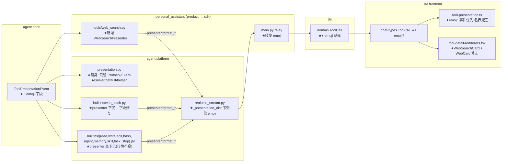

# feat-425: 工具自带展示(含 emoji)修复 web_search/web_fetch 渲染 — 技术方案

> 对齐: spec.md v1
> Unit branch: `unit/feat-425` (will be created by orchestrator)

## Changelog

<!-- design 阶段保持空;orchestrator 接手后、worker 实施中发现 design 需改时才追加。 -->

## 现状分析

### 涉及范围

展示事件从内核流到 IM 前端的全链路:

- `src/agent/core/tools/presentation.py` —— `ToolPresentationEvent`(frozen dataclass,现仅 `visible/label/summary/detail`)+ `ToolPresenter` Protocol。emoji 新字段加这里。
- `src/agent/platform/tools/presentation.py` —— 9 个 `_XxxPresenter` 类 + 9 个 singleton + `resolve_presenter_for_tool` + `_DefaultPresenter` + 共享 helper(`_truncate`/`_enforce_cap`/`_summarize_*`/`display_path`)。920 行,本 unit 要瘦身。
- `src/agent/platform/tools/builtins/{read,write,edit,bash,web_fetch,agent,memory,skill_manage,task_stop}.py` —— 各挂 `presenter = _XXX_PRESENTER` 属性(决策 12)。presenter 类要下沉进这些文件。
- `src/agent/platform/tools/builtins/web_fetch.py` —— `WebFetchTool.run()` 返回 `{ok,url,status,truncated,length,text}`;**不返回 `content`/`title`/`final_url`**,但其 presenter(`_WebFetchPresenter`)读这三个 key → detail 永远空。
- `src/personal_assistant/tools/web_search.py` —— product 工具,`WebSearchTool` 返回 `{ok,query,provider,results:[{title,url,snippet}]}`;**无 `presenter` 属性** → 落 `_DefaultPresenter`(裸 JSON args)。
- `src/agent/platform/hooks/builtins/realtime_stream.py:183` —— `_presentation_dict` 把 event 序列化进 `tool_start`/`tool_end` SSE(只取 visible/label/summary/detail)。emoji 要在这里序列化。
- `src/personal_assistant/main.py:3575` —— gateway relay,tool_end 取 `pres["summary"]`→output、`pres["detail"]`→detail。emoji 要在这里转发。tool_start relay(:3539)当前**不带** presentation。
- `src/IM/domain/models.py:184` `ToolCall` —— 存 `output/detail/reason`,序列化进 `messages.tool_calls_json`。emoji 要落库这里。
- `src/IM/frontend/src/features/chat/v2/chat-types.ts:59` `ToolCall` —— 前端类型,加 `emoji?`。
- `src/IM/frontend/src/features/chat/v2/components/tool-presentation.ts:19` —— `TOOL_EMOJI` 名表 + `toolEmoji(name)`。改为"事件 emoji 优先,名表兜底"。
- `src/IM/frontend/src/features/chat/v2/components/tool-detail-renderers.tsx:228/425` —— `WebCard`(读 `detail.content`,现恒空)+ `BESPOKE` 分发表(无 web_search)。新增 `WebSearchCard`。

### 既有约束

- **模块边界**:`personal_assistant`/`IM` 只能 import `agent.sdk`;`ToolPresenter`/`ToolPresentationEvent` 已由 `agent.sdk` re-export(`sdk/__init__.py:35`)。web_search presenter 在 product 包内写,import 自 `agent.sdk`,不碰内核内部。
- **presenter 随工具走(refactor-406 决策 12)**:挂 `presenter` 属性,无全局注册表;`resolve_presenter_for_tool` 走 `getattr(tool,"presenter",None)`,缺省落 `_DEFAULT`。
- **gateway 是纯透传管道(feat-409 决策 1)**:不按工具语义裁剪 detail,256KB 上限由内核 `_enforce_cap` 兜底。emoji 转发同守此则——gateway 原样转发,不加工。
- **256KB 硬上限**:`_enforce_cap` 对 `stdout/stderr/diff/content` 尾截断置 `truncated:True`。web_fetch/web_search 的大字段(content/results)套同一 cap。

### 可复用能力

- **feat-409 已铺好的 detail 透传+落库链路**:`ToolPresentationEvent.detail` → `_presentation_dict` → gateway relay → IM `ToolCall.detail` → `tool_calls_json` 往返 → 前端。**emoji 完全复用这条链**(决策 1/2),只是多带一个字段,不新铺管道。
- **`_enforce_cap`/`_truncate`/`_stringify`/`_DefaultPresenter`**:留在 `presentation.py`,下沉后的 presenter 仍 import 复用。
- **前端 `BESPOKE` 分发 + 通用结构化卡片回退(feat-409 决策 4/108)**:已知工具精渲染、未知/DIY 工具忠实按 key 渲染 detail。web_search 加进 `BESPOKE`,沿用同一模式。

### 相关历史

- **refactor-406**(#94):presenter 从全局注册表改为随工具对象走;确立决策 12。本 unit 按此架构把"随工具走"贯彻到底——presenter **类定义**也进工具文件。
- **feat-409**(#97 系):IM 工具调用展示重做。把 summary/detail 下放给 presenter 并打通透传/落库链。**本 unit 显式修订 feat-409 的两处取舍**(见决策 1、决策 4 的"修订 feat-409"小节),并修其遗留的 web_fetch 字段隐 bug。
- **契约 grounding 与漂移**:
  - kernel spec:286「工具展示由工具自带的 presenter 决定」字段列为 `visible/label/summary/detail` —— 与代码一致;本 unit MODIFY 增 `emoji`。
  - im spec:416/441「折叠态人话 + 展开态按类型呈现」—— 与代码一致。
  - **漂移**:im spec:458-460「web_fetch 展开看到网页标题、URL 和正文摘录」声称有 title,但 `web_fetch.run()` 从不返回 title,presenter 读的 `content` 工具也不返回 → 卡片标题/正文恒空。本 unit 修正契约(放弃 title,改为 URL+状态+正文)并修代码,使契约与代码重新一致。

## 架构总览

emoji 复用 feat-409 已建成的 detail 透传链;两个 web 工具补/修 presenter 与前端卡。改动落点(★=本 unit 改):



**before → after**:
- emoji:before 前端 `toolEmoji(name)` 名表(DIY 拿 🔧)→ after 工具/presenter 自带 emoji,经事件全程透传+落库,前端事件优先、名表仅兜底历史/运行中行。
- web_search:before 无 presenter → `🔧 + 裸 JSON`,展开裸字符串 → after `🔍 <query>` + 搜索结果卡。
- web_fetch:before `status=200 (title)` + 空正文卡 → after `🌐 <url>` + URL/状态/正文卡。
- presenter 类:before 全挤在 `presentation.py` → after 各回各的工具文件。

## 关键决策

### 决策 1: emoji 进 `ToolPresentationEvent`,复用 feat-409 透传链

**给 `ToolPresentationEvent` 加 `emoji: str = ""` 字段,presenter 在 format_start/end 都填;前端 `call.emoji || toolEmoji(name)`——事件优先、名表兜底。**

- **理由**:让"展示随工具走"覆盖 emoji 这一要素——自定义/MCP/产品工具都能自带图标。复用 feat-409 已为 detail 建好的 `event→_presentation_dict→relay→ToolCall→前端` 链,增量极小(每跳多带一字段)。
- **拒绝**:① 前端继续维护 name→emoji 大表——DIY/MCP 工具够不着,正是 #131 架构问题 #2;② emoji 做成 presenter 的静态属性而非进 event——透传链是按 event 序列化的,放 event 零额外管道,且 issue 明确要求"part of ToolPresentationEvent"。
- **修订 feat-409**:feat-409 决策 4 把 emoji 显式留在前端名表(原文「代价:emoji 前缀是纯视觉,留前端按 name 映射…DIY 工具拿通用图标,不阻塞」)。本 unit **经用户确认推翻该取舍**——产品演进到自定义/MCP 工具为明确方向,emoji 一律 🔧 成为真实体验缺口,且复用既有链路使当年"额外铺链不划算"的前提不再成立。
- **风险**:历史消息行(feat-425 前持久化、无 emoji)与运行中行(tool_start relay 不带 presentation)→ 前端 `|| toolEmoji(name)` 兜底,内置工具不退化、DIY 拿 🔧,与变更前一致。

### 决策 2: emoji 落库

**IM `ToolCall` 模型 + `tool_calls_json` 编解码 + gateway relay + 前端 `ToolCall` 各加 emoji 字段,与 detail/reason 同路。**

- **理由**:不落库则历史消息重载时,自定义工具的 emoji 丢失(名表只认内置)→ 违背决策 1 的目的。落库走 feat-409 为 detail 趟过的同一序列化路径,模式现成。
- **拒绝**:不落库、靠前端名表重新推导——前端不认识 DIY/MCP 工具,无从推导。
- **风险**:旧行无 emoji 列 → 解码缺省 `None`/`""`,前端兜底,无迁移负担(沿用"省略未设字段"约定)。

### 决策 3: 全部 presenter 类下沉到各自工具文件

**9 个 `_XxxPresenter` 从 `presentation.py` 搬进对应 `builtins/*.py`;`presentation.py` 只留 `ToolPresentationEvent`(re-export)、`ToolPresenter`、`resolve_presenter_for_tool`、`_DefaultPresenter`/`_DEFAULT`、共享 helper。web_search presenter 落 product 包 `web_search.py`。**

- **理由**:贯彻决策 12「presentation travels with the Tool object」到类定义层级,消灭 issue 架构问题 #1/#3 的中心化。改一个工具的展示只动它自己的文件,不再回头改内核中心文件。
- **拒绝**:只搬两个 web 工具、其余留中心文件——半搬留尾巴,#131 #1/#3 没消干净;架构上不彻底。(按纯架构最优定,7 个内置工具的搬迁工作量/回归仅作风险列出。)
- **风险**:7 个内置工具行为必须**零变更**——回归靠 worker 单测(presenter 各 status 路径)+ 全测试树 + reviewer 既有工具不退化 Scenario 兜。共享 helper 仍由各 presenter import 自 `presentation.py`,不复制。

### 决策 4: web_fetch 字段修复

**`WebFetchTool.run()` 额外返回 `content`(剥 untrusted banner 的展示正文)与 `final_url`;presenter 改读 `content`/`status`/`final_url`,失败态改判 `output["ok"] is False` / `output["error"]`。放弃 title。**

- **理由**:现 presenter 读 `content`/`title`/`final_url` 三个 key 工具都不返回(工具返回 `text`)→ 卡片正文恒空(#131 报的 bug)。且网络错/非法 URL 时 `run()` 正常返回 `{ok:False,error}`、内核 `result.error` 为空 → presenter 漏判失败、落进成功分支产 `status=None`。`content` 与 LLM-facing 的 `text`(带 banner)分开:`text` 给模型、`content` 给展示,符合"展示数据由 presenter/工具产"。
- **拒绝**:① presenter 里 strip banner——脆弱耦合 banner 文案;② 给工具加 title 抽取——issue desired 只要 URL+状态+正文,且 im 契约 title 声明本就漂移,放弃 title 同时修正契约,最省。
- **风险**:`run()` 返回结构变动属"展示支撑元数据",不改抓取/SSRF/权限逻辑(spec 非目标守住);`content` 大正文套 `_enforce_cap`。

### 决策 5: web_search presenter + 卡片(`web_search.py` 自持)

**`web_search.py` 新增 `_WebSearchPresenter`:折叠 `🔍 <query>`,detail 携 `results`;前端新增 `WebSearchCard` 并注册进 `BESPOKE`。失败两条通道(unknown provider 的 `{ok:False,error}` 与 searxng `raise` 的 `result.error`)都判。**

- **理由**:让 product 工具自持展示(决策 12 + 模块边界:presenter 写在 product 包、import `agent.sdk`)。与 web_fetch 对称:折叠人话主参数、detail 结构化、空/失败态齐全。
- **拒绝**:把 web_search presenter 写进内核 `presentation.py`——product 工具不该污染内核中心文件,违背本 unit 主旨。
- **风险**:results 可能较大 → detail 套 `_enforce_cap`(其字段集需含 results 序列化后的承载键,或逐条 snippet 截断——实现层细节留 worker)。

## 接口与数据流

**`ToolPresentationEvent`(core,决策 1)**:
```
@dataclass(frozen=True, slots=True)
class ToolPresentationEvent:
    visible: bool = False
    label: str = ""
    summary: str = ""
    detail: Mapping[str,Any] | None = None
    emoji: str = ""          # ← 新增。空串 = 工具未声明,前端兜底名表
```

**`_presentation_dict`(realtime_stream.py,决策 1)**:序列化 dict 增 `"emoji": getattr(presentation,"emoji","")`。

**gateway relay(main.py tool_end,决策 1/2)**:`pres.get("emoji")` → `tool_call_payload["emoji"]`(沿用 detail 的省略未设约定)。tool_start relay 可选同样带 emoji(让运行中行也显自带图标;不带则兜底名表,二者皆可接受)。

**IM `ToolCall`(models.py,决策 2)**:增 `emoji: str | None = None`;`tool_call_to_dict` / `_encode/_decode_tool_calls` 序列化往返(省略未设字段)。

**前端(决策 1/5)**:`ToolCall` 增 `emoji?: string`;`toolEmoji` 调用点改 `call.emoji || toolEmoji(call.name)`;`tool-detail-renderers.tsx` 加 `WebSearchCard`(读 `detail.results`,空数组→"无结果"空态)注册 `BESPOKE["web_search"]`。

**web_fetch detail(决策 4)**:`{url, final_url, status, content, truncated}`(去掉恒空的 title;失败 → `{url, error:{message}}`)。

**web_search detail(决策 5)**:成功 `{query, provider, results:[{title,url,snippet}], count}`;空 `results:[]`;失败 `{query, error:{message}}`。

主流程(成功路径,以 web_search 为例):
```mermaid
sequenceDiagram
  participant T as web_search 工具
  participant P as _WebSearchPresenter
  participant RS as realtime_stream
  participant G as gateway relay
  participant IM as IM ToolCall(落库)
  participant FE as 前端 WebSearchCard
  T->>P: format_end(args, result{results})
  P->>RS: ToolPresentationEvent{emoji:🔍, summary:query, detail:{results}}
  RS->>G: tool_end SSE{presentation:{emoji,summary,detail}}
  G->>IM: tool_call{emoji, output:summary, detail}
  IM->>FE: WS / 重载 tool_calls_json
  FE->>FE: 折叠 🔍 query;展开 results 列表
```

## 契约层增量 (delta-spec)

- kernel: `specs/kernel/spec.md` —— MODIFY「工具展示由工具自带的 presenter 决定」:presentation 字段集增 `emoji`,声明 emoji 随工具/presenter 走。
- im: `specs/im/spec.md` —— MODIFY「折叠态摘要」(增 web_search `🔍 query` + web_fetch `🌐 url` + 工具自带 emoji / DIY 专属图标 Scenario)、MODIFY「展开态按类型呈现」(ADD web_search 结果卡 Scenario;web_fetch Scenario 改为 URL+状态+正文,删 title 漂移)。
- gateway: no spec delta(relay 仅多透传 emoji 字段,无新增可观察契约,用户可观察面由 im 承载)。
- cli: no spec delta(本 unit 不动 CLI 渲染层;内核 presenter 改动进程内共享但不在本期 CLI 渲染验收)。

## 风险与回退

- **7 个内置工具回归**(决策 3):presenter 下沉是行为保持的搬迁。最易翻车点=搬迁时漏带共享 helper import 或改了某条 summary/detail 措辞。对策:worker 单测覆盖每个 presenter 各 status 路径;reviewer 走"既有工具不退化"Scenario;全测试树 + contract 必须绿。回退:presenter 类位置是纯内部结构,撤回只需 git revert,不涉数据。
- **emoji 落库的旧行兼容**(决策 2):旧 `tool_calls_json` 无 emoji。对策:解码缺省 `None`,前端 `||` 兜底。已验路径:feat-409 给 detail 加字段时同样处理,模式成熟。
- **web_fetch 返回结构变动**(决策 4):`run()` 多返回 content/final_url。下游消费者只有 presenter 与 `serialize_result`(读 `text`,不受影响)。对策:web_fetch 单测断言新字段 + serialize_result 仍只吐 text。
- **契约漂移修正**(im title):MODIFY 删除 im spec 的 title 声明。风险=有别处依赖该契约描述?grep 确认无其他 unit 引用该 Scenario 文案。

## Runbook for Reviewer

本 unit 改内核 presenter + gateway relay + IM 存储 + 前端;reviewer 走 IM 聊天面板旅程需重启 IM + Gateway,前端重新构建。

| 服务 | 停止命令 | 启动命令 | 健康检查 |
|---|---|---|---|
| IM | `stop_pidfile .im.pid`(worktree)/ 手起则 Ctrl-C | `IM_JWT_SECRET=<unit专属> PYTHONPATH=src python -m uvicorn IM.app:app --host 127.0.0.1 --port $IM_PORT > .im.log 2>&1 & echo $! > .im.pid` | `curl -s 127.0.0.1:$IM_PORT/` 返回页面 |
| Gateway | `stop_pidfile .gateway.pid` | `PYTHONPATH=src python -m personal_assistant.main --config $WT_CFG --im-service-url http://127.0.0.1:$IM_PORT --foreground --auto-bind > .gateway.log 2>&1 & echo $! > .gateway.pid` | `.gateway.log` 出现 bound/connected,IM 内 agent 在线 |
| IM 前端 | `stop_pidfile .vite.pid` | `cd src/IM/frontend && npm run build`(验收看构建产物)或 `npm run dev -- --port $VITE_PORT --strictPort` | `npm run build` 绿 / dev server 起 |

> 端口分配与 config 隔离见 AGENTS.md「运行时服务并行启动」;reviewer 在 worktree 内用 `scripts/e2e-up.sh` 一键起更稳。

## Milestones

单 M1:跨包但是一条内聚的垂直改动(展示链路),且多处共改 `presentation.py` 与前端两个文件,无法无交集并行;估算 < 800 行。不拆(§4 默认)。

| ID | 标题 | 依赖 | 并行组 | 范围 | 退出标准 |
|---|---|---|---|---|---|
| feat-425-M1 | tool-presenter-emoji | — | A | `src/agent/core/tools/presentation.py`、`src/agent/platform/tools/presentation.py`、`src/agent/platform/tools/builtins/*.py`、`src/agent/platform/hooks/builtins/realtime_stream.py`、`src/personal_assistant/tools/web_search.py`、`src/personal_assistant/main.py`(relay)、`src/IM/domain/models.py`、`src/IM/infra/repositories.py`(tool_calls 编解码)、`src/IM/frontend/src/features/chat/v2/{chat-types.ts,components/tool-presentation.ts,components/tool-detail-renderers.tsx}` | **[reviewer]** web_search 折叠 `🔍 query` + 结果卡 + 无结果空态 + 失败标红(spec Req「web_search 折叠行」「web_search 展开卡」全 Scenario);web_fetch 折叠 `🌐 url` + 展开 URL/状态/正文非空 + 失败可读(spec Req「web_fetch 折叠行」「web_fetch 展开卡」);自定义工具声明 emoji 即显该图标、未声明回退 🔧(spec Req「工具自带 emoji」);既有内置工具图标与卡片零变化(spec Req 回归 Scenario)。 **[worker]** `ToolPresentationEvent.emoji` + `_presentation_dict` 序列化单测;9 个 presenter 下沉后各 status 路径单测全绿、`presentation.py` 仅余 Protocol/Event/resolver/default/helper;web_fetch 返回 content/final_url + presenter 读取 + 失败判 `ok is False` 单测;web_search presenter + detail schema + 空/双失败通道单测;gateway relay 转发 emoji 单测;IM ToolCall emoji 序列化/持久化往返单测;前端 vitest 覆盖 WebSearchCard/WebCard/emoji 事件优先与名表兜底/历史行降级;`npm run build` 绿;contract + 全测试树(`-m "not e2e"`,含 im_service)绿。 |
