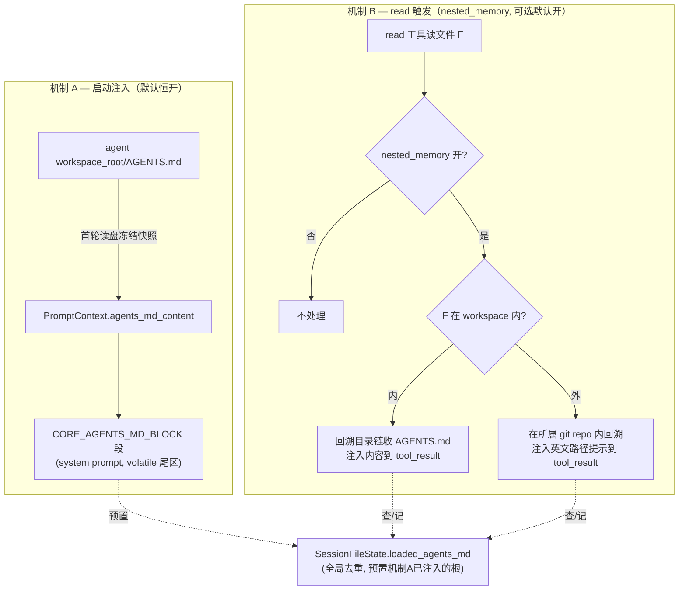

# feat-428: 目录级项目指令自动加载 — 技术方案

> 对齐: spec.md v1
> Unit branch: `unit/feat-428` (will be created by orchestrator)

## Changelog

## 现状分析

### 涉及范围

- `src/agent/core/agent/prompt_sections/`（机制 A 落点）：
  - `skeleton.py` `KERNEL_PROMPT_SKELETON` —— 段顺序 + cache_safe 分区；稳定前缀区（`cache_safe=True`：head/core 规则/body/通用 feature/custom）→ volatile 尾区（`cache_safe=False`：`core.memory_block`、`core.user_profile_block`、`slot.tail`）。`assemble_system_prompt` 强制"volatile 段必须排在所有稳定段之后"。
  - `core_sections.py` `_render_memory_block` / `_render_user_profile_block` —— MEMORY/USER 注入范例：读 `PromptContext.memory_content` 字段渲染，`cache_safe=False`。
  - `base.py` `PromptContext` —— 注入内容的载体字段（`memory_content` 等）。
  - `wiring.py` `build_prompt_context_from_metadata` —— 把内容透传进 PromptContext；`resolve_flags_from_metadata` 合并 feature flag。
- `src/agent/core/agent/runtime.py` `_run_locked`：首轮调 `_ensure_memory_snapshot` 读盘冻结快照；持有已 resolve 的 `config.workspace_root`（绝对 Path）。
- `src/agent/platform/tools/builtins/read.py`（机制 B 落点）：`run()` 内已有被读文件绝对路径 + `ctx.safety.is_path_in_workspace()`。
- `src/agent/core/tools/base.py` `ToolContext` / `session_file_state`（机制 B 去重状态载体，session 全生命周期存活）。
- `src/agent/core/agent/prompt_sections/feature_registry.py` `FEATURE_REGISTRY`（机制 B 开关登记处）。
- `src/agent/sdk/kernel.py` `build_kernel` / `create_session`（装配入口）。

### 既有约束

- 依赖方向：产品（coding_cli / personal_assistant）只能 import `agent.sdk`；`platform → core`；`core` 不依赖 `platform`。机制 A/B 的核心逻辑落 core，平台细节（如 read 工具体）落 platform。
- cache 不变量：`assemble_system_prompt` 校验 volatile 段排在稳定段之后，违反即 raise。机制 A 新段必须遵守。
- **SDK feature ≠ PA feature（关键既有分层）**：`FEATURE_REGISTRY`（core，内核认得的特性）与 Gateway 的 `FEATURE_PROJECTIONS`（`personal_assistant/reporter/capability_projection.py`，决定哪些 feature 露成 PA 前端 toggle）是**解耦的两张表**。`list_features()` 还显式只报 `memory_curation`/`skill_creation`。一个 feature 只有被显式加进 `FEATURE_PROJECTIONS` 才对用户可见——opt-in，不是自动投影。
- 工具执行时 `ctx.repo_root` 已被 `registry._resolve_execution_context` 重写为 session 的 `workspace_root`，故 `is_path_in_workspace()` 实质锚的就是 workspace_root。

### 可复用能力

- **MemoryStore 注入链**（机制 A）：直接照搬 `_render_memory_block` 模式（PromptContext 字段 + 首轮快照 + volatile 段渲染），不另造。
- **FEATURE_REGISTRY + resolve_flags**（机制 B 开关）：复用，加一条 `nested_memory` 条目。
- **SessionFileState**（机制 B 去重）：复用，加一个 set 字段记已注入路径。
- **缺口**：仓内无"找路径所属 git repo root / 判定是否属于 git repo"的工具函数——机制 B 外部回溯上界要新写一个纯 Python helper（walk-up 找 `.git`）。

### 相关历史

- feat-379（决策 10/M4）：曾从 core prompt 主动移除 CLAUDE.md 提及（"coding-CLI concept"）。本 unit "只认 AGENTS.md、不认 CLAUDE.md" 沿用其取向。
- feat-394（决策 D）/ feat-349：FEATURE_REGISTRY 现有条目来源；机制 B 开关沿用同一模式但**不投影**到前端。
- refactor-406（决策 1/2/5）：`build_kernel` 为产品中性共享基座唯一装配入口。

### CC 参考核实结论（用户要求多参考 CC，两机制都参考）

- **CC 机制 A**：项目指令不进 system prompt，而是作为首条 user meta-message `<project-instructions>` 注入（`api.ts:461`），动机是 CC system prompt 很长、怕指令权重被稀释。**本 unit 决策 1 不照此**（见下），因我们 system prompt 不臃肿、且本仓 MemoryStore 已验证 system prompt 注入可行。
- **CC 机制 B**：read 触发，`getNestedMemoryAttachmentsForFile` 目录回溯，`memoryFilesToAttachments` 双层去重（`loadedNestedMemoryPaths` 非淘汰 Set + `readFileState` LRU），`pathInAllowedWorkingPath` 边界闸。本 unit 机制 B 复刻其"read 触发 + 目录回溯 + 去重 + 边界闸"骨架。
- **CC 不认 AGENTS.md**（项目指令只认 CLAUDE.md），@import 支持（@path，最深 5 层、防环），CLAUDE.md 不截断（仅 40000 字符软告警）、AutoMem 才截断（200 行 / 25000 字节）。

## 架构总览

两个独立注入通道，互不耦合，靠去重协同：



机制 A 保证 agent 永远自带工作区根的项目说明；机制 B 顺着 read 把更深/更远处的说明就近带上；去重集合让同一份只生效一次（含机制 A 已注入的根）。

## 关键决策

### 决策 1: 机制 A 注入到 system prompt（而非 CC 的 user meta-message）

**放 system prompt**：新增 `CORE_AGENTS_MD_BLOCK` 段，照 `_render_memory_block` 范例，置于 volatile 尾区。

- **理由**: 与 spec 明确诉求一致；本仓 MemoryStore 已验证 system prompt 注入文件内容可行；system prompt 不臃肿，CC 的"权重稀释"顾虑在此影响小。
- **拒绝**: CC user meta-message —— 其动机（system prompt 过长怕淹）我们没有，且要改消息装配链路，成本高于新增一个 prompt 段。
- **风险**: AGENTS.md 很大时混在 system prompt 尾部可能不够受重视 —— 后面效果不好再考虑迁 meta-message（用户认可的演进留口）。

### 决策 5: 机制 B 开关 = FEATURE_REGISTRY 条目，但不投影给用户

**`nested_memory` 进 `FEATURE_REGISTRY`**（`default_on=True`, `layer="core"`, `requires_tool="read"`, `sections=()`），**故意不加进 Gateway 的 `FEATURE_PROJECTIONS`、也不进 `list_features()` 白名单** → 内核认得、默认开，PA 前端无 toggle、config.yaml 不暴露、用户选不了。关闭粒度走**全局**：日后效果不好改 `default_on=False` 一行，两产品一起关。

- **理由**: 复用既有"SDK feature ≠ PA feature"分层（FEATURE_REGISTRY 定义 / FEATURE_PROJECTIONS opt-in 投影），既是内核特性又对用户隐形，正是诉求。
- **拒绝**: ① `build_kernel` 新参数 —— 可行但游离于既有 feature 体系外，另起一套；② 进 FEATURE_PROJECTIONS —— 会冒出用户 toggle，违背"不给用户选"。
- **风险**: 全局 flip 不分产品；若将来需分产品关，再让产品在 `create_session(features=)` 传 override（per-session 路径仍可用）。

### 决策 2: workspace 内/外边界 = `is_path_in_workspace`（实质锚 workspace_root）

**用 `ctx.safety.is_path_in_workspace(file_path)` 判内外**。工具执行时 `ctx.repo_root` 已被 `registry._resolve_execution_context` 重写为 session 的 `workspace_root`，故该判定实质锚 workspace_root，与机制 A 读 `config.workspace_root/AGENTS.md` 同源。

- **理由**: 复用既有边界判定，两机制同一基准，无新概念。
- **拒绝**: 自造 workspace_root 比较 —— 与既有 safety 重复。
- **风险**: 无（沿用现有语义）。

### 决策 3: 机制 B 注入到 read 的 tool_result content blocks（带标签）

**直接把内容/提示追加进 read 返回的 content blocks**：工作区内用 `<project-instructions path=...>正文</project-instructions>`，工作区外用 `<project-instructions-hint>…英文提示…</project-instructions-hint>`。

- **理由**: 当轮即生效、不改 loop、不依赖下一回合，逻辑自包含在 read 工具内，去重集合在 ToolContext 手边。
- **拒绝**: 复用 `run_control` 回合边界队列（CC 的 attachment-at-boundary 路线）—— read 工具拿不到 RunController 句柄、要改 loop 消费，耦合大且下一回合才生效。
- **风险**: 注入内容与文件正文同处一个 tool_result，必须用明确标签分隔，避免模型混淆。

### 决策 4: 去重状态 = `SessionFileState.loaded_agents_md: set[str]`

**`SessionFileState` 新增 `loaded_agents_md: set[str]`**（session 全生命周期存活）。机制 A 注入根 AGENTS.md 后把其绝对路径**预置**进该集合；机制 B（内/外）注入前查、注入后记。每份 AGENTS.md（按绝对路径）一会话只生效一次，外部路径提示同理。

- **理由**: 对齐 CC 的 `loadedNestedMemoryPaths`（非淘汰 Set）；`SessionFileState` 是现成 session 级容器。
- **拒绝**: 存 `session_metadata`（frozen Mapping，不可变）。
- **风险**: 机制 A 与 B 跨 core/platform，需保证两者写同一 session 的同一集合实例（runtime 维护的 `_session_file_states[session_id]`）。

### 决策 6: 截断对齐 CC（不硬截断）；`@import` 支持，对齐 CC

**AGENTS.md 不硬截断**（项目指令类，对齐 CC 对 CLAUDE.md 的处理）。**支持 `@import`**：`@path` / `@./rel` / `@~/home` / `@/abs`，仅 Markdown 叶 text node 内识别（跳过代码块），最深 5 层递归，Set 防环，不存在的文件静默忽略——逐字对齐 CC（`claudemd.ts` import 解析）。

- **作用域**: @import 只在"注入内容"路径生效——机制 A 根 AGENTS.md、机制 B 工作区内子目录 AGENTS.md。机制 B 外部仅给路径提示、不加载正文，不涉及 @import。
- **理由**: 用户明确要求对齐 CC；@import 让 AGENTS.md 可拆分组织。
- **拒绝**: 不支持 @import —— 与"参考 CC"诉求相悖。
- **风险**: @import 可指向工作区外/绝对路径（CC 允许），递归 + 防环必须实现正确，否则栈溢出/重复注入；深度上限 5 兜底。

### 决策 7: 机制 B 外部回溯 = 单次上行定最外层 git 仓根，沿途逐级收 AGENTS.md

**语义**：扫描范围 = `[被读文件目录 … 最外层 git 仓根]` 闭区间，逐级找 `AGENTS.md`（找到全收）；文件不属任何 git 仓 → 不给提示。"最外层"覆盖嵌套仓：read `/q/w/e/x/y/z/a.py`，若 e、y 都是 git 仓（e 最外层），则扫 e、x、y、z 各级，多份全列。

**高效实现（非逐级重复 walk）**：从文件目录**单次上行**至文件系统根，一趟内同时 (a) 记下沿途最高一层含 `.git`（目录或文件，后者覆盖 worktree）者 = 最外层仓根上界，(b) 缓存各级是否有 `AGENTS.md`；走完按上界过滤出在范围内的 AGENTS.md。等价于"逐级判 git 归属 + 不属即停"的语义，但只走一遍（O(深度)，非 O(深度²)）。

- **理由**: 上界取最外层仓根（非最近仓根）才能覆盖嵌套仓外层说明；单次上行避免逐级重复走根。
- **拒绝**: ① `git rev-parse --show-toplevel` —— 给最近仓根、漏外层，且引入 subprocess/不确定性；② 字面"每级各自判属于哪个仓" —— O(深度²) 重复 walk。
- **落点**: core 层 platform-free helper（仅 `pathlib`）。
- **风险**: 每次外部 read 触发一次到根的 walk-up；深度有限、IO 轻量，可接受。

## 接口与数据流

### 共享核心（core, 供机制 A/B 复用）

- `load_agents_md(path: Path, *, _seen: set[Path] | None = None, _depth: int = 0) -> str | None`
  读取 AGENTS.md 正文并解析 `@import`（仅叶 text node、最深 5 层、`_seen` 防环、不存在静默忽略），返回拼好的完整文本；文件不存在 → `None`。落点：`agent/core/`（与 MemoryStore 读文件同层）。
- `find_outermost_git_root(start_dir: Path) -> Path | None`
  从 `start_dir` 逐级上行，记录沿途含 `.git`（目录或文件）的最高一层并返回；全程无 `.git` → `None`。platform-free（仅 `pathlib`）。
- `iter_agents_md_chain(file_dir: Path, *, top: Path) -> Iterator[Path]`
  在 `[file_dir … top]` 闭区间逐级 yield 存在的 `AGENTS.md` 绝对路径。

### 机制 A（system prompt 注入）

- `PromptContext` 新增 `agents_md_content: str | None = None`（`base.py`）。
- `runtime._ensure_agents_md_snapshot(session_id)`：首轮读 `config.workspace_root/AGENTS.md` → `load_agents_md` → 冻结快照存 session 级缓存；同时把该根路径**预置**进 `SessionFileState.loaded_agents_md`（供机制 B 去重）。后续轮用缓存。
- `core_sections.CORE_AGENTS_MD_BLOCK`：`enabled_when` = 内容非空；`render` = banner + 正文；`cache_safe=False`，插在 `core.memory_block` 一侧的 volatile 尾区（位置 > 所有稳定段）。
- `wiring.build_prompt_context_from_metadata(..., agents_md_content=...)` 透传。

### 机制 B（read 触发，read.py 内）

```mermaid
sequenceDiagram
  participant M as Model
  participant R as ReadTool.run
  participant S as SessionFileState.loaded_agents_md
  participant L as load_agents_md / git helper
  M->>R: read(path=F)
  R->>R: file_path = normalize(F); 读正文(原有逻辑)
  R->>R: nested_memory 开? (agent_features 覆盖 ⊕ FEATURE_REGISTRY default_on)
  alt 关
    R-->>M: tool_result(仅文件正文)
  else 开 & F 在 workspace 内
    R->>L: iter_agents_md_chain(F.dir, top=workspace_root)
    loop 每个未注入过的 AGENTS.md
      R->>L: load_agents_md(p) (解析 @import)
      R->>S: add(p)
      R->>R: append <project-instructions path=p>正文</...>
    end
    R-->>M: tool_result(文件正文 + 内容块)
  else 开 & F 在 workspace 外
    R->>L: root = find_outermost_git_root(F.dir)
    alt root 为 None
      R-->>M: tool_result(仅文件正文)
    else
      R->>L: iter_agents_md_chain(F.dir, top=root)
      loop 每个未提示过的 AGENTS.md
        R->>S: add(p)
        R->>R: append <project-instructions-hint>英文提示(含 p)</...>
      end
      R-->>M: tool_result(文件正文 + 提示块)
    end
  end
```

- 开关读取：`ctx.session_metadata.get("agent_features",{}).get("nested_memory", FEATURE_REGISTRY["nested_memory"]["default_on"])`——无人覆盖时取 registry 默认 `True`；全局关只需改 `default_on=False`（决策 5）。read.py 属 platform，可 import core 的 FEATURE_REGISTRY。

### 注入文案（钉死，worker 逐字照抄）

**机制 A + 机制 B·工作区内**（包裹注入正文，`@import` 已展开；每份 AGENTS.md 一个块）：

```
<project-instructions path="{abs_path}">
{resolved_content}
</project-instructions>
```

**机制 B·工作区外**（路径提示，不含正文）：

```
<project-instructions-hint>
The file you just read is outside your workspace, in the project rooted at {repo_root}.
This project ships instruction file(s) describing its conventions, not loaded here to save context:
  {agents_path_1}
  {agents_path_2}
Read any of them with the read tool if you need this project's conventions before working in it.
</project-instructions-hint>
```

- `{abs_path}` / `{agents_path_*}` = AGENTS.md 绝对路径（外部逐级找到的多份逐行列出，单份就一行）；`{repo_root}` = 最外层 git 仓根绝对路径；`{resolved_content}` = `load_agents_md` 返回的展开正文。
- 机制 A 的根 AGENTS.md 注入 system prompt 段时同样用 `<project-instructions>` 标签包裹。

### SessionFileState 扩展

- `SessionFileState` 新增 `loaded_agents_md: set[str]`（`__init__` 初始化空 set）。机制 A 预置、机制 B 查/记，同一 session 同一实例（`runtime._session_file_states[session_id]`）。

## 契约层增量 (delta-spec)

- kernel: `specs/kernel/spec.md`（机制 A/B 改变 agent.sdk 消费者可观察行为）
- im: no spec delta
- gateway: no spec delta（开关不投影，PA 对外无新 toggle / capabilities 字段）
- cli: no spec delta（CLI 行为变化由 kernel delta 覆盖）

## 风险与回退

- **风险 1：system prompt 尾部权重**（机制 A）。AGENTS.md 很大时混在 volatile 尾区可能被模型轻视。回退：迁到 CC 式首条 user meta-message（决策 1 已留演进口）。
- **风险 2：@import 递归**。指向工作区外/绝对路径 + 潜在环。缓解：Set 防环 + 深度上限 5 + 不存在静默忽略，逐字对齐 CC。
- **风险 3：外部 read 的 walk-up IO**。每次工作区外 read 触发一次目录上行找 `.git`。缓解：深度有限、命中 `.git` 即定界；可接受。
- **风险 4：tool_result 混淆**。注入块与文件正文同处一个结果。缓解：`<project-instructions*>` 标签强分隔。
- **回退（整特性）**：机制 B 改 `FEATURE_REGISTRY["nested_memory"].default_on=False` 一行全局关；机制 A 为基线无开关，如需关则移除 `CORE_AGENTS_MD_BLOCK` 段（非配置级，需改码）——符合 spec"A 不可选"。
- **回滚**：本 unit 改动集中在新增段/字段/工具函数 + read.py 一段，`git revert` unit 分支即可，无数据迁移。

## Runbook for Reviewer

机制为内核能力，需经两产品真实入口验。无新增常驻进程，沿用既有服务。

| 服务 | 停止命令 | 启动命令 | 健康检查 |
|---|---|---|---|
| Coding CLI（机制 A/B 内/外旅程） | Ctrl-C / 退出 REPL | `PYTHONPATH=src python3 -m coding_cli.main`（在含 AGENTS.md 的工作区启动） | REPL 起来；read 工作区内/外文件看 tool_result 是否带 `<project-instructions*>` |
| IM（PA 旅程依赖） | `stop_pidfile .im.pid` | `IM_JWT_SECRET=<unit随机串> PYTHONPATH=src python -m uvicorn IM.app:app --port <free>` | `GET /` 200 |
| Gateway（PA 旅程） | `python -m personal_assistant.main --config <wt-cfg> stop`（或 `--foreground` + `stop_pidfile`） | `PYTHONPATH=src python -m personal_assistant.main --config <wt-cfg> --im-service-url http://127.0.0.1:<IM> --foreground --auto-bind` | Gateway 绑定成功；PA agent 会话 system prompt 含其 workspace AGENTS.md |

> worktree 内起服务按 AGENTS.md「运行时服务并行启动」分配空闲端口 + 隔离 config（`scripts/e2e-up.sh` 已打包）。机制 A 验证可让 agent 复述其工作区 AGENTS.md 中的约定；机制 B 外部验证需在 PA agent 的 workspace 之外另放一个 git 仓 + AGENTS.md，让 agent read 该仓文件看是否得到英文路径提示。

## Milestones

| ID | 标题 | 依赖 | 并行组 | 范围 | 退出标准 |
|---|---|---|---|---|---|
| feat-428-M1 | impl | — | A | 共享核心：`agent/core/` 新增 `load_agents_md`(@import) + `find_outermost_git_root` + `iter_agents_md_chain`；机制 A：`base.py` PromptContext 字段、`core_sections.py` CORE_AGENTS_MD_BLOCK、`skeleton.py` 段位、`wiring.py` 透传、`runtime.py` `_ensure_agents_md_snapshot`；机制 B：`feature_registry.py` 加 `nested_memory`、`session_file_state` 加 `loaded_agents_md`、`read.py` 注入逻辑；两产品装配默认开（CLI `DEFAULT_FEATURES` 无需动—走 registry 默认；确认 PA 不暴露 toggle）；delta-spec `specs/kernel/spec.md` | `[reviewer]` 覆盖 spec.md 全部 Requirement/Scenario（机制 A 启动注入含空态/两产品；机制 B 内注入/外提示/空态/边界/去重；关闭后 A 不受影响）；`[worker]` 新单测覆盖：@import 递归+防环+深度上限、git 外层仓根定界（嵌套仓 e~z 例）、内外判定、去重一次性、关闭 flag；`[worker]` `pytest -m "not e2e"` 全绿 + ruff check/format 净 |

> 单 M1：机制 A/B 共享 AGENTS.md 加载 + @import 核心，无法真并行；估算 < 800 行；无分阶段验证依赖。不满足任何拆分硬触发。
