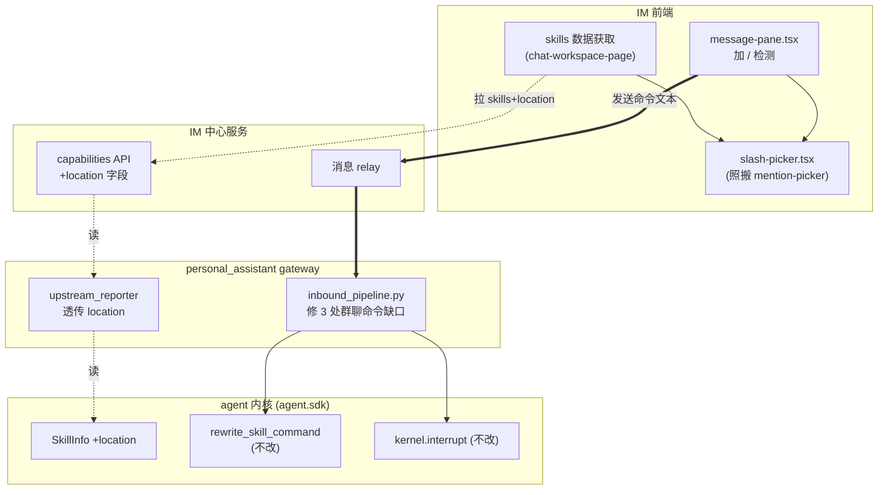
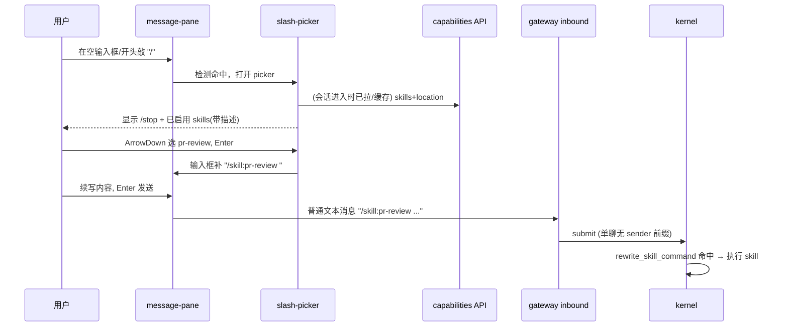

# feat-430: IM slash skill picker — 技术方案

> 对齐: spec.md v2（含 Q11/Q12 范围扩展）

> Unit branch: `unit/feat-430` (will be created by orchestrator)

## Changelog

## 现状分析

### 涉及范围

| 路径 | 当前职责 | 本 unit 怎么动 |
|---|---|---|
| `src/IM/frontend/src/features/chat/v2/components/message-pane.tsx` | composer，`@` mention 在此触发（正则 `/@([^@\s]*)$/`），`/` 无任何处理 | **加 `/` 检测 + slash picker 接入**，主战场 |
| `src/IM/frontend/src/features/chat/v2/components/mention-picker.tsx` | 候选面板：前缀过滤、键盘上下/Enter、选中插入 | **照搬为 slash-picker**（新建同构组件，不复用同一文件以免耦合 mention 语义） |
| `src/IM/frontend/.../chat-workspace-page.tsx` | 聊天工作区，只调 `GET /im/v1/agents`（不含 skills），派生 `mentionCandidates` / `groupMembers` | **加每会话 agent 的 skills 数据获取** |
| `src/IM/frontend/.../settings/agents/im-agent-config-api.ts` | `getAgentCapabilities`（`{name,description,default_on}`）/ `getAgentConfig`（白名单 `string[]`） | capabilities 类型 **加 `location` 字段** |
| `src/agent/core/skills/registry.py` | `SkillMetadata` 含 `name/description/location/base_dir` | 只读，location 取此处 |
| `src/agent/sdk/dto.py` | `SkillInfo(name, description)` | **加 `location` 字段** |
| `src/personal_assistant/reporter/upstream_reporter.py` | `_skills_from_kernel()` 把 `SkillInfo` 映射成 `{name,description}`，丢 location | **透传 location** |
| `src/IM/api/routes/agents.py` | capabilities API 的 `AllowlistOptionResponse` | **加 location 字段** |
| `src/personal_assistant/gateway/inbound_pipeline.py` | `_is_stop_command`（只 strip `@{id}`）、`_should_process`（群聊 MENTION 投递策略）、`_build_message_parts`（群聊加 `[sender] ` 前缀） | **修群聊 `/stop` 2 处缺口**（`_is_stop_command` wire 识别 + `_should_process` 放行裸 `/stop`）；`_build_message_parts` 的 sender 前缀**保持不变** |
| `src/agent/core/agent/skill_commands.py` | `rewrite_skill_command`，行首正则 `^\s*/skill:` | **改正则**：容忍并保留前导 `[sender] ` 前缀（群聊 `/skill` 缺口在此解决） |

### 既有约束

- 产品包（`personal_assistant` / `IM`）只能 import `agent.sdk`，不能 import `agent.core` 内部——location 字段必须先经 `SkillInfo`(sdk dto) 暴露，gateway 才能取。
- `/stop` 中断走 `kernel.interrupt()` → `RunController.abort(user_initiated=True)`，本 unit **不动中断机制本身**，只修"命令是否被识别/投递"。
- `/skill:name` 重写在 kernel `runtime.py:451`（`rewrite_skill_command`）；本 unit **扩其正则容忍并保留群聊 `[sender] ` 前缀**，重写后的目标语义不变。

### 可复用能力

- **mention picker 整套机制**（`mention-picker.tsx` + `message-pane.tsx` 的触发/键盘/插入）= slash picker 的现成骨架。决定**照搬新建**，不复用同一组件：mention 选中走 wire XML（`<mention/>`）+ 旁路 `draftMentions`，slash 选中只是补纯文本，语义不同，强行共用会互相污染。
- **capabilities API** 已存在且已返回 `{name,description}`，只需扩 `location` 一个字段，不新建 API。
- **`/stop` 单聊链路** 已完整可用，单聊侧零后端改动。

### 相关历史

- `feat-439`（多回合 turn 气泡）、近期 IM 前端 mention picker 相关 unit 改过 `message-pane.tsx` 同一区域——本 unit 在其旁新增 `/` 分支，注意不破坏 `@` 既有逻辑。
- 群聊投递策略（MENTION）、sender 前缀是既有群聊机制，非本 unit 引入；本 unit 只为 `/stop`、`/skill` 命令开特例通道。

### 契约层 grounding

- **gateway（发现 drift）**: canonical `Requirement: 群聊只在被 @提及 / 回复 Agent / 控制命令时触发 Agent`（`docs/specs/gateway/spec.md:71`）已把"控制命令"列为群聊触发条件之一，但代码 `_should_process` 实际**丢弃**群聊裸 `/stop`——契约与代码 **drift**。本 unit 负责让代码符合既有契约（裸 `/stop` 触发中断），并补 picker wire mention 形式 `/stop` 的识别。
- **kernel/im**: 现有契约未声明 skill `location` 经 `list_skills` / capabilities API 暴露，本 unit 为**新增**字段。`/skill:name` 改写既有契约（kernel:356）成立，本 unit 扩其覆盖到带 `[sender]` 前缀的群聊消息。

## 架构总览

本 unit 是"一个前端新组件 + 三段后端缺口修复 + 一个字段全链路透传"的组合。难点在**数据从哪来、命令到哪生效**两条链路跨了前端→IM→gateway→kernel 四层，故下面用一张结构图标改动点 + 一张时序图走一遍核心操作。



**before**：前端 composer 不认 `/`；skills 的 location 在 `SkillInfo` 处被丢；群聊 `/stop`、`/skill` 因 wire 前缀 / 投递策略 / sender 前缀三处缺口失效。
**after**：前端敲 `/` 弹 picker（数据来自带 location 的 capabilities）；群聊命令经 gateway 特例通道正确生效。

## 关键决策

### 决策 1: slash picker 照搬 mention picker，新建独立组件

**新建 `slash-picker.tsx`，复用 mention picker 的交互机制但不共用同一组件**。

- **理由**: 触发/键盘导航/前缀过滤/选中插入逻辑可直接照搬；但 mention 选中产出 wire XML + 旁路 `draftMentions`，slash 选中只补纯文本，数据通路不同。
- **拒绝**: 复用同一组件加 mode 分支——两套选中语义糅在一起，后续任一改动互相牵连。
- **风险**: 两组件有重复代码；可接受，交互稳定后再抽公共 hook。

### 决策 2: skills 数据走 capabilities API（扩 location），不用 config 白名单

**前端拉 `GET /im/v1/agents/{id}/capabilities`，并在该响应里加 `location` 字段**。

- **理由**: picker 要展示 skill 的 description（白名单 `string[]` 没有），且 Q7 要按 location 区分同名——capabilities 已带 description，扩一个 location 即够。`default_on` 用于判定"已启用"。
- **拒绝**: `getAgentConfig` 白名单——只有名字，没 description / location。
- **风险**: 群聊要对每个成员 agent 各调一次 capabilities；成员数量级小（个位到十几），可并发拉取 + 缓存，可接受。

### 决策 3: location 全链路只读透传

**`SkillMetadata.location` → `SkillInfo.location`(sdk) → `_skills_from_kernel` 透传 → capabilities API `AllowlistOptionResponse.location` → 前端 `AgentAllowlistOption.location`，五层各加一个只读字段**。

- **理由**: location 是同名 skill 唯一性的判据，必须端到端可见。只读、可空（`str | None`），不破坏既有结构。
- **拒绝**: 前端按 name 区分——会把不同路径的同名 skill 错误合并（违反 Q7）。
- **风险**: 跨 sdk/kernel/gateway/im 四包改动；但都是加可空字段，无行为变更，低风险。

### 决策 4: 群聊 `/stop` 缺口在 gateway 层修（识别 wire mention + 绕过 MENTION 投递）

**改 `inbound_pipeline.py` 两点**：① `_is_stop_command` 额外识别 picker 补入的 wire mention 形式（`@agent:{id}`）；② `/stop` 的投递判定优先于群聊 MENTION 策略——裸 `/stop` 不论 agent 是否设"仅 @ 才响应"都送达群内 agent。

- **理由**: 命令识别与投递策略都在 gateway inbound，单点修复；中断机制本身（`kernel.interrupt`）不动。
- **拒绝**: 前端发送时把 `/stop` 转成裸 `@{id}` 旧格式绕开——前端要懂后端 strip 规则，耦合且脆。
- **风险**: 绕过 MENTION 策略要确保只对 `/stop` 开口子，不影响普通消息投递；幂等由既有 `interrupt`（无 active run 即 no-op）保证。

### 决策 5: 群聊 `/skill:name` 缺口靠内核 rewrite 容忍并保留 sender 前缀

**群聊 `[sender] ` 前缀保持不变（任何消息都要带发送者标注，agent 靠它判断谁在说话）；改内核 `rewrite_skill_command` 正则，容忍可选的前导 `[sender] ` 段并在重写后保留它**：群聊 `[Alice] /skill:pr-review args` → `[Alice] Use the "pr-review" skill for this request.\nUser input:\nargs`。

- **理由**: 发送者标注是群聊消息进入内核的规范格式，内核侧处理（含 skill 重写）本就该对它鲁棒；剥掉前缀会让接收 agent 丢失"谁发的"、无法做判断。
- **拒绝**: gateway 对命令消息不加 sender 前缀——丢失发送者，违反"任何消息都要有发送者标注"（用户明确否决）。
- **风险**: 内核 rewrite 正则要认识 `[sender] ` 前缀格式，与 gateway 的 `_format_sender_text` 形成格式耦合——本 unit 把该前缀格式提为内核/gateway 共享约定（常量或文档化），避免一端改格式另一端失配。

### 决策 6: 选中 skill 补 `/skill:name `，命令与 skill 一视同仁前缀过滤

**选中 skill → 输入框补 `/skill:name `（尾随空格，光标在末尾）；输入 `/pre` 时命令和 skill 都按前缀过滤**（spec Q9/Q10）。

- **理由**: 与既有 kernel `rewrite_skill_command` 的 `/skill:name` 格式对齐；前缀统一过滤符合主流 picker 直觉。
- **拒绝**: 补 `/name`（与内核重写格式不一致）；命令始终显示（敲 `/pr` 还挂着 `/stop` 干扰）。

## 接口与数据流

### capabilities API 字段增量

`GET /im/v1/agents/{id}/capabilities` 响应中每个 skill option：

```
AllowlistOptionResponse {
  name: str
  description: str
  default_on: bool
  location: str | None   # 新增：SKILL.md 绝对路径，用于同名去重 + 来源标注
}
```

对应链路各层同步加 `location: str | None`：`SkillInfo`(sdk) → reporter payload → API response → 前端 `AgentAllowlistOption`。

### 前端数据组装

- **单聊**: 取当前会话 agent 的 capabilities，过滤 `default_on==true`（已启用）的 skills → picker 候选 + 固定 `/stop`。
- **群聊**: 对每个成员 agent 拉 capabilities，已启用 skills 取并集；**按 `location` 去重合并**（同 location 合一行，记录 `fromAgents: string[]`；不同 location 同名分行）→ picker 每行标注来源 agent。

### 核心操作时序（单聊敲 `/` 选 skill 发送）



## 前端原型

- 原型文件: [prototype.html](prototype.html)
- 覆盖范围: 单聊/群聊敲 `/` 弹面板、键盘上下导航 + Enter 选中、前缀过滤、空态、群聊同名 skill 按 location 分行 + 来源标注、选中后补 `/skill:name ` 到输入框。

## 契约层增量 (delta-spec)

- kernel: [specs/kernel/spec.md](specs/kernel/spec.md) — `SkillInfo` 经 `agent.sdk` 暴露 `location`；`/skill:name` 在带 `[sender] ` 前缀的群聊消息上仍被识别重写（发送者标注保留）
- im: [specs/im/spec.md](specs/im/spec.md) — capabilities API 返回 skill `location`
- gateway: [specs/gateway/spec.md](specs/gateway/spec.md) — 群聊 `/stop` 识别（wire mention）与投递（裸 `/stop` 不受 @ 策略限制）
- cli: no spec delta

## 风险与回退

- **绕过群聊 MENTION 投递策略的开口子**：必须严格限定只对 `/stop` 命令文本生效，逻辑写错会让普通消息也无视 @ 策略乱投递。回退：该改动独立可还原，回滚后群聊 `/stop` 退回"需 @ 才生效"的现状，单聊不受影响。
- **location 字段跨四包**：worker 须按依赖顺序改（先 sdk dto，再 kernel/gateway/im，最后前端），否则中间层取不到字段。低风险（加可空字段）。
- **群聊每成员各拉 capabilities**：成员多时请求数增加；用并发 + 会话内缓存兜底，不在每次敲 `/` 时重复拉。
- **降级**：若 location 透传未就绪，前端 picker 仍可按 name 显示（同名暂合并），群聊来源标注降级——但这违反 Q7，不作为交付态，仅作 worker 分步落地的中间态。

## Runbook for Reviewer

| 服务 | 停止命令 | 启动命令 | 健康检查 |
|---|---|---|---|
| IM | `stop_pidfile .im.pid` | `IM_JWT_SECRET=... PYTHONPATH=src python -m uvicorn IM.app:app --host 127.0.0.1 --port $IM_PORT > .im.log 2>&1 & echo $! > .im.pid` | `curl -s 127.0.0.1:$IM_PORT/` |
| Gateway | `stop_pidfile .gateway.pid` | `PYTHONPATH=src python -m personal_assistant.main --config $WT_CFG --im-service-url http://127.0.0.1:$IM_PORT --foreground --auto-bind > .gateway.log 2>&1 & echo $! > .gateway.pid` | 见 `.gateway.log` 绑定成功 |
| Vite (IM 前端) | `stop_pidfile .vite.pid` | `cd src/IM/frontend && npm run dev -- --port $VITE_PORT --strictPort` | 打开 `http://127.0.0.1:$VITE_PORT/` |

推荐用 `./scripts/e2e-up.sh` 一键起 IM+Gateway，再单独起 Vite。

**Review 驱动方式**: 端到端真栈。本 unit **改了客户端面**（IM 前端 composer 新增 slash picker），必须**真驱动客户端面**——在浏览器里实际敲 `/`、走键盘选中、单聊/群聊各发一次 `/stop` 和 `/skill:name` 看后端真生效。关键界面：单聊 composer、群聊 composer（含同名 skill 来源标注）、空态。

## Milestones

| ID | 标题 | 依赖 | 并行组 | 范围 | 退出标准 |
|---|---|---|---|---|---|
| feat-430-M1 | slash-picker | — | A | 前端 `message-pane.tsx` / 新建 `slash-picker.tsx` / `chat-workspace-page.tsx` / `im-agent-config-api.ts`；后端 location 透传 `sdk/dto.py` / kernel `list_skills` / `upstream_reporter.py` / `IM/api/routes/agents.py`；群聊命令缺口 `inbound_pipeline.py`（`/stop`）/ `skill_commands.py`（`/skill` rewrite 容忍 sender 前缀） | 见下两轨 |

退出标准（单 M1，两轨）：

- `[reviewer]` 单聊敲 `/` 弹面板含 `/stop`+已启用 skills（覆盖 Scenario:单聊里敲 `/`）
- `[reviewer]` 群聊敲 `/` 弹面板含 `/stop`+成员 skills 并集，同 location 合并、异 location 分行且标注来源（覆盖 Scenario:群聊里敲 `/` / 同路径合并 / 不同路径分开）
- `[reviewer]` 键盘上下+Enter 选中补文本、Esc 关闭保留 `/`（覆盖 Scenario:方向键选择 / 按 Esc）
- `[reviewer]` 选中 skill 补 `/skill:name `（覆盖 Scenario:选中 skill 后补）
- `[reviewer]` 前缀过滤 + 空态（覆盖 Scenario:输入 `/pr` / 输入 `/xyz`）；输入框中间 `/` 不触发（覆盖 Scenario:中间出现 `/`）
- `[reviewer]` 单聊发 `/skill:name ...` skill 真执行（覆盖 Scenario:选中 skill 后继续输入并发送）
- `[reviewer]` 群聊发 `/stop`（含裸 `/stop` 不受"仅 @ 才响应"影响、对未运行 agent 幂等）正在运行的 agent 停止（覆盖 Scenario:群聊里发送 `/stop` / 裸 `/stop` 不受设置影响 / 幂等）
- `[worker]` 前端 `npm run test`（slash-picker 相关）+ `npm run build` 全绿
- `[worker]` 后端 `pytest -m "not e2e"` 相关单测全绿（location 透传四层、`_is_stop_command` wire 识别 + 裸 `/stop` 放行、`rewrite_skill_command` 容忍并保留群聊 `[sender]` 前缀，各有单测）
- `[worker]` location 字段四层透传：sdk/kernel/gateway/im 单测验证字段端到端非空
