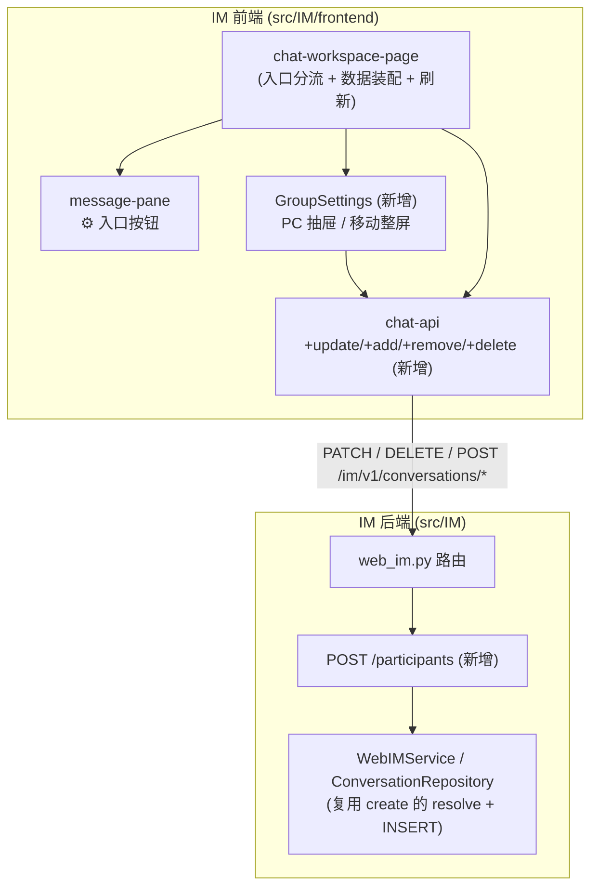
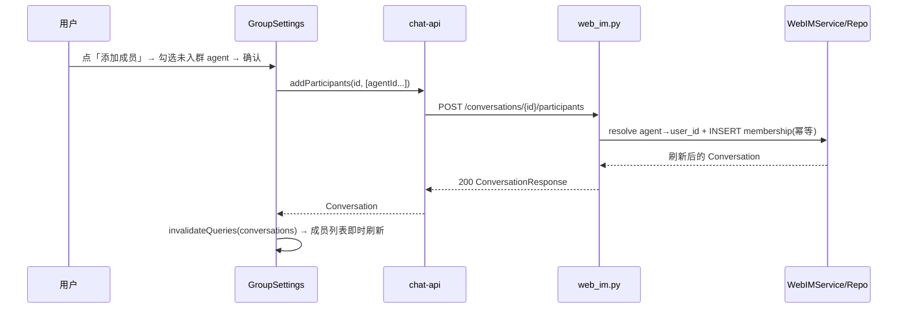
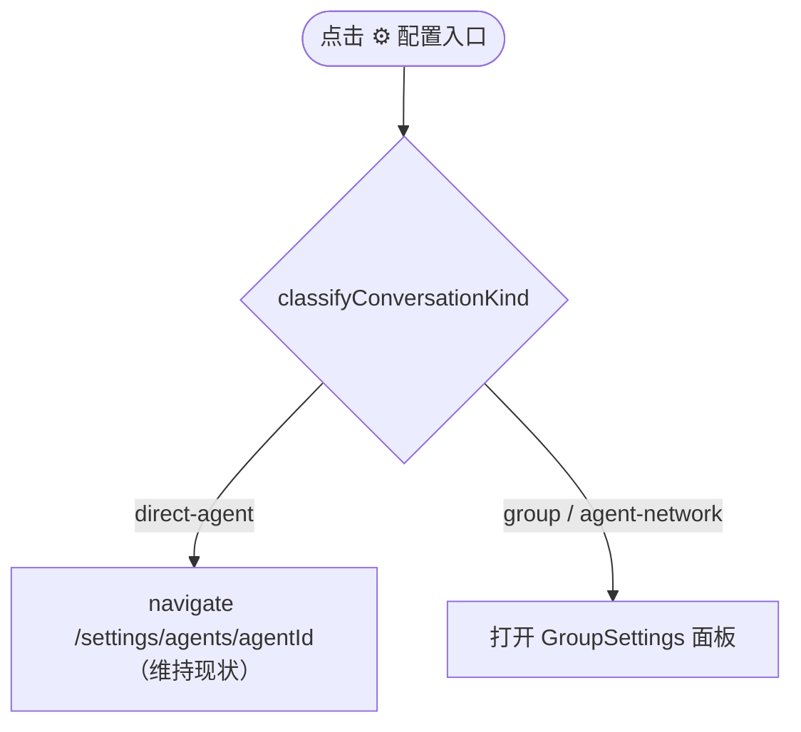

# feat-438: IM 群聊设置（改群名 + 成员管理：看 / 加 / 移除） — 技术方案

> 对齐: spec.md v1
> Unit branch: `unit/feat-438` (will be created by orchestrator)
> 原型: prototype.html（PC 右侧抽屉 4 帧 + 移动整屏页 5 帧 + 入口 2 帧，已浏览器渲染校验）

## Changelog

<!-- 实施期偏差才记。 -->

## 现状分析

### 涉及范围

- `src/IM/frontend/src/features/chat/v2/chat-workspace-page.tsx` —— **bug 源头 + 入口分流落点**。`headerAgentContext`(229-258) 用 `participants.find(p=>p.type==="agent")` 抓第一个 agent；`onOpenConfig`(457-461) 据此 `navigate(/settings/agents/{agentId})`，群聊也走这条 → 错跳第一个 agent 配置页。同文件持有 `agentsQuery` / `nodesQuery` / `queryClient`，是装配群设置所需数据 + 失效刷新的地方。
- `src/IM/frontend/src/features/chat/v2/components/message-pane.tsx` —— ⚙ 配置按钮(248-263，桌面文字 / 移动图标)、标题只读(228)、成员只读文本(231-242)。⚙ 触发回调即群设置入口。
- `src/IM/frontend/src/features/chat/v2/chat-api.ts` —— 已有 `createConversation`；**缺** `updateConversation` / `addParticipants` / `removeParticipant` / `deleteConversation`。
- `src/IM/frontend/src/features/chat/v2/components/new-group-modal.tsx` —— **可复用**：modal(桌面 `chat-modal-backdrop`)/bottom-sheet(移动)壳 + agent 多选 checkbox 列表，是「添加成员」选择器与面板骨架的样板。
- `src/IM/api/routes/web_im.py` —— `PATCH`(改名,199)、`DELETE participants/{uid}`(移除,267)、`DELETE conversations/{id}`(解散 creator-only,234) 已具备；**缺** `POST participants`。
- `src/IM/application/web_im_service.py` + `src/IM/infra/repositories.py` —— `create_conversation` 内有 agent→user_id 归一 + `INSERT conversation_participants`(repo:478)，是新「添加成员」端点的复用源。

### 既有约束

- IM 不 import agent；前端只经 `/im/v1/*` HTTP（`authFetch`，401 自动刷新重试）。
- 成员标识 = IM `user_id`（UUID）。前端 `conversation.participants[].id` 即该 user_id，移除直接用它，无需额外查询。
- 解散权限在 **service 层**硬校验 `creator_id == requester`（repo），非创建者 403——不是仅 UI 挡。
- 后端 add/remove/rename/dissolve **均不发 WS 会话事件**；前端靠 `listConversations` 的 react-query 刷新感知变化。

### 可复用能力

- **用**：NewGroupModal 的 modal/sheet 壳 + agent picker；`createConversation` 的 participant resolve 逻辑；三个现成端点（PATCH / DELETE participant / DELETE conversation）。
- **改**：`chat-workspace-page` 的 `onOpenConfig` 分流；`chat-api` 增 4 个调用。
- **新增**：后端 `POST /conversations/{id}/participants`（抽 create 路径的 resolve + INSERT，**不碰 relay**）；前端 `GroupSettings` 组件（PC 抽屉 / 移动整屏两形态）。

### 相关历史

- feat-379（直接聊天单窗口/去 New 按钮）、bugfix-358/413（mention 渲染）、feat-434（审批 UX）触及同区域但不冲突。
- **relay 关键事实**：relay task 由 `enqueue_message_relay_all` 在**发消息时**按当前 participants 动态创建（relay_service:190+），非建会话/加成员时预建 → 加成员仅需 membership INSERT，下一条消息自然中继到新成员。spec.md 里「为新增 agent 创建 relay task」一句据此**作废**，本 design 纠正。

## 架构总览

改动集中在 IM 包：前端新增一个 `GroupSettings` 组件（两形态）+ chat-api 四个调用 + 入口分流；后端新增一个 participants POST 端点。无跨包改动。



> before：群聊 ⚙ → `navigate(agent 配置)`（错）。after：群聊 ⚙ → 打开 `GroupSettings`；direct chat ⚙ → 仍 `navigate(agent 配置)`。

## 关键决策

### 决策 1: 群设置 UI = 独立组件，PC 抽屉 / 移动整屏两形态

**新增 `GroupSettings` 组件，PC 渲染为右侧滑入抽屉、移动端渲染为整屏推入页（按 `useIsMobile` 切形态），复用 `chat-modal-*` / `chat-modal-sheet` 设计 token，但不复用 NewGroupModal 的居中 modal 形态。**

- **理由**：群信息是常驻浏览型面板，PC 抽屉让聊天上下文不被遮断、移动整屏给足触控目标（见 prototype）；两形态都用现成 token，落地成本可控。
- **拒绝**：① 居中 modal 两端通用——移动端承载「列表+改名+添加+解散」太挤，且和"信息页"心智不符；② 独立路由页 `/chat/:id/settings`——要加 router + 页面 shell + 移动返回栈，重且偏离浮层心智。
- **风险**：抽屉/整屏是两套布局，状态逻辑须共享、视图分叉，组件需吃 `isMobile` 分支。可控（NewGroupModal 已是同款分支范式）。

### 决策 2: 配置入口按会话类型分流，修掉「抓第一个 agent」

**`chat-workspace-page` 的 `onOpenConfig` 改为按 `classifyConversationKind(activeConversation)` 分流：`direct-agent` → 维持 `navigate(/settings/agents/{agentId})`；`group` / `agent-network` → 打开 `GroupSettings`。`headerAgentContext` 抓第一个 agent 的逻辑仅服务 direct-agent 头像/NodeChip，群聊不再据它跳转。**

- **理由**：bug 根因是群聊复用了 direct「会话即单 agent」假设。按类型分流是最小且语义正确的修法；成员行点击进 agent 配置承接「配某个 agent」的需求（prototype A1/B1）。
- **拒绝**：在 ⚙ 上加「先选 agent」中间层——把配成员当主语义，与群治理诉求错位。
- **风险**：`agent-network`（全 agent、无 user 的群）也归群设置，其成员列表无 user 行、解散权限仍是 creator（owner 用户）——已在 prototype 成员区覆盖。

### 决策 3: 新增 `POST /conversations/{id}/participants`，复用 create 的 resolve + INSERT，不碰 relay

**后端加一个端点接收 agent 列表，复用 `create_conversation` 路径里的 agent→user_id 归一 + `INSERT conversation_participants`；幂等跳过已在群成员；不预建 relay task（发消息时动态建）。owner 租户校验同其它端点（404 跨租户）。**

- **理由**：membership 写入与 resolve 已存在于 create 路径，抽成可复用方法即可；relay 既然发消息时按 participants 动态建，加成员零 relay 改动（现状分析已证）。
- **拒绝**：建会话时预建 relay、加成员同步建——与现状 relay 生命周期不符，徒增耦合。
- **风险**：并发重复添加 → 幂等（先查存在再插，或 INSERT OR IGNORE）兜底；resolve 不到的 agent_id → 400。

### 决策 4: 写操作后用 react-query 失效刷新，解散后离开死会话

**改名 / 加 / 移除成功后 `queryClient.invalidateQueries(["chat-v2","conversations"])` 拉最新会话（含 participants/title）；解散成功后额外 `navigate("/chat")` 回会话列表空态。不依赖 WS 推送（后端不发会话事件）。**

- **理由**：贴合现状——会话元数据变化本就靠 listConversations 刷新（现状分析）；自身操作用失效刷新确定、简单。
- **拒绝**：为成员变更新增 WS 会话事件——超出本 unit 范围，且单人自操作无需服务端推送。
- **风险**：刷新有一跳网络延迟 → 可加乐观更新（移除/改名先本地改 cache，失败回滚），列入 worker roadpoint，不强制。

## 接口与数据流

### 前端 chat-api 新增（签名）

```
updateConversation(id, { title }) -> Conversation        // PATCH  /im/v1/conversations/{id}
addParticipants(id, agentIds: string[]) -> Conversation  // POST   /im/v1/conversations/{id}/participants
removeParticipant(id, userId) -> void                    // DELETE /im/v1/conversations/{id}/participants/{userId}
deleteConversation(id) -> void                           // DELETE /im/v1/conversations/{id}
```

### 后端新增端点

```
POST /im/v1/conversations/{conversation_id}/participants
body:  { participants: [{type:"agent", id:"<agent_id>"}, ...] }   # 复用 ActorPayload
200:   ConversationResponse（含刷新后的 participants）
400:   participants 为空 / agent_id resolve 失败
404:   conversation 不在调用者租户
```

### 时序：添加成员（主流程，跨前后端）



### 入口分流（决策 2 判断）



## 契约层增量 (delta-spec)

- kernel: no spec delta
- im: **specs/im/spec.md**（新增「添加参与者」HTTP 端点 + 群成员/群名管理的 Web 可观察行为）
- gateway: no spec delta
- cli: no spec delta

## 风险与回退

- **加成员后旧消息不回填给新成员**：新成员只对加入后的消息中继（relay 发消息时建）——符合 IM 直觉（入群只看后续），非缺陷，文档明确即可。
- **乐观更新与刷新竞态**：若做乐观更新，移除/改名失败须回滚本地 cache；不做乐观更新则只有一跳延迟，无竞态。worker 二选一，默认后者（更稳）。
- **解散竞态**：解散后 `navigate("/chat")`；若 WS/缓存里仍残留该会话，list 失效刷新会清掉（后端已删）。
- **回滚**：纯增量 unit。前端回退 = 移除 GroupSettings + 还原 onOpenConfig 为旧逻辑（群聊会退回错跳，即现状 bug）；后端回退 = 删 POST 端点。无数据迁移、无破坏性 schema 改动。

## Runbook for Reviewer

本 unit 改 IM 前端面 + IM 后端。reviewer 需起 IM 服务并走 Web UI。

| 服务 | 停止命令 | 启动命令 | 健康检查 |
|---|---|---|---|
| IM (uvicorn) | `stop_pidfile .im.pid` | `IM_JWT_SECRET="demo-jwt-secret-for-feat340-testing" PYTHONPATH=src python -m uvicorn IM.app:app --host 127.0.0.1 --port $IM_PORT > .im.log 2>&1 & echo $! > .im.pid` | `curl -s 127.0.0.1:$IM_PORT/ -o /dev/null -w '%{http_code}'` → 200 |
| IM 前端 (Vite) | `stop_pidfile .vite.pid` | `cd src/IM/frontend && npm run dev -- --port $VITE_PORT --strictPort > .vite.log 2>&1 & echo $! > .vite.pid` | 打开 `http://127.0.0.1:$VITE_PORT/` 登录 |

注册/登录测试账号见 AGENTS.md（nano / nano1234）。需建一个含 ≥2 个 agent 的群聊与一个 direct chat 走查。

**Review 驱动方式**: 端到端真栈；本 unit **改了客户端面**（群设置面板 + 入口分流），必须**真驱动 Web UI**。关键界面：① 群聊头部 ⚙ → 群设置打开（非跳 agent 配置）；② direct chat ⚙ → 进 agent 配置（回归）；③ 改名（含空名拒绝）；④ 成员列表点 agent 进配置；⑤ 添加成员（候选排除已入群、空态）；⑥ 移除成员（含移到 0 agent）；⑦ 解散（确认 + 回列表）；⑧ 移动端（375px）各项。

## Milestones

单 M1：群设置是一个端到端垂直切片（前端面板 + 一个后端端点强耦合，按 §4.3 不拆前后端）。范围/工作量在单 worker 窗口内。

| ID | 标题 | 依赖 | 并行组 | 范围 | 退出标准 |
|---|---|---|---|---|---|
| feat-438-M1 | group-settings | — | A | `src/IM/api/routes/web_im.py`（+POST participants）、`src/IM/application/web_im_service.py` / `src/IM/infra/repositories.py`（+add_participants 复用 resolve/INSERT）、`src/IM/frontend/src/features/chat/v2/`（新 GroupSettings 组件 + chat-api 4 调用 + chat-workspace-page 入口分流 + message-pane 接线）、对应单测 | `[reviewer]` 覆盖 spec 全部 Requirement/Scenario：群聊 ⚙ 开群设置不跳 agent（Req-配置入口）、direct chat ⚙ 不变、改名成功/空名拒绝、成员列表点 agent 进配置、添加成员（候选排除已入群/空态）、移除（含移到 0 agent 不提示）、解散（确认+回列表）、移动端各项<br>`[worker]` 新端点 `POST /participants` 单测（成功/幂等/空/resolve 失败/跨租户 404）；前端 chat-api 4 调用单测；`pytest -q tests/ -m "not e2e"` 与前端 `npm run test` 绿；实现对照 prototype.html 视觉一致 |

`mkdir docs/changes/feat-438-im-group-settings/M1-group-settings/`
