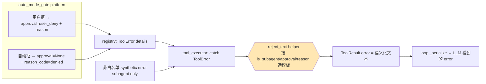
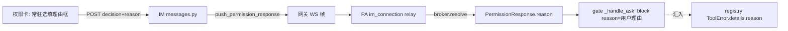
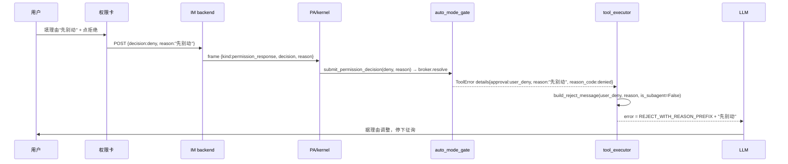

# feat-440: 工具拒绝时回传给 LLM 的语义化反馈 — 技术方案

> 对齐: spec.md v1

> Unit branch: `unit/feat-440` (will be created by orchestrator)

## Changelog

## 现状分析

### 涉及范围

- `src/agent/platform/hooks/builtins/auto_mode_gate.py` —— 授权闸门。`_handle_ask`（:714）用户拒时返回 `{"block":True, "reason": response.reason or "user denied", "approval":"user_deny"}`；自动拒（分类器 / deny-limit / fail-closed）走更早的 return，`approval` 缺省（None）。本 unit **不改判定逻辑**，只新增/透传 reason。
- `src/agent/core/tools/registry.py:190-209` —— block 打包成 `ToolError`，消息体硬编码 `"tool blocked by hook"`，`details={blocked_by_hook, reason, reason_code:"denied", approval}`。**reason 已进 details**。
- `src/agent/core/agent/tool_executor.py:154-172` —— subagent fork 的非白名单工具：在到 registry 前就产出 synthetic error `"tool 'X' is not allowed in this ..."`（独立路径，不走 hook block）。`214-238` —— catch `ToolError`，从 details 提 `reason_code`+`approval` 挂到 `ToolResult`，**当前丢弃 `details["reason"]`**；`error=str(exc)` 仍是 `"tool blocked by hook"`。本 unit 的拒绝文本构造收口在这里。
- `src/agent/core/agent/loop.py:989` `_serialize_tool_result_content` —— 把 `result.error` 塞进 `{"error": ...}` 发给 LLM。本 unit 不改此处，让它原样透传 tool_executor 构造好的文本。
- IM 理由透传链：`src/IM/api/routes/messages.py:414`（`SubmitPermissionDecisionRequest`，现仅 `message_id`+`decision`）→ `gateway_handler.push_permission_response` → 网关 WS 帧 → `src/personal_assistant/ws/im_connection.py` relay → `broker.resolve(PermissionResponse(...))`。
- `src/agent/platform/permissions/broker.py:46-51` —— `PermissionResponse.reason: str = ""` **字段已存在**，现在无人填。
- `src/IM/frontend/src/features/chat/v2/components/permission-card.tsx:88-110` —— POST body 现为 `{message_id, decision}`，无理由输入框。

### 既有约束

- `core` 不依赖 `platform`：拒绝文本构造落在 `tool_executor`（core）/`loop`（core），文本常量模块必须落 core，不能 import platform。
- 产品包（IM / personal_assistant）只 import `agent.sdk`，不碰内核内部。
- subagent fork 是 unattended（`run_origin=BACKGROUND_TASK`，`context_fork.py:223`，无 permission channel）：**永不产生 user_deny**，gate 在 fork 内只会 fail-closed / unattended-fallback deny。

### 可复用能力

- **沿用** `tool_executor` 提取 `reason_code`/`approval` 的既有模式（bugfix-410 / feat-434 建）：本 unit 把 `details["reason"]` 一并提上来，并在同处构造最终 `error` 文本。
- **沿用** `PermissionResponse.reason` 既有字段承载用户理由，不新增并行字段。
- **新建** 一个集中的拒绝文本模块（仿 CC `src/utils/messages.ts` 的常量集中模式），落在 core。
- **subagent 信号**：`tool_executor` 的 `self._tool_execution_allowlist is not None` 即「我在 subagent 里」，无需新增 RunOrigin。

### 相关历史

- feat-434（approval UX：`approval=user_allow/user_deny` 信号 + 闸门区 已授权/已拒绝 徽标）—— 本 unit 复用 `approval` 信号区分用户拒 vs 自动拒，**不改徽标呈现**。
- bugfix-410（`reason_code="denied"` 徽标分类）—— 复用该信号，**不改徽标**。

## 架构总览

本 unit 两条独立改动汇到一处：

**(1) 拒绝文本构造**（kernel，核心）—— 把"恒为 `tool blocked by hook`"改成按信号选模板，收口在 `tool_executor`：



before：四类拒绝在 `S` 处全是 `{"error":"tool blocked by hook"}`。
after：`H` 按信号产出主会话拒 / 主会话拒+理由 / 自动拒 / subagent 拒 四类语义文本。

**(2) IM 拒绝理由透传**（im + gateway + PA + 前端）—— 给已有 deny 链路加一个选填 `reason` 字段，落到 `PermissionResponse.reason`：



两条在 `details.reason` 处汇合：用户理由经 (2) 填进 `PermissionResponse.reason`，gate 把它放进 block reason，最终被 (1) 的 helper 拼进 `REJECT_MESSAGE_WITH_REASON` 文本。

## 关键决策

### 决策 1: 拒绝文本统一在 tool_executor 构造，subagent 两路径合并为 SUBAGENT_REJECT

**选了「在 `tool_executor` 用单一 helper 按 `(is_subagent, approval, reason)` 选模板构造 `ToolResult.error`；subagent 的『非白名单 synthetic error』与『gate 被拒』两条路径统一成 SUBAGENT_REJECT 风格」。**

- **理由**：决定措辞的根本是"拦下后控制权交给谁"——主会话有用户可等（REJECT「停下等指示」），subagent 无人可等（SUBAGENT_REJECT「换方法/上报」）。subagent 两条路径对 LLM 的下一步指引完全一致，暴露内部机制差异无价值。`tool_executor` 是唯一同时握有三组信号的点：① catch 到 `ToolError.details{reason, reason_code, approval}`；② 自身即非白名单 synthetic error 产生处；③ `self._tool_execution_allowlist is not None` 天然知道 subagent 上下文。四类拒绝收敛一处，不散落。
- **拒绝**：① 只改 gate 路径、留非白名单原文 —— 同样"子任务里工具用不了"给 LLM 两种风格，无谓不一致；② 在 `loop._serialize` 构造 —— 那里拿不到 `details["reason"]`（被丢）也无 allowlist 信号，需额外挂字段穿透，不如就近收口。
- **风险**：subagent 既 unattended、永不 user_deny，CC 的 `SUBAGENT_REJECT_MESSAGE_WITH_REASON_PREFIX`（带理由版）在本项目是**死路径**——不实现该变体，除非将来 subagent 接入授权通道。

### 决策 2: 拒绝文本模块落 core，CC 文本逐字照搬 + 私有名词本地化裁剪

**选了「新建 `src/agent/core/agent/reject_messages.py`，集中常量 + `build_reject_message(*, approval, reason_code, reason, is_subagent) -> str` 选择器；CC 文本主体逐字照搬，三处本地化」。**

- **理由**：core 落点满足分层（`tool_executor`/`loop` 在 core，文本常量不能依赖 platform）；仿 CC `messages.ts` 集中常量模式，单一选择器便于单测穷举四类。
- **本地化裁剪**（spec Q1.1 实现约束，已核实代码）：
  - 主体 `REJECT_MESSAGE` / `REJECT_MESSAGE_WITH_REASON_PREFIX` / `SUBAGENT_REJECT_MESSAGE` / `AUTO_REJECT_MESSAGE` / `DENIAL_WORKAROUND_GUIDANCE` 逐字照搬。
  - 括号举例 `new_string` → **`newText`**（本项目 Edit 真实参数名，`edit.py:116`；CC 的 `old_string/new_string` 是其私有命名）。
  - 自动拒尾部「在 settings 加 `Bash(...)` 规则」提示句 → **删除**（本项目权限规则是 YAML `config.allow/soft_deny`，无该 settings UX）。分类器原因文本 = `Permission for this action has been denied. Reason: <reason>. ` + `DENIAL_WORKAROUND_GUIDANCE`，不带规则尾句。
  - **不实现** `DONT_ASK_REJECT_MESSAGE`（本项目无 don't-ask 模式）。
- **拒绝**：把常量散落在 `tool_executor` 内联 —— 无法独立单测、复用难。
- **风险**：分类器 `reason` 是 gate 内部 LLM 生成文本（非用户/agent 外部可注入输入），直接拼进回传文本，CC 本身如此，无新增注入面。

### 决策 3: IM 拒绝理由只补两端，复用既有 reason 全链路

**选了「不新增并行字段；只在 IM backend 入口 + 前端两端补 `reason`，中下游复用现成链路」。**

- **关键事实**（现状分析）：`PermissionResponse.reason`（broker.py:51）/ `kernel.submit_permission_decision(reason=)`（kernel.py:1001）/ PA handler `body.get("reason")`（main.py:3033）/ gate `response.reason`（auto_mode_gate.py:716）**已全程铺好**，现仅因两端不发而恒空。
- **改动收敛 4 处**：① 前端 `permission-card.tsx` 加常驻选填理由框、POST 带 `reason`；② IM `messages.py` `SubmitPermissionDecisionRequest` 加 `reason`，透传给 `push_permission_response`；③ `gateway_handler.py:push_permission_response` 加 `reason` 参数 + 写进 frame；④ kernel 侧 `tool_executor` 把现被丢弃的 `details["reason"]` 提上来喂 `build_reject_message`（与决策 1 helper 配套）。
- **理由**：硬造新字段与既有 `reason` 语义重叠；两端补齐即闭合。
- **拒绝**：新增独立 `reject_reason` 字段贯穿——重复链路。
- **风险**：用户理由是外部文本、进 LLM 上下文，但与普通用户消息同信任级（用户对自己 agent 说的话），不做额外转义。

## 接口与数据流

### 新增/改动接口

**kernel — `src/agent/core/agent/reject_messages.py`（新建）**

```python
# 常量（CC messages.ts 照搬主体，本地化见决策 2）
REJECT_MESSAGE: str
REJECT_MESSAGE_WITH_REASON_PREFIX: str   # 其后拼 user reason
SUBAGENT_REJECT_MESSAGE: str
DENIAL_WORKAROUND_GUIDANCE: str
def auto_reject_message(tool_name: str) -> str            # AUTO_REJECT + guidance
def classifier_reject_message(reason: str) -> str         # "...Reason: <r>. " + guidance（无规则尾句）

def build_reject_message(
    *, tool_name: str, approval: str | None, reason_code: str | None,
    reason: str | None, is_subagent: bool,
) -> str:
    """按信号选模板。返回喂给 ToolResult.error 的最终 LLM 可见文本。"""
```

**选择逻辑（核心难点，专门表）** — `build_reject_message` 的判定：

| is_subagent | approval | 其它 | 返回 |
|---|---|---|---|
| True | — | （含非白名单 synthetic / gate 被拒） | `SUBAGENT_REJECT_MESSAGE` |
| False | `"user_deny"` | `reason` 非空 | `REJECT_MESSAGE_WITH_REASON_PREFIX + reason` |
| False | `"user_deny"` | `reason` 空 | `REJECT_MESSAGE` |
| False | None（自动拒） | reason 含分类器原因 | `classifier_reject_message(reason)` 或 `auto_reject_message(tool_name)` |

> 非白名单 synthetic error 路径（tool_executor:154）原本不带 approval/reason_code，但因 `is_subagent=True` 优先命中第一行，统一为 SUBAGENT_REJECT。

**kernel — `tool_executor.py` 改动**：catch `ToolError` 分支额外提 `details["reason"]`；对非白名单 synthetic error 与 catch 分支，均调 `build_reject_message(..., is_subagent=self._tool_execution_allowlist is not None)` 得到 `error` 文本。`loop._serialize_tool_result_content` 不变（原样透传 `result.error`）。

**im — `messages.py`**：

```python
class SubmitPermissionDecisionRequest(BaseModel):
    message_id: str
    decision: str
    reason: str | None = None          # 新增，选填
```
`submit_permission_decision` 把 `payload.reason` 传给 `gateway_handler.push_permission_response(reason=...)`。

**im — `gateway_handler.py`**：`push_permission_response(..., reason: str | None = None)`，frame payload 增 `"reason": reason or ""`。

**前端 — `permission-card.tsx`**：按钮区上方常驻 `<input>`（受控 state `reason`）；`handleChoice` 在 POST body 带 `reason: reason.trim() || undefined`；允许类决策不读该值（后端对 allow 决策忽略 reason）。

### 主流程时序（用户拒绝 + 填理由）



## 前端原型

- 原型文件: [prototype.html](prototype.html)
- 覆盖范围：本 unit **唯一用户可见 UI 变更** = 待决权限卡按钮区上方的常驻选填理由输入框（spec Q4 形态 A）。原型演示：① 待决态（含理由框）；② 决策后——现状行为卡片整个消失、「已拒绝/已授权」徽标并入工具调用行（feat-434，本 unit 不改）。回传给 LLM 的拒绝文本是**纯后端、用户不可见**，原型以虚线旁注标注供评审对照，**不是界面的一部分**。演示 JS 仅切状态，不接后端。

## 契约层增量 (delta-spec)

- kernel: [specs/kernel/spec.md](specs/kernel/spec.md) — 工具拒绝结果对 `agent.sdk` 消费者可见的语义化文本（四类）
- im:     [specs/im/spec.md](specs/im/spec.md) — 权限卡常驻选填理由输入框 + deny 决策透传 reason
- gateway: no spec delta（仅透传 reason 字段，无对外行为新增）
- cli:    no spec delta（CLI 不经 IM 权限卡；coding_cli 的拒绝文本随 kernel 改进自动受益，无 CLI 专属对外契约变化）

## 风险与回退

- **风险：分类器 reason 直拼进 LLM 文本**。来源是 gate 内部 LLM，非外部注入面（决策 2）；回退＝若发现不当内容，`classifier_reject_message` 可改为只用 `auto_reject_message(tool_name)` 不含 reason。
- **风险：subagent 带理由死路径**。本项目 subagent unattended 永不 user_deny，不实现带理由 subagent 变体；若将来 subagent 接授权通道，需补 `SUBAGENT_REJECT_MESSAGE_WITH_REASON_PREFIX`。
- **回退**：整 unit 可回滚——`build_reject_message` 退化为返回 `"tool blocked by hook"` 即恢复旧行为；前端理由框移除、后端 `reason` 字段选填，向后兼容（旧前端不发 reason，链路照常）。
- **兼容**：`reason` 全链路选填，旧客户端 / 旧帧无 reason 时一律走默认 REJECT_MESSAGE，无破坏。

## Runbook for Reviewer

| 服务 | 停止命令 | 启动命令 | 健康检查 |
|---|---|---|---|
| IM (uvicorn) | `stop_pidfile .im.pid` | `IM_JWT_SECRET=$SECRET PYTHONPATH=src python -m uvicorn IM.app:app --host 127.0.0.1 --port $IM_PORT > .im.log 2>&1 & echo $! > .im.pid` | `curl -s 127.0.0.1:$IM_PORT/` 返回前端 |
| Gateway (PA) | `stop_pidfile .gateway.pid` | `PYTHONPATH=src python -m personal_assistant.main --config "$WT_CFG" --im-service-url http://127.0.0.1:$IM_PORT --foreground --auto-bind > .gateway.log 2>&1 & echo $! > .gateway.pid` | `.gateway.log` 出现 bound 节点 |
| 前端 dist | — | `cd src/IM/frontend && npm run build`（改了 permission-card 必须重 build） | 卡片出现理由输入框 |

**Review 驱动方式**: 端到端真栈；本 unit **改了客户端面**（权限卡新增理由输入框）—— 必须真驱动客户端面，走查待决权限卡：①空理由拒 ②带理由拒 ③选允许忽略理由框；并经真 agent 看 LLM 后续行为（拒后停下征询 vs 自动拒后换路）。subagent 拒绝文本经 Task 派子 agent 触发被拒工具验。

## Milestones

单 M1：本 unit 是一个内聚特性（拒绝反馈语义化），kernel 文本构造与 IM 理由两端虽分属不同包，但共同服务同一用户故事、且总改动量（reject_messages + tool_executor + IM 3 文件 + 前端 + 测试，估 ~400-500 行）在单 worker 窗口内，无 §4.2 并行/体量/分阶段验证触发条件。横切拆（后端文本 vs 前端输入）会让任一 milestone 都不能独立交付用户价值（§4.3 禁止）。

| ID | 标题 | 依赖 | 并行组 | 范围 | 退出标准 |
|---|---|---|---|---|---|
| feat-440-M1 | semantic-reject-feedback | — | A | `src/agent/core/agent/reject_messages.py`(新)、`src/agent/core/agent/tool_executor.py`、`src/IM/api/routes/messages.py`、`src/IM/ws/gateway_handler.py`、`src/IM/frontend/src/features/chat/v2/components/permission-card.tsx` 及各自测试 | `[reviewer]` 主会话拒后 agent 停下征询不闷头重试（Req-主会话用户拒绝/Scenario-未填理由）；`[reviewer]` 填理由时 agent 据理由调整（Scenario-填写理由）；`[reviewer]` 策略自动拒后 agent 换路/上报（Req-策略自动拦截）；`[reviewer]` subagent 被拒走「换方法/上报」（Req-subagent 区分）；`[reviewer]` 权限卡常驻选填理由框、允许类忽略（Req-IM 权限卡理由框 2 Scenario）；`[worker]` `build_reject_message` 四类映射单测全绿（含非白名单 synthetic→SUBAGENT）；`[worker]` CC 文本主体逐字一致、`newText` 本地化、无规则尾句（单测断言）；`[worker]` IM reason 透传单测（messages/gateway_handler）+ 前端 permission-card 测试绿 |

