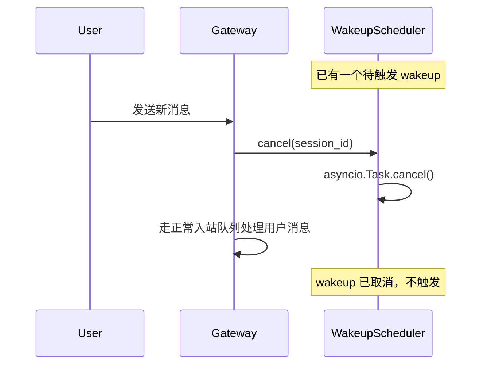

# feat-444: session wakeup — 技术方案

> 对齐: spec.md v1

> Unit branch: `unit/feat-444` (will be created by orchestrator)

## Changelog

<!-- design 阶段保持空。 -->

## 现状分析

### 涉及范围

- `src/personal_assistant/scheduler/` — cron 调度器，`CronExecutionService` 负责定时触发 agentTurn。本 unit 的 wakeup 调度器可复用其模式（asyncio 定时器 + Gateway 事件循环提交），但语义不同（cron 开新隔离 session，wakeup 向同一 session submit）
- `src/personal_assistant/tools/cron.py` — 现有 cron 工具实现。wakeup 工具的结构（closure-direct form、tool 注册模式）应照着它做
- `src/agent/sdk/kernel.py` — `Kernel.submit(session_id=..., model=...)` 已支持向已有 session 提交新 run，JSONL 持久化保证上下文恢复。这是 wakeup 的内核基础，不需要改内核
- `src/personal_assistant/product.py` — Gateway 工厂 `build_pa_kernel()`，工具注册入口。wakeup 工具需在此注册
- `src/personal_assistant/relay/` 或类似 — Gateway 入站消息处理和会话队列管理。wakeup 触发时需通过同一路径提交（确保串行队列不冲突）

### 既有约束

- 产品（`personal_assistant`）只能 import `agent.sdk`，不能 import 内核内部
- Gateway 同会话串行队列：同 session 只能有一个活跃 run，wakeup 触发时如果 session 有活跃 run 应等其结束
- Gateway idle watchdog：120s 无 liveness 心跳会判定失去进展并收尾。wakeup 唤醒后必须正常进入 run 生命周期

### 可复用能力

- `CronExecutionService`：定时器 + asyncio 调度模式可复用，但不复用其代码（语义不同，wakeup 不持久化到 jobs.json，只在内存中）
- `CronTool`：closure-direct form 工具模式，照着做 wakeup 工具的注册/权限/运行
- `Kernel.submit(session_id=...)`：内核已支持同一 session 多次提交，JSONL 持久化保证上下文恢复

### 相关历史

- `bugfix-443-subagent-sidechain-model`：最近改了 subagent 侧链的 run 模型。本 unit 的 wakeup 提交同一 session 的新 run，需确认不与侧链逻辑冲突
- `feat-394`（cron 工具迁移）：cron 工具从 bridge 模式迁到 closure-direct，本 unit 照着新模式做

## 架构总览

核心思路：**wakeup 是 Gateway 层的内存定时器，到点后向同一 session 提交新 run**。不改内核，不持久化，不新增内核 API。

```
┌─ Agent (LLM session) ──────────────────────────────────┐
│                                                          │
│  agent 调用 wakeup(delaySeconds=270, prompt="...",      │
│                    reason="CI 预计 5-8 分钟")            │
│                                                          │
└──────────────────────┬───────────────────────────────────┘
                       │ tool result: "已设唤醒，270s 后继续"
                       ▼
┌─ Gateway (personal_assistant) ──────────────────────────┐
│                                                          │
│  WakeupScheduler (新增, 内存)                             │
│  ┌─────────────────────────────────────────────┐        │
│  │  _pending: dict[session_id, WakeupEntry]    │        │
│  │    WakeupEntry: fire_at, prompt, reason     │        │
│  │                                             │        │
│  │  schedule(session_id, delay, prompt, reason) │        │
│  │    → 取消旧 wakeup → 设 asyncio timer       │        │
│  │                                             │        │
│  │  cancel(session_id)                         │        │
│  │    → 用户发新消息时调用                      │        │
│  │                                             │        │
│  │  _on_fire(session_id)                       │        │
│  │    → Gateway.event_loop.submit(              │        │
│  │        kernel.submit(session_id, prompt))    │        │
│  └─────────────────────────────────────────────┘        │
│                                                          │
│  Gateway 入站消息处理                                     │
│  ┌─────────────────────────────────────────────┐        │
│  │  收到用户消息 → scheduler.cancel(session_id) │        │
│  │  → 走正常入站队列                            │        │
│  └─────────────────────────────────────────────┘        │
│                                                          │
│  kernel.submit(session_id=...) ←── wakeup 触发时         │
│  kernel.submit(session_id=...) ←── 用户消息时（正常路径）│
└──────────────────────────────────────────────────────────┘
```

**Before**: agent 做完一轮后只能结束，或靠 cron 开新 session（无上下文）。
**After**: agent 能设一个定时器，到时间后在同一个 session（有完整上下文）里继续。

## 关键决策

### 决策 1: wakeup 调度器放在哪一层

**选了 Gateway 层（personal_assistant），不改内核**。

- **理由**: wakeup 的语义是"定时向同一 session 提交新 run"，`Kernel.submit(session_id=...)` 已经支持这个能力。wakeup 的调度、取消、去重是产品层关注点（Gateway 管 session 生命周期），不应污染内核的中立性
- **拒绝**: 内核层（agent.core）— 内核产品中立，不知道什么是"wakeup"，不应内置调度语义
- **风险**: wakeup 调度器在 Gateway 进程内存中，进程重启后丢失。但 spec 的非目标已声明这是可接受的（wakeup 是短期一次性，不像 cron 需要持久化）

### 决策 2: wakeup 是否持久化

**选了纯内存，不持久化**。

- **理由**: wakeup 是一次性自调节奏（60-3600s），进程重启后 session 上下文虽在 JSONL 里，但 agent 的意图已过期。用户消息可取消唤醒也暗示它是临时的
- **拒绝**: 持久化到文件/DB — 增加复杂度，且需要处理过期清理、进程恢复后的孤儿唤醒等问题，投入产出比不合理
- **风险**: Gateway 重启会丢失所有待触发唤醒。但 spec 已将此列为非目标

### 决策 3: wakeup 触发时如何提交 run

**选了通过 Gateway 的正常入站路径提交（模拟一条内部消息）**。

- **理由**: 这样 wakeup 触发的 run 自动走 Gateway 的串行队列、idle watchdog、回复路由等完整路径。不绕过任何现有机制
- **拒绝: 直接调 kernel.submit()** — 绕过了 Gateway 的会话队列管理，如果用户同时发消息会竞争
- **风险**: 需要确认 Gateway 的入站路径支持"内部触发"（不仅仅是外部 IM 消息）。cron 的 agentTurn 已经在做类似的事，可参考

### 决策 4: 用户消息取消唤醒的时机

**选了 Gateway 入站消息处理的最早拦截点**。

- **理由**: 用户发新消息 → agent 已被用户手动唤醒了 → 之前的 wakeup 应取消。在 Gateway 处理入站消息的入口处（路由到 session 之前）拦截最干净
- **拒绝: 在 agent run 内部取消** — 太晚，run 已经开始了
- **风险**: 群聊的 buffer 消息不应取消唤醒（那些不是用户直接发的）。需要区分"用户直接发的消息"和"buffer 缓冲"

## 接口与数据流

### WakeupEntry 数据结构

```
WakeupEntry:
  session_id: str          # 目标 session
  fire_at: float           # time.monotonic() + delaySeconds
  prompt: str              # 唤醒时注入的 prompt
  reason: str              # 用户可见的原因
  task: asyncio.Task       # asyncio.create_task 的引用，用于 cancel
```

### WakeupTool 接口（agent 调用的工具）

```
name: "wakeup"
input_schema:
  delaySeconds: number (required, 60-3600, clamp)
  prompt: string (required)
  reason: string (required)
returns:
  ok: bool
  fire_at: ISO timestamp
  message: "已设唤醒，{reason}" or error
```

### 主流程时序

```mermaid
sequenceDiagram
    participant Agent
    participant WakeupTool
    participant WakeupScheduler
    participant Gateway
    participant Kernel

    Agent->>WakeupTool: wakeup(270, "检查 CI", "CI 预计 5-8 分钟")
    WakeupTool->>WakeupScheduler: schedule(session_id, 270, "检查 CI", "CI 预计 5-8 分钟")
    WakeupScheduler->>WakeupScheduler: 取消旧 wakeup → 设 asyncio timer
    WakeupTool-->>Agent: "已设唤醒，270s 后继续"

    Note over Agent: 本轮结束，Agent 空闲

    ... 270 秒后 ...

    WakeupScheduler->>Gateway: 内部触发 submit(session_id, "检查 CI")
    Gateway->>Kernel: kernel.submit(session_id, prompt)
    Kernel->>Kernel: 加载 JSONL 上下文 → AgentLoop 执行
    Kernel-->>Gateway: run 完成，回复
    Gateway-->>Agent: 唤醒后的回复（含完整上下文）
```

### 用户消息取消唤醒时序



## 契约层增量 (delta-spec)

- kernel: no spec delta（不改内核，Kernel.submit 已有）
- im: no spec delta（不改 IM 服务）
- gateway: `specs/gateway/spec.md`（新增 wakeup 相关的可观察行为：agent 设唤醒、用户消息取消唤醒）
- cli: no spec delta（CLI 产品不用 wakeup）

## 风险与回退

**风险 1: Gateway 入站路径不支持内部触发**
- cron 的 agentTurn 已在做类似的事（内部产生一条消息提交给 agent），wakeup 可以复用同一路径
- 如果不行，降级为直接调 kernel.submit()，但需要手动处理串行队列

**风险 2: asyncio 定时器在 Gateway 重启后丢失**
- 已在决策 2 中确认为可接受。wakeup 是短期一次性，重启后 agent 不会自动恢复之前的唤醒计划
- 降级路径：用户重新发起任务，agent 重新设唤醒

**风险 3: 群聊 buffer 消息误取消唤醒**
- 群聊 buffer 消息不应取消 wakeup（不是用户直接交互）
- 解决：cancel 只在"用户直接发的消息"路径触发，buffer 路径不触发

**回滚方案**: 删除 WakeupScheduler、WakeupTool、wakeup 工具注册，Gateway 恢复原状。无数据迁移，无持久化残留。

## Runbook for Reviewer

本 unit 改动 Gateway 进程，需要重启 Gateway 验证。

| 服务 | 停止命令 | 启动命令 | 健康检查 |
|---|---|---|---|
| Gateway | `PYTHONPATH=src python -m personal_assistant.main stop` | `PYTHONPATH=src python -m personal_assistant.main` | `curl http://127.0.0.1:8000/v1/health` |
| IM | 无需重启 | — | — |

**Review 驱动方式**: 端到端真栈;客户端面不改（IM 前端不变），用 IM HTTP API 代驱动（发消息 → 观察 agent 回复中的唤醒计划 → 等待唤醒触发 → 观察 agent 自动继续）

## Milestones

默认单 M1。估算改动 ~5-8 文件、~300-500 行，远低于拆分阈值。

| ID | 标题 | 依赖 | 并行组 | 范围 | 退出标准 |
|---|---|---|---|---|---|
| feat-444-M1 | impl | — | A | `src/personal_assistant/scheduler/wakeup.py`（新增）, `src/personal_assistant/tools/wakeup.py`（新增）, `src/personal_assistant/product.py`（注册 wakeup 工具）, `src/personal_assistant/relay/`（入站消息取消唤醒）, `tests/unit/test_wakeup*.py`（新增）, `docs/specs/gateway/spec.md`（delta-spec） | `[reviewer]` agent 调用 wakeup 后，用户在聊天中看到唤醒计划（Req-agent 能定时唤醒自己 / Scenario-正常唤醒）; 唤醒后 agent 带完整上下文继续（Scenario-唤醒后上下文完整）; 用户发新消息取消唤醒（Req-取消已设的唤醒 / Scenario-用户中断唤醒）; 不设唤醒则循环结束（Scenario-不设唤醒则循环结束） `[worker]` `pytest tests/unit/test_wakeup* -xvs` 全绿; `pytest tests/contract/ -xvs` 全绿（不破坏 agent.sdk 边界）; `ruff check src/personal_assistant/tools/wakeup.py src/personal_assistant/scheduler/wakeup.py` 无报错 |
