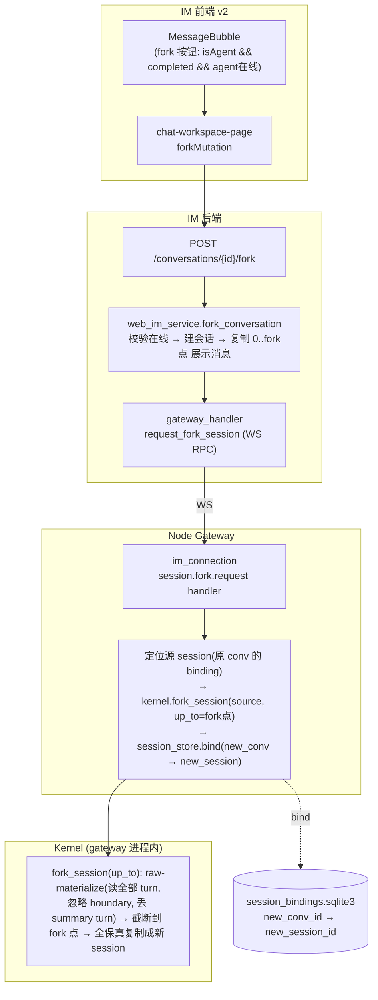
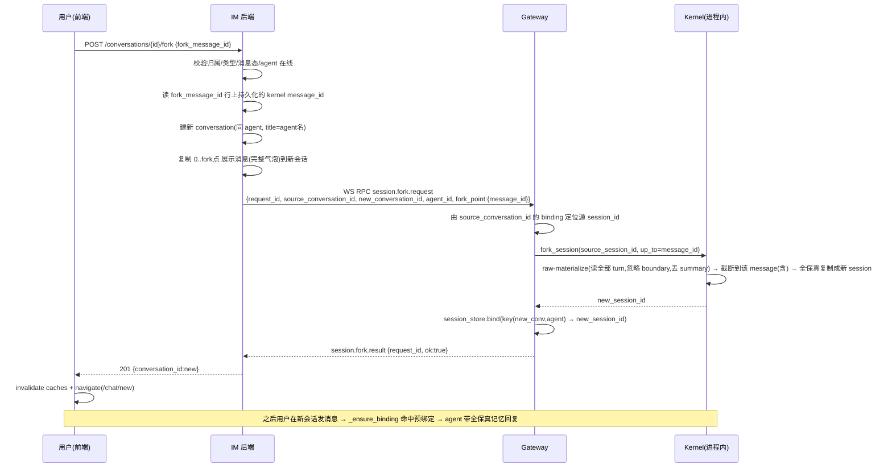

# feat-445: 从某条消息位置 fork 出分支单聊 — 技术方案

> 对齐: spec.md v1
> Unit branch: `unit/feat-445` (will be created by orchestrator)

## Changelog

- v2: 推翻早期「IM 当历史权威 / append_message 灌入」方案，改为**gateway append-only 会话日志为唯一权威 + kernel raw 全量复制到 fork 点**。理由见决策 1。
- v2.1: 核实后修正 fork 点对齐机制——现状无任何现成的「IM 气泡↔kernel」稳定标识落在消息行；改为 **relay 时把标识持久化到 IM 消息行**，fork 时精确截断（决策 4）。
- v2.2: 对齐粒度从 `turn_id` 收紧到逐气泡 `message_id`——一个 run 可产出多条 `assistant_message`=多个气泡（用户反馈），每条都应可 fork，turn 粒度会让同 run 多气泡撞同一刀。所需 `message_id` 现成在 `assistant_message` 事件 payload 里（`realtime_stream.py:54`）。kernel `up_to` 改为按 message_id 在 raw 线性历史切片（决策 4）。
- v2.3: 据 design-review CRITICAL 修正——「无损读」此前错误地宣称复用 `manager.load`，实测 `manager.load`/`list_turn_messages` 同走 `store.load`、在有 compact_boundary 时只返回 boundary 后 turn（jsonl_store.py:224-229），无任何 raw 读路径。改为**新增 raw-materialize 读能力**（读全部 turn、忽略 boundary、丢 `is_compact_summary` summary turn、按 message_id 截断），现状分析区分「写无损/读跳过」，kernel 估算上修 ~80→~160，头号守护测试改为「已压缩源会话 fork 到 compact 点前」。并清两条 WARNING：删决策1/3 的 run_id 残留措辞、kernel delta 由 MODIFIED 改 ADDED。

## 现状分析

> 调研结论建立在第一手代码核对之上（kernel fork/compact 机制、session 存储「写无损/读跳过 boundary」的区别、IM 前端聊天 UI、IM↔gateway WS RPC 模式、relay 事件携带逐气泡 message_id）。

### 涉及范围

- **Kernel**（`src/agent/`，经 sdk 入口）
  - `sdk/kernel.py` —— `fork_session`（:790）当前是 **stub**（忽略 source、只建空 session）；本 unit 改为真实 fork，并新增 `up_to`（fork 点）参数。
  - `core/agent/runtime.py` —— `fork_session`（:1271）/ `_fork_locked`（:1312）已实现**全保真**线性历史复制（re-stamp UUID、保留 `reasoning_content`/工具调用，见 :1354 `replace()`），但**无 fork 点截断**、且热路径优先用内存 `_session_histories`（可能是压缩视图）。本 unit 加 `up_to` 截断 + 改走新增的 raw-materialize 读路径（见下）。
  - `core/session/manager.py` —— **`load`（:95）注释虽写「Load raw config + messages」，但它与 `list_turn_messages`（:215）调的是同一个 `self._store.load`（:100 / :218），二者返回结果一致——`load` 的「raw」指「未经 typed Session 包装的原始条目」，不等于「压缩前全量」。** 现状**没有**任何能取回 compact 前 turn 的读路径。本 unit 须**新增** raw-materialize 能力（见下）。
  - `core/session/jsonl_store.py` —— append-only **写**层（:55），`compact` 只追加 `compact_boundary`+summary turn、不改/删老 turn（manager.py:236-270，summary turn 带 `is_compact_summary:True`）。**但 `store.load`（:224-229）在有 boundary 时只保留「最后一个 compact_boundary 之后的 turn」**——compact 前的原始 turn 在 :196 读进内存后于 :224 被丢弃。即「字节在盘上(写无损)」≠「load 返回它们(读无损)」。本 unit 的 raw-materialize 即补这条读路径。
- **Gateway**（`src/personal_assistant/`）
  - `ws/im_connection.py` —— gateway 处理 IM 下行 RPC 的 dispatch（:399 `node.capabilities.resolve` 模式）；新增 fork session RPC handler。
  - `gateway/session_keys.py` —— `PersistentSessionBindingStore`（:104），`build_session_key`（:407）= `{channel}:{conversation_id}:{agent_id}`；fork 后把新 conversation 预绑定到 fork 出的新 session。
  - `gateway/inbound_pipeline.py` —— `_ensure_binding`（:696）conversation→session 绑定创建/复用点；fork 预绑定后，新会话首条 relay 命中复用、不另建空 session。
- **IM 后端**（`src/IM/`）
  - `application/web_im_service.py` —— `create_conversation`（:33）、`create_message`（:132）；fork 的「建会话 + 复制展示消息 + 委托 gateway」编排落这里。
  - `api/routes/web_im.py` —— conversation/messages HTTP 路由，新增 fork 端点。
  - `ws/gateway_handler.py` —— IM→gateway 的 WS RPC 发起端（waiters + `asyncio.wait_for` 模式，:150 起）；新增「fork session」RPC 发起。
  - `application/event_service.py` —— relay `assistant_message` 事件已带 `message_id`/`run_id`/`turn_id`（源 `platform/hooks/builtins/realtime_stream.py:54），但当前**不落消息行**；本 unit 需在 relay 建 agent 气泡时把 kernel `message_id`（连带 run_id/turn_id 备查）**持久化**到消息行（决策 4）。
  - `domain/models.py` —— `Message`（:268）当前**无 kernel id 字段**；新增 `message_id`（逐气泡）字段（贯穿模型 / 持久化 / 读出 / 复制路径）。
  - `infra/repositories.py` —— message 持久化（新增 kernel message_id 列）；`record_heartbeat` / node `status` = agent 在线判定来源。
- **前端聊天**（`src/IM/frontend/src/features/chat/v2/`）
  - `components/message-pane.tsx` —— `MessageBubble`（:424），`isAgent`/`deliveryStatus`（:436/:444）已能区分 agent 消息与「已完成」态；**目前气泡上无任何消息级操作按钮**，fork 按钮新挂这里。
  - `chat-workspace-page.tsx` —— 会话工作区，持有 `streamState.messages`、agent 在线状态推导；fork 的前端编排（mutation + 跳转）落这里。
  - `chat-api.ts` / `chat-types.ts` —— v2 数据层与 `Message` 类型。

### 既有约束

- 产品包（`personal_assistant` / `IM` 前端）与内核交互**只经 `agent.sdk`**；gateway 进程内持有 `Kernel`，调用 `fork_session`，不碰 core/platform 内部。
- **IM 不直接持有 kernel session 映射**：`conversation_id ↔ kernel_session_id` 绑定只存在于 **gateway 侧** `session_bindings.sqlite3`，且 IM 与 gateway 可跨机——IM 进程**绝不**直读 gateway 侧 workspace / kernel JSONL（沿用 im/spec.md「经 WS RPC 代理到 gateway」既有纪律）。因此「让新会话的 agent 记得历史」**只能由 gateway 执行**，IM 必须经 WS RPC 委托。
- session 存储**写**层 append-only：`compact` 只追加 `compact_boundary`+summary turn、不改/删老 turn → 原始 turn 始终在盘上。但当前**读**层（`store.load`）在有 boundary 时会跳过 compact 前 turn，故「无损读」需本 unit 新增 raw-materialize 能力（实施期头号验证点，见风险段）。「写无损」与「读会跳过」是两件事，不能混为一谈。

### 可复用能力

- **`runtime.fork_session` / `_fork_locked`（runtime.py:1271/1312）—— 用、扩**。已实现全保真线性历史复制（新 UUID、parent 链重算、保留 reasoning/工具），只差「截断到 fork 点」与「喂给它无损历史」。是定稿架构的核心承重件。
- **`store.load` 的逐行读入（jsonl_store.py:191-196）—— 用其前半、绕其后半**。:191-196 已把全部 raw_lines（含 compact 前 turn）读进内存，本 unit 新增的 raw-materialize 复用这步，但**不走** :224-229 的 boundary 跳过，改为「取全部 `turn`、丢弃 `is_compact_summary` 的 summary turn、按 fork 点 message_id 截断」。⚠ **`manager.load` 不可直接用**（它走 :224 跳过），需新增读模式/参数——见决策 1 与风险段。
- **WS RPC request-response 模式（im_connection.py:399 + gateway_handler.py waiters）—— 照搬**。新增一对 fork RPC 帧（IM→gateway 请求 / gateway→IM 回包），与 `capabilities.resolve` / `agent.create` 同构。
- **`_ensure_binding`（inbound_pipeline.py:696）—— 复用其复用分支**。fork 预先把新会话 binding 指向「已 fork 好的 session」，首条 relay 命中复用、不另建空 session。
- **`createDirectChatByAgentUserId` + `navigate('/chat/{id}')`（agent-detail-page.tsx:884/900）—— 跳转 + 双缓存失效模式照搬**到 fork 成功回调。
- **`pickCanonicalDirectConversation`（im-chat-api.ts:1472）—— 不动，但受益**。fork 出的分支 created_at 更新 → 不会被选为 canonical → 不污染「打开单聊」复用的主线。

### 相关历史

- 单聊 canonical / direct-agent 机制由 feat-340 系列建立；fork 沿用其会话模型与命名（title = agent 名），不新造单聊类型。
- relay `assistant_message` 事件 payload 一直带 `message_id`/`run_id`/`turn_id`（`realtime_stream.py:54`；一个 run 可发多条 = 多个气泡，每条各一 message_id），但**未持久化到 IM 消息行**（`domain/models.py:268` 的 `Message` 无 kernel id 字段）；本 unit 把逐气泡的 `message_id` 落到消息行，才使「被点的 IM agent 气泡 → gateway 日志中的那条消息」对齐有稳定且足够细的锚点（决策 4）。
- spec.md Relations 段曾提「fresh session 同族」——该入口在 legacy 聊天界面，**v2 已无 fresh session 入口**（`chat-api.ts` 顶部注释明示）。本 design 以 v2 现状（canonical 复用）为准。
- 早期 design 草案曾以「IM 可见消息为单一历史源、append_message 灌入空 session」实现上下文继承。**该方案已被推翻**（决策 1 拒绝项）：它把展示副本当权威、丢工具/思考保真、且 IM 消息序与 kernel turn 序无稳定 1:1 对齐。

## 架构总览

定稿原则：**对话记录的权威 = gateway 的 append-only 会话日志（无损 C）**。compact 只追加 `compact_boundary`+摘要 turn、永不硬删老 turn（写无损），所以盘上同一份日志既保留全部原始 turn、又有压缩视图所需的 boundary——但**取回无损全量需本 unit 新增的 raw-materialize 读路径**（现状 `store.load` 默认按 boundary 跳过，见现状分析/决策 1）。它是**channel 无关、覆盖该会话全部轮次的无损记录**（每个 conversation 对应一份 per-session JSONL，session_key=`channel:conversation_id:agent_id`；fork 复制的是源 conversation 那一份）；各 channel（内部 IM / 飞书 / 钉钉…）的消息库只是该 channel 的**展示副本**。

因此 **fork 的本质 = gateway 把源 session 日志按 raw 全量复制到 fork 点 → 新 session**。IM 只负责三件事：**提供入口**、**复制自己的展示消息**给新会话回看、**一次 WS RPC 委托** gateway 做真正的 session fork。



**before**：每个 agent 的单聊靠 canonical（最老会话）复用；无法基于历史某点另起带记忆的新线。`kernel.fork_session` 是只建空 session 的 stub。
**after**：在 agent 已完成回复上 fork → gateway 从权威日志 raw 全量复制到 fork 点、生成新 session 并预绑定到新单聊；新单聊可见历史 = IM 复制的 0→fork 点完整气泡，agent 记忆 = gateway 日志同段的**全保真**副本（含工具/思考）。与原会话、与 canonical 主线均独立。

## 关键决策

### 决策 1: 上下文继承走「gateway raw 全量复制日志到 fork 点」，不走 IM 历史 append

**选了由 gateway 调 `kernel.fork_session(source, up_to=fork点)`，从源 session 的 append-only 无损日志（raw 全量）复制到 fork 点，生成独立新 session**（扫这行即够判断方向）。

- **理由**：
  1. **权威单一**：对话记录的权威是 gateway 的无损会话日志，不是任何 channel 的展示副本。fork 应从权威复制，才能保证 agent 记忆与「真发生过的对话」字字一致，也才对未来多 channel（飞书/钉钉）一视同仁。
  2. **全保真**：`runtime._fork_locked` 已保留 `reasoning_content`/工具调用（runtime.py:1354 用 `replace()` 整体复刻 Message）；只要喂给它无损历史，agent 记忆与原会话完全等价。
- **承重前提（实现关键，勿当 flag 翻转）**：定稿架构的「无损」依赖一条**当前不存在**的读路径。现状 `manager.load` / `store.load` 在有 compact_boundary 时只返回 boundary 之后的 turn（jsonl_store.py:224-229），即压缩视图 B 而非无损 C。本 unit 须**新增 raw-materialize 读能力**：读全部 `turn`、忽略 `compact_boundary`、**丢弃带 `is_compact_summary:True` 的 summary turn**、按 fork 点 message_id 截断。因原始 turn 从不被 compact 改写（append-only 写层），fork 点之前的前缀天然是一段**完整原始链**，无需跨 boundary 缝合 parent 链。这是新增能力、非翻 flag，kernel 改动量见 M1（已上修）。
- **拒绝**：
  - **「IM 可见历史为源 + append_message 灌入空 session」**（早期草案）：把展示副本当历史权威；`append_message` role 仅 user/assistant，工具/思考无法进 agent 记忆（保真丢失）；IM 消息序与 kernel turn 序无稳定 1:1 对齐，截断点易错。
  - **「直接复用 `manager.load` 当无损读」**：它走 `store.load` 的 boundary 跳过（:224），对已 compact 的源会话只拿到摘要+boundary 后 turn——**这正是本 unit 评审揪出的错前提**，故必须新增 raw-materialize。
  - **`runtime.fork_session` 原样直用**：无 fork 点截断（全量复制整段），且热路径优先读内存 `_session_histories`（可能是压缩视图）。
  - **「create_session 传 seed_messages」**：无此参数，要新造内核 API，过度。
- **风险**：① fork 点对齐——把「被点的 IM agent 气泡」映射回「源日志中的那条 assistant 消息」，靠决策 4 的逐气泡 `message_id`（不是 run_id）。② 无损 raw-materialize 的正确性（见风险段，本 unit 头号验证点）。

### 决策 2: fork 由 IM 同步编排，经一次 WS RPC 委托 gateway 完成 session fork

**选了 IM 收 fork 请求后同步编排：建会话 + 复制展示消息在 IM 本地完成，session fork 经一次 WS RPC 委托 gateway**。

- **理由**：`conversation_id↔session` 绑定只在 gateway 侧，且 IM 不得直读 gateway 日志，故 session fork 只能委托 gateway；WS RPC 委托是既有成熟模式（capabilities.resolve / agent.create）。同步（而非 lazy）才能在 fork 当下校验 agent 在线并给出「离线明确提示」。
- **拒绝**：lazy fork（gateway 首次 relay 时才 fork）——无法在 fork 动作当下判离线、当下保证记忆就绪，违反 spec「离线明确提示、不留无记忆空壳」。
- **风险**：RPC 往返增加 fork 延迟，需设超时与失败回滚（决策 5）。

### 决策 3: 历史两份表示——IM 存完整气泡供展示，gateway 日志副本供 agent 记忆

**选了 IM 侧复制完整消息（content + tool_calls + thinking + attachments）供 UI 回看，agent 记忆来自 gateway 对权威日志的 raw 全保真 fork——两者同源（都源自那段真实对话），各自存储。**

- **理由**：spec 要「完整气泡形态」给用户看（IM 展示副本承担）；agent 的「记得」要与真实对话等价（gateway 日志副本承担，含工具/思考）。两份表示各司其职，但都忠实于同一段真实对话，不存在「显示与记忆不一致」。
- **拒绝**：只保一份（让 IM 展示去重建 agent 记忆，或让 agent 记忆去渲染 UICI）——跨机、保真、职责都不成立。
- **风险**：两份在 fork 点的边界需对齐（IM 复制到 fork 点的展示消息 ↔ gateway 复制到 fork 点的那条 assistant 消息）；靠同一个 fork 点标识（决策 4 的逐气泡 `message_id`）双向对齐。

### 决策 4: fork 点对齐——relay 时把每条气泡对应的 kernel `message_id` 持久化到 IM 消息行，fork 按 message_id 精确截断

**选了在 relay 出站建 IM agent 消息时，把该气泡对应的 kernel `message_id`（连带 `run_id`/`turn_id` 备查）写进 IM 消息行；fork 时 IM 由 `fork_message_id` 读出该 `message_id` 传给 gateway，gateway 在源 session 日志的线性历史里截断到该 message（含）为止**。

- **粒度必须到 message，不能停在 turn**：**一个用户提问 → 一个 run → 可能产出多条 `assistant_message`**（agent 说一段 → 调工具 → 再说一段），每条都是一个独立 IM 气泡、用户都应能在其上 fork（`gateway/inbound_pipeline.py:1493` 每个 `assistant_message` 事件转一条 `agent.text.message`）。同一 run/turn 下的多个气泡共享同一个 `turn_id`——若按 turn 截断，fork 到这些气泡中任意一个都会截在同一刀、带错历史。故对齐键必须是**逐气泡唯一的 kernel `message_id`**。
- **现状核查（第一手）**：当前 IM 消息行**不存**任何 kernel 侧 id（`domain/models.py:268` 的 `Message` 无 run_id/message_id 字段；run_id 只在 relay 事件瞬时流转）。但**所需的 `message_id` 现成就在事件里**——`assistant_message` 事件 payload 同时带 `run_id` / `turn_id` / **`message_id`**（`platform/hooks/builtins/realtime_stream.py:54`，每条 assistant 消息各一）。gateway relay 建 IM 气泡时把它落库即可，无需任何新计算。
- **理由**：`message_id` 是逐气泡唯一、且天然存在于 kernel 日志（每条 assistant 消息条目的 id）与 relay 事件两侧的稳定标识。落到 IM 消息行后，fork 时 O(1) 读出、kernel 端按它在 raw 线性历史里切片，精确且不依赖任何序号/启发式推断——把「映射不稳/带多带少/多气泡撞刀」整类风险从设计层消灭。
- **拒绝**：① 按 `turn_id` 对齐——多气泡同 turn 时粒度不够（本决策核心动因）；② 按气泡序号对齐——gateway 丢空正文回合（feat-439）使序号不稳；③ gateway 另维护 `im_message_id→message_id` 映射表——多一份跨机可变状态，不如随 IM 消息行持久化。
- **截断语义**：`up_to=message_id` = 复制 raw 线性历史到「id==message_id 的那条 assistant 消息」为止（含），其后一律不带。导向该消息的前置条目（同 turn 内更早的 user 触发 / 工具往返）自然包含；该消息之后的（含同 turn 里更晚的气泡）不含。
- **范围影响**：M1 须含「relay 写 `message_id` 到 IM 消息行」这一步（小 schema 增列 + relay 写入 + 该字段进 `Message` 模型与复制路径）。对**历史旧气泡**（无该字段，仅本特性上线前）：fork 入口禁用，不回填。
- **守护测试**：① fork 到**中间**某条 agent 回复 → IM 展示截断点与 gateway 日志截断点指向同一条 message、fork 点后均不带；② **同一 run 产出多气泡**时，分别 fork 第 1、第 2 条气泡 → 两次截断点不同、各自精确到对应 message。

### 决策 5: agent 在线校验前置 + 失败原子回滚，绝不留无记忆空壳

**选了 fork 入口与执行双重把关：前端按在线状态置灰/拦截，IM 端再次校验 node online；gateway RPC 失败则删除已建会话与已复制展示消息**。

- **理由**：spec 明确「离线不可用 + 明确提示，且不得建出 agent 不记得历史的单聊」。前端校验给即时反馈，后端校验防竞态，回滚保证原子性。
- **拒绝**：建好会话即返回、session fork 异步补（会出现「有历史显示但 agent 不记得」的空壳窗口，spec 明令禁止）。
- **风险**：复制展示消息后 RPC 才失败 → 需回滚已建 conversation + 已复制 messages；用删除新建会话实现（新会话此刻无其他引用，安全）。

### 决策 6: fork 出的会话是普通 direct-agent 单聊，title = agent 名，不引入新类型/新命名

**选了复用现有 direct-agent 会话模型，title 直接用 agent 名（与现状一致）**。

- **理由**：spec 定「不引入分支专属命名」。新会话因 created_at 更新不会被 `pickCanonicalDirectConversation` 选为 canonical，天然不污染主线复用。
- **拒绝**：给分支加后缀 / 记录 parent 关系做可视化（spec 非目标）。
- **风险**：侧栏会出现多个同名（agent 名）单聊，靠最后消息预览/时间区分——spec 已接受。

## 接口与数据流

### 新增 HTTP 接口（IM）

```
POST /im/v1/conversations/{conversation_id}/fork
  body: { fork_message_id: string }
  权限: Bearer，按 owner 隔离（跨租 404）
  前置校验:
    - conversation 存在且属于调用方、是 direct-agent 单聊（否则 404/400）
    - fork_message_id 是该会话内、sender_type=agent、delivery_status=completed 的消息（否则 400）
    - fork_message_id 行上存有 kernel `message_id`（本特性上线前的旧气泡无此字段 → 400「该消息不支持 fork」，前端对其禁用入口）
    - 该 agent 所属 node 在线（否则 409 {detail:"agent offline, cannot fork"}）
  成功: 201 { conversation_id: <new>, ... }（与 create_conversation 同形会话体）
  失败(gateway RPC 超时/失败): 502/409，且已建的新会话被回滚删除
```

### 主流程时序



### 新增 WS RPC 帧

- IM→GW `session.fork.request`: `{request_id, source_conversation_id, new_conversation_id, agent_id, fork_point:{message_id}}`（`message_id` 来自 fork_message_id 行上 relay 时持久化的 kernel `message_id`，见决策 4）
- GW→IM `session.fork.result`: `{request_id, ok:boolean, new_session_id?:string, error?:string}`
  （gateway 端：binding 定位源 session → `kernel.fork_session(source, up_to=message_id)` → `session_store.bind`；IM 端 waiter `asyncio.wait_for` 等回包，超时即失败回滚。）

### 关键数据：fork 点的两侧对齐

同一个 fork 点（被点的 agent 气泡）在两侧各截一刀，且必须对齐到同一位置——靠 fork_message_id 行上 relay 时持久化的 kernel `message_id` 作为两侧共同锚点（决策 4）：
- **IM 展示副本**：复制源会话从首条到 `fork_message_id`（含）的全部展示消息到新会话。
- **gateway 日志副本**：kernel raw load 源 session 全量历史，线性截断到 `message_id` 所标 assistant 消息（含）为止，全保真复制成新 session。

因两侧都锚定同一条 `message_id`（逐气泡唯一），「用户看到的历史」== 「agent 记得的历史」恒成立，多气泡同 run 也精确不撞刀。

## 前端原型

- 原型文件: [prototype.html](prototype.html)
- **建在现有 IM v2 之上**：DOM 照搬 `message-pane.tsx` 的 `MessagePane`/`MessageBubble`（`chat-pane*` / `chat-bubble*` 真实 class），样式内联自 `global.css`（含 `:root` 令牌、青绿 accent、IBM Plex、真实气泡圆角/头像/running 脉冲/composer）。**唯一新增** = agent 已完成气泡 hover 出现的消息级 fork 按钮（`.chat-bubble-fork`，按既有 `--im-accent`/`--im-border` 令牌设计，与 `.chat-pane-config` 同族）——现状气泡无任何消息级操作按钮。
- 覆盖范围：agent 已完成回复 hover 出 fork（按钮锚在气泡卡片右上角边缘、贴合卡片无 hover gap）、**一次提问多条气泡各自可 fork 且截断点不同**、用户/生成中(running ⏱)消息无按钮、点击 fork 的 loading→跳转新会话（历史精确到 fork 点）、agent 离线置灰 + 提示。
- fork 成功反馈用 **IM 现有 in-app-toast 形态**（左上角轻提示、4s 自动淡出），**不在会话内留常驻 banner**——契合 spec「不做分支关系可视化」的非目标。

## 契约层增量 (delta-spec)

- kernel: [specs/kernel/spec.md](specs/kernel/spec.md) —— `fork_session` 由 stub 改为「按 fork 点复制源会话无损历史、生成独立新会话」
- im:     [specs/im/spec.md](specs/im/spec.md) —— 用户在已完成 agent 回复上 fork 出带历史的分支单聊（含离线拒绝）
- gateway: [specs/gateway/spec.md](specs/gateway/spec.md) —— 受委托 fork：定位源 session、按 fork 点 fork、预绑定新会话
- cli:    no spec delta（不涉及）

## 风险与回退

- **【头号验证点】无损 raw-materialize 读路径（本 unit 新建）**：整个「fork 从无损权威复制」依赖一条**当前不存在**的读路径。现状 `store.load`（jsonl_store.py:224-229）有 boundary 时只返回 boundary 后 turn——`manager.load` 也走它，故**不能直接用**。本 unit 须新增：读全部 `turn`、忽略 `compact_boundary`、**丢弃 `is_compact_summary:True` 的 summary turn**、按 fork 点 message_id 截断。M1 头号守护测试：**对已 compact 的源会话，fork 到 compact 点之前的某条消息，新会话历史 = 该 fork 点之前的全部原始 turn（不含 summary、不含 fork 点之后）**。
  - 存储**写**层确为 append-only（compact 只追加、不删老 turn，manager.py:236-270）——这是新读路径可行的前提，但「写无损」本身不等于「fork 能读到无损」，二者不可混。
- **fork 点对齐错位**（决策 4）：靠 relay 时持久化到消息行的逐气泡 `message_id` 作两侧共同锚点，根除「序号推断不稳 + 多气泡同 turn 撞刀」。残余风险=relay 落的 `message_id` 是否确指向产出该气泡的那条 assistant 消息。对策：单测断言映射正确；端到端配两条断言——「fork 到中间某条 agent 回复，fork 点后不带」+「**同一 run 多气泡时分别 fork，截断点各不相同且精确**」。旧气泡无 `message_id` → fork 入口禁用，不回填。
- **fork 复用了被压缩的内存缓存**：`runtime.fork_session` 热路径优先读内存 `_session_histories`（compact 后被重置为摘要视图）。对策：fork 路径不复用该缓存，改走上面新增的 raw-materialize 从 JSONL 重读。
- **复制展示消息后 gateway RPC 失败**：已建新会话 + 复制的 messages 成孤儿。对策：IM 端 try/except 包裹 RPC，失败删除新会话（决策 5）；新会话此刻无外部引用，删除安全。
- **历史很长 / RPC 超时**：fork 点可能在很靠后。对策：RPC 只传 fork 点标识（不传整段历史，体量恒定小）；gateway 侧 fork 是本地文件复制，超时阈值参考 agent.create 适当放宽。降级：超时按失败回滚，前端提示「fork 失败，请重试」。
- **回滚本身失败**（删会话失败）：留下无 binding 空会话；用户发消息触发 `_ensure_binding` 建全新空 session（不记得历史）。属极端边缘，记录日志告警，不在本期加补偿任务。
- **并发对同一消息多次 fork**：各自建独立新会话，互不影响，可接受。

## Runbook for Reviewer

本 unit 改动 Kernel（gateway 进程内）+ Gateway + IM 后端 + IM 前端。reviewer 接管时无脑重启下列服务（worktree e2e 用 ephemeral 端口，见 AGENTS.md「运行时服务并行启动」）：

| 服务 | 停止命令 | 启动命令 | 健康检查 |
|---|---|---|---|
| IM (uvicorn) | `stop_pidfile .im.pid` | `IM_JWT_SECRET=<unit随机串> PYTHONPATH=src python -m uvicorn IM.app:app --host 127.0.0.1 --port "$IM_PORT" > .im.log 2>&1 & echo $! > .im.pid` | `curl -s 127.0.0.1:$IM_PORT/` 返回前端入口 |
| IM 前端 (Vite) | `stop_pidfile .vite.pid` | `cd src/IM/frontend && npm run dev -- --port "$VITE_PORT" --strictPort > ../../../.vite.log 2>&1 & echo $! > .vite.pid`（或 `npm run build` 后由 IM 提供） | 打开 `http://127.0.0.1:$VITE_PORT/` |
| Gateway | `stop_pidfile .gateway.pid` | `PYTHONPATH=src python -m personal_assistant.main --config "$WT_CFG" --im-service-url http://127.0.0.1:$IM_PORT --foreground --auto-bind > .gateway.log 2>&1 & echo $! > .gateway.pid` | `.gateway.log` 出现节点注册成功 |

> 推荐直接用 `./scripts/e2e-up.sh` 一键起停（自动分配端口 / config 隔离 / auto-bind）。

**Review 驱动方式**: 端到端真栈；本 unit **改了客户端面**（前端新增 fork 按钮 + 跳转），必须**真驱动前端**——走查：① 单聊中 agent 已完成回复 hover 出 fork 按钮并点击 → 跳进新单聊、历史完整、可继续对话且 agent 记得（基于历史的指代追问能答对）；② 用户消息 / 生成中消息无 fork 入口；③ agent 离线时 fork 不可用且有提示；④ 原会话保持不变、两线独立；⑤ fork 到**中间**某条 agent 回复时，fork 点之后的历史不带入（展示与记忆都不带）；⑥ **构造一个 run 产出多条 agent 气泡的场景（如 agent 先答一段再调工具再答一段），每条气泡都能 fork，且分别 fork 不同气泡时带入历史精确到对应那条**。

## Milestones

单 M1：fork 是一条端到端垂直切片（relay 持久化 message_id → 前端按钮 → IM 接口 → WS RPC → gateway 定位源 session → kernel raw-materialize + 按 message_id 截断复制 → 预绑定），各层有接口依赖无法真并行，估算 ~640 行改动（kernel ~160〔新增 raw-materialize 读路径 + `up_to` 截断 + fork_session 接线，含已 compact 源会话用例，评审后上修自 ~80〕/ gateway ~120 / IM ~210〔含 message_id 落库 + 模型/复制路径 ~60〕/ 前端 ~150），未触发任何拆分硬条件。

> **实施建议（worker 起手序）**：先做「relay 把逐气泡 `message_id` 持久化到 IM 消息行 + `Message` 模型加字段」这条前置链路（决策 4 的地基，最易被低估），并以单测锁定「relay 落的 message_id 确指向产出该气泡的那条 assistant 消息」（含一 run 多气泡场景），再往上游接 fork 编排。否则后面 fork 点对齐会悬空。

| ID | 标题 | 依赖 | 并行组 | 范围 | 退出标准 |
|---|---|---|---|---|---|
| feat-445-M1 | fork-branch | — | A | Kernel `src/agent/{sdk/kernel.py,core/agent/runtime.py,core/session/{manager.py,jsonl_store.py}}`（fork_session 真实化 + **新增 raw-materialize 读路径**〔读全部 turn、忽略 compact_boundary、丢 `is_compact_summary` summary turn〕 + `up_to=message_id` 线性截断）；Gateway `src/personal_assistant/{ws/im_connection.py,gateway/session_keys.py,gateway/inbound_pipeline.py 或新增 fork 逻辑}`；IM `src/IM/{application/web_im_service.py,api/routes/web_im.py,ws/gateway_handler.py,application/event_service.py,domain/models.py,infra/repositories.py}`（fork 编排 + **relay 落逐气泡 message_id 到消息行** + `Message` 加字段）；前端 `src/IM/frontend/src/features/chat/v2/{components/message-pane.tsx,chat-workspace-page.tsx,chat-api.ts,chat-types.ts}` | `[reviewer]` 覆盖 spec 全部 Requirement/Scenario：agent 已完成回复可 fork（用户消息/生成中/群聊无入口）、新会话含 0→fork点完整气泡且 fork 点后不带、分支单聊 agent 基于历史追问能正确理解、fork 后自动进入且原会话不变两线独立、分支单聊列表名为 agent 名、agent 离线 fork 不可用且明确提示、**一 run 多气泡时每条可 fork 且分别精确**。`[worker]` **relay message_id 落库单测**（落的 message_id 确指向产出该气泡的 assistant 消息，含一 run 多气泡）绿；kernel fork_session 单测（raw-materialize 全量 + `up_to=message_id` 线性截断 + 全保真保留 reasoning/工具 + 新旧会话独立）全绿；**已压缩源会话守护测试**（对已 compact 的源会话、fork 到 compact 点之前某条消息 → 新会话 = 该点前全部原始 turn，不含 summary、不含 fork 点后）绿；gateway fork RPC handler 单测（binding 定位源 → fork_session → bind）全绿；IM service 单测（fork 建会话+复制展示历史+在线校验+失败回滚+旧气泡无 message_id 拒 fork）全绿；前端 `npm run test` 相关用例全绿；`pytest -m "not e2e"` 不回归 |
