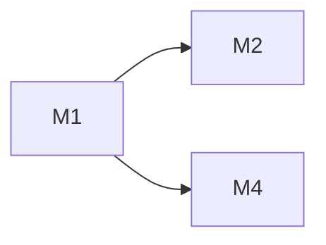

# feat-446: skill_view 独立工具 + 自进化体系 — 技术方案

> 对齐: spec.md v1

> Unit branch: `unit/feat-446` (will be created by orchestrator)

## Changelog

<!-- design 阶段保持空 -->

## 现状分析

### 涉及范围

| 文件 | 当前职责 | 本 unit 改动 |
|---|---|---|
| `platform/tools/builtins/skill_manage.py` | CRUD 工具，7 个 action 含 view | 移除 view action，保留 6 个 |
| `core/skills/formatter.py` | 生成 `<available_skills>` 块 + SKILLS_GUIDANCE 引导用 read | 引导改为 skill_view |
| `platform/hooks/builtins/self_improvement.py` | 后台 review hook，工具白名单硬编码 `skill_manage` | 白名单加 `skill_view`，review prompt 更新 |
| `sdk/kernel.py` | `_register_self_evolution_builtins()` 注册 SkillManageTool | 注册 SkillViewTool |
| `core/agent/prompt_sections/core_sections.py` | CORE_SKILLS_GUIDANCE 用 `has_tool("skill_manage")` 门控 | 改为 `has_tool("skill_manage") or has_tool("skill_view")` |
| `core/agent/prompt_sections/feature_registry.py` | skill_creation 用 `requires_tool="skill_manage"` | 改为检查两个工具 |
| `coding_cli/product.py` | DEFAULT_ENABLED_TOOLS 含 skill_manage | 加 skill_view |
| `personal_assistant/product.py` | DEFAULT_TOOL_IDS 含 skill_manage | 加 skill_view |
| `personal_assistant/reporter/capability_projection.py` | PA_DEFAULT_TOOL_IDS 含 skill_manage | 加 skill_view |
| `core/agent/compaction/` | compaction 机制，无 skill 内容保留 | 新增 invoked skills 注入 |
| `platform/tools/builtins/` | 无 skill_view 工具 | 新增 `skill_view.py` |
| `core/skills/` | 无 usage 追踪 | 新增 `usage.py` |
| `core/skills/curator.py` (新增) | 无 Curator | 新增确定性扫描逻辑（core 层，无 LLM 依赖） |
| `core/skills/root_resolver.py` (新增) | 无共享解析 | 提取 skill_root 解析为共享函数 |
| `platform/tools/builtins/f4_runner.py` (新增) | 无 F4 batch runner | 新增 F4 LLM 分析（platform 层，通过 fork_conversation 获取 LLM） |
| `IM/frontend/` | 无 skill 使用面板 | 新增面板组件 + 调用新增 API |
| `IM/app/` (routes) | 无 skills usage API | 新增 HTTP route |
| Gateway | 无 skills usage WS RPC | 新增 WS handler 读 .usage.json |

### 既有约束

- `coding_cli` / `personal_assistant` 只能 import `agent.sdk`，不能 import `agent.core` / `agent.platform` 内部
- tool 注册通过 `kernel._register_self_evolution_builtins()` 统一入口
- session metadata 携带 `workspace_root` + `workspace_config_dirname`，是 per-session skill root 解析的唯一依据
- compaction 通过 `compact_boundary` JSONL entry + summary turn 实现，系统提示词每轮重建
- `core` 层可用 `atomic_write` 做文件 IO（MemoryStore 已有先例），但不依赖环境特定 API

### 可复用能力

| 能力 | 位置 | 复用方式 |
|---|---|---|
| per-session skill_root 解析 | `skill_manage._resolve_writer_registry()` | 提取为共享函数 `resolve_skill_root(ctx)` 供 skill_view 和 skill_manage 共用 |
| SkillRegistry.list_skills() | `core/skills/registry.py` | skill_view 用 `list_skills()` + 手动过滤（无 find_skill 方法） |
| atomic_write | `core/utils/fileio.py` | usage / curator 持久化复用（无 flock，并发低，atomic_write 足够） |
| compact_boundary + summary 机制 | `core/agent/compaction/` | invoked skills 注入 |
| session_id 字段 | `core/session/models.py` | usage 追踪直接用 |
| Presenter 模式 | `platform/tools/presentation.py` | skill_view presenter 复用 |

### 相关历史

- feat-392：kernel spec 契约层建立，skill_manage 作为 kernel built-in 注册
- refactor-406：products 装配层解散，tool 注册下沉到 `_register_self_evolution_builtins()`

## 架构总览

### Before（现状）

```
系统提示词
  └─ <available_skills>（formatter.py 生成）
       └─ SKILLS_GUIDANCE: "Use the read tool to load a skill's file"
       └─ <skill><name/><description/><location/></skill> × N

agent 执行
  ├─ 路径 A: 用户 /skill:<name> → 重写为 "Use the <name> skill" → agent 用 read 读 SKILL.md
  ├─ 路径 B: agent 自己判断 → 用 read 读 <location> 路径
  └─ 路径 C: self_improvement → skill_manage(action=view) 读 SKILL.md

问题:
  - read 无 skill 语义（不追踪使用、不注册 compaction 存活）
  - skill_manage 的 view 和 CRUD 混在一起
  - 无使用统计
  - 无 Curator 生命周期管理
```

### After（目标）

```
系统提示词
  └─ <available_skills>（formatter.py 生成）
       └─ SKILLS_GUIDANCE: "Use skill_view to load a skill's content"  ← 改
       └─ <skill><name/><description/><location/></skill> × N

agent 执行
  ├─ 路径 A: 用户 /skill:<name> → 重写为 "Use the <name> skill" → agent 按 SKILLS_GUIDANCE 调 skill_view
  ├─ 路径 B: agent 自己判断 → skill_view 读 SKILL.md
  └─ 路径 C: self_improvement → skill_view 读 SKILL.md（白名单更新）

skill_view 调用时:
  ├─ 返回 {success, name, content, location}
  ├─ bump use_count + last_used_at
  ├─ 记录 {session_id, timestamp} → session 引用列表
  └─ 注册 invoked skill → compaction 后 re-inject

skill_manage（写侧）:
  └─ create / edit / patch / list / write_file / remove_file（无 view）

新增:
  ├─ core/skills/usage.py: 使用统计持久化（.usage.json per workspace）
  ├─ core/skills/curator.py: per-workspace 确定性扫描（7 天门控，30d stale，90d archived）
  ├─ platform/tools/builtins/f4_runner.py: F4 batch LLM 分析（platform 层）
  ├─ platform/tools/builtins/skill_view.py: 独立读侧工具
  ├─ 蒸馏 skill（F2）: SKILL.md 教 agent 读 session transcript → 生成 skill
  └─ IM 前端: 使用统计面板（初版三个视图）
```

## 关键决策

### 决策 1: skill_view 作为独立工具 vs 扩展 skill_manage

**选了独立工具 skill_view**（读侧独立，skill_manage 只留写侧）。

- **理由**: spec 明确要求拆分。hermes 就是三工具拆分（skills_list / skill_view / skill_manage）。读侧（skill_view）和写侧（skill_manage）职责正交，独立工具让模型调用语义更清晰——"我要看内容" vs "我要改内容"。
- **拒绝**: 扩展 skill_manage(action=view) 加 side effects — 会让一个写侧工具承担读侧职责（usage bump、compaction 注册），违反单一职责。
- **风险**: 需要迁移所有引用 `skill_manage(action=view)` 的地方（self_improvement prompt、formatter 等）。迁移面广但都是文案改动，不涉及逻辑重构。

### 决策 2: 使用统计数据模型

**选了 per-workspace `.usage.json` sidecar 文件，skill name 为 key**。

```json
{
  "change-spec-author": {
    "use_count": 15,
    "last_used_at": "2026-06-29T10:00:00Z",
    "session_refs": [
      {"session_id": "abc-123", "timestamp": "2026-06-29T10:00:00Z"},
      {"session_id": "def-456", "timestamp": "2026-06-28T14:00:00Z"}
    ],
    "uses_since_last_B": 8,
    "source": "F1",
    "state": "active",
    "pinned": false,
    "created_at": "2026-06-15T08:00:00Z",
    "archived_at": null
  }
}
```

- **理由**: hermes 用同样模式（`.usage.json` sidecar）。per-workspace 隔离符合本项目架构。JSON 按 skill name 做 key 支持随机读写（Curator 扫描、单 skill 查询），比 append-only JSONL 更适合。
- **拒绝**: hermes 的 8+ 字段方案（view_count / patch_count / last_viewed_at / last_patched_at）— 本项目 skill_view 是唯一读路径，view/use 无区分意义。
- **session_refs 上限 60**（threshold × 3）: 保证 F4 有足够 refs 可分析，同时防止无限增长。
- **uses_since_last_B**: F4 触发计数器，batch 完成后归零。
- **source 字段**: `"F1"|"F2"|"F3"|"F4"`，替代 hermes 的 `created_by: "auto"|"manual"`。赋值规则：
  - `skill_manage(action=create)` 且调用者是 self_improvement hook → `"F3"`
  - `skill_manage(action=create)` 且调用者是 F4 batch runner → `"F4"`（F4 只 patch 不创建，此路径暂不触发）
  - `skill_manage(action=create)` 且调用者是 F2 蒸馏 skill → `"F2"`
  - `skill_manage(action=create)` 且调用者是用户手动 → `"F1"`
  - Curator 只管 `source ∈ {"F3", "F4"}` 的 skill
- **持久化**: `atomic_write`（tempfile + fsync + os.replace）。并发低，无需 flock。

### 决策 3: Compaction 存活机制

**选了 per-runtime 内存 map + compaction 后注入 synthetic user message**。

- **理由**: CC 用 `addInvokedSkill` 注册到内存 map，compaction 时作为 attachment 注入。本项目的 compaction 写 `compact_boundary` + summary turn，skill 内容应在 summary 之后注入为 synthetic user message（`is_skill_reinjection=True` 标记），这样 resume 时可识别并重新填充内存 map。
- **拒绝**: 存到 `.usage.json` — usage 文件是跨 session 聚合，compaction 存活是 session 级需求。混在一起会让两个关注点耦合。
- **拒绝**: 存到 JSONL 的 `skills_invoked` entry — 本项目 JSONL 的 `compact_boundary` 后只保留 summary turn，额外 entry 需要改 load 逻辑。synthetic user message 更简单，不侵入 session store。
- **token 上限**: 单个 skill ≤ 2000 tokens，总 ≤ 8000 tokens，按最近使用排序。上限可通过环境变量配置。
- **实现注意**: `runtime.py` 的 `_message_to_entry()` 有 metadata key 白名单。需将 `is_skill_reinjection` 加入白名单，否则 resume 时无法识别 re-injection 消息。

### 决策 4: Curator 状态机与触发

**选了 active/stale/archived 三态，30/90 天阈值，7 天扫描间隔，per-workspace**。

```
                activity within 30 days
   STALE  ─────────────────────────────────>  ACTIVE
         <─────────────────────────────────
              no activity for 30 days

   ACTIVE ─────────────────────────────────> ARCHIVED
              no activity for 90 days         (manual restore only)
```

- **activity 定义**: `last_activity = max(last_used_at, created_at)`。created_at 兜底新创建但尚未被使用的 skill。
- **理由**: spec 明确确认了 30/90 天阈值和 7 天间隔。per-workspace 符合本项目多 agent 隔离架构。
- **拒绝**: hermes 的 14/60 天阈值 — spec 已确认 30/90，不单方面改。
- **拒绝**: hermes 的 tar.gz 快照 — spec 原文说"归档前先打 tar.gz 快照"，但 per-workspace skill 目录小，`shutil.move` 到 `.archive/` 足够。已同步更新 spec 删 tar.gz 描述。
- **拒绝**: LLM consolidation pass — per-workspace skill 数量少（几十个），确定性扫描够用。
- **触发**: CLI 启动 + Gateway housekeeping loop，内部 7 天门控（`should_run_now()` 检查 `.curator_state.json` 的 `last_run_at`）。
- **管辖**: 只管 `source ∈ {"F3", "F4"}` 的 skill（F3/F4 输出），`source ∈ {"F1", "F2"}` 的跳过。
- **Curator 归属**: 确定性扫描逻辑放 `core/skills/curator.py`（纯时间戳比较 + shutil.move，无 LLM 依赖）。F4 batch runner 放 `platform/tools/builtins/f4_runner.py`（需要 LLM client，属 platform 层）。

### 决策 5: Curator 存储

**选了 `.curator_state.json` 单文件，与 `.usage.json` 分离**。

```json
{
  "last_run_at": "2026-06-29T10:00:00Z",
  "run_count": 3,
  "last_run_summary": "archived 1 stale skill, no F4 triggers",
  "reviewed_session_ids": ["abc-123", "def-456"]
}
```

- **理由**: Curator 状态更新频率低（7 天一次），usage 更新频率高（每次 skill_view）。分离避免写冲突。`reviewed_session_ids` 上限 200，防止 F4 重复处理。
- **损坏回退**: `.curator_state.json` 损坏或丢失时，`should_run_now()` 返回 True（视为首次运行），Curator 重建状态文件。不影响 skill 数据。
- **拒绝**: 合并到 `.usage.json` — 读写频率不同，合并会增加锁竞争。

### 决策 6: Feature gate 策略

**选了扩展 `FeatureEntry.requires_tool` 为 `requires_any_tool: tuple[str, ...] | None`**。

- **理由**: `FeatureEntry.requires_tool` 类型是 `str | None`，不支持 OR 逻辑。与其写临时 or 链，不如一次性扩展为 `requires_any_tool`，语义更清晰且服务未来。`skill_creation` 改为 `requires_any_tool=("skill_manage", "skill_view")`。
- **SKILLS_GUIDANCE 条件渲染**: 当只有 skill_view 在场而 skill_manage 不在时，不应引导调 skill_manage（"save with skill_manage"）。`_render_skills_guidance` 需根据 `ctx.has_tool("skill_manage")` 条件渲染保存相关文案。
- **拒绝**: skill_view 独立 feature entry — skill_view 不需要独立的 prompt guidance，它只是读工具。不需要自己的 feature flag。

### 决策 7: F4 Batch 触发与执行

**选了 uses_since_last_B 达阈值后，Curator 内触发 batch job（非独立调度器）**。

- **理由**: F4 和 Curator 都是 per-skill 维度的后台任务。F4 触发检查可以挂在 Curator 的定期扫描里（Curator 扫描时顺便检查 `uses_since_last_B >= threshold`），不需要独立的调度器。
- **阈值**: 默认 20，可配置。`session_refs` cap = threshold × 3 = 60（保证 F4 有足够 refs 可分析）。
- **异步执行**: batch job 用 `threading.Thread` 启动（和 self_improvement 的 background hook 一致）。Curator 不等 batch 完成，先 `reset uses_since_last_B = 0` 再启动 batch。batch 失败不影响已重置的计数（下次积累重新触发）。
- **LLM 注入**: F4 runner 放 `platform/tools/builtins/f4_runner.py`。通过 `runtime.fork_conversation()` 获取 LLM client（和 self_improvement 的 fork 机制一致），不直接 import platform 层。
- **拒绝**: 独立调度器 — 增加复杂度，且 F4 的触发条件（usage 积累）和 Curator 的触发条件（时间间隔）可以合并检查。
- **batch job 流程**: 读 session_refs → 过滤已 reviewed 的（`curator_state.reviewed_session_ids`）→ 读 JSONL transcript → LLM 分析 ≥2 证据 → skill_manage(patch) → 追加 reviewed_session_ids（cap 200）。

### 决策 8: skill_view 工具接口

**选了 platform 层独立 SkillViewTool 类，与 SkillManageTool 同构**。

```python
class SkillViewTool:
    name = "skill_view"
    description = "Load a skill's full content by name. Returns SKILL.md content + metadata."
    input_schema = {
        "type": "object",
        "properties": {
            "name": {"type": "string", "description": "The skill name to view"}
        },
        "required": ["name"]
    }
    is_concurrency_safe = False  # bump_use 写 .usage.json，与 skill_manage 一致
    max_result_size_chars = 50_000

    def run(self, args, ctx) -> Mapping[str, Any]:
        # 1. 解析 skill_root（复用 skill_manage 的逻辑）
        # 2. 查找 skill（SkillRegistry）
        # 3. 读取 SKILL.md content
        # 4. bump usage（usage.py）
        # 5. 注册 invoked skill（runtime.register_invoked_skill）
        # 6. 返回 {success, name, content, location}
```

- **理由**: 和 SkillManageTool 同构（name / description / input_schema / run / presenter），worker 照着现有模式写。`is_concurrency_safe = False`（bump_use 写 .usage.json，与 skill_manage 一致）。
- **不带 file_path**: spec 明确排除。

## 接口与数据流

### skill_view 调用流

```
agent 调用 skill_view(name="change-spec-author")
  │
  ├─ 1. SkillViewTool.run(args, ctx)
  │     ├─ resolve_skill_root(ctx) → <workspace>/<config_dir>/skills/（共享函数）
  │     ├─ SkillRegistry(search_roots).list_skills() + 手动过滤 name → SkillMetadata
  │     ├─ content = metadata.location.read_text()
  │     └─ return {success: True, name, content, location}
  │
  ├─ 2. usage_tracker.bump_use(name, session_id)
  │     ├─ load .usage.json
  │     ├─ rec["use_count"] += 1
  │     ├─ rec["last_used_at"] = now
  │     ├─ rec["session_refs"].append({session_id, timestamp})  # cap 60
  │     ├─ rec["uses_since_last_B"] += 1
  │     └─ atomic_write .usage.json
  │
  └─ 3. runtime.register_invoked_skill(name, content)
        └─ _invoked_skills[name] = {content, invoked_at}
```

### Curator 扫描流

```
run_curator(workspace_root, config_dirname)    # core/skills/curator.py（纯确定性，无 LLM）
  │
  ├─ 1. should_run_now()
  │     ├─ load .curator_state.json
  │     └─ now - last_run_at >= 7 days?
  │
  ├─ 2. compute_transitions() → List[Transition]
  │     ├─ load .usage.json
  │     ├─ for each skill where source ∈ {"F3", "F4"}:
  │     │     ├─ last_activity = max(last_used_at, created_at)
  │     │     ├─ active + no activity 30d → Transition(name, "stale")
  │     │     ├─ stale + no activity 90d → Transition(name, "archive")
  │     │     ├─ stale + activity within 30d → Transition(name, "active")
  │     │     └─ pinned → skip
  │     └─ return transitions（纯数据，不执行）
  │
  ├─ 3. compute_f4_triggers() → List[F4Trigger]
  │     ├─ for each skill where uses_since_last_B >= threshold:
  │     │     ├─ read session_refs, filter already reviewed
  │     │     └─ F4Trigger(skill_name, session_refs)
  │     └─ return triggers（纯数据，不执行）
  │
  └─ 4. 返回 CuratorResult(transitions, f4_triggers, summary)
        └─ 调用方负责执行

apply_transitions(transitions, workspace_root)    # core/skills/curator.py
  ├─ for each transition: set_state / archive_skill / reactivate
  └─ save .usage.json + .curator_state.json

f4_runner.run(skill_name, session_refs, ...)    # platform/tools/builtins/f4_runner.py
  ├─ 读 session JSONL transcripts
  ├─ runtime.fork_conversation() 获取 LLM client
  ├─ LLM 分析 ≥2 证据
  ├─ skill_manage(patch) 写入修补
  └─ 更新 curator_state.reviewed_session_ids

调度层（SDK/Gateway housekeeping）:
  result = run_curator(workspace_root, config_dirname)
  apply_transitions(result.transitions, workspace_root)
  for trigger in result.f4_triggers:
      Thread(target=f4_runner.run, args=(...)).start()
```

### Compaction invoked skills 注入

```
_compact_session()
  │
  ├─ 1. 写 compact_boundary entry
  ├─ 2. LLM 总结 → 写 summary turn
  ├─ 3. 注入 invoked skills（新增）:
  │     ├─ if runtime._invoked_skills:
  │     │     ├─ 按 invoked_at 排序，截断到 token 预算（8000）
  │     │     ├─ 构造 synthetic user message:
  │     │     │     "The following skills were invoked in this session.
  │     │     │      Continue to follow these guidelines:
  │     │     │      ### Skill: <name>\n\n<content>\n---\n..."
  │     │     │     is_skill_reinjection=True
  │     │     └─ 写入 JSONL
  │     └─ 清空 _invoked_skills
  └─ 4. 重置 session history = [summary_msg]

resume session:
  ├─ load() 扫描 JSONL
  ├─ 遇到 is_skill_reinjection message → 重新填充 _invoked_skills
  └─ 后续 skill_view 调用可追加新 skill
```

## 前端原型

前端相关 unit: IM 前端使用统计面板（初版三视图）+ F2 session 选择交互。
- 原型文件 1: [prototype.html](prototype.html) — Skill 列表视图 + Agent 维度视图 + 自进化健康度视图
- 原型文件 2: [prototype-f2.html](prototype-f2.html) — F2 session 多选 → 跳转新对话 → 预填蒸馏 skill 命令 → agent 生成 SKILL.md（三步交互流程）
- 覆盖范围: 使用统计三视图 + F2 session 选择/跳转/蒸馏全流程

### Dashboard 数据通道

`.usage.json` 在 gateway/agent workspace 侧，IM 前端不能直接读。数据流：

```
IM 前端
  │ authFetch
  ├─ GET /im/v1/agents/:agentId/skills/usage    ← 新增 IM HTTP API
  │
IM HTTP handler
  │ gateway WS RPC
  ├─ ws.send({type: "skills_usage_request", agentId})
  │
Gateway WS handler
  │ 读 workspace
  ├─ read {workspace_root}/{config_dirname}/skills/.usage.json
  ├─ 聚合：per-skill + per-agent 统计
  │
  └─ ws.send({type: "skills_usage_response", data})
```

**数据字段表**（dashboard 使用）:

| 字段 | 类型 | 时间窗口 | 来源 |
|---|---|---|---|
| skill_id | string | — | .usage.json key |
| name | string | — | skill frontmatter |
| source | "F1"\|"F2"\|"F3"\|"F4" | — | .usage.json |
| state | "active"\|"stale"\|"archived" | — | .usage.json |
| use_count | int | 全量累计 | .usage.json |
| last_used_at | ISO timestamp | — | .usage.json |
| session_refs | [{session_id, timestamp}] | 最近 60 条（cap） | .usage.json |
| trend_buckets | [int × 30] | 最近 30 天，按天分桶 | gateway 按 session_refs 聚合 |
| heatmap_data | [int × 30] | 最近 30 天，该 agent 每天的 skill 使用总次数（所有 skill 合计） | gateway 按 session_refs 聚合 |
| agent_id | string | — | session metadata |
| node_id | string | — | gateway node config |

**时间窗口约定**:
- **use_count**: 全量累计，和 Curator 判断 stale 用的 last_used_at 对齐
- **趋势 sparkline / 热力图**: 最近 30 天（30 天 = stale 阈值），按天分桶，gateway 从 session_refs 聚合
- **自进化漏斗**: 全量累计（F3/F4 创建总数 → still active → use_count > 0）
- **生命周期时间线**: 全量（从 skill 创建到现在的完整生命）

**空态 / 离线态**:
- 无 skill 数据 → 显示空态插图 + "暂无 skill 使用数据"
- gateway 离线 → 显示离线提示 + 最后缓存数据（如有）

## 契约层增量 (delta-spec)

- kernel: specs/kernel/spec.md — skill_view 作为新 kernel built-in 工具，skill_manage 移除 view action，内置工具列表新增 skill_view
- im: specs/im/spec.md — 新增 dashboard 数据 API（GET /im/v1/agents/:agentId/skills/usage），F2 session 选择入口（左侧面板右键菜单）
- gateway: specs/gateway/spec.md — 新增 skills_usage WS RPC provider（读 .usage.json 聚合返回）
- cli: no spec delta（CLI 只是默认工具列表增加 skill_view，无新增外部命令面契约）

## 风险与回退

**风险 1: 迁移面广**
skill_manage(action=view) 被 self_improvement review prompt 直接引用（4 处硬编码文案）。迁移需逐个改文案 + 测试。遗漏会导致后台 review 调用失败。
- 应对: grep 全量 `skill_manage.*view` 确保无遗漏。self_improvement 的 tool_allowlist 也要加 skill_view。

**风险 2: Compaction 注入时机**
synthetic user message 注入到 compact_boundary 之后。如果 resume 逻辑不识别 `is_skill_reinjection` 标记，invoked skills 会丢失。
- 应对: resume 时显式扫描该标记，重新填充内存 map。有单测覆盖。

**风险 3: .usage.json 并发写入**
多个 session 同时 bump_use 可能写冲突。单 workspace 内并发低（通常只有一个活跃 session），atomic_write 足够。
- 应对: usage 更新是 best-effort（失败不阻塞 skill_view）。如未来并发增高，可加 fcntl.flock。

**回退方案**:
- skill_view 工具不可用 → 降级到 read 工具读 SKILL.md（formatter.py 的 location 仍在）
- Curator 不可用 → skill 不会自动归档，不影响正常使用
- .usage.json 损坏 → 重建空文件，use_count 从零开始

## Runbook for Reviewer

本 unit 涉及的常驻服务：无独立常驻服务。skill_view / Curator 是 agent 内核库的一部分，通过 Gateway 或 CLI 进程运行。

| 服务 | 停止命令 | 启动命令 | 健康检查 |
|---|---|---|---|
| Gateway（含 skill_view + Curator） | `PYTHONPATH=src python -m personal_assistant.main stop` | `PYTHONPATH=src python -m personal_assistant.main` | `curl http://127.0.0.1:8011/im/v1/health` |
| IM（含 dashboard API + 前端面板） | `./scripts/e2e-down.sh` 或 `kill $(cat .im.pid)` | `./scripts/e2e-up.sh` 或 `PYTHONPATH=src python -m uvicorn IM.app:app --port 8011` | `curl http://127.0.0.1:8011/` |

**Review 驱动方式**: 端到端真栈。本 unit 改了 IM 前端（使用统计面板）+ IM API（dashboard 数据）+ gateway（WS RPC），需真驱动客户端面验证面板渲染和数据流。

## Milestones

| ID | 标题 | 依赖 | 并行组 | 范围 | 退出标准 |
|---|---|---|---|---|---|
| feat-446-M1 | skill-view-core | — | A | `platform/tools/builtins/skill_view.py`(新)、`skill_manage.py`(删 view)、`core/skills/usage.py`(新)、`core/skills/root_resolver.py`(新：提取共享 skill_root 解析)、`core/skills/formatter.py`、`sdk/kernel.py`、`core/agent/prompt_sections/core_sections.py`、`core/agent/prompt_sections/feature_registry.py`(requires_any_tool 扩展)、`platform/hooks/builtins/self_improvement.py`、`coding_cli/product.py`、`personal_assistant/product.py`、`personal_assistant/reporter/capability_projection.py` | `[reviewer]` agent 调用 skill_view 返回 SKILL.md 内容; skill_manage 不含 view action; 使用统计记录到 .usage.json（含 source=F1/F2/F3/F4）; compaction 后 invoked skill 内容仍可用; `[worker]` `pytest tests/unit/test_skill_view.py tests/unit/test_usage.py tests/contract/ -x` 全绿 |
| feat-446-M2 | curator-f4 | feat-446-M1 | B | `core/skills/curator.py`(新：确定性扫描，返回 CuratorResult 数据)、`platform/tools/builtins/f4_runner.py`(新：F4 LLM 分析)、`core/skills/usage.py`(扩展 state 字段)、CLI 启动入口、Gateway housekeeping | `[reviewer]` 30 天未用的 F3/F4 skill 标记 stale; 90 天归档到 .archive/; stale skill 被重新读取后复活; pinned skill 不变; F1/F2 skill 不被自动流转; uses_since_last_B 达阈值后触发 F4 batch 分析; ≥2 session 证据才采纳; 只 patch 不创建; `[worker]` `pytest tests/unit/test_curator.py tests/unit/test_f4_batch.py -x` 全绿; `tests/contract/test_core_no_platform_imports.py` 全绿（core 不 import platform） |
| feat-446-M3 | f2-distill | — | A | 蒸馏 skill（SKILL.md） | `[reviewer]` 蒸馏 skill 可用; agent 能列出已结束 session（通过 session list 能力）; 用户指定 session IDs + 意图后 agent 读 JSONL transcript 并生成新 SKILL.md; 用户可选择写入 PA 级或 agent 级 skill root; `[worker]` 蒸馏 skill 文件存在且格式正确; skill_manage(create) 正确写入指定 skill_root |
| feat-446-M4 | dashboard | feat-446-M1 | C | IM HTTP API（`/im/v1/agents/:agentId/skills/usage`）+ gateway WS RPC provider + `IM/frontend/src/` 面板组件 | `[reviewer]` Skill 列表视图显示 use_count + 状态 + 趋势（真实数据）; Agent 维度视图显示热力图; 健康度视图显示漏斗数字; 空态/离线态正确显示; `[worker]` `cd src/IM/frontend && npm run test` 全绿; IM API 返回真实 .usage.json 数据 |


