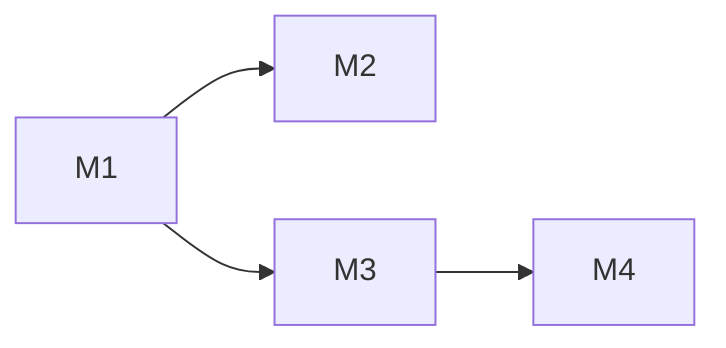

# feat-446: skill_view 独立工具 + 自进化体系 — 技术方案

> 对齐: spec.md v1

> Unit branch: `unit/feat-446` (will be created by orchestrator)

## Changelog

## 现状分析

### 涉及范围

| 文件 | 当前职责 | 本 unit 改动 |
|---|---|---|
| `platform/tools/builtins/skill_manage.py` | CRUD 工具，7 个 action 含 view | 移除 view action，保留 6 个 |
| `core/skills/formatter.py` | 生成 `<available_skills>` 块 + SKILLS_GUIDANCE 引导用 read | 引导改为 skill_view |
| `platform/hooks/builtins/self_improvement.py` | 后台 review hook，工具白名单硬编码 `skill_manage` | 白名单加 `skill_view`，review prompt 更新 |
| `sdk/kernel.py` | `_register_self_evolution_builtins()` 注册 SkillManageTool | 注册 SkillViewTool |
| `core/agent/prompt_sections/core_sections.py` | CORE_SKILLS_GUIDANCE 用 `has_tool("skill_manage")` 门控 | 改为 `has_tool("skill_manage") or has_tool("skill_view")` |
| `core/agent/prompt_sections/feature_registry.py` | skill_creation 用 `requires_tool="skill_manage"` | 改为检查两个工具 |
| `coding_cli/product.py` | DEFAULT_ENABLED_TOOLS 含 skill_manage | 加 skill_view |
| `personal_assistant/product.py` | DEFAULT_TOOL_IDS 含 skill_manage | 加 skill_view |
| `personal_assistant/reporter/capability_projection.py` | PA_DEFAULT_TOOL_IDS 含 skill_manage | 加 skill_view |
| `core/agent/compaction/` | compaction 机制，无 skill 内容保留 | 新增 invoked skills 注入 |
| `platform/tools/builtins/` | 无 skill_view 工具 | 新增 `skill_view.py` |
| `core/skills/` | 无 usage 追踪 | 新增 `usage.py` |
| `core/skills/curator.py` (新增) | 无 Curator | 新增确定性扫描逻辑（core 层，无 LLM 依赖） |
| `core/skills/root_resolver.py` (新增) | 无共享解析 | 提取 skill_root 解析为共享函数 |
| `platform/background/skill_batch_review.py` (新增) | 无 per-skill 批量复盘 side-chain | 新增 per-skill 批量复盘编排（platform 层，接收 runtime 注入的后台 fork callable；对应 F4 能力） |
| `sdk/kernel.py` / runtime housekeeping | 已注册 self-evolution builtins，无 skill 维护入口 | 新增 SDK 内部 skill maintenance 入口负责 Curator 扫描；runtime 提供 F4 background fork enqueue 入口 |
| `IM/frontend/` | 无 skill 使用面板 | 新增面板组件 + 调用新增 API |
| `IM/frontend/src/features/chat/v2/components/tool-*` | memory/skill_manage 已有专属工具卡片，未知工具走通用展示 | 新增 skill_view 工具行专属展示（折叠摘要、展开详情、失败态） |
| `IM/app/` (routes) | 无 skills usage API | 新增 HTTP route |
| Gateway | 无 skills usage WS RPC | 新增 WS handler 读 .usage.json |

PA 默认工具语义沿用现状：`personal_assistant/product.py::DEFAULT_TOOL_IDS` 只在 agent 没有非空 `tool_allowlist` 时作为默认启用集合；已有非空 `tool_allowlist` 是用户选择的精确白名单，本 unit 不自动给这些 agent 追加 `skill_view`。配置页保存取消选择后，也通过显式白名单表达“不启用 `skill_view`”。

### 既有约束

- `coding_cli` / `personal_assistant` 只能 import `agent.sdk`，不能 import `agent.core` / `agent.platform` 内部
- tool 注册通过 `kernel._register_self_evolution_builtins()` 统一入口
- session metadata 携带 `workspace_root` + `workspace_config_dirname`，是 per-session skill root 解析的唯一依据
- compaction 通过 `compact_boundary` JSONL entry + summary turn 实现，系统提示词每轮重建
- `core` 层可用 `atomic_write` 做文件 IO（MemoryStore 已有先例），但不依赖环境特定 API

### 可复用能力

| 能力 | 位置 | 复用方式 |
|---|---|---|
| per-session skill_root 解析 | `skill_manage._resolve_writer_registry()` | 提取为共享函数 `resolve_skill_root(ctx)` 供 skill_view 和 skill_manage 共用 |
| SkillRegistry.list_skills() | `core/skills/registry.py` | skill_view 用 `list_skills()` + 手动过滤；沿用现有按 search root 优先级去重的语义 |
| atomic_write | `core/utils/fileio.py` | usage / curator 持久化复用（无 flock，并发低，atomic_write 足够） |
| compact_boundary + summary 机制 | `core/agent/compaction/` | invoked skills 注入 |
| session_id 字段 | `core/session/models.py` | usage 追踪直接用 |
| Presenter 模式 | `platform/tools/presentation.py` | skill_view presenter 复用 |

### 相关历史

- feat-392：kernel spec 契约层建立，skill_manage 作为 kernel built-in 注册
- refactor-406：products 装配层解散，tool 注册下沉到 `_register_self_evolution_builtins()`

## 架构总览

### Before（现状）

```
系统提示词
  └─ <available_skills>（formatter.py 生成）
       └─ SKILLS_GUIDANCE: "Use the read tool to load a skill's file"
       └─ <skill><name/><description/><location/></skill> × N

agent 执行
  ├─ 路径 A: 用户 /skill:<name> → 重写为 "Use the <name> skill" → agent 用 read 读 SKILL.md
  ├─ 路径 B: agent 自己判断 → 用 read 读 <location> 路径
  └─ 路径 C: self_improvement → skill_manage(action=view) 读 SKILL.md

问题:
  - read 无 skill 语义（不追踪使用、不注册 compaction 存活）
  - skill_manage 的 view 和 CRUD 混在一起
  - 无使用统计
  - 无 Curator 生命周期管理
```

### After（目标）

```
系统提示词
  └─ <available_skills>（formatter.py 生成）
       └─ SKILLS_GUIDANCE: "Use skill_view to load a skill's content"  ← 改
       └─ <skill><name/><description/><location/></skill> × N

agent 执行
  ├─ 路径 A: 用户 /skill:<name> → 重写为 "Use the <name> skill" → agent 按 SKILLS_GUIDANCE 调 skill_view
  ├─ 路径 B: agent 自己判断 → skill_view 读 SKILL.md
  └─ 路径 C: self_improvement → skill_view 读 SKILL.md（白名单更新）

skill_view 调用时:
  ├─ 返回 {success, name, content, location}
  ├─ bump use_count + last_used_at
  ├─ 记录 {session_id, timestamp} → session 引用列表
  └─ 注册 invoked skill → compaction 后 re-inject

skill_manage（写侧）:
  └─ create / edit / patch / list / write_file / remove_file（无 view）

新增:
  ├─ core/skills/usage.py: 使用统计持久化（.usage.json per workspace）
  ├─ core/skills/curator.py: per-workspace 确定性扫描（7 天门控，30d stale，90d archived）
  ├─ platform/background/skill_batch_review.py: per-skill 批量复盘编排（platform 层，非 tool；对应 F4）
  ├─ sdk/kernel.py: 内部 skill maintenance 入口，持有 runtime background fork 能力
  ├─ platform/tools/builtins/skill_view.py: 独立读侧工具
  ├─ F2 端到端蒸馏: IM conversation 多选/跳转/输入框预填 + 蒸馏 SKILL.md 读取 JSONL path + 现有对话内写入结果展示
  └─ IM 前端: 使用统计面板（初版三个视图）+ skill_view 工具调用审计展示
```

## 关键决策

### 决策 1: skill_view 作为独立工具 vs 扩展 skill_manage

**选了独立工具 skill_view**（读侧独立，skill_manage 只留写侧）。

- **理由**: spec 明确要求拆分。hermes 就是三工具拆分（skills_list / skill_view / skill_manage）。读侧（skill_view）和写侧（skill_manage）职责正交，独立工具让模型调用语义更清晰——"我要看内容" vs "我要改内容"。
- **拒绝**: 扩展 skill_manage(action=view) 加 side effects — 会让一个写侧工具承担读侧职责（usage bump、compaction 注册），违反单一职责。
- **风险**: 需要迁移所有引用 `skill_manage(action=view)` 的地方（self_improvement prompt、formatter 等）。迁移面广但都是文案改动，不涉及逻辑重构。

### 决策 2: 使用统计数据模型

**选了 per-workspace `.usage.json` sidecar 文件，skill name 为 key**。

```json
{
  "change-spec-author": {
    "use_count": 15,
    "last_used_at": "2026-06-29T10:00:00Z",
    "session_refs": [
      {"session_id": "abc-123", "tool_call_id": "call-001", "timestamp": "2026-06-29T10:00:00Z"},
      {"session_id": "def-456", "tool_call_id": "call-002", "timestamp": "2026-06-28T14:00:00Z"}
    ],
    "recent_call_keys": ["abc-123:call-001", "def-456:call-002"],
    "uses_since_last_B": 8,
    "source": "F1",
    "state": "active",
    "created_at": "2026-06-15T08:00:00Z",
    "archived_at": null
  }
}
```

- **理由**: hermes 用同样模式（`.usage.json` sidecar）。per-workspace 隔离符合本项目架构。JSON 按 skill name 做 key 支持随机读写（Curator 扫描、单 skill 查询），比 append-only JSONL 更适合。
- **拒绝**: hermes 的 8+ 字段方案（view_count / patch_count / last_viewed_at / last_patched_at）— 本项目 skill_view 是唯一读路径，view/use 无区分意义。
- **session_refs 上限 60**（threshold × 3）: 保证 F4 有足够 refs 可分析，同时防止无限增长。每条记录包含 `session_id`、稳定 `tool_call_id` 和 timestamp。
- **幂等键**: `recent_call_keys` 保存最近 200 个 `{session_id}:{tool_call_id}`。`skill_view` 成功后先检查该 key，已存在则返回内容但不增加 `use_count`、不追加 `session_refs`、不推进 `uses_since_last_B`。没有稳定 `tool_call_id` 时回退到本次工具调用事件 id；仍没有则生成一次性 key，此时不保证跨进程重放幂等。
- **uses_since_last_B**: F4 触发计数器，batch 完成后归零。
- **source 字段**: `"F1"|"F2"|"F3"|"F4"|"unknown"`，替代 hermes 的 `created_by: "auto"|"manual"`。`source` 不允许模型在 tool args 中传入，只由受控运行上下文赋值：
  - 普通用户对话调用 `skill_manage(action=create)`，且没有受控 metadata → `"F1"`
  - 用户主动对话中调用 `skill_manage(create)`，包括通过 `conversation-skill-distiller` 从历史会话蒸馏后创建 → `"F1"`（用户主动创建，生命周期受保护）
  - self_improvement background fork 创建时，fork metadata 写 `skill_creation_source="F3"`；该 fork 内 `skill_manage(create)` 记为 `"F3"`
  - per-skill batch review side-chain metadata 写 `skill_creation_source="F4"`；F4 本期只允许 patch，不创建，此 source 仅为未来兼容和审计保留
  - 历史 usage 记录或手工文件缺少 source 时按 `"unknown"` 处理
  - Curator 只管 `source ∈ {"F3", "F4"}` 的 skill，`F1/F2/unknown` 均受保护
- **持久化**: `atomic_write`（tempfile + fsync + os.replace）。并发低，无需 flock。

### 决策 3: Compaction 存活机制

**选了 per-runtime 内存 map 保存 skill identity，compaction 时重新读取当前 SKILL.md 后注入 synthetic user message**。

- **理由**: CC 用 `addInvokedSkill` 注册到内存 map，compaction 时作为 attachment 注入。本项目的 compaction 写 `compact_boundary` + summary turn；`skill_view` 成功时只注册 `{name, location, root_id, invoked_at}`，不保存调用时 content。compaction 发生时按 `location` 重新读取当前 SKILL.md 内容，再在 summary 之后注入为 synthetic user message（`is_skill_reinjection=True` 标记），这样被 patch 后的 skill 指令能进入压缩后上下文。
- **拒绝**: 存到 `.usage.json` — usage 文件是跨 session 聚合，compaction 存活是 session 级需求。混在一起会让两个关注点耦合。
- **拒绝**: 存到 JSONL 的 `skills_invoked` entry — 本项目 JSONL 的 `compact_boundary` 后只保留 summary turn，额外 entry 需要改 load 逻辑。synthetic user message 更简单，不侵入 session store。
- **token 上限**: 单个 skill ≤ 2000 tokens，总 ≤ 8000 tokens，按最近使用排序。上限可通过环境变量配置。某个 `location` 已不存在或不可读时跳过该 skill，并在 debug log 记录，不阻塞 compaction。
- **注入格式**: synthetic user message 的文本必须包在 `<system-reminder>` 中，内容形如 `<system-reminder>Previously invoked skills in this session; continue to follow their current instructions:\n### Skill: <name>\nLocation: <location>\n...\n</system-reminder>`。
- **实现注意**: `runtime.py` 的 `_message_to_entry()` 和 `JsonlSessionStore._extract_message_metadata()` 都有 metadata 白名单。需同时加入 `is_skill_reinjection` 与 `skill_reinjection_refs`，否则 resume 后无法识别 re-injection 消息，也无法用 location 重新填充 `_invoked_skills`。

### 决策 4: Curator 状态机与触发

**选了 active/stale/archived 三态，30/90 天阈值，7 天扫描间隔，per-workspace**。

```
                activity within 30 days
   STALE  ─────────────────────────────────>  ACTIVE
         <─────────────────────────────────
              no activity for 30 days

   ACTIVE ─────────────────────────────────> ARCHIVED
              no activity for 90 days         (manual restore only)
```

- **activity 定义**: `last_activity = max(last_used_at, created_at)`。created_at 兜底新创建但尚未被使用的 skill。
- **理由**: spec 明确确认了 30/90 天阈值和 7 天间隔。per-workspace 符合本项目多 agent 隔离架构。
- **拒绝**: hermes 的 14/60 天阈值 — spec 已确认 30/90，不单方面改。
- **拒绝**: hermes 的 tar.gz 快照 — spec 原文说"归档前先打 tar.gz 快照"，但 per-workspace skill 目录小，`shutil.move` 到 `.archive/` 足够。已同步更新 spec 删 tar.gz 描述。
- **拒绝**: LLM consolidation pass — per-workspace skill 数量少（几十个），确定性扫描够用。
- **触发**: CLI 启动 + Gateway housekeeping loop，内部 7 天门控（`should_run_now()` 检查 `.curator_state.json` 的 `last_run_at`）。
- **管辖**: 只管 `source ∈ {"F3", "F4"}` 的 skill（F3/F4 输出），`source ∈ {"F1", "F2"}` 的跳过。
- **Curator 归属**: 确定性扫描逻辑放 `core/skills/curator.py`（纯时间戳比较 + shutil.move，无 LLM 依赖）。per-skill 批量复盘编排放 `platform/background/skill_batch_review.py`（需要 LLM side-chain，但不是用户可调用 tool；对应 F4）。runtime 的 `enqueue_skill_batch_review()` 持有真实 background fork 能力并注入给该 side-chain，避免 core 依赖 platform，也避免 platform runner 反射 runtime 私有字段。

### 决策 5: Curator 存储

**选了 `.curator_state.json` 单文件，与 `.usage.json` 分离**。

```json
{
  "last_run_at": "2026-06-29T10:00:00Z",
  "run_count": 3,
  "last_run_summary": "archived 1 stale skill",
  "reviewed_session_ids": ["abc-123", "def-456"]
}
```

- **理由**: Curator 状态更新频率低（7 天一次），usage 更新频率高（每次 skill_view）。分离避免写冲突。`reviewed_session_ids` 上限 200，防止 F4 重复处理。
- **损坏回退**: `.curator_state.json` 损坏或丢失时，`should_run_now()` 返回 True（视为首次运行），Curator 重建状态文件。不影响 skill 数据。
- **拒绝**: 合并到 `.usage.json` — 读写频率不同，合并会增加锁竞争。

### 决策 6: Feature gate 策略

**选了扩展 `FeatureEntry.requires_tool` 为 `requires_any_tool: tuple[str, ...] | None`**。

- **理由**: `FeatureEntry.requires_tool` 类型是 `str | None`，不支持 OR 逻辑。与其写临时 or 链，不如一次性扩展为 `requires_any_tool`，语义更清晰且服务未来。`skill_creation` 改为 `requires_any_tool=("skill_manage", "skill_view")`。
- **SKILLS_GUIDANCE 条件渲染**: 当只有 skill_view 在场而 skill_manage 不在时，不应引导调 skill_manage（"save with skill_manage"）。`_render_skills_guidance` 需根据 `ctx.has_tool("skill_manage")` 条件渲染保存相关文案。
- **拒绝**: skill_view 独立 feature entry — skill_view 不需要独立的 prompt guidance，它只是读工具。不需要自己的 feature flag。

### 决策 7: F4 Batch 触发与执行

**选了 `skill_view` 成功计数越线后即时 enqueue F4Trigger，SDK/runtime 用内部 background fork 执行 per-skill 批量复盘**。

- **理由**: spec 的可观察时机是 `skill_view` 调用完成且 `uses_since_last_B` 越线后触发。Curator 的 7 天门控只负责生命周期扫描（stale/archive），不参与 F4 触发；否则用户刚越线时不会启动 batch，行为和验收不一致。
- **阈值**: 默认 20，可配置。`session_refs` cap = threshold × 3 = 60（保证 F4 有足够 refs 可分析）。
- **触发归属**: `core/skills/usage.py::bump_use(...)` 在完成幂等检查和计数后，如果 skill `source ∈ {"F3","F4"}` 且 `uses_since_last_B >= threshold`，返回 `F4Trigger(skill_name, session_refs, call_key)`。`SkillViewTool.run()` 把 trigger 交给 runtime/session 层的 `enqueue_skill_batch_review(trigger)`；core 只返回数据，不 import platform。
- **去重**: runtime 维护 per-skill running/queued 集合。若同一 skill 已有 batch running/queued，新的越线调用不启动第二个 batch，也不重置计数器；等当前 batch 完成后再根据累计计数决定是否下一轮触发。
- **异步执行**: enqueue 成功后再 reset `uses_since_last_B = 0`；如果 enqueue 失败，不重置。batch 完成后追加 `curator_state.reviewed_session_ids`。batch 运行失败不回滚已重置计数，下次重新积累后再触发，避免失败循环。
- **工具权限**: F4 background fork 的 tool_allowlist 只允许 `skill_view` + `skill_manage`（patch 路径），禁止普通文件写和 shell。
- **拒绝**: 把 F4 做成 `platform/tools/builtins/*` 下的 Tool — 它不是用户/agent 正常 turn 中可见的工具，而是后台 side-chain；做成 Tool 会让 worker 误接 tool schema 和 presenter。也拒绝用 `f4_*` 命名模块，阶段编号是产品分层标签，不是代码职责名。
- **batch job 流程**: 读 session_refs → 过滤已 reviewed 的（`curator_state.reviewed_session_ids`）→ 读取对应 JSONL transcript → background fork 分析 ≥2 证据 → 调 `skill_manage(patch)` 写入修补 → 追加 reviewed_session_ids（cap 200）。

### 决策 8: skill_view 工具接口

**选了 platform 层独立 SkillViewTool 类，与 SkillManageTool 同构**。

```python
class SkillViewTool:
    name = "skill_view"
    description = "Load a skill's full content by name. Returns SKILL.md content + metadata."
    input_schema = {
        "type": "object",
        "properties": {
            "name": {"type": "string", "description": "The skill name to view"}
        },
        "required": ["name"]
    }
    is_concurrency_safe = False  # bump_use 写 .usage.json，与 skill_manage 一致
    max_result_size_chars = 50_000

    def run(self, args, ctx) -> Mapping[str, Any]:
        # 1. 解析 skill_root（复用 skill_manage 的逻辑）
        # 2. 查找 skill（SkillRegistry）
        # 3. 读取 SKILL.md content
        # 4. bump usage（usage.py）
        # 5. 注册 invoked skill（runtime.register_invoked_skill）
        # 6. 返回 {success, name, content, location}
```

- **理由**: 和 SkillManageTool 同构（name / description / input_schema / run / presenter），worker 照着现有模式写。`is_concurrency_safe = False`（bump_use 写 .usage.json，与 skill_manage 一致）。
- **不带 file_path**: spec 明确排除。
- **同名语义**: 沿用 `SkillRegistry.list_skills()` 的既有优先级去重行为。若多个 search root 下存在同名 skill，`skill_view(name=...)` 静默读取当前候选集合中优先级最高的一项，并在返回的 `location` 中暴露实际命中路径；不新增 duplicate-aware lookup 或 ambiguity error。

### 决策 9: skill_view 工具调用展示

**选了独立 presenter + IM 专属卡片，保证用户能审计 agent 查看了哪个 skill**。

- **理由**: 本 unit 的动机之一是可审计可监控 skill。仅走通用工具 JSON 展示会让用户难以快速看出 agent 查看了哪个 skill，也不利于失败态排查。
- **展示约定**:
  - 折叠态显示真实工具名 `skill_view`，摘要为 `查看 skill：<name>`。
  - 展开态显示 `name`、`location`、`content` 预览，并提供展开全文入口。
  - `success=false` 时按 memory/skill_manage 的失败态标红，展开态展示错误原因。
- **拒绝**: 复用 skill_manage 卡片但改文案 — 会继续混淆读侧/写侧职责。

## 接口与数据流

### skill_view 调用流

```
agent 调用 skill_view(name="change-spec-author")
  │
  ├─ 1. SkillViewTool.run(args, ctx)
  │     ├─ resolve_skill_root(ctx) → <workspace>/<config_dir>/skills/（共享函数）
  │     ├─ SkillRegistry(search_roots).list_skills()（已按 search root 优先级去重）+ 手动过滤 name → SkillMetadata
  │     ├─ content = metadata.location.read_text()
  │     └─ return {success: True, name, content, location}
  │
  ├─ 2. usage_tracker.bump_use(name, session_id, tool_call_id, location)
  │     ├─ load .usage.json
  │     ├─ if recent_call_keys contains {session_id}:{tool_call_id}: return no-op
  │     ├─ rec["use_count"] += 1
  │     ├─ rec["last_used_at"] = now
  │     ├─ rec["session_refs"].append({session_id, tool_call_id, timestamp})  # cap 60
  │     ├─ rec["uses_since_last_B"] += 1
  │     ├─ if source ∈ {"F3","F4"} and uses_since_last_B >= threshold: return F4Trigger
  │     └─ atomic_write .usage.json
  │
  ├─ 3. runtime.register_invoked_skill(name, location, root_id)
  │     └─ _invoked_skills[name] = {location, root_id, invoked_at}
  │
  └─ 4. if F4Trigger: runtime.enqueue_skill_batch_review(trigger)
```

### Curator 扫描流

```
run_curator(workspace_root, config_dirname)    # core/skills/curator.py（纯确定性，无 LLM）
  │
  ├─ 1. should_run_now()
  │     ├─ load .curator_state.json
  │     └─ now - last_run_at >= 7 days?
  │
  ├─ 2. compute_transitions() → List[Transition]
  │     ├─ load .usage.json
  │     ├─ for each skill where source ∈ {"F3", "F4"}:
  │     │     ├─ last_activity = max(last_used_at, created_at)
  │     │     ├─ active + no activity 30d → Transition(name, "stale")
  │     │     ├─ stale + no activity 90d → Transition(name, "archive")
  │     │     └─ stale + activity within 30d → Transition(name, "active")
  │     └─ return transitions（纯数据，不执行）
  │
  └─ 3. 返回 CuratorResult(transitions, summary)
        └─ 调用方负责执行

apply_transitions(transitions, workspace_root)    # core/skills/curator.py
  ├─ for each transition: set_state / archive_skill / reactivate
  └─ save .usage.json + .curator_state.json

F4Trigger 触发流（不走 7 天 Curator 门控）:
SkillViewTool.run()
  ├─ usage_tracker.bump_use(...) 返回 F4Trigger?
  ├─ runtime.enqueue_skill_batch_review(trigger)
  └─ enqueue 成功后 usage_tracker.reset_uses_since_last_B(skill_name)

run_skill_batch_review(trigger, run_background_analysis, ...)    # platform/background/skill_batch_review.py
  ├─ 读 trigger.session_refs 对应 JSONL transcripts
  ├─ 构造 F4 分析 prompt（要求 ≥2 session 证据才可 patch）
  ├─ 调用 runtime 注入的 run_background_analysis(prompt, tool_allowlist=("skill_view", "skill_manage"))
  ├─ background fork 只允许 skill_view + skill_manage(patch)
  └─ 返回 SkillBatchReviewResult(reviewed_session_ids, patched: bool, error?)

调度层（SDK/Gateway housekeeping）:
  result = run_curator(workspace_root, config_dirname)
  apply_transitions(result.transitions, workspace_root)
  # housekeeping 不触发 F4；F4 只由 skill_view/bump_use 越线即时 enqueue
  batch 完成后:
      mark_reviewed_session_ids(batch_result.reviewed_session_ids)
```

### Compaction invoked skills 注入

```
_compact_session()
  │
  ├─ 1. 写 compact_boundary entry
  ├─ 2. LLM 总结 → 写 summary turn
  ├─ 3. 注入 invoked skills（新增）:
  │     ├─ if runtime._invoked_skills:
  │     │     ├─ 按 invoked_at 排序，截断到 token 预算（8000）
  │     │     ├─ 对每个 {name, location, root_id}: 重新读取当前 SKILL.md content
  │     │     ├─ 不存在/不可读的 location 跳过并记录 debug log
  │     │     ├─ 构造 synthetic user message:
  │     │     │     "<system-reminder>
  │     │     │      Previously invoked skills in this session.
  │     │     │      Continue to follow their current instructions:
  │     │     │      ### Skill: <name>
  │     │     │      Location: <location>
  │     │     │      <current content>
  │     │     │      </system-reminder>"
  │     │     │     is_skill_reinjection=True
  │     │     │     skill_reinjection_refs=[{name, location, root_id, invoked_at}]
  │     │     └─ 写入 JSONL
  │     └─ 清空 _invoked_skills
  └─ 4. 重置 session history = [summary_msg, skill_reinjection_msg?]

resume session:
  ├─ load() 扫描 JSONL
  ├─ _extract_message_metadata() 保留 is_skill_reinjection + skill_reinjection_refs
  ├─ 遇到 is_skill_reinjection message → 根据 skill_reinjection_refs 重新填充 _invoked_skills
  └─ 后续 skill_view 调用可追加新 skill
```

### skill_view 工具调用展示流

```
SkillViewTool.run()
  └─ presenter 输出 presentation.detail:
       {success, name, location, content_preview, content, truncated, error?}
        │
        ▼
IM 工具调用面板
  ├─ 折叠态: skill_view · 查看 skill：<name>
  ├─ 展开态: name + location + content 预览/展开全文
  └─ 失败态: 红色工具行 + error 文案
```

## 前端原型

前端相关 unit: 保留现有 Agent 配置页 + 新增 Skills 使用统计页 + F2 conversation 选择/范围选择/跳转/输入框预填/生成交互。
- 原型文件 1: [prototype.html](prototype.html) — Agent 详情页壳只表达两个本期范围：现有配置页保留 + 新增 Skills 页。配置页不在原型中重新绘制，按现有 Agent detail 配置内容原样承接：Identity、Behavior（custom instructions、feature checkbox、group_reply_policy、Prompt 预览）、Heartbeat、Cron（job name、schedule、prompt/instruction、删除入口）、Access（default model、skills/tools PillSelector）、Workspace。Skills 页是本 unit 新增设计，含 Skill 列表视图 + Agent 维度视图 + 自进化健康度视图 + skill_view 工具调用审计展示。概览、通道、会话页本期不做，只保留空态，不迁移、不重写、不设计新交互。
- 原型文件 2: [prototype-f2.html](prototype-f2.html) — F2 conversation 多选 → 选择写入范围 → 跳转新对话 → 预填 `/skill:conversation-skill-distiller` + JSONL 路径 + 意图 → 用户编辑后发送 → agent 调用 `skill_manage(create)` 写入
- 覆盖范围: 现有 Agent 配置页原样保留 + 新增 Skills 使用统计三视图 + F2 conversation 选择/范围选择/跳转/蒸馏全流程 + skill_view 工具调用审计展示

实现约束：配置页不得按原型重新实现一套近似 UI。worker 应以现有 `src/IM/frontend/src/features/settings/agents/agent-detail-page.tsx` 的配置内容与组件行为为准，保留现有 Identity / BehaviorCard / HeartbeatCard / CronCard / Access / Workspace 语义，只把新增 Skills 页接入同一个 Agent detail shell。

### F2 蒸馏数据流

F2 是端到端用户旅程，不只是一个蒸馏 skill 文件。IM 前端仍从 conversation 列表发起，但跳转新对话时预填给 agent 的不是 conversation ID，而是所选 conversation 对应的 JSONL 绝对路径列表。字段名统一为 `source_jsonl_paths`：IM 负责把用户选中的可见 conversation 解析成完整 JSONL 路径；在跳转前弹窗让用户选择写入范围（agent 级 / PA 产品级）；确认后预填现有 `/skill:conversation-skill-distiller` 调用、`source_jsonl_paths`、`target_scope` 和可编辑意图。用户发送后，这就是一条普通聊天消息，Gateway 不解析 `source_jsonl_paths`、不读取 transcript、也不注入隐藏上下文。蒸馏 skill 负责指导 agent 从消息文本读取 JSONL 路径，按现有工具能力读取这些 JSONL 文件，并根据用户意图生成并写入 SKILL.md。写入结果只走现有工具调用展示/普通 assistant 回复，不新增专门的 SKILL.md 草稿预览/确认 UI。

Conversation 列表默认不展示运行态标签。只有用户进入"生成 skill"多选模式时，左侧 checkbox 和运行态提示一同出现：`run_state="idle"` 的 conversation 可勾选；`run_state="running"` 的 conversation 禁选并显示"运行中"。`run_state` 是通用会话运行态字段，不带 distill 命名，后续其他功能也可复用。

```
IM conversation 列表
  ├─ 默认只显示普通会话行，不显示运行态标签
  ├─ 用户右键"生成 skill"后进入多选模式
  ├─ 用户多选 run_state=idle 的 conversation
  ├─ run_state=running 的 conversation 禁选并显示"运行中"
  ├─ 点击"蒸馏为 skill"
  ├─ 弹窗选择写入范围:
  │     ├─ agent 级（默认）
  │     └─ PA 产品级
  └─ 跳转新对话，在现有输入框预填:
       /skill:conversation-skill-distiller
       source_jsonl_paths:
         <absolute-jsonl-path-1>
         <absolute-jsonl-path-2>
       target_scope: agent

       请基于上述会话 transcript，总结我反复使用且值得复用的工作方式，
       直接生成并写入一个 <target_scope> 级 skill。重点关注：
       - 触发这个 skill 的场景
       - 应遵循的步骤/检查点
       - 失败或边界情况
       如果这些会话不足以形成稳定模式，请说明原因，不要创建 skill。
       │
       ▼
普通聊天消息发送
  └─ Gateway 只做现有消息转发，不解析 source_jsonl_paths，不注入 transcript
       │
       ▼
蒸馏 skill
  ├─ 从消息文本读取 source_jsonl_paths 和 target_scope
  ├─ 按现有工具能力读取 JSONL 文件，结合用户 intent 生成 SKILL.md
  ├─ 若证据不足以形成稳定模式 → 普通 assistant 回复说明原因，不调用 skill_manage
  ├─ 若证据充足 → skill_manage(create) 写入 PA 级或 agent 级 skill root
  └─ 通过现有工具调用展示/普通 assistant 回复告知写入结果
```

**输入框预填 prompt（默认值）**:

```text
/skill:conversation-skill-distiller
source_jsonl_paths:
  <absolute-jsonl-path-1>
  <absolute-jsonl-path-2>
target_scope: agent

请基于上述会话 transcript，总结我反复使用且值得复用的工作方式，直接生成并写入一个 agent 级 skill。重点关注：
- 触发这个 skill 的场景
- 应遵循的步骤/检查点
- 失败或边界情况
如果这些会话不足以形成稳定模式，请说明原因，不要创建 skill。
```

用户选择范围的主路径是弹窗；弹窗确认后系统把结果写入 `target_scope: agent|pa`。用户仍可在发送前编辑意图文本；这里不设计草稿预览卡片、确认写入/取消按钮。需要先审稿的用户可以直接把意图改成"先展示草稿，不要写入"。

**F2 RPC / payload 约定**:

| 边界 | 字段 | 含义 |
|---|---|---|
| IM HTTP / sync → 前端 | `run_state: "idle" \| "running"` | 通用 conversation 运行态；由 IM 服务根据该 conversation 是否存在 running 消息/relay 派生 |
| IM 前端 → IM 后端 | `selected_conversation_ids: string[]` | 用户在左侧 conversation 列表选择的 IM conversation ID，仅用于换取可审计的 JSONL 路径 |
| IM 后端 → 输入框预填 | `source_jsonl_paths: string[]` | 所选 conversation 对应的 JSONL 绝对路径；这是 agent 可理解、可读取的蒸馏输入 |
| IM 范围选择弹窗 | `target_scope: "agent" \| "pa"` | 用户显式选择写入当前 agent 级 skill root 或 PA 产品级 skill root |
| IM → 普通聊天消息 | 预填文本 | `/skill:conversation-skill-distiller`、`source_jsonl_paths`、`target_scope` 和用户意图作为普通消息内容发送 |
| agent / 蒸馏 skill | 消息文本中的 `source_jsonl_paths` | agent 根据蒸馏 skill 指令读取 JSONL 文件；读取失败按普通工具失败/assistant 回复展示 |

**run_state 派生规则**:
- `running`: conversation 内存在 `delivery_status="running"` 的 agent 消息，或 relay / gateway 报告该 conversation 仍有 active run。
- `idle`: 不满足 running 条件。它不等于"已结束会话"或"归档会话"，只表示当前没有正在运行的 agent turn，可作为稳定 transcript 来源。

不可见、不存在、不是 JSONL 或不可读的路径不由 Gateway 特判；它们会在 agent 按蒸馏 skill 指令读取 JSONL 时按普通工具失败处理。蒸馏 skill 必须要求：任一 `source_jsonl_paths` 不可读或证据不足时，不创建 skill，并用普通 assistant 回复说明原因。

**F2 级别语义**:

| 级别 | 用户含义 | 写入位置 | 可见性 |
|---|---|---|---|
| PA 产品级 | 给这个个人助手产品下的多个 agent 复用 | PA 产品级 skill root | 后续支持该 root 的 agent 可发现 |
| agent 级 | 只给当前 agent 使用 | 当前 agent workspace skill root | 当前 agent 的 `<available_skills>` / `/skill:` 候选可发现 |

**`target_scope -> skill_manage(create)` 写入接口**:
- `skill_manage(action="create")` 新增可选参数 `scope: "agent" | "pa"`，默认 `"agent"`，只对 create 生效；edit/patch/write_file/remove_file 继续按已存在 skill 的 location 操作，不接受任意 root/path。
- `scope="agent"` 使用当前 session metadata 中的 `workspace_root + workspace_config_dirname`，写入当前 agent workspace skill root。
- `scope="pa"` 使用产品层注入的 PA skill root resolver（例如 PA product config 暴露的共享 skill root）。若当前产品/agent 未启用 PA root，工具返回 `success=false`，不回退写入 agent root。
- F2 范围弹窗选择出的 `target_scope` 只进入用户可见的首条蒸馏消息 / relay payload，不作为隐藏写入范围存入 metadata。`conversation-skill-distiller` 的 SKILL.md 明确要求读取输入框中的 `target_scope`，并调用 `skill_manage(create, scope=<target_scope>)`。若模型漏传 `scope`，`skill_manage` 按自身默认 `"agent"` 处理；这会在工具调用展示中暴露，用户可以看到写入结果。
- `source` 仍不由 tool args 控制。`skill_manage(create)` 写入 `.usage.json.source` 时读取受控 `skill_creation_source` metadata；没有该 metadata 时按 F1 处理。

### Dashboard 数据通道

`.usage.json` 在 gateway/agent workspace 侧，IM 前端不能直接读。数据流：

```
IM 前端
  │ authFetch
  ├─ GET /im/v1/agents/:agentId/skills/usage    ← 新增 IM HTTP API
  │
IM HTTP handler
  │ gateway WS RPC
  ├─ ws.send({type: "skills_usage_request", agentId})
  │
Gateway WS handler
  │ 读 workspace
  ├─ read {workspace_root}/{config_dirname}/skills/.usage.json
  ├─ 聚合：per-skill + per-agent 统计
  │
  └─ ws.send({type: "skills_usage_response", data})
```

**数据字段表**（dashboard 使用）:

| 字段 | 类型 | 时间窗口 | 来源 |
|---|---|---|---|
| skill_id | string | — | .usage.json key |
| name | string | — | skill frontmatter |
| source | "F1"\|"F2"\|"F3"\|"F4"\|"unknown" | — | .usage.json |
| state | "active"\|"stale"\|"archived" | — | .usage.json |
| use_count | int | 全量累计 | .usage.json |
| last_used_at | ISO timestamp | — | .usage.json |
| session_refs | [{session_id, tool_call_id, timestamp}] | 最近 60 条（cap） | .usage.json |
| recent_call_keys | string[] | 最近 200 条（cap） | .usage.json，用于重放幂等 |
| trend_buckets | [int × 30] | 最近 30 天，按天分桶 | gateway 按 session_refs 聚合 |
| heatmap_data | [int × 30] | 最近 30 天，该 agent 每天的 skill 使用总次数（所有 skill 合计） | gateway 按 session_refs 聚合 |
| agent_id | string | — | session metadata |
| node_id | string | — | gateway node config |

**时间窗口约定**:
- **use_count**: 全量累计，和 Curator 判断 stale 用的 last_used_at 对齐
- **趋势 sparkline / 热力图**: 最近 30 天（30 天 = stale 阈值），按天分桶，gateway 从 session_refs 聚合
- **自进化漏斗**: 全量累计（F3/F4 创建总数 → still active → use_count > 0）
- **生命周期时间线**: 全量（从 skill 创建到现在的完整生命）

**空态 / 离线态**:
- 无 skill 数据 → 显示空态插图 + "暂无 skill 使用数据"
- gateway 离线 → 显示离线提示 + 最后缓存数据（如有）

## 契约层增量 (delta-spec)

- kernel: specs/kernel/spec.md — skill_view 作为新 kernel built-in 工具，skill_manage 移除 view action 并为 create 增加 `scope`，内置工具列表新增 skill_view，stale/archived 可见集合，skill_view 越线触发 F4
- im: specs/im/spec.md — 新增 dashboard 数据 API（GET /im/v1/agents/:agentId/skills/usage），MODIFIED conversation 列表/sync 通用 `run_state` 字段，F2 conversation 选择入口（左侧面板右键菜单 + 范围选择弹窗 + 预填 `source_jsonl_paths`），skill_view 工具调用面板专属展示
- gateway: specs/gateway/spec.md — 新增 skills_usage WS RPC provider（读 .usage.json 聚合返回）；历史会话蒸馏不新增 Gateway 契约，`source_jsonl_paths` 和 `target_scope` 都只是 IM 预填的普通消息内容
- cli: no spec delta（CLI 只是默认工具列表增加 skill_view，无新增外部命令面契约）

## 风险与回退

**风险 1: 迁移面广**
skill_manage(action=view) 被 self_improvement review prompt 直接引用（4 处硬编码文案）。迁移需逐个改文案 + 测试。遗漏会导致后台 review 调用失败。
- 应对: grep 全量 `skill_manage.*view` 确保无遗漏。self_improvement 的 tool_allowlist 也要加 skill_view。

**风险 2: Compaction 注入时机**
synthetic user message 注入到 compact_boundary 之后。如果 resume 逻辑不识别 `is_skill_reinjection` 标记，invoked skills 会丢失。
- 应对: resume 时显式扫描该标记，重新填充内存 map。有单测覆盖。

**风险 3: .usage.json 并发写入**
多个 session 同时 bump_use 可能写冲突。单 workspace 内并发低（通常只有一个活跃 session），atomic_write 足够。
- 应对: usage 更新是 best-effort（失败不阻塞 skill_view）。如未来并发增高，可加 fcntl.flock。

**回退方案**:
- skill_view 工具不可用 → 降级到 read 工具读 SKILL.md（formatter.py 的 location 仍在）
- Curator 不可用 → skill 不会自动归档，不影响正常使用
- .usage.json 损坏 → 重建空文件，use_count 从零开始

## Runbook for Reviewer

本 unit 涉及的常驻服务：无独立常驻服务。skill_view / Curator 是 agent 内核库的一部分，通过 Gateway 或 CLI 进程运行。

| 服务 | 停止命令 | 启动命令 | 健康检查 |
|---|---|---|---|
| Gateway（含 skill_view + Curator） | `./scripts/e2e-down.sh` | `./scripts/e2e-up.sh` | `source .e2e-ports.env && curl "$IM_URL/im/v1/health"` |
| IM（含 dashboard API + 前端面板） | `./scripts/e2e-down.sh` | `./scripts/e2e-up.sh` | `source .e2e-ports.env && curl "$IM_URL/"` |

**Review 驱动方式**: 端到端真栈。本 unit 改了 IM 前端（使用统计面板）+ IM API（dashboard 数据）+ gateway（WS RPC），需真驱动客户端面验证面板渲染和数据流。

## Milestones

| ID | 标题 | 依赖 | 并行组 | 范围 | 退出标准 |
|---|---|---|---|---|---|
| feat-446-M1 | skill-view-core | — | A | `platform/tools/builtins/skill_view.py`(新)、`skill_manage.py`(删 view + create scope 参数)、`core/skills/usage.py`(新)、`core/skills/root_resolver.py`(新：提取共享 skill_root 解析，含 agent/PA root)、`core/skills/formatter.py`、`sdk/kernel.py`、`core/agent/prompt_sections/core_sections.py`、`core/agent/prompt_sections/feature_registry.py`(requires_any_tool 扩展)、`platform/hooks/builtins/self_improvement.py`、`coding_cli/product.py`、`personal_assistant/product.py`、`personal_assistant/reporter/capability_projection.py` | `[reviewer]` agent 调用 skill_view 返回 SKILL.md 内容; skill_manage 不含 view action; skill_manage(create, scope=agent/pa) 写入指定 root 且不可用 PA root 时失败不回退; PA 默认工具集合和 capability projection 均包含 skill_view 且 default_on=true；未显式配置工具白名单的 PA agent 默认启用 skill_view；已有显式 tool_allowlist 不被自动扩宽，不含 skill_view 时后续 session 不启用 skill_view; 使用统计记录到 .usage.json（含 source=F1/F2/F3/F4）且同一 tool_call_id 重放不重复计数; compaction 时按 location 重读当前 SKILL.md 并以 `<system-reminder>` 注入，resume 后 metadata 可恢复; `[worker]` `pytest tests/unit/test_skill_view.py tests/unit/test_usage.py tests/contract/ -x` 全绿 |
| feat-446-M2 | curator-f4 | feat-446-M1 | B | `core/skills/curator.py`(新：确定性扫描，返回 CuratorResult 数据，只管 stale/archive)、`platform/background/skill_batch_review.py`(新：per-skill 批量复盘编排，接收 runtime 注入的 background fork callable)、`sdk/kernel.py` / runtime enqueue（内部 skill batch review 入口）、`core/skills/usage.py`(扩展 state 字段 + F4Trigger 返回)、CLI 启动入口、Gateway housekeeping | `[reviewer]` 30 天未用的 F3/F4 skill 标记 stale; stale skill 仍出现在 `<available_skills>` 和 `/skill:` 候选并在统计面板标记 stale; 90 天归档到 .archive/ 后默认退出 `<available_skills>` 和 `/skill:` 候选，但在统计面板 archived 过滤视图可审计; stale skill 被重新读取后复活; F1/F2 skill 不被自动流转; skill_view 成功后 uses_since_last_B 越线即 enqueue per-skill 批量复盘，不等待 7 天 Curator; 同一 skill running/queued 时不并发启动第二个 batch; ≥2 session 证据才采纳; 只 patch 不创建; `[worker]` `pytest tests/unit/test_curator.py tests/unit/test_skill_batch_review.py -x` 全绿; `tests/contract/test_core_no_platform_imports.py` 全绿（core 不 import platform） |
| feat-446-M3 | f2-distill | feat-446-M1 | B | `conversation-skill-distiller` 蒸馏 skill（SKILL.md）+ IM conversation 多选/范围选择弹窗/跳转/输入框预填入口 + conversation `run_state` 派生字段 + `source_jsonl_paths` 预填 + `target_scope` 解析 + 现有对话内写入结果展示 | `[reviewer]` 默认 IM conversation 列表不显示运行态标签；用户进入"生成 skill"多选模式后，checkbox 出现，`run_state=idle` 的 conversation 可选，`run_state=running` 的 conversation 禁选并显示"运行中"; 用户选择一个或多个可选 conversation 后，点击"蒸馏为 skill"会先弹窗选择 agent 级或 PA 产品级写入范围，再跳转到新对话；现有输入框预填 `/skill:conversation-skill-distiller`、`source_jsonl_paths`、`target_scope` 和默认意图 prompt; 用户编辑后按普通聊天消息发送，Gateway 不解析 source_jsonl_paths、不注入 transcript; agent 在蒸馏 skill 指导下读取 JSONL path，任一 source 不可读或证据不足时不创建 skill; agent 通过 `skill_manage(create, scope=<target_scope>)` 写入对应 skill root，并通过现有工具调用展示/普通回复告知结果; 本期不新增 SKILL.md 草稿预览卡片或确认写入/取消按钮; `[worker]` 蒸馏 skill 文件存在且格式正确; IM 前端相关测试全绿; skill_manage(create) 正确写入指定 skill root；历史蒸馏创建的 skill 按用户主动创建处理，不进入自动 Curator |
| feat-446-M4 | dashboard | feat-446-M1, feat-446-M3 | C | IM HTTP API（`/im/v1/agents/:agentId/skills/usage`）+ gateway WS RPC provider + `IM/frontend/src/` 面板组件 + `IM/frontend/src/features/chat/v2/components/tool-*` skill_view 展示 | `[reviewer]` Skill 列表视图显示 use_count + 状态 + 趋势（真实数据），支持查看 archived 过滤视图; Agent 维度视图显示热力图; 健康度视图显示漏斗数字; 空态/离线态正确显示; skill_view 工具行折叠态显示"查看 skill：<name>"，展开态显示 name/location/content 预览，失败态标红并展示错误原因; `[worker]` `cd src/IM/frontend && npm run test` 全绿; IM API 返回真实 .usage.json 数据; M4 串在 M3 后执行以避免同改 IM chat v2/frontend 状态模型造成并行冲突 |


