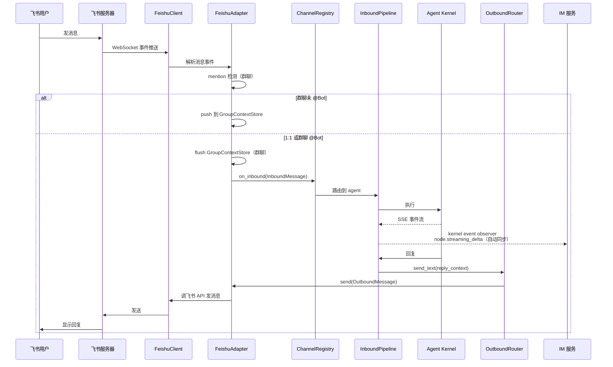
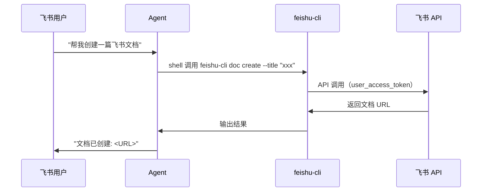

# feat-447: 飞书 channel 支持 — 技术方案

> 对齐: spec.md
>
> Unit branch: `unit/feat-447` (will be created by orchestrator)

## Changelog

## 现状分析

### 涉及范围

- `src/personal_assistant/channels/base.py` — 定义 `ChannelAdapter` Protocol（name / start / send / stop）、`InboundMessage` / `OutboundMessage` / `ReplyContext`。飞书 adapter 直接实现此 Protocol。只读不改。
- `src/personal_assistant/channels/` — 新增 `feishu_adapter.py`（飞书消息收发 adapter）、`feishu_client.py`（飞书 SDK 封装）。
- `src/personal_assistant/gateway/channel_registry.py` — `ChannelRegistry`，飞书 adapter 通过它注册。只读不改。
- `src/personal_assistant/gateway/bootstrap.py` — `start_channels` / `stop_channels`，驱动 adapter 生命周期。只读不改。
- `src/personal_assistant/gateway/outbound_router.py` — `OutboundRouter.send_text()`，路由回复到 adapter。只读不改。
- `src/personal_assistant/gateway/inbound_pipeline.py` — 入站消息处理、agent 路由、群聊 mention 门控。只读不改。
- `src/personal_assistant/gateway/group_context_store.py` — 群上下文 buffer，飞书 adapter 复用。只读不改。
- `src/personal_assistant/config/local_store.py` — 扩展 `ChannelConfig` 支持飞书 channel 配置结构。
- `src/personal_assistant/main.py` — 注册飞书 adapter。
- `skills/` — 新增飞书文档操作 skill（教 agent 调用 feishu-cli 命令操作云文档）。

### 既有约束

- Gateway 只经 `agent.sdk` 持有内核，禁止 import 内核内部
- 配置统一走 `~/.nano-assistant/config.yaml`
- channel adapter 是进程本地的，start/send/stop 是同步接口
- 回复通过 `OutboundRouter.send_text()` 路由，adapter 不直接调内核

### 可复用能力

- **`ChannelAdapter` Protocol**（`base.py`）— 飞书 adapter 直接实现，无需新建抽象。**用**。
- **`GroupContextStore`**（`group_context_store.py`）— 群上下文 buffer，飞书 adapter 未 @ 消息存入、@ 时取出。**用**。
- **`ChannelRegistry` + `bootstrap.py`** — adapter 注册和生命周期管理。**用**。
- **`OutboundRouter`** — 回复路由。**用**。
- **`InboundMessage` / `ReplyContext` 数据类** — 消息标准化。**用**。
- **feishu-cli**（飞书官方开源 CLI）— 封装全部飞书 API，内置 OAuth 流程，agent 通过 shell 调用即可操作云文档。**用**。不自建飞书 doc tools。

### 相关历史

无相关历史变更。这是第一个外部 IM channel adapter。

## 架构总览

**Before**: Gateway 只有一个 `WebRelayAdapter`，通过 IM WebSocket relay 收发消息。

**After**: Gateway 新增 `FeishuAdapter`，通过飞书 SDK 长连接直接收发消息。云文档操作通过 feishu-cli（外部 CLI 工具）实现，agent 通过 shell 调用，零自建代码。

```mermaid
graph TD
    subgraph "personal_assistant (Gateway)"
        REG[ChannelRegistry]
        PIPE[InboundPipeline]
        OUT[OutboundRouter]
        GCTX[GroupContextStore]
        MAIN[main.py]

        REG --> PIPE
        PIPE --> OUT
        GCTX --> PIPE
    end

    subgraph "channels/ (新增标★)"
        WRA[WebRelayAdapter]
        FA[★ FeishuAdapter]
        FC[★ FeishuClient]
    end

    subgraph "外部工具 (不改代码)"
        FCLI[feishu-cli<br/>飞书官方 CLI]
    end

    subgraph "外部"
        IM[IM Service<br/>WebSocket Relay]
        FS[飞书服务器<br/>长连接]
        FDOC[飞书云文档 API]
        BROWSER[用户浏览器]
    end

    WRA -->|relay.message| REG
    FA -->|InboundMessage| REG
    OUT -->|OutboundMessage| FA
    FA --> FC
    FC -->|WebSocket| FS
    FA -.->|未@消息存入| GCTX
    FA -.->|@时取出| GCTX
    WRA -->|relay| IM
    PIPE -->|kernel event observer<br/>自动同步| IM
    PIPE -->|agent shell 调用| FCLI
    FCLI -->|OAuth| BROWSER
    FCLI -->|API 调用| FDOC
```

飞书消息收发通过 `FeishuAdapter`（自建）接入 gateway；云文档操作通过 `feishu-cli`（外部工具）实现。两层解耦，互不依赖。

## 关键决策

### 决策 1: 飞书事件连接方式

**选了 WebSocket 长连接模式作为默认**。

- **理由**: Gateway 跑在用户本机（NAT 后面），无公网 IP。WebSocket 由 Bot 主动连飞书服务器，零配置开箱即用。飞书 SDK（lark-oapi）内置 WSClient，自带自动重连。
- **拒绝**: Webhook 模式——需要公网 HTTPS 端点 + verificationToken + encryptKey，部署门槛高。
- **风险**: Gateway 重启时短暂断连，飞书 SDK 自动重连，断连窗口内消息有飞书重试机制兜底。

### 决策 2: 多 Bot 配置模型

**选了 `channels` 列表中每个飞书 Bot 作为一个独立 entry，entry name 直接就是 `feishu:<agent_id>`**。

```yaml
channels:
- name: web_relay
- name: feishu:plato
  settings:
    appId: cli_xxx
    appSecret: xxx
- name: feishu:luban
  settings:
    appId: cli_yyy
    appSecret: yyy
```

- **理由**: channel registry key、adapter name、agent 路由三者用同一个标识，不需要额外的 `name` 或 `agentId` 字段。配置最简，用户只看 agent id 就能知道哪个 bot 对应哪个 agent。
- **拒绝**: `channels.feishu.accounts` 子列表——每个 account 要额外 `name` + `agentId`，但运行时 adapter name 和路由实际都靠 `agent_id`，`name` 成了无消费的冗余字段。
- **风险**: 一个 agent 只能绑一个飞书 bot；如果需要多 bot 对应同一 agent，需要新增独立路由层（当前 spec 不需要）。

### 决策 3: 云文档操作方案

**选了 feishu-cli（飞书官方开源 CLI）作为云文档操作的唯一路径，不自建飞书 doc tools**。

- **理由**: feishu-cli 封装了全部飞书 API（文档、知识库、电子表格、消息、日历、任务），内置 OAuth 用户授权流程（`feishu-cli auth login`），agent 有 shell 执行能力即可调用。零自建代码，维护成本为零。
- **拒绝**: 自建 feishu_doc_tools.py + OAuth 模块——重复造轮子，飞书官方已经做好了。
- **风险**: feishu-cli 是外部依赖，需确保安装。但它是飞书官方维护，npm 一键安装，稳定性有保障。

### 决策 4: Session 隔离 key 设计

**选了 `feishu:<agent_id>:dm/group:<id>` 格式**。

- **理由**: 用 `agent_id` 而非 `app_id`，可读性好，调试直观。跟 OpenClaw 的 `agent:<agentId>:feishu:...` 模式一致。一对一映射保证隔离。
- **拒绝**: 用 `app_id`（不可读）；不加标识（多 bot 碰撞）。
- **风险**: 无。改 agent_id 会断 session，但实际不会改。

### 决策 5: 群聊未 @ 消息的 history buffer

**选了直接复用现有 `GroupContextStore`**。

- **理由**: 代码已存在，gateway spec 已定义行为。飞书 adapter 只需在未 @ 时 push、@ 时 flush。
- **拒绝**: 自己实现 buffer——重复造轮子。
- **风险**: 无。纯复用。

### 决策 6: 飞书对话同步到内部 IM

**选了复用现有 kernel event observer 的 `node.streaming_delta` 机制，不新建 mirror 通道**。

- **理由**: Gateway 已有 `_build_kernel_event_observer`（main.py:3377），它把 kernel 的 SSE 事件（run_status / assistant_message / tool_start / tool_end / turn_end）翻译成 `node.streaming_delta` WebSocket 帧推给 IM 服务。这个 observer 对所有 channel 的 kernel run 都生效——飞书消息走的是同一条 InboundPipeline → kernel 路径，observer 自然会把事件推到 IM。IM 服务收到 `turn_start`（conversation_id 为空时）会懒创建一个会话，后续 delta 填充内容。**不需要新建 mirror 机制，现有 observer 已经是 mirror**。
- **关键前提**: 飞书 adapter 的 `InboundMessage` 必须正确设置 `agent_id`（从 channel name `feishu:<agent_id>` 解析），这样 `run_context_store` 里的 `agent_id` 才正确，IM 侧才能把消息归到正确的 agent 会话。
- **拒绝**: 新建独立 mirror 模块——重复造轮子，现有 observer 已经覆盖。
- **已知 gap**: kernel event observer 只同步 agent 输出（assistant_message / tool_start / tool_end / turn_end）到 IM，**不转发用户原始消息**。飞书路径绕过 IM 服务，IM 侧没有用户消息记录。结果：内部 IM 显示"只有 agent 回复、没有用户提问"的半边对话。WebRelayAdapter 的用户消息由 IM 服务自己存储（relay 时已入库），所以不走 observer 也完整。**作为 MVP 接受半边对话**；如需完整同步，需在 FeishuAdapter 入站时额外调用 IM 的消息创建 API，留后续 unit。
- **风险**: IM 服务离线时 observer 的 send_json 静默失败，不影响飞书主路径。

## 接口与数据流

### 飞书消息收发主流程



### 云文档操作流程（通过 feishu-cli）



OAuth 授权（一次性）:
1. 用户执行 `feishu-cli auth login`
2. 浏览器打开飞书授权页 → 用户点同意
3. feishu-cli 自动保存 token 到本地
4. 后续所有 `feishu-cli` 命令自动使用该 token

### FeishuAdapter 接口

```python
class FeishuAdapter:
    """实现 ChannelAdapter Protocol"""

    name: str                           # "feishu:<agent_id>"，从 config 传入
    app_id: str                         # 飞书应用 ID
    agent_id: str                       # 从 name 解析出的 agent ID

    def start(self, on_inbound: InboundHandler) -> None:
        """启动飞书 WebSocket 长连接，注册入站回调"""

    def send(self, outbound: OutboundMessage) -> None:
        """通过飞书 API 发送消息"""

    def stop(self) -> None:
        """关闭 WebSocket 连接"""
```

**关键**: `on_inbound(InboundMessage)` 中必须设置 `agent_id=self.agent_id`（从 channel name `feishu:<agent_id>` 解析）。否则三个 Bot 的消息全路由到 default agent，多 Agent 路由失效。

### Session key 生成

FeishuAdapter 产出的 InboundMessage 的 `external_chat_id` 与 `agent_id` 组合，由现有 `build_conversation_session_key` 生成 session key：

| 场景 | external_chat_id | agent_id | 最终 key（由 build_session_key 生成） |
|---|---|---|---|
| 1:1 私聊 | `feishu:<app_id>:dm:<user_open_id>` | `plato` | `feishu:<app_id>:dm:<user_open_id>:plato` |
| 群聊 | `feishu:<app_id>:group:<chat_id>` | `plato` | `feishu:<app_id>:group:<chat_id>:plato` |

`external_chat_id` 用 `feishu:<app_id>:...` 格式编码飞书会话标识（含 app_id 保证多 Bot 不碰撞），`agent_id` 由 `build_session_key` 自动拼接。不自定义 key 格式，完全复用现有 `session_keys.py` 的 `f"{channel}:{chat_id}:{agent_id}"` 模式。

### 关键数据结构

**InboundMessage 字段**:
- `channel_name` = `"feishu:<agent_id>"`（用于 OutboundRouter 路由回正确 adapter）
- `external_user_id` = 飞书 sender open_id
- `external_chat_id` = `feishu:<app_id>:dm:<user_open_id>` 或 `feishu:<app_id>:group:<chat_id>`
- `agent_id` = 从 channel name 解析出的 agent_id（**必须设置**，驱动多 Agent 路由）
- `is_group` = chat_type != "p2p"
- `metadata["feishu_message_id"]` — 飞书消息 ID
- `metadata["feishu_chat_type"]` — p2p / group
- `metadata["feishu_mentions"]` — @ 列表

**ReplyContext 字段**:
- `channel_name` = `"feishu:<agent_id>"`
- `target_chat_id` = InboundMessage.external_chat_id
- `metadata["feishu_message_id"]` — 回复目标消息 ID（飞书回复语义）

### 环境依赖

- **lark-oapi**（飞书官方 Python SDK）— 需在 `pyproject.toml` / `requirements.txt` 中声明依赖。FeishuClient 内部 import。

## 契约层增量 (delta-spec)

- kernel: no spec delta
- im: no spec delta
- gateway: `specs/gateway/spec.md` — ADDED:
  - **Requirement: 飞书 channel 消息收发** — Gateway 通过飞书 SDK WebSocket 长连接收发消息，1:1 私聊直接响应，群聊 @Bot 触发，未 @ 消息暂存为上下文
  - **Requirement: 飞书多 Bot 路由** — 每个飞书 Bot 通过 channel name `feishu:<agent_id>` 绑定 agent，消息路由到对应 Agent
  - **Requirement: 飞书对话同步到内部 IM** — 飞书消息和回复通过现有 kernel event observer 自动同步到 IM 服务
- cli: no spec delta

## 风险与回退

| 风险 | 影响 | 应对 |
|---|---|---|
| 飞书 SDK 版本兼容 | lark-oapi API 变动可能破坏集成 | 锁定 SDK 版本，单测覆盖核心路径 |
| WebSocket 断连丢消息 | gateway 重启窗口内消息可能丢失 | 飞书 SDK 自带重连 + 消息重试；可后续加 webhook fallback |
| feishu-cli 未安装 | agent 无法操作云文档 | gateway 启动时检测，未安装则提示；或在 skill 里引导安装 |
| feishu-cli token 过期 | 云文档操作失败 | feishu-cli 内置 refresh 机制；refresh 也过期则提示用户重新 `feishu-cli auth login` |
| 三个 Bot 同时连飞书 | 资源占用 | 每个 Bot 独立 WebSocket 连接，飞书 SDK 轻量，无显著开销 |

## Runbook for Reviewer

| 服务 | 停止命令 | 启动命令 | 健康检查 |
|---|---|---|---|
| Gateway (personal_assistant) | `PYTHONPATH=src python -m personal_assistant.main stop` | `PYTHONPATH=src python -m personal_assistant.main --config ~/.nano-assistant/config.yaml` | 检查进程存活 + 飞书 Bot 在线状态 |

**Review 驱动方式**: 端到端真栈;客户端面是飞书客户端——reviewer 需在飞书里实际发消息验证收发。云文档操作通过 feishu-cli shell 命令验证。

## Milestones

| ID | 标题 | 依赖 | 并行组 | 范围 | 退出标准 |
|---|---|---|---|---|---|
| feat-447-M1 | feishu-messaging | — | A | channels/feishu_adapter.py, channels/feishu_client.py, config/local_store.py, main.py | [reviewer] 1:1 私聊收发正常（覆盖 Scenario: 用户在 1:1 私聊中发消息）;群聊 @Bot 触发回复（覆盖 Scenario: 群聊中 @Bot 触发回复）;未 @ 不回复（覆盖 Scenario: 群聊中未 @Bot 不触发）;未 @ 消息作为上下文（覆盖 Scenario: 未 @ 消息作为上下文）;多 Bot 各自路由到对应 Agent（覆盖 Scenario: 不同 Bot 对应不同 Agent）;飞书对话同步到内部 IM（覆盖 Scenario: 飞书消息出现在内部 IM + 飞书群聊消息出现在内部 IM）;[worker] feishu_adapter 单测全绿;飞书 SDK 连接建立成功;config.yaml 解析正确;mirror 到 IM 服务单测覆盖 |
| feat-447-M2 | feishu-cli-integration | feat-447-M1 | B | skills/feishu-doc.md（飞书文档操作 skill） | [reviewer] 以用户身份创建文档（覆盖 Scenario: 以用户身份创建文档）;以用户身份编辑文档（覆盖 Scenario: 以用户身份编辑文档）;以用户身份读取文档（覆盖 Scenario: 以用户身份读取文档）;以用户身份创建文件夹（覆盖 Scenario: 以用户身份创建文件夹）;以用户身份移动文件（覆盖 Scenario: 以用户身份移动文件）;未授权时提示授权（覆盖 Scenario: 未授权时提示授权）;API 失败时反馈错误（覆盖 Scenario: 云文档 API 调用失败）;[worker] feishu-cli 安装验证;OAuth 授权流程验证;skill 文件格式正确 |
| feat-447-M6 | fix-dm-retry-and-registry | feat-447-M5 | — | src/personal_assistant/channels/feishu_client.py, src/personal_assistant/channels/feishu_adapter.py, src/personal_assistant/main.py (post-acceptance fix, round 2) | [worker] DM 回复使用 receive_id_type=open_id;5xx 与 429 重试计数器分离;_build_channel_registry 要求 group_context_store 非空或 FeishuAdapter 对 None 安全;新增/更新对应单测;全量非 e2e 测试无回归 |
