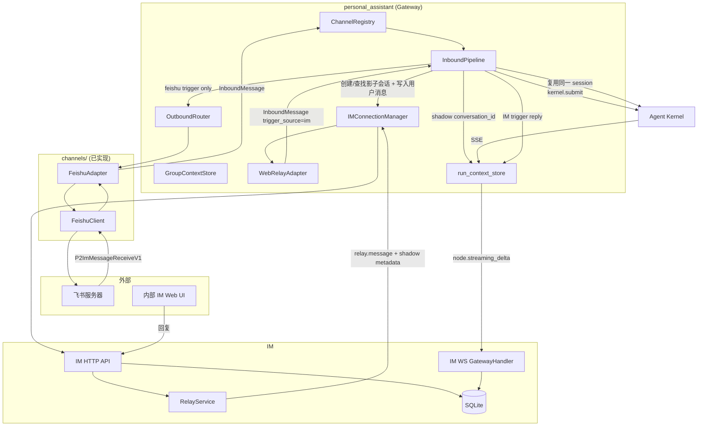
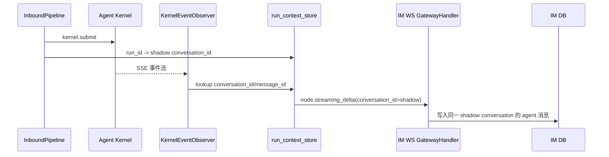

# feat-447: 飞书 channel 支持 — 技术方案

> 对齐: spec.md
>
> Unit branch: `unit/feat-447` (will be created by orchestrator)

## Changelog

## 现状分析

### 涉及范围

- `src/personal_assistant/channels/base.py` — `ChannelAdapter` Protocol、`InboundMessage` / `OutboundMessage` / `ReplyContext`。飞书 adapter 已实现，只读不改。
- `src/personal_assistant/channels/feishu_client.py` — 飞书 SDK 封装（WS 接收、REST 发送、reaction、错误分类）。已实现，M6 修复后稳定。
- `src/personal_assistant/channels/feishu_adapter.py` — 飞书消息收发 adapter（1:1 DM、群聊 @Bot、history buffer、ack reaction）。已实现，M6 修复后稳定。
- `src/personal_assistant/gateway/inbound_pipeline.py` — 入站消息处理、agent 路由、群聊 mention 门控、GroupContextStore buffer。已有 `_resolve_sender_label` 从 `metadata.sender_display_name` 取发送者名字；M7 需要新增 IM sync hook、`sync_only` 入站语义、影子 group gate 前注入/绕过和跨入口 session key 归一。
- `src/personal_assistant/gateway/outbound_router.py` — 当前只按 `ReplyContext.channel_name` 取 adapter 并发送；M7 需要确认 per-run `reply_context` 是唯一出站锚，避免 IM 触发的 run 复用飞书 reply target。
- `src/personal_assistant/gateway/session_keys.py` — `build_session_key` 当前使用 `channel_name:external_chat_id:agent_id`，而 `web_relay` 的 `external_chat_id` 是 IM conversation_id；M7 需要优先用 relay metadata 回环的外部身份生成 session key。
- `src/IM/domain/models.py` — `Conversation` 无外部 channel 来源标记；`Message.sender` 是 `Actor`，`Actor.display_name` 已存在但当前未持久化到 `messages` 表。
- `src/IM/infra/db.py` — `conversations` 表缺 `external_source` / `external_chat_id`；`messages` 表缺 `sender_display_name`。
- `src/IM/infra/repositories.py` — `ConversationRepository.create_conversation` 和 `MessageRepository.create_message` 需要扩展新字段。
- `src/IM/api/routes/web_im.py` / `src/IM/api/routes/messages.py` — IM conversation/message REST API 实际所在文件，需要新增外部 channel 会话 find-or-create 接口，并支持 `sender_display_name`。
- `src/IM/application/relay_service.py` — IM relay payload 的生产源；M7 需要在 `enqueue_message_relay` metadata 中带回影子会话的 `external_source` / `external_chat_id` / `agent_id` / `conversation_type` / `trigger_source`。
- `src/IM/ws/gateway_handler.py` — agent streaming delta 的 `turn_start` 现状会在 `conversation_id=""` + `to_user_id` 时懒创建普通 direct chat；M7 需要让外部 channel run 使用已创建的 shadow conversation_id，不再走 lazy direct。
- `src/IM/application/web_im_service.py` — 需要新增外部 channel 会话创建/查找业务方法。
- `src/personal_assistant/channels/web_relay_adapter.py` — IM relay 入站转换点；M7 需要从 relay metadata 设置外部身份、`trigger_source=im` 和 `conversation_type`，并避免把 IM conversation_id 当 kernel session identity。
- `src/personal_assistant/main.py` — Gateway 启动、channel 注册、生命周期 callback、`run_context_store` 注入。M7 需要把 shadow conversation_id 写入 run context，并禁止外部 run 在 shadow 创建失败时懒建普通 direct chat。
- `src/personal_assistant/config/local_store.py` — 配置解析与校验；M7 需要补充 owner 飞书 open_id 配置（用于 IM 显示「你」）。
- `skills/feishu-doc.md` — M2/M3/M4 已落地，不改。

### 既有约束

- Gateway 只经 `agent.sdk` 持有内核，禁止 import 内核内部。
- `coding_cli` / `personal_assistant` 只能 import `agent.sdk`，禁止 import `agent.core` / `agent.platform`。
- IM 不调用 agent，只与用户和 personal_assistant 交互。
- channel adapter 是进程本地的，start/send/stop 是同步接口。
- 配置统一走 `~/.nano-assistant/config.yaml`。
- 在 worktree 内起任何监听端口的服务必须分配空闲端口并 kill 自己起的进程。

### 可复用能力

- **`ChannelAdapter` Protocol + FeishuAdapter/FeishuClient** — 飞书消息收发已完成。**用**。
- **`GroupContextStore`** — 群上下文 buffer。**用**。
- **`InboundPipeline` + `OutboundRouter`** — Gateway 核心消息处理。**用**，并扩展 IM 同步 hook。
- **IM `messages.py` REST API** — 已有创建消息接口，支持 `sender` actor-first payload。**扩展**以透传 `sender_display_name`。
- **IM `gateway_handler.py` lazy conversation 创建** — `_handle_streaming_delta` 的 `turn_start` 在 `conversation_id=""` 且 `to_user_id` 存在时会创建 direct chat。**扩展**为支持外部 channel 影子会话的预创建/查找。
- **kernel event observer (`node.streaming_delta`)** — agent 输出同步到 IM 已工作（M1 后修复）。**用**。

### 相关历史

- M1 `feat-447-M1`：飞书消息收发、多 Bot 路由、ack reaction、半边对话同步（仅 agent 回复）。
- M4/M5/M6：config 一致性、ack reaction、DM receive_id_type、重试计数器分离、registry 必填 group_context_store。
- `docs(feat-447): 补全外部 channel 同步到内部 IM 的 spec`：spec 更新，要求外部 channel 用户消息同步到 IM、群聊影子 group、发送者名字显示、按触发源路由 agent 回复、同一 kernel session 跨入口复用。

## 架构总览

**Before**：Gateway 飞书 channel 已能收发消息，agent 回复通过 `node.streaming_delta` 懒创建 direct chat 同步到 IM，但 IM 侧没有用户原始消息，呈现"半边对话"。

**After**：外部 channel 在 IM 中有独立的影子会话（1:1 为 `direct`，群聊为 `group`），用户消息完整同步到 IM；agent 回复按触发源路由——飞书触发的回复同时回写飞书和 IM，IM 触发的回复只留在 IM；同一 kernel session 跨入口复用，保证上下文连续。



## 关键决策

### 决策 1: 飞书事件连接方式

**选了 WebSocket 长连接模式**。

- **理由**: Gateway 跑在用户本机（NAT 后面），无公网 IP。WebSocket 由 Bot 主动连飞书服务器，零配置开箱即用。
- **拒绝**: Webhook 模式——需要公网 HTTPS 端点。
- **风险**: Gateway 重启时短暂断连，飞书 SDK 自动重连。

### 决策 2: 多 Bot 配置模型

**选了 `channels` 列表中每个飞书 Bot 作为一个独立 entry，name = `feishu:<agent_id>`**。

- **理由**: channel registry key、adapter name、agent 路由三者统一。
- **拒绝**: `channels.feishu.accounts` 子列表——冗余字段。
- **风险**: 一个 agent 只能绑一个飞书 bot。

### 决策 3: 云文档操作方案

**选了 feishu-cli 作为云文档操作路径**。

- **理由**: 飞书官方 CLI 封装全部 API + OAuth，agent 有 shell 能力即可调用。
- **拒绝**: 自建飞书 doc tools。
- **风险**: 外部依赖，需在 skill 中引导安装。

### 决策 4: Kernel session identity 与 channel 路由身份分离

**选了 kernel session key 统一基于 `{external_source}:{external_chat_id}:{agent_id}`，channel_name 仅用于 outbound 路由**。

- **理由**: spec 要求飞书入口和 IM 影子会话入口复用同一 kernel session。现状 `build_session_key` 使用 `{channel_name}:{external_chat_id}:{agent_id}`，导致飞书入口（`channel_name=feishu:<agent_id>`）与 IM relay 入口（`channel_name=web_relay`，`external_chat_id=IM conversation_id`）生成不同 key，无法复用 session。改用外部 channel 身份（external_source + external_chat_id）作为 session identity 后，两入口只要指向同一外部 chat，就能命中同一 session。
- **拒绝**: 维持现状 channel_name 参与 session key — 跨入口上下文连续验收必失败。
- **实现要点**:
  - `InboundMessage.metadata["external_source"]` 显式携带 `"feishu"`；IM relay 从影子会话 metadata 中回环相同的 `external_source` / `external_chat_id` / `agent_id`。
  - `session_keys.build_session_key` 改为优先用 `metadata["external_source"]:metadata["external_chat_id"]:agent_id` 拼接；只有没有外部身份 metadata 的普通 channel 才回退现有 `{channel_name}:{message.external_chat_id}:{agent_id}`。
  - `web_relay` 的 `message.external_chat_id` 继续表示 IM conversation_id，仅用于 IM delivery / reply_context，不得参与外部 channel kernel session identity。
  - `channel_name` 仍留在 `build_reply_context` 中，作为 outbound 路由身份（飞书 adapter 还是 web_relay adapter）。
  - 新增 `session_keys.build_external_session_key(external_source, external_chat_id, agent_id)` 供需要显式构造的场景使用；同一 external identity helper 也用于 group buffer key，避免 session 连续但 buffer 断裂。

### 决策 5: 群聊未 @ 消息的 history buffer 单一 owner

**选了未 @ 群聊消息统一由 InboundPipeline 负责 buffer 和 IM 同步，FeishuAdapter 不再本地 buffer**。

- **理由**: 当前 FeishuAdapter 未 @ 分支只调用 `_buffer_group_message` 不进 Pipeline；若 M7 要同步未 @ 消息到 IM，必须让 Pipeline 看到这条消息。若 adapter 既 buffer 又送 Pipeline，会造成下一次 @ 时上下文重复。统一由 Pipeline 作为唯一 owner，adapter 只负责把消息原样交给 Pipeline，Pipeline 决定是否 buffer、是否同步到 IM、是否触发 agent。
- **拒绝**: adapter 本地 buffer + 独立 sync hook — 同步和上下文两个职责跨 adapter/pipeline 重叠，未来新增 channel 会重复踩坑。
- **实现要点**:
  - FeishuAdapter 未 @ 分支生成 `InboundMessage` 并调用 `_on_inbound`，在 metadata 中标记 `"sync_only": true`；adapter 不再本地 `_buffer_group_message`。
  - `sync_only` 是正式入站语义：进入 Pipeline、解析 agent、同步 IM、写 GroupContextStore；不分配 kernel session、不进入 queue、不触发 reply；`_should_process` 可以用于计算"是否会触发"，但 `sync_only=true` 最终必须强制短路执行。
  - GroupContextStore key 与 kernel session identity 同口径：有 `metadata["external_source"]` / `metadata["external_chat_id"]` 时使用 `external_source:external_chat_id:agent_id`；普通 channel 回退现有 `{agent_id}:{channel_name}:{external_chat_id}`。这样 Feishu 未 @ 的 sync_only buffer 能被后续 Feishu @ 触发，也能被 IM shadow group 入口触发 drain。
  - @Bot / `group_reply_policy=ALWAYS` 分支继续走响应路径：由 Pipeline 用 external buffer key drain 自己维护的 buffer 后 submit run，adapter 不再 drain 另一份本地 buffer。

### 决策 6: 外部 channel 会话同步到内部 IM

**选了外部 channel 用户消息同步到 IM，agent 回复按触发源决定是否回写外部 channel**。

- **理由**: spec 明确要求用户在 IM 影子会话里的消息只进 kernel 上下文、不回写原 channel，否则飞书侧会看到 agent 突然回复的"灵异对话";外部 channel 用户消息必须出现在 IM 中。同一 kernel session 跨入口复用，保证上下文连续。
- **拒绝**: 完整双向镜像（IM 用户消息也回写外部 channel）——违反用户新明确的体验约束。
- **实现要点**:
  - Gateway 在 `InboundPipeline.handle_inbound` 早期调用 IM HTTP API 创建/查找外部 channel 影子会话并写入用户消息。
  - IM 同步必须是**非阻塞 best-effort**：调用超时或异常时捕获并记录，不阻塞飞书主路径，agent 仍正常回复。
  - IM 侧会话带 `external_source` + `external_chat_id` 标记，保持 `direct` / `group` 类型语义。
  - Gateway 拿到 `external/find-or-create` 返回的 `conversation_id` 后，先把 `shadow_conversation_id` 放进当前 `InboundMessage.metadata` / 等效 turn context；`kernel.submit` 后的 lifecycle `accepted` callback 读取它并 seed `run_context_store`。不要在没有 `run_id` 的同步 hook 里直接写 run context。
  - 外部 channel 同步失败时，不得保留 `conversation_id=""` + `to_user_id=owner_user_id` 组合让 IM 懒创建普通 direct chat；应留空/标记 skip，让本轮 agent 回复只回外部 channel，符合"IM 离线暂不同步"。
  - 每个 run 在 `run_context_store` 中记录 `trigger_source`（`feishu` / `im`）和 `shadow_conversation_id`， outbound 阶段只依赖 per-run `reply_context` 决定即时外部出口。

### 决策 7: IM 会话来源标识

**选了在 `conversations` 表新增 `external_source` + `external_chat_id`，不改变现有 `direct` / `group` 类型**。

- **理由**: 语义清楚，1:1 私聊仍映射为 `direct`、群聊映射为 `group`，不破坏 IM 现有分支逻辑。
- **拒绝**: 新增 `external` 类型——需要改 Conversation enum 和多处 switch/case，回归面大。
- **拒绝**: 仅靠 title 区分——IM 无法识别来源，也无法做按 channel 过滤/管理。
- **实现要点**: agent 维度复用现有 `conversations.config_agent_id`，不要新增第二个 `agent_id` 列。`external/find-or-create` request 中的 `agent_id` 是 API 入参，落库到 `config_agent_id`；幂等索引用 `(external_source, external_chat_id, config_agent_id, owner_id)`。

### 决策 8: 外部发送者名字持久化

**选了在 `messages` 表新增 `sender_display_name` 列**。

- **理由**: 外部群成员名字需要随历史记录保留，metadata 透传不持久化会在历史加载时丢失。
- **拒绝**: 给每个外部发送者建 IM 用户——产生脏数据，且 owner 自己也要建 fake 用户才能显示「你」。

### 决策 9: IM 影子会话创建/查找接口

**选了新增专用 POST `/im/v1/conversations/external/find-or-create`**。

- **理由**: 幂等键 `(external_source, external_chat_id, config_agent_id, owner_id)` 明确；API 入参仍叫 `agent_id`，IM 落库时映射到现有 `config_agent_id`。IM 负责去重和 participant 规则，Gateway 不维护 IM conversation_id → session_key 的本地映射。
- **拒绝**: Gateway 自己先查后创——竞态条件下可能重复创建。
- **拒绝**: Gateway 启动时预创建——外部群聊信息（群名、成员）事前未知。
- **补充**: 每次同步消息时都调用该接口，IM 侧命中已有会话时**同步更新 title**（如飞书群名已修改），保持两边会话名一致。
- **身份边界**: Request 体**不含 `owner_id`**。IM 数据面身份取自 Bearer token / `current_user.owner_id`（canonical IM spec 规定），`owner_id` 由 IM 侧派生，不允许请求参数作为信任锚。

### 决策 10: 按触发源路由 agent 回复

**选了 run 级 `trigger_source` 标记 + per-run `reply_context` 与 session key 分离**。

- **理由**: 与现有 IM → Gateway WebSocket relay 机制一致，无需新增 HTTP 接入面；通过 `trigger_source` 区分飞书触发和 IM 触发，避免 IM 主动对话时把回复回写到飞书。
- **拒绝**: Gateway 本地维护反向映射——重启丢失、多实例不共享。
- **拒绝**: IM 直接调 Gateway HTTP dispatch——增加新的集成面。
- **拒绝**: 不区分触发源、所有 IM 影子会话回复都回写外部 channel——违反"IM 主动沟通不回写飞书"的约束。
- **实现要点**:
  - 飞书入口：`trigger_source=feishu`，`reply_context.channel_name=feishu:<agent_id>`，agent 最终文本经 OutboundRouter 回写飞书；streaming observer 使用 `run_context_store.shadow_conversation_id` 同步到 IM 影子会话。
  - IM 入口：`trigger_source=im`，`reply_context.channel_name=web_relay`，但 `web_relay.send()` 只是记录/测试路径；真实 IM 回复仍由 streaming observer 根据 `run_context_store.conversation_id=shadow_conversation_id` 写回同一 IM conversation，不回写飞书。
  - `session_key` 与 `reply_context` 解耦：session key 只由 `external_source:external_chat_id:agent_id` 决定，保证两入口复用同一 kernel session；reply_context 只决定当次 run 的回复出口。

### 决策 11: IM owner 在外部 channel 的消息显示为「你」

**选了每个飞书 channel settings 中显式配置 `ownerOpenId`，入站时对比 `sender_open_id`**。

- **理由**: 实现最简单稳定，MVP 可接受。飞书 open_id 在创建 Bot 后可在飞书管理后台查看。
- **拒绝**: IM 绑定飞书账号后动态查询——增加 IM 侧账号绑定流程，超出本期范围。
- **配置路径**: `channels[].settings.ownerOpenId`，与现有 `appId`/`appSecret`/`botOpenId` 同级。`config/local_store.py` 的 `_validate_feishu_settings` 增加校验，缺失时启动报错或警告（按项目配置策略）。
- **影响**: `sender_display_name` 在 owner 自己发消息时传 `"你"`（或前端根据 sender_user_id 渲染为「你」，但外部 channel 用户没有 IM user_id，所以必须由 Gateway 侧决定）。

### 决策 12: IM 群聊影子会话自动注入 @agent

**选了 Gateway 收到 IM 群聊影子会话的用户消息后，在 mention gate 之前自动注入 `@<agent_id>`（或等效 mention 标记）**。

- **理由**: 外部 channel 群聊中，agent 的群聊提示词依赖 `@Bot` 来确认自己被点名；IM 群聊影子会话里没有真实的 @ 动作，需要 Gateway 侧补一个等效提及，保证 agent 按群聊路径响应。
- **拒绝**: 让 IM 前端强制用户手动 @agent——体验割裂，且影子会话里 agent 是主角，不应要求用户每次 @。
- **限制**: 1:1 影子会话是 direct 类型，不存在群聊门控，不需要注入。
- **实现要点**: 注入必须发生在 `_should_process` 之前（例如在 `WebRelayAdapter` 组装 `InboundMessage` 时补 `metadata["mentioned_agent_ids"]=[agent_id]`，或在 Pipeline 进入 gate 前改写等效 mention 标记）。如果等到构造 kernel parts 时才注入，消息已经被 mention gate 丢弃。
- **relay metadata**: IM relay 消息给 Gateway 时，必须在 metadata 中携带 `conversation_type="group"`，WebRelayAdapter 据此设置 `InboundMessage.is_group=true`。当前 `create_message` 调 `enqueue_relay_all` 未传 conversation type，M7 需要补上。

### 外部 shadow session identity 模型

这四个身份必须分开，worker 不得用其中一个字段同时承担多种职责：

| 身份 | 字段 | 作用 | 不做什么 |
|---|---|---|---|
| kernel session identity | `external_source + external_chat_id + agent_id` | 决定同一外部对话跨飞书入口 / IM 影子入口是否复用同一 kernel session | 不决定回复发到哪里 |
| shadow conversation identity | `shadow_conversation_id`（IM conversation id） | 决定 agent streaming delta 和用户消息写入哪个 IM 会话 | 不参与 kernel session key |
| per-run reply target | `ReplyContext(channel_name, target_chat_id, metadata.trigger_source)` | 决定本次 run 的最终文本是否回写飞书或只留 IM | 不作为持久 session identity |
| group buffer identity | `external_source + external_chat_id + agent_id`（外部 channel）或旧 `{agent_id}:{channel_name}:{external_chat_id}`（普通 channel） | 决定未 @ 群聊上下文写入和后续 drain 是否命中同一 buffer | 不决定 kernel session id 或回复出口 |

飞书入口的 run 同时拥有：`session_key=feishu:<feishu_chat_id>:<agent_id>`、`group_buffer_key=feishu:<feishu_chat_id>:<agent_id>`、`shadow_conversation_id=<im_conv_id>`、`reply_context.channel_name=feishu:<agent_id>`。IM 影子入口的 run 拥有同一个 `session_key`、同一个 `group_buffer_key` 和同一个 `shadow_conversation_id`，但 `reply_context.channel_name=web_relay` / `trigger_source=im`。这样才能同时满足"上下文连续"、"未 @ 群聊背景跨入口可用"和"IM 触发不回写飞书"。

### 1. 外部 channel 用户消息同步到 IM

```mermaid
sequenceDiagram
    participant U as 飞书用户
    participant FS as 飞书服务器
    participant FC as FeishuClient
    participant FA as FeishuAdapter
    participant PIPE as InboundPipeline
    participant IM as IM HTTP API
    participant DB as IM DB

    U->>FS: 发消息
    FS->>FC: P2ImMessageReceiveV1
    FC->>FA: FeishuMessageEvent
    alt 群聊未 @Bot
        FA->>PIPE: InboundMessage(metadata sync_only=true, trigger_source=feishu)
        PIPE->>PIPE: sync_only: append GroupContextStore; do not allocate session/run
        PIPE->>IM: POST /im/v1/conversations/external/find-or-create
        IM->>DB: 创建/查找影子会话并更新 title
        IM-->>PIPE: conversation_id, conversation_type
        PIPE->>IM: POST /im/v1/conversations/{id}/messages
        IM->>DB: 写入用户消息（带 sender_display_name）
    else 1:1 或群聊 @Bot
        FA->>PIPE: InboundMessage(metadata trigger_source=feishu)
        PIPE->>IM: POST /im/v1/conversations/external/find-or-create
        IM->>DB: 创建/查找影子会话并更新 title
        IM-->>PIPE: conversation_id, conversation_type
        PIPE->>IM: POST /im/v1/conversations/{id}/messages
        IM->>DB: 写入用户消息（带 sender_display_name）
        PIPE->>PIPE: 继续原有 agent 路由（drain buffer / submit run）
    end
```

### 2. Agent 回复同步到 IM（复用现有路径）



### 3. IM 影子会话消息进入 kernel 上下文（回复按触发源路由）

```mermaid
sequenceDiagram
    participant IMUI as 内部 IM Web UI
    participant API as IM HTTP API
    participant WS as IM WS GatewayHandler
    participant GWS as Gateway WS 客户端
    participant WRA as WebRelayAdapter
    participant PIPE as InboundPipeline
    participant K as Agent Kernel
    participant OBS as KernelEventObserver

    IMUI->>API: 在影子会话发消息
    API->>WS: relay message
    WS->>GWS: 转发用户消息 + shadow metadata(trigger_source=im, external_source, external_chat_id, agent_id, conversation_type)
    GWS->>WRA: accept_relay(payload)
    WRA->>PIPE: InboundMessage(channel_name=web_relay, external_chat_id=IM conversation_id, metadata 含 external_source/external_chat_id/agent_id/trigger_source)
    PIPE->>PIPE: gate 前注入/标记 mention; session_key=metadata external_source:external_chat_id:agent_id
    PIPE->>K: 复用同一 kernel session
    K-->>OBS: SSE 事件流
    OBS-->>WS: node.streaming_delta(conversation_id=同一 IM 影子会话)
    WS-->>IMUI: 回复只出现在 IM，不回写飞书
```

### 关键数据结构

**InboundMessage 扩展字段**（Gateway → IM 同步用户消息时）：
- `metadata["sender_display_name"]` — 发送者显示名（owner 自己为 `"你"`）
- `metadata["external_source"]` = `"feishu"`
- `metadata["external_chat_id"]` — 飞书会话标识
- `metadata["agent_id"]` — 对应 agent
- `metadata["conversation_title"]` — 预计算的会话名（`agent名 · channel名` 或 `agent名 · 群名 · channel名`）
- `metadata["chat_name"]` — 飞书群名（群聊时）
- `metadata["is_group"]` — 是否群聊
- `metadata["sync_only"]` — `true` 表示该消息只同步到 IM / 进入 GroupContextStore，不触发 agent（用于未 @ 的群聊上下文消息）
- `metadata["trigger_source"]` — 触发来源，`"feishu"` 或 `"im"`，决定 agent 回复是否回写外部 channel

**Session / ReplyContext 新约定**:
- `session_key = f"{external_source}:{external_chat_id}:{agent_id}"` — 跨入口复用同一 kernel session。
- `group_buffer_key = f"{external_source}:{external_chat_id}:{agent_id}"` — 外部 channel 群聊 buffer key；普通 channel 没有 external identity 时回退旧 key。
- `shadow_conversation_id` — IM conversation id，只用于 IM 展示/streaming delta 目标，不参与 session key。
- `reply_context.channel_name` — 当次 run 的最终文本出口：`feishu:<agent_id>` 或 `web_relay`；对 `web_relay` 来说生产 IM 回复仍走 observer，不依赖 adapter `send()`。
- `reply_context.metadata["trigger_source"]` — 与 `run_context_store` 中的 `trigger_source` 一致，OutboundRouter 可据此二次确认出口（防御性）。

**IM `conversations` 表新增列**：
- `external_source TEXT` — 外部 channel 来源，如 `"feishu"`
- `external_chat_id TEXT` — 外部 channel 的 chat id
- agent 维度复用现有 `config_agent_id TEXT`，不新增第二个 agent id 字段
- 联合索引：`(external_source, external_chat_id, config_agent_id, owner_id)` 用于幂等查找（`owner_id` 由 IM 当前用户派生）

**IM `messages` 表新增列**：
- `sender_display_name TEXT` — 发送者显示名

**IM API 新增接口**：
- `POST /im/v1/conversations/external/find-or-create`
  - Request: `{ external_source, external_chat_id, agent_id, title, is_group, participant_ids, metadata }`（**不含 `owner_id`**，身份由 Bearer token/current_user 派生）
  - Response: `{ conversation_id, conversation_type, title }`

**IM → Gateway WebSocket relay 扩展字段**（影子会话消息）：
- `metadata["trigger_source"]` = `"im"` — 标识消息来自内部 IM，Gateway 收到后不回写外部 channel
- `metadata["external_source"]` / `metadata["external_chat_id"]` / `metadata["agent_id"]` — 复用同一 kernel session；注意 `external_chat_id` 是飞书 chat id，不是 IM conversation id
- `metadata["conversation_type"]` = `"group" | "direct"` — WebRelayAdapter 据此设置 `InboundMessage.is_group`
- 群聊影子会话中，Gateway 解析到 `conversation_type=group` 时，在 `_should_process` 之前自动补 `mentioned_agent_ids=[agent_id]` 或等效 `@<agent_id>`，模拟外部群聊中的 @Bot 触发

**run_context_store 外部 channel 扩展**：
- `conversation_id = shadow_conversation_id` — `external/find-or-create` 成功时写入；observer 的 `turn_start` 直接使用它。
- `to_user_id = ""` — 外部 channel run 不走 lazy direct 创建；shadow 创建失败时 `conversation_id` 和 `to_user_id` 都留空/标记 skip，避免污染普通 direct chat。
- `trigger_source = "feishu" | "im"` — 记录本 run 来源，供 lifecycle/debug/防御性路由判断。
- `kernel_session_id` / `agent_id` 维持现有含义。
- 写入时机：IM sync hook 在 submit 前把 `shadow_conversation_id` / `trigger_source` 放入 message metadata 或等效 turn context；lifecycle `accepted` callback 获得 `run_id` 后再 seed `run_context_store`。

**FeishuMessageEvent 扩展**：
- `sender_display_name: str` — 从飞书事件 `sender.name` 解析

**FeishuClient 扩展**：
- 新增 `get_chat_name(chat_id: str) -> str` 调用飞书 `GET /open-apis/im/v1/chats/{chat_id}` 获取群名。

## 契约层增量 (delta-spec)

- kernel: no spec delta
- im: `specs/im/spec.md` — ADDED:
  - **Requirement: 外部 channel 影子会话** — IM 支持创建带 `external_source` / `external_chat_id` 标记的会话，1:1 映射为 `direct`、群聊映射为 `group`。
  - **Requirement: 外部 channel 消息写入** — IM 支持写入来自外部 channel 的用户消息，并持久化 `sender_display_name`。
  - **Requirement: 外部 channel 会话元数据回环** — IM 通过 WebSocket relay 把影子会话的用户消息、`external_source` / `external_chat_id` / `agent_id` / `trigger_source` / `conversation_type` 转发给 Gateway。
- gateway: `specs/gateway/spec.md` — MODIFIED:
  - **Requirement: 飞书对话同步到内部 IM**（替换原 MVP 条目） — Gateway 把来自外部 channel 的用户消息、agent 回复写入内部 IM 影子会话；用户消息通过 `sync_only` 路径同步，不触发新 run。
  - **Requirement: 按触发源路由 agent 回复** — Gateway 解析 IM 转发的 conversation 元数据与触发来源，session identity、shadow conversation identity 与 per-run reply_context 分离，按触发源决定是否把 agent 回复回写外部 channel。
- cli: no spec delta

## 风险与回退

| 风险 | 影响 | 应对 |
|---|---|---|
| IM 侧新增字段需要 DB 迁移 | 旧 DB 无列会报错 | 在 `db.py` 增加迁移函数，启动时自动执行 |
| Gateway 调用 IM HTTP API 失败（离线/超时/错误） | 用户消息同步不到 IM，飞书回复也可能被阻塞 | 同步调用必须加短超时 + 异常捕获并记录，绝不阻塞飞书主路径；失败时降级为"半边对话"，IM 恢复后由用户重新触发同步 |
| 外部 channel run 误走 lazy direct 创建 | agent 回复落到普通直聊而不是 shadow 会话，造成半边/错会话 | `run_context_store` 对外部 channel 只写 shadow conversation_id；shadow 不可用时不写 `to_user_id`，observer 跳过 IM 同步 |
| IM 影子群聊注入晚于 mention gate | 用户在 IM 影子 group 发消息被 `_should_process` 丢弃，无 agent 回复 | relay metadata 必须携带 `conversation_type=group`，Gateway 在 `_should_process` 前补 `mentioned_agent_ids` 或等效 mention |
| relay metadata 缺外部身份 | IM 影子入口生成新 kernel session，或回复误回写飞书 | `RelayService` 是 payload owner，必须从 conversation 外部字段回环 `external_source/external_chat_id/agent_id/conversation_type/trigger_source` |
| GroupContextStore 仍按 channel key | Feishu 未 @ 背景已同步到 IM，但用户在 IM shadow group 追问时 agent drain 不到背景 | `_group_buf_key_for_agent` 外部 channel 优先使用 `external_source:external_chat_id:agent_id`，Feishu 与 IM shadow group 共用同一 buffer key |
| IM shadow schema 出现两个 agent 字段 | 同一外部群多 agent 隔离、RelayService agent snapshot 来源分叉 | 复用现有 `config_agent_id` 作为 shadow 会话 agent 维度，`agent_id` 只作为 API/metadata 名称 |
| FeishuClient 获取群名需要额外 API 权限 | 群聊会话 title 无法生成 | 权限不足时 fallback 到 `agent名 · 群聊 · channel名` |
| ownerOpenId 配置错误 | owner 自己消息在 IM 不显示「你」 | 配置校验 + 文档说明 |
| 三个 Bot 同时连飞书 | 资源占用 | 每个 Bot 独立 WebSocket 连接，飞书 SDK 轻量 |
| 飞书 SDK 版本兼容 | lark-oapi API 变动 | 锁定 SDK 版本，单测覆盖 |

## Runbook for Reviewer

| 服务 | 停止命令 | 启动命令 | 健康检查 |
|---|---|---|---|
| IM (uvicorn) | `stop_pidfile .im.pid` | `PYTHONPATH=src python -m uvicorn IM.app:app --host 127.0.0.1 --port <IM_PORT>` | 访问 `http://127.0.0.1:<IM_PORT>/health` |
| Gateway (personal_assistant) | `stop_pidfile .gateway.pid` | `PYTHONPATH=src python -m personal_assistant.main --config <WT_CFG> --im-service-url http://127.0.0.1:<IM_PORT> --foreground --auto-bind` | 检查进程存活 + 飞书 Bot 在线状态 |

**Review 驱动方式**: 端到端真栈。reviewer 必须从真实飞书/Lark 平台制造入站消息，验证事件经 Feishu WebSocket -> Gateway FeishuAdapter -> Pipeline -> Kernel -> Outbound/IM sync 完整链路生效；不得用直调 Gateway、IM REST API 或伪造 `InboundMessage` 代替飞书入站。

**真实飞书入口验收**:
- 前置条件：以本次启动 Gateway 实际使用的 `<WT_CFG>` 为准确定“要发给哪个 Bot”。查找 `channels[].name == "feishu:<agent_id>"`，该条目的 `settings.appId` 就是 Gateway 正在监听的目标 Bot 所属应用；reviewer 发送消息时必须发给这个 app 对应的 Bot，而不是发给 reviewer 机器上其他默认 Lark CLI app 的 Bot。当前 live 配置示例是 `.gateway-config.yaml` 中 `feishu:default-agent` 绑定 `appId=cli_aac9315ef3f9dbda`。Bot 已安装到同一租户且可被 reviewer 用户私聊或加入测试群。
- `lark-cli` 用法：`lark-cli` 只扮演真实用户发消息，消息收件人必须是 `<WT_CFG>` 中 `feishu:<agent_id>.settings.appId` 对应的 Bot。先用 `lark-cli auth status --json --verify` 确认输出中的 `appId` 等于该 `settings.appId`，再从同一输出的 `identities.bot.openId` 取得 `<bot_open_id>`；如果 `<WT_CFG>` 已配置 `settings.botOpenId`，还必须确认它与 `identities.bot.openId` 一致。然后用 `lark-cli im +messages-send --as user --user-id <bot_open_id> --text "feat-447-dm-<nonce>"` 发送 1:1，或 `lark-cli im +messages-send --as user --chat-id <oc_xxx> --text "@<bot> feat-447-group-<nonce>"` 发送群聊。`--as bot` 只能用于辅助查验/建群，不作为验收入站，因为它不能证明普通用户消息经飞书平台触发了目标 Bot。
- 与当前验证一致的 1:1 smoke test 命令如下；若 `appId mismatch`，reviewer 必须停止并用 `<WT_CFG>` 中该 channel 的 `settings.appId` / `settings.appSecret` 重新配置 `lark-cli`，不得把消息发给当前 CLI 默认 Bot：
  ```bash
  export WT_CFG=.gateway-config.yaml
  export AGENT_ID=default-agent
  EXPECTED_APP_ID=$(ruby -ryaml -e 'cfg=YAML.load_file(ENV.fetch("WT_CFG")); ch=(cfg["channels"]||[]).find{|c| c["name"]=="feishu:#{ENV.fetch("AGENT_ID")}"}; abort "missing feishu channel" unless ch; puts ch.dig("settings","appId")')
  AUTH_JSON=$(lark-cli auth status --json --verify)
  CLI_APP_ID=$(printf '%s' "$AUTH_JSON" | ruby -rjson -e 'puts JSON.parse(STDIN.read).fetch("appId")')
  BOT_OPEN_ID=$(printf '%s' "$AUTH_JSON" | ruby -rjson -e 'puts JSON.parse(STDIN.read).dig("identities","bot","openId")')
  test "$CLI_APP_ID" = "$EXPECTED_APP_ID" || { echo "appId mismatch: gateway=$EXPECTED_APP_ID cli=$CLI_APP_ID"; exit 1; }
  NONCE="feat-447-dm-$(date +%Y%m%d-%H%M%S)"
  lark-cli im +messages-send --as user --user-id "$BOT_OPEN_ID" --text "$NONCE lark-cli user -> gateway bot"
  ```
- 必测路径：1:1 发 nonce 消息后，飞书收到 agent 回复，内部 IM 出现 `agent · feishu` 影子会话且用户消息显示为「你」；群聊先发未 @ nonce 消息不触发飞书回复但同步到 IM，再 @Bot 触发回复；在内部 IM 影子会话回复时只写 IM、不回写飞书；随后回到飞书原对话继续发消息，agent 能引用 IM 中的新上下文；在 IM shadow group 问“总结刚才”时能引用飞书未 @ 群聊背景且不回写飞书。
- 证据要求：保留 `lark-cli` 命令输出、Gateway 日志中的飞书 receive event / nonce、IM 影子 conversation/message id、飞书回复 message id 或时间戳。

## Milestones

| ID | 标题 | 依赖 | 并行组 | 范围 | 退出标准 |
|---|---|---|---|---|---|
| feat-447-M1 | feishu-messaging | — | A | channels/feishu_adapter.py, channels/feishu_client.py, config/local_store.py, main.py | 历史已合并：1:1 私聊收发正常；群聊 @Bot 触发回复；未 @ 不回复；未 @ 消息作为上下文；多 Bot 各自路由；agent 回复同步到 IM。 |
| feat-447-M2 | feishu-cli-integration | feat-447-M1 | B | skills/feishu-doc.md | 历史已合并：以用户身份创建/编辑/读取文档、创建文件夹、移动文件；未授权提示；API 失败反馈。 |
| feat-447-M3 | feishu-client-error-handling | feat-447-M2 | B | channels/feishu_client.py, channels/feishu_adapter.py, tests/unit/test_feishu_client.py, tests/unit/test_feishu_adapter.py | 历史已合并：send_message 错误分类（FeishuAPIError/FeishuAuthError）；429 指数退避重试、5xx 重试；adapter 结构化错误日志。 |
| feat-447-M4 | fix-critical-param-and-skill | feat-447-M3 | — | main.py, skills/feishu-doc.md, tests/unit/test_feishu_integration.py | 历史已合并：_build_channel_registry 传入 group_context_store 与 bot_open_id；build_runtime 调用点同步修复；skill 补充 mkdir/move 命令。 |
| feat-447-M5 | fix-config-consistency | feat-447-M4 | — | config/local_store.py, main.py, channels/feishu_adapter.py, tests/unit/test_feishu_*.py | 历史已合并：_parse_feishu_accounts 保留 botOpenId；feishu 顶层 enabled=false 跳过 accounts；统一 group buffer key 格式。 |
| feat-447-M6 | fast-lane-fixes | feat-447-M5 | — | channels/feishu_client.py, channels/feishu_adapter.py, main.py, tests/unit/test_feishu_*.py | 历史已合并：DM 回复使用 receive_id_type=open_id；5xx 与 429 重试计数器分离；registry 必填 group_context_store。 |
| feat-447-M7 | external-channel-full-sync | feat-447-M6 | A | IM: `src/IM/infra/db.py`, `src/IM/infra/repositories.py`, `src/IM/domain/models.py`, `src/IM/api/routes/web_im.py`, `src/IM/api/routes/messages.py`, `src/IM/application/web_im_service.py`, `src/IM/application/relay_service.py`, `src/IM/ws/gateway_handler.py`; Gateway/channel: `src/personal_assistant/channels/feishu_adapter.py`, `src/personal_assistant/channels/feishu_client.py`, `src/personal_assistant/channels/web_relay_adapter.py`, `src/personal_assistant/gateway/inbound_pipeline.py`, `src/personal_assistant/gateway/session_keys.py`, `src/personal_assistant/gateway/outbound_router.py`, `src/personal_assistant/main.py`, `src/personal_assistant/config/local_store.py`; tests touched by those modules | [reviewer] 必须用 `lark-cli im +messages-send --as user` 发送带 nonce 的飞书消息，证明入站来自真实飞书平台；不得用直调 Gateway/IM API、飞书客户端 UI 或伪造 `InboundMessage` 替代;外部 1:1 会话在内部 IM 有独立会话（覆盖 Scenario: 外部 1:1 会话在内部 IM 有独立会话）;外部 1:1 用户消息同步到内部 IM（覆盖 Scenario: 外部 1:1 用户消息同步到内部 IM）;外部 1:1 agent 回复同步到内部 IM（覆盖 Scenario: 外部 1:1 agent 回复同步到内部 IM）;在内部 IM 回复不会回写飞书但上下文连续（覆盖 Scenario: 在内部 IM 回复不会回写飞书但上下文连续）;在内部 IM 群聊影子会话发消息自动触发 agent 回复（覆盖 Scenario: 在内部 IM 群聊影子会话发消息自动触发 agent 回复）;同一 kernel session 跨入口上下文连续（覆盖 Scenario: 同一 kernel session 跨入口上下文连续）;外部群聊在内部 IM 有独立 group 会话（覆盖 Scenario: 外部群聊在内部 IM 有独立 group 会话）;同一外部群绑定多个 agent 时生成多个独立会话（覆盖 Scenario: 同一外部群绑定多个 agent 时生成多个独立会话）;外部群聊消息显示原发送者名字（覆盖 Scenario: 外部群聊消息显示原发送者名字）;外部群聊中 IM owner 的消息显示为「你」（覆盖 Scenario: 外部群聊中 IM owner 的消息显示为「你」）;未 @ 的群聊上下文消息同步到内部 IM（覆盖 Scenario: 未 @ 的群聊上下文消息同步到内部 IM）;不 @ 也回的 agent 群聊消息全量同步（覆盖 Scenario: 不 @ 也回的 agent 群聊消息全量同步）;Feishu 群里 Alice 发未 @ 消息后，用户在内部 IM shadow group 问“总结刚才”，agent 能引用 Alice 消息且不回写飞书（覆盖跨入口 group buffer）;IM 离线时飞书对话不中断（覆盖 Scenario: IM 离线时飞书对话不中断）;[worker] IM DB migration 单测覆盖，shadow 会话 agent 维度复用 `config_agent_id`，不新增第二套 agent id 列;`external/find-or-create` API 单测覆盖;sender_display_name 读写单测覆盖;`RelayService` payload 回环 `external_source/external_chat_id/agent_id/trigger_source/conversation_type` 单测覆盖;`WebRelayAdapter` 用 metadata 外部身份生成 `InboundMessage` 且保留 IM conversation_id 作 delivery id 单测覆盖;`session_keys.build_session_key` 外部身份优先、普通 channel 回退现状单测覆盖;`GroupContextStore` key 外部身份优先、Feishu sync_only buffer 可被后续 Feishu @ 和 IM shadow group trigger drain 单测覆盖;`run_context_store` 经 lifecycle accepted 从 message metadata/turn context seed shadow conversation_id，shadow 创建失败时不 lazy direct 单测覆盖;IM 影子 group gate 前注入/标记 mention 单测覆盖;`sync_only` 只同步+buffer、不分配 session/run、不重复 adapter buffer 单测覆盖;per-run `reply_context` 保证 IM 触发不回写飞书单测覆盖;全量非 e2e 测试无回归。 |
