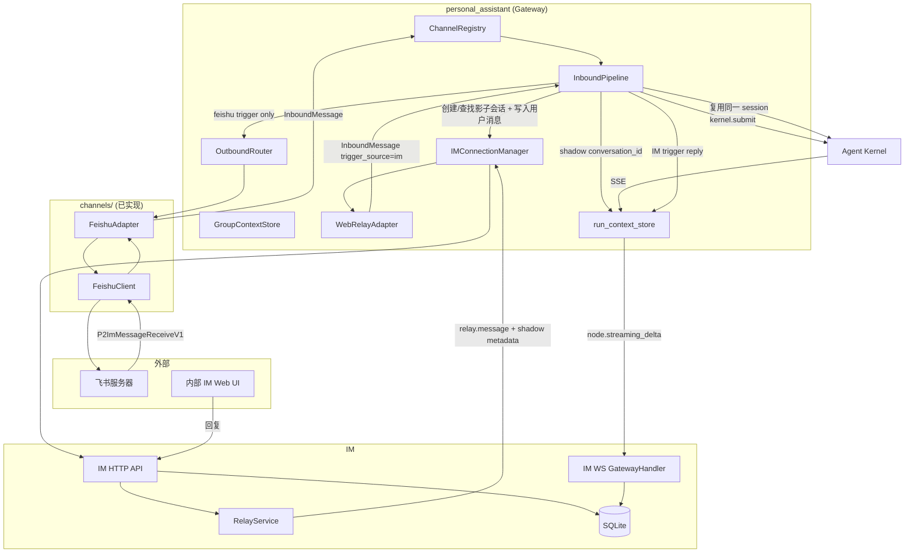
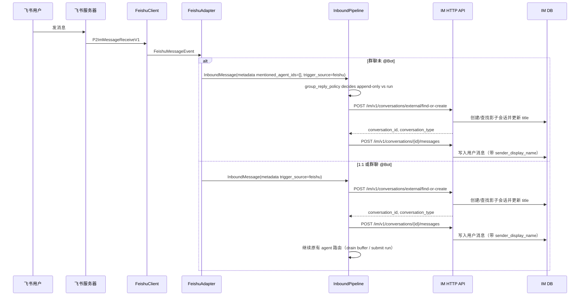
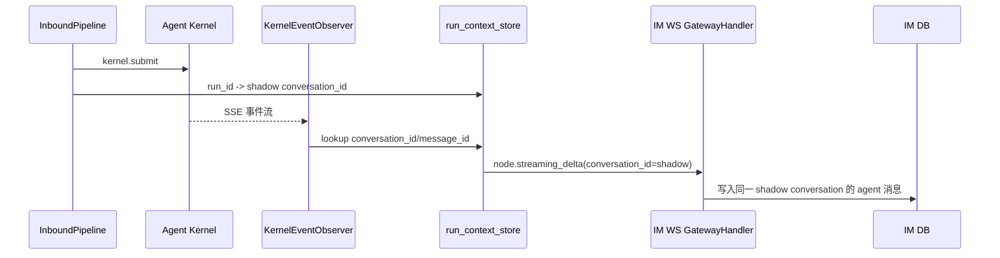
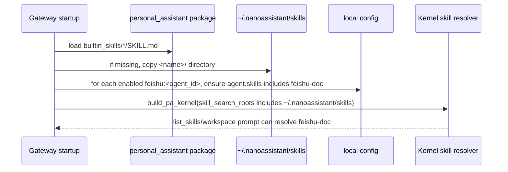
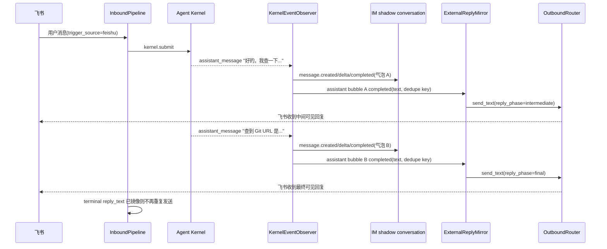

# feat-447: 飞书 channel 支持 — 技术方案

> 对齐: spec.md
>
> Unit branch: `unit/feat-447` (will be created by orchestrator)

## Changelog

## 现状分析

### 涉及范围

- `src/personal_assistant/channels/base.py` — `ChannelAdapter` Protocol、`InboundMessage` / `OutboundMessage` / `ReplyContext`。飞书 adapter 已实现，只读不改。
- `src/personal_assistant/channels/feishu_client.py` — 飞书 SDK 封装（WS 接收、REST 发送、reaction、错误分类）。M12 需要保留 mention-only 消息的可见内容，不能在剥离 mention placeholder 后把 `@nano` 变成空文本。
- `src/personal_assistant/channels/feishu_adapter.py` — 飞书消息收发 adapter（1:1 DM、群聊 @Bot、history buffer、ack reaction）。M12 需要证明飞书群所有消息（含未 @）都能进入 adapter；如果 Lark app 只订阅 @Bot 事件，应启动/验收失败而不是静默降级。
- `src/personal_assistant/gateway/inbound_pipeline.py` — 入站消息处理、agent 路由、群聊 mention 门控、GroupContextStore buffer。已有 `_resolve_sender_label` 从 `metadata.sender_display_name` 取发送者名字；M7 需要新增 IM sync hook、`sync_only` 入站语义、影子 group gate 前注入/绕过和跨入口 session key 归一；M11 需要让外部触发 run 的每个用户可见 assistant 气泡按完成边界镜像回外部 channel，而不是只发送 terminal `reply_text`；M12 需要让飞书群未 @ 背景消息复用内部 IM 群聊已有的 group-context 语义。
- `src/personal_assistant/gateway/outbound_router.py` — 当前只按 `ReplyContext.channel_name` 取 adapter 并发送；M7 需要确认 per-run `reply_context` 是唯一出站锚，避免 IM 触发的 run 复用飞书 reply target；M11 需要支持 `reply_phase`/幂等键等元数据，避免中间回复、最终回复重复发送。
- `src/personal_assistant/gateway/session_keys.py` — `build_session_key` 当前使用 `channel_name:external_chat_id:agent_id`，而 `web_relay` 的 `external_chat_id` 是 IM conversation_id；M7 需要优先用 relay metadata 回环的外部身份生成 session key。
- `src/IM/domain/models.py` — `Conversation` 无外部 channel 来源标记；`Message.sender` 是 `Actor`，`Actor.display_name` 已存在但当前未持久化到 `messages` 表。
- `src/IM/infra/db.py` — `conversations` 表缺 `external_source` / `external_chat_id`；`messages` 表缺 `sender_display_name`。
- `src/IM/infra/repositories.py` — `ConversationRepository.create_conversation` 和 `MessageRepository.create_message` 需要扩展新字段；M11 需要让外部同步写入的用户消息产生前端可插入的 live `message.created` 事件，而不是只产生 delivery/progress 事件。
- `src/IM/api/ws/event_types.py` — `message.created` payload 当前不携带 `sender_display_name`。M11 需要补齐外部发送者名字，避免 live 插入时先显示 UUID、刷新后才显示正确名字。
- `src/IM/api/routes/web_im.py` / `src/IM/api/routes/messages.py` — IM conversation/message REST API 实际所在文件，需要新增外部 channel 会话 find-or-create 接口，并支持 `sender_display_name`；M11 需要区分浏览器自己 POST 的乐观插入与外部 channel 服务端写入的 live 插入。
- `src/IM/application/relay_service.py` — IM relay payload 的生产源；M7 需要在 `enqueue_message_relay` metadata 中带回影子会话的 `external_source` / `external_chat_id` / `agent_id` / `conversation_type` / `trigger_source`。
- `src/IM/ws/gateway_handler.py` — agent streaming delta 的 `turn_start` 现状会在 `conversation_id=""` + `to_user_id` 时懒创建普通 direct chat；M7 需要让外部 channel run 使用已创建的 shadow conversation_id，不再走 lazy direct。
- `src/IM/application/web_im_service.py` — 需要新增外部 channel 会话创建/查找业务方法。
- `src/IM/frontend/src/features/chat/v2/chat-stream-reducer.ts` / `chat-types.ts` — 当前打开会话只把 `message.created` 当作新气泡插入，`message.sent` 仅驱动侧边栏刷新；M11 需要保证外部 channel 用户消息不刷新也能进入当前消息列表，并带正确 display name。
- `src/personal_assistant/channels/web_relay_adapter.py` — IM relay 入站转换点；M7 需要从 relay metadata 设置外部身份、`trigger_source=im` 和 `conversation_type`，并避免把 IM conversation_id 当 kernel session identity。
- `src/personal_assistant/main.py` — Gateway 启动、channel 注册、生命周期 callback、`run_context_store` 注入。M7 需要把 shadow conversation_id 写入 run context，并禁止外部 run 在 shadow 创建失败时懒建普通 direct chat。
- `src/personal_assistant/config/local_store.py` — 配置解析与校验；M7 需要补充 owner 飞书 open_id 配置（用于 IM 显示「你」）；M10 需要保证飞书绑定 agent 能启用内置 `feishu-doc` skill。
- `src/personal_assistant/builtin_skills/feishu-doc/SKILL.md` — M10 新内置 skill 源位置。历史 `skills/feishu-doc.md` 是 flat repo 文件，不符合 `SkillRegistry` 的 `*/SKILL.md` 发现模型，也不会随 Python package 稳定安装。
- `src/personal_assistant/builtin_skills/` package data — M10 需要纳入 `pyproject.toml` 包数据，否则 pip 安装后的 Gateway 找不到内置 skill 源。
- `~/.nanoassistant/skills/feishu-doc/SKILL.md` — Gateway 启动时安装到用户运行态全局 skill root，供所有 PA agent discovery 使用；缺失才复制，不覆盖用户改过的同名 skill。

### 既有约束

- Gateway 只经 `agent.sdk` 持有内核，禁止 import 内核内部。
- `coding_cli` / `personal_assistant` 只能 import `agent.sdk`，禁止 import `agent.core` / `agent.platform`。
- IM 不调用 agent，只与用户和 personal_assistant 交互。
- channel adapter 是进程本地的，start/send/stop 是同步接口。
- 配置统一走 `~/.nano-assistant/config.yaml`。
- 在 worktree 内起任何监听端口的服务必须分配空闲端口并 kill 自己起的进程。

### 可复用能力

- **`ChannelAdapter` Protocol + FeishuAdapter/FeishuClient** — 飞书消息收发已完成。**用**。
- **`GroupContextStore`** — 群上下文 buffer。**用**。
- **`InboundPipeline` + `OutboundRouter`** — Gateway 核心消息处理。**用**，并扩展 IM 同步 hook。
- **IM `messages.py` REST API** — 已有创建消息接口，支持 `sender` actor-first payload。**扩展**以透传 `sender_display_name`。
- **IM `gateway_handler.py` lazy conversation 创建** — `_handle_streaming_delta` 的 `turn_start` 在 `conversation_id=""` 且 `to_user_id` 存在时会创建 direct chat。**扩展**为支持外部 channel 影子会话的预创建/查找。
- **kernel event observer (`node.streaming_delta`)** — agent 输出同步到 IM 已工作（M1 后修复）。**用**。
- **IM user-stream (`conversation_events` -> browser WS)** — agent 气泡通过 EventBridge 写 `message.created` / `message.delta` / `message.completed`，前端当前打开会话能实时追加；普通 `MessageRepository.create_message` 路径主要写 `message.sent` / `message.delivered`，只能驱动侧边栏/状态，不能作为当前会话插入事件。M11 需要补一个 canonical live insert 事件给外部同步用户消息。
- **Gateway kernel event stream** — 当前 run 的 `assistant_message` 事件经 observer 同步到 IM；`OutboundRouter` 只在 terminal 后发送最后一个 `reply_text`。`_on_other_event` 只处理非当前 run 的后台/跨会话输出。M11 需要新增“用户可见 assistant 气泡完成即镜像外部 channel”的路径。
- **内部 IM 群聊 group context** — 已有能力是“不 @ agent 的群消息也进入 group buffer，后续 @agent 时作为 `[sender] text` 注入 LLM context”。M12 要求飞书群聊走同一语义，不能另外做一套只看 @Bot 消息的外部群上下文。
- **SkillRegistry 目录模型** — 现有发现逻辑扫描每个 skill root 下的 `*/SKILL.md`，并由 PA 注入 `<workspace>/.nanoassistant/skills`、`~/.nanoassistant/skills`、compat roots。M10 沿用这个模型，不新增 repo 根目录 `skills/` 搜索根。

### 相关历史

- M1 `feat-447-M1`：飞书消息收发、多 Bot 路由、ack reaction、半边对话同步（仅 agent 回复）。
- M4/M5/M6：config 一致性、ack reaction、DM receive_id_type、重试计数器分离、registry 必填 group_context_store。
- `docs(feat-447): 补全外部 channel 同步到内部 IM 的 spec`：spec 更新，要求外部 channel 用户消息同步到 IM、群聊影子 group、发送者名字显示、按触发源路由 agent 回复、同一 kernel session 跨入口复用。

### 当前 live smoke 暴露的根因

- **飞书只收到最终回复，不收到 IM 中间气泡**：当前 run 的 `assistant_message` 事件只进 `kernel_event_observer`，因此 IM 能实时显示“好的，我查一下当前 worktree 对应的 Git URL。”这类中间气泡；外部 channel 回写则在 `_await_terminal_run_async` 结束后只取最后一个 `reply_text` 调 `OutboundRouter.send_text`。`_on_other_event` 的外部发送分支只处理非当前 run 的后台事件，不处理当前飞书消息触发 run 的中间 assistant 气泡。
- **IM 不刷新看不到飞书用户消息**：外部同步用户消息走 `POST /im/v1/conversations/{id}/messages`，最终落到 `MessageRepository.create_message` 的 `message.sent` / `message.delivered` 事件；前端当前会话 reducer 只把 `message.created` 当作新气泡插入，`message.sent` 仅触发侧边栏重拉。因此 DB 里已有消息，刷新历史能看到；但 live 打开的聊天面板不会追加。
- **飞书群未 @ 消息没有进入 LLM context**：当前 live DB 和 `group_context_buffer.sqlite3` 都没有未 @ 的“你会数学吗”，说明这类消息没有成功进入“写 IM + append GroupContextStore”的共享路径。设计上必须把“飞书平台是否投递未 @ 群消息”作为启动/验收前置；只收到 @Bot 事件时无法复用内部 IM 群聊上下文能力。
- **飞书 @ 被从正文和 LLM context 中删掉**：`FeishuClient._parse_feishu_event` 当前把 mention placeholder 从正文中剥离，导致 `@nano hi` 进入 IM / kernel 时只剩 `hi`，纯 `@nano` 甚至变成空串。这把“mention 检测”错误地做成了“内容改写”。内部 IM 群聊的既有语义是保留用户可见 mention 内容（wire `<mention/>` 或渲染为 `@DisplayName`），同时用结构化 metadata 做 gate；飞书应对齐这条语义。
- **纯 @Bot 消息在 IM 中消失**：因为 mention 被删后 `event.text` 为空，shadow sync 调 IM `create_message` 触发“message must include content or attachments”约束，日志里对应 `400 Bad Request`，所以内部 IM 没有该用户消息。

## 架构总览

**Before**：Gateway 飞书 channel 已能收发消息，agent 回复通过 `node.streaming_delta` 懒创建 direct chat 同步到 IM，但 IM 侧没有用户原始消息，呈现"半边对话"。

**After**：外部 channel 在 IM 中有独立的影子会话（1:1 为 `direct`，群聊为 `group`），用户消息完整同步到 IM；agent 回复按触发源路由——飞书触发的回复同时回写飞书和 IM，IM 触发的回复只留在 IM；同一 kernel session 跨入口复用，保证上下文连续。



## 关键决策

### 决策 1: 飞书事件连接方式

**选了 WebSocket 长连接模式**。

- **理由**: Gateway 跑在用户本机（NAT 后面），无公网 IP。WebSocket 由 Bot 主动连飞书服务器，零配置开箱即用。
- **拒绝**: Webhook 模式——需要公网 HTTPS 端点。
- **风险**: Gateway 重启时短暂断连，飞书 SDK 自动重连。

### 决策 2: 多 Bot 配置模型

**选了 `channels` 列表中每个飞书 Bot 作为一个独立 entry，name = `feishu:<agent_id>`**。

- **理由**: channel registry key、adapter name、agent 路由三者统一。
- **拒绝**: `channels.feishu.accounts` 子列表——冗余字段。
- **风险**: 一个 agent 只能绑一个飞书 bot。

### 决策 3: 云文档操作与内置 skill 分发方案

**选了 feishu-cli/lark-cli 作为云文档操作路径，并把 `feishu-doc` 做成 PA 包内内置 skill，启动时安装到用户全局 skill root**。

- **理由**: 飞书官方 CLI 封装 API + OAuth，agent 有 shell 能力即可调用；内置 skill 属于 PA 产品能力，不属于某个单独 agent workspace。包内资源保证新安装用户有源文件，启动安装到 `~/.nanoassistant/skills` 保证运行时 discovery 可见。
- **拒绝**: 自建飞书 doc tools。
- **拒绝**: repo 根目录 `skills/feishu-doc.md` flat 文件。它不符合 `SkillRegistry` 的 `*/SKILL.md` 形态，pip 安装后也不保证存在。
- **拒绝**: 给 PA 增加 repo 根目录 `skills/` 搜索根。Gateway 运行不应依赖当前 cwd 是源码仓，也不应把开发仓内容混入用户运行态。
- **实现要点**:
  - 内置源形态固定为 `src/personal_assistant/builtin_skills/feishu-doc/SKILL.md`；如需参考资料，放 `src/personal_assistant/builtin_skills/feishu-doc/references/`。
  - `pyproject.toml` 必须把 `personal_assistant/builtin_skills/**` 纳入 package data。
  - Gateway 启动 `build_runtime()` 早期执行 built-in skill bootstrap：扫描包内 `builtin_skills/*/SKILL.md`，目标为 `~/.nanoassistant/skills/<skill-name>/SKILL.md`。
  - 目标不存在时复制整个 skill 目录；目标存在时默认不覆盖，避免覆盖用户本地改动。后续升级如需覆盖，另设 manifest/version 机制，本 unit 不做。
  - 新装用户默认可用：未显式配置 skills 的 agent 应按“全部可发现 skills”语义解析；显式配置了 skills 的飞书绑定 agent，Gateway 启动时自动补入 `feishu-doc` 并写回本地 config，避免“飞书 channel 可聊但不能做云文档”。
  - reviewer 验收不能只读包内文件，必须证明运行中的 agent session 能发现 `feishu-doc`，并可从真实飞书入站触发该能力。
- **风险**: 依赖本机 `lark-cli`/`feishu-cli` OAuth；skill 存在不等于 CLI 已授权，未授权时必须按 spec 返回授权指引。

### 决策 4: Kernel session identity 与 channel 路由身份分离

**选了 kernel session key 统一基于 `{external_source}:{external_chat_id}:{agent_id}`，channel_name 仅用于 outbound 路由**。

- **理由**: spec 要求飞书入口和 IM 影子会话入口复用同一 kernel session。现状 `build_session_key` 使用 `{channel_name}:{external_chat_id}:{agent_id}`，导致飞书入口（`channel_name=feishu:<agent_id>`）与 IM relay 入口（`channel_name=web_relay`，`external_chat_id=IM conversation_id`）生成不同 key，无法复用 session。改用外部 channel 身份（external_source + external_chat_id）作为 session identity 后，两入口只要指向同一外部 chat，就能命中同一 session。
- **拒绝**: 维持现状 channel_name 参与 session key — 跨入口上下文连续验收必失败。
- **实现要点**:
  - `InboundMessage.metadata["external_source"]` 显式携带 `"feishu"`；IM relay 从影子会话 metadata 中回环相同的 `external_source` / `external_chat_id` / `agent_id`。
  - `session_keys.build_session_key` 改为优先用 `metadata["external_source"]:metadata["external_chat_id"]:agent_id` 拼接；只有没有外部身份 metadata 的普通 channel 才回退现有 `{channel_name}:{message.external_chat_id}:{agent_id}`。
  - `web_relay` 的 `message.external_chat_id` 继续表示 IM conversation_id，仅用于 IM delivery / reply_context，不得参与外部 channel kernel session identity。
  - `channel_name` 仍留在 `build_reply_context` 中，作为 outbound 路由身份（飞书 adapter 还是 web_relay adapter）。
  - 新增 `session_keys.build_external_session_key(external_source, external_chat_id, agent_id)` 供需要显式构造的场景使用；同一 external identity helper 也用于 group buffer key，避免 session 连续但 buffer 断裂。

### 决策 5: 群聊未 @ 消息的 history buffer 单一 owner

**选了未 @ 群聊消息统一由 InboundPipeline 负责 buffer 和 IM 同步，FeishuAdapter 不再本地 buffer**。

- **理由**: 当前 FeishuAdapter 未 @ 分支只调用 `_buffer_group_message` 不进 Pipeline；若 M7 要同步未 @ 消息到 IM，必须让 Pipeline 看到这条消息。若 adapter 既 buffer 又送 Pipeline，会造成下一次 @ 时上下文重复。统一由 Pipeline 作为唯一 owner，adapter 只负责把消息原样交给 Pipeline，Pipeline 决定是否 buffer、是否同步到 IM、是否触发 agent。
- **拒绝**: adapter 本地 buffer + 独立 sync hook — 同步和上下文两个职责跨 adapter/pipeline 重叠，未来新增 channel 会重复踩坑。
- **实现要点**:
  - FeishuAdapter 对平台实时投递的群消息统一生成 `InboundMessage` 并调用 `_on_inbound`；@Bot 写入 `mentioned_agent_ids=[agent_id]`，未 @Bot / `@所有人` 写入 `mentioned_agent_ids=[]`。adapter 不再本地 `_buffer_group_message`，也不把当前未 @ 消息强制标记为 `sync_only`。
  - `sync_only` 是正式入站语义，但只用于历史补拉 / 纯背景注入这类“不应触发当前 run”的消息：进入 Pipeline、解析 agent、同步 IM、写 GroupContextStore；不分配 kernel session、不进入 queue、不触发 reply。
  - GroupContextStore key 与 kernel session identity 同口径：有 `metadata["external_source"]` / `metadata["external_chat_id"]` 时使用 `external_source:external_chat_id:agent_id`；普通 channel 回退现有 `{agent_id}:{channel_name}:{external_chat_id}`。这样 Feishu 背景 buffer 能被后续 Feishu @ 触发，也能被 IM shadow group 入口触发 drain。
  - 当前群消息是否触发 run 由 Pipeline 的 `group_reply_policy` 判定：`MENTION` 下未 @ 消息只同步并进入上下文；`ALWAYS` 下未 @ 消息也走响应路径，并用同一个 external group key drain buffer。

### 决策 6: 外部 channel 会话同步到内部 IM

**选了外部 channel 用户消息同步到 IM，agent 回复按触发源决定是否回写外部 channel**。

- **理由**: spec 明确要求用户在 IM 影子会话里的消息只进 kernel 上下文、不回写原 channel，否则飞书侧会看到 agent 突然回复的"灵异对话";外部 channel 用户消息必须出现在 IM 中。同一 kernel session 跨入口复用，保证上下文连续。
- **拒绝**: 完整双向镜像（IM 用户消息也回写外部 channel）——违反用户新明确的体验约束。
- **实现要点**:
  - Gateway 在 `InboundPipeline.handle_inbound` 早期调用 IM HTTP API 创建/查找外部 channel 影子会话并写入用户消息。
  - IM 同步必须是**非阻塞 best-effort**：调用超时或异常时捕获并记录，不阻塞飞书主路径，agent 仍正常回复。
  - IM 侧会话带 `external_source` + `external_chat_id` 标记，保持 `direct` / `group` 类型语义。
  - Gateway 拿到 `external/find-or-create` 返回的 `conversation_id` 后，先把 `shadow_conversation_id` 放进当前 `InboundMessage.metadata` / 等效 turn context；`kernel.submit` 后的 lifecycle `accepted` callback 读取它并 seed `run_context_store`。不要在没有 `run_id` 的同步 hook 里直接写 run context。
  - 外部 channel 同步失败时，不得保留 `conversation_id=""` + `to_user_id=owner_user_id` 组合让 IM 懒创建普通 direct chat；应留空/标记 skip，让本轮 agent 回复只回外部 channel，符合"IM 离线暂不同步"。
  - 每个 run 在 `run_context_store` 中记录 `trigger_source`（`feishu` / `im`）和 `shadow_conversation_id`， outbound 阶段只依赖 per-run `reply_context` 决定即时外部出口。

### 决策 7: IM 会话来源标识

**选了在 `conversations` 表新增 `external_source` + `external_chat_id`，不改变现有 `direct` / `group` 类型**。

- **理由**: 语义清楚，1:1 私聊仍映射为 `direct`、群聊映射为 `group`，不破坏 IM 现有分支逻辑。
- **拒绝**: 新增 `external` 类型——需要改 Conversation enum 和多处 switch/case，回归面大。
- **拒绝**: 仅靠 title 区分——IM 无法识别来源，也无法做按 channel 过滤/管理。
- **实现要点**: agent 维度复用现有 `conversations.config_agent_id`，不要新增第二个 `agent_id` 列。`external/find-or-create` request 中的 `agent_id` 是 API 入参，落库到 `config_agent_id`；幂等索引用 `(external_source, external_chat_id, config_agent_id, owner_id)`。

### 决策 8: 外部发送者名字持久化

**选了在 `messages` 表新增 `sender_display_name` 列**。

- **理由**: 外部群成员名字需要随历史记录保留，metadata 透传不持久化会在历史加载时丢失。
- **拒绝**: 给每个外部发送者建 IM 用户——产生脏数据，且 owner 自己也要建 fake 用户才能显示「你」。

### 决策 9: IM 影子会话创建/查找接口

**选了新增专用 POST `/im/v1/conversations/external/find-or-create`**。

- **理由**: 幂等键 `(external_source, external_chat_id, config_agent_id, owner_id)` 明确；API 入参仍叫 `agent_id`，IM 落库时映射到现有 `config_agent_id`。IM 负责去重和 participant 规则，Gateway 不维护 IM conversation_id → session_key 的本地映射。
- **拒绝**: Gateway 自己先查后创——竞态条件下可能重复创建。
- **拒绝**: Gateway 启动时预创建——外部群聊信息（群名、成员）事前未知。
- **补充**: 每次同步消息时都调用该接口，IM 侧命中已有会话时**同步更新 title**（如飞书群名已修改），保持两边会话名一致。
- **身份边界**: Request 体**不含 `owner_id`**。IM 数据面身份取自 Bearer token / `current_user.owner_id`（canonical IM spec 规定），`owner_id` 由 IM 侧派生，不允许请求参数作为信任锚。

### 决策 10: 按触发源路由 agent 回复

**选了 run 级 `trigger_source` 标记 + per-run `reply_context` 与 session key 分离**。

- **理由**: 与现有 IM → Gateway WebSocket relay 机制一致，无需新增 HTTP 接入面；通过 `trigger_source` 区分飞书触发和 IM 触发，避免 IM 主动对话时把回复回写到飞书。
- **拒绝**: Gateway 本地维护反向映射——重启丢失、多实例不共享。
- **拒绝**: IM 直接调 Gateway HTTP dispatch——增加新的集成面。
- **拒绝**: 不区分触发源、所有 IM 影子会话回复都回写外部 channel——违反"IM 主动沟通不回写飞书"的约束。
- **实现要点**:
  - 飞书入口：`trigger_source=feishu`，`reply_context.channel_name=feishu:<agent_id>`，agent 最终文本经 OutboundRouter 回写飞书；streaming observer 使用 `run_context_store.shadow_conversation_id` 同步到 IM 影子会话。
  - IM 入口：`trigger_source=im`，`reply_context.channel_name=web_relay`，但 `web_relay.send()` 只是记录/测试路径；真实 IM 回复仍由 streaming observer 根据 `run_context_store.conversation_id=shadow_conversation_id` 写回同一 IM conversation，不回写飞书。
  - `session_key` 与 `reply_context` 解耦：session key 只由 `external_source:external_chat_id:agent_id` 决定，保证两入口复用同一 kernel session；reply_context 只决定当次 run 的回复出口。

### 决策 11: Feishu 身份来源不依赖运行态 CLI

**选了 `botOpenId` 由 Gateway 通过 app 凭证探测并缓存；`ownerOpenId` 不做运行态自动推断**。

- **理由**: Gateway/adapter 是服务运行态，不应调用 `lark-cli` 读取本机用户 OAuth 状态。reviewer 可以用 `lark-cli` 当真实用户制造入站，但运行时代码只使用 Gateway config 中的 app credentials 和 Feishu SDK/OpenAPI。
- **`botOpenId`**: Gateway 启动时用 `settings.appId/appSecret/domain` 探测 bot identity（优先 `/open-apis/bot/v3/info`，fallback application info，等价 openclaw 的启动 probe 思路），成功后写回本地 config 作为缓存；缺失不阻塞启动，但群聊 @Bot 精确识别会降级。
- **`ownerOpenId`**: 不再自动推断。它仅是兼容性缓存/可选配置；缺失时 Feishu 入站消息使用 Feishu sender display name，不强制显示为「你」。
- **拒绝**: 要求用户手填 `botOpenId`——和 openclaw 的启动探测思路不一致，且 reviewer 容易填错 app 对应的身份。
- **拒绝**: Gateway 调 `lark-cli auth status` 自动填 `ownerOpenId`——把验收工具耦合进产品运行态，且会把 reviewer 机器上的默认 CLI app 状态误当作 Gateway 当前 app。
- **拒绝**: IM 绑定飞书账号后动态查询——增加 IM 侧账号绑定流程，超出本期范围。
- **影响**: `sender_display_name` 优先使用 Feishu 事件里的发送者显示名；只有已有 `ownerOpenId` 缓存且匹配 sender open_id 时才显示 `"你"`。

### 决策 12: IM 群聊影子会话自动注入 @agent

**选了 Gateway 收到 IM 群聊影子会话的用户消息后，在 mention gate 之前自动注入 `@<agent_id>`（或等效 mention 标记）**。

- **理由**: 外部 channel 群聊中，agent 的群聊提示词依赖 `@Bot` 来确认自己被点名；IM 群聊影子会话里没有真实的 @ 动作，需要 Gateway 侧补一个等效提及，保证 agent 按群聊路径响应。
- **拒绝**: 让 IM 前端强制用户手动 @agent——体验割裂，且影子会话里 agent 是主角，不应要求用户每次 @。
- **限制**: 1:1 影子会话是 direct 类型，不存在群聊门控，不需要注入。
- **实现要点**: 注入必须发生在 `_should_process` 之前（例如在 `WebRelayAdapter` 组装 `InboundMessage` 时补 `metadata["mentioned_agent_ids"]=[agent_id]`，或在 Pipeline 进入 gate 前改写等效 mention 标记）。如果等到构造 kernel parts 时才注入，消息已经被 mention gate 丢弃。
- **relay metadata**: IM relay 消息给 Gateway 时，必须在 metadata 中携带 `conversation_type="group"`，WebRelayAdapter 据此设置 `InboundMessage.is_group=true`。当前 `create_message` 调 `enqueue_relay_all` 未传 conversation type，M7 需要补上。

### 决策 13: 内置 skill 安装与 agent 启用语义

**选了“包内内置源 + 启动时缺失安装 + 飞书绑定 agent 自动启用 `feishu-doc`”**。

- **理由**: `feishu-doc` 是飞书 channel 的产品级能力。新安装用户不能依赖开发仓里的手工文件，也不能要求每个 agent workspace 手工复制一份。
- **拒绝**: 把内置 skill 放到某个 agent workspace。一个 Gateway 可有多个 agent，放到任意一个 agent 下面都会让其他 agent 不可见。
- **拒绝**: 启动时强覆盖 `~/.nanoassistant/skills/feishu-doc`。用户可能已经本地修订过同名 skill，硬覆盖会丢数据。
- **实现要点**:
  - bootstrap 是幂等的、非交互的、启动早期执行；安装失败应让 Gateway 继续启动但记录可见 warning，并在 Feishu 云文档请求时让 agent 给出“本机 skill/CLI 未就绪”的可理解反馈。
  - `feishu-doc` 的启用以运行时 session 能看到为准：`kernel.list_skills(workspace_root)`、IM capabilities、prompt preview 和真实 run 注入的 `<available_skills>` 必须一致。
  - 如果 agent 的 skills 配置为空/未配置，运行时按全部可发现 skills 解析；如果 agent 显式配置了 allowlist 且绑定 `feishu:<agent_id>` channel，Gateway 自动把 `feishu-doc` 加入该 agent 的 skills 并持久化到本地 config。
  - IM 配置中心展示的 skills 候选必须包含安装后的 `feishu-doc`，已启用的 Feishu agent 配置也必须能看到该 skill。

### 决策 14: 外部 channel 回复镜像边界

**选了“每个用户可见 assistant 气泡完成后镜像到外部 channel，terminal final send 只作兜底且不得重复”**。

- **理由**: 用户在飞书触发 run 时，IM shadow 中看到的 assistant 可见文本就是 agent 对这次用户的回复。外部 channel 只发送最后一个 terminal `reply_text` 会漏掉“我先查一下”这类中间气泡，导致飞书和 IM 看到的对话不一致。
- **拒绝**: 把每个 `message.delta` token 都发到飞书。飞书/Lark 文本消息不是流式 patch 语义，token 级发送会刷屏且无法编辑同一消息。
- **拒绝**: 继续只发 terminal `reply_text`。这正是 live smoke 的根因：多段 assistant message 中只有最后一段能到飞书。
- **实现要点**:
  - 建立 `ExternalReplyMirror`（名称不限）作为 Gateway 内部组件，输入为当前 run 的用户可见 assistant 气泡完成事件，输出经 `OutboundRouter` 发给 `reply_context.channel_name` 对应 adapter。
  - 只在 `reply_context.metadata["trigger_source"] == "feishu"` 或等效外部来源时启用；`trigger_source=im` 的 run 只写 IM，不回写飞书。
  - 镜像边界是“assistant 气泡完成”，不是 token delta：IM 中每个最终可见的 assistant message bubble，飞书应收到一条对应文本消息。空文本、`NO_REPLY`、thinking/tool-only 事件不发送。
  - 对同一 run 记录已镜像的 `kernel_message_id` 或 IM `message_id`，terminal 阶段如果最后一个气泡已镜像，不得再用 `reply_text` 发送一次；如果 observer/mirror 不可用，terminal final send 可作为兜底保留。
  - `OutboundMessage.metadata` 增加 `reply_phase="intermediate" | "final"` 与 `reply_dedupe_key`；FeishuAdapter 的 THINKING reaction 删除应绑定 `reply_phase="final"` 或 run terminal，而不是任意第一条外发消息。

### 决策 15: 外部同步用户消息的 live insert 语义

**选了“外部 channel 写入 IM 时发 canonical `message.created` 事件，且 payload 带 sender display name”**。

- **理由**: 当前打开的 IM 会话只能用 `message.created` 插入新气泡；`message.sent` / `message.delivered` 是 delivery/progress 语义，现有前端只用它刷新侧边栏。外部 channel 用户消息没有浏览器本地 optimistic insert，所以必须由后端 live 事件提供完整消息体。
- **拒绝**: 让前端收到 `message.sent` 后重新拉当前会话消息列表。可行但低效、顺序和去重更难，且 `message.sent` payload 当前缺 content / sender display name，不适合作为插入事件。
- **拒绝**: 只依赖刷新历史。它解释了现象，但不满足 spec 的“飞书对话同步到内部 IM”实时体验。
- **实现要点**:
  - 外部 channel 同步写入用户消息后，IM 必须向该 conversation 的参与者 user-stream 广播一条 `message.created`，payload 与 REST `MessageResponse` 对齐到足以直接插入当前会话：`content`、`attachments`、`sender_type`、`sender_user_id`、`sender.display_name` 或 `sender_display_name`、`delivery_status`、`created_at`。
  - 普通浏览器自己发送消息仍可保留乐观插入；如果也收到 `message.created` echo，前端按 `message_id` 去重。
  - `sender_display_name` 必须在 live payload 中可用。外部群 Alice 和 owner 自己的「你」不能等刷新后才修正。
  - `message.sent` / `message.delivered` 可以继续存在用于 delivery status、侧边栏刷新和兼容；但当前会话消息列表的 canonical 新气泡入口是 `message.created`。

### 决策 16: 飞书群聊上下文与内部 IM 群聊语义等价

**选了“飞书群所有用户消息进入同一 GroupContextStore；@Bot 同时保留在正文中，并另用 metadata 做触发信号”**。

- **理由**: 内部 IM 群聊的既有产品语义是：不 @ agent 的群消息也会进入 LLM context，后续 @agent 时 agent 能引用这些背景。飞书群是同一类群聊 channel，不能退化成“只感知 @Bot 那条消息”。
- **拒绝**: 只订阅/处理飞书 @Bot 事件。这样无法知道用户在群里之前说了什么，和内部 IM 群聊行为不一致。
- **拒绝**: FeishuAdapter 自己维护一份私有 history buffer。Gateway 已有 `GroupContextStore` 和 `_build_message_parts` drain 机制；复用它才能让飞书入口和 IM shadow group 入口共享同一背景上下文。
- **拒绝**: 从正文里删除 @Bot 再交给 IM/kernel。@ 是用户消息内容的一部分；删除后 IM 展示、历史、LLM context 都与用户真实输入不一致，纯 @ 还会退化为空消息。
- **实现要点**:
  - Feishu channel 启动时必须具备“接收群聊普通消息”的平台能力/事件订阅；如果当前 Lark app 只投递 @Bot 消息，Gateway 应记录明确 warning/health 状态，reviewer 不能把这种配置验收为通过。
  - 平台实时投递的未 @Bot 飞书群消息统一生成 `InboundMessage(conversation_type=group, mentioned_agent_ids=[], external_source=feishu, external_chat_id=...)`，进入 shadow sync；`group_reply_policy=MENTION` 时 Pipeline 只写 `GroupContextStore.append`，`group_reply_policy=ALWAYS` 时触发 run 并回飞书。
  - @Bot 或 `group_reply_policy=ALWAYS` 触发的飞书群消息使用同一个 external group key drain buffer，构造给 kernel 的 parts 必须包含此前背景消息的 `[sender] text` 前缀。
  - FeishuClient 解析 mentions 时只做识别和规范化，不删除用户可见正文。飞书 placeholder 应转换为 IM 已有 mention wire 形态（优先 `<mention type="agent" target_id="<agent_id>"/>`）或可读文本 `@nano`；同一份规范化正文用于 IM 持久化、live 展示、GroupContextStore 和 kernel current message。
  - `@所有人` / `@all` 等非目标 Bot mention 不得填入 `mentioned_agent_ids`，也不得触发 agent 回复；它们只作为普通群消息内容进入 IM 展示和群上下文。
  - `mentioned_agent_ids` / `feishu_mentions` / `mention_only` 是额外 metadata，只服务 gate、路由和诊断，不改变 `message.text` 的用户可见内容。
  - 纯 `@Bot` 是合法触发消息：规范化正文至少包含该 mention（如 `<mention .../>` 或 `@nano`），用于 IM 持久化、live 展示和 kernel current message。不得把它作为空消息写入 IM 或丢弃。
  - reviewer 必须验证“未 @ 背景消息 -> 纯 @Bot 触发”路径：用户先在飞书群说“你会数学吗”（不 @），然后只发 `@nano`，agent 应能基于前一条背景回应，而不是把 `@nano` 当成无上下文测试消息。

### 外部 shadow session identity 模型

这四个身份必须分开，worker 不得用其中一个字段同时承担多种职责：

| 身份 | 字段 | 作用 | 不做什么 |
|---|---|---|---|
| kernel session identity | `external_source + external_chat_id + agent_id` | 决定同一外部对话跨飞书入口 / IM 影子入口是否复用同一 kernel session | 不决定回复发到哪里 |
| shadow conversation identity | `shadow_conversation_id`（IM conversation id） | 决定 agent streaming delta 和用户消息写入哪个 IM 会话 | 不参与 kernel session key |
| per-run reply target | `ReplyContext(channel_name, target_chat_id, metadata.trigger_source)` | 决定本次 run 的最终文本是否回写飞书或只留 IM | 不作为持久 session identity |
| group buffer identity | `external_source + external_chat_id + agent_id`（外部 channel）或旧 `{agent_id}:{channel_name}:{external_chat_id}`（普通 channel） | 决定未 @ 群聊上下文写入和后续 drain 是否命中同一 buffer | 不决定 kernel session id 或回复出口 |

飞书入口的 run 同时拥有：`session_key=feishu:<feishu_chat_id>:<agent_id>`、`group_buffer_key=feishu:<feishu_chat_id>:<agent_id>`、`shadow_conversation_id=<im_conv_id>`、`reply_context.channel_name=feishu:<agent_id>`。IM 影子入口的 run 拥有同一个 `session_key`、同一个 `group_buffer_key` 和同一个 `shadow_conversation_id`，但 `reply_context.channel_name=web_relay` / `trigger_source=im`。这样才能同时满足"上下文连续"、"未 @ 群聊背景跨入口可用"和"IM 触发不回写飞书"。

### 1. 外部 channel 用户消息同步到 IM



### 2. Agent 回复同步到 IM（复用现有路径）



### 3. IM 影子会话消息进入 kernel 上下文（回复按触发源路由）

```mermaid
sequenceDiagram
    participant IMUI as 内部 IM Web UI
    participant API as IM HTTP API
    participant WS as IM WS GatewayHandler
    participant GWS as Gateway WS 客户端
    participant WRA as WebRelayAdapter
    participant PIPE as InboundPipeline
    participant K as Agent Kernel
    participant OBS as KernelEventObserver

    IMUI->>API: 在影子会话发消息
    API->>WS: relay message
    WS->>GWS: 转发用户消息 + shadow metadata(trigger_source=im, external_source, external_chat_id, agent_id, conversation_type)
    GWS->>WRA: accept_relay(payload)
    WRA->>PIPE: InboundMessage(channel_name=web_relay, external_chat_id=IM conversation_id, metadata 含 external_source/external_chat_id/agent_id/trigger_source)
    PIPE->>PIPE: gate 前注入/标记 mention; session_key=metadata external_source:external_chat_id:agent_id
    PIPE->>K: 复用同一 kernel session
    K-->>OBS: SSE 事件流
    OBS-->>WS: node.streaming_delta(conversation_id=同一 IM 影子会话)
    WS-->>IMUI: 回复只出现在 IM，不回写飞书
```

### 4. 内置 skill bootstrap



这条路径回答“新安装用户为什么能用”：内置源随 package 发版，运行态目录由 Gateway 首次启动补齐，Feishu 绑定 agent 的 skills 配置自动包含 `feishu-doc`，真实 session 才能把该 skill 注入 prompt。

### 5. 外部触发 run 的可见回复镜像



这条路径的核心是不把“当前 run 的最终 `reply_text`”当成唯一外部出口。IM 中用户能看到的每个 assistant 文本气泡，飞书也应按消息边界收到一次；但 token delta、thinking、tool 状态不外发。

### 关键数据结构

**InboundMessage 扩展字段**（Gateway → IM 同步用户消息时）：
- `metadata["sender_display_name"]` — 发送者显示名（owner 自己为 `"你"`）
- `metadata["external_source"]` = `"feishu"`
- `metadata["external_chat_id"]` — 飞书会话标识
- `metadata["agent_id"]` — 对应 agent
- `metadata["conversation_title"]` — 预计算的会话名（`agent名 · channel名` 或 `agent名 · 群名 · channel名`）
- `metadata["chat_name"]` — 飞书群名（群聊时）
- `metadata["is_group"]` — 是否群聊
- `metadata["sync_only"]` — `true` 表示该消息只同步到 IM / 进入 GroupContextStore，不触发 agent（用于未 @ 的群聊上下文消息）
- `metadata["trigger_source"]` — 触发来源，`"feishu"` 或 `"im"`，决定 agent 回复是否回写外部 channel
- `metadata["mention_only"]` — `true` 表示外部群消息只有 @Bot，没有额外正文；这是合法触发消息，不得按空消息丢弃
- `metadata["normalized_mentions"]` — mention 的显示文本、open_id、target agent id 列表；只作为结构化补充，不能替代或删除正文中的 @ 内容

**Session / ReplyContext 新约定**:
- `session_key = f"{external_source}:{external_chat_id}:{agent_id}"` — 跨入口复用同一 kernel session。
- `group_buffer_key = f"{external_source}:{external_chat_id}:{agent_id}"` — 外部 channel 群聊 buffer key；普通 channel 没有 external identity 时回退旧 key。
- `shadow_conversation_id` — IM conversation id，只用于 IM 展示/streaming delta 目标，不参与 session key。
- `reply_context.channel_name` — 当次 run 的最终文本出口：`feishu:<agent_id>` 或 `web_relay`；对 `web_relay` 来说生产 IM 回复仍走 observer，不依赖 adapter `send()`。
- `reply_context.metadata["trigger_source"]` — 与 `run_context_store` 中的 `trigger_source` 一致，OutboundRouter 可据此二次确认出口（防御性）。

**OutboundMessage / ExternalReplyMirror 扩展**:
- `OutboundMessage.metadata["reply_phase"]` — `"intermediate"` 表示 run 尚未 terminal 的用户可见 assistant 气泡；`"final"` 表示本 run 最后一条或 terminal 对应气泡。adapter 不得把任意 outbound 都当作 run 完成。
- `OutboundMessage.metadata["reply_dedupe_key"]` — 推荐使用 `run_id:kernel_message_id` 或 `run_id:im_message_id`，用于 Gateway 侧记录“此气泡已镜像外部 channel”，terminal fallback 不得重复发送。
- `ExternalReplyMirror` 状态 — 每个 active run 记录 `{reply_context, mirrored_keys, last_mirrored_text_or_key}`。run terminal 后清理，避免跨 run 泄漏。
- Feishu THINKING reaction lifecycle — Gateway `accepted` lifecycle 代表消息已进入真实 agent run，此时对带 `feishu_message_id` 的外部消息 add reaction；adapter 可对 DM/@Bot 做提前 ack，但必须幂等。中间 `reply_phase=intermediate` 不强制删除 reaction；`reply_phase=final` 或 run terminal 后删除，避免“已发送进度提示但还在查”时 loading 状态提前消失。

**IM `conversations` 表新增列**：
- `external_source TEXT` — 外部 channel 来源，如 `"feishu"`
- `external_chat_id TEXT` — 外部 channel 的 chat id
- agent 维度复用现有 `config_agent_id TEXT`，不新增第二个 agent id 字段
- 联合索引：`(external_source, external_chat_id, config_agent_id, owner_id)` 用于幂等查找（`owner_id` 由 IM 当前用户派生）

**IM `messages` 表新增列**：
- `sender_display_name TEXT` — 发送者显示名

**IM live message.created payload 扩展**：
- 外部同步用户消息写入后必须广播 `message.created`，payload 至少包含 REST `MessageResponse` 插入当前会话所需字段：`message_id`、`conversation_id`、`content`、`attachments`、`sender_user_id`、`sender_type`、`sender_display_name` 或等效 `sender.display_name`、`delivery_status`、`created_at`。
- `message.sent` / `message.delivered` 继续保留 delivery 语义，但不作为当前会话新气泡的唯一 live 信号。

**IM API 新增接口**：
- `POST /im/v1/conversations/external/find-or-create`
  - Request: `{ external_source, external_chat_id, agent_id, title, is_group, participant_ids, metadata }`（**不含 `owner_id`**，身份由 Bearer token/current_user 派生）
  - Response: `{ conversation_id, conversation_type, title }`

**IM → Gateway WebSocket relay 扩展字段**（影子会话消息）：
- `metadata["trigger_source"]` = `"im"` — 标识消息来自内部 IM，Gateway 收到后不回写外部 channel
- `metadata["external_source"]` / `metadata["external_chat_id"]` / `metadata["agent_id"]` — 复用同一 kernel session；注意 `external_chat_id` 是飞书 chat id，不是 IM conversation id
- `metadata["conversation_type"]` = `"group" | "direct"` — WebRelayAdapter 据此设置 `InboundMessage.is_group`
- 群聊影子会话中，Gateway 解析到 `conversation_type=group` 时，在 `_should_process` 之前自动补 `mentioned_agent_ids=[agent_id]` 或等效 `@<agent_id>`，模拟外部群聊中的 @Bot 触发

**run_context_store 外部 channel 扩展**：
- `conversation_id = shadow_conversation_id` — `external/find-or-create` 成功时写入；observer 的 `turn_start` 直接使用它。
- `to_user_id = ""` — 外部 channel run 不走 lazy direct 创建；shadow 创建失败时 `conversation_id` 和 `to_user_id` 都留空/标记 skip，避免污染普通 direct chat。
- `trigger_source = "feishu" | "im"` — 记录本 run 来源，供 lifecycle/debug/防御性路由判断。
- `kernel_session_id` / `agent_id` 维持现有含义。
- 写入时机：IM sync hook 在 submit 前把 `shadow_conversation_id` / `trigger_source` 放入 message metadata 或等效 turn context；lifecycle `accepted` callback 获得 `run_id` 后再 seed `run_context_store`。

**FeishuMessageEvent 扩展**：
- `sender_display_name: str` — 从飞书事件 `sender.name` 解析
- `raw_text: str` — 飞书原始文本，保留 mention placeholder 解析前的信息，便于诊断和 fallback
- `mention_only: bool` — 文本去除 mention 后为空且 mentions 非空
- `text` — 规范化后的用户可见正文。mention placeholder 被替换为 IM mention wire（优先）或 `@DisplayName` 文本，但不得被删除；mention-only 时正文仍至少包含该 mention，避免 IM `create_message` 400，也让 kernel 当前消息不是空串。
- `mentions` — 保留结构化 mention 实体，FeishuAdapter 基于它填 `mentioned_agent_ids`；它不能驱动正文删减。

**FeishuClient 扩展**：
- 新增 `get_chat_name(chat_id: str) -> str` 调用飞书 `GET /open-apis/im/v1/chats/{chat_id}` 获取群名。
- 新增 built-in skill bootstrap helper，输入为包内 `builtin_skills` 资源目录，输出为用户全局 skill root `~/.nanoassistant/skills/<name>/`；复制策略为“缺失复制，存在不覆盖”。
- `feishu-doc` skill 文件必须使用标准目录形态：`<skill-name>/SKILL.md`。历史 flat 文件 `skills/feishu-doc.md` 迁移后删除或不再作为运行态来源。

## 契约层增量 (delta-spec)

- kernel: no spec delta
- im: `specs/im/spec.md` — ADDED:
  - **Requirement: 外部 channel 影子会话** — IM 支持创建带 `external_source` / `external_chat_id` 标记的会话，1:1 映射为 `direct`、群聊映射为 `group`。
  - **Requirement: 外部 channel 消息写入** — IM 支持写入来自外部 channel 的用户消息，并持久化 `sender_display_name`。
  - **Requirement: 外部 channel 用户消息实时出现** — 外部 channel 用户消息写入 IM 后，打开中的 IM shadow 会话必须不刷新即可出现该用户气泡，并显示正确发送者名字。
  - **Requirement: 外部 channel mention-only 消息可见** — 外部群里只有 @Bot、无额外正文的消息也必须作为非空用户消息写入/实时显示。
  - **Requirement: 外部 channel 会话元数据回环** — IM 通过 WebSocket relay 把影子会话的用户消息、`external_source` / `external_chat_id` / `agent_id` / `trigger_source` / `conversation_type` 转发给 Gateway。
- gateway: `specs/gateway/spec.md` — ADDED/MODIFIED:
  - **Requirement: 飞书对话同步到内部 IM**（替换原 MVP 条目） — Gateway 把来自外部 channel 的用户消息、agent 回复写入内部 IM 影子会话；用户消息通过 `sync_only` 路径同步，不触发新 run。
  - **Requirement: 按触发源路由 agent 回复** — Gateway 解析 IM 转发的 conversation 元数据与触发来源，session identity、shadow conversation identity 与 per-run reply_context 分离，按触发源决定是否把 agent 回复回写外部 channel。
  - **Requirement: 内置 skills 启动自举** — Gateway 启动时把包内内置 skills 安装到用户全局 skill root，并保证 Feishu 绑定 agent 能发现 `feishu-doc`。
  - **Requirement: 外部 channel 可见回复镜像** — 外部 channel 触发 run 时，IM 中每个用户可见 assistant 文本气泡完成后都镜像回原外部 channel，terminal final send 不重复。
  - **Requirement: 飞书群聊背景上下文等价内部 IM 群聊** — 飞书群未 @ 消息必须进入 shadow IM 和 GroupContextStore，后续 @Bot/纯 @Bot 触发时可被 LLM 引用。
- cli: no spec delta

## 风险与回退

| 风险 | 影响 | 应对 |
|---|---|---|
| IM 侧新增字段需要 DB 迁移 | 旧 DB 无列会报错 | 在 `db.py` 增加迁移函数，启动时自动执行 |
| Gateway 调用 IM HTTP API 失败（离线/超时/错误） | 用户消息同步不到 IM，飞书回复也可能被阻塞 | 同步调用必须加短超时 + 异常捕获并记录，绝不阻塞飞书主路径；失败时降级为"半边对话"，IM 恢复后由用户重新触发同步 |
| 外部 channel run 误走 lazy direct 创建 | agent 回复落到普通直聊而不是 shadow 会话，造成半边/错会话 | `run_context_store` 对外部 channel 只写 shadow conversation_id；shadow 不可用时不写 `to_user_id`，observer 跳过 IM 同步 |
| IM 影子群聊注入晚于 mention gate | 用户在 IM 影子 group 发消息被 `_should_process` 丢弃，无 agent 回复 | relay metadata 必须携带 `conversation_type=group`，Gateway 在 `_should_process` 前补 `mentioned_agent_ids` 或等效 mention |
| relay metadata 缺外部身份 | IM 影子入口生成新 kernel session，或回复误回写飞书 | `RelayService` 是 payload owner，必须从 conversation 外部字段回环 `external_source/external_chat_id/agent_id/conversation_type/trigger_source` |
| GroupContextStore 仍按 channel key | Feishu 未 @ 背景已同步到 IM，但用户在 IM shadow group 追问时 agent drain 不到背景 | `_group_buf_key_for_agent` 外部 channel 优先使用 `external_source:external_chat_id:agent_id`，Feishu 与 IM shadow group 共用同一 buffer key |
| IM shadow schema 出现两个 agent 字段 | 同一外部群多 agent 隔离、RelayService agent snapshot 来源分叉 | 复用现有 `config_agent_id` 作为 shadow 会话 agent 维度，`agent_id` 只作为 API/metadata 名称 |
| FeishuClient 获取群名需要额外 API 权限 | 群聊会话 title 无法生成 | 权限不足时 fallback 到 `agent名 · 群聊 · channel名` |
| botOpenId 探测失败 | 群聊 @Bot 精确识别降级，纯 @Bot 可能不触发 | Gateway 启动日志 warning；检查 appId/appSecret/domain 与 bot capability |
| ownerOpenId 缓存缺失或错误 | owner 自己消息在 IM 不显示「你」 | 不阻塞功能；显示 Feishu sender display name；后续如需强一致需做 IM 账号绑定设计 |
| 内置 `feishu-doc` 只存在于源码仓 | 新安装用户 pip 启动 Gateway 后没有云文档 skill，spec 的“飞书云文档操作”不可用 | 将源文件迁入 `src/personal_assistant/builtin_skills/feishu-doc/SKILL.md` 并纳入 package data；Gateway 启动缺失安装到 `~/.nanoassistant/skills` |
| Feishu 绑定 agent 显式 skills 列表缺 `feishu-doc` | skill 已安装但 session prompt 不注入，用户从飞书要求云文档操作时 agent 不知道能力 | Gateway 启动对 enabled `feishu:<agent_id>` 自动补 `feishu-doc` 并写回本地 config；能力上报与 prompt preview 走同一 resolver 验证 |
| 外部 channel 只发 terminal reply_text | IM shadow 中可见的中间 assistant 气泡不会出现在飞书，用户看到两边对话不一致 | M11 增加 ExternalReplyMirror，以 assistant 气泡完成为外发边界，并用 dedupe key 防止 terminal 重复发送 |
| 中间回复触发 FeishuAdapter 删除 THINKING reaction | agent 仍在查资料/跑工具时飞书 loading 状态提前消失 | OutboundMessage 增加 `reply_phase`，FeishuAdapter 只在 final/terminal 阶段删除 reaction |
| THINKING reaction 只绑在 adapter 的 @Bot 分支 | `group_reply_policy=ALWAYS` 下未 @ 的真实触发消息没有处理反馈 | Gateway accepted lifecycle 对带 `feishu_message_id` 的外部 run 统一 ack，adapter 内部 ack 幂等 |
| 外部同步用户消息只发 message.sent/delivered | IM 打开的 shadow 会话不刷新看不到飞书用户消息，只能看到后续 agent 气泡 | 外部写入后广播带完整消息体和 display name 的 `message.created`；前端按 message_id 去重 |
| 飞书 app 只投递 @Bot 群消息 | 未 @ 背景永远进不了 Gateway，agent 无法像内部 IM 群聊一样感知背景 | M12 将“普通群消息投递”列为 Feishu channel 必备平台能力；reviewer 必须用真实未 @ nonce 证明 Gateway 收到并写入 IM/GroupContextStore |
| 纯 @Bot 被解析为空文本 | shadow sync 写 IM 400，IM 中看不到用户的 @ 消息；kernel 当前消息为空，容易忽略 buffered context | FeishuClient 保留 mention-only 的规范化文本/metadata；IM 持久化和 kernel parts 都使用非空 `@<bot>` 或等效结构化内容 |
| 三个 Bot 同时连飞书 | 资源占用 | 每个 Bot 独立 WebSocket 连接，飞书 SDK 轻量 |
| 飞书 SDK 版本兼容 | lark-oapi API 变动 | 锁定 SDK 版本，单测覆盖 |

## Runbook for Reviewer

| 服务 | 停止命令 | 启动命令 | 健康检查 |
|---|---|---|---|
| IM (uvicorn) | `stop_pidfile .im.pid` | `PYTHONPATH=src python -m uvicorn IM.app:app --host 127.0.0.1 --port <IM_PORT>` | 访问 `http://127.0.0.1:<IM_PORT>/health` |
| Gateway (personal_assistant) | `stop_pidfile .gateway.pid` | `PYTHONPATH=src python -m personal_assistant.main --config <WT_CFG> --im-service-url http://127.0.0.1:<IM_PORT> --foreground --auto-bind` | 检查进程存活 + 飞书 Bot 在线状态 |

**Review 驱动方式**: 端到端真栈。reviewer 必须从真实飞书/Lark 平台制造入站消息，验证事件经 Feishu WebSocket -> Gateway FeishuAdapter -> Pipeline -> Kernel -> Outbound/IM sync 完整链路生效；不得用直调 Gateway、IM REST API 或伪造 `InboundMessage` 代替飞书入站。

**真实飞书入口验收**:
- 前置条件：以本次启动 Gateway 实际使用的 `<WT_CFG>` 为准确定“要发给哪个 Bot”。查找 `channels[].name == "feishu:<agent_id>"`，该条目的 `settings.appId` 就是 Gateway 正在监听的目标 Bot 所属应用；reviewer 发送消息时必须发给这个 app 对应的 Bot，而不是发给 reviewer 机器上其他默认 Lark CLI app 的 Bot。当前 live 配置示例是 `.gateway-config.yaml` 中 `feishu:default-agent` 绑定 `appId=cli_aac9315ef3f9dbda`。Bot 已安装到同一租户且可被 reviewer 用户私聊或加入测试群。
- `botOpenId` 启动行为：reviewer 不需要手改 `<WT_CFG>`。Gateway 启动读取 Feishu channel 时用该 channel 的 `settings.appId/appSecret/domain` 探测 bot identity，成功后把 `settings.botOpenId` 写回本次 worktree-local `<WT_CFG>`；失败只 warning，不调用 `lark-cli` 兜底。
- `ownerOpenId` 启动行为：Gateway 不调用 `lark-cli` 推断 owner。缺失时 IM shadow 中显示 Feishu sender display name，不把“显示为你”作为 live smoke 通过条件。
- `lark-cli` 用法：`lark-cli` 只扮演真实用户发消息，消息收件人必须是 `<WT_CFG>` 中 `feishu:<agent_id>.settings.appId` 对应的 Bot。先用 `lark-cli auth status --json --verify` 确认输出中的 `appId` 等于该 `settings.appId`，再从同一输出的 `identities.bot.openId` 取得 `<bot_open_id>`。然后用 `lark-cli im +messages-send --as user --user-id <bot_open_id> --text "feat-447-dm-<nonce>"` 发送 1:1。群聊 @Bot 必须用 Feishu text content 的真实 mention 语法 `<at user_id="<bot_open_id>">nano</at>`，不能只发 plain `--text "@nano ..."`；@所有人 用 `<at user_id="all"></at>`。`--as bot` 只能用于辅助查验/建群，不作为验收入站，因为它不能证明普通用户消息经飞书平台触发了目标 Bot。
- 与当前验证一致的 1:1 smoke test 命令如下；若 `appId mismatch`，reviewer 必须停止并用 `<WT_CFG>` 中该 channel 的 `settings.appId` / `settings.appSecret` 重新配置 `lark-cli`，不得把消息发给当前 CLI 默认 Bot：
  ```bash
  export WT_CFG=.gateway-config.yaml
  export AGENT_ID=default-agent
  EXPECTED_APP_ID=$(ruby -ryaml -e 'cfg=YAML.load_file(ENV.fetch("WT_CFG")); ch=(cfg["channels"]||[]).find{|c| c["name"]=="feishu:#{ENV.fetch("AGENT_ID")}"}; abort "missing feishu channel" unless ch; puts ch.dig("settings","appId")')
  AUTH_JSON=$(lark-cli auth status --json --verify)
  CLI_APP_ID=$(printf '%s' "$AUTH_JSON" | ruby -rjson -e 'puts JSON.parse(STDIN.read).fetch("appId")')
  BOT_OPEN_ID=$(printf '%s' "$AUTH_JSON" | ruby -rjson -e 'puts JSON.parse(STDIN.read).dig("identities","bot","openId")')
  test "$CLI_APP_ID" = "$EXPECTED_APP_ID" || { echo "appId mismatch: gateway=$EXPECTED_APP_ID cli=$CLI_APP_ID"; exit 1; }
  NONCE="feat-447-dm-$(date +%Y%m%d-%H%M%S)"
  lark-cli im +messages-send --as user --user-id "$BOT_OPEN_ID" --text "$NONCE lark-cli user -> gateway bot"
  ```
- 群聊 @Bot smoke 必须发送真实 mention content，而不是 plain text `@nano`：
  ```bash
  export CHAT_ID=oc_xxx
  NONCE="feat-447-group-$(date +%Y%m%d-%H%M%S)"
  BOT_MENTION_CONTENT=$(ruby -rjson -e 'bot, nonce = ARGV; puts JSON.generate({text: %(<at user_id="#{bot}">nano</at> #{nonce} lark-cli user -> gateway bot)})' "$BOT_OPEN_ID" "$NONCE")
  lark-cli im +messages-send --as user --chat-id "$CHAT_ID" --msg-type text --content "$BOT_MENTION_CONTENT"

  ALL_MENTION_CONTENT=$(ruby -rjson -e 'nonce = ARGV.fetch(0); puts JSON.generate({text: %(<at user_id="all"></at> #{nonce} all-only should not trigger bot)})' "$NONCE")
  lark-cli im +messages-send --as user --chat-id "$CHAT_ID" --msg-type text --content "$ALL_MENTION_CONTENT"
  ```
- 必测路径：1:1 发 nonce 消息后，飞书收到 agent 回复，内部 IM 出现 `agent · feishu` 影子会话且用户消息显示 Feishu sender display name（已有 `ownerOpenId` 缓存时可显示「你」）；打开该 IM shadow 会话并保持不刷新，再从飞书发第二条 nonce，用户消息必须实时出现在当前 IM 消息列表中，不能只靠刷新历史出现；群聊先发未 @ nonce 消息不触发飞书回复但同步到 IM，再 @Bot 触发回复；在内部 IM 影子会话回复时只写 IM、不回写飞书；随后回到飞书原对话继续发消息，agent 能引用 IM 中的新上下文；在 IM shadow group 问“总结刚才”时能引用飞书未 @ 群聊背景且不回写飞书。
- 飞书群聊上下文等价必测路径：在真实飞书群中先发送不 @Bot 的 nonce 背景消息（例如“feat-447-bg-<nonce> 你会数学吗”），确认 Gateway 收到该事件、内部 IM shadow group 实时出现该用户消息、且 Bot 不回复；再发送只 `@所有人` 但不单独 @Bot 的消息，Bot 仍不得回复且该消息按普通群上下文同步；随后只发送 `@<bot>`，该纯 @ 消息也必须实时出现在内部 IM shadow group，agent 回复必须引用前一条背景问题（例如回答会不会数学），不能回复成“你只是测试/你想问什么”。Gateway 启动时必须 best-effort 查询 Feishu app scopes；若未看到 `im:message.group_msg` 或 scope 查询失败，日志必须 warning 提醒检查平台权限和事件订阅。如果第一条未 @ 消息没有出现在 Gateway 日志、IM shadow 或 GroupContextStore，说明飞书 app 权限/事件订阅不满足本功能，不得验收通过。
- 外部回复镜像必测路径：从真实飞书 1:1 发送一个会让 agent 先说明“我查一下/我先看一下”再跑工具的 nonce 问题（例如询问当前 worktree Git URL）；内部 IM shadow 中出现的每个用户可见 assistant 文本气泡，飞书中都应收到对应文本消息。不得只验证最后答案；不得把 token streaming delta 当作多条飞书消息；同一最终气泡不得重复发送两次。
- 内置 skill 必测路径：启动前临时移走或使用干净 HOME，确认 Gateway 启动后生成 `~/.nanoassistant/skills/feishu-doc/SKILL.md`；确认 `GET /im/v1/agents/<agent_id>/capabilities` 或等效 capabilities resolve 返回 `feishu-doc`；确认 `<WT_CFG>` 中绑定 `feishu:<agent_id>` 的 agent skills 含 `feishu-doc`；最后从真实飞书 1:1 发送“请使用 feishu-doc 说明如何创建飞书文档”的 nonce 消息，agent 回复能引用 `feishu-doc` 的授权/创建文档指引。只读源码里的 `SKILL.md` 不算通过。
- 证据要求：保留 `lark-cli` 命令输出、Gateway 日志中的飞书 receive event / nonce、IM 影子 conversation/message id、飞书回复 message id 或时间戳。

## Milestones

| ID | 标题 | 依赖 | 并行组 | 范围 | 退出标准 |
|---|---|---|---|---|---|
| feat-447-M1 | feishu-messaging | — | A | channels/feishu_adapter.py, channels/feishu_client.py, config/local_store.py, main.py | 历史已合并：1:1 私聊收发正常；群聊 @Bot 触发回复；未 @ 不回复；未 @ 消息作为上下文；多 Bot 各自路由；agent 回复同步到 IM。 |
| feat-447-M2 | feishu-cli-integration | feat-447-M1 | B | 历史 flat skill: `skills/feishu-doc.md`（M10 迁移到包内目录形态） | 历史已合并：以用户身份创建/编辑/读取文档、创建文件夹、移动文件；未授权提示；API 失败反馈。M10 前该验收只证明文件内容存在，不足以证明运行态 agent 可用。 |
| feat-447-M3 | feishu-client-error-handling | feat-447-M2 | B | channels/feishu_client.py, channels/feishu_adapter.py, tests/unit/test_feishu_client.py, tests/unit/test_feishu_adapter.py | 历史已合并：send_message 错误分类（FeishuAPIError/FeishuAuthError）；429 指数退避重试、5xx 重试；adapter 结构化错误日志。 |
| feat-447-M4 | fix-critical-param-and-skill | feat-447-M3 | — | main.py, 历史 flat skill `skills/feishu-doc.md`, tests/unit/test_feishu_integration.py | 历史已合并：_build_channel_registry 传入 group_context_store 与 bot_open_id；build_runtime 调用点同步修复；skill 补充 mkdir/move 命令。M10 负责把该 skill 改为内置目录型资源并接入启动自举。 |
| feat-447-M5 | fix-config-consistency | feat-447-M4 | — | config/local_store.py, main.py, channels/feishu_adapter.py, tests/unit/test_feishu_*.py | 历史已合并：_parse_feishu_accounts 保留 botOpenId；feishu 顶层 enabled=false 跳过 accounts；统一 group buffer key 格式。 |
| feat-447-M6 | fast-lane-fixes | feat-447-M5 | — | channels/feishu_client.py, channels/feishu_adapter.py, main.py, tests/unit/test_feishu_*.py | 历史已合并：DM 回复使用 receive_id_type=open_id；5xx 与 429 重试计数器分离；registry 必填 group_context_store。 |
| feat-447-M7 | external-channel-full-sync | feat-447-M6 | A | IM: `src/IM/infra/db.py`, `src/IM/infra/repositories.py`, `src/IM/domain/models.py`, `src/IM/api/routes/web_im.py`, `src/IM/api/routes/messages.py`, `src/IM/application/web_im_service.py`, `src/IM/application/relay_service.py`, `src/IM/ws/gateway_handler.py`; Gateway/channel: `src/personal_assistant/channels/feishu_adapter.py`, `src/personal_assistant/channels/feishu_client.py`, `src/personal_assistant/channels/web_relay_adapter.py`, `src/personal_assistant/gateway/inbound_pipeline.py`, `src/personal_assistant/gateway/session_keys.py`, `src/personal_assistant/gateway/outbound_router.py`, `src/personal_assistant/main.py`, `src/personal_assistant/config/local_store.py`; tests touched by those modules | [reviewer] 必须用 `lark-cli im +messages-send --as user` 发送带 nonce 的飞书消息，证明入站来自真实飞书平台；不得用直调 Gateway/IM API、飞书客户端 UI 或伪造 `InboundMessage` 替代;外部 1:1 会话在内部 IM 有独立会话（覆盖 Scenario: 外部 1:1 会话在内部 IM 有独立会话）;外部 1:1 用户消息同步到内部 IM（覆盖 Scenario: 外部 1:1 用户消息同步到内部 IM）;外部 1:1 agent 回复同步到内部 IM（覆盖 Scenario: 外部 1:1 agent 回复同步到内部 IM）;在内部 IM 回复不会回写飞书但上下文连续（覆盖 Scenario: 在内部 IM 回复不会回写飞书但上下文连续）;在内部 IM 群聊影子会话发消息自动触发 agent 回复（覆盖 Scenario: 在内部 IM 群聊影子会话发消息自动触发 agent 回复）;同一 kernel session 跨入口上下文连续（覆盖 Scenario: 同一 kernel session 跨入口上下文连续）;外部群聊在内部 IM 有独立 group 会话（覆盖 Scenario: 外部群聊在内部 IM 有独立 group 会话）;同一外部群绑定多个 agent 时生成多个独立会话（覆盖 Scenario: 同一外部群绑定多个 agent 时生成多个独立会话）;外部群聊消息显示 Feishu sender display name（已有 `ownerOpenId` 缓存时可显示「你」）;未 @ 的群聊上下文消息同步到内部 IM（覆盖 Scenario: 未 @ 的群聊上下文消息同步到内部 IM）;不 @ 也回的 agent 群聊消息全量同步（覆盖 Scenario: 不 @ 也回的 agent 群聊消息全量同步）;Feishu 群里 Alice 发未 @ 消息后，用户在内部 IM shadow group 问“总结刚才”，agent 能引用 Alice 消息且不回写飞书（覆盖跨入口 group buffer）;IM 离线时飞书对话不中断（覆盖 Scenario: IM 离线时飞书对话不中断）;[worker] IM DB migration 单测覆盖，shadow 会话 agent 维度复用 `config_agent_id`，不新增第二套 agent id 列;`external/find-or-create` API 单测覆盖;sender_display_name 读写单测覆盖;`RelayService` payload 回环 `external_source/external_chat_id/agent_id/trigger_source/conversation_type` 单测覆盖;`WebRelayAdapter` 用 metadata 外部身份生成 `InboundMessage` 且保留 IM conversation_id 作 delivery id 单测覆盖;`session_keys.build_session_key` 外部身份优先、普通 channel 回退现状单测覆盖;`GroupContextStore` key 外部身份优先、Feishu sync_only buffer 可被后续 Feishu @ 和 IM shadow group trigger drain 单测覆盖;`run_context_store` 经 lifecycle accepted 从 message metadata/turn context seed shadow conversation_id，shadow 创建失败时不 lazy direct 单测覆盖;IM 影子 group gate 前注入/标记 mention 单测覆盖;`sync_only` 只同步+buffer、不分配 session/run、不重复 adapter buffer 单测覆盖;per-run `reply_context` 保证 IM 触发不回写飞书单测覆盖;全量非 e2e 测试无回归。 |
| feat-447-M8 | fix-live-startup | feat-447-M7 | A | `src/IM/infra/db.py`, `src/personal_assistant/config/local_store.py`, `src/personal_assistant/main.py`, `src/personal_assistant/channels/feishu_client.py`, `src/personal_assistant/channels/feishu_adapter.py`, tests touched by those modules | 历史已合并：legacy IM DB 自动迁移；缺 `ownerOpenId` 不阻塞 Gateway 启动；Feishu group shadow title 使用真实群名；真实 `lark-cli im +messages-send --as user` smoke 通过。 |
| feat-447-M9 | fix-gateway-live-run | feat-447-M8 | A | `src/personal_assistant/gateway/external_shadow_sync.py` 或对应 shadow sync owner 身份路径, `src/personal_assistant/main.py`, tests touched by those modules | 历史已合并：真实 Lark 用户消息发送到 Gateway config 对应 Bot 后，Gateway 保持运行；external/find-or-create 使用认证 IM owner 身份，IM shadow conversation/message 可见；相关窄测和全量非 e2e 测试通过。 |
| feat-447-M10 | builtin-skill-bootstrap | feat-447-M9 | A | `src/personal_assistant/builtin_skills/feishu-doc/SKILL.md`, `src/personal_assistant/builtin_skills/**`, `src/personal_assistant/main.py` 或 startup/bootstrap helper, `src/personal_assistant/product.py`, `src/personal_assistant/config/local_store.py`, `pyproject.toml`, tests for PA startup/capabilities/skill resolution | [reviewer] 干净 HOME 或移走 `~/.nanoassistant/skills/feishu-doc` 后启动 Gateway，会自动生成 `~/.nanoassistant/skills/feishu-doc/SKILL.md`；飞书绑定 agent 的 capabilities 和配置中能看到 `feishu-doc`；真实飞书 1:1 入站可触发 agent 使用 `feishu-doc` 给出云文档授权/创建指引（覆盖 Requirement: 飞书云文档操作（用户身份））。[worker] flat `skills/feishu-doc.md` 迁移为目录型包内资源，package data 覆盖安装包；bootstrap 缺失复制、不覆盖已有用户 skill 的单测覆盖；显式 skills allowlist 的 Feishu-bound agent 自动补 `feishu-doc` 并写回本地 config；prompt preview/list_skills/真实 session skill 注入同源单测覆盖；全量非 e2e 测试无回归。 |
| feat-447-M11 | external-live-parity | feat-447-M10 | A | Gateway: `src/personal_assistant/gateway/inbound_pipeline.py`, `src/personal_assistant/main.py` kernel event observer wiring, `src/personal_assistant/gateway/outbound_router.py`, `src/personal_assistant/channels/base.py`, `src/personal_assistant/channels/feishu_adapter.py`, tests for external reply mirror/dedupe/reaction lifecycle. IM/frontend: `src/IM/infra/repositories.py`, `src/IM/api/ws/event_types.py`, `src/IM/api/routes/messages.py`, `src/IM/frontend/src/features/chat/v2/chat-stream-reducer.ts`, `src/IM/frontend/src/features/chat/v2/chat-types.ts`, focused tests. | [reviewer] 保持内部 IM shadow 会话打开且不刷新，从真实飞书 1:1 发 nonce，飞书用户消息必须实时出现在当前 IM 消息列表，显示「你」或外部发送者名；发送一个会产生中间 assistant 气泡的问题（例如“查一下当前 worktree 对应的 Git URL”），IM shadow 中看到的每个用户可见 assistant 文本气泡都必须在飞书中收到对应消息，最终气泡不得重复；IM shadow 入口触发的回复仍不得回写飞书。[worker] 根因回归测试覆盖：外部 sync 用户消息写入后产生可被前端 reducer 插入的 `message.created` payload（含 content/attachments/sender display name），`message.sent/delivered` 保持 delivery 语义；前端 reducer 对 `message.created` 去重并正确渲染 sender display name；Gateway external reply mirror 以 assistant 气泡完成为边界发送，跳过 thinking/tool-only/NO_REPLY，按 dedupe key 防 terminal 重复；Feishu THINKING reaction 只在 final/terminal 删除；全量非 e2e 测试无回归。 |
| feat-447-M12 | external-group-context-parity | feat-447-M11 | A | `src/personal_assistant/channels/feishu_client.py`, `src/personal_assistant/channels/feishu_adapter.py`, `src/personal_assistant/gateway/inbound_pipeline.py`, `src/personal_assistant/gateway/group_context_store.py`, Feishu app scope warning, IM/frontend live paths touched by mention display, focused tests. | [reviewer] 真实飞书群中先发送未 @ nonce 背景消息（如“feat-447-bg-<nonce> 你会数学吗”），默认 `MENTION` policy 下 Bot 不回复但 Gateway/IM shadow/group buffer 均能看到；发送只 `@所有人` 但不单独 @Bot 的消息，默认 `MENTION` policy 下 Bot 不回复且该消息作为普通群上下文可见；随后只发送 `@<bot>`，该纯 @ 消息在 IM shadow group 中实时出现，agent 回复引用前一条背景问题；把 Group Reply Policy 改为 `ALWAYS` 后，真实飞书群未 @ 普通消息必须触发 agent 回复并出现 THINKING reaction（最终回复后可删除）；再发送 `@<bot> hi`，IM 和 LLM context 均保留 @ 与 hi，不能只剩 hi；如果飞书平台/app 只投递 @Bot 事件，验收必须失败并指出权限/订阅缺失。[worker] FeishuClient mention 解析保留用户可见 @ 正文，同时输出 `mentioned_agent_ids`/`mention_only` metadata，且 `@所有人` / `@all` 不进入目标 agent 的 `mentioned_agent_ids`；平台实时投递的未 @ 群消息写 `mentioned_agent_ids=[]` 并交给 Pipeline 根据 `group_reply_policy` 判定，历史补拉消息才使用 `sync_only` 复用 `GroupContextStore` external key；@Bot/纯 @Bot drain 同一 external key；IM shadow sync 对 mention-only 不再 400；启动时 best-effort 查询 Feishu app scopes，缺 `im:message.group_msg` 或查询失败仅 warning 不阻塞；不引入 `receiveAllGroupMessages` 本地配置项；Gateway accepted lifecycle 对 Feishu run 统一 ack；单测覆盖未 @ -> 纯 @ drain、mention-only 非空化、`@bot hi` 不删 @、`@所有人` 不触发 Bot、`ALWAYS` 下飞书未 @ 普通消息触发、`ALWAYS` accepted 时 Feishu ack、平台普通群消息缺失的 scope warning；全量非 e2e 测试无回归。 |
