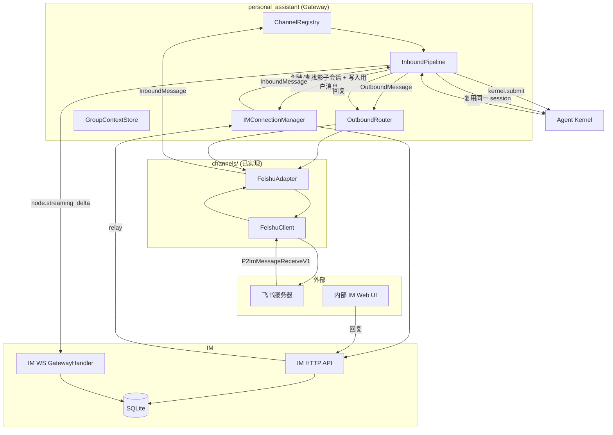
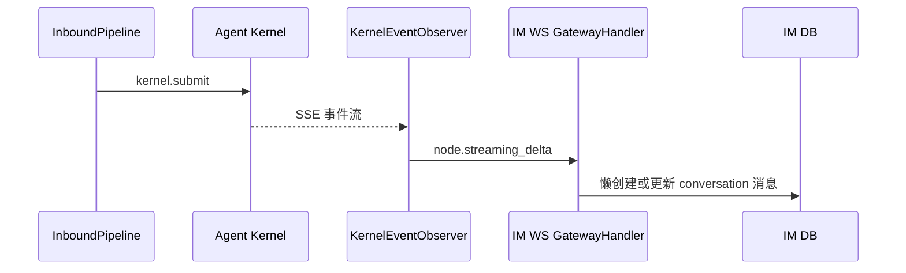

# feat-447: 飞书 channel 支持 — 技术方案

> 对齐: spec.md
>
> Unit branch: `unit/feat-447` (will be created by orchestrator)

## Changelog

## 现状分析

### 涉及范围

- `src/personal_assistant/channels/base.py` — `ChannelAdapter` Protocol、`InboundMessage` / `OutboundMessage` / `ReplyContext`。飞书 adapter 已实现，只读不改。
- `src/personal_assistant/channels/feishu_client.py` — 飞书 SDK 封装（WS 接收、REST 发送、reaction、错误分类）。已实现，M6 修复后稳定。
- `src/personal_assistant/channels/feishu_adapter.py` — 飞书消息收发 adapter（1:1 DM、群聊 @Bot、history buffer、ack reaction）。已实现，M6 修复后稳定。
- `src/personal_assistant/gateway/inbound_pipeline.py` — 入站消息处理、agent 路由、群聊 mention 门控、GroupContextStore buffer。已有 `_resolve_sender_label` 从 `metadata.sender_display_name` 取发送者名字；M7 需要新增 IM sync hook 和跨入口 session key 归一。
- `src/personal_assistant/gateway/outbound_router.py` — 当前按 `ReplyContext.channel_name` 原路发送，需要支持 per-run trigger_source 决定出口。
- `src/personal_assistant/gateway/session_keys.py` — `build_session_key` 当前使用 `channel_name`，需要与跨入口 session 复用要求对齐。
- `src/IM/domain/models.py` — `Conversation` 无外部 channel 来源标记；`Message.sender` 是 `Actor`，`Actor.display_name` 已存在但当前未持久化到 `messages` 表。
- `src/IM/infra/db.py` — `conversations` 表缺 `external_source` / `external_chat_id`；`messages` 表缺 `sender_display_name`。
- `src/IM/infra/repositories.py` — `ConversationRepository.create_conversation` 和 `MessageRepository.create_message` 需要扩展新字段。
- `src/IM/api/routes/web_im.py` / `src/IM/api/routes/messages.py` — IM conversation/message REST API 实际所在文件，需要新增外部 channel 会话 find-or-create 接口，并支持 `sender_display_name`。
- `src/IM/ws/gateway_handler.py` — relay payload 需要携带外部 channel 元数据与 `conversation_type`。
- `src/IM/application/web_im_service.py` — 需要新增外部 channel 会话创建/查找业务方法。
- `src/personal_assistant/main.py` / `src/personal_assistant/config/local_store.py` — Gateway 启动、channel 注册、配置解析。已稳定，本次需要补充 owner 飞书 open_id 配置（用于 IM 显示「你」）。
- `skills/feishu-doc.md` — M2/M3/M4 已落地，不改。

### 既有约束

- Gateway 只经 `agent.sdk` 持有内核，禁止 import 内核内部。
- `coding_cli` / `personal_assistant` 只能 import `agent.sdk`，禁止 import `agent.core` / `agent.platform`。
- IM 不调用 agent，只与用户和 personal_assistant 交互。
- channel adapter 是进程本地的，start/send/stop 是同步接口。
- 配置统一走 `~/.nano-assistant/config.yaml`。
- 在 worktree 内起任何监听端口的服务必须分配空闲端口并 kill 自己起的进程。

### 可复用能力

- **`ChannelAdapter` Protocol + FeishuAdapter/FeishuClient** — 飞书消息收发已完成。**用**。
- **`GroupContextStore`** — 群上下文 buffer。**用**。
- **`InboundPipeline` + `OutboundRouter`** — Gateway 核心消息处理。**用**，并扩展 IM 同步 hook。
- **IM `messages.py` REST API** — 已有创建消息接口，支持 `sender` actor-first payload。**扩展**以透传 `sender_display_name`。
- **IM `gateway_handler.py` lazy conversation 创建** — `_handle_streaming_delta` 的 `turn_start` 在 `conversation_id=""` 且 `to_user_id` 存在时会创建 direct chat。**扩展**为支持外部 channel 影子会话的预创建/查找。
- **kernel event observer (`node.streaming_delta`)** — agent 输出同步到 IM 已工作（M1 后修复）。**用**。

### 相关历史

- M1 `feat-447-M1`：飞书消息收发、多 Bot 路由、ack reaction、半边对话同步（仅 agent 回复）。
- M4/M5/M6：config 一致性、ack reaction、DM receive_id_type、重试计数器分离、registry 必填 group_context_store。
- `docs(feat-447): 补全外部 channel 同步到内部 IM 的 spec`：spec 更新，要求外部 channel 用户消息同步到 IM、群聊影子 group、发送者名字显示、按触发源路由 agent 回复、同一 kernel session 跨入口复用。

## 架构总览

**Before**：Gateway 飞书 channel 已能收发消息，agent 回复通过 `node.streaming_delta` 懒创建 direct chat 同步到 IM，但 IM 侧没有用户原始消息，呈现"半边对话"。

**After**：外部 channel 在 IM 中有独立的影子会话（1:1 为 `direct`，群聊为 `group`），用户消息完整同步到 IM；agent 回复按触发源路由——飞书触发的回复同时回写飞书和 IM，IM 触发的回复只留在 IM；同一 kernel session 跨入口复用，保证上下文连续。



## 关键决策

### 决策 1: 飞书事件连接方式

**选了 WebSocket 长连接模式**。

- **理由**: Gateway 跑在用户本机（NAT 后面），无公网 IP。WebSocket 由 Bot 主动连飞书服务器，零配置开箱即用。
- **拒绝**: Webhook 模式——需要公网 HTTPS 端点。
- **风险**: Gateway 重启时短暂断连，飞书 SDK 自动重连。

### 决策 2: 多 Bot 配置模型

**选了 `channels` 列表中每个飞书 Bot 作为一个独立 entry，name = `feishu:<agent_id>`**。

- **理由**: channel registry key、adapter name、agent 路由三者统一。
- **拒绝**: `channels.feishu.accounts` 子列表——冗余字段。
- **风险**: 一个 agent 只能绑一个飞书 bot。

### 决策 3: 云文档操作方案

**选了 feishu-cli 作为云文档操作路径**。

- **理由**: 飞书官方 CLI 封装全部 API + OAuth，agent 有 shell 能力即可调用。
- **拒绝**: 自建飞书 doc tools。
- **风险**: 外部依赖，需在 skill 中引导安装。

### 决策 4: Kernel session identity 与 channel 路由身份分离

**选了 kernel session key 统一基于 `{external_source}:{external_chat_id}:{agent_id}`，channel_name 仅用于 outbound 路由**。

- **理由**: spec 要求飞书入口和 IM 影子会话入口复用同一 kernel session。现状 `build_session_key` 使用 `{channel_name}:{external_chat_id}:{agent_id}`，导致飞书入口（`channel_name=feishu:<agent_id>`）与 IM relay 入口（`channel_name=web_relay`，`external_chat_id=IM conversation_id`）生成不同 key，无法复用 session。改用外部 channel 身份（external_source + external_chat_id）作为 session identity 后，两入口只要指向同一外部 chat，就能命中同一 session。
- **拒绝**: 维持现状 channel_name 参与 session key — 跨入口上下文连续验收必失败。
- **实现要点**:
  - `InboundMessage.metadata["external_source"]` 显式携带 `"feishu"`；IM relay 从影子会话 metadata 中回环相同的 `external_source`/`external_chat_id`。
  - `session_keys.build_session_key` 改为优先用 `metadata["external_source"]:message.external_chat_id:agent_id` 拼接。
  - `channel_name` 仍留在 `build_reply_context` 中，作为 outbound 路由身份（飞书 adapter 还是 web_relay adapter）。
  - 新增 `session_keys.build_external_session_key(external_source, external_chat_id, agent_id)` 供需要显式构造的场景使用。

### 决策 5: 群聊未 @ 消息的 history buffer 单一 owner

**选了未 @ 群聊消息统一由 InboundPipeline 负责 buffer 和 IM 同步，FeishuAdapter 不再本地 buffer**。

- **理由**: 当前 FeishuAdapter 未 @ 分支只调用 `_buffer_group_message` 不进 Pipeline；若 M7 要同步未 @ 消息到 IM，必须让 Pipeline 看到这条消息。若 adapter 既 buffer 又送 Pipeline，会造成下一次 @ 时上下文重复。统一由 Pipeline 作为唯一 owner，adapter 只负责把消息原样交给 Pipeline，Pipeline 决定是否 buffer、是否同步到 IM、是否触发 agent。
- **拒绝**: adapter 本地 buffer + 独立 sync hook — 同步和上下文两个职责跨 adapter/pipeline 重叠，未来新增 channel 会重复踩坑。
- **实现要点**:
  - FeishuAdapter 未 @ 分支生成 `InboundMessage` 并调用 `_on_inbound`，在 metadata 中标记 `"sync_only": true`。
  - InboundPipeline 识别 `sync_only`：仍走 `_should_process` 门控（返回 False），把消息 append 到对应 agent 的 GroupContextStore，并调用 IM sync hook 写入影子会话。
  - @Bot 分支继续走现有路径：先 drain buffer，再 submit run。

### 决策 6: 外部 channel 会话同步到内部 IM

**选了外部 channel 用户消息同步到 IM，agent 回复按触发源决定是否回写外部 channel**。

- **理由**: spec 明确要求用户在 IM 影子会话里的消息只进 kernel 上下文、不回写原 channel，否则飞书侧会看到 agent 突然回复的"灵异对话";外部 channel 用户消息必须出现在 IM 中。同一 kernel session 跨入口复用，保证上下文连续。
- **拒绝**: 完整双向镜像（IM 用户消息也回写外部 channel）——违反用户新明确的体验约束。
- **实现要点**:
  - Gateway 在 `InboundPipeline.handle_inbound` 早期调用 IM HTTP API 创建/查找外部 channel 影子会话并写入用户消息。
  - IM 同步必须是**非阻塞 best-effort**：调用超时或异常时捕获并记录，不阻塞飞书主路径，agent 仍正常回复。
  - IM 侧会话带 `external_source` + `external_chat_id` 标记，保持 `direct` / `group` 类型语义。
  - agent 回复继续通过现有 `node.streaming_delta` 同步到同一 conversation。
  - 每个 run 在 `run_context_store` 中记录 `trigger_source`（`feishu` / `im`）， outbound 阶段据此判断是否回写外部 channel。

### 决策 7: IM 会话来源标识

**选了在 `conversations` 表新增 `external_source` + `external_chat_id`，不改变现有 `direct` / `group` 类型**。

- **理由**: 语义清楚，1:1 私聊仍映射为 `direct`、群聊映射为 `group`，不破坏 IM 现有分支逻辑。
- **拒绝**: 新增 `external` 类型——需要改 Conversation enum 和多处 switch/case，回归面大。
- **拒绝**: 仅靠 title 区分——IM 无法识别来源，也无法做按 channel 过滤/管理。

### 决策 8: 外部发送者名字持久化

**选了在 `messages` 表新增 `sender_display_name` 列**。

- **理由**: 外部群成员名字需要随历史记录保留，metadata 透传不持久化会在历史加载时丢失。
- **拒绝**: 给每个外部发送者建 IM 用户——产生脏数据，且 owner 自己也要建 fake 用户才能显示「你」。

### 决策 9: IM 影子会话创建/查找接口

**选了新增专用 POST `/im/v1/conversations/external/find-or-create`**。

- **理由**: 幂等键 `(external_source, external_chat_id, agent_id, owner_id)` 明确，IM 负责去重和 participant 规则，Gateway 不维护 IM conversation_id → session_key 的本地映射。
- **拒绝**: Gateway 自己先查后创——竞态条件下可能重复创建。
- **拒绝**: Gateway 启动时预创建——外部群聊信息（群名、成员）事前未知。
- **补充**: 每次同步消息时都调用该接口，IM 侧命中已有会话时**同步更新 title**（如飞书群名已修改），保持两边会话名一致。
- **身份边界**: Request 体**不含 `owner_id`**。IM 数据面身份取自 Bearer token / `current_user.owner_id`（canonical IM spec 规定），`owner_id` 由 IM 侧派生，不允许请求参数作为信任锚。

### 决策 10: 按触发源路由 agent 回复

**选了 run 级 `trigger_source` 标记 + per-run `reply_context` 与 session key 分离**。

- **理由**: 与现有 IM → Gateway WebSocket relay 机制一致，无需新增 HTTP 接入面；通过 `trigger_source` 区分飞书触发和 IM 触发，避免 IM 主动对话时把回复回写到飞书。
- **拒绝**: Gateway 本地维护反向映射——重启丢失、多实例不共享。
- **拒绝**: IM 直接调 Gateway HTTP dispatch——增加新的集成面。
- **拒绝**: 不区分触发源、所有 IM 影子会话回复都回写外部 channel——违反"IM 主动沟通不回写飞书"的约束。
- **实现要点**:
  - 飞书入口：`trigger_source=feishu`，`reply_context.channel_name=feishu:<agent_id>`，agent 回复经 OutboundRouter 回写飞书，同时 kernel event observer 同步到 IM 影子会话。
  - IM 入口：`trigger_source=im`，`reply_context.channel_name=web_relay`，agent 回复只经 OutboundRouter 回写 IM，不回写飞书。
  - `session_key` 与 `reply_context` 解耦：session key 只由 `external_source:external_chat_id:agent_id` 决定，保证两入口复用同一 kernel session；reply_context 只决定当次 run 的回复出口。

### 决策 11: IM owner 在外部 channel 的消息显示为「你」

**选了每个飞书 channel settings 中显式配置 `ownerOpenId`，入站时对比 `sender_open_id`**。

- **理由**: 实现最简单稳定，MVP 可接受。飞书 open_id 在创建 Bot 后可在飞书管理后台查看。
- **拒绝**: IM 绑定飞书账号后动态查询——增加 IM 侧账号绑定流程，超出本期范围。
- **配置路径**: `channels[].settings.ownerOpenId`，与现有 `appId`/`appSecret`/`botOpenId` 同级。`config/local_store.py` 的 `_validate_feishu_settings` 增加校验，缺失时启动报错或警告（按项目配置策略）。
- **影响**: `sender_display_name` 在 owner 自己发消息时传 `"你"`（或前端根据 sender_user_id 渲染为「你」，但外部 channel 用户没有 IM user_id，所以必须由 Gateway 侧决定）。

### 决策 12: IM 群聊影子会话自动注入 @agent

**选了 Gateway 收到 IM 群聊影子会话的用户消息后，在提交给 kernel 前自动在文本前注入 `@<agent_id>`（或等效 mention 标记）**。

- **理由**: 外部 channel 群聊中，agent 的群聊提示词依赖 `@Bot` 来确认自己被点名；IM 群聊影子会话里没有真实的 @ 动作，需要 Gateway 侧补一个等效提及，保证 agent 按群聊路径响应。
- **拒绝**: 让 IM 前端强制用户手动 @agent——体验割裂，且影子会话里 agent 是主角，不应要求用户每次 @。
- **限制**: 1:1 影子会话是 direct 类型，不存在群聊门控，不需要注入。
- **relay metadata**: IM relay 消息给 Gateway 时，必须在 metadata 中携带 `conversation_type="group"`，WebRelayAdapter 据此设置 `InboundMessage.is_group=true`。当前 `create_message` 调 `enqueue_relay_all` 未传 conversation type，M7 需要补上。

### 1. 外部 channel 用户消息同步到 IM

```mermaid
sequenceDiagram
    participant U as 飞书用户
    participant FS as 飞书服务器
    participant FC as FeishuClient
    participant FA as FeishuAdapter
    participant PIPE as InboundPipeline
    participant IM as IM HTTP API
    participant DB as IM DB

    U->>FS: 发消息
    FS->>FC: P2ImMessageReceiveV1
    FC->>FA: FeishuMessageEvent
    alt 群聊未 @Bot
        FA->>PIPE: InboundMessage(metadata sync_only=true, trigger_source=feishu)
        PIPE->>PIPE: should_process=false; append GroupContextStore
        PIPE->>IM: POST /im/v1/conversations/external/find-or-create
        IM->>DB: 创建/查找影子会话并更新 title
        IM-->>PIPE: conversation_id, conversation_type
        PIPE->>IM: POST /im/v1/conversations/{id}/messages
        IM->>DB: 写入用户消息（带 sender_display_name）
    else 1:1 或群聊 @Bot
        FA->>PIPE: InboundMessage(metadata trigger_source=feishu)
        PIPE->>IM: POST /im/v1/conversations/external/find-or-create
        IM->>DB: 创建/查找影子会话并更新 title
        IM-->>PIPE: conversation_id, conversation_type
        PIPE->>IM: POST /im/v1/conversations/{id}/messages
        IM->>DB: 写入用户消息（带 sender_display_name）
        PIPE->>PIPE: 继续原有 agent 路由（drain buffer / submit run）
    end
```

### 2. Agent 回复同步到 IM（复用现有路径）



### 3. IM 影子会话消息进入 kernel 上下文（回复按触发源路由）

```mermaid
sequenceDiagram
    participant IMUI as 内部 IM Web UI
    participant API as IM HTTP API
    participant WS as IM WS GatewayHandler
    participant GWS as Gateway WS 客户端
    participant PIPE as InboundPipeline
    participant K as Agent Kernel
    participant OUT as OutboundRouter

    IMUI->>API: 在影子会话发消息
    API->>WS: relay message
    WS->>GWS: 转发用户消息 + conversation metadata(trigger_source=im, external_source, external_chat_id, agent_id, conversation_type)
    GWS->>PIPE: InboundMessage(channel_name=web_relay, metadata 含 external_source/external_chat_id/agent_id/trigger_source)
    PIPE->>PIPE: session_key=external_source:external_chat_id:agent_id; reply_context.channel_name=web_relay
    PIPE->>K: 复用同一 kernel session
    K-->>PIPE: 回复
    PIPE->>OUT: send_text(reply_context web_relay, trigger_source=im)
    OUT-->>IM: 回复同步到 IM 影子会话(不回写飞书)
```

### 关键数据结构

**InboundMessage 扩展字段**（Gateway → IM 同步用户消息时）：
- `metadata["sender_display_name"]` — 发送者显示名（owner 自己为 `"你"`）
- `metadata["external_source"]` = `"feishu"`
- `metadata["external_chat_id"]` — 飞书会话标识
- `metadata["agent_id"]` — 对应 agent
- `metadata["conversation_title"]` — 预计算的会话名（`agent名 · channel名` 或 `agent名 · 群名 · channel名`）
- `metadata["chat_name"]` — 飞书群名（群聊时）
- `metadata["is_group"]` — 是否群聊
- `metadata["sync_only"]` — `true` 表示该消息只同步到 IM / 进入 GroupContextStore，不触发 agent（用于未 @ 的群聊上下文消息）
- `metadata["trigger_source"]` — 触发来源，`"feishu"` 或 `"im"`，决定 agent 回复是否回写外部 channel

**Session / ReplyContext 新约定**:
- `session_key = f"{external_source}:{external_chat_id}:{agent_id}"` — 跨入口复用同一 kernel session。
- `reply_context.channel_name` — 当次 run 的回复出口：`feishu:<agent_id>` 或 `web_relay`。
- `reply_context.metadata["trigger_source"]` — 与 `run_context_store` 中的 `trigger_source` 一致，OutboundRouter 可据此二次确认出口（防御性）。

**IM `conversations` 表新增列**：
- `external_source TEXT` — 外部 channel 来源，如 `"feishu"`
- `external_chat_id TEXT` — 外部 channel 的 chat id
- 联合索引：`(external_source, external_chat_id, agent_id, owner_id)` 用于幂等查找（`owner_id` 由 IM 当前用户派生）

**IM `messages` 表新增列**：
- `sender_display_name TEXT` — 发送者显示名

**IM API 新增接口**：
- `POST /im/v1/conversations/external/find-or-create`
  - Request: `{ external_source, external_chat_id, agent_id, title, is_group, participant_ids, metadata }`（**不含 `owner_id`**，身份由 Bearer token/current_user 派生）
  - Response: `{ conversation_id, conversation_type, title }`

**IM → Gateway WebSocket relay 扩展字段**（影子会话消息）：
- `metadata["trigger_source"]` = `"im"` — 标识消息来自内部 IM，Gateway 收到后不回写外部 channel
- `metadata["external_source"]` / `metadata["external_chat_id"]` / `metadata["agent_id"]` — 复用同一 kernel session
- `metadata["conversation_type"]` = `"group" | "direct"` — WebRelayAdapter 据此设置 `InboundMessage.is_group`
- 群聊影子会话中，Gateway 解析到 `conversation_type=group` 时，在提交给 kernel 前自动在文本前注入 `@<agent_id>`，模拟外部群聊中的 @Bot 触发

**FeishuMessageEvent 扩展**：
- `sender_display_name: str` — 从飞书事件 `sender.name` 解析

**FeishuClient 扩展**：
- 新增 `get_chat_name(chat_id: str) -> str` 调用飞书 `GET /open-apis/im/v1/chats/{chat_id}` 获取群名。

## 契约层增量 (delta-spec)

- kernel: no spec delta
- im: `specs/im/spec.md` — ADDED:
  - **Requirement: 外部 channel 影子会话** — IM 支持创建带 `external_source` / `external_chat_id` 标记的会话，1:1 映射为 `direct`、群聊映射为 `group`。
  - **Requirement: 外部 channel 消息写入** — IM 支持写入来自外部 channel 的用户消息，并持久化 `sender_display_name`。
  - **Requirement: 外部 channel 会话元数据回环** — IM 通过 WebSocket relay 把影子会话的用户消息、外部 channel 元数据及触发来源标记转发给 Gateway。
- gateway: `specs/gateway/spec.md` — MODIFIED:
  - **Requirement: 飞书对话同步到内部 IM**（替换原 MVP 条目） — Gateway 把来自外部 channel 的用户消息、agent 回复写入内部 IM 影子会话；用户消息通过 `sync_only` 路径同步，不触发新 run。
  - **Requirement: 按触发源路由 agent 回复** — Gateway 解析 IM 转发的 conversation 元数据与触发来源，session identity 与 per-run reply_context 分离，按触发源决定是否把 agent 回复回写外部 channel。
- cli: no spec delta

## 风险与回退

| 风险 | 影响 | 应对 |
|---|---|---|
| IM 侧新增字段需要 DB 迁移 | 旧 DB 无列会报错 | 在 `db.py` 增加迁移函数，启动时自动执行 |
| Gateway 调用 IM HTTP API 失败（离线/超时/错误） | 用户消息同步不到 IM，飞书回复也可能被阻塞 | 同步调用必须加短超时 + 异常捕获并记录，绝不阻塞飞书主路径；失败时降级为"半边对话"，IM 恢复后由用户重新触发同步 |
| FeishuClient 获取群名需要额外 API 权限 | 群聊会话 title 无法生成 | 权限不足时 fallback 到 `agent名 · 群聊 · channel名` |
| ownerOpenId 配置错误 | owner 自己消息在 IM 不显示「你」 | 配置校验 + 文档说明 |
| 三个 Bot 同时连飞书 | 资源占用 | 每个 Bot 独立 WebSocket 连接，飞书 SDK 轻量 |
| 飞书 SDK 版本兼容 | lark-oapi API 变动 | 锁定 SDK 版本，单测覆盖 |

## Runbook for Reviewer

| 服务 | 停止命令 | 启动命令 | 健康检查 |
|---|---|---|---|
| IM (uvicorn) | `stop_pidfile .im.pid` | `PYTHONPATH=src python -m uvicorn IM.app:app --host 127.0.0.1 --port <IM_PORT>` | 访问 `http://127.0.0.1:<IM_PORT>/health` |
| Gateway (personal_assistant) | `stop_pidfile .gateway.pid` | `PYTHONPATH=src python -m personal_assistant.main --config <WT_CFG> --im-service-url http://127.0.0.1:<IM_PORT> --foreground --auto-bind` | 检查进程存活 + 飞书 Bot 在线状态 |

**Review 驱动方式**: 端到端真栈。 reviewer 在飞书客户端发消息，验证内部 IM 出现影子会话且内容一致；再在内部 IM 影子会话回复，验证回复只留在 IM、不回写飞书；最后回到飞书原对话发消息，验证 agent 能引用 IM 中的上下文。

## Milestones

| ID | 标题 | 依赖 | 并行组 | 范围 | 退出标准 |
|---|---|---|---|---|---|
| feat-447-M1 | feishu-messaging | — | A | channels/feishu_adapter.py, channels/feishu_client.py, config/local_store.py, main.py | 历史已合并：1:1 私聊收发正常；群聊 @Bot 触发回复；未 @ 不回复；未 @ 消息作为上下文；多 Bot 各自路由；agent 回复同步到 IM。 |
| feat-447-M2 | feishu-cli-integration | feat-447-M1 | B | skills/feishu-doc.md | 历史已合并：以用户身份创建/编辑/读取文档、创建文件夹、移动文件；未授权提示；API 失败反馈。 |
| feat-447-M3 | feishu-client-error-handling | feat-447-M2 | B | channels/feishu_client.py, channels/feishu_adapter.py, tests/unit/test_feishu_client.py, tests/unit/test_feishu_adapter.py | 历史已合并：send_message 错误分类（FeishuAPIError/FeishuAuthError）；429 指数退避重试、5xx 重试；adapter 结构化错误日志。 |
| feat-447-M4 | fix-critical-param-and-skill | feat-447-M3 | — | main.py, skills/feishu-doc.md, tests/unit/test_feishu_integration.py | 历史已合并：_build_channel_registry 传入 group_context_store 与 bot_open_id；build_runtime 调用点同步修复；skill 补充 mkdir/move 命令。 |
| feat-447-M5 | fix-config-consistency | feat-447-M4 | — | config/local_store.py, main.py, channels/feishu_adapter.py, tests/unit/test_feishu_*.py | 历史已合并：_parse_feishu_accounts 保留 botOpenId；feishu 顶层 enabled=false 跳过 accounts；统一 group buffer key 格式。 |
| feat-447-M6 | fast-lane-fixes | feat-447-M5 | — | channels/feishu_client.py, channels/feishu_adapter.py, main.py, tests/unit/test_feishu_*.py | 历史已合并：DM 回复使用 receive_id_type=open_id；5xx 与 429 重试计数器分离；registry 必填 group_context_store。 |
| feat-447-M7 | external-channel-full-sync | feat-447-M6 | A | src/IM/infra/db.py, src/IM/infra/repositories.py, src/IM/domain/models.py, src/IM/api/routes/web_im.py, src/IM/api/routes/messages.py, src/IM/application/web_im_service.py, src/IM/ws/gateway_handler.py, src/personal_assistant/channels/feishu_adapter.py, src/personal_assistant/channels/feishu_client.py, src/personal_assistant/gateway/inbound_pipeline.py, src/personal_assistant/config/local_store.py | [reviewer] 外部 1:1 会话在内部 IM 有独立会话（覆盖 Scenario: 外部 1:1 会话在内部 IM 有独立会话）;外部 1:1 用户消息同步到内部 IM（覆盖 Scenario: 外部 1:1 用户消息同步到内部 IM）;外部 1:1 agent 回复同步到内部 IM（覆盖 Scenario: 外部 1:1 agent 回复同步到内部 IM）;在内部 IM 回复不会回写飞书但上下文连续（覆盖 Scenario: 在内部 IM 回复不会回写飞书但上下文连续）;在内部 IM 群聊影子会话发消息自动触发 agent 回复（覆盖 Scenario: 在内部 IM 群聊影子会话发消息自动触发 agent 回复）;同一 kernel session 跨入口上下文连续（覆盖 Scenario: 同一 kernel session 跨入口上下文连续）;外部群聊在内部 IM 有独立 group 会话（覆盖 Scenario: 外部群聊在内部 IM 有独立 group 会话）;同一外部群绑定多个 agent 时生成多个独立会话（覆盖 Scenario: 同一外部群绑定多个 agent 时生成多个独立会话）;外部群聊消息显示原发送者名字（覆盖 Scenario: 外部群聊消息显示原发送者名字）;外部群聊中 IM owner 的消息显示为「你」（覆盖 Scenario: 外部群聊中 IM owner 的消息显示为「你」）;未 @ 的群聊上下文消息同步到内部 IM（覆盖 Scenario: 未 @ 的群聊上下文消息同步到内部 IM）;不 @ 也回的 agent 群聊消息全量同步（覆盖 Scenario: 不 @ 也回的 agent 群聊消息全量同步）;IM 离线时飞书对话不中断（覆盖 Scenario: IM 离线时飞书对话不中断）;[worker] IM DB migration 单测覆盖;`external/find-or-create` API 单测覆盖;sender_display_name 读写单测覆盖;Gateway 同步路径单测覆盖;全量非 e2e 测试无回归。 |
