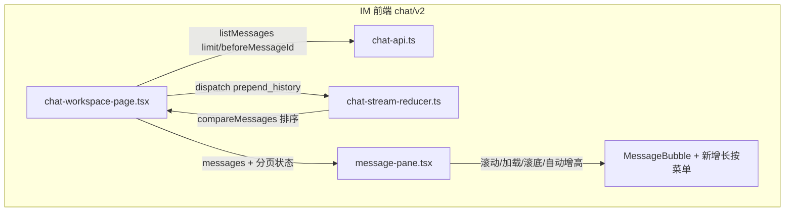
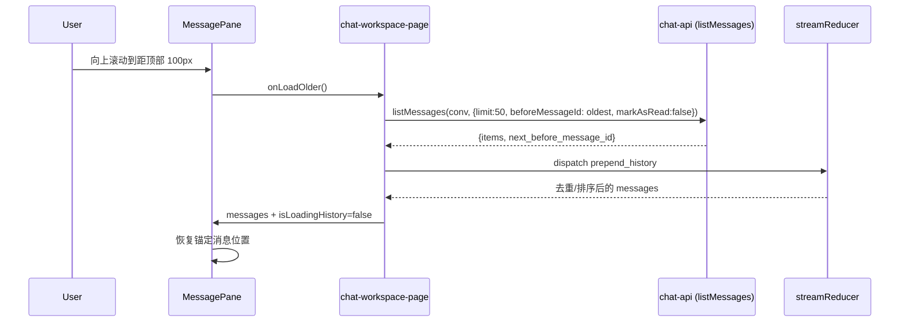

# feat-451: chat-history-pagination — 技术方案

> 对齐: spec.md

> Unit branch: `unit/feat-451` (will be created by orchestrator)

## Changelog

## 现状分析

### 涉及范围

- `src/IM/frontend/src/features/chat/v2/chat-workspace-page.tsx`
  - 当前 `messagesQuery` 只传 `{ markAsRead: true }`，未使用后端已支持的 `limit` / `before_message_id` 分页参数（`chat-api.ts:46`）。
  - 文件内联的 `streamReducer` 已管理「历史消息 + 实时 WS + 乐观插入 + token_usage 缓存」的合并；本单元在其内部新增 `prepend_history` 分支。`chat-stream-reducer.ts` 的 `applyWsEvent` 不改动。
- `src/IM/frontend/src/features/chat/v2/components/message-pane.tsx`
  - 当前滚动监听仅用于无条件自动滚底（`useEffect` 每次 `messages` 变化都 `scrollTop = scrollHeight`）。
  - `handleKeyDown` 用 `!isMobile` 显式禁用了移动端 Enter 发送（`message-pane.tsx:216`）。
  - composer `rows={isMobile ? 1 : 2}`，移动端固定 1 行（`message-pane.tsx:416`）。
  - fork 入口目前是 hover 才显示的 `.chat-bubble-fork` 按钮（CSS `1533-1581`），移动端不可见。
- `src/IM/frontend/src/features/chat/v2/chat-api.ts`
  - `listMessages` 已经支持 `limit` / `beforeMessageId` / `markAsRead`（`chat-api.ts:35-58`），后端返回 `{items, next_before_message_id}`。
- `src/IM/frontend/src/features/chat/v2/chat-stream-reducer.ts`
  - 纯 WS 事件 reducer；`applyWsEvent` 处理 WS 事件并 dedupe/排序。**本单元不改此文件。**
- `src/IM/frontend/src/styles/global.css` / i18n JSON
  - 需补充 loading indicator 样式与文案；需给 textarea 增加 auto-grow 样式支持。

### 既有约束

- 产品包（`IM` / `coding_cli` / `personal_assistant`）互不 import；本次只改 `IM` 前端。
- `chat v2` 是 M4 重写后的新表面，不再向 legacy `im-chat-api.ts` 回归。
- 后端 `/im/v1/conversations/{id}/messages` 契约稳定：默认 `limit=50`，返回 `next_before_message_id`（`docs/specs/im/spec.md`「会话与消息以 Actor 语义建模…」）。
- 自动滚底与阅读位置保持必须共存：新消息到达不能打断用户翻看历史。

### 可复用能力

- `listMessages` 的 limit/cursor 参数——直接用，不新造接口。
- `streamReducer` 的 `compareMessages` 排序与 `reset` 合并逻辑——扩展 `prepend_history` 分支即可，复用去重/排序/缓存恢复策略。
- `MessageBubble` 内已有的 fork 资格判定（`message-pane.tsx:473-478`）——复用；移动端把 fork 入口从 hover 按钮移到长按菜单，桌面端保留 hover 按钮不变。
- `useIsMobile` hook——复用来区分移动端 Enter 发送与桌面端 Shift+Enter 换行。

### 相关历史

- `feat-445` 在单聊里加了 message-level fork；当前入口是 hover 按钮，移动端不可达。
- `bugfix-419` 统一了消息排序（`compareMessages`）；分页 prepend 必须沿用同一排序不变量。
- `bugfix-367` 把 `permission_requests` 改成 list 并做了 reset 合并；`prepend_history` 的合并策略与 reset 一致即可。
- `feat-430` 在 composer 加了 slash picker；Enter 发送逻辑需要继续避让 slash picker 打开状态。

## 架构总览

改动只落在 IM 前端 `chat/v2` 一个垂直切片内：



本方案的核心思路：保留现有 `streamReducer` 作为「历史 + 实时」单一数据源，在其上叠加手动游标分页；分页状态、加载守卫、滚动位置保持集中在 workspace，MessagePane 只负责感知滚动并触发回调。

## 关键决策

### 决策 1: 分页状态用手动 cursor，不用 `useInfiniteQuery`

**选了在 `chat-workspace-page.tsx` 里手动维护 `oldestMessageId` / `hasMoreHistory` / `isLoadingHistory`。**

- **理由**：`streamReducer` 已经承担历史消息、WS 实时更新、乐观插入、token_usage 缓存的合并。改用 `useInfiniteQuery` 会把这些状态搬进 query cache，改动面大且容易破坏 WS 合并语义。后端游标简单（`before_message_id`），手动状态足够。
- **拒绝**：`useInfiniteQuery` —— 与现有 reducer 合并模型冲突，且更早的页不需要长期缓存。
- **风险**：没有缓存更早的页；用户重新打开会话或反复上下滚动会重复请求。该成本可接受，且未来如需缓存可再引入独立 query key。

### 决策 2: 滚动到距顶部约 100 px 时自动触发加载

**选了在 `chat-pane-messages` 的 `scroll` 事件里判断 `scrollTop < 100` 触发 `onLoadOlder()`。**

- **理由**：飞书/微信类体验的提前触发阈值大致在一屏的 10% 左右。当前消息列表内边距 20 px、gap 10 px，100 px 约等于一条消息的高度，能在用户到达真正顶部前开始请求，又不会因为微抖动频繁触发。
- **拒绝**：滚动到顶（`scrollTop === 0`）—— 会出现「到顶后停一下才加载」的顿挫感；IntersectionObserver —— 对单一固定容器属于过度设计，scroll 事件足够且更易测试。
- **风险**：快速小幅度抖动可能多次进入阈值；用 `isLoadingHistory` guard 规避。
- **实现注意**：若消息总数较少、列表内容未撑出滚动条，scroll 事件不会触发。组件 mount 或 resize 时，如容器未填满且 `hasMoreHistory` 为 true，应自动触发一次 `onLoadOlder()`，避免有更早消息却无法加载的死锁。

### 决策 3: 加载更早消息时保持阅读位置

**选了「快照顶部锚定消息 id → 加载完成后滚动到该元素」的方案。**

- **理由**：prepend 操作会让 DOM 顶部增加 N 条消息，简单保留 `scrollTop` 会让用户被推离原来的内容。记录加载前可视区顶部第一条消息的 `data-message-id`，加载后计算其新 `offsetTop` 并设回 `scrollTop`，可让该消息基本停在原位置。
- **拒绝**：`scrollTop += 新增高度` —— 只能近似，图片/工具面板展开高度变化后误差大；完全不处理 —— 体验差，违反 spec。
- **风险**：锚定消息如果在加载后被卸载（理论上不会，因为 prepend 不删老消息），则 fallback 到 `scrollTop` 增量。

### 决策 4: 自动滚底只在「最后一条消息 id 变化」或「用户已在底部附近」时触发

**选了在 MessagePane 内维护 `lastMessageIdRef`，仅当 `messages[messages.length-1].id` 变化时滚底；并辅以「距离底部 < 80 px 时流式增量也继续跟底」的兜底。**

- **理由**：新消息/乐观发送会改变最后一条 id，此时应滚底。prepend 老消息不改变最后一条 id，不会触发滚底。用户正在底部看最新输出时，流式 delta 也应跟底，用「接近底部」判断。
- **拒绝**：每次 `messages` 变化都滚底 —— 这是当前 bug，导致无法看历史。
- **风险**：用户手动滚动到中间后，新消息不会拉他走，符合 spec；若用户期望被拉回，那是另一个策略，本期不实现。

### 决策 5: 移动端 Enter 发送、桌面端保持 Enter 发送 / Shift+Enter 换行

**选了移除 `handleKeyDown` 中的 `!isMobile` 前置条件，让移动端与桌面端统一 Enter 发送；Shift+Enter 换行在移动端物理键盘上同样可用，但通常不会被触发。**

- **理由**：spec 要求移动端输入法回车发送。当前代码显式 `if (!isMobile && ...)` 是移动端不能发送的直接原因。
- **拒绝**：为移动端单独加一个发送按钮热键 —— 改动多且无必要；移动设备按 Shift+Enter 极罕见。
- **风险**：某些第三方输入法会把回车映射为「下一行」而非 keydown Enter；主流输入法（iOS/SwiftKey/Gboard）会触发 Enter。
- **实现注意**：`handleKeyDown` 中 slash picker 打开时有独立分支（`message-pane.tsx:211-213`）。移除外层 `!isMobile` 后，slash picker 打开状态下移动端 Enter 仍需被 slash picker 自己的键盘处理接管，避免直接发送消息。worker 应在 `message-pane.test.tsx` 中补充该场景测试。

### 决策 6: composer 随内容自动增高，最多 5 行（桌面）/ 4 行（移动）

**选了用 `textarea` 的 `scrollHeight` 动态计算 `rows`，配合 `max-h` 与 `overflow-y: auto`。**

- **理由**：当前移动端固定 1 行，长文本无法预览。auto-grow 是移动端 IM 标准行为。设置上限避免输入框无限撑高。
- **拒绝**：完全取消 `rows` 让 CSS 自己撑 —— 受控组件中 React 需要知道 `rows` 才能正确渲染 mirror 高亮层；用第三方 auto-resize 库 —— 增加依赖，项目当前无此类库。
- **风险**：mirror 高亮层的 `buildMirrorNodes` 需要与 textarea 行高保持同步；auto-grow 不改变 line-height，因此 mirror 仍可对齐。

### 决策 7: 消息气泡支持复制（长按/右键菜单），移动端 fork 入口放进长按菜单

**选了新增一个受控的 `MessageContextMenu` 组件：移动端用 touch 长按（约 600 ms）触发，桌面端用 `onContextMenu` 触发；菜单 always 包含「复制」，移动端单聊里 agent 完成回复额外显示「fork」。桌面端保留现有的 hover fork 按钮，不强制迁移到右键菜单。**

- **理由**：移动端没有 hover，必须把 fork 入口放进长按菜单才能可达；复制进菜单后可统一交互。桌面端 spec 没有要求取消 hover fork，保留它可减少用户可见的交互变更。
- **拒绝**：桌面端 fork 也迁移到右键菜单 —— 属于额外交互变更，超出 spec 范围；仅移动端加菜单、桌面端复制按钮 —— 桌面端没有自然的「复制」入口；菜单用浏览器原生 `contextmenu` 方案 —— 无法自定义样式与 fork 条件。
- **风险**：长按可能和滚动/工具面板展开冲突；通过 touch 坐标漂移阈值（> 10 px 取消）和 `preventDefault` 来抑制。桌面端右键点击选区文本时仍要弹出菜单，不破坏文本选择。移动端菜单的 fork 可用/禁用态、离线提示与现有 hover 按钮一致。

## 接口与数据流

### 新增 / 调整的 React props

`MessagePane` 新增：

```ts
hasMoreHistory?: boolean;
isLoadingHistory?: boolean;
onLoadOlder?(): void;
```

`chat-workspace-page.tsx` 新增本地状态：

```ts
const [oldestMessageId, setOldestMessageId] = useState<string | null>(null);
const [hasMoreHistory, setHasMoreHistory] = useState<boolean>(true);
const [isLoadingHistory, setIsLoadingHistory] = useState<boolean>(false);
```

`streamReducer` 新增 action：

```ts
| { type: "prepend_history"; messages: Message[] }
```

### 主流程时序图



### `prepend_history` 合并规则

1. 以 `action.messages` 为基底。
2. 对 `state.messages` 中已存在的同 id 消息，保留其 `token_usage`、`delivery_status`、`permission_requests`（与 `reset` 分支一致）。
3. 按 `compareMessages` 排序。
4. 不修改 `conversation_id`。

### 滚动位置保持数据流

```mermaid
flowchart TD
    A[开始加载更早消息] --> B{isLoadingHistory 由 false 变 true}
    B --> C[记录 anchorMessageId = 可视区顶部第一条消息 data-message-id]
    C --> D[记录 prevScrollTop / prevScrollHeight]
    D --> E[请求 listMessages]
    E --> F{isLoadingHistory 变 false}
    F --> G[查找 anchorMessageId 元素]
    G -->|找到| H[scrollTop = el.offsetTop]
    G -->|未找到| I[scrollTop = prevScrollTop + (newScrollHeight - prevScrollHeight)]
```

## 前端原型

- 原型文件: [prototype.html](prototype.html)
- 覆盖范围:
  - 聊天页三栏布局（桌面 sidebar + message pane / 移动单 pane）。
  - 消息列表顶部 loading indicator 与「没有更多消息」空态。
  - 长按/右键消息气泡弹出的操作菜单（复制 / fork）。
  - composer 多行自动增高与 Enter 发送效果。
  - 演示控件：手动触发「加载更早」与「新消息到达」，验证阅读位置保持 / 自动滚底策略。

## 契约层增量 (delta-spec)

本单元改动了 IM 终端产品（Web IM）的用户可观察行为，但未修改后端 HTTP/WS 契约，也未改变 `agent.sdk` / Gateway / CLI 的对外行为：

- kernel: no spec delta
- im: [specs/im/spec.md](specs/im/spec.md) —— 新增 6 条 ADDED Requirements，覆盖分页加载、智能滚底、移动端 Enter 发送、composer auto-grow、消息气泡菜单、桌面/移动一致性。
- gateway: no spec delta
- cli: no spec delta

## 风险与回退

| 风险 | 影响 | 应对 |
|---|---|---|
| 快速滚动触发多次 `onLoadOlder` | 重复请求 | `isLoadingHistory` guard；scroll listener 在 guard 内立即返回。 |
| 锚定消息位置恢复误差 | 用户感到列表跳动 | 优先按 id 找元素；fallback 用高度差；如仍不准可再调阈值。 |
| 长按菜单与滚动/选择文本冲突 | 误触发菜单或无法选中文本 | touch 漂移阈值 + 长按期间阻止默认滚动；桌面右键不拦截选区。 |
| 输入法 Enter 事件不一致 | 部分移动端输入法不发送 | 保留发送按钮作为兜底，不属于本次修复范围（spec 非目标）。 |
| auto-grow 后 mirror 高亮错位 | mention 高亮与文字不对齐 | 保持 textarea 与 mirror 相同 line-height/padding，用 `scrollHeight` 更新 rows 时不破坏 font metrics。 |

**回滚方案**：本 unit 改动集中在前端 `chat/v2` 三四个文件；如产生严重回归，可整体 revert 该 commit，后端不受影响。

## Runbook for Reviewer

本 unit 只改前端，常驻服务为 IM 后端（提供历史消息接口）。

| 服务 | 停止命令 | 启动命令 | 健康检查 |
|---|---|---|---|
| IM 服务 | `pkill -f "uvicorn IM.app:app"` | `PYTHONPATH=src python -m uvicorn IM.app:app --host 0.0.0.0 --port 8011` | `curl http://127.0.0.1:8011/im/v1/health` |
| 前端 dev server | `pkill -f "vite"` | `cd src/IM/frontend && npm run dev` | 打开 `http://127.0.0.1:5173` |

**Review 驱动方式**: 端到端真栈。reviewer 在浏览器打开聊天页，进入消息数 > 50 的会话，手动向上滚动触发加载，验证阅读位置保持、新消息滚底、移动端回车发送、长按菜单复制/fork 等行为。

## Milestones

| ID | 标题 | 依赖 | 并行组 | 范围 | 退出标准 |
|---|---|---|---|---|---|
| feat-451-M1 | impl | — | A | `src/IM/frontend/src/features/chat/v2/chat-workspace-page.tsx`<br>`src/IM/frontend/src/features/chat/v2/components/message-pane.tsx`<br>`src/IM/frontend/src/features/chat/v2/chat-stream-reducer.ts`<br>`src/IM/frontend/src/features/chat/v2/chat-api.test.ts`<br>`src/IM/frontend/src/features/chat/v2/chat-stream-reducer.test.ts`<br>`src/IM/frontend/src/features/chat/v2/components/message-pane.test.tsx`<br>`src/IM/frontend/src/styles/global.css`<br>`src/IM/frontend/src/i18n/en.json` / `zh.json` | `[reviewer]` 在消息数 > 50 的会话中向上滚动到接近顶部，更早消息自动加载并插入顶部，阅读位置保持稳定。<br>`[reviewer]` 新消息到达时，若用户已在底部则自动滚底，若正在看历史则不打扰。<br>`[reviewer]` 移动端在 composer 按 Enter 发送消息，输入框自动增高。<br>`[reviewer]` 长按/右键消息气泡出现「复制」菜单；移动端单聊里长按 agent 完成回复出现「fork」；桌面端保留 hover fork 按钮不变。<br>`[worker]` `npm run test`（vitest）在 `src/IM/frontend` 通过。<br>`[worker]` `npx tsc -b` 无类型错误。 |
